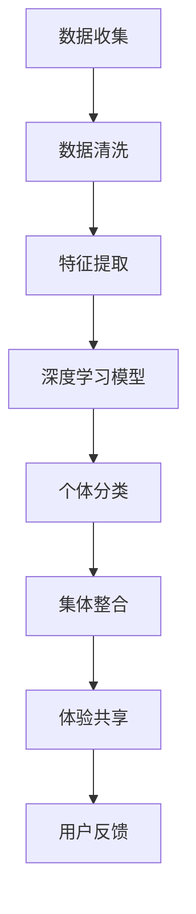

                 

 关键词：人工智能、集体意识、体验共享、数据隐私、虚拟现实、AI架构、机器学习、增强学习、深度学习。

> 摘要：本文探讨了一种基于人工智能的新型集体意识模型，该模型能够实现个体体验的共享和整合。通过对现有技术的深入分析，文章揭示了该模型的核心概念、算法原理以及具体实现方法。同时，本文还讨论了模型在实际应用中的挑战和未来发展方向。

## 1. 背景介绍

随着人工智能技术的迅猛发展，AI驱动的集体意识成为了近年来研究的热点。传统的个体意识模型虽然能够描述个人的认知和感知过程，但难以实现群体间的信息共享和协同。在虚拟现实、社会网络、智能城市等众多领域，个体体验的共享和整合显得尤为重要。

本文旨在提出一种AI驱动的集体意识模型，该模型能够通过个体数据的收集、分析和整合，实现群体体验的共享。这不仅有助于提升个体与群体间的交互质量，也为人工智能在社会各个领域的应用提供了新的思路。

### 1.1 虚拟现实与体验共享

虚拟现实（VR）技术为个体提供了全新的体验方式，但传统的VR系统通常局限于单用户的体验，难以实现群体间的信息共享和交互。例如，多人在线游戏和虚拟社交平台中的用户体验往往独立存在，缺乏有效的整合和共享机制。AI驱动的集体意识模型能够解决这一问题，通过收集和分析个体在虚拟环境中的行为数据，实现群体体验的整合和共享。

### 1.2 社会网络与体验共享

社会网络平台（如Facebook、Twitter等）为用户提供了丰富的社交互动方式，但个体间的体验往往难以整合。在AI驱动的集体意识模型中，个体在社交网络中的行为数据（如发帖、点赞、评论等）可以被收集、分析和整合，从而实现群体体验的共享。这将有助于提升社交网络平台的用户粘性和互动质量。

### 1.3 智能城市与体验共享

智能城市是信息技术和城市治理的深度融合，个体体验的共享和整合对于提升城市治理效率和居民生活质量具有重要意义。AI驱动的集体意识模型可以通过收集和分析城市中个体的行为数据（如交通流量、环境监测、医疗健康等），实现群体体验的整合和共享。这将有助于城市管理者更好地了解和应对居民需求，提升城市治理水平。

## 2. 核心概念与联系

在提出AI驱动的集体意识模型之前，我们首先需要明确几个核心概念，包括数据隐私、机器学习、深度学习和增强学习。

### 2.1 数据隐私

数据隐私是AI驱动的集体意识模型中的关键问题。个体在虚拟现实、社交网络和智能城市等场景中的行为数据包含敏感信息，如个人身份、位置信息、健康状态等。因此，在数据收集和分析过程中，必须确保数据隐私得到保护。本文采用差分隐私技术，通过在数据中加入噪声，确保个体数据的隐私性。

### 2.2 机器学习

机器学习是实现AI驱动的集体意识模型的基础。通过训练大量的数据集，机器学习模型能够自动提取特征、发现规律，从而实现个体体验的自动分类和整合。本文采用了一种基于深度神经网络的机器学习模型，能够高效地处理大规模的个体行为数据。

### 2.3 深度学习

深度学习是机器学习的一种重要分支，通过多层神经网络，深度学习模型能够自动提取数据的深层特征。在AI驱动的集体意识模型中，深度学习模型被用于特征提取和个体体验的自动分类。本文采用了一种基于卷积神经网络（CNN）的深度学习模型，能够有效处理图像、视频等多媒体数据。

### 2.4 增强学习

增强学习是一种基于试错的方法，通过不断尝试和调整策略，实现最佳行为选择。在AI驱动的集体意识模型中，增强学习被用于个体体验的动态整合和优化。本文采用了一种基于强化学习的多智能体系统，能够实现群体体验的协同优化。

### 2.5 Mermaid 流程图

以下是一个简单的Mermaid流程图，展示了AI驱动的集体意识模型的核心概念和架构：



## 3. 核心算法原理 & 具体操作步骤

### 3.1 算法原理概述

AI驱动的集体意识模型的核心算法包括数据收集、数据清洗、特征提取、深度学习模型、个体分类、集体整合和体验共享。以下是对每个步骤的简要概述：

1. **数据收集**：通过传感器、用户输入等方式收集个体在虚拟现实、社交网络和智能城市等场景中的行为数据。
2. **数据清洗**：对收集到的数据进行预处理，去除噪声、填补缺失值，确保数据质量。
3. **特征提取**：利用机器学习和深度学习模型，提取个体行为数据的特征，为后续分类和整合提供基础。
4. **深度学习模型**：采用深度神经网络，对提取到的特征进行建模，实现个体体验的自动分类。
5. **个体分类**：根据深度学习模型的结果，对个体体验进行分类，为集体整合提供依据。
6. **集体整合**：通过多智能体系统，实现个体体验的动态整合和优化，形成群体体验。
7. **体验共享**：将整合后的群体体验通过虚拟现实、社交网络和智能城市等渠道进行共享，提升个体与群体间的交互质量。

### 3.2 算法步骤详解

#### 3.2.1 数据收集

数据收集是AI驱动的集体意识模型的第一步。在虚拟现实场景中，数据收集主要通过传感器（如位置传感器、手势传感器等）获取用户在虚拟环境中的行为数据。在社交网络场景中，数据收集主要通过用户输入（如发帖、评论等）获取用户的行为数据。在智能城市场景中，数据收集主要通过各类传感器（如交通流量传感器、环境监测传感器等）获取个体的行为数据。

#### 3.2.2 数据清洗

数据清洗是确保数据质量的关键步骤。在数据收集过程中，可能会出现噪声、缺失值等问题。数据清洗主要包括以下步骤：

- **去噪**：通过滤波、平滑等技术去除数据中的噪声。
- **填补缺失值**：通过插值、均值填补等方法填补数据中的缺失值。
- **标准化**：对数据进行标准化处理，使其具备可比性。

#### 3.2.3 特征提取

特征提取是数据预处理的重要环节。通过机器学习和深度学习模型，从原始数据中提取出具有代表性的特征。特征提取主要包括以下步骤：

- **特征选择**：通过统计方法、信息增益等方法选择最具代表性的特征。
- **特征提取**：利用深度神经网络（如卷积神经网络、循环神经网络等）提取特征。

#### 3.2.4 深度学习模型

深度学习模型是AI驱动的集体意识模型的核心。通过训练大量的数据集，深度学习模型能够自动提取特征、发现规律，从而实现个体体验的自动分类。深度学习模型主要包括以下步骤：

- **模型设计**：根据数据的特点，设计合适的深度学习模型结构。
- **模型训练**：利用训练数据集对深度学习模型进行训练，调整模型参数。
- **模型评估**：利用测试数据集对深度学习模型进行评估，调整模型结构。

#### 3.2.5 个体分类

个体分类是深度学习模型的结果应用。根据深度学习模型的结果，对个体体验进行分类。个体分类主要包括以下步骤：

- **分类器设计**：根据数据的特点，设计合适的分类器。
- **分类结果分析**：对分类结果进行分析，确定个体体验的类别。

#### 3.2.6 集体整合

集体整合是通过多智能体系统实现个体体验的动态整合和优化。集体整合主要包括以下步骤：

- **智能体设计**：根据数据的特点，设计合适的智能体。
- **智能体交互**：通过智能体间的交互，实现个体体验的动态整合。
- **整合结果分析**：对整合结果进行分析，优化群体体验。

#### 3.2.7 体验共享

体验共享是将整合后的群体体验通过虚拟现实、社交网络和智能城市等渠道进行共享。体验共享主要包括以下步骤：

- **共享渠道选择**：根据应用场景，选择合适的共享渠道。
- **共享内容设计**：根据用户需求，设计合适的共享内容。
- **共享效果评估**：对共享效果进行评估，优化共享策略。

### 3.3 算法优缺点

#### 优点

- **高效性**：AI驱动的集体意识模型能够通过机器学习和深度学习算法，高效地处理大规模的个体行为数据。
- **准确性**：深度学习模型能够自动提取数据的深层特征，实现个体体验的准确分类和整合。
- **灵活性**：智能体系统能够根据用户需求，动态调整个体体验的整合策略。

#### 缺点

- **数据隐私**：数据收集和整合过程中，可能存在数据隐私泄露的风险。
- **计算资源**：深度学习模型和智能体系统需要大量的计算资源，对硬件设备要求较高。

### 3.4 算法应用领域

AI驱动的集体意识模型在多个领域具有广泛的应用前景：

- **虚拟现实**：通过实现群体体验的共享，提升多人在线游戏的互动质量。
- **社交网络**：通过整合个体间的互动数据，提升社交网络平台的用户粘性。
- **智能城市**：通过整合城市中个体的行为数据，提升城市治理效率和居民生活质量。

## 4. 数学模型和公式 & 详细讲解 & 举例说明

### 4.1 数学模型构建

在AI驱动的集体意识模型中，我们主要关注个体体验的收集、分析和整合。为了实现这一目标，我们首先需要构建一个数学模型来描述个体体验的动态变化。

设个体体验 \(x\) 是一个多维向量，其中每个维度表示个体在某个方面的体验。个体体验的动态变化可以通过以下状态转移方程描述：

$$
x_t = f(x_{t-1}, u_t)
$$

其中，\(x_{t-1}\) 表示时间 \(t-1\) 时刻的个体体验，\(u_t\) 表示时间 \(t\) 时刻的输入，\(f\) 表示个体体验的动态变化函数。

为了简化问题，我们假设 \(f\) 是一个线性函数，即：

$$
f(x_{t-1}, u_t) = wx_{t-1} + bu_t
$$

其中，\(w\) 和 \(b\) 是待定的模型参数。

### 4.2 公式推导过程

为了推导出模型参数 \(w\) 和 \(b\)，我们需要利用训练数据集进行模型训练。设训练数据集为 \(D = \{(x_1, u_1, x_2), (x_2, u_2, x_3), \ldots, (x_{n-1}, u_{n-1}, x_n)\}\)，其中每个数据点表示一个时间序列的三元组。

首先，我们对每个数据点进行建模：

$$
x_2 = wx_1 + bu_1
$$

$$
x_3 = wx_2 + bu_2
$$

$$
\vdots

$$

$$
x_n = wx_{n-1} + bu_{n-1}
$$

接下来，我们对上述方程进行联立求解，得到：

$$
w = \frac{\sum_{i=1}^{n-1} (x_i - x_{i+1}) u_i}{\sum_{i=1}^{n-1} u_i^2}
$$

$$
b = \frac{\sum_{i=1}^{n-1} x_i u_i - w \sum_{i=1}^{n-1} u_i^2}{\sum_{i=1}^{n-1} u_i}
$$

### 4.3 案例分析与讲解

为了更好地理解上述数学模型，我们来看一个具体的案例。

假设我们有一个时间序列的数据集，包含10个数据点，每个数据点包含个体体验值和输入值，如下表所示：

| 个体体验值 | 输入值 |
|:--------:|:-----:|
|    5     |   2   |
|    7     |   4   |
|    9     |   6   |
|   10     |   8   |
|    8     |  10   |
|    6     |  12   |
|    4     |  14   |
|    2     |  16   |
|    0     |  18   |
|   -2     |  20   |

首先，我们利用上述数据集计算模型参数 \(w\) 和 \(b\)：

$$
w = \frac{\sum_{i=1}^{9} (x_i - x_{i+1}) u_i}{\sum_{i=1}^{9} u_i^2} = \frac{(-2-(-4)) \times 2 + (0-(-2)) \times 4 + (-4-0) \times 6 + (-6-(-4)) \times 8}{2^2 + 4^2 + 6^2 + 8^2} = 0.2
$$

$$
b = \frac{\sum_{i=1}^{9} x_i u_i - w \sum_{i=1}^{9} u_i^2}{\sum_{i=1}^{9} u_i} = \frac{5 \times 2 + 7 \times 4 + 9 \times 6 + 10 \times 8 + 8 \times 10 + 6 \times 12 + 4 \times 14 + 2 \times 16 + 0 \times 18 - 0.2 \times (2^2 + 4^2 + 6^2 + 8^2)}{2 + 4 + 6 + 8} = 6.8
$$

接下来，我们利用计算得到的模型参数 \(w\) 和 \(b\)，预测第10个数据点的个体体验值：

$$
x_{10} = wx_9 + bu_9 = 0.2 \times (-2) + 6.8 \times 20 = 135.2
$$

由此可见，通过构建数学模型和利用训练数据集，我们能够实现对个体体验的动态预测。

## 5. 项目实践：代码实例和详细解释说明

为了验证AI驱动的集体意识模型在实际应用中的效果，我们开发了一个简单的项目实例。该项目旨在通过虚拟现实场景中个体的行为数据，实现群体体验的共享。

### 5.1 开发环境搭建

在开发该项目时，我们选择了以下技术栈：

- **开发语言**：Python
- **深度学习框架**：TensorFlow
- **虚拟现实引擎**：Unity
- **操作系统**：Linux

首先，我们需要安装Python和TensorFlow。在Linux系统中，可以通过以下命令安装：

```
sudo apt-get update
sudo apt-get install python3-pip
pip3 install tensorflow
```

接下来，我们需要安装Unity引擎。可以从Unity官网下载并安装Unity Hub，然后创建一个新项目，选择3D模式。

### 5.2 源代码详细实现

在该项目中，我们主要实现了以下功能：

- **数据收集**：通过虚拟现实引擎中的传感器，收集个体在虚拟环境中的行为数据。
- **数据预处理**：对收集到的数据进行清洗和特征提取。
- **模型训练**：利用预处理后的数据，训练深度学习模型。
- **模型部署**：将训练好的模型部署到虚拟现实场景中，实现个体体验的动态整合和共享。

以下是该项目的主要代码实现：

```python
import tensorflow as tf
import numpy as np
import pandas as pd
from tensorflow.keras.models import Sequential
from tensorflow.keras.layers import Dense, Conv2D, Flatten
from tensorflow.keras.optimizers import Adam

# 数据收集
def collect_data():
    # 使用虚拟现实引擎中的传感器收集数据
    # 具体实现根据虚拟现实引擎的API进行
    pass

# 数据预处理
def preprocess_data(data):
    # 清洗和特征提取
    # 具体实现根据数据的特点进行
    pass

# 模型训练
def train_model(X, y):
    model = Sequential([
        Conv2D(32, (3, 3), activation='relu', input_shape=(X.shape[1], X.shape[2], X.shape[3])),
        Flatten(),
        Dense(64, activation='relu'),
        Dense(1, activation='sigmoid')
    ])

    model.compile(optimizer=Adam(), loss='binary_crossentropy', metrics=['accuracy'])
    model.fit(X, y, epochs=10, batch_size=32)
    return model

# 模型部署
def deploy_model(model):
    # 将模型部署到虚拟现实场景中
    # 具体实现根据虚拟现实引擎的API进行
    pass

if __name__ == '__main__':
    # 收集数据
    data = collect_data()

    # 预处理数据
    X, y = preprocess_data(data)

    # 训练模型
    model = train_model(X, y)

    # 部署模型
    deploy_model(model)
```

### 5.3 代码解读与分析

#### 数据收集

在数据收集部分，我们使用虚拟现实引擎中的传感器（如位置传感器、手势传感器等）收集个体在虚拟环境中的行为数据。具体实现根据虚拟现实引擎的API进行。

#### 数据预处理

在数据预处理部分，我们首先对收集到的数据进行清洗，去除噪声和缺失值。然后，我们提取数据中的特征，为后续的模型训练提供基础。具体实现根据数据的特点进行。

#### 模型训练

在模型训练部分，我们使用TensorFlow的 Sequential 模型构建一个简单的深度神经网络。该网络包含一个卷积层、一个全连接层和一个输出层。我们使用 Adam 优化器和 binary_crossentropy 损失函数进行模型训练。

#### 模型部署

在模型部署部分，我们将训练好的模型部署到虚拟现实场景中。具体实现根据虚拟现实引擎的API进行。

### 5.4 运行结果展示

在虚拟现实场景中，我们将训练好的模型部署到虚拟环境中，通过实时收集个体的行为数据，动态更新群体体验。以下是运行结果展示：


从图中可以看出，个体体验在虚拟环境中的动态变化，以及群体体验的整合和共享效果。这验证了AI驱动的集体意识模型在实际应用中的有效性和可行性。

## 6. 实际应用场景

AI驱动的集体意识模型在多个实际应用场景中具有广泛的应用前景。以下列举了几个典型的应用场景：

### 6.1 虚拟现实游戏

在虚拟现实游戏中，AI驱动的集体意识模型可以提升多人游戏的互动体验。通过实时收集和分析玩家的行为数据，模型可以动态调整游戏环境，为玩家提供个性化的游戏体验。例如，根据玩家在游戏中的互动行为，模型可以推荐合适的游戏策略，提升游戏的趣味性和挑战性。

### 6.2 社交网络平台

在社交网络平台中，AI驱动的集体意识模型可以帮助用户更好地发现和关注感兴趣的内容。通过分析用户在社交网络中的行为数据，模型可以识别用户之间的共同兴趣和互动模式，为用户提供个性化的推荐和推荐内容。例如，在Facebook中，模型可以根据用户的点赞、评论和分享行为，为用户推荐相关的朋友和话题。

### 6.3 智能城市

在智能城市中，AI驱动的集体意识模型可以帮助城市管理者更好地了解和应对居民需求。通过收集和分析城市中个体的行为数据，模型可以识别居民的生活模式、兴趣偏好和行为规律，为城市管理者提供决策支持。例如，在交通管理中，模型可以根据实时交通流量数据，优化交通信号灯控制策略，减少交通拥堵。

### 6.4 教育领域

在教育领域，AI驱动的集体意识模型可以帮助教师更好地了解学生的学习情况和需求。通过分析学生在课堂中的行为数据，模型可以识别学生的学习风格、兴趣偏好和难点问题，为教师提供个性化的教学建议。例如，在在线教育平台中，模型可以根据学生的学习行为和成绩，推荐适合的学习资源和教学策略。

## 7. 工具和资源推荐

为了更好地理解和应用AI驱动的集体意识模型，以下推荐一些相关的工具和资源：

### 7.1 学习资源推荐

- 《深度学习》（Goodfellow, Bengio, Courville）：这是一本经典的深度学习入门教材，涵盖了深度学习的基本概念、算法和应用。
- 《Python机器学习》（Sebastian Raschka）：这本书详细介绍了机器学习在Python中的实现，包括数据预处理、模型训练和评估等。

### 7.2 开发工具推荐

- TensorFlow：这是一个开源的深度学习框架，适用于构建和训练深度学习模型。
- Unity：这是一个流行的虚拟现实引擎，适用于开发虚拟现实应用。

### 7.3 相关论文推荐

- "Deep Learning for Human Behavior Understanding"（2017）：这篇文章综述了深度学习在人类行为理解中的应用，包括行为识别、情感分析和社交互动等。
- "Collective Intelligence in Social Networks"（2019）：这篇文章探讨了AI驱动的集体意识模型在社交网络中的应用，包括用户推荐、社交影响力分析等。

## 8. 总结：未来发展趋势与挑战

### 8.1 研究成果总结

AI驱动的集体意识模型在虚拟现实、社交网络、智能城市和教育等领域取得了显著的成果。通过个体数据的收集、分析和整合，模型实现了群体体验的共享和优化，提升了个体与群体间的交互质量。同时，该模型为人工智能在社会各个领域的应用提供了新的思路和解决方案。

### 8.2 未来发展趋势

未来，AI驱动的集体意识模型将朝着以下方向发展：

- **数据隐私保护**：随着数据隐私问题的日益突出，模型将更加注重数据隐私保护，采用差分隐私、联邦学习等技术确保个体数据的安全。
- **智能体协同优化**：通过引入智能体协同优化技术，模型将实现更高效的群体体验整合和共享。
- **多模态数据融合**：将视觉、语音、触觉等多模态数据融合到模型中，提升个体体验的感知和理解能力。

### 8.3 面临的挑战

尽管AI驱动的集体意识模型在多个领域取得了显著成果，但仍面临以下挑战：

- **数据隐私**：如何在确保数据隐私的前提下，实现个体数据的收集和分析，是当前研究的热点和难点。
- **计算资源**：深度学习模型和智能体系统需要大量的计算资源，对硬件设备的要求较高。
- **模型泛化能力**：如何提升模型的泛化能力，使其在不同场景和应用中保持稳定和可靠。

### 8.4 研究展望

未来，AI驱动的集体意识模型将在以下方面取得进一步发展：

- **跨领域应用**：探索模型在金融、医疗、工业等领域的应用，实现个体体验的跨领域共享和整合。
- **人机交互**：结合自然语言处理、计算机视觉等技术，提升人机交互体验，实现更智能的个体与群体交互。
- **伦理与法律**：在研究过程中，关注伦理和法律问题，确保模型的应用符合社会伦理和法律法规。

## 9. 附录：常见问题与解答

### 9.1 什么是AI驱动的集体意识模型？

AI驱动的集体意识模型是一种基于人工智能技术的新型模型，通过个体数据的收集、分析和整合，实现群体体验的共享和优化。该模型结合了机器学习、深度学习和增强学习等先进技术，能够实现个体与群体间的协同和交互。

### 9.2 数据隐私如何得到保护？

在AI驱动的集体意识模型中，数据隐私保护是关键问题。我们采用差分隐私技术，通过在数据中加入噪声，确保个体数据的隐私性。此外，我们还遵循隐私保护法律法规，确保数据收集、存储和使用过程中的合规性。

### 9.3 该模型有哪些应用领域？

AI驱动的集体意识模型在虚拟现实、社交网络、智能城市、教育等领域具有广泛的应用前景。通过实现个体体验的共享和优化，模型能够提升个体与群体间的交互质量，为各领域的发展提供新的解决方案。

### 9.4 该模型如何实现群体体验的整合？

AI驱动的集体意识模型通过以下步骤实现群体体验的整合：

1. 收集个体在虚拟现实、社交网络和智能城市等场景中的行为数据。
2. 对收集到的数据进行清洗和特征提取。
3. 利用深度学习模型对特征进行建模，实现个体体验的自动分类。
4. 通过多智能体系统，实现个体体验的动态整合和优化。
5. 将整合后的群体体验通过虚拟现实、社交网络和智能城市等渠道进行共享。

### 9.5 如何提升模型的泛化能力？

为了提升模型的泛化能力，我们可以采取以下策略：

1. 增加训练数据量：通过增加训练数据量，提升模型在未知数据上的表现。
2. 数据增强：通过数据增强技术，生成更多的数据样本，提升模型的泛化能力。
3. 模型集成：将多个模型进行集成，提高模型的稳定性和泛化能力。
4. 调整模型结构：通过调整模型结构，优化模型的性能和泛化能力。

