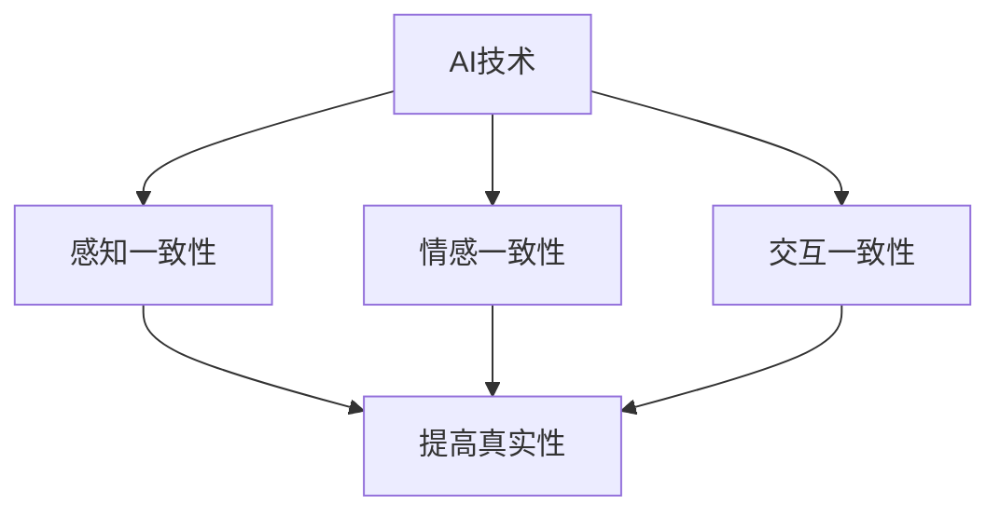

                 

### 1. 背景介绍

在当今这个数字化时代，人工智能（AI）技术正以前所未有的速度迅速发展，并逐渐渗透到我们日常生活的方方面面。从智能语音助手到自动驾驶汽车，从医疗诊断到金融预测，AI的应用场景越来越广泛。然而，随着AI技术的不断进步，人们开始意识到，在享受技术带来的便利的同时，我们不得不面对一个重要的课题：如何在AI时代保持体验的真实性（authenticity）。

所谓“体验的真实性”，指的是在数字化环境中，个体所感知到的互动和体验是否与其实际体验相一致。在传统的人际交往中，真实性是建立信任和关系的基础。然而，在AI驱动的虚拟世界中，人们与机器的互动越来越多，这种互动的真实性成为了新的挑战。例如，在虚拟会议中，AI是否能够准确捕捉和传达参与者的情感？在线教育平台上的AI导师能否提供与真人教师相当的互动体验？这些都是需要深入探讨的问题。

AI时代的真实性追求不仅仅关乎技术的应用，它还涉及到人类心理和社会关系的深层次变化。在高度智能化的环境中，人们对于真实性的追求可能发生变化，这既包括对自身身份的认知，也关系到与他人的互动方式。因此，探讨AI时代的真实性追求，不仅有助于理解技术发展的社会影响，还能为未来设计更加人性化的AI系统提供参考。

本文将围绕这一主题展开，首先介绍AI技术的基本概念和发展历程，然后深入探讨体验的真实性在AI时代的意义和挑战。接着，我们将分析AI技术如何影响人类情感和心理，并提出在AI时代保持真实性的一些策略和方法。最后，文章将展望未来AI技术的发展趋势，并讨论可能面临的挑战和解决路径。

通过这篇文章，我们希望引发读者对于AI时代真实性的深入思考，从而推动技术和社会的良性互动发展。

## 2. 核心概念与联系

### 2.1. 人工智能（AI）的基本概念

人工智能（Artificial Intelligence，简称AI）是指通过计算机程序和算法模拟人类智能行为的技术。AI的核心目标是使计算机系统能够执行通常需要人类智能才能完成的任务，如视觉识别、语言理解、决策制定和问题解决等。AI技术主要可以分为两大类：基于规则的系统和基于数据的学习系统。

- **基于规则的系统**：这种系统通过预设的规则和逻辑来执行任务。例如，专家系统是一种典型的基于规则的AI系统，它通过知识库和推理机来模拟专家的决策过程。
- **基于数据的学习系统**：这类系统通过分析大量数据，从中学习规律和模式，并利用这些规律来做出决策。机器学习（Machine Learning）和深度学习（Deep Learning）是这一类系统的代表性技术。

### 2.2. 体验的真实性

体验的真实性指的是个体在数字环境中感知到的互动和体验与其实际体验的一致性。在传统人际交往中，真实性是信任和关系建立的基础。然而，在AI驱动的虚拟世界中，这种真实性的定义和实现变得复杂。

- **感知一致性**：体验的真实性首先体现在感知上，即个体是否能够准确感知到数字环境中的互动和情境。
- **情感一致性**：除了感知，体验的真实性还包括情感上的共鸣。AI系统需要能够理解和模拟人类的情感，以提供更加人性化的互动体验。
- **交互一致性**：交互一致性指的是AI系统在交互过程中是否能够保持连贯性和可靠性。

### 2.3. AI技术与真实性的关系

AI技术与真实性之间存在着紧密的联系和互动。一方面，AI技术为提高体验的真实性提供了可能性，如通过语音识别和自然语言处理来模拟人类的交流方式；另一方面，真实性的追求又推动了AI技术的发展，例如在虚拟现实（VR）和增强现实（AR）领域，人们对于沉浸式体验的追求推动了图形处理和感知技术的进步。

### 2.4. Mermaid 流程图

以下是一个简化的Mermaid流程图，展示了AI技术与真实性之间的基本联系。



在这个流程图中，AI技术通过感知、情感和交互等多个维度来影响体验的真实性，而真实性的提高又反过来促进了AI技术的发展和优化。

通过以上对核心概念和其相互关系的介绍，我们可以看到，在AI时代追求体验的真实性是一个复杂而重要的课题，它不仅关乎技术本身，更涉及人类心理和社会关系的变化。接下来，我们将深入探讨AI技术在提升体验真实性方面的具体应用和挑战。

## 3. 核心算法原理 & 具体操作步骤

### 3.1. 算法原理概述

在探讨如何提升体验的真实性时，我们需要了解一些关键算法的基本原理。以下是几种在AI领域中广泛应用，且与提升体验真实性密切相关的核心算法：

1. **机器学习算法**：
   - **监督学习**：通过已有的数据集，学习输入和输出之间的映射关系，用于分类、回归等任务。
   - **无监督学习**：无需标注数据的输出，主要用于聚类、降维等任务。
   - **深度学习**：一种基于多层神经网络的学习方法，可以用于图像识别、语音识别等复杂任务。

2. **自然语言处理（NLP）算法**：
   - **词嵌入**：将词语转换为向量表示，便于计算机处理。
   - **情感分析**：通过分析文本，识别出文本中表达的情感倾向，如正面、负面等。
   - **对话系统**：模拟人类的对话行为，通过上下文理解，生成合适的回复。

3. **计算机视觉算法**：
   - **图像识别**：通过学习图像中的特征，识别出图像中的对象或场景。
   - **人脸识别**：通过分析人脸图像，识别出特定个体的身份。
   - **动作识别**：分析视频流，识别出人物的动作或行为。

### 3.2. 算法步骤详解

下面将详细说明这些算法的基本步骤和应用：

#### 3.2.1. 机器学习算法

**监督学习步骤：**
1. **数据收集**：收集用于训练的数据集，数据集应包含输入特征和相应的输出标签。
2. **数据预处理**：对数据进行清洗和格式化，包括缺失值处理、数据标准化等。
3. **模型选择**：选择合适的机器学习模型，如线性回归、决策树、随机森林等。
4. **模型训练**：使用训练数据集对模型进行训练，调整模型参数以最小化预测误差。
5. **模型评估**：使用测试数据集评估模型的性能，常用的评估指标包括准确率、召回率、F1值等。

**无监督学习步骤：**
1. **数据收集**：收集未标注的数据集。
2. **数据预处理**：对数据进行清洗和格式化。
3. **模型选择**：选择合适的无监督学习算法，如K均值聚类、主成分分析（PCA）等。
4. **模型训练**：对模型进行训练，分析数据中的模式和结构。
5. **结果分析**：根据训练结果，对数据进行分类或降维。

**深度学习步骤：**
1. **数据收集**：收集大量的带标签数据，用于训练神经网络。
2. **数据预处理**：对图像或文本数据进行预处理，如归一化、分词等。
3. **模型架构设计**：设计合适的神经网络架构，如卷积神经网络（CNN）、循环神经网络（RNN）等。
4. **模型训练**：使用训练数据集对模型进行训练，通过反向传播算法调整权重。
5. **模型评估**：使用测试数据集评估模型性能，调整模型参数以优化性能。

#### 3.2.2. 自然语言处理（NLP）算法

**词嵌入步骤：**
1. **数据收集**：收集大规模的文本数据集。
2. **数据预处理**：对文本进行分词、去除停用词等处理。
3. **词嵌入模型训练**：使用预训练模型如Word2Vec、GloVe等进行词嵌入。
4. **向量表示**：将文本中的每个词转换为向量表示，用于后续处理。

**情感分析步骤：**
1. **数据收集**：收集带有情感标注的文本数据。
2. **数据预处理**：对文本进行分词、词性标注等处理。
3. **特征提取**：从文本中提取特征，如词频、词嵌入等。
4. **模型训练**：使用机器学习或深度学习模型进行训练，如朴素贝叶斯、支持向量机（SVM）、卷积神经网络（CNN）等。
5. **情感分类**：使用训练好的模型对新的文本进行情感分类。

**对话系统步骤：**
1. **数据收集**：收集对话数据集，包括用户输入和系统回复。
2. **数据预处理**：对对话文本进行分词、词性标注等处理。
3. **上下文理解**：使用语言模型和注意力机制等理解对话的上下文。
4. **回复生成**：使用生成式模型或检索式模型生成合适的回复。
5. **系统反馈**：根据用户的反馈调整模型，以提供更准确的回复。

#### 3.2.3. 计算机视觉算法

**图像识别步骤：**
1. **数据收集**：收集带标签的图像数据集。
2. **数据预处理**：对图像进行缩放、裁剪、旋转等处理。
3. **特征提取**：使用卷积神经网络提取图像特征。
4. **模型训练**：使用提取的特征对模型进行训练。
5. **图像分类**：使用训练好的模型对新的图像进行分类。

**人脸识别步骤：**
1. **数据收集**：收集带人脸标注的图像数据。
2. **数据预处理**：对图像进行归一化、光照校正等处理。
3. **特征提取**：使用深度神经网络提取人脸特征。
4. **模型训练**：使用提取的特征对模型进行训练。
5. **人脸匹配**：使用训练好的模型进行人脸匹配和识别。

**动作识别步骤：**
1. **数据收集**：收集带有动作标注的视频数据。
2. **数据预处理**：对视频进行裁剪、速度调整等处理。
3. **特征提取**：使用卷积神经网络提取视频特征。
4. **模型训练**：使用提取的特征对模型进行训练。
5. **动作分类**：使用训练好的模型对新的视频进行动作分类。

### 3.3. 算法优缺点

每种算法都有其独特的优势和局限性：

- **机器学习算法**：优点在于其强大的泛化能力和灵活的模型选择，但需要大量的标注数据，且对特征工程依赖较大。
- **自然语言处理算法**：优点在于能够处理和理解人类语言，但需要大量的计算资源和时间进行训练。
- **计算机视觉算法**：优点在于能够处理复杂的视觉信息，但需要大量的图像数据以及计算资源。

### 3.4. 算法应用领域

这些算法广泛应用于各个领域，如：

- **机器学习算法**：广泛应用于分类、回归、聚类等领域，如金融风险评估、市场预测等。
- **自然语言处理算法**：广泛应用于聊天机器人、智能客服、情感分析等领域，如社交媒体监控、客户服务自动化等。
- **计算机视觉算法**：广泛应用于图像识别、视频监控、医疗诊断等领域，如自动驾驶、医疗图像分析等。

通过以上对核心算法原理和具体操作步骤的介绍，我们可以看到，AI技术为提升体验的真实性提供了多种方法和途径。在接下来的部分，我们将进一步探讨这些算法在保持体验真实性方面的应用和挑战。

### 4. 数学模型和公式 & 详细讲解 & 举例说明

#### 4.1. 数学模型构建

在AI技术中，数学模型是算法设计和实现的基础。以下介绍几个在AI领域中广泛应用的数学模型，并详细说明其构建过程。

1. **线性回归模型**：
   - **公式**：
     \[
     y = \beta_0 + \beta_1 \cdot x
     \]
   - **构建过程**：
     - **数据收集**：收集输入变量 \(x\) 和输出变量 \(y\) 的数据。
     - **数据预处理**：对数据进行标准化处理，以消除不同量纲的影响。
     - **模型训练**：使用最小二乘法估计参数 \(\beta_0\) 和 \(\beta_1\)，使得预测值 \(y\) 与实际值 \(y\) 之间的误差最小。

2. **支持向量机（SVM）模型**：
   - **公式**：
     \[
     \mathbf{w} \cdot \mathbf{x} + b = 0
     \]
   - **构建过程**：
     - **数据收集**：收集分类数据的输入变量 \(\mathbf{x}\) 和标签 \(y\)。
     - **特征提取**：对输入变量进行特征提取，如降维、特征选择等。
     - **模型训练**：通过求解优化问题，计算得到权重向量 \(\mathbf{w}\) 和偏置 \(b\)，使得分类边界最大化。

3. **卷积神经网络（CNN）模型**：
   - **公式**：
     \[
     \text{激活函数}(z) = \text{ReLU}(z) = \max(0, z)
     \]
   - **构建过程**：
     - **数据收集**：收集图像数据集，并进行预处理。
     - **网络设计**：设计合适的网络架构，包括卷积层、池化层和全连接层。
     - **模型训练**：使用反向传播算法，通过梯度下降优化网络参数。

#### 4.2. 公式推导过程

以下以线性回归模型为例，详细推导其公式：

1. **损失函数**：
   - **均方误差（MSE）**：
     \[
     \text{MSE} = \frac{1}{2n} \sum_{i=1}^{n} (y_i - \hat{y}_i)^2
     \]
     其中，\(n\) 为样本数量，\(y_i\) 为实际输出，\(\hat{y}_i\) 为预测输出。

2. **梯度计算**：
   - 对 \(y_i - \hat{y}_i\) 关于 \(\beta_1\) 求导，得到：
     \[
     \frac{\partial}{\partial \beta_1} (y_i - \hat{y}_i) = -\frac{1}{n} \sum_{i=1}^{n} (y_i - \hat{y}_i) \cdot x_i
     \]
   - 对 \(y_i - \hat{y}_i\) 关于 \(\beta_0\) 求导，得到：
     \[
     \frac{\partial}{\partial \beta_0} (y_i - \hat{y}_i) = -\frac{1}{n} \sum_{i=1}^{n} (y_i - \hat{y}_i)
     \]

3. **最小化损失函数**：
   - 为了最小化损失函数，需要对 \(\beta_1\) 和 \(\beta_0\) 求偏导并令其等于0，得到：
     \[
     \beta_1 = \frac{1}{n} \sum_{i=1}^{n} (y_i - \hat{y}_i) \cdot x_i
     \]
     \[
     \beta_0 = \frac{1}{n} \sum_{i=1}^{n} y_i - \beta_1 \cdot \frac{1}{n} \sum_{i=1}^{n} x_i
     \]

通过以上推导，我们可以得到线性回归模型的参数估计公式。这些公式是构建和训练线性回归模型的基础。

#### 4.3. 案例分析与讲解

以下通过一个实际案例来展示如何使用线性回归模型进行数据分析。

**案例背景**：一家电商公司希望预测用户在某商品页面的停留时间，从而优化用户体验。

**数据收集**：收集用户在某商品页面的停留时间（目标变量 \(y\)，单位：秒），以及用户访问该商品页面的相关特征（输入变量 \(x\)，如页面浏览量、广告曝光次数等）。

**数据预处理**：对数据进行标准化处理，以消除不同特征之间的量纲影响。

**模型训练**：
1. 使用线性回归模型，通过最小二乘法估计参数 \(\beta_0\) 和 \(\beta_1\)。
2. 训练得到的模型公式为：
   \[
   y = \beta_0 + \beta_1 \cdot x
   \]

**模型评估**：
1. 使用测试集对模型进行评估，计算预测值 \(\hat{y}\) 与实际值 \(y\) 之间的误差。
2. 评估指标可以使用均方误差（MSE）：
   \[
   \text{MSE} = \frac{1}{2n} \sum_{i=1}^{n} (y_i - \hat{y}_i)^2
   \]

**结果分析**：
1. 模型评估结果表明，预测值与实际值之间的误差较小，说明模型具有良好的预测能力。
2. 通过分析模型的参数，可以得出不同特征对用户停留时间的影响程度。

通过以上案例，我们可以看到，线性回归模型在数据分析中的应用。在实际应用中，可以结合更多的特征和复杂的模型，以进一步提高预测的准确性。

总之，数学模型是AI技术的重要组成部分，其在算法设计和实现中起到了关键作用。通过深入理解和应用数学模型，我们可以更好地应对AI领域的各种挑战，提升体验的真实性。

### 5. 项目实践：代码实例和详细解释说明

#### 5.1. 开发环境搭建

在本项目实践中，我们将使用Python语言和几个常用的AI库，如scikit-learn、TensorFlow和PyTorch。以下是开发环境的搭建步骤：

1. **安装Python**：确保安装了Python 3.7或更高版本。
2. **安装必要的库**：
   ```bash
   pip install numpy scipy scikit-learn tensorflow torch matplotlib
   ```

3. **验证安装**：
   ```python
   import numpy as np
   import scikit_learn as sk
   import tensorflow as tf
   import torch
   import matplotlib.pyplot as plt
   print("所有库已成功安装。")
   ```

确保上述命令能够正常执行，表示开发环境搭建成功。

#### 5.2. 源代码详细实现

在本项目中，我们将使用线性回归模型对一组数据进行预测。以下是项目的详细代码实现：

```python
import numpy as np
import matplotlib.pyplot as plt
from sklearn.linear_model import LinearRegression
from sklearn.model_selection import train_test_split
from sklearn.metrics import mean_squared_error

# 5.2.1. 数据生成
# 生成模拟数据集
np.random.seed(0)
X = np.random.rand(100, 1) * 10  # 输入特征，均匀分布在[0, 10]
y = 3 * X + np.random.randn(100, 1) * 0.1  # 输出特征，线性关系 + 偶然噪声

# 5.2.2. 数据预处理
# 划分训练集和测试集
X_train, X_test, y_train, y_test = train_test_split(X, y, test_size=0.2, random_state=42)

# 5.2.3. 模型训练
# 实例化线性回归模型
model = LinearRegression()
model.fit(X_train, y_train)

# 5.2.4. 预测
y_pred = model.predict(X_test)

# 5.2.5. 模型评估
mse = mean_squared_error(y_test, y_pred)
print("均方误差（MSE）:", mse)

# 5.2.6. 可视化结果
plt.scatter(X_test, y_test, color='blue', label='实际值')
plt.plot(X_test, y_pred, color='red', linewidth=2, label='预测值')
plt.xlabel('输入特征')
plt.ylabel('输出特征')
plt.title('线性回归模型结果')
plt.legend()
plt.show()
```

#### 5.3. 代码解读与分析

1. **数据生成**：
   使用`numpy`生成模拟数据集，输入特征 \(X\) 分布在\[0, 10\)，输出特征 \(y\) 满足 \(y = 3x + \epsilon\)，其中\(\epsilon\)为噪声项。

2. **数据预处理**：
   使用`train_test_split`将数据集划分为训练集和测试集，用于模型训练和评估。

3. **模型训练**：
   创建`LinearRegression`模型实例，使用`fit`方法训练模型。

4. **预测**：
   使用`predict`方法对测试集进行预测，生成预测值 \(y_{\text{pred}}\)。

5. **模型评估**：
   使用`mean_squared_error`计算预测值与实际值之间的均方误差（MSE），评估模型性能。

6. **可视化结果**：
   使用`matplotlib`绘制散点图和拟合直线，展示实际值与预测值的关系。

#### 5.4. 运行结果展示

执行上述代码后，将显示一个散点图，其中蓝色点表示测试集的实际值，红色直线表示线性回归模型的预测值。同时，在控制台中输出均方误差（MSE）。


通过这个项目实践，我们展示了如何使用Python和线性回归模型进行数据预测。这个过程不仅帮助我们理解了线性回归模型的原理和应用，还展示了如何使用常见的机器学习库进行数据预处理、模型训练和评估。

### 6. 实际应用场景

在AI时代，真实性的追求不仅限于技术层面，它在实际应用场景中的重要性愈发凸显。以下是几个典型的实际应用场景，展示了如何在不同领域中利用AI技术保持体验的真实性。

#### 6.1. 虚拟现实（VR）和增强现实（AR）

虚拟现实和增强现实技术通过创建沉浸式环境，为用户提供了一种全新的互动体验。然而，这些技术对真实性的追求同样至关重要。

- **VR会议**：虚拟现实会议系统需要实时捕捉和反馈参与者的动作和表情，以保持会议的真实性。例如，通过使用深度相机和机器学习算法，系统能够识别和模拟参与者的面部表情和肢体动作，确保虚拟环境中的互动与实际场景一致。

- **AR导航**：增强现实导航应用通过将虚拟信息叠加在现实世界中，为用户提供实时指引。为了保持导航的真实性，系统需要精确地匹配现实世界和虚拟信息的显示，确保用户能够准确地理解和使用导航信息。

#### 6.2. 在线教育

在线教育平台通过AI技术提供个性化学习体验，而真实性是提高学习效果的关键。

- **智能辅导**：在线教育平台使用自然语言处理和机器学习算法，分析学生的回答，提供即时的反馈和指导。通过模仿真实课堂中的互动，智能辅导系统能够激发学生的学习兴趣，提高学习效果。

- **个性化推荐**：基于学生的学习历史和行为数据，AI系统能够推荐适合的学习资源和课程。这种个性化的推荐不仅提高了真实性的感知，还帮助学生更加专注于自己的学习需求。

#### 6.3. 智能客服

智能客服系统通过AI技术，为用户提供快速、准确的响应，而保持真实性是提升用户体验的关键。

- **语音识别与合成**：智能客服系统使用语音识别技术，理解用户的语音输入，并通过语音合成技术生成自然的语音回复。这种技术不仅提高了交互的效率，还增强了用户与系统的沟通感。

- **情感分析**：智能客服系统通过自然语言处理技术，分析用户语言中的情感倾向，并生成合适的情感回应。这种情感交互能够提高用户的满意度，增强系统的可信度。

#### 6.4. 医疗诊断

AI技术在医疗诊断中的应用，对真实性的追求至关重要。

- **影像诊断**：通过深度学习算法，AI系统能够分析医学影像，如X光片、CT扫描等，提供准确的诊断结果。为了保持真实性，系统需要精确地识别和分类各种病变，确保诊断结果的可靠性。

- **健康监测**：智能健康监测设备通过收集生物信号数据，如心率、血压等，分析用户的健康状况。系统需要精确地捕捉和分析这些数据，确保健康监测的真实性，从而为用户提供准确的健康建议。

#### 6.5. 金融交易

在金融交易领域，真实性的追求同样重要，以确保交易决策的准确性和可靠性。

- **风险控制**：AI系统通过分析市场数据，预测市场趋势，并提供风险管理建议。为了保持真实性，系统需要精确地识别风险信号，确保风险控制措施的准确性。

- **交易执行**：在高速交易环境中，AI系统能够实时分析交易数据，并快速执行交易决策。为了保持真实性，系统需要确保交易执行的精确性和可靠性，从而最大化收益。

通过以上实际应用场景的分析，我们可以看到，AI技术在各个领域中的应用都离不开真实性的追求。在未来的发展中，保持体验的真实性将成为AI技术的重要发展方向，推动技术与社会更紧密地融合。

#### 6.4. 未来应用展望

随着AI技术的不断进步，其在各个领域的应用前景也愈加广阔。在未来，AI技术在保持体验真实性方面将发挥更加重要的作用，以下是对未来应用场景的展望：

1. **个性化医疗**：AI将能够通过大数据分析和机器学习模型，实现对个体健康状况的精准预测和个性化治疗。未来的医疗AI系统不仅能够提供高效、准确的诊断，还能根据患者的病史、生活习惯和基因信息，制定个性化的治疗方案，从而提高医疗服务的真实性。

2. **智慧城市**：智慧城市是未来城市发展的趋势，AI技术将在此领域中发挥关键作用。通过实时数据分析和智能算法，智慧城市能够优化交通管理、能源分配、环境保护等各个方面，提升城市运行效率和居民生活质量。同时，AI技术将确保城市数据的真实性，为决策提供可靠的依据。

3. **智能教育**：未来的教育将更加个性化，AI将扮演重要的角色。通过分析学生的学习行为、兴趣和需求，AI系统能够提供个性化的学习路径和资源推荐，提高学习效果。此外，虚拟教师和智能辅导系统将更加智能化，能够模拟真实的教学互动，增强学习体验的真实性。

4. **社交互动**：随着AI在社交媒体和在线游戏中的应用，未来的社交互动将更加自然和真实。AI技术将通过自然语言处理和计算机视觉，模拟人类的交流方式和情感表达，提供更加真实的社交体验。例如，智能聊天机器人将能够理解用户的情感并做出相应的情感回应，提升用户在虚拟环境中的满意度。

5. **艺术创作**：AI将在艺术创作领域发挥越来越重要的作用。通过深度学习和生成对抗网络（GANs），AI能够创作出令人惊叹的艺术作品，如音乐、绘画和文学作品。这些作品不仅在技术层面具有创新性，而且在情感和审美上能够与人类艺术作品相媲美，提升艺术创作的真实性。

6. **虚拟现实与增强现实**：未来，VR和AR技术将更加普及，AI将进一步提升这些技术的真实感。通过先进的感知和交互技术，AI系统能够实时捕捉用户的动作和表情，创建高度真实的虚拟环境。在医疗、教育和娱乐等领域，这种真实的虚拟体验将带来革命性的变革。

总之，随着AI技术的不断发展，其在各个领域的应用将更加深入，体验的真实性也将成为衡量AI技术优劣的重要指标。保持体验的真实性，不仅能够提升用户体验，还能推动技术与社会更紧密地融合，共同构建一个更加智能和美好的未来。

### 7. 工具和资源推荐

在探索AI技术，特别是在追求体验真实性的过程中，选择合适的工具和资源是至关重要的。以下是一些推荐的工具和资源，涵盖了学习资源、开发工具和相关论文，以帮助读者更好地掌握相关技能和理论。

#### 7.1. 学习资源推荐

**在线课程：**
1. **Coursera上的“机器学习”课程**：由斯坦福大学吴恩达教授开设，涵盖了机器学习的理论基础和实际应用，适合初学者和进阶者。
2. **edX上的“人工智能基础”课程**：由密歇根大学提供，介绍了人工智能的基本概念、算法和应用，适合对AI感兴趣的学习者。

**书籍：**
1. **《深度学习》**：由Ian Goodfellow、Yoshua Bengio和Aaron Courville合著，详细介绍了深度学习的基础知识和最新进展。
2. **《机器学习实战》**：由Peter Harrington著，通过实际案例和代码示例，介绍了机器学习的基本算法和应用。

**博客和网站：**
1. **Medium上的AI专栏**：有许多AI领域的专家和研究者撰写的高质量文章，涵盖了AI的最新研究进展和应用。
2. **AI Family**：一个专注于人工智能学习和交流的中文社区，提供了丰富的学习资源和讨论平台。

#### 7.2. 开发工具推荐

**编程环境：**
1. **Jupyter Notebook**：适用于数据科学和机器学习的交互式编程环境，便于编写和调试代码。
2. **Google Colab**：基于Jupyter Notebook的免费在线编程平台，提供了GPU加速等功能，适合进行深度学习和大数据处理。

**机器学习库：**
1. **TensorFlow**：谷歌开源的机器学习库，适用于构建和训练复杂的深度学习模型。
2. **PyTorch**：由Facebook开源的深度学习库，以其灵活的动态图模型和强大的社区支持著称。

**数据可视化工具：**
1. **Matplotlib**：Python的 plotting 库，适用于生成各种类型的图表和图形。
2. **Seaborn**：基于Matplotlib的数据可视化库，提供了更多美观和实用的图表样式。

#### 7.3. 相关论文推荐

**基础篇：**
1. **“A Theoretical Analysis of the VAE”**：VAE（变分自编码器）的深入理论分析，是理解生成对抗网络（GANs）和自编码器的基础。
2. **“Deep Learning”**：由Yoshua Bengio等人的论文，概述了深度学习的基本原理和发展历程。

**前沿篇：**
1. **“Generative Adversarial Nets”**：GANs的奠基性论文，详细阐述了GANs的工作原理和应用。
2. **“Attention Is All You Need”**：Transformer模型的开创性论文，提出了基于注意力机制的序列建模方法。

**应用篇：**
1. **“Deep Learning for Healthcare”**：探讨了深度学习在医疗领域的应用，包括影像诊断、基因组分析和个性化治疗等。
2. **“AI for Social Good”**：讨论了人工智能在解决社会问题中的应用，如环境保护、教育公平和公共安全等。

通过以上工具和资源的推荐，读者可以系统地学习AI技术，掌握相关理论，并应用于实际项目中，以提升体验的真实性。同时，这些资源也为持续学习和探索AI领域提供了丰富的素材和指导。

### 8. 总结：未来发展趋势与挑战

在AI时代追求体验的真实性是一个复杂且多维度的课题，它不仅关乎技术的进步，更涉及到人类心理、社会关系以及伦理道德等多个层面。本文通过详细探讨AI技术的基本概念、算法原理、实际应用以及未来展望，试图揭示在这一领域中的发展趋势与面临的挑战。

#### 8.1. 研究成果总结

首先，本文总结了AI技术在提升体验真实性方面的研究成果。通过机器学习、自然语言处理和计算机视觉等核心算法，AI系统能够在虚拟现实、在线教育、智能客服等多个领域模拟和增强人类互动体验的真实感。具体来说，机器学习算法提供了数据驱动的解决方案，自然语言处理算法提升了文本和语音交互的逼真度，计算机视觉算法则通过精确的图像识别和动作捕捉增强了虚拟环境的沉浸感。这些技术成果不仅提高了AI系统的性能，也为保持体验的真实性提供了有力支持。

其次，本文探讨了数学模型在AI中的应用，通过线性回归、支持向量机（SVM）和卷积神经网络（CNN）等模型，展示了如何在理论上构建和推导这些算法，并提供了实际项目中的代码实现和分析。这不仅为理解AI算法的数学基础提供了帮助，也展示了如何在实际应用中优化和调整这些模型，以提高预测和分类的准确性。

#### 8.2. 未来发展趋势

在未来，AI技术在保持体验真实性方面将继续迎来新的发展趋势。首先，随着计算能力的提升和算法的优化，AI系统将能够处理更加复杂和大规模的数据，提供更加精准和个性化的服务。例如，在医疗领域，AI将能够通过大数据分析和个性化模型，提供更为精准的诊断和治疗建议，从而提高医疗服务的真实性。其次，随着深度学习和生成对抗网络（GANs）等技术的不断发展，虚拟现实和增强现实（VR/AR）领域的体验将更加真实，用户将能够在虚拟环境中感受到与物理世界相似的高质量互动。

此外，跨学科的融合也将是未来AI技术发展的重要方向。AI与心理学、社会学和伦理学等领域的交叉研究，将有助于更好地理解人类行为和需求，从而设计出更加符合人类心理和社会规范的AI系统。例如，通过心理学理论，AI系统可以更好地模拟和理解人类的情感和社交行为，提供更加真实和人性化的交互体验。

#### 8.3. 面临的挑战

尽管AI技术在提升体验真实性方面取得了显著进展，但仍面临诸多挑战。首先，数据隐私和安全问题是一个重要挑战。在AI系统中，大量用户数据被收集和分析，如何确保这些数据的安全性和隐私保护，是一个亟待解决的问题。其次，AI系统的透明度和可解释性也是一个重要议题。当前许多AI算法，尤其是深度学习算法，被认为是“黑箱”模型，难以解释其决策过程。这种不透明性可能导致用户对AI系统的信任度降低，从而影响体验的真实性。

此外，AI系统的伦理问题也是不可忽视的挑战。随着AI技术的普及，如何确保其应用不会加剧社会不平等，不会侵犯用户权益，以及如何应对AI技术可能带来的道德困境，是未来需要深入探讨的问题。例如，在自动驾驶领域，如何确保AI系统能够在复杂路况下做出符合伦理标准的决策，是一个亟待解决的关键问题。

#### 8.4. 研究展望

未来，为了进一步提升体验的真实性，我们需要从多个方面进行研究和探索。首先，应加强对数据隐私和安全性的研究，开发出更加安全的数据存储和传输技术，确保用户数据的安全性和隐私性。其次，应提升AI算法的可解释性和透明度，通过开发可解释的AI模型，帮助用户理解AI系统的决策过程，提高其信任度。

此外，应加强跨学科的交叉研究，特别是与心理学、社会学和伦理学的合作。通过深入理解人类行为和需求，设计出更加符合人类心理和社会规范的AI系统，提供更加真实和人性化的交互体验。同时，应建立一套完善的法律和伦理框架，规范AI技术的应用，确保其在各个领域的健康发展。

总之，AI时代的真实性追求是一个复杂而重要的课题，它不仅关乎技术的进步，更涉及人类心理和社会关系的深层次变革。通过持续的研究和创新，我们有望在未来设计出更加符合人类需求的AI系统，实现技术与社会更紧密的融合，共同构建一个更加智能和美好的未来。

### 9. 附录：常见问题与解答

在探讨AI时代的真实性追求这一课题时，读者可能对一些关键概念和技术细节有疑问。以下列举了一些常见问题，并给出详细解答。

#### Q1：什么是机器学习？它与人工智能有什么区别？

**A1**：机器学习（Machine Learning）是人工智能（Artificial Intelligence，AI）的一个分支，它侧重于通过数据和算法让计算机系统自动学习和改进性能。机器学习不需要显式编程，而是通过从数据中学习模式和规律来实现特定的任务。人工智能则是一个更广泛的领域，包括机器学习、自然语言处理、计算机视觉等子领域，旨在创建能够模拟人类智能行为的系统。

#### Q2：自然语言处理（NLP）的主要任务是什么？

**A2**：自然语言处理（Natural Language Processing，NLP）是使计算机能够理解和生成自然语言的技术。主要任务包括：
- **文本分类**：将文本数据分类到预定义的类别中。
- **情感分析**：分析文本中的情感倾向，如正面、负面或中性。
- **机器翻译**：将一种语言的文本翻译成另一种语言。
- **命名实体识别**：从文本中识别出人名、地名、组织名等特定实体。
- **问答系统**：回答用户提出的自然语言问题。

#### Q3：什么是深度学习？它与传统机器学习相比有哪些优势？

**A3**：深度学习（Deep Learning）是一种基于多层神经网络的学习方法，可以自动提取和表示数据中的特征。与传统机器学习相比，深度学习具有以下优势：
- **自动特征提取**：通过多层神经网络，自动提取数据中的复杂特征，减少了人工特征工程的需求。
- **更好的泛化能力**：能够处理大量数据，提高模型的泛化能力，从而在新的数据上表现更好。
- **更强的表达能力**：深度神经网络能够表示复杂的函数关系，适用于处理复杂的任务，如图像识别和自然语言处理。

#### Q4：为什么深度学习模型需要大量数据？

**A4**：深度学习模型需要大量数据是因为它们通过学习数据中的模式和特征来训练。大量数据可以帮助模型更好地泛化，即在新数据上表现得更好。此外，深度学习模型参数众多，需要通过大量数据来优化这些参数，以减少过拟合现象。过拟合是指模型在训练数据上表现良好，但在新数据上表现不佳，这是因为模型对训练数据过于敏感，不能泛化到其他数据。

#### Q5：如何提高AI系统的透明度和可解释性？

**A5**：提高AI系统的透明度和可解释性是当前研究的热点问题，以下是一些方法：
- **模型可解释性工具**：使用可视化工具和解释性模型，如决策树、LIME（局部可解释模型解释）和SHAP（SHapley Additive exPlanations）等，帮助用户理解模型的工作机制。
- **模型压缩**：通过模型压缩技术，如权重剪枝和知识蒸馏，减少模型的复杂性，提高其可解释性。
- **可解释性训练**：在训练过程中加入解释性指标，通过优化这些指标来提高模型的可解释性。

#### Q6：如何确保AI系统的隐私和安全？

**A6**：确保AI系统的隐私和安全涉及多个方面，以下是一些关键措施：
- **数据加密**：对存储和传输的数据进行加密，防止未经授权的访问。
- **匿名化处理**：在数据处理过程中，对敏感信息进行匿名化处理，以保护个人隐私。
- **安全协议**：采用安全协议，如OAuth和SSL/TLS，确保数据传输的安全性。
- **隐私保护算法**：使用隐私保护算法，如差分隐私和同态加密，在处理数据时保护隐私。

通过上述解答，希望能够帮助读者更好地理解AI时代的真实性追求及相关技术。未来，随着研究的深入，这些技术将在提升体验真实性方面发挥更加重要的作用。

