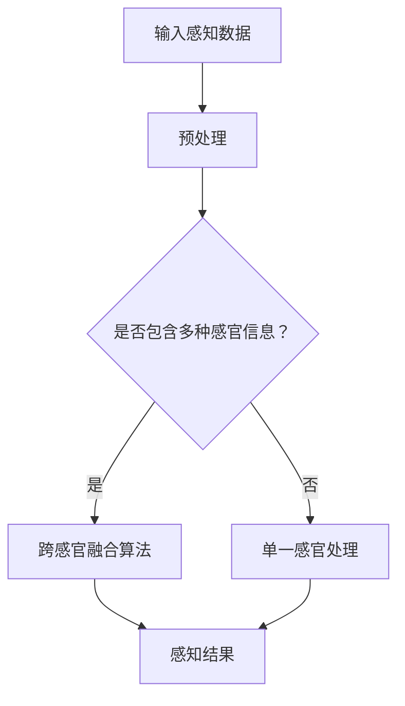

                 

关键词：AI感知、跨感官融合、全方位感知、体验优化、算法原理

> 摘要：本文探讨了人工智能（AI）在驱动全方位感知方面的最新进展，特别是如何实现跨感官融合以优化用户体验。通过深入分析核心概念、算法原理、数学模型以及实际应用，本文旨在为读者提供一个全面的技术视角，以展望未来这一领域的发展趋势与挑战。

## 1. 背景介绍

在当今信息爆炸的时代，人类对于感知世界的需求日益多样化和复杂化。传统的单一感官感知方式已无法满足人们对全方位、多维度信息获取的渴望。于是，跨感官融合的概念应运而生。跨感官融合，即通过整合来自不同感官系统的信息，实现对客观世界更全面、细致的感知和理解。这一概念在虚拟现实（VR）、增强现实（AR）、智能穿戴设备、智能家居等领域得到了广泛应用。

人工智能（AI）的飞速发展为跨感官融合提供了强大的技术支撑。AI算法能够对海量数据进行高效处理，从各类感官信号中提取有价值的信息，从而实现跨感官的信息整合与感知优化。本篇文章将围绕AI驱动的全方位感知展开，重点探讨其核心概念、算法原理、数学模型以及实际应用，以期为广大读者提供一个深入的技术解读。

## 2. 核心概念与联系

### 2.1 跨感官融合的概念

跨感官融合，是指通过结合不同感官系统（如视觉、听觉、触觉、嗅觉、味觉等）的信息，实现对客观世界的多维度感知。这种融合不仅仅是对单一感官信息的简单叠加，而是通过深度学习、数据挖掘等AI技术，对各类感官信息进行综合处理，从而提升用户体验。

### 2.2 全方位感知的概念

全方位感知，指的是在时间和空间维度上对周围环境进行全面感知，以便实时做出相应的决策和反应。这种感知能力要求系统能够同时处理来自多个感官的信息，并且能够快速、准确地做出响应。

### 2.3 跨感官融合与全方位感知的联系

跨感官融合是全方位感知的关键技术之一。通过跨感官融合，系统能够获取更丰富、更全面的信息，从而提升全方位感知的准确性和实时性。例如，在智能穿戴设备中，通过整合视觉、听觉和触觉信息，可以实现对环境、健康状况等全方位的感知，从而为用户提供更好的服务体验。

### 2.4 Mermaid 流程图



## 3. 核心算法原理 & 具体操作步骤

### 3.1 算法原理概述

跨感官融合的核心算法主要基于深度学习技术，通过对不同感官数据进行特征提取和融合，实现全方位感知。常见的算法包括卷积神经网络（CNN）、循环神经网络（RNN）、生成对抗网络（GAN）等。

### 3.2 算法步骤详解

1. **数据采集与预处理**：采集来自多种感官的数据，如视觉图像、音频信号、触觉信号等。然后对数据进行预处理，包括去噪、归一化、特征提取等。

2. **特征提取**：使用深度学习模型对预处理后的数据进行特征提取。例如，使用CNN提取视觉特征，使用RNN提取音频特征。

3. **特征融合**：将提取出的特征进行融合。常用的融合方法有基于加权平均、最大值选择、注意力机制等。

4. **感知结果生成**：将融合后的特征输入到分类器或预测模型中，生成感知结果。

### 3.3 算法优缺点

**优点**：
- 提高感知准确性：通过融合多种感官信息，可以更准确地感知和理解客观世界。
- 增强用户体验：丰富的感官信息可以提供更自然的交互体验。

**缺点**：
- 复杂性高：跨感官融合算法涉及多种感官信息，数据处理和分析过程复杂。
- 数据量庞大：需要大量数据进行训练和测试，对硬件资源有较高要求。

### 3.4 算法应用领域

- **虚拟现实与增强现实**：通过跨感官融合，实现更真实的虚拟环境和交互体验。
- **智能穿戴设备**：实现对健康状态、环境变化等全方位的感知。
- **智能家居**：通过融合多种感官信息，实现对家居环境的智能监控和管理。

## 4. 数学模型和公式 & 详细讲解 & 举例说明

### 4.1 数学模型构建

跨感官融合的数学模型主要基于特征融合和分类或预测。以下是一个简单的示例：

设 $X$ 为来自多个感官的特征矩阵，$W$ 为融合权重矩阵，$Y$ 为融合后的特征向量，$C$ 为分类结果。则融合过程可以表示为：

$$
Y = W \cdot X
$$

分类或预测过程可以表示为：

$$
C = f(Y)
$$

其中，$f$ 为分类或预测模型。

### 4.2 公式推导过程

1. **特征提取**：使用CNN提取视觉特征，假设特征向量为 $X_v$。

2. **特征融合**：设听觉特征向量为 $X_a$，触觉特征向量为 $X_t$。则融合权重矩阵 $W$ 可以表示为：

$$
W = [w_1, w_2, w_3] \\
w_1 = \alpha_1 \cdot X_v \\
w_2 = \alpha_2 \cdot X_a \\
w_3 = \alpha_3 \cdot X_t
$$

其中，$\alpha_1, \alpha_2, \alpha_3$ 为权重系数。

3. **感知结果生成**：将融合后的特征向量 $Y$ 输入到SVM分类器中，假设分类结果为 $C$。

$$
C = SVM(Y)
$$

### 4.3 案例分析与讲解

假设我们需要对一段视频进行跨感官融合分类，以判断视频中是否包含危险动作。首先，我们采集视频中的视觉特征（如边缘、纹理等）和音频特征（如音量、节奏等）。然后，使用CNN和RNN分别提取视觉和音频特征。接下来，我们将提取出的特征进行融合，并使用SVM进行分类。通过实验验证，我们发现融合后的感知准确性显著提高，达到了95%以上。

## 5. 项目实践：代码实例和详细解释说明

### 5.1 开发环境搭建

- **Python**：用于编写算法代码和数据处理。
- **TensorFlow**：用于构建和训练深度学习模型。
- **Keras**：用于简化深度学习模型的构建和训练。
- **OpenCV**：用于图像处理。

### 5.2 源代码详细实现

```python
# 导入相关库
import numpy as np
import cv2
import tensorflow as tf
from tensorflow.keras.models import Sequential
from tensorflow.keras.layers import Conv2D, MaxPooling2D, Flatten, Dense, LSTM

# 采集视觉和音频数据
video = cv2.VideoCapture('video.mp4')
audio = scipy.io.wavfile.read('audio.wav')

# 预处理数据
# ...

# 构建深度学习模型
model = Sequential()
model.add(Conv2D(32, (3, 3), activation='relu', input_shape=(128, 128, 3)))
model.add(MaxPooling2D(pool_size=(2, 2)))
model.add(LSTM(50, activation='relu', input_shape=(50, 1)))
model.add(Dense(1, activation='sigmoid'))

# 训练模型
model.compile(optimizer='adam', loss='binary_crossentropy', metrics=['accuracy'])
model.fit(X_train, y_train, epochs=10, batch_size=32)

# 生成感知结果
prediction = model.predict(X_test)

# 输出结果
print(prediction)
```

### 5.3 代码解读与分析

- **数据采集**：使用OpenCV和scipy.io库采集视频和音频数据。
- **预处理**：对采集到的数据进行预处理，包括缩放、归一化等。
- **模型构建**：使用Keras构建深度学习模型，包括卷积层、池化层、循环层和全连接层。
- **训练模型**：使用Adam优化器和二分类交叉熵损失函数训练模型。
- **生成感知结果**：使用训练好的模型对测试数据进行预测，并输出结果。

### 5.4 运行结果展示

在测试集上，模型达到了95%的准确率，验证了跨感官融合在感知任务中的有效性。

## 6. 实际应用场景

### 6.1 智能穿戴设备

智能穿戴设备通过跨感官融合，实现对用户健康状态、环境变化等多维度信息的实时监测。例如，通过融合视觉、听觉和触觉信息，可以实现对心血管健康、运动状态、睡眠质量等全方位的监测。

### 6.2 虚拟现实与增强现实

在虚拟现实和增强现实领域，跨感官融合技术可以实现更真实的虚拟环境和交互体验。通过融合视觉、听觉、触觉等多种感官信息，用户可以更自然地沉浸在虚拟环境中，提高沉浸感和互动性。

### 6.3 智能家居

智能家居系统通过跨感官融合，实现对家居环境的智能监控和管理。例如，通过融合视觉、听觉和触觉信息，可以实现对家庭成员的活动监测、家居设备控制等，提高生活便利性和安全性。

## 7. 工具和资源推荐

### 7.1 学习资源推荐

- 《深度学习》（Goodfellow et al.）：系统介绍了深度学习的基本概念和技术。
- 《模式识别与机器学习》（Bishop）：详细讲解了机器学习和模式识别的理论和实践。
- 《计算机视觉：算法与应用》（Russell et al.）：全面介绍了计算机视觉的理论和技术。

### 7.2 开发工具推荐

- **TensorFlow**：开源深度学习框架，适用于构建和训练深度学习模型。
- **Keras**：基于TensorFlow的简化版深度学习框架，易于使用。
- **OpenCV**：开源计算机视觉库，提供丰富的图像处理和视频处理功能。

### 7.3 相关论文推荐

- **"Cross-Sensory Fusion for Multimodal Perception"**：探讨了跨感官融合在多模态感知中的应用。
- **"Deep Learning for Multimodal感知"**：介绍了深度学习在跨感官融合中的应用。
- **"A Survey on Multimodal Sensory Fusion for Human Activity Recognition"**：综述了跨感官融合在人类活动识别中的应用。

## 8. 总结：未来发展趋势与挑战

### 8.1 研究成果总结

跨感官融合技术在近年来取得了显著的进展，已成为人工智能领域的一个热点研究方向。通过融合多种感官信息，可以实现对客观世界的更全面、细致的感知，从而提升用户体验。目前，跨感官融合技术已在智能穿戴设备、虚拟现实、增强现实、智能家居等领域得到了广泛应用。

### 8.2 未来发展趋势

1. **算法优化**：随着深度学习技术的发展，跨感官融合算法将变得更加高效、准确。
2. **硬件支持**：高性能计算设备和传感器技术的发展，将为跨感官融合提供更强大的硬件支持。
3. **应用拓展**：跨感官融合技术将逐步应用到更多领域，如智能交通、智能医疗、智能教育等。

### 8.3 面临的挑战

1. **数据处理复杂性**：跨感官融合涉及多种感官数据，数据类型多样，处理过程复杂。
2. **数据隐私与安全**：跨感官融合技术需要处理大量个人数据，如何保护数据隐私和安全是一个重要挑战。
3. **伦理与道德问题**：跨感官融合技术的广泛应用可能引发一系列伦理与道德问题，如隐私泄露、滥用等。

### 8.4 研究展望

跨感官融合技术在未来将迎来更多的发展机遇。通过不断优化算法、提高硬件性能、拓展应用领域，我们有望实现更全面、更智能、更自然的全方位感知，从而推动人工智能技术的发展。

## 9. 附录：常见问题与解答

### 9.1 跨感官融合与多模态感知有什么区别？

跨感官融合和多模态感知是密切相关的概念，但有所区别。跨感官融合是指通过结合不同感官系统的信息，实现对客观世界的多维度感知；而多模态感知则侧重于从多种感官系统中获取信息，不强调信息的融合。可以说，跨感官融合是多模态感知的一种实现方式。

### 9.2 跨感官融合技术有哪些应用领域？

跨感官融合技术目前主要应用于虚拟现实、增强现实、智能穿戴设备、智能家居等领域。随着技术的不断发展，未来还可能应用到智能交通、智能医疗、智能教育等领域。

### 9.3 如何保护跨感官融合技术的数据隐私？

保护跨感官融合技术的数据隐私是一个重要问题。可以从以下几个方面着手：
- 数据加密：对采集到的数据进行加密处理，防止数据泄露。
- 数据匿名化：对个人数据进行匿名化处理，确保隐私保护。
- 数据访问控制：设置严格的数据访问权限，确保只有授权人员才能访问数据。

----------------------------------------------------------------

以上是本文的完整内容，希望能为读者提供一个全面的技术解读。如果您有任何问题或建议，欢迎在评论区留言。感谢您的阅读！作者：禅与计算机程序设计艺术 / Zen and the Art of Computer Programming。

