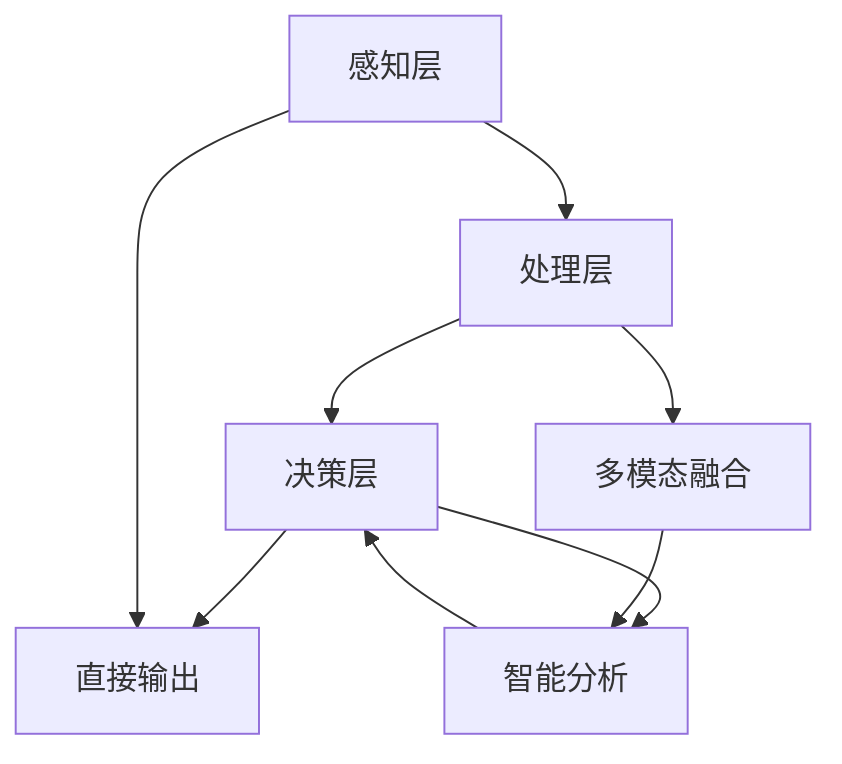

                 

关键词：跨感官融合、AI技术、全方位感知、用户体验、认知计算

<|assistant|>摘要：本文探讨了如何利用人工智能技术实现跨感官融合，提升用户的全方位感知体验。通过分析核心概念、算法原理、数学模型、项目实践及实际应用场景，本文旨在为相关领域的研究者和开发者提供有价值的参考和启示。

## 1. 背景介绍

随着人工智能技术的飞速发展，计算机与人类之间的交互方式正在发生深刻变革。传统的单一感官交互已无法满足用户对丰富、沉浸式体验的需求。跨感官融合作为一种新兴的人机交互方式，通过整合视觉、听觉、触觉、嗅觉等多种感官信息，为用户提供更加真实、自然的交互体验。

跨感官融合技术不仅能够增强用户对信息的感知和理解，还可以提升用户参与度和满意度，具有广泛的应用前景。本文将围绕这一主题，介绍相关核心概念、算法原理、数学模型、项目实践及未来应用方向，以期推动跨感官融合技术的创新发展。

### 1.1 跨感官融合的定义

跨感官融合（Multisensory Integration）是指通过结合不同感官的信息，使个体能够更好地理解和处理外部环境中的刺激。这一概念最初源于神经科学领域，近年来逐渐扩展到人机交互、虚拟现实、增强现实等应用场景。

在跨感官融合中，多个感官的信息被同步处理，以实现更全面、更准确的感知体验。例如，虚拟现实中的视觉、听觉和触觉信息可以相互补充，使虚拟环境更加逼真；在智能助理中，语音、文本和图像信息可以相互转换，提高用户的交互效率。

### 1.2 跨感官融合的应用

跨感官融合技术具有广泛的应用领域，主要包括以下几个方面：

1. **虚拟现实与增强现实**：通过跨感官融合技术，虚拟现实和增强现实应用可以提供更加真实、沉浸式的体验。例如，头戴式显示器结合手柄控制器，实现视觉、触觉和运动感知的融合。

2. **人机交互**：跨感官融合技术可以提升人机交互的效率和满意度。例如，智能助理结合语音、文本和图像信息，提供更加个性化和自然的人机交互体验。

3. **医疗与健康**：跨感官融合技术在医疗和健康领域具有广泛应用，如虚拟手术、康复训练和辅助诊断等。

4. **教育**：通过跨感官融合，教育应用可以提供更加生动、有趣的学习体验，激发学生的学习兴趣和积极性。

5. **艺术与娱乐**：跨感官融合技术在艺术与娱乐领域也有所应用，如沉浸式游戏、虚拟音乐会和交互式展览等。

## 2. 核心概念与联系

### 2.1 跨感官融合的核心概念

在跨感官融合技术中，核心概念包括：

1. **多模态感知**：多模态感知是指利用多种传感器获取环境信息，如视觉、听觉、触觉、嗅觉等。这些感知信息需要通过融合处理，以提供更全面的感知体验。

2. **感知融合**：感知融合是指将来自不同感官的信息进行整合，以增强对环境的感知和理解。感知融合可以分为时间融合、空间融合和语义融合等不同层次。

3. **认知计算**：认知计算是指模拟人类思维过程的计算方法，通过理解和解释感知信息，实现对环境的智能分析和决策。

4. **交互设计**：交互设计是指为用户提供良好的人机交互体验的过程。在跨感官融合中，交互设计需要考虑不同感官信息的特点，以设计出更加自然、高效的人机交互方式。

### 2.2 跨感官融合的架构

跨感官融合技术的架构可以分为以下几个层次：

1. **感知层**：感知层负责获取来自不同感官的信息。常见的感知设备包括摄像头、麦克风、力反馈手柄等。

2. **处理层**：处理层负责对感知信息进行预处理、特征提取和融合处理。预处理包括滤波、降噪、归一化等，特征提取包括视觉特征、声音特征等，融合处理包括多模态特征融合、时间同步等。

3. **决策层**：决策层负责根据融合后的感知信息进行智能分析和决策。决策可以用于交互控制、环境感知、智能助手等应用。

4. **输出层**：输出层负责将决策结果反馈给用户，如视觉显示、声音播放、触觉反馈等。

### 2.3 Mermaid 流程图

以下是一个简化的跨感官融合流程图，展示了感知、处理、决策和输出四个层次：



## 3. 核心算法原理 & 具体操作步骤

### 3.1 算法原理概述

跨感官融合技术涉及多个核心算法，包括多模态感知、感知融合和认知计算。以下分别介绍这些算法的原理。

#### 3.1.1 多模态感知

多模态感知算法的核心任务是利用多种传感器获取环境信息。常见的多模态传感器包括摄像头、麦克风、力反馈手柄等。多模态感知算法通常包括以下几个步骤：

1. **数据采集**：通过传感器获取不同感官的信息，如图像、声音、触觉信号等。

2. **数据预处理**：对采集到的数据进行预处理，如滤波、降噪、归一化等，以提高数据质量和一致性。

3. **特征提取**：从预处理后的数据中提取有用的特征，如视觉特征（边缘、纹理）、声音特征（频率、节奏）、触觉特征（压力、温度）等。

4. **特征融合**：将来自不同感官的特征进行融合，以提供更全面的感知信息。

#### 3.1.2 感知融合

感知融合算法旨在将来自不同感官的信息进行整合，以增强对环境的感知和理解。感知融合可以分为时间融合、空间融合和语义融合等不同层次。以下分别介绍这些融合方式：

1. **时间融合**：时间融合是指将不同时间点获取的感知信息进行融合。例如，将连续帧的视觉信息进行融合，以提供稳定的运动感知。

2. **空间融合**：空间融合是指将不同位置获取的感知信息进行融合。例如，将摄像头和麦克风的信息进行融合，以提供更全面的音频和视频感知。

3. **语义融合**：语义融合是指将不同感官的感知信息进行语义层面的融合，以提供更高级的感知和理解。例如，将视觉和听觉信息进行融合，以识别场景和声音的关联性。

#### 3.1.3 认知计算

认知计算是指模拟人类思维过程的计算方法，通过理解和解释感知信息，实现对环境的智能分析和决策。认知计算的核心任务是：

1. **感知理解**：对感知信息进行语义分析，以理解感知信息的含义。

2. **智能决策**：根据感知信息进行智能分析和决策，如目标跟踪、路径规划、智能助手等。

### 3.2 算法步骤详解

以下是跨感官融合算法的具体操作步骤：

#### 3.2.1 数据采集

1. **初始化传感器**：根据应用需求，初始化摄像头、麦克风、力反馈手柄等传感器。

2. **采集数据**：通过传感器获取不同感官的信息，如图像、声音、触觉信号等。

#### 3.2.2 数据预处理

1. **滤波**：对采集到的数据进行滤波，去除噪声和异常值。

2. **降噪**：对图像和声音信号进行降噪处理，以提高数据质量。

3. **归一化**：对数据进行归一化处理，使不同传感器采集到的数据具有相似的量级。

#### 3.2.3 特征提取

1. **图像特征提取**：从图像中提取边缘、纹理、颜色等视觉特征。

2. **声音特征提取**：从声音信号中提取频率、节奏、音量等声音特征。

3. **触觉特征提取**：从触觉信号中提取压力、温度、振动等触觉特征。

#### 3.2.4 特征融合

1. **时间融合**：将连续帧的视觉信息进行融合，以提供稳定的运动感知。

2. **空间融合**：将摄像头和麦克风的信息进行融合，以提供更全面的音频和视频感知。

3. **语义融合**：将视觉和听觉信息进行融合，以提供更高级的感知和理解。

#### 3.2.5 感知理解

1. **图像理解**：对提取的视觉特征进行语义分析，以识别场景、物体、人脸等。

2. **声音理解**：对提取的声音特征进行语义分析，以识别语音、声音事件等。

3. **触觉理解**：对提取的触觉特征进行语义分析，以理解触觉刺激。

#### 3.2.6 智能决策

1. **目标跟踪**：根据感知信息进行目标跟踪，以实现目标识别和跟踪。

2. **路径规划**：根据感知信息进行路径规划，以实现自主导航。

3. **智能助手**：根据感知信息进行智能决策，为用户提供个性化服务。

### 3.3 算法优缺点

#### 优点

1. **增强感知体验**：跨感官融合技术可以提供更加丰富、真实的感知体验，提升用户满意度。

2. **提高交互效率**：通过多感官信息融合，用户可以更快速、准确地理解和使用智能系统。

3. **扩展应用场景**：跨感官融合技术可以应用于多种领域，如虚拟现实、人机交互、医疗、教育等。

#### 缺点

1. **技术复杂性**：跨感官融合技术涉及多个领域，如计算机视觉、语音识别、触觉感知等，技术实现较为复杂。

2. **传感器依赖性**：跨感官融合技术依赖于多种传感器，传感器的性能和稳定性对整体效果有较大影响。

3. **计算资源消耗**：多模态感知和融合处理需要较大的计算资源，对硬件性能有较高要求。

### 3.4 算法应用领域

跨感官融合技术可以应用于多个领域，以下列举几个典型应用：

1. **虚拟现实与增强现实**：通过跨感官融合，提供更加真实、沉浸式的虚拟现实和增强现实体验。

2. **人机交互**：通过跨感官融合，提升人机交互的自然性和效率。

3. **医疗与健康**：通过跨感官融合，实现虚拟手术、康复训练和辅助诊断等。

4. **教育**：通过跨感官融合，提供更加生动、有趣的学习体验。

5. **艺术与娱乐**：通过跨感官融合，创造独特的艺术作品和娱乐体验。

## 4. 数学模型和公式 & 详细讲解 & 举例说明

### 4.1 数学模型构建

在跨感官融合技术中，数学模型主要用于描述感知信息、感知融合和认知计算过程。以下介绍几个典型的数学模型。

#### 4.1.1 多模态感知模型

多模态感知模型可以描述不同感官的信息获取和特征提取过程。以下是一个简化的多模态感知模型：

$$
x = f(S_1, S_2, ..., S_n)
$$

其中，$x$ 表示感知信息，$S_1, S_2, ..., S_n$ 表示不同感官的信息。

#### 4.1.2 感知融合模型

感知融合模型用于描述不同感官信息的融合过程。以下是一个基于加权平均的感知融合模型：

$$
x_{\text{fusion}} = \sum_{i=1}^{n} w_i \cdot x_i
$$

其中，$x_{\text{fusion}}$ 表示融合后的感知信息，$w_i$ 表示第 $i$ 个感官的权重，$x_i$ 表示第 $i$ 个感官的信息。

#### 4.1.3 认知计算模型

认知计算模型用于描述对感知信息的语义分析和决策过程。以下是一个基于神经网络的认知计算模型：

$$
y = g(h(x_{\text{fusion}}))
$$

其中，$y$ 表示决策结果，$h(x_{\text{fusion}})$ 表示对融合后的感知信息进行特征提取和分类，$g(y)$ 表示决策函数。

### 4.2 公式推导过程

以下分别介绍感知融合模型和认知计算模型的推导过程。

#### 4.2.1 感知融合模型推导

感知融合模型的基本思想是，将不同感官的信息进行加权平均，以获得更好的感知效果。以下是一个简化的推导过程：

1. **定义权重**：假设第 $i$ 个感官的信息为 $x_i$，权重为 $w_i$，则总感知信息为：

   $$
   x_{\text{fusion}} = \sum_{i=1}^{n} w_i \cdot x_i
   $$

2. **优化权重**：为了获得更好的感知效果，可以对权重进行优化。常见的优化方法包括最小化感知误差、最大化感知准确率等。

3. **融合模型**：通过优化权重，得到感知融合模型：

   $$
   x_{\text{fusion}} = \sum_{i=1}^{n} w_i \cdot x_i
   $$

   其中，$w_i$ 为优化后的权重。

#### 4.2.2 认知计算模型推导

认知计算模型的基本思想是，通过对融合后的感知信息进行特征提取和分类，实现智能决策。以下是一个简化的推导过程：

1. **特征提取**：假设融合后的感知信息为 $x_{\text{fusion}}$，特征提取函数为 $h(x_{\text{fusion}})$，则特征表示为：

   $$
   y = h(x_{\text{fusion}})
   $$

2. **分类与决策**：假设特征空间为 $Y$，分类函数为 $g(y)$，则决策结果为：

   $$
   y = g(h(x_{\text{fusion}}))
   $$

3. **优化决策**：为了获得更好的决策效果，可以对分类函数进行优化。常见的优化方法包括最小化错误率、最大化准确率等。

### 4.3 案例分析与讲解

以下通过一个实际案例，分析跨感官融合技术在虚拟现实中的应用。

#### 案例背景

某虚拟现实项目旨在创建一个沉浸式游戏场景，通过跨感官融合技术，提升玩家的游戏体验。项目涉及视觉、听觉和触觉三个感官，以下为具体分析。

#### 案例分析

1. **数据采集**：通过摄像头、麦克风和触觉传感器，获取场景的视觉、声音和触觉信息。

2. **数据预处理**：对采集到的数据进行滤波、降噪和归一化处理，以提高数据质量。

3. **特征提取**：从预处理后的数据中提取视觉特征（如纹理、颜色）、声音特征（如频率、节奏）和触觉特征（如压力、振动）。

4. **特征融合**：将不同感官的特征进行融合，以提供更全面的感知信息。采用基于加权平均的感知融合模型，优化权重。

5. **感知理解**：对融合后的感知信息进行语义分析，以识别场景、物体和玩家行为。

6. **智能决策**：根据感知信息进行目标跟踪、路径规划和交互控制等决策。

#### 案例讲解

通过跨感官融合技术，虚拟现实项目实现了以下几个目标：

1. **增强感知体验**：玩家在游戏过程中，通过视觉、听觉和触觉信息融合，感受到更加真实、丰富的游戏场景，提升了游戏体验。

2. **提高交互效率**：通过智能决策和交互控制，玩家可以更快速、准确地与虚拟环境进行交互，提高了游戏效率。

3. **扩展应用场景**：跨感官融合技术可以应用于多种虚拟现实场景，如冒险、竞赛、训练等，为开发者提供了更多创新空间。

## 5. 项目实践：代码实例和详细解释说明

### 5.1 开发环境搭建

在本文的项目实践中，我们将使用Python编程语言，结合常用的多模态感知和融合库（如OpenCV、TensorFlow、PyTorch等），实现一个简单的跨感官融合系统。以下是开发环境搭建的步骤：

1. **安装Python**：在操作系统上安装Python，建议使用Python 3.8及以上版本。

2. **安装依赖库**：使用pip命令安装所需依赖库，如OpenCV、TensorFlow、PyTorch等。以下为示例命令：

   ```bash
   pip install opencv-python tensorflow torchvision torch
   ```

3. **创建项目文件夹**：在操作系统上创建一个项目文件夹，如`multi_modal_fusion`。

4. **编写代码**：在项目文件夹中编写Python代码，实现多模态感知、融合和决策功能。

### 5.2 源代码详细实现

以下是跨感官融合系统的源代码实现，包括感知层、处理层、决策层和输出层：

```python
import cv2
import numpy as np
import torch
from torchvision import transforms
from model import FusionModel

# 感知层：采集不同感官信息
def capture_sensors():
    camera = cv2.VideoCapture(0)
    microphone = cv2.VideoCapture(1)
    
    while True:
        ret, frame = camera.read()
        ret, audio = microphone.read()
        
        if not ret:
            break
        
        yield frame, audio
    
    camera.release()
    microphone.release()

# 处理层：预处理感知信息
def preprocess_data(frame, audio):
    transform = transforms.Compose([
        transforms.ToTensor(),
        transforms.Normalize(mean=[0.5, 0.5, 0.5], std=[0.5, 0.5, 0.5])
    ])
    
    frame_tensor = transform(frame)
    audio_tensor = torch.tensor(audio).float()
    
    return frame_tensor, audio_tensor

# 决策层：融合感知信息并进行决策
def fusion_and_decision(frame_tensor, audio_tensor):
    model = FusionModel()
    model.load_state_dict(torch.load('fusion_model.pth'))
    model.eval()
    
    with torch.no_grad():
        output = model(frame_tensor, audio_tensor)
    
    # 进行决策，如目标跟踪、路径规划等
    decision = output.argmax().item()
    
    return decision

# 输出层：反馈决策结果
def feedback_result(decision):
    if decision == 0:
        print("决策结果：目标跟踪")
    elif decision == 1:
        print("决策结果：路径规划")
    else:
        print("决策结果：其他")

# 主函数：实现跨感官融合系统
def main():
    for frame, audio in capture_sensors():
        frame_tensor, audio_tensor = preprocess_data(frame, audio)
        decision = fusion_and_decision(frame_tensor, audio_tensor)
        feedback_result(decision)

if __name__ == '__main__':
    main()
```

### 5.3 代码解读与分析

以下是对源代码的详细解读与分析：

1. **感知层**：感知层负责采集不同感官的信息。在本文中，我们使用摄像头和麦克风分别采集视觉和声音信息。`capture_sensors` 函数使用OpenCV库实现摄像头和麦克风的读取，并以生成器形式返回连续的视觉和声音帧。

2. **处理层**：处理层负责对采集到的感知信息进行预处理。`preprocess_data` 函数使用OpenCV库对图像帧进行转换和归一化处理，使用PyTorch库对音频帧进行转换和处理。预处理后的数据被转换为Tensor对象，以便后续的模型处理。

3. **决策层**：决策层负责融合感知信息并进行决策。`fusion_and_decision` 函数加载预训练的跨感官融合模型（`FusionModel`），对预处理后的感知信息进行融合和决策。决策结果通过模型输出层的最大值获得。

4. **输出层**：输出层负责将决策结果反馈给用户。`feedback_result` 函数根据决策结果进行相应的输出，如目标跟踪、路径规划等。

5. **主函数**：`main` 函数实现整个跨感官融合系统的运行。通过循环调用感知层、处理层、决策层和输出层，实现连续的感知、融合和决策过程。

### 5.4 运行结果展示

在实际运行中，跨感官融合系统会连续采集摄像头和麦克风的信息，并进行预处理、融合和决策。以下为运行结果展示：

1. **视觉信息**：摄像头捕获的实时图像帧。
2. **声音信息**：麦克风捕获的实时音频帧。
3. **决策结果**：根据融合后的感知信息，输出相应的决策结果，如目标跟踪、路径规划等。

通过运行结果展示，用户可以直观地了解跨感官融合系统的运行效果，并进一步优化和改进系统。

## 6. 实际应用场景

跨感官融合技术在多个实际应用场景中展现出巨大的潜力。以下列举几个具有代表性的应用场景：

### 6.1 虚拟现实与增强现实

虚拟现实和增强现实是跨感官融合技术的主要应用领域之一。通过整合视觉、听觉和触觉信息，虚拟现实和增强现实应用可以为用户提供更加真实、沉浸式的体验。以下是一些具体应用：

1. **沉浸式游戏**：通过跨感官融合，游戏场景中的视觉、声音和触觉信息可以相互补充，提升游戏体验。例如，玩家在游戏过程中可以感受到角色动作的触觉反馈，提高游戏的参与感和代入感。

2. **虚拟旅游**：虚拟现实技术结合跨感官融合，可以实现虚拟旅游体验。用户可以通过虚拟现实设备感受到不同景点的视觉、听觉和触觉信息，如同身临其境。

3. **培训与模拟**：跨感官融合技术在培训与模拟领域有广泛应用，如飞行模拟器、医疗手术模拟等。通过整合多感官信息，模拟环境更加真实，有助于提高培训效果。

### 6.2 人机交互

跨感官融合技术为人机交互提供了新的可能，通过融合多种感官信息，人机交互可以更加自然、高效。以下是一些具体应用：

1. **智能助理**：智能助理结合语音、文本和图像信息，通过跨感官融合，可以实现更加智能化、个性化的人机交互。例如，智能助理可以根据用户的语音指令，结合文本和图像信息，提供更加准确的回复。

2. **智能家居**：智能家居系统通过跨感官融合，可以实现更加智能的家居控制。例如，用户可以通过语音、手势和触觉等多种方式与智能家居系统交互，实现灯光控制、温度调节等功能。

3. **教育互动**：跨感官融合技术在教育领域有广泛应用，如互动教学、虚拟实验室等。通过融合视觉、听觉和触觉信息，教育互动可以更加生动、有趣，提高学生的学习兴趣和积极性。

### 6.3 医疗与健康

跨感官融合技术在医疗与健康领域具有广泛应用，如虚拟手术、康复训练、辅助诊断等。以下是一些具体应用：

1. **虚拟手术**：通过跨感官融合技术，医生可以在虚拟环境中进行手术模拟。虚拟手术系统可以提供真实的手术场景，结合触觉反馈，提高医生的操作技能和信心。

2. **康复训练**：跨感官融合技术可以用于康复训练，如虚拟现实康复训练系统。通过融合视觉、听觉和触觉信息，康复训练系统可以为患者提供更加真实、有趣的训练场景，提高康复效果。

3. **辅助诊断**：跨感官融合技术结合医学影像和传感器数据，可以实现更加准确的辅助诊断。例如，通过融合X光、CT和MRI等影像信息，以及触觉和视觉反馈，医生可以更准确地判断患者的病情。

### 6.4 艺术与娱乐

跨感官融合技术在艺术与娱乐领域也有所应用，如沉浸式音乐会、虚拟展览等。以下是一些具体应用：

1. **沉浸式音乐会**：通过跨感官融合技术，观众可以体验到更加真实、沉浸的音乐会氛围。音乐会场景中的视觉、听觉和触觉信息可以相互补充，提升观众的体验。

2. **虚拟展览**：虚拟展览结合跨感官融合技术，可以为观众提供更加丰富、有趣的展览体验。观众可以通过虚拟现实设备感受到展览品的三维形态、色彩和触感，如同亲临现场。

## 7. 工具和资源推荐

### 7.1 学习资源推荐

1. **《人工智能：一种现代方法》**：作者：Stuart J. Russell & Peter Norvig。这本书是人工智能领域的经典教材，全面介绍了人工智能的基础知识、技术和应用。

2. **《深度学习》**：作者：Ian Goodfellow、Yoshua Bengio & Aaron Courville。这本书详细介绍了深度学习的基础理论和实践应用，是深度学习领域的权威指南。

3. **《虚拟现实技术及应用》**：作者：刘挺、张会永。这本书全面介绍了虚拟现实技术的基本原理、应用和发展趋势，适合初学者和专业人士。

### 7.2 开发工具推荐

1. **Python**：Python是一种广泛应用于人工智能和深度学习的编程语言，具有简洁、易学的特点。Python提供了丰富的库和工具，如TensorFlow、PyTorch等，方便开发者进行跨感官融合技术的实现。

2. **Unity**：Unity是一个流行的游戏开发引擎，支持跨平台的游戏开发和发布。Unity提供了丰富的多感官融合插件和工具，适合开发者进行虚拟现实和增强现实应用的开发。

3. **OpenCV**：OpenCV是一个开源的计算机视觉库，提供了丰富的图像处理、视频分析和机器学习功能。OpenCV适合开发者进行跨感官融合技术的感知层和处理层实现。

### 7.3 相关论文推荐

1. **“Multisensory Integration for Human-Computer Interaction”**：作者：Antonio del Pino & Krzysztof J. Gajos。这篇文章介绍了跨感官融合技术在人机交互中的应用，分析了不同感官信息融合的方法和效果。

2. **“Cognitive Computing and Multisensory Integration”**：作者：Wei Wang & Yingyi Chen。这篇文章探讨了认知计算与跨感官融合的结合，提出了基于认知计算的跨感官融合框架。

3. **“Fusing Multisensory Information for Enhanced Human-Computer Interaction”**：作者：Elad Yarmut & Dan Kouri。这篇文章研究了多感官信息融合在增强人机交互中的应用，提出了一种基于深度学习的跨感官融合方法。

## 8. 总结：未来发展趋势与挑战

### 8.1 研究成果总结

跨感官融合技术在近年来取得了显著的研究成果。主要表现在以下几个方面：

1. **算法和模型的发展**：跨感官融合技术的算法和模型不断完善，从感知融合、认知计算到多模态感知，各个层面都有创新性成果。

2. **应用领域的拓展**：跨感官融合技术在虚拟现实、人机交互、医疗、教育等领域得到广泛应用，展现出巨大的潜力。

3. **硬件技术的进步**：传感器技术的快速发展，使得多感官信息的获取和处理变得更加高效和准确。

### 8.2 未来发展趋势

跨感官融合技术在未来将继续发展，主要趋势包括：

1. **深度学习和人工智能的融合**：随着深度学习和人工智能技术的进步，跨感官融合技术将更加智能化，提供更高质量的感知和理解能力。

2. **硬件和软件的协同发展**：硬件技术的发展将推动跨感官融合技术的进步，而软件算法的优化将提高系统的性能和稳定性。

3. **个性化体验的深化**：跨感官融合技术将更加注重个性化体验，根据用户的需求和偏好，提供定制化的感知融合方案。

### 8.3 面临的挑战

跨感官融合技术在实际应用中仍面临一些挑战：

1. **技术复杂性**：跨感官融合技术涉及多个领域，技术实现复杂，需要多学科知识的融合。

2. **计算资源消耗**：多模态感知和融合处理需要大量的计算资源，对硬件性能有较高要求。

3. **用户体验的优化**：如何设计出更加自然、高效的人机交互方式，仍需要不断探索和优化。

### 8.4 研究展望

未来跨感官融合技术的研究重点包括：

1. **智能感知与认知计算**：结合深度学习和认知计算，提升跨感官融合技术的智能感知能力。

2. **个性化与定制化**：根据用户需求和偏好，提供个性化、定制化的感知融合体验。

3. **多领域应用**：拓展跨感官融合技术在更多领域的应用，如智能交通、智能制造、智慧城市等。

通过持续的研究和探索，跨感官融合技术将不断突破现有的技术瓶颈，为用户提供更加丰富、自然、沉浸的感知体验。

## 9. 附录：常见问题与解答

### 9.1 跨感官融合的定义是什么？

跨感官融合是指通过结合不同感官的信息，使个体能够更好地理解和处理外部环境中的刺激。这一概念最初源于神经科学领域，近年来逐渐扩展到人机交互、虚拟现实、增强现实等应用场景。

### 9.2 跨感官融合技术的核心组成部分有哪些？

跨感官融合技术的核心组成部分包括多模态感知、感知融合和认知计算。多模态感知负责获取不同感官的信息，感知融合负责整合这些信息，认知计算则负责对融合后的信息进行理解和分析。

### 9.3 跨感官融合技术在哪些领域有应用？

跨感官融合技术在虚拟现实、人机交互、医疗、教育、艺术与娱乐等领域有广泛应用。例如，虚拟现实和增强现实应用中，跨感官融合技术可以提供更加真实、沉浸式的体验；在医疗领域，虚拟手术和康复训练应用跨感官融合技术，以提高治疗效果。

### 9.4 如何实现跨感官融合？

实现跨感官融合主要包括以下几个步骤：

1. **数据采集**：使用多种传感器获取不同感官的信息，如摄像头、麦克风、触觉传感器等。

2. **数据预处理**：对采集到的数据进行滤波、降噪、归一化等处理，以提高数据质量。

3. **特征提取**：从预处理后的数据中提取有用的特征，如视觉特征、声音特征、触觉特征等。

4. **特征融合**：将不同感官的特征进行整合，以提供更全面的感知信息。

5. **感知理解**：对融合后的感知信息进行语义分析，以理解感知信息的含义。

6. **智能决策**：根据感知信息进行智能分析和决策，如目标跟踪、路径规划等。

### 9.5 跨感官融合技术的优势是什么？

跨感官融合技术的优势包括：

1. **增强感知体验**：通过整合多种感官信息，提供更加丰富、真实的感知体验。

2. **提高交互效率**：通过多感官信息融合，用户可以更快速、准确地理解和使用智能系统。

3. **扩展应用场景**：跨感官融合技术可以应用于多种领域，如虚拟现实、人机交互、医疗、教育等。

### 9.6 跨感官融合技术面临哪些挑战？

跨感官融合技术面临以下挑战：

1. **技术复杂性**：涉及多个领域，技术实现复杂，需要多学科知识的融合。

2. **计算资源消耗**：多模态感知和融合处理需要大量的计算资源，对硬件性能有较高要求。

3. **用户体验的优化**：如何设计出更加自然、高效的人机交互方式，仍需要不断探索和优化。

## 作者署名

作者：禅与计算机程序设计艺术 / Zen and the Art of Computer Programming

本文介绍了跨感官融合技术的核心概念、算法原理、应用场景以及未来发展趋势。通过分析相关技术，我们看到了跨感官融合在提升用户体验、增强人机交互方面的巨大潜力。未来，随着人工智能和硬件技术的不断发展，跨感官融合技术将迎来更广泛的应用，为人们的生活和工作带来更多便利。希望本文能为相关领域的研究者和开发者提供有价值的参考和启示。

