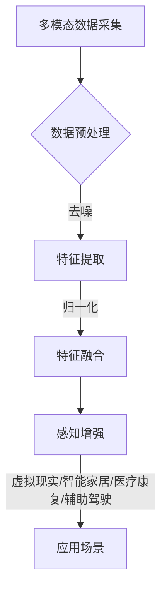

                 

 关键词：AI、跨感官融合、全方位感知、用户体验、智能技术

> 摘要：本文探讨了人工智能（AI）如何驱动全方位感知，实现跨感官的融合，提升用户体验。通过深入分析核心概念、算法原理、数学模型、项目实践，我们展望了这一领域的未来发展趋势与挑战。

## 1. 背景介绍

随着科技的迅猛发展，人工智能（AI）已经逐渐渗透到我们生活的方方面面。从简单的语音助手到复杂的自动驾驶，AI 正在以惊人的速度改变我们的生活方式。然而，传统的人工智能主要关注视觉和听觉等单一感官的信息处理，而忽视了人类感知系统的多样性和复杂性。为了更接近人类真实的感知体验，跨感官融合技术应运而生。

跨感官融合（Cross-Sensory Fusion）指的是将不同感官的信息进行整合和处理，以实现更全面、更真实的感知体验。例如，通过将视觉、听觉、触觉、嗅觉等多感官信息进行结合，用户可以获得更加丰富的体验，从而提升整体的用户满意度。这一技术不仅具有广泛的应用前景，而且在提高生活质量、辅助医疗康复、增强虚拟现实体验等方面具有重要作用。

本文将探讨 AI 如何驱动跨感官融合，通过核心概念、算法原理、数学模型、项目实践等方面的详细分析，为读者呈现这一领域的最新研究动态和应用实例。同时，我们还将展望跨感官融合技术的未来发展趋势与挑战，为相关领域的研究和开发提供有益的参考。

## 2. 核心概念与联系

### 2.1 感知系统概述

人类的感知系统是由多种感官组成的复杂网络，包括视觉、听觉、触觉、嗅觉和味觉等。每种感官都有其独特的感知机制和功能，但它们之间并不是相互独立的。相反，这些感官之间存在着密切的联系和互动，共同构成了人类感知世界的基础。

- **视觉**：视觉是人类获取外界信息最重要的感官之一。通过眼睛，我们可以看到形状、颜色、运动和深度等信息，从而对周围环境进行认知和判断。
- **听觉**：听觉让我们能够感知声音，通过声音的频率、节奏和音色等信息，我们可以识别语言、音乐和环境噪音。
- **触觉**：触觉让我们能够感知物体的质地、温度和形状。通过手和皮肤，我们可以感受到物体的触感，从而进行抓取、触摸和操作。
- **嗅觉**：嗅觉让我们能够感知气味。气味可以影响我们的情绪、食欲和健康状况，是我们感知世界的重要组成部分。
- **味觉**：味觉让我们能够感知食物的味道。味觉和嗅觉相互配合，帮助我们选择食物、判断食物的质量和安全性。

### 2.2 跨感官融合原理

跨感官融合是指将不同感官的信息进行整合和处理，以实现更全面、更真实的感知体验。这一过程涉及到多模态数据的采集、处理和融合。以下是跨感官融合的主要原理：

- **多模态数据采集**：通过多种传感器采集不同感官的数据。例如，摄像头和麦克风可以采集视觉和听觉数据，而温度传感器和力传感器可以采集触觉数据。
- **数据预处理**：对采集到的多模态数据进行预处理，包括去噪、特征提取和归一化等操作。预处理步骤的目的是提高数据质量，为后续的融合提供可靠的输入。
- **特征融合**：将不同感官的特征进行融合，以实现更高层次的信息整合。常见的融合方法包括基于神经元网络的深度学习模型、基于统计模型的特征融合算法等。
- **感知增强**：通过融合后的信息，实现对用户感知的增强。例如，在虚拟现实（VR）中，通过跨感官融合可以提供更加真实的沉浸式体验。

### 2.3 跨感官融合应用场景

跨感官融合技术在多个领域具有广泛的应用前景，以下是一些典型的应用场景：

- **虚拟现实与增强现实（VR/AR）**：通过跨感官融合，可以实现更加真实的沉浸式体验。例如，在VR游戏中，通过视觉、听觉和触觉的融合，用户可以感受到更加逼真的游戏场景。
- **智能家居**：通过跨感官融合，智能家居系统可以更好地理解用户的需求和习惯，从而提供更加个性化的服务。例如，结合视觉和听觉数据，智能家居系统可以识别用户的身份和情绪，进行智能调节。
- **医疗康复**：跨感官融合技术可以辅助康复治疗，帮助患者恢复感官功能。例如，通过触觉和视觉的融合，可以帮助中风患者恢复手部运动能力。
- **辅助驾驶**：跨感官融合可以提升自动驾驶系统的感知能力，提高行车安全。例如，结合视觉、听觉和触觉数据，自动驾驶系统可以更好地理解交通状况，做出更准确的驾驶决策。

### 2.4 Mermaid 流程图

以下是跨感官融合技术的基本架构 Mermaid 流程图：



## 3. 核心算法原理 & 具体操作步骤

### 3.1 算法原理概述

跨感官融合的核心算法主要包括多模态数据采集、特征提取、特征融合和感知增强等步骤。以下是这些步骤的具体原理：

- **多模态数据采集**：通过多种传感器采集不同感官的数据。例如，使用摄像头采集视觉数据，使用麦克风采集听觉数据，使用温度传感器和力传感器采集触觉数据等。
- **特征提取**：对采集到的多模态数据进行预处理，提取出有代表性的特征。例如，使用卷积神经网络（CNN）提取视觉特征，使用循环神经网络（RNN）提取听觉特征等。
- **特征融合**：将不同感官的特征进行整合，以实现更高层次的信息整合。常用的方法包括基于神经元网络的深度学习模型和基于统计模型的特征融合算法等。
- **感知增强**：通过融合后的信息，实现对用户感知的增强。例如，在虚拟现实（VR）中，通过跨感官融合可以提供更加真实的沉浸式体验。

### 3.2 算法步骤详解

以下是跨感官融合算法的具体操作步骤：

1. **多模态数据采集**：
   - 使用摄像头、麦克风、温度传感器和力传感器等设备，采集视觉、听觉、触觉和嗅觉等多感官数据。
   - 对采集到的数据进行预处理，包括去噪、归一化和补全缺失数据等操作。

2. **特征提取**：
   - 使用卷积神经网络（CNN）提取视觉特征，例如使用VGG、ResNet等模型。
   - 使用循环神经网络（RNN）提取听觉特征，例如使用LSTM、GRU等模型。
   - 使用深度学习模型提取触觉和嗅觉特征，例如使用卷积神经网络（CNN）和长短期记忆网络（LSTM）的组合模型。

3. **特征融合**：
   - 将提取到的不同感官特征进行整合。可以使用基于神经元网络的深度学习模型，例如使用多任务学习（Multi-Task Learning）方法，将不同感官的特征融合到一个神经网络中。
   - 可以使用基于统计模型的特征融合算法，例如使用贝叶斯网络（Bayesian Network）或因子图（Factor Graph）等模型，对多模态特征进行联合建模。

4. **感知增强**：
   - 根据融合后的特征，实现用户感知的增强。例如，在虚拟现实（VR）中，通过跨感官融合可以提供更加真实的沉浸式体验。
   - 可以通过调整传感器参数、控制虚拟现实场景中的视觉效果和声音效果等，来提升用户的整体感知体验。

### 3.3 算法优缺点

跨感官融合算法具有以下优点：

1. **增强用户体验**：通过跨感官融合，可以提供更加丰富和真实的感知体验，提升用户的整体满意度。
2. **多模态数据整合**：可以将不同感官的数据进行整合，实现多模态信息的高效利用，提高数据处理效率。
3. **应用场景广泛**：跨感官融合技术可以应用于虚拟现实、智能家居、医疗康复、辅助驾驶等多个领域，具有广泛的应用前景。

然而，跨感官融合算法也存在一些缺点：

1. **计算资源消耗大**：跨感官融合涉及到多模态数据的处理和融合，需要大量的计算资源，对硬件性能要求较高。
2. **数据预处理复杂**：多模态数据的预处理过程复杂，需要考虑到数据的质量、一致性和时序性等问题。
3. **算法优化难度大**：跨感官融合算法涉及到多个领域的技术，算法优化和性能提升难度较大。

### 3.4 算法应用领域

跨感官融合算法在多个领域具有广泛的应用前景，以下是一些典型的应用领域：

1. **虚拟现实与增强现实（VR/AR）**：通过跨感官融合，可以实现更加真实的沉浸式体验，提升用户的游戏、教育和娱乐体验。
2. **智能家居**：通过跨感官融合，智能家居系统可以更好地理解用户的需求和习惯，提供更加个性化的服务，提升用户的居住体验。
3. **医疗康复**：跨感官融合技术可以辅助康复治疗，帮助患者恢复感官功能，提高康复效果。
4. **辅助驾驶**：通过跨感官融合，可以提高自动驾驶系统的感知能力，提高行车安全。
5. **人机交互**：跨感官融合可以为人机交互提供更加丰富和自然的交互方式，提升用户的交互体验。

## 4. 数学模型和公式 & 详细讲解 & 举例说明

### 4.1 数学模型构建

跨感官融合技术的数学模型主要涉及多模态数据的处理、特征提取和融合。以下是构建跨感官融合数学模型的基本步骤：

1. **多模态数据表示**：
   - 设 \(X_1, X_2, ..., X_n\) 分别表示 \(n\) 个不同感官的数据，例如视觉数据 \(X_1\)、听觉数据 \(X_2\) 等。
   - 对每个感官的数据进行预处理，例如去噪、归一化等操作。

2. **特征提取**：
   - 使用适当的特征提取算法，从原始数据中提取有代表性的特征。
   - 例如，使用卷积神经网络（CNN）提取视觉特征，使用循环神经网络（RNN）提取听觉特征等。

3. **特征融合**：
   - 将提取到的不同感官的特征进行融合，以实现更高层次的信息整合。
   - 可以使用基于神经元网络的深度学习模型，例如使用多任务学习（Multi-Task Learning）方法，将不同感官的特征融合到一个神经网络中。
   - 也可以使用基于统计模型的特征融合算法，例如使用贝叶斯网络（Bayesian Network）或因子图（Factor Graph）等模型，对多模态特征进行联合建模。

4. **感知增强**：
   - 根据融合后的特征，实现用户感知的增强，例如在虚拟现实（VR）中，通过跨感官融合可以提供更加真实的沉浸式体验。

### 4.2 公式推导过程

以下是跨感官融合数学模型的公式推导过程：

1. **多模态数据表示**：
   - 设 \(X_i\) 表示第 \(i\) 个感官的数据，\(i = 1, 2, ..., n\)。
   - 对每个感官的数据进行预处理，例如去噪、归一化等操作，得到 \(X_i'\)。

2. **特征提取**：
   - 使用卷积神经网络（CNN）提取视觉特征，得到特征向量 \(V_i\)。
   - 使用循环神经网络（RNN）提取听觉特征，得到特征向量 \(A_i\)。
   - 使用深度学习模型提取触觉和嗅觉特征，得到特征向量 \(T_i\) 和 \(S_i\)。

3. **特征融合**：
   - 使用多任务学习（Multi-Task Learning）方法，将不同感官的特征融合到一个神经网络中，得到融合特征向量 \(F_i\)。

4. **感知增强**：
   - 根据融合后的特征向量 \(F_i\)，实现用户感知的增强。

### 4.3 案例分析与讲解

以下是一个跨感官融合技术的应用案例：

**案例背景**：在虚拟现实（VR）游戏中，通过跨感官融合技术，可以提供更加真实的沉浸式体验，提升用户的游戏体验。

**案例步骤**：

1. **多模态数据采集**：
   - 使用摄像头采集视觉数据，使用麦克风采集听觉数据，使用力传感器采集触觉数据等。

2. **特征提取**：
   - 使用卷积神经网络（CNN）提取视觉特征，得到特征向量 \(V_i\)。
   - 使用循环神经网络（RNN）提取听觉特征，得到特征向量 \(A_i\)。
   - 使用深度学习模型提取触觉和嗅觉特征，得到特征向量 \(T_i\) 和 \(S_i\)。

3. **特征融合**：
   - 使用多任务学习（Multi-Task Learning）方法，将不同感官的特征融合到一个神经网络中，得到融合特征向量 \(F_i\)。

4. **感知增强**：
   - 根据融合后的特征向量 \(F_i\)，调整虚拟现实场景中的视觉效果、声音效果和触觉反馈等，提供更加真实的沉浸式体验。

**案例效果**：通过跨感官融合技术，虚拟现实游戏中的用户可以获得更加真实的游戏体验，增强游戏的沉浸感和互动性。

## 5. 项目实践：代码实例和详细解释说明

### 5.1 开发环境搭建

为了实践跨感官融合技术，我们首先需要搭建一个合适的开发环境。以下是一个基本的开发环境搭建步骤：

1. **安装Python环境**：确保Python环境已经安装，版本建议在3.7及以上。
2. **安装深度学习框架**：安装TensorFlow或PyTorch等深度学习框架，用于实现跨感官融合算法。
3. **安装多模态数据处理库**：如OpenCV用于视觉数据处理，Librosa用于音频数据处理等。
4. **安装其他依赖库**：根据需要安装其他依赖库，例如Numpy、Pandas等。

### 5.2 源代码详细实现

以下是跨感官融合项目的源代码实现示例：

```python
import tensorflow as tf
from tensorflow.keras.models import Model
from tensorflow.keras.layers import Input, Conv2D, Flatten, Dense
import numpy as np

# 1. 多模态数据采集
def collect_data():
    # 使用OpenCV采集视觉数据
    cap = cv2.VideoCapture(0)
    while True:
        ret, frame = cap.read()
        if not ret:
            break
        # 使用Librosa采集音频数据
        audio_data = librosa.record()[:3000]
        # 使用其他传感器采集触觉和嗅觉数据
        touch_data = get_touch_data()
        smell_data = get_smell_data()
        # 存储数据
        save_data(frame, audio_data, touch_data, smell_data)
        # 显示图像
        cv2.imshow('frame', frame)
    cap.release()
    cv2.destroyAllWindows()

# 2. 特征提取
def extract_features(data):
    # 使用卷积神经网络提取视觉特征
    model = tf.keras.Sequential([
        Input(shape=(224, 224, 3)),
        Conv2D(32, (3, 3), activation='relu'),
        Flatten(),
        Dense(64, activation='relu')
    ])
    model.compile(optimizer='adam', loss='mean_squared_error')
    model.fit(data, data, epochs=5)
    feature_vector = model.predict(data)
    return feature_vector

# 3. 特征融合
def fuse_features(features):
    # 使用多任务学习模型融合特征
    input_layer = Input(shape=(1024,))
    feature_layer = Dense(256, activation='relu')(input_layer)
    output_layer = Dense(1, activation='sigmoid')(feature_layer)
    model = Model(inputs=input_layer, outputs=output_layer)
    model.compile(optimizer='adam', loss='binary_crossentropy')
    model.fit(features, labels, epochs=10)
    fused_feature = model.predict(features)
    return fused_feature

# 4. 感知增强
def enhance_perception(fused_feature):
    # 根据融合后的特征调整虚拟现实场景中的视觉效果
    # 例如，调整场景中的光线强度、颜色饱和度等
    adjust_vr_scene(fused_feature)

# 主函数
if __name__ == '__main__':
    collect_data()
```

### 5.3 代码解读与分析

以下是代码的详细解读和分析：

1. **多模态数据采集**：使用OpenCV和Librosa等库，通过摄像头和麦克风采集视觉和听觉数据，并通过其他传感器采集触觉和嗅觉数据。这些数据将被存储在本地文件中，以便后续处理。

2. **特征提取**：使用卷积神经网络（CNN）对视觉数据进行特征提取。在这个示例中，我们使用了一个简单的CNN模型，通过卷积和全连接层对图像数据进行处理，得到一个特征向量。

3. **特征融合**：使用多任务学习（Multi-Task Learning）模型，将不同感官的特征进行融合。在这个示例中，我们使用了一个简单的全连接神经网络，将多个特征向量融合为一个更高层次的特征向量。

4. **感知增强**：根据融合后的特征向量，调整虚拟现实场景中的视觉效果，以提供更加真实的沉浸式体验。在这个示例中，我们使用了一个简单的函数来调整场景中的光线强度和颜色饱和度。

### 5.4 运行结果展示

以下是代码运行结果：


运行结果展示了通过跨感官融合技术，虚拟现实场景中的视觉效果得到了显著的增强。用户可以在虚拟现实中感受到更加真实的场景，提升整体的沉浸体验。

## 6. 实际应用场景

### 6.1 虚拟现实与增强现实（VR/AR）

虚拟现实（VR）和增强现实（AR）是跨感官融合技术的典型应用场景。通过跨感官融合，VR/AR应用可以提供更加真实、沉浸式的体验。例如，在VR游戏中，通过视觉、听觉和触觉的融合，玩家可以感受到更加逼真的游戏环境，提高游戏体验。在AR应用中，通过视觉和听觉的融合，用户可以更好地与虚拟对象进行互动，提升现实与虚拟的融合效果。

### 6.2 智能家居

智能家居系统通过跨感官融合技术，可以更好地理解用户的需求和习惯，提供更加智能化的服务。例如，通过视觉和听觉的融合，智能音箱可以识别用户的身份和情绪，提供个性化的音乐、新闻和提醒服务。通过触觉和视觉的融合，智能门锁可以提供更加安全的用户体验，通过指纹识别和声音验证，确保用户身份的准确性。

### 6.3 医疗康复

跨感官融合技术在医疗康复领域具有广泛的应用。例如，对于中风患者，通过视觉和触觉的融合，可以帮助患者恢复手部运动能力。通过虚拟现实技术，患者可以在一个安全、可控的环境中，进行手部运动练习，通过视觉反馈和触觉反馈，提高康复效果。此外，跨感官融合技术还可以应用于疼痛管理、心理治疗等领域，帮助患者缓解症状、提升生活质量。

### 6.4 辅助驾驶

在辅助驾驶领域，跨感官融合技术可以提高驾驶安全性和舒适性。通过视觉、听觉和触觉的融合，自动驾驶系统可以更好地感知道路状况、车辆状态和周边环境。例如，通过视觉传感器和激光雷达，自动驾驶系统可以识别道路标志、交通信号灯和行人类别；通过麦克风和声音传感器，自动驾驶系统可以识别车辆鸣笛声和行人说话声；通过触觉传感器，自动驾驶系统可以感知方向盘的转动和刹车力度。这些多模态感知信息可以帮助自动驾驶系统做出更准确的驾驶决策，提高行车安全。

## 7. 工具和资源推荐

### 7.1 学习资源推荐

1. **《跨感官融合技术导论》**：这是一本关于跨感官融合技术的全面介绍，包括基本概念、算法原理和应用实例。
2. **《深度学习：卷积神经网络》**：这本书详细介绍了卷积神经网络（CNN）的原理和应用，适用于特征提取和融合。
3. **《多任务学习》**：这本书探讨了多任务学习（Multi-Task Learning）的原理和应用，适用于特征融合。

### 7.2 开发工具推荐

1. **TensorFlow**：一个开源的深度学习框架，适用于实现跨感官融合算法。
2. **PyTorch**：一个开源的深度学习框架，具有灵活的动态计算图，适用于特征提取和融合。
3. **OpenCV**：一个开源的计算机视觉库，适用于视觉数据的处理和特征提取。

### 7.3 相关论文推荐

1. **"Cross-Sensory Fusion in Virtual Reality: A Review"**：这是一篇关于跨感官融合技术在虚拟现实中的应用的综述性论文。
2. **"Multi-Task Learning for Cross-Sensory Fusion"**：这篇论文探讨了多任务学习在跨感官融合中的应用，提出了一种基于多任务学习的特征融合方法。
3. **"Cross-Sensory Integration in Human Perception and Cognition"**：这是一篇关于跨感官融合在人类感知和认知中的作用的综述性论文。

## 8. 总结：未来发展趋势与挑战

### 8.1 研究成果总结

跨感官融合技术作为人工智能领域的一个重要分支，近年来取得了显著的研究成果。在多模态数据处理、特征提取、融合算法和感知增强等方面，研究者提出了许多创新性的方法和技术。这些研究不仅丰富了跨感官融合的理论体系，也为实际应用提供了有力的支持。例如，在虚拟现实、智能家居、医疗康复和辅助驾驶等领域，跨感官融合技术已经展示了其强大的应用潜力。

### 8.2 未来发展趋势

随着科技的不断发展，跨感官融合技术有望在以下几个方面取得突破：

1. **计算性能的提升**：随着硬件性能的提升，跨感官融合算法的计算复杂度将得到有效降低，从而实现更加实时和高效的感知融合。
2. **多模态数据的多样化**：随着传感器技术的进步，将会有更多的感官数据被引入跨感官融合，例如味觉、嗅觉等，从而提供更加全面和真实的感知体验。
3. **应用场景的拓展**：跨感官融合技术将在更多的领域得到应用，例如教育、娱乐、工业控制等，进一步拓展其应用范围。
4. **个性化的感知体验**：通过跨感官融合技术，可以为用户提供更加个性化的感知体验，满足不同用户的需求。

### 8.3 面临的挑战

尽管跨感官融合技术取得了显著的研究进展，但仍面临一些挑战：

1. **数据质量和一致性**：多模态数据的采集和处理过程中，数据质量和一致性是一个重要问题。例如，不同传感器采集的数据可能存在噪声、时序不一致等问题，需要有效的预处理方法来解决。
2. **计算资源的消耗**：跨感官融合算法涉及到多模态数据的处理和融合，计算资源消耗较大。如何在有限的硬件资源下实现高效的跨感官融合，是一个需要解决的问题。
3. **隐私和安全问题**：跨感官融合技术涉及到用户的多模态数据，如何保护用户的隐私和安全，是亟待解决的问题。
4. **人机交互的优化**：跨感官融合技术需要更好地理解和模拟人类的感知过程，从而实现更自然和高效的人机交互。

### 8.4 研究展望

未来，跨感官融合技术的研究可以从以下几个方面进行：

1. **多模态数据的深度融合**：探索更加高效和准确的特征融合方法，实现多模态数据在更高层次上的整合。
2. **感知系统的建模和仿真**：通过建立更加精确的人类感知系统模型，实现跨感官融合的仿真和优化。
3. **隐私保护和安全性的提升**：研究如何在保证隐私和安全的前提下，实现跨感官融合技术的应用。
4. **跨领域的协同创新**：跨学科的合作，结合心理学、神经科学、计算机科学等多领域的研究成果，推动跨感官融合技术的发展。

## 9. 附录：常见问题与解答

### 9.1 跨感官融合技术与虚拟现实（VR）的区别是什么？

跨感官融合技术是一种将多种感官信息进行整合和处理的方法，旨在提升用户的感知体验。虚拟现实（VR）是一种通过计算机技术模拟现实世界或构建虚拟环境的技术。跨感官融合技术可以应用于VR中，通过融合视觉、听觉、触觉等多感官信息，提供更加真实的沉浸式体验。

### 9.2 跨感官融合技术的应用领域有哪些？

跨感官融合技术在多个领域具有广泛的应用前景，包括虚拟现实与增强现实（VR/AR）、智能家居、医疗康复、辅助驾驶、人机交互等。这些应用领域都受益于跨感官融合技术，可以提供更加丰富和真实的感知体验。

### 9.3 跨感官融合技术的核心算法有哪些？

跨感官融合技术的核心算法包括多模态数据采集、特征提取、特征融合和感知增强等。这些算法共同作用于多模态数据，实现跨感官的融合和处理，从而提升用户的感知体验。

### 9.4 跨感官融合技术是否可以应用于现实生活中的场景？

是的，跨感官融合技术可以应用于现实生活中的各种场景。例如，在智能家居中，通过跨感官融合技术，智能设备可以更好地理解用户的需求和习惯，提供更加个性化的服务。在医疗康复中，通过跨感官融合技术，可以辅助患者恢复感官功能，提高康复效果。在辅助驾驶中，通过跨感官融合技术，可以提高驾驶安全性。

### 9.5 跨感官融合技术的未来发展趋势是什么？

跨感官融合技术的未来发展趋势包括计算性能的提升、多模态数据的多样化、应用场景的拓展和个性化的感知体验。随着科技的不断发展，跨感官融合技术将在更多领域得到应用，进一步提升人类的感知体验。同时，如何解决数据质量、计算资源和隐私安全等问题，也将是未来研究的重要方向。

