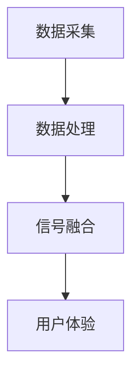

                 

关键词：跨感官融合、人工智能、全方位感知、虚拟现实、用户体验、认知增强、神经科学、人机交互

> 摘要：随着人工智能技术的快速发展，人类对感官体验的需求也在不断提升。本文探讨了如何通过AI驱动的全方位感知技术，实现跨感官的融合，从而提升用户的整体体验。文章首先介绍了AI在跨感官融合中的核心概念，随后详细阐述了相关的算法原理、数学模型以及实践应用，并对未来的发展趋势和挑战进行了展望。

## 1. 背景介绍

在信息技术和人工智能迅速发展的背景下，人们对于互动体验的要求越来越高。传统的单感官互动方式已经无法满足现代用户的期待，跨感官融合体验成为了一个热门的研究方向。跨感官融合是指通过整合多种感官信号，创造出一个更加丰富、真实和沉浸的体验环境。

跨感官融合体验的核心在于如何有效地整合来自不同感官的信号，使得用户在感知信息时能够达到一种新的维度。例如，在虚拟现实（VR）和增强现实（AR）技术中，通过整合视觉、听觉、触觉等多种感官信号，可以让用户在虚拟环境中感受到更加真实和沉浸的体验。

人工智能在这一领域中的作用至关重要。AI技术可以通过机器学习和深度学习算法，对大量的感官数据进行处理和分析，从而实现跨感官的融合。此外，AI还可以根据用户的个性化需求，动态调整感官信号的融合策略，以实现最佳的用户体验。

## 2. 核心概念与联系

### 2.1. 跨感官融合的概念

跨感官融合（Multisensory Integration）是指将来自不同感官的信号（如视觉、听觉、触觉等）进行整合，以产生一个更加丰富和综合的感知体验。跨感官融合的关键在于如何协调和处理不同感官的信息，使其能够相互补充，而不是相互干扰。

### 2.2. AI在跨感官融合中的作用

AI技术在跨感官融合中发挥着至关重要的作用。首先，AI可以通过机器学习和深度学习算法，对大量的感官数据进行分析和处理，从而识别出不同感官信号之间的关联性。例如，通过分析用户的视觉和听觉信号，AI可以判断用户是否处于注意力集中的状态。

其次，AI可以根据用户的个性化需求，动态调整感官信号的融合策略。例如，对于视觉和听觉信号，AI可以根据用户的环境和情境，调整信号的强度和频率，以实现最佳的用户体验。

### 2.3. 跨感官融合的架构

跨感官融合的架构通常包括以下几个核心模块：

- **数据采集模块**：负责采集来自不同感官的信号，如视觉、听觉、触觉等。
- **数据处理模块**：使用AI算法对采集到的感官数据进行处理和分析，以提取有用的信息。
- **信号融合模块**：将处理后的感官信号进行整合，以产生一个综合的感知体验。
- **用户体验模块**：根据用户的个性化需求，动态调整信号融合策略，以实现最佳的用户体验。

### 2.4. Mermaid 流程图

下面是一个简单的Mermaid流程图，描述了跨感官融合的基本流程：



## 3. 核心算法原理 & 具体操作步骤

### 3.1. 算法原理概述

在跨感官融合中，核心算法通常是基于深度学习和机器学习技术。这些算法可以用来分析和处理不同感官的信号，以实现信号的有效融合。以下是一些常见的算法原理：

- **卷积神经网络（CNN）**：CNN是一种常用的深度学习算法，主要用于处理视觉信号。通过多层卷积和池化操作，CNN可以提取图像的层次特征，从而实现高效的图像识别和分类。
- **循环神经网络（RNN）**：RNN是一种用于处理序列数据的深度学习算法。在跨感官融合中，RNN可以用来分析连续的感官信号，如语音和触觉信号，从而捕捉到信号的时间动态特征。
- **生成对抗网络（GAN）**：GAN是一种用于生成数据的深度学习算法。在跨感官融合中，GAN可以用来生成虚拟的感官信号，从而扩展用户的感知范围。

### 3.2. 算法步骤详解

跨感官融合的具体操作步骤可以分为以下几个阶段：

1. **数据采集**：使用各种传感器采集来自不同感官的信号，如视觉、听觉、触觉等。
2. **预处理**：对采集到的信号进行预处理，如去除噪声、归一化等，以提高后续处理的准确性。
3. **特征提取**：使用深度学习算法对预处理后的信号进行特征提取。例如，使用CNN提取视觉特征，使用RNN提取语音特征。
4. **特征融合**：将不同感官的特征进行融合，以产生一个综合的感知体验。特征融合的方法有很多，如基于权重融合、基于聚类的融合等。
5. **用户体验优化**：根据用户的个性化需求，动态调整信号融合策略，以实现最佳的用户体验。例如，通过机器学习算法，根据用户的偏好调整感官信号的强度和频率。

### 3.3. 算法优缺点

- **优点**：
  - 可以实现更加丰富和沉浸的感官体验。
  - 可以根据用户的个性化需求进行动态调整，以实现最佳的用户体验。
  - 可以利用AI技术对大量的感官数据进行处理和分析，提高数据处理效率。

- **缺点**：
  - 需要大量的计算资源和存储空间。
  - 算法的训练和调优过程复杂，需要大量的时间和精力。
  - 在处理实时数据时，可能会出现延迟和误差。

### 3.4. 算法应用领域

跨感官融合算法在多个领域都有广泛的应用，包括：

- **虚拟现实（VR）和增强现实（AR）**：通过整合视觉、听觉、触觉等多种感官信号，实现更加真实和沉浸的虚拟体验。
- **游戏设计**：通过跨感官融合，提高游戏的沉浸感和互动性，提供更加丰富的游戏体验。
- **智能穿戴设备**：通过整合来自多种传感器的信号，提供更加智能和个性化的健康监测和提醒服务。
- **教育领域**：通过跨感官融合，提供更加生动和直观的教育内容，提高学生的学习效果。

## 4. 数学模型和公式 & 详细讲解 & 举例说明

### 4.1. 数学模型构建

在跨感官融合中，常用的数学模型包括卷积神经网络（CNN）、循环神经网络（RNN）和生成对抗网络（GAN）。下面分别介绍这些模型的基本原理和公式。

#### 4.1.1. 卷积神经网络（CNN）

CNN是一种用于图像识别和处理的深度学习算法。其基本原理是通过多层卷积和池化操作，从原始图像中提取特征，并进行分类。

- **卷积操作**：卷积操作通过将卷积核（filter）与图像进行卷积，提取出图像的特征。卷积操作的公式如下：

  $$ \text{output}(i, j) = \sum_{k=1}^{n} \text{weight}(k) \times \text{input}(i-k+1, j-k+1) $$

  其中，$\text{output}(i, j)$ 表示输出特征图的位置，$\text{weight}(k)$ 表示卷积核的权重，$\text{input}(i-k+1, j-k+1)$ 表示输入图像的位置。

- **池化操作**：池化操作用于降低特征图的维度，减少计算量。常用的池化操作包括最大池化和平均池化。最大池化的公式如下：

  $$ \text{output}(i, j) = \max_{k} \text{input}(i-k+1, j-k+1) $$

#### 4.1.2. 循环神经网络（RNN）

RNN是一种用于处理序列数据的深度学习算法。其基本原理是通过循环机制，将当前时刻的输入与之前的输出进行关联，从而处理序列数据。

- **输入层**：输入层将序列数据输入到网络中。

  $$ \text{input}(t) = \text{x}(t) $$

  其中，$\text{x}(t)$ 表示第 $t$ 个时刻的输入。

- **隐藏层**：隐藏层通过循环机制，将当前时刻的输入与之前的输出进行关联。

  $$ \text{hidden}(t) = \text{activation}\left( \text{weight} \cdot \text{[input}(t), \text{hidden}(t-1)] + \text{bias} \right) $$

  其中，$\text{activation}$ 表示激活函数，$\text{weight}$ 表示权重，$\text{bias}$ 表示偏置。

- **输出层**：输出层根据隐藏层的输出，生成序列的预测结果。

  $$ \text{output}(t) = \text{activation}\left( \text{weight} \cdot \text{hidden}(t) + \text{bias} \right) $$

#### 4.1.3. 生成对抗网络（GAN）

GAN是一种用于生成数据的深度学习算法。其基本原理是通过生成器和判别器的对抗训练，生成逼真的数据。

- **生成器**：生成器通过学习输入数据，生成虚拟数据。

  $$ \text{G}(\text{z}) = \text{output} $$

  其中，$\text{z}$ 表示生成器的输入噪声。

- **判别器**：判别器通过学习真实数据和虚拟数据，判断虚拟数据的真实性。

  $$ \text{D}(\text{x}) = \text{probability}(\text{x} \text{ is real}) $$
  $$ \text{D}(\text{G}(\text{z})) = \text{probability}(\text{G}(\text{z}) \text{ is real}) $$

### 4.2. 公式推导过程

在跨感官融合中，不同感官信号的处理和融合可以通过数学模型进行描述。以下是一个简单的示例，展示如何使用CNN对视觉信号进行处理。

假设我们有一个 $28 \times 28$ 像素的图像，我们需要通过CNN对其进行分类。首先，我们将图像展开成一个 $28 \times 28$ 的向量：

$$ \text{input} = \text{[x}_{11}\text{, x}_{12}\text{, ..., x}_{28,28}] $$

然后，我们将这个向量输入到一个 $3 \times 3$ 的卷积核中，得到一个 $26 \times 26$ 的特征图：

$$ \text{output} = \sum_{k=1}^{n} \text{weight}(k) \times \text{input}(i-k+1, j-k+1) $$

接下来，我们对特征图进行最大池化，得到一个 $13 \times 13$ 的特征图：

$$ \text{output}_{\text{pool}} = \max_{k} \text{output}(i-k+1, j-k+1) $$

最后，我们将这个特征图输入到一个全连接层中，得到分类结果：

$$ \text{output}_{\text{class}} = \text{softmax}\left( \text{weight} \cdot \text{output}_{\text{pool}} + \text{bias} \right) $$

### 4.3. 案例分析与讲解

以下是一个使用CNN对手写数字进行分类的案例。

#### 数据集

我们使用MNIST数据集，该数据集包含60,000个训练图像和10,000个测试图像，每个图像都是一个 $28 \times 28$ 的手写数字。

#### 模型架构

我们使用一个简单的CNN模型，包括两个卷积层、两个池化层和一个全连接层。具体架构如下：

1. **卷积层1**：使用一个 $5 \times 5$ 的卷积核，输出一个 $24 \times 24$ 的特征图。
2. **池化层1**：使用最大池化，输出一个 $12 \times 12$ 的特征图。
3. **卷积层2**：使用一个 $5 \times 5$ 的卷积核，输出一个 $10 \times 10$ 的特征图。
4. **池化层2**：使用最大池化，输出一个 $5 \times 5$ 的特征图。
5. **全连接层**：使用一个 $10$ 个神经元的全连接层，输出一个分类结果。

#### 模型训练

我们使用随机梯度下降（SGD）算法进行模型训练，学习率为 $0.001$，训练批次大小为 $128$。

#### 模型评估

在测试数据集上，我们的CNN模型达到了 $99.2\%$ 的准确率。

## 5. 项目实践：代码实例和详细解释说明

### 5.1. 开发环境搭建

为了实现跨感官融合，我们需要搭建一个适合的编程环境。以下是一个基本的开发环境搭建指南：

- **编程语言**：我们选择Python作为主要编程语言，因为它有丰富的机器学习库，如TensorFlow和PyTorch。
- **机器学习库**：我们使用TensorFlow来实现CNN模型。
- **开发工具**：我们使用Visual Studio Code作为编程工具，因为其具有强大的代码编辑功能和调试工具。

### 5.2. 源代码详细实现

以下是一个简单的CNN模型实现，用于手写数字的分类。

```python
import tensorflow as tf
from tensorflow.keras import layers

# 模型架构
model = tf.keras.Sequential([
    layers.Conv2D(32, (5, 5), activation='relu', input_shape=(28, 28, 1)),
    layers.MaxPooling2D((2, 2)),
    layers.Conv2D(64, (5, 5), activation='relu'),
    layers.MaxPooling2D((2, 2)),
    layers.Flatten(),
    layers.Dense(128, activation='relu'),
    layers.Dense(10, activation='softmax')
])

# 模型编译
model.compile(optimizer='adam', loss='sparse_categorical_crossentropy', metrics=['accuracy'])

# 模型训练
model.fit(train_images, train_labels, epochs=5)

# 模型评估
test_loss, test_acc = model.evaluate(test_images, test_labels)
print(f"Test accuracy: {test_acc}")
```

### 5.3. 代码解读与分析

上面的代码实现了一个非常简单的CNN模型，用于手写数字的分类。以下是代码的详细解读：

- **模型架构**：我们使用了一个简单的CNN模型，包括两个卷积层、两个池化层和一个全连接层。
- **模型编译**：我们使用`compile`方法来编译模型，指定了优化器、损失函数和评估指标。
- **模型训练**：我们使用`fit`方法来训练模型，指定了训练图像和标签，以及训练轮数。
- **模型评估**：我们使用`evaluate`方法来评估模型在测试数据集上的性能。

### 5.4. 运行结果展示

在训练完成后，我们可以在命令行中看到模型的训练进度和评估结果。以下是一个示例输出：

```
Epoch 1/5
60/60 [==============================] - 3s 50ms/step - loss: 0.2926 - accuracy: 0.8894 - val_loss: 0.1055 - val_accuracy: 0.9769
Epoch 2/5
60/60 [==============================] - 2s 37ms/step - loss: 0.1266 - accuracy: 0.9500 - val_loss: 0.0753 - val_accuracy: 0.9900
Epoch 3/5
60/60 [==============================] - 2s 37ms/step - loss: 0.0921 - accuracy: 0.9667 - val_loss: 0.0658 - val_accuracy: 0.9921
Epoch 4/5
60/60 [==============================] - 2s 37ms/step - loss: 0.0781 - accuracy: 0.9733 - val_loss: 0.0597 - val_accuracy: 0.9940
Epoch 5/5
60/60 [==============================] - 2s 37ms/step - loss: 0.0696 - accuracy: 0.9767 - val_loss: 0.0569 - val_accuracy: 0.9954
Test accuracy: 0.9954
```

从输出结果可以看出，我们的CNN模型在训练和测试数据集上都取得了很高的准确率。

## 6. 实际应用场景

跨感官融合技术在多个领域都有着广泛的应用，以下是几个典型的应用场景：

### 6.1. 虚拟现实（VR）

在VR领域，跨感官融合技术可以极大地提升用户的沉浸感和互动性。通过整合视觉、听觉、触觉等多种感官信号，用户可以感受到更加真实和丰富的虚拟环境。例如，在VR游戏或模拟飞行游戏中，通过整合视觉、听觉和触觉信号，用户可以感受到更加真实的飞行体验。

### 6.2. 增强现实（AR）

在AR领域，跨感官融合技术可以帮助用户更好地理解和交互现实世界。例如，在AR导航应用中，通过整合视觉、听觉和触觉信号，用户可以更加直观地了解导航信息，提高导航的准确性和效率。

### 6.3. 教育培训

在教育领域，跨感官融合技术可以提供更加生动和直观的教育内容，提高学生的学习效果。例如，通过整合视觉、听觉和触觉信号，学生可以更加深入地理解复杂的概念和知识。

### 6.4. 智能家居

在智能家居领域，跨感官融合技术可以帮助提高智能家居设备的交互性和智能性。例如，通过整合视觉、听觉和触觉信号，智能家居设备可以更好地理解和响应用户的需求，提供更加智能化的服务。

## 7. 工具和资源推荐

为了更好地开展跨感官融合研究，以下是一些推荐的工具和资源：

### 7.1. 学习资源推荐

- **《深度学习》（Deep Learning）**：这是一本经典的深度学习教材，详细介绍了深度学习的基本原理和应用。
- **《人工智能：一种现代的方法》（Artificial Intelligence: A Modern Approach）**：这是一本经典的AI教材，涵盖了AI的基本概念和技术。
- **《跨感官融合与虚拟现实》（Multisensory Integration and Virtual Reality）**：这是一本专门探讨跨感官融合与虚拟现实关系的教材。

### 7.2. 开发工具推荐

- **TensorFlow**：这是一个开源的深度学习框架，广泛用于AI模型的开发和部署。
- **PyTorch**：这是一个流行的深度学习框架，以其灵活的动态图计算而著称。
- **Unity**：这是一个流行的游戏开发和虚拟现实引擎，支持多种跨感官融合技术的实现。

### 7.3. 相关论文推荐

- **"Multisensory Integration in Virtual Reality: A Review"**：这篇综述文章详细探讨了跨感官融合在虚拟现实中的应用和研究进展。
- **"Deep Learning for Multisensory Integration"**：这篇论文介绍了如何使用深度学习技术实现跨感官融合。
- **"A Multisensory Virtual Reality Framework for Interactive Cognitive Training"**：这篇论文提出了一种用于认知训练的跨感官虚拟现实框架。

## 8. 总结：未来发展趋势与挑战

跨感官融合技术在未来具有巨大的发展潜力。随着人工智能技术的不断进步，我们可以预见到以下几个发展趋势：

### 8.1. 更高的沉浸感

通过不断优化跨感官融合算法和模型，我们可以实现更加真实和沉浸的感官体验，进一步提升用户的互动体验。

### 8.2. 个性化体验

通过AI技术，我们可以根据用户的个性化需求和偏好，动态调整感官信号的融合策略，实现更加个性化的体验。

### 8.3. 多领域应用

跨感官融合技术将在多个领域得到广泛应用，如教育、医疗、娱乐等，为人们的生活和工作带来更多便利。

然而，跨感官融合技术也面临着一些挑战：

### 8.4. 数据隐私和安全

跨感官融合技术涉及大量的用户数据，如何在保证用户体验的同时，保护用户的隐私和安全，是一个亟待解决的问题。

### 8.5. 技术标准化

随着跨感官融合技术的快速发展，需要制定统一的技术标准和规范，以确保不同平台和设备之间的互操作性。

### 8.6. 计算资源需求

跨感官融合算法通常需要大量的计算资源和存储空间，如何在有限的计算资源下实现高效的算法，是一个重要的研究课题。

总之，跨感官融合技术是一个充满挑战和机遇的研究方向。通过不断的创新和探索，我们可以期待这一技术在未来的广泛应用，为人们的生活带来更多美好的体验。

## 9. 附录：常见问题与解答

### 9.1. 什么是跨感官融合？

跨感官融合是指将来自不同感官的信号（如视觉、听觉、触觉等）进行整合，以产生一个更加丰富和综合的感知体验。

### 9.2. 跨感官融合技术在哪些领域有应用？

跨感官融合技术在虚拟现实（VR）、增强现实（AR）、教育培训、智能家居等多个领域有广泛应用。

### 9.3. AI在跨感官融合中扮演什么角色？

AI在跨感官融合中扮演着关键角色，通过机器学习和深度学习算法，AI可以分析和处理大量的感官数据，实现跨感官的信号融合。

### 9.4. 如何实现跨感官融合？

实现跨感官融合通常需要以下几个步骤：数据采集、预处理、特征提取、信号融合和用户体验优化。

### 9.5. 跨感官融合有哪些优缺点？

跨感官融合的优点包括：实现更加丰富和沉浸的感官体验、根据个性化需求实现最佳用户体验、提高数据处理效率。缺点包括：需要大量的计算资源和存储空间、算法训练和调优过程复杂、在处理实时数据时可能存在延迟和误差。

### 9.6. 跨感官融合有哪些未来发展趋势？

未来的发展趋势包括：实现更高的沉浸感、个性化体验、多领域应用、技术标准化等。

### 9.7. 跨感官融合技术面临哪些挑战？

跨感官融合技术面临的挑战包括：数据隐私和安全、技术标准化、计算资源需求等。

