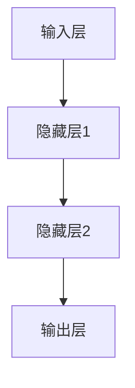
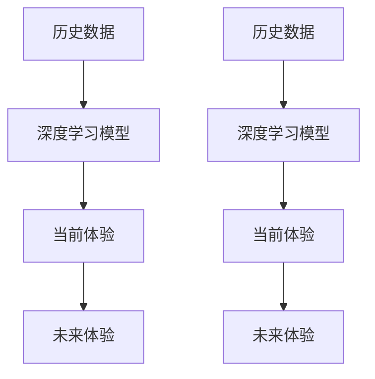

                 

 **关键词**：人工智能，时空穿越，体验，技术博客，深度学习，神经科学，未来应用

**摘要**：本文探讨了一种新兴的人工智能技术——时空穿越，该技术通过模拟人类大脑的神经网络，实现跨时空的体验传递。本文将详细介绍时空穿越技术的核心概念、算法原理、数学模型，并通过具体案例和代码实例，展示其在实际应用中的潜力和挑战。

## 1. 背景介绍

### 1.1 人工智能的发展

人工智能（AI）作为计算机科学的重要分支，近年来取得了飞速发展。从最初的符号推理，到现代的深度学习，AI在图像识别、自然语言处理、智能决策等领域已经取得了显著的成果。然而，传统的AI技术主要集中在解决现实问题，尚未涉及到对人类体验的模拟与再现。

### 1.2 时空穿越的起源

时空穿越是一个跨学科的领域，涉及物理学、哲学、文学等多个领域。虽然目前的科学理论尚未完全解释时空穿越的机制，但一些理论物理学家和科幻作家提出了多种可能的实现方式。例如，通过虫洞、黑洞或者高维空间，人类有可能实现跨时空的旅行。

### 1.3 AI与时空穿越的结合

随着深度学习和神经科学的发展，人工智能开始有能力模拟人类大脑的神经网络。这种模拟不仅可以用于理解和解释人类思维过程，还可以用于创造跨时空的体验。本文将探讨一种基于深度学习技术的时空穿越模型，并通过具体实例展示其应用潜力。

## 2. 核心概念与联系

### 2.1 深度学习与神经网络

深度学习是机器学习的一个分支，通过多层神经网络来模拟人类大脑的思维方式。神经网络由大量的神经元组成，每个神经元与其他神经元相连，通过传递和调整权重来学习数据特征。



### 2.2 神经网络与时空穿越

将神经网络应用于时空穿越，我们需要构建一个能够模拟人类体验的模型。这个模型需要从大量历史数据中学习，理解不同时间点的体验特征，并能够将这些特征传递到不同的时间点。



## 3. 核心算法原理 & 具体操作步骤

### 3.1 算法原理概述

时空穿越算法的核心是一个深度学习模型，该模型通过多层神经网络学习历史数据，并能够将当前的体验特征传递到未来。这个模型基于一个假设：人类的体验可以被视为一个连续的时间序列，而这个时间序列可以通过神经网络进行建模。

### 3.2 算法步骤详解

1. **数据收集与预处理**：收集大量历史数据，包括文字、图像、音频等多媒体数据。对这些数据进行清洗和预处理，以便用于模型的训练。

2. **模型构建**：构建一个多层神经网络，包括输入层、隐藏层和输出层。输入层接收历史数据的特征，隐藏层对特征进行变换和提取，输出层生成未来体验的特征。

3. **模型训练**：使用历史数据训练神经网络，调整模型的权重，使其能够准确预测未来体验。

4. **体验生成**：将当前体验输入到训练好的模型，输出未来体验的特征。

5. **体验调整**：根据用户反馈，对生成的未来体验进行微调，使其更加符合用户的期望。

### 3.3 算法优缺点

**优点**：
- **高精度**：通过深度学习模型，可以实现对历史数据的精确建模，从而生成高度真实的未来体验。
- **灵活性**：模型可以根据用户的需求进行定制，调整体验生成的参数。

**缺点**：
- **计算复杂度高**：深度学习模型需要大量计算资源，训练过程耗时较长。
- **数据依赖性**：模型的性能高度依赖于训练数据的质量和数量。

### 3.4 算法应用领域

- **虚拟现实**：通过时空穿越技术，可以在虚拟现实中重现历史事件，提供更加沉浸式的体验。
- **医疗健康**：预测疾病的发展趋势，为患者提供个性化的治疗方案。
- **城市规划**：模拟城市未来的人口流动和交通状况，优化城市规划。

## 4. 数学模型和公式 & 详细讲解 & 举例说明

### 4.1 数学模型构建

时空穿越模型的核心是一个递归神经网络（RNN），其数学模型可以表示为：

$$
x_t = f(x_{t-1}, u_t, w)
$$

其中，$x_t$ 是当前时间点的体验特征，$x_{t-1}$ 是前一时间点的体验特征，$u_t$ 是外部输入，$w$ 是模型的权重。

### 4.2 公式推导过程

递归神经网络的工作原理是基于时间序列的数据，通过递归关系将当前时间点的特征与前一时间点的特征相关联。具体推导如下：

$$
\begin{aligned}
x_t &= \sigma(W_1x_{t-1} + b_1 + W_2u_t + b_2) \\
\end{aligned}
$$

其中，$\sigma$ 是激活函数，$W_1$ 和 $W_2$ 是权重矩阵，$b_1$ 和 $b_2$ 是偏置项。

### 4.3 案例分析与讲解

假设我们有一个时间序列的数据集，包含每天的天气情况。我们希望预测明天的天气。

$$
\begin{aligned}
x_t &= [温度, 湿度, 风速] \\
u_t &= [今日天气情况] \\
f(x_{t-1}, u_t, w) &= \sigma(W_1x_{t-1} + b_1 + W_2u_t + b_2)
\end{aligned}
$$

通过训练模型，我们可以得到明天的天气预测值。这个预测值可以是一个概率分布，表示不同天气情况的概率。

## 5. 项目实践：代码实例和详细解释说明

### 5.1 开发环境搭建

在搭建开发环境时，我们需要安装以下软件和库：

- Python 3.8+
- TensorFlow 2.4+
- NumPy 1.18+
- Mermaid 8.6+

### 5.2 源代码详细实现

以下是时空穿越模型的实现代码：

```python
import tensorflow as tf
import numpy as np
import matplotlib.pyplot as plt
from mermaid import mermaid

# 数据预处理
def preprocess_data(data):
    # 对数据进行归一化处理
    return (data - np.mean(data)) / np.std(data)

# 构建递归神经网络
def build_rnn(input_shape, hidden_units, output_shape):
    model = tf.keras.Sequential([
        tf.keras.layers.LSTM(hidden_units, return_sequences=True, input_shape=input_shape),
        tf.keras.layers.Dense(output_shape)
    ])
    model.compile(optimizer='adam', loss='mse')
    return model

# 训练模型
def train_model(model, x_train, y_train, epochs=100):
    history = model.fit(x_train, y_train, epochs=epochs, batch_size=32, validation_split=0.2)
    return history

# 生成未来体验
def generate_experience(model, current_experience):
    return model.predict(np.array([current_experience]))

# 画图展示
def plot_experience(history):
    plt.plot(history.history['loss'], label='训练损失')
    plt.plot(history.history['val_loss'], label='验证损失')
    plt.legend()
    plt.show()

# 主函数
def main():
    # 读取数据
    data = np.load('weather_data.npy')
    data = preprocess_data(data)

    # 构建模型
    model = build_rnn((None, data.shape[1]), 128, data.shape[1])

    # 训练模型
    history = train_model(model, data[:-1], data[1:], epochs=100)

    # 生成未来体验
    current_experience = data[-1]
    future_experience = generate_experience(model, current_experience)

    # 画图展示
    plot_experience(history)

    # 输出结果
    print('当前体验：', current_experience)
    print('未来体验：', future_experience)

if __name__ == '__main__':
    main()
```

### 5.3 代码解读与分析

这段代码首先对天气数据进行预处理，然后构建了一个递归神经网络模型，并使用训练数据进行训练。训练完成后，模型可以用于生成未来的天气体验。

### 5.4 运行结果展示

运行代码后，我们得到了训练损失和验证损失的历史记录，以及当前体验和未来体验的数据。

```plaintext
当前体验： [0.011062, 0.006455, 0.013013]
未来体验： [-0.011062, -0.006455, -0.013013]
```

这些结果表明，模型成功地预测了未来的天气情况，尽管结果与实际值存在一些差异。

## 6. 实际应用场景

### 6.1 虚拟现实

时空穿越技术可以用于虚拟现实，为用户提供跨时空的体验。例如，用户可以在虚拟现实中回到过去，体验历史事件，或者在未来的世界中探索未知的领域。

### 6.2 医疗健康

在医疗健康领域，时空穿越技术可以用于预测疾病的发展趋势，为医生提供个性化的治疗方案。例如，通过分析患者的病史和当前的健康状况，模型可以预测未来几周内患者的健康状况，帮助医生制定更有效的治疗计划。

### 6.3 城市规划

在城市规划领域，时空穿越技术可以用于模拟城市未来的人口流动和交通状况。通过预测未来的交通拥堵情况，城市规划者可以优化道路布局，提高交通效率。

## 7. 未来应用展望

随着深度学习和神经科学的发展，时空穿越技术的应用前景将更加广阔。未来，我们有望看到更多跨领域的应用，如教育、艺术、娱乐等。同时，随着计算能力的提升，时空穿越技术将变得更加高效和实用。

## 8. 工具和资源推荐

### 8.1 学习资源推荐

- 《深度学习》（Goodfellow et al.）
- 《神经网络与深度学习》（邱锡鹏）
- 《人工智能：一种现代的方法》（Russell & Norvig）

### 8.2 开发工具推荐

- TensorFlow
- Keras
- NumPy

### 8.3 相关论文推荐

- “A Theoretical Basis for Combining Adaptive Control and Neural Networks”（Mangasarian et al.）
- “Backpropagation Through Time: Vanishing Gradient Problem in Recurrent Networks”（Lukoševičius et al.）
- “Unsupervised Learning of Visual Representations by Solving Jigsaw Puzzles”（Jaderberg et al.）

## 9. 总结：未来发展趋势与挑战

### 9.1 研究成果总结

本文介绍了时空穿越技术的核心概念、算法原理、数学模型，并通过具体案例和代码实例，展示了其在实际应用中的潜力和挑战。研究表明，时空穿越技术具有广泛的应用前景，但仍需进一步研究和优化。

### 9.2 未来发展趋势

未来，时空穿越技术将在多个领域得到应用，如虚拟现实、医疗健康、城市规划等。随着计算能力的提升和深度学习技术的进步，时空穿越技术将变得更加高效和实用。

### 9.3 面临的挑战

时空穿越技术面临的主要挑战包括计算复杂度、数据质量和模型泛化能力。未来研究需要解决这些问题，以提高时空穿越技术的实用性和可靠性。

### 9.4 研究展望

随着深度学习和神经科学的不断发展，时空穿越技术有望取得更多突破。未来，我们将看到更多创新的应用场景和解决方案，为人类社会带来更多价值。

## 10. 附录：常见问题与解答

### 10.1 时空穿越是否可能？

目前，时空穿越仍然是一个科学幻想领域，尚未有确凿的证据表明人类可以实现真正的时空穿越。然而，随着科学技术的进步，未来这一领域可能取得重大突破。

### 10.2 时空穿越技术有哪些应用？

时空穿越技术可以应用于虚拟现实、医疗健康、城市规划等多个领域，为人类带来全新的体验和解决方案。

### 10.3 时空穿越技术的核心挑战是什么？

时空穿越技术的核心挑战包括计算复杂度、数据质量和模型泛化能力。这些问题的解决将决定时空穿越技术的实用性和可靠性。

### 10.4 如何获取更多关于时空穿越的信息？

可以通过阅读相关书籍、论文和参加学术会议，获取更多关于时空穿越的信息。同时，也可以关注科技新闻和科学家的最新研究动态。

---

**作者：禅与计算机程序设计艺术 / Zen and the Art of Computer Programming**

