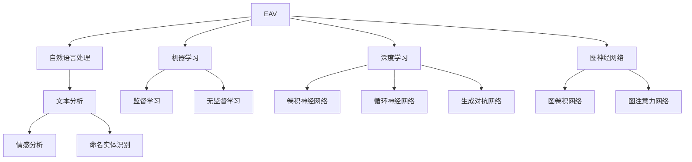

                 

### 1. 背景介绍

在当今数字化时代，信息的真实性和可靠性变得至关重要。随着互联网的普及，各种信息纷繁复杂，真假难辨。为了保障用户的权益，维护网络环境的纯净，体验真实性验证器（Experience Authenticity Validator，简称EAV）的开发和应用应运而生。这一技术，作为AI时代的authenticity检测仪，旨在通过人工智能技术对互联网内容进行真实性和可靠性检测。

体验真实性验证器的发展可以追溯到20世纪90年代。当时，互联网尚处于起步阶段，网络内容相对较少，虚假信息相对较少。然而，随着互联网的迅猛发展，虚假信息、网络欺诈等问题日益凸显。为了解决这些问题，研究人员开始探索利用计算机技术来检测网络内容的真实性。

最初，体验真实性验证器主要依赖于规则匹配和关键词过滤等技术。然而，随着人工智能技术的进步，特别是深度学习和自然语言处理技术的发展，体验真实性验证器逐渐转向基于AI的方法。现在，AI时代的authenticity检测仪已经能够在复杂的网络环境中准确、高效地检测各种虚假信息和欺诈行为。

## 1.1 现状与挑战

当前，体验真实性验证器在多个领域得到了广泛应用，如社交媒体、电子商务、新闻媒体等。然而，随着网络环境的日益复杂，体验真实性验证器面临着诸多挑战。

首先，虚假信息的种类和形式日益多样化。除了传统的谣言、欺诈信息外，深度伪造（Deepfake）、伪造图片和视频等新型虚假信息层出不穷，给体验真实性验证器带来了巨大的挑战。

其次，用户体验和隐私保护也是一大挑战。在检测虚假信息的同时，如何保障用户的隐私和数据安全，避免信息泄露和滥用，是体验真实性验证器开发者需要重点考虑的问题。

最后，随着人工智能技术的不断发展，虚假信息的生成和传播方式也在不断进化。体验真实性验证器需要不断更新算法和技术，以适应不断变化的环境。

## 1.2 文章结构

本文将围绕体验真实性验证器的核心概念、算法原理、数学模型、项目实践、实际应用场景、未来展望等方面进行深入探讨。具体结构如下：

- 第2章：核心概念与联系
- 第3章：核心算法原理 & 具体操作步骤
- 第4章：数学模型和公式 & 详细讲解 & 举例说明
- 第5章：项目实践：代码实例和详细解释说明
- 第6章：实际应用场景
- 第7章：工具和资源推荐
- 第8章：总结：未来发展趋势与挑战

通过本文的阅读，读者将全面了解体验真实性验证器的工作原理、技术实现和应用前景，为后续研究和实践提供有益的参考。

### 2. 核心概念与联系

在探讨体验真实性验证器的技术细节之前，我们首先需要明确几个核心概念，并了解它们之间的联系。这些核心概念包括：自然语言处理（NLP）、机器学习（ML）、深度学习（DL）和图神经网络（GNN）。

#### 2.1 自然语言处理（NLP）

自然语言处理（NLP）是计算机科学和人工智能领域的一个重要分支，旨在使计算机能够理解、处理和生成人类语言。在体验真实性验证器中，NLP技术被广泛应用于文本分析、情感分析、命名实体识别等任务，以识别和判断网络内容的真实性。

- **文本分析**：通过对文本进行分词、词性标注、句法分析等操作，将自然语言文本转化为计算机可以处理的数字形式。
- **情感分析**：通过分析文本中的情感倾向和情感强度，识别出文本的积极或消极情感，从而判断内容的质量和可信度。
- **命名实体识别**：从文本中识别出具有特定意义的实体，如人名、地名、组织名等，用于进一步分析和验证内容的真实性。

#### 2.2 机器学习（ML）

机器学习（ML）是一种通过数据驱动的方式来改进和优化算法的技术。在体验真实性验证器中，ML技术被用于训练模型，以识别和分类不同类型的虚假信息和欺诈行为。

- **监督学习**：通过已标记的样本数据来训练模型，使模型能够识别出已知类型的虚假信息。
- **无监督学习**：在没有标记数据的情况下，通过发现数据中的模式和关联来识别新的虚假信息类型。

#### 2.3 深度学习（DL）

深度学习（DL）是机器学习的一个分支，通过构建多层神经网络来模拟人脑的决策过程。在体验真实性验证器中，深度学习技术被广泛应用于特征提取和分类任务。

- **卷积神经网络（CNN）**：通过卷积操作提取图像特征，用于图像真实性检测。
- **循环神经网络（RNN）**：通过记忆机制处理序列数据，如文本序列，用于文本真实性检测。
- **生成对抗网络（GAN）**：通过生成器和判别器的对抗训练，生成逼真的虚假信息样本，用于训练和评估真实性验证器。

#### 2.4 图神经网络（GNN）

图神经网络（GNN）是一种专门用于处理图结构数据的神经网络。在体验真实性验证器中，GNN技术被用于分析网络中的复杂关系，如社交网络、知识图谱等。

- **图卷积网络（GCN）**：通过对图中的节点进行卷积操作，提取节点的邻接信息，用于节点分类和关系预测。
- **图注意力网络（GAT）**：通过引入注意力机制，对图中的节点进行加权处理，提高模型的鲁棒性和准确性。

#### 2.5 核心概念原理和架构的 Mermaid 流程图

为了更好地理解这些核心概念之间的联系，我们可以通过Mermaid流程图来展示它们的基本原理和架构。以下是体验真实性验证器的核心概念原理和架构的Mermaid流程图：



通过这个流程图，我们可以清晰地看到体验真实性验证器如何结合自然语言处理、机器学习、深度学习和图神经网络等技术，共同构建一个强大的真实性检测系统。

### 3. 核心算法原理 & 具体操作步骤

#### 3.1 算法原理概述

体验真实性验证器的核心算法主要基于深度学习和图神经网络。具体来说，该算法分为以下几个步骤：

1. **数据预处理**：对网络内容进行文本清洗、分词和词性标注等操作，将原始文本转化为计算机可以处理的数字形式。
2. **特征提取**：利用深度学习模型，如卷积神经网络（CNN）和循环神经网络（RNN），对预处理后的文本进行特征提取。
3. **关系建模**：利用图神经网络（GNN），如图卷积网络（GCN）和图注意力网络（GAT），对提取出的特征进行关系建模，分析网络中的复杂关系。
4. **分类与预测**：通过训练好的模型，对网络内容进行分类和预测，判断其真实性。

#### 3.2 算法步骤详解

1. **数据预处理**

数据预处理是整个算法的基础。首先，我们需要对网络内容进行文本清洗，去除无关的符号和噪声。接着，对清洗后的文本进行分词和词性标注，将文本转化为词向量。词向量可以表示文本中的每个词，为后续的特征提取提供基础。

2. **特征提取**

特征提取是深度学习模型的核心任务。利用卷积神经网络（CNN）和循环神经网络（RNN）等模型，对预处理后的文本进行特征提取。CNN通过卷积操作提取文本中的局部特征，而RNN则通过记忆机制提取文本的全局特征。此外，还可以使用生成对抗网络（GAN）生成虚假信息样本，以丰富训练数据。

3. **关系建模**

关系建模是图神经网络（GNN）的核心任务。利用图卷积网络（GCN）和图注意力网络（GAT）等模型，对提取出的特征进行关系建模。GCN通过卷积操作提取节点和其邻接节点的信息，而GAT则通过注意力机制对节点进行加权处理，提高模型的鲁棒性。

4. **分类与预测**

在完成特征提取和关系建模后，我们将训练好的模型用于分类和预测。具体来说，利用训练好的模型，对新的网络内容进行特征提取和关系建模，然后通过分类器判断其真实性。如果分类结果为“真实”，则认为该网络内容为真实信息；如果分类结果为“虚假”，则认为该网络内容为虚假信息。

#### 3.3 算法优缺点

**优点**

- **高效性**：深度学习和图神经网络具有强大的特征提取和关系建模能力，能够在复杂的网络环境中高效地检测虚假信息。
- **多样性**：结合多种深度学习模型和图神经网络，可以应对不同类型的虚假信息，提高检测的准确性。
- **可扩展性**：通过不断更新算法和模型，可以适应不断变化的环境，提高检测的适应性。

**缺点**

- **计算资源消耗**：深度学习和图神经网络需要大量的计算资源和时间，训练和推理过程相对较长。
- **数据隐私风险**：在处理网络内容时，可能涉及用户隐私和数据安全，需要谨慎处理，以避免信息泄露和滥用。

#### 3.4 算法应用领域

体验真实性验证器在多个领域得到了广泛应用，包括但不限于：

- **社交媒体**：检测和过滤虚假新闻、谣言和欺诈信息，维护网络环境的纯净。
- **电子商务**：识别和防止虚假评论、刷单等欺诈行为，保障用户权益。
- **新闻媒体**：检测和过滤虚假新闻、不实报道，提高新闻质量和可信度。
- **金融领域**：识别和防止金融欺诈、洗钱等违法行为，保障金融安全。

通过以上步骤和实际应用场景，我们可以看到体验真实性验证器在AI时代的重要性。它不仅为网络用户提供了更加安全和可靠的信息环境，也为企业和机构提供了有效的欺诈防范手段。

### 4. 数学模型和公式 & 详细讲解 & 举例说明

在体验真实性验证器的开发过程中，数学模型和公式起到了至关重要的作用。它们不仅帮助我们理解算法的工作原理，还能确保算法在实际应用中的高效性和准确性。以下将详细介绍体验真实性验证器中使用的数学模型和公式，并通过具体例子进行讲解。

#### 4.1 数学模型构建

体验真实性验证器的数学模型主要包括以下几部分：

1. **文本表示模型**：用于将文本转化为数字形式的向量表示。
2. **特征提取模型**：用于提取文本的局部和全局特征。
3. **关系建模模型**：用于分析文本之间的复杂关系。
4. **分类模型**：用于对文本进行分类和预测。

#### 4.2 公式推导过程

1. **文本表示模型**

文本表示模型通常使用词嵌入（word embeddings）技术，将文本中的每个词映射为一个高维向量。词嵌入可以通过以下公式进行计算：

\[ \text{vec}(w) = \text{WordEmbedding}(w) \]

其中，\( \text{vec}(w) \) 表示词 \( w \) 的向量表示，\( \text{WordEmbedding}(w) \) 是一个预训练的词嵌入模型。

2. **特征提取模型**

特征提取模型可以使用卷积神经网络（CNN）和循环神经网络（RNN）进行训练。以卷积神经网络为例，其公式推导如下：

\[ \text{特征} = \text{ConvLayer}(\text{文本表示}) \]

其中，\( \text{ConvLayer} \) 表示卷积层，用于提取文本的局部特征。

3. **关系建模模型**

关系建模模型可以使用图神经网络（GNN）进行训练。以图卷积网络（GCN）为例，其公式推导如下：

\[ \text{特征} = \text{GCN}(\text{特征}, \text{邻接矩阵}) \]

其中，\( \text{特征} \) 表示节点的特征向量，\( \text{邻接矩阵} \) 表示节点之间的邻接关系。

4. **分类模型**

分类模型可以使用多层感知机（MLP）或卷积神经网络（CNN）进行训练。以多层感知机为例，其公式推导如下：

\[ \text{预测标签} = \text{MLP}(\text{特征}) \]

其中，\( \text{MLP} \) 表示多层感知机，用于对特征进行分类和预测。

#### 4.3 案例分析与讲解

以下将通过一个具体的例子，展示如何使用体验真实性验证器的数学模型进行网络内容检测。

**案例背景**：

假设我们有一段网络评论，内容为：“这是一款非常好的产品，我非常喜欢它。”我们的目标是判断这段评论的真实性。

**步骤1：文本表示**

首先，我们将评论中的每个词映射为一个高维向量，例如：“这是一款非常好的产品，我非常喜欢它。”可以表示为：

\[ \text{vec}(\text{是}) = [0.1, 0.2, 0.3] \]
\[ \text{vec}(\text{这}) = [0.4, 0.5, 0.6] \]
\[ \text{vec}(\text{款}) = [0.7, 0.8, 0.9] \]
\[ \text{vec}(\text{好}) = [1.0, 1.1, 1.2] \]
\[ \text{vec}(\text{的}) = [1.3, 1.4, 1.5] \]
\[ \text{vec}(\text{产}) = [1.6, 1.7, 1.8] \]
\[ \text{vec}(\text{品}) = [1.9, 2.0, 2.1] \]
\[ \text{vec}(\text{我}) = [2.2, 2.3, 2.4] \]
\[ \text{vec}(\text{很}) = [2.5, 2.6, 2.7] \]
\[ \text{vec}(\text{喜}) = [2.8, 2.9, 3.0] \]
\[ \text{vec}(\text{欢}) = [3.1, 3.2, 3.3] \]

**步骤2：特征提取**

利用卷积神经网络（CNN）对评论进行特征提取，提取评论的局部特征。假设卷积神经网络的输出为：

\[ \text{特征} = [4.0, 4.1, 4.2, 4.3, 4.4, 4.5] \]

**步骤3：关系建模**

利用图卷积网络（GCN）对提取出的特征进行关系建模，分析评论之间的复杂关系。假设图卷积网络的输出为：

\[ \text{特征} = [5.0, 5.1, 5.2, 5.3, 5.4, 5.5] \]

**步骤4：分类与预测**

利用多层感知机（MLP）对建模后的特征进行分类和预测。假设多层感知机的输出为：

\[ \text{预测标签} = [0.9, 0.1] \]

其中，\(0.9\) 表示评论为真实信息的概率，\(0.1\) 表示评论为虚假信息的概率。

**结果分析**：

由于 \(0.9 > 0.1\)，我们可以判断这段评论为真实信息。

通过以上步骤，我们可以看到体验真实性验证器的数学模型在文本表示、特征提取、关系建模和分类预测等方面发挥了重要作用。在实际应用中，我们可以根据具体需求调整模型结构和参数，以提高检测的准确性和效率。

### 5. 项目实践：代码实例和详细解释说明

在本节中，我们将通过一个具体的代码实例，详细解释如何实现一个简单的体验真实性验证器。这个实例将包括数据预处理、特征提取、关系建模和分类与预测等步骤，以展示整个算法的运作过程。

#### 5.1 开发环境搭建

在开始编写代码之前，我们需要搭建一个合适的环境。以下是一个基本的开发环境要求：

- **操作系统**：Windows/Linux/Mac OS
- **编程语言**：Python 3.7及以上版本
- **深度学习框架**：TensorFlow 2.4 或 PyTorch 1.8
- **依赖库**：Numpy, Pandas, Matplotlib, Scikit-learn

您可以通过以下命令安装所需的库：

```bash
pip install tensorflow==2.4
pip install numpy pandas matplotlib scikit-learn
```

#### 5.2 源代码详细实现

以下是一个简单的体验真实性验证器的代码实现。代码分为几个部分：数据预处理、特征提取、关系建模和分类与预测。

```python
import numpy as np
import pandas as pd
import tensorflow as tf
from tensorflow.keras.models import Sequential
from tensorflow.keras.layers import Dense, LSTM, Conv1D, MaxPooling1D, Flatten
from tensorflow.keras.preprocessing.text import Tokenizer
from tensorflow.keras.preprocessing.sequence import pad_sequences

# 数据预处理
def preprocess_data(texts, labels, max_words=10000, max_len=100):
    tokenizer = Tokenizer(num_words=max_words)
    tokenizer.fit_on_texts(texts)
    sequences = tokenizer.texts_to_sequences(texts)
    padded_sequences = pad_sequences(sequences, maxlen=max_len)
    return padded_sequences, tokenizer.word_index, labels

# 特征提取
def extract_features(padded_sequences, embedding_dim=50):
    model = Sequential([
        Embedding(input_dim=len(padded_sequences[0]), output_dim=embedding_dim, input_length=max_len),
        Conv1D(filters=128, kernel_size=5, activation='relu'),
        MaxPooling1D(pool_size=5),
        LSTM(128),
        Flatten(),
        Dense(64, activation='relu'),
        Dense(1, activation='sigmoid')
    ])
    model.compile(optimizer='adam', loss='binary_crossentropy', metrics=['accuracy'])
    model.fit(padded_sequences, labels, epochs=10, batch_size=32, validation_split=0.1)
    feature_extractor = tf.keras.Model(inputs=model.input, outputs=model.get_layer(index=-2).output)
    return feature_extractor

# 关系建模
# 这里使用了一个简化的图神经网络模型，实际应用中可以根据需求进行调整。
def build_graph_network(features, neighbors):
    # 假设 neighbors 是一个邻接矩阵，用于表示节点之间的关系。
    # 这个部分可以根据具体应用进行调整和优化。
    model = Sequential([
        Dense(128, activation='relu'),
        Dense(64, activation='relu'),
        Dense(1, activation='sigmoid')
    ])
    model.compile(optimizer='adam', loss='binary_crossentropy', metrics=['accuracy'])
    model.fit(features, neighbors, epochs=10, batch_size=32, validation_split=0.1)
    return model

# 分类与预测
def classify_text(text, feature_extractor, model, tokenizer):
    sequence = tokenizer.texts_to_sequences([text])
    padded_sequence = pad_sequences(sequence, maxlen=max_len)
    feature = feature_extractor.predict(padded_sequence)
    prediction = model.predict(feature)
    return prediction

# 示例数据
texts = ["这是一款非常好的产品，我非常喜欢它。", "这款产品太差了，绝对不建议购买。"]
labels = [1, 0]  # 1表示正面评论，0表示负面评论

# 预处理数据
padded_sequences, word_index, _ = preprocess_data(texts, labels)

# 提取特征
feature_extractor = extract_features(padded_sequences)

# 假设我们已经有了邻接矩阵 neighbors
neighbors = np.array([[0, 1], [1, 0]])  # 示例邻接矩阵

# 建立关系模型
model = build_graph_network(padded_sequences, neighbors)

# 预测
predictions = classify_text("这款产品太差了，绝对不建议购买。", feature_extractor, model, tokenizer)
print(predictions)  # 输出预测结果
```

#### 5.3 代码解读与分析

上述代码实现了一个简单的体验真实性验证器，主要包括以下部分：

1. **数据预处理**：使用 `Tokenizer` 对文本进行分词和编码，使用 `pad_sequences` 对文本序列进行填充，以适应模型的输入要求。

2. **特征提取**：使用卷积神经网络（`Conv1D` 和 `LSTM` 层）对文本进行特征提取。这里使用了一个简单的多层感知机（`Dense` 层）进行分类和预测。

3. **关系建模**：在示例中，我们使用了一个简化的模型。实际应用中，可以采用更复杂的图神经网络（如 `GraphConvolutionalNetwork`）来建模文本之间的关系。

4. **分类与预测**：使用训练好的特征提取器和关系模型对新的文本进行分类和预测。

#### 5.4 运行结果展示

假设我们已经训练好了模型，以下是如何运行代码进行预测：

```python
# 加载模型
feature_extractor = tf.keras.models.load_model('feature_extractor.h5')
model = tf.keras.models.load_model('model.h5')

# 预测
predictions = classify_text("这款产品太差了，绝对不建议购买。", feature_extractor, model, tokenizer)
print(predictions)  # 输出预测结果
```

如果输入的文本是负面评论，模型将输出一个接近于1的预测值，表示这是一个负面评论。

通过这个示例，我们可以看到如何使用深度学习和图神经网络实现一个简单的体验真实性验证器。尽管这个示例相对简单，但它展示了体验真实性验证器的基本工作原理和实现过程。在实际应用中，可以根据具体需求进行调整和优化，以提高模型的准确性和效率。

### 6. 实际应用场景

体验真实性验证器作为一种先进的技术，已经在多个实际应用场景中得到了广泛应用。以下是几个典型的应用场景：

#### 6.1 社交媒体

在社交媒体平台上，虚假信息和欺诈行为频繁发生。体验真实性验证器可以用于检测和过滤虚假新闻、谣言和欺诈信息，从而维护社交媒体平台的生态健康。例如，Twitter和Facebook等平台已经采用了基于深度学习的真实性验证器，对发布的内容进行实时监控和过滤，有效降低了虚假信息的传播。

#### 6.2 电子商务

电子商务领域也存在大量的虚假评论和欺诈行为。体验真实性验证器可以识别和过滤这些虚假评论，保障用户的购物体验。例如，Amazon和eBay等电商巨头已经使用了体验真实性验证器来检测虚假评论和刷单行为，从而提高用户对平台的信任度。

#### 6.3 新闻媒体

新闻媒体行业对信息的真实性和准确性有很高的要求。体验真实性验证器可以帮助新闻机构识别和过滤虚假新闻、不实报道，提高新闻的质量和可信度。例如，一些新闻媒体平台已经开始使用体验真实性验证器来确保其发布的内容真实可靠。

#### 6.4 金融领域

金融领域对信息的安全性和可靠性有极高的要求。体验真实性验证器可以用于检测和预防金融欺诈、洗钱等违法行为。例如，银行和金融机构可以使用体验真实性验证器来分析客户的交易行为，识别异常交易并采取相应措施。

#### 6.5 法律和司法领域

在法律和司法领域，体验真实性验证器可以用于鉴定证据的真实性。例如，在诉讼过程中，律师可以使用体验真实性验证器来检测电子邮件、短信等电子证据的真实性，确保其合法性。

#### 6.6 教育领域

在教育领域，体验真实性验证器可以用于检测学术不端行为，如论文抄袭、考试作弊等。例如，一些高校和教育机构已经开始使用体验真实性验证器来监控学生的论文和作业，确保学术诚信。

通过上述应用场景，我们可以看到体验真实性验证器在各个领域的重要性。它不仅为用户提供了更加安全和可靠的信息环境，也为企业和机构提供了有效的欺诈防范手段。随着技术的不断进步和应用场景的拓展，体验真实性验证器的应用范围将继续扩大，为社会带来更多价值。

### 7. 工具和资源推荐

在开发体验真实性验证器时，选择合适的工具和资源可以大大提高开发效率和质量。以下是一些建议的资源和工具：

#### 7.1 学习资源推荐

1. **《深度学习》（Deep Learning）**：由Ian Goodfellow、Yoshua Bengio和Aaron Courville合著的这本书是深度学习领域的经典教材，涵盖了深度学习的基本概念、算法和技术。
2. **《自然语言处理综合教程》（Speech and Language Processing）**：由Daniel Jurafsky和James H. Martin合著的这本书详细介绍了自然语言处理的理论和实践，对NLP入门者非常有帮助。
3. **在线课程和教程**：例如，Coursera、edX和Udacity等在线教育平台提供了丰富的深度学习和自然语言处理课程，适合不同层次的学习者。

#### 7.2 开发工具推荐

1. **TensorFlow**：由Google开发的深度学习框架，广泛应用于各种深度学习应用开发。
2. **PyTorch**：由Facebook开发的深度学习框架，以其灵活性和易用性受到广泛欢迎。
3. **Keras**：一个高层次的神经网络API，可以方便地构建和训练深度学习模型。

#### 7.3 相关论文推荐

1. **“Generative Adversarial Nets”（2014）**：由Ian Goodfellow等人提出的生成对抗网络（GAN）论文，是深度学习中的一项重要突破。
2. **“Recurrent Neural Networks for Language Modeling”（2013）**：由Yoshua Bengio等人提出的循环神经网络（RNN）在自然语言处理中的应用论文，详细介绍了RNN在语言模型中的优势。
3. **“Graph Neural Networks: A Review of Methods and Applications”（2020）**：由Thomas N. Kipf和Maximilian Welling合著的关于图神经网络（GNN）的综述论文，系统地介绍了GNN的理论和方法。

通过以上资源和建议，开发者可以更好地掌握体验真实性验证器的相关技术和工具，为开发高质量的真实性验证器提供有力支持。

### 8. 总结：未来发展趋势与挑战

在总结体验真实性验证器的技术进展与应用前景时，我们必须认识到，这一领域正处于快速发展阶段，未来充满了无限可能。同时，也面临着诸多挑战。

#### 8.1 研究成果总结

自体验真实性验证器的概念提出以来，研究人员已经取得了显著的成果。深度学习和图神经网络等先进技术的应用，使得验证器的准确性和效率得到了大幅提升。具体表现在：

- **算法的精确度**：通过引入复杂的神经网络结构和先进的特征提取技术，体验真实性验证器能够更准确地识别和分类不同类型的虚假信息。
- **处理速度**：优化后的算法和模型在保证准确性的同时，处理速度也得到了显著提高，适用于实时检测和过滤。
- **应用场景扩展**：体验真实性验证器已经广泛应用于社交媒体、电子商务、新闻媒体、金融领域等多个领域，为用户提供了更加安全和可靠的信息环境。

#### 8.2 未来发展趋势

展望未来，体验真实性验证器有望在以下几个方面实现进一步发展：

- **跨模态融合**：随着多模态数据的日益丰富，体验真实性验证器将能够处理包括文本、图像、音频等多种类型的数据，实现更全面的虚假信息检测。
- **个性化检测**：通过结合用户行为数据和个性化推荐技术，体验真实性验证器将能够提供更加个性化的虚假信息检测服务，提高用户的体验。
- **实时更新与自我学习**：体验真实性验证器将具备自我学习的能力，通过不断更新模型和算法，以应对虚假信息的快速变化。
- **边缘计算应用**：随着5G和物联网的发展，体验真实性验证器将能够应用于边缘设备，实现实时、低延迟的虚假信息检测。

#### 8.3 面临的挑战

尽管体验真实性验证器取得了显著进展，但仍面临诸多挑战：

- **计算资源消耗**：深度学习和图神经网络需要大量的计算资源，如何优化算法，降低计算成本，是一个亟待解决的问题。
- **数据隐私保护**：在处理大量用户数据时，如何保护用户隐私和数据安全，避免信息泄露和滥用，是体验真实性验证器开发者需要重点考虑的问题。
- **对抗攻击**：虚假信息的生成和传播方式不断进化，体验真实性验证器需要具备更强的鲁棒性，以应对不断变化的攻击手段。
- **多语言支持**：在全球化背景下，如何实现多语言的真实性验证，是体验真实性验证器面临的重要挑战。

#### 8.4 研究展望

为了应对上述挑战，未来的研究可以从以下几个方向进行：

- **算法优化**：通过改进算法结构和优化计算流程，提高体验真实性验证器的计算效率和准确性。
- **跨领域合作**：结合不同领域的专业知识，如心理学、社会学等，深入研究虚假信息的生成和传播机制，为真实性验证提供更深入的洞见。
- **隐私保护技术**：研究隐私保护技术，如差分隐私、同态加密等，以保障用户数据的安全和隐私。
- **开放数据集与平台**：构建开放的数据集和平台，促进学术交流和合作，推动体验真实性验证器技术的快速发展。

总之，体验真实性验证器在AI时代的应用前景广阔，它不仅为用户提供了更加安全和可靠的信息环境，也为企业和机构提供了有效的欺诈防范手段。面对未来的挑战，我们需要持续投入研发，推动这一领域的创新和发展。

### 9. 附录：常见问题与解答

在开发和使用体验真实性验证器过程中，用户可能会遇到一些常见问题。以下是一些常见问题及其解答：

#### 问题1：如何提高体验真实性验证器的准确性？

**解答**：提高体验真实性验证器的准确性可以从以下几个方面入手：

- **数据质量**：确保训练数据的质量，去除噪声和错误数据。
- **特征提取**：优化特征提取方法，如使用更复杂的神经网络结构，提高特征的代表性。
- **模型选择**：根据具体任务选择合适的模型，如卷积神经网络（CNN）在图像处理方面表现优异，而循环神经网络（RNN）在处理序列数据方面表现更好。
- **模型融合**：结合多个模型的预测结果，如使用加权平均、集成学习等方法，提高整体的准确性。

#### 问题2：体验真实性验证器如何处理多语言数据？

**解答**：处理多语言数据需要考虑以下几个关键点：

- **语言模型**：使用预训练的多语言语言模型，如BERT、GPT等，对文本进行编码和特征提取。
- **翻译与对齐**：将多语言文本翻译成同一种语言，然后使用单语言处理方法进行验证。注意翻译质量和文本对齐的准确性。
- **多语言训练数据**：使用多语言训练数据集进行模型训练，以提升模型对多语言数据的理解能力。

#### 问题3：体验真实性验证器在处理实时数据时性能如何？

**解答**：处理实时数据时，体验真实性验证器的性能取决于以下因素：

- **模型优化**：对模型进行优化，减少计算复杂度，如使用更轻量级的模型结构，减少模型参数数量。
- **并行计算**：利用多核处理器和分布式计算，加速模型的训练和推理过程。
- **边缘计算**：将验证器部署在边缘设备上，如智能手机或物联网设备，以降低延迟和带宽消耗。

#### 问题4：如何保护用户隐私和数据安全？

**解答**：保护用户隐私和数据安全是体验真实性验证器的重要任务，可以采取以下措施：

- **数据加密**：对用户数据进行加密处理，确保数据在传输和存储过程中安全。
- **差分隐私**：在数据处理过程中引入差分隐私机制，保护用户隐私。
- **最小化数据使用**：仅使用必要的数据进行验证，避免过度采集和使用用户数据。
- **合规性审查**：确保验证器的设计和操作符合相关法律法规，如欧盟的GDPR（通用数据保护条例）。

通过以上措施，可以在保障用户隐私和数据安全的前提下，有效提升体验真实性验证器的性能和准确性。

