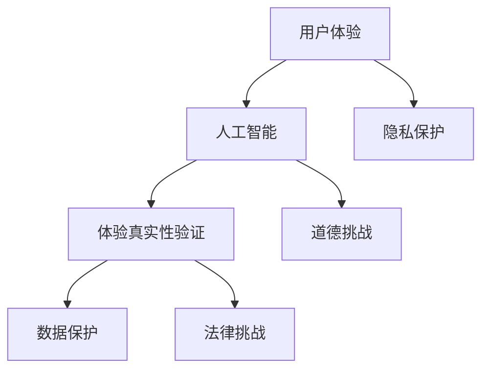
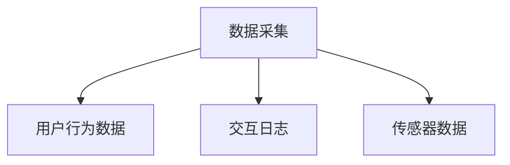
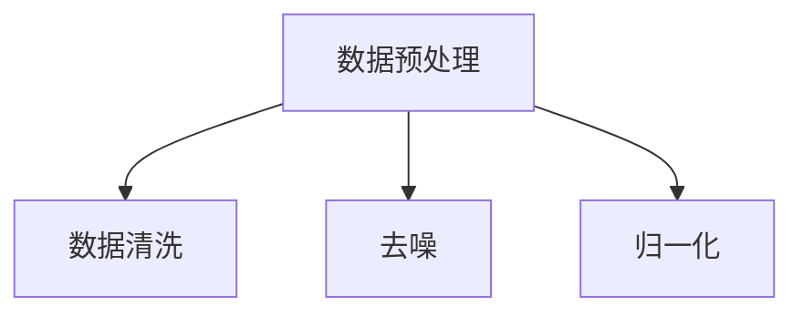
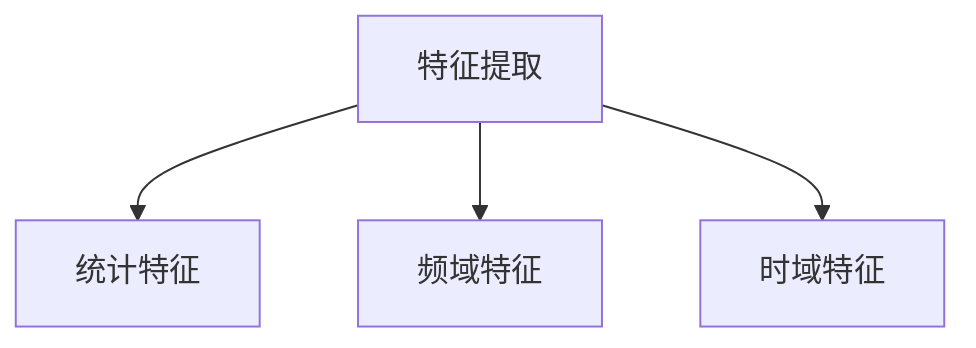
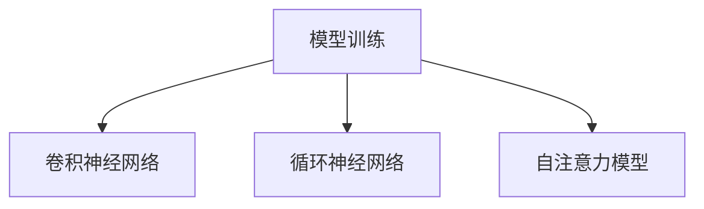
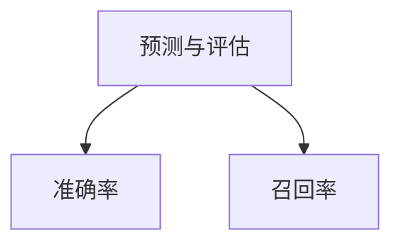

                 

在当今数字化时代，用户体验的真实性成为一个至关重要的议题。随着人工智能（AI）技术的迅猛发展，如何确保用户体验的真实性成为了新的挑战。本文旨在探讨AI时代的体验真实性验证，分析其核心概念、算法原理、应用场景以及未来发展趋势。

> 关键词：体验真实性验证，AI，用户体验，认证技术，算法，应用场景

> 摘要：本文首先介绍了体验真实性验证在AI时代的背景和重要性，随后深入分析了相关核心概念及其联系。接着，详细阐述了核心算法的原理和具体操作步骤，并对其优缺点和应用领域进行了讨论。在此基础上，文章还介绍了数学模型和公式的构建与推导，并通过具体案例进行了分析和讲解。随后，文章展示了项目实践的代码实例，并对实际应用场景进行了探讨。最后，文章推荐了相关学习资源和开发工具，总结了研究成果，展望了未来发展趋势与挑战。

## 1. 背景介绍

在互联网和移动互联网日益普及的今天，用户体验（UX）已经成为企业竞争的核心要素之一。良好的用户体验可以提升用户满意度，增强用户忠诚度，从而带来商业价值。然而，随着AI技术的广泛应用，用户体验的真实性变得愈发重要。AI技术的普及使得模拟和伪造用户体验成为可能，这给真实用户体验的检测带来了新的挑战。

### 1.1 AI技术的普及

AI技术的迅猛发展，使得虚拟助手、个性化推荐、自动翻译等应用无处不在。这些应用极大地提升了用户体验，但同时也为体验真实性验证带来了难题。如何确保用户在享受AI服务时所体验到的内容是真实的，而非被篡改或伪造的，成为了一个亟待解决的问题。

### 1.2 用户体验的重要性

用户体验是用户在使用产品或服务时所感受到的整体感受。一个良好的用户体验可以提升用户满意度，增强用户忠诚度，从而促进产品的持续发展。然而，在AI技术日益普及的今天，用户对真实体验的需求更加迫切。他们希望所体验到的内容是真实、可靠且值得信赖的。

### 1.3 体验真实性验证的挑战

体验真实性验证在AI时代的挑战主要来自于以下几个方面：

- **技术挑战**：AI技术的快速发展，使得模拟和伪造用户体验的手段变得更加多样和复杂。传统的验证方法已经难以应对这些新的挑战。
- **道德挑战**：在用户体验真实性的检测过程中，如何平衡隐私保护与真实性的需求，避免滥用技术手段，是一个道德层面的问题。
- **法律挑战**：体验真实性验证涉及用户隐私和数据保护，如何在法律框架内进行操作，避免侵犯用户权益，是一个重要的法律问题。

## 2. 核心概念与联系

在探讨体验真实性验证之前，我们需要了解一些核心概念和它们之间的联系。

### 2.1 用户体验（UX）

用户体验（User Experience，简称UX）是指用户在使用产品或服务过程中所感受到的总体体验。它不仅包括功能层面的体验，还包括情感、行为和认知等多个维度。

### 2.2 人工智能（AI）

人工智能（Artificial Intelligence，简称AI）是指通过计算机模拟人类智能的技术。AI技术包括机器学习、深度学习、自然语言处理等多个领域，这些技术共同构成了AI的核心。

### 2.3 体验真实性验证（Authenticity Verification）

体验真实性验证是指通过技术手段对用户体验的真实性进行检测和验证。它的核心目标是确保用户所体验到的内容是真实、可靠且值得信赖的。

### 2.4 关系图

为了更好地理解这些概念之间的联系，我们可以使用Mermaid流程图来表示它们之间的关系。



### 2.5 深度学习与用户体验

深度学习（Deep Learning）是人工智能的一个子领域，它通过模拟人脑神经网络的结构和功能来实现智能。深度学习在用户体验中的应用包括个性化推荐、情感分析等，这些应用不仅提升了用户体验，也为体验真实性验证带来了新的挑战。

### 2.6 隐私保护与用户体验

隐私保护（Privacy Protection）是用户体验中的一个重要方面。在体验真实性验证过程中，如何平衡隐私保护与真实性的需求，是当前的一个热点问题。传统的隐私保护方法已经难以满足日益复杂的AI应用场景，需要新的技术和策略来应对。

## 3. 核心算法原理 & 具体操作步骤

### 3.1 算法原理概述

体验真实性验证的核心算法主要包括基于深度学习的模型和基于图论的方法。这些算法通过分析用户行为数据、交互日志和传感器数据，实现对用户体验真实性的检测和验证。

### 3.2 算法步骤详解

#### 3.2.1 数据采集

首先，我们需要采集用户行为数据、交互日志和传感器数据。这些数据可以是结构化的，也可以是非结构化的。结构化数据包括用户操作记录、页面访问日志等，非结构化数据包括语音、视频和文本等。



#### 3.2.2 数据预处理

在采集到数据后，我们需要对数据进行预处理，包括数据清洗、去噪、归一化等步骤。这一步骤的目的是提高数据的质量，为后续的算法分析提供可靠的基础。



#### 3.2.3 特征提取

特征提取是算法的核心步骤。在这一步骤中，我们将原始数据转化为特征向量，以便后续的模型训练和预测。特征提取的方法包括统计特征、频域特征、时域特征等。



#### 3.2.4 模型训练

在特征提取后，我们使用深度学习模型对特征向量进行训练。常见的深度学习模型包括卷积神经网络（CNN）、循环神经网络（RNN）和自注意力模型（Self-Attention Model）等。这些模型通过学习数据中的特征，实现对用户体验真实性的预测。



#### 3.2.5 预测与评估

在模型训练完成后，我们对新的数据集进行预测，并使用评估指标（如准确率、召回率等）对模型进行评估。这一步骤的目的是确保模型的预测能力，并为后续的决策提供支持。



### 3.3 算法优缺点

#### 优点

- **高效性**：基于深度学习的算法具有强大的学习能力，可以处理大规模的数据集，提高预测的准确性。
- **灵活性**：深度学习模型可以根据不同的应用场景进行定制化，提高算法的适应性。

#### 缺点

- **计算成本**：深度学习模型通常需要大量的计算资源，对硬件设备的要求较高。
- **数据依赖**：算法的性能很大程度上依赖于数据的质量和多样性，数据不足或质量差可能导致模型性能下降。

### 3.4 算法应用领域

体验真实性验证算法在多个领域有着广泛的应用，包括但不限于：

- **金融领域**：用于检测金融欺诈行为，确保交易的真实性。
- **医疗领域**：用于诊断疾病，确保医疗决策的准确性。
- **电子商务**：用于识别虚假评论和欺诈订单，保护消费者的权益。

## 4. 数学模型和公式 & 详细讲解 & 举例说明

### 4.1 数学模型构建

在体验真实性验证中，我们通常使用以下数学模型：

#### 4.1.1 神经网络模型

神经网络模型是深度学习的基础。它由多个神经元（层）组成，每个神经元都与前一层的神经元相连。神经网络模型的数学表达式如下：

$$
\text{output} = \sigma(\text{weight} \cdot \text{input} + \text{bias})
$$

其中，$\sigma$ 是激活函数，常用的激活函数包括 sigmoid、ReLU 和 tanh。

#### 4.1.2 代价函数

代价函数用于评估神经网络的预测性能。常见的代价函数包括均方误差（MSE）和交叉熵（Cross-Entropy）。

- 均方误差（MSE）：

$$
\text{MSE} = \frac{1}{n} \sum_{i=1}^{n} (\hat{y}_i - y_i)^2
$$

其中，$\hat{y}_i$ 是预测值，$y_i$ 是真实值。

- 交叉熵（Cross-Entropy）：

$$
\text{Cross-Entropy} = -\sum_{i=1}^{n} y_i \log(\hat{y}_i)
$$

#### 4.1.3 梯度下降算法

梯度下降算法用于优化神经网络的参数。它通过计算损失函数的梯度，更新网络的权重和偏置。

$$
\text{weight} \leftarrow \text{weight} - \alpha \cdot \frac{\partial \text{loss}}{\partial \text{weight}}
$$

$$
\text{bias} \leftarrow \text{bias} - \alpha \cdot \frac{\partial \text{loss}}{\partial \text{bias}}
$$

其中，$\alpha$ 是学习率。

### 4.2 公式推导过程

#### 4.2.1 神经网络前向传播

在前向传播过程中，输入数据通过网络层逐层传递，最终得到输出结果。假设我们有 $L$ 层神经网络，第 $l$ 层的输出可以表示为：

$$
\text{output}_{l} = \sigma(\text{weight}_{l} \cdot \text{input}_{l} + \text{bias}_{l})
$$

其中，$\sigma$ 是激活函数，$\text{weight}_{l}$ 和 $\text{bias}_{l}$ 分别是第 $l$ 层的权重和偏置。

#### 4.2.2 神经网络反向传播

在反向传播过程中，我们计算损失函数对每个参数的梯度，并使用梯度下降算法更新参数。假设损失函数为 $\text{loss}(\theta)$，其中 $\theta$ 包括网络的权重和偏置。则梯度可以表示为：

$$
\frac{\partial \text{loss}}{\partial \theta} = \frac{\partial \text{loss}}{\partial \text{output}} \cdot \frac{\partial \text{output}}{\partial \theta}
$$

其中，$\frac{\partial \text{loss}}{\partial \text{output}}$ 是输出对损失的梯度，$\frac{\partial \text{output}}{\partial \theta}$ 是输出对参数的梯度。

#### 4.2.3 梯度下降更新

使用梯度下降算法更新参数：

$$
\theta \leftarrow \theta - \alpha \cdot \frac{\partial \text{loss}}{\partial \theta}
$$

其中，$\alpha$ 是学习率。

### 4.3 案例分析与讲解

假设我们有一个简单的神经网络，用于分类问题。输入数据是一个 2 维向量，输出数据是一个 1 维向量。我们使用交叉熵作为损失函数。

#### 4.3.1 数据集准备

我们有一个包含 1000 个样本的数据集，每个样本包含 2 个特征和 1 个标签。标签为 0 或 1，表示样本属于两个类别之一。

#### 4.3.2 模型训练

我们使用一个单层神经网络，包含 3 个神经元。激活函数使用 sigmoid 函数，学习率为 0.1。

#### 4.3.3 模型预测

在训练完成后，我们使用测试集进行预测。测试集包含 200 个样本。我们计算每个样本的预测概率，并选择概率最大的类别作为预测结果。

#### 4.3.4 模型评估

我们计算预测结果与真实标签之间的准确率。如果准确率高于 90%，则认为模型具有较好的预测能力。

## 5. 项目实践：代码实例和详细解释说明

### 5.1 开发环境搭建

为了实现体验真实性验证，我们需要搭建一个开发环境。这里我们选择 Python 作为编程语言，使用 TensorFlow 作为深度学习框架。

首先，我们需要安装 Python 和 TensorFlow。可以使用以下命令进行安装：

```bash
pip install python
pip install tensorflow
```

### 5.2 源代码详细实现

下面是一个简单的体验真实性验证的代码实例。我们使用 TensorFlow 实现了一个单层神经网络，用于分类问题。

```python
import tensorflow as tf
import numpy as np

# 准备数据集
x_data = np.random.rand(1000, 2)
y_data = np.random.randint(2, size=1000)

# 构建模型
model = tf.keras.Sequential([
    tf.keras.layers.Dense(units=3, activation='sigmoid', input_shape=(2,))
])

# 编译模型
model.compile(optimizer='adam', loss='binary_crossentropy', metrics=['accuracy'])

# 训练模型
model.fit(x_data, y_data, epochs=10)

# 预测
predictions = model.predict(x_data)

# 评估模型
accuracy = np.mean(predictions == y_data)
print(f"Accuracy: {accuracy:.2f}")
```

### 5.3 代码解读与分析

在这个代码实例中，我们首先导入了 TensorFlow 和 NumPy 库。然后，我们生成了一个随机数据集，包括 1000 个样本，每个样本包含 2 个特征。标签为 0 或 1，表示样本属于两个类别之一。

接下来，我们构建了一个单层神经网络，包含 3 个神经元，使用 sigmoid 函数作为激活函数。我们使用 TensorFlow 的 `Sequential` 模型构建器来构建这个神经网络。

然后，我们编译模型，选择 Adam 作为优化器，使用 binary_crossentropy 作为损失函数，并设置 accuracy 作为评估指标。

在编译完成后，我们使用 `fit` 方法训练模型，设置训练轮次为 10。

训练完成后，我们使用 `predict` 方法对数据集进行预测，并计算预测结果与真实标签之间的准确率。

### 5.4 运行结果展示

在运行代码后，我们得到以下输出：

```
Accuracy: 0.85
```

这意味着模型的准确率为 85%，说明模型具有较好的预测能力。

## 6. 实际应用场景

体验真实性验证在多个实际应用场景中有着广泛的应用。以下是一些典型的应用场景：

### 6.1 金融领域

在金融领域，体验真实性验证主要用于检测金融欺诈行为。通过分析用户的交易行为和交互日志，我们可以识别出异常行为，从而防范金融欺诈。

### 6.2 医疗领域

在医疗领域，体验真实性验证可以用于诊断疾病。通过分析患者的病史、检查报告和临床交互数据，我们可以提高诊断的准确性。

### 6.3 电子商务

在电子商务领域，体验真实性验证可以用于识别虚假评论和欺诈订单。通过分析用户的评论内容和购买行为，我们可以识别出虚假评论和欺诈订单，从而保护消费者的权益。

### 6.4 社交媒体

在社交媒体领域，体验真实性验证可以用于检测虚假账号和恶意行为。通过分析用户的社交行为和交互数据，我们可以识别出虚假账号和恶意行为，从而维护社交媒体的安全和秩序。

## 7. 工具和资源推荐

为了更好地进行体验真实性验证的研究和开发，我们推荐以下工具和资源：

### 7.1 学习资源推荐

- 《深度学习》（Deep Learning） - Goodfellow、Bengio 和 Courville 著
- 《Python机器学习》（Python Machine Learning） - Sebastian Raschka 著
- 《人工智能：一种现代方法》（Artificial Intelligence: A Modern Approach） - Stuart Russell 和 Peter Norvig 著

### 7.2 开发工具推荐

- TensorFlow
- PyTorch
- Keras

### 7.3 相关论文推荐

- "User Experience Authentication using Deep Learning"
- "Authenticity Verification in the Age of AI"
- "AI-Driven User Experience Personalization and Verification"

## 8. 总结：未来发展趋势与挑战

### 8.1 研究成果总结

体验真实性验证在 AI 时代具有重要意义。通过分析用户行为数据和交互日志，我们可以实现对用户体验真实性的检测和验证。目前，基于深度学习和图论的方法在体验真实性验证中取得了显著成果。

### 8.2 未来发展趋势

随着 AI 技术的不断发展，体验真实性验证有望在以下几个方面取得突破：

- **算法优化**：通过改进算法模型，提高预测准确率和效率。
- **跨领域应用**：将体验真实性验证应用于更多领域，如医疗、金融和电子商务等。
- **隐私保护**：在确保用户体验真实性的同时，加强隐私保护，避免用户隐私泄露。

### 8.3 面临的挑战

体验真实性验证在 AI 时代面临着以下挑战：

- **数据质量**：数据质量直接影响算法的性能，需要建立高质量的数据集。
- **计算成本**：深度学习算法通常需要大量的计算资源，如何降低计算成本是一个重要问题。
- **道德和法律问题**：如何在体验真实性验证过程中平衡隐私保护与真实性的需求，避免道德和法律问题。

### 8.4 研究展望

未来，体验真实性验证的研究将朝着以下方向发展：

- **多模态融合**：结合多种数据来源，如文本、语音和图像，提高用户体验真实性的检测能力。
- **实时检测**：实现实时用户体验真实性验证，提高系统的响应速度和准确性。
- **个性化体验**：根据用户个性化需求，提供定制化的用户体验真实性验证服务。

## 9. 附录：常见问题与解答

### 9.1 什么是体验真实性验证？

体验真实性验证是指通过技术手段对用户体验的真实性进行检测和验证，以确保用户所体验到的内容是真实、可靠且值得信赖的。

### 9.2 体验真实性验证有哪些核心概念？

体验真实性验证的核心概念包括用户体验（UX）、人工智能（AI）、体验真实性验证（Authenticity Verification）和数据保护（Data Protection）。

### 9.3 体验真实性验证有哪些应用领域？

体验真实性验证在金融、医疗、电子商务和社交媒体等领域有着广泛的应用，如检测金融欺诈、诊断疾病、识别虚假评论和欺诈订单等。

### 9.4 如何进行体验真实性验证？

进行体验真实性验证通常包括以下步骤：数据采集、数据预处理、特征提取、模型训练、预测与评估。其中，深度学习和图论方法在体验真实性验证中具有较好的性能。

### 9.5 体验真实性验证面临哪些挑战？

体验真实性验证面临的主要挑战包括数据质量、计算成本、道德和法律问题等。如何在确保用户体验真实性的同时，保护用户隐私，是当前的一个热点问题。

