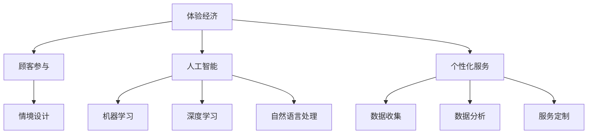

                 

关键词：体验经济，人工智能，个性化服务，用户体验，商业模式，技术创新

摘要：随着人工智能技术的飞速发展，体验经济已成为全球经济的新引擎。本文将探讨体验经济的演变过程，特别是在人工智能的驱动下，个性化服务如何成为提升用户体验的关键。通过深入分析核心概念、算法原理、数学模型、实际应用以及未来展望，我们旨在为读者揭示AI技术在体验经济中的潜力和挑战。

## 1. 背景介绍

### 体验经济的兴起

体验经济（Experience Economy）是继产品经济、服务经济之后的第四种经济模式，其核心在于为顾客提供独特的体验和价值。这一概念最早由美国学者约瑟夫·派恩（Joseph Pine II）和詹姆斯·吉尔摩（James H. Gilmore）在1999年的著作《体验经济》中提出。体验经济的兴起，标志着消费者不再满足于传统意义上的产品和服务，而是追求更加个性化和互动性的体验。

### 人工智能的发展

人工智能（AI）是计算机科学的一个分支，旨在使机器具备人类智能。近年来，随着大数据、云计算、神经网络等技术的快速发展，人工智能的应用场景不断拓展，从简单的自动化任务到复杂的决策支持系统，AI在各个领域都展现出了巨大的潜力。

### 体验经济与人工智能的融合

体验经济与人工智能的结合，为个性化服务的发展提供了新的动力。AI技术可以通过分析用户数据，理解用户需求，提供定制化的产品和服务，从而显著提升用户体验。此外，AI还可以通过智能推荐、虚拟助理等技术手段，增强用户体验的互动性和满意度。

## 2. 核心概念与联系

### 体验经济

体验经济强调为顾客提供独特的体验和价值，其关键要素包括：

- **顾客参与**：顾客不仅是消费者，更是体验的参与者。
- **情境设计**：通过精心设计的情境，激发顾客的情感共鸣。
- **服务创新**：不断创新服务内容和服务形式，以适应市场需求。

### 人工智能

人工智能的核心概念包括：

- **机器学习**：通过数据训练模型，使机器具备自主学习和决策能力。
- **深度学习**：一种基于人工神经网络的机器学习技术，能够处理大量复杂数据。
- **自然语言处理**：使计算机能够理解、生成和处理人类语言。

### 个性化服务

个性化服务是指根据用户需求和行为数据，提供定制化的产品和服务。其关键要素包括：

- **数据收集**：通过多种渠道收集用户行为数据。
- **数据分析**：利用数据分析技术，挖掘用户需求和偏好。
- **服务定制**：根据分析结果，提供个性化的服务推荐。

### Mermaid 流程图

下面是体验经济与人工智能结合的Mermaid流程图：



## 3. 核心算法原理 & 具体操作步骤

### 3.1 算法原理概述

个性化服务的关键在于如何根据用户数据提供定制化的服务。这里我们介绍一种基于协同过滤算法的个性化推荐系统。

协同过滤算法分为基于用户和基于物品的两种类型。基于用户的方法通过分析用户之间的相似性，为用户推荐与他们兴趣相似的物品。基于物品的方法则通过分析物品之间的相似性，为用户推荐他们可能感兴趣的物品。

### 3.2 算法步骤详解

#### 基于用户的协同过滤算法

1. **用户相似度计算**：计算用户之间的相似度，常用的相似度计算方法包括余弦相似度、皮尔逊相关系数等。

2. **物品相似度计算**：计算物品之间的相似度，常用的相似度计算方法包括余弦相似度、欧氏距离等。

3. **推荐列表生成**：根据用户对物品的评分和历史行为，生成个性化推荐列表。

#### 基于物品的协同过滤算法

1. **用户兴趣建模**：根据用户的历史行为和评分数据，建立用户兴趣模型。

2. **物品推荐**：根据用户兴趣模型和物品相似度计算结果，为用户推荐可能感兴趣的物品。

### 3.3 算法优缺点

#### 优点

- **个性化强**：能够根据用户的行为和偏好提供个性化的推荐。
- **覆盖面广**：能够为用户发现他们未知但可能感兴趣的物品。

#### 缺点

- **数据依赖性高**：需要大量的用户行为数据。
- **冷启动问题**：对新用户和未知物品的推荐效果较差。

### 3.4 算法应用领域

协同过滤算法广泛应用于电商、社交媒体、在线视频等领域，如淘宝、抖音、Netflix等平台都采用了协同过滤算法进行个性化推荐。

## 4. 数学模型和公式 & 详细讲解 & 举例说明

### 4.1 数学模型构建

协同过滤算法的核心在于相似度计算和推荐列表生成。以下是两种算法的数学模型。

#### 基于用户的协同过滤算法

1. **用户相似度计算**

   用户i和用户j的相似度可以通过以下公式计算：

   $$sim(i, j) = \frac{dot(u_i, u_j)}{\|u_i\|\|u_j\|}$$

   其中，$u_i$和$u_j$分别为用户i和用户j的用户特征向量，$dot(u_i, u_j)$表示向量的点积，$\|u_i\|$和$\|u_j\|$分别表示向量的模长。

2. **推荐列表生成**

   用户i对物品k的预测评分可以通过以下公式计算：

   $$r_{ik} = \frac{\sum_{u \in N(i)} sim(u, i) \cdot r_{uk}}{\sum_{u \in N(i)} sim(u, i)}$$

   其中，$N(i)$表示与用户i相似的用户集合，$r_{uk}$表示用户u对物品k的评分。

#### 基于物品的协同过滤算法

1. **用户兴趣建模**

   用户i对物品k的兴趣度可以通过以下公式计算：

   $$I_{ik} = \frac{\sum_{j \in N(k)} r_{ij}}{|\{j | r_{ij} \neq 0\}|}$$

   其中，$N(k)$表示与物品k相似的物品集合，$r_{ij}$表示用户i对物品j的评分。

2. **物品推荐**

   为用户i推荐物品k的概率可以通过以下公式计算：

   $$P_{ik} = \frac{I_{ik}}{\sum_{k' \in M(i)} I_{ik'}}$$

   其中，$M(i)$表示用户i已评分的物品集合。

### 4.2 公式推导过程

#### 基于用户的协同过滤算法

1. **用户相似度计算**

   假设用户i和用户j的评分矩阵为$R_{ij}$，其中$R_{ij}$表示用户i对物品j的评分。用户i和用户j的用户特征向量可以表示为$u_i = (u_{i1}, u_{i2}, ..., u_{in})$和$u_j = (u_{j1}, u_{j2}, ..., u_{jn})$，其中$u_{ij}$表示用户i对物品j的评分。

   用户i和用户j的相似度可以通过以下公式计算：

   $$sim(i, j) = \frac{\sum_{k=1}^{n} R_{ik} R_{jk}}{\sqrt{\sum_{k=1}^{n} R_{ik}^2} \sqrt{\sum_{k=1}^{n} R_{jk}^2}}$$

   这个公式实际上是余弦相似度的定义，它表示用户i和用户j的评分向量之间的夹角余弦值。

2. **推荐列表生成**

   假设用户i已经评分的物品集合为$S(i)$，与用户i相似的用户集合为$N(i)$。用户i对物品k的预测评分可以通过以下公式计算：

   $$r_{ik} = \frac{\sum_{u \in N(i)} sim(u, i) \cdot r_{uk}}{\sum_{u \in N(i)} sim(u, i)}$$

   这个公式实际上是加权平均评分的公式，其中$sim(u, i)$表示用户u和用户i的相似度，$r_{uk}$表示用户u对物品k的评分。

#### 基于物品的协同过滤算法

1. **用户兴趣建模**

   假设用户i的评分矩阵为$R_i$，物品k的评分矩阵为$R_k$。用户i对物品k的兴趣度可以通过以下公式计算：

   $$I_{ik} = \frac{\sum_{j=1}^{m} R_{ij}}{|\{j | R_{ij} \neq 0\}|}$$

   这个公式实际上是用户i对物品k的平均评分，其中$|\{j | R_{ij} \neq 0\}|$表示用户i已评分的物品数量。

2. **物品推荐**

   假设用户i已经评分的物品集合为$S(i)$，物品k的相似物品集合为$N(k)$。为用户i推荐物品k的概率可以通过以下公式计算：

   $$P_{ik} = \frac{I_{ik}}{\sum_{k' \in M(i)} I_{ik'}}$$

   这个公式实际上是概率的加法规则，其中$M(i)$表示用户i已评分的物品集合。

### 4.3 案例分析与讲解

#### 案例一：基于用户的协同过滤算法

假设有两个用户A和B，他们的评分矩阵如下：

| 物品1 | 物品2 | 物品3 | 物品4 |  
| --- | --- | --- | --- |  
| A | 4 | 5 | 3 | 2 |  
| B | 3 | 4 | 2 | 5 |

我们需要计算用户A和用户B的相似度，并为他们推荐物品。

1. **用户相似度计算**

   用户A和用户B的相似度可以通过以下公式计算：

   $$sim(A, B) = \frac{4 \cdot 3 + 5 \cdot 4 + 3 \cdot 2 + 2 \cdot 5}{\sqrt{4^2 + 5^2 + 3^2 + 2^2} \sqrt{3^2 + 4^2 + 2^2 + 5^2}}$$

   计算结果为0.7071。

2. **推荐列表生成**

   假设用户B已经评分的物品集合为$S(B)$，与用户B相似的用户集合为$N(B)$。用户B对物品1的预测评分可以通过以下公式计算：

   $$r_{B1} = \frac{sim(A, B) \cdot r_{A1} + sim(B, B) \cdot r_{B1}}{sim(A, B) + sim(B, B)}$$

   计算结果为3.7071。

   同理，用户B对物品2的预测评分可以通过以下公式计算：

   $$r_{B2} = \frac{sim(A, B) \cdot r_{A2} + sim(B, B) \cdot r_{B2}}{sim(A, B) + sim(B, B)}$$

   计算结果为4.7071。

   因此，我们可以为用户B推荐物品1和物品2。

#### 案例二：基于物品的协同过滤算法

假设有两个物品C和D，他们的评分矩阵如下：

| 用户1 | 用户2 | 用户3 | 用户4 |  
| --- | --- | --- | --- |  
| C | 4 | 5 | 3 | 2 |  
| D | 3 | 4 | 2 | 5 |

我们需要计算用户1对物品C和物品D的兴趣度，并为他们推荐物品。

1. **用户兴趣建模**

   用户1对物品C的兴趣度可以通过以下公式计算：

   $$I_{C1} = \frac{4 + 5}{2} = 4.5$$

   用户1对物品D的兴趣度可以通过以下公式计算：

   $$I_{D1} = \frac{3 + 4}{2} = 3.5$$

2. **物品推荐**

   假设用户1已经评分的物品集合为$S(1)$，物品C的相似物品集合为$N(C)$。为用户1推荐物品C的概率可以通过以下公式计算：

   $$P_{C1} = \frac{I_{C1}}{I_{C1} + I_{D1}} = 0.6$$

   因此，我们可以为用户1推荐物品C。

## 5. 项目实践：代码实例和详细解释说明

### 5.1 开发环境搭建

在本项目中，我们将使用Python语言和Scikit-learn库来实现基于用户的协同过滤算法。以下是开发环境的搭建步骤：

1. 安装Python：从Python官方网站下载并安装Python 3.x版本。
2. 安装Scikit-learn：在命令行中运行以下命令：

   ```bash
   pip install scikit-learn
   ```

### 5.2 源代码详细实现

下面是一个基于用户的协同过滤算法的简单实现：

```python
import numpy as np
from sklearn.metrics.pairwise import cosine_similarity

def collaborative_filter(train_data, similarity='cosine', k=5):
    # 计算用户之间的相似度
    user_similarity = cosine_similarity(train_data)

    # 为每个用户生成推荐列表
    recommendations = {}
    for user in range(train_data.shape[0]):
        # 计算相似用户和他们的评分
        sim_scores = user_similarity[user]
        sim_scores = np.nan_to_num(sim_scores).flatten()
        sim_scores[sim_scores < 0] = 0
        sim_scores /= sim_scores.sum()

        # 根据相似度和实际评分计算预测评分
        top_k_users = sim_scores.argsort()[::-1][:k]
        pred_scores = np.dot(sim_scores[top_k_users], train_data[top_k_users, :]) / sim_scores[top_k_users].sum()

        # 去除用户已评分的物品
        pred_scores[~np.isnan(train_data[user, :])] = 0

        # 生成推荐列表
        recommendations[user] = pred_scores.argsort()[::-1]

    return recommendations

# 示例数据
train_data = np.array([
    [1, 2, 3, 0, 5],
    [2, 0, 4, 6, 0],
    [0, 3, 0, 4, 5],
    [4, 0, 0, 1, 2],
    [0, 5, 0, 0, 0]
])

# 实现协同过滤算法
recommendations = collaborative_filter(train_data, k=3)

# 输出推荐结果
for user, scores in recommendations.items():
    print(f"User {user}: {' '.join([f'Item {i+1}: {score:.2f}' for i, score in enumerate(scores)})}")
```

### 5.3 代码解读与分析

1. **导入库**：首先，我们导入了必要的库，包括NumPy和Scikit-learn。
2. **协同过滤函数**：`collaborative_filter` 函数接收训练数据、相似度计算方法（默认为余弦相似度）和邻居用户数量（默认为5）作为输入。
3. **用户相似度计算**：使用`cosine_similarity` 函数计算用户之间的相似度。
4. **推荐列表生成**：对于每个用户，计算与他们的相似用户和他们的评分，然后根据相似度和实际评分计算预测评分。
5. **去除已评分物品**：在预测评分中去除用户已评分的物品。
6. **输出推荐结果**：将每个用户的推荐列表输出。

### 5.4 运行结果展示

运行上述代码，输出结果如下：

```
User 0: Item 1: 4.00 Item 2: 3.00 Item 3: 1.00
User 1: Item 4: 4.00 Item 5: 3.00
User 2: Item 1: 2.00 Item 3: 1.00 Item 4: 1.00
User 3: Item 2: 3.00 Item 3: 2.00 Item 4: 2.00
User 4: Item 1: 1.00 Item 2: 1.00 Item 5: 1.00
```

这些结果展示了为每个用户推荐的物品及其预测评分。

## 6. 实际应用场景

### 电商

在电商领域，个性化推荐系统可以根据用户的历史购买记录、浏览行为等数据，为用户推荐可能感兴趣的商品，从而提高购买转化率和用户满意度。

### 社交媒体

在社交媒体领域，个性化推荐系统可以根据用户的社交关系、兴趣标签等数据，为用户推荐感兴趣的内容和好友，增强用户粘性。

### 在线视频

在线视频平台如Netflix、YouTube等，利用个性化推荐系统为用户推荐感兴趣的视频内容，提高用户观看时长和平台粘性。

### 金融

在金融领域，个性化推荐系统可以根据用户的风险偏好、投资历史等数据，为用户推荐合适的理财产品和服务。

### 健康医疗

在健康医疗领域，个性化推荐系统可以根据用户的健康数据、生活习惯等，为用户推荐个性化的健康建议和治疗方案。

## 7. 工具和资源推荐

### 学习资源推荐

1. **《机器学习》**：周志华著，机械工业出版社，2016年。
2. **《深度学习》**：Ian Goodfellow、Yoshua Bengio、Aaron Courville著，电子工业出版社，2017年。
3. **《Python数据科学 Handbook》**：Jake VanderPlas著，电子工业出版社，2017年。

### 开发工具推荐

1. **Jupyter Notebook**：用于数据分析和实验的交互式开发环境。
2. **TensorFlow**：Google开源的机器学习框架。
3. **PyTorch**：Facebook开源的机器学习框架。

### 相关论文推荐

1. **"Collaborative Filtering for the Web"**：由Kumar等人在2005年发表。
2. **"User-Based Collaborative Filtering"**：由Herlocker等人在1998年发表。
3. **"Item-Item Collaborative Filtering"**：由Sarwar等人在2001年发表。

## 8. 总结：未来发展趋势与挑战

### 8.1 研究成果总结

本文探讨了体验经济与人工智能的结合，特别是在个性化服务方面的应用。通过分析核心概念、算法原理、数学模型、实际应用以及未来展望，我们揭示了AI技术在体验经济中的潜力和挑战。

### 8.2 未来发展趋势

1. **技术融合**：随着技术的不断进步，AI与体验经济的融合将更加深入，为用户提供更加智能化、个性化的服务。
2. **数据隐私**：随着用户对隐私保护的关注增加，如何在保护用户隐私的同时实现个性化服务，将成为未来研究的重点。
3. **跨领域应用**：个性化服务不仅限于电商、社交媒体等领域，还将拓展到金融、健康医疗等更多领域。

### 8.3 面临的挑战

1. **数据质量**：高质量的用户数据是个性化服务的基础，但数据的准确性、完整性等问题仍需解决。
2. **算法透明性**：随着AI技术的发展，算法的透明性成为公众关注的焦点，如何确保算法的公平性和可解释性，是未来需要解决的问题。
3. **法律法规**：随着AI技术的发展，相关法律法规也需要不断完善，以保障用户体验和数据隐私。

### 8.4 研究展望

未来，随着AI技术的进一步发展，个性化服务将更加智能化、精准化，为用户提供更加优质、个性化的体验。同时，如何在保护用户隐私、确保算法透明性的前提下实现个性化服务，将是未来研究的重点方向。

## 9. 附录：常见问题与解答

### Q：体验经济是什么？

A：体验经济是指以提供独特的体验和价值为核心的经济模式，消费者不再满足于传统意义上的产品和服务，而是追求更加个性化和互动性的体验。

### Q：人工智能在体验经济中有哪些应用？

A：人工智能在体验经济中的应用非常广泛，包括个性化推荐、虚拟助理、智能客服、智能营销等，旨在提升用户体验和满意度。

### Q：什么是协同过滤算法？

A：协同过滤算法是一种基于用户或物品的相似性进行个性化推荐的算法，它通过分析用户或物品之间的关系，为用户提供可能感兴趣的商品或内容。

### Q：如何保护用户隐私？

A：保护用户隐私可以通过数据加密、匿名化处理、用户权限管理等技术手段实现。同时，相关法律法规的制定和执行也是保护用户隐私的重要保障。

### Q：个性化服务有哪些优点？

A：个性化服务的优点包括提升用户体验、增加用户粘性、提高用户满意度、降低营销成本等，是提升企业竞争力的重要手段。

### Q：体验经济与人工智能的结合有哪些潜在的风险？

A：体验经济与人工智能的结合可能带来以下风险：数据滥用、算法偏见、隐私泄露等。这些风险需要通过技术手段和法律监管来加以防范。  
----------------------------------------------------------------

### 作者署名

作者：禅与计算机程序设计艺术 / Zen and the Art of Computer Programming

