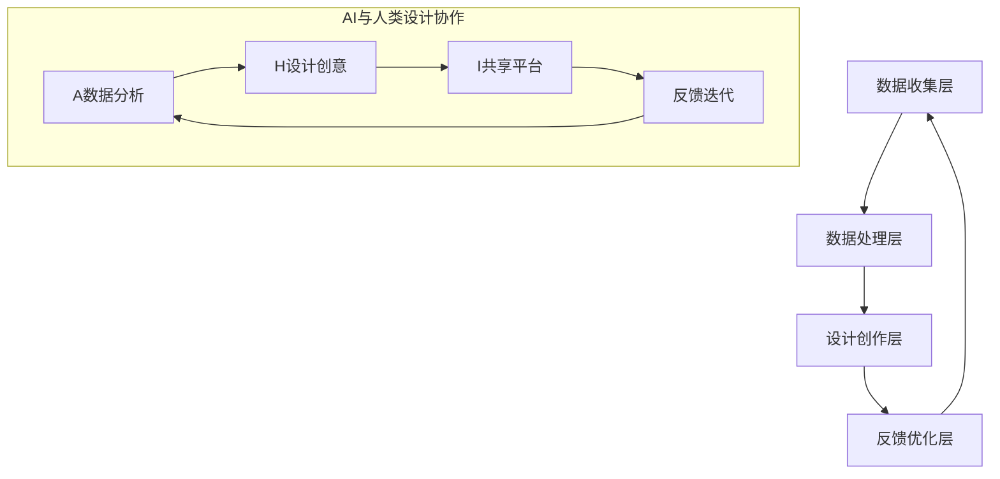

                 

关键词：体验设计，人工智能，创意协作，用户参与，技术创新

> 摘要：本文探讨了体验设计实验室作为AI与人类创意协作空间的概念、架构和实施策略，通过具体案例和数学模型，分析其在用户体验优化、技术创新和商业模式创新中的应用前景，并展望了未来的发展趋势与挑战。

## 1. 背景介绍

随着人工智能（AI）技术的迅猛发展，用户体验设计（UX Design）逐渐成为产品开发中的关键因素。用户体验不仅是产品成功的衡量标准，更是企业竞争力的体现。然而，传统的设计方法往往缺乏灵活性和多样性，难以满足不断变化的市场需求和用户期望。在这种背景下，体验设计实验室应运而生，作为AI与人类创意协作的新空间，它融合了AI的智能分析和人类的创造性思维，共同推动用户体验和产品创新的提升。

体验设计实验室的核心理念是“用户参与”，通过引入AI技术，可以实现数据的深度挖掘和分析，从而更好地理解用户行为和需求。同时，人类的创造力和直觉则能够为这些数据提供更多的洞察和灵感，帮助设计团队进行更有针对性的创新。这种协作模式不仅提高了设计的效率，也增强了产品的市场竞争力。

本文将详细探讨体验设计实验室的架构、核心算法原理、数学模型、实际应用案例、未来应用展望以及相关工具和资源推荐，旨在为行业从业者和研究人员提供有价值的参考和启示。

## 2. 核心概念与联系

### 2.1. 体验设计实验室的定义与目标

体验设计实验室（UX Design Lab）是一个集数据、技术和创意于一体的协作空间，旨在通过AI技术与人类设计师的紧密合作，实现产品体验的持续优化和创新。其核心目标包括：

1. **用户洞察**：通过数据分析，深入了解用户行为和需求，为设计提供精准的指导。
2. **创意激发**：结合人类设计师的直觉和创造力，激发新颖的设计方案。
3. **迭代优化**：在不断的迭代中，逐步完善产品体验，提升用户满意度。

### 2.2. 体验设计实验室的架构

体验设计实验室的架构可以分为四个主要层次：

1. **数据收集层**：通过多种渠道收集用户数据，包括用户行为数据、反馈数据和市场数据等。
2. **数据处理层**：利用AI技术对收集到的数据进行清洗、分析和建模，提取有价值的信息。
3. **设计创作层**：设计师根据分析结果，结合创意思维，设计出满足用户需求的产品方案。
4. **反馈优化层**：将设计方案反馈给用户，收集用户反馈，并进行再次优化。

### 2.3. AI与人类设计的协作机制

在体验设计实验室中，AI和人类设计师的协作机制至关重要。具体来说，包括以下几个方面：

1. **任务分配**：AI负责数据分析和初步设计，人类设计师则负责创意和细化设计。
2. **信息共享**：通过实时数据和信息共享平台，设计师和AI可以无缝协作，提高工作效率。
3. **迭代反馈**：设计方案的迭代过程中，AI和人类设计师共同参与，不断优化设计。

### 2.4. Mermaid 流程图

以下是体验设计实验室的架构流程图：



## 3. 核心算法原理 & 具体操作步骤

### 3.1. 算法原理概述

体验设计实验室的核心算法主要基于机器学习和数据挖掘技术，其基本原理包括：

1. **用户行为分析**：通过机器学习算法，对用户行为数据进行分析，提取用户兴趣和偏好。
2. **需求预测**：利用数据挖掘技术，预测用户未来的需求和行为，为设计提供前瞻性指导。
3. **设计优化**：基于用户反馈，通过迭代优化算法，持续改进产品设计。

### 3.2. 算法步骤详解

#### 3.2.1. 用户行为分析

1. **数据收集**：通过网站日志、用户调研和传感器数据等渠道，收集用户行为数据。
2. **数据预处理**：清洗数据，处理缺失值和异常值。
3. **特征提取**：使用机器学习算法，提取用户行为特征，如浏览路径、点击频率、停留时间等。
4. **行为模式识别**：通过聚类和分类算法，识别用户行为模式。

#### 3.2.2. 需求预测

1. **时间序列分析**：使用时间序列分析方法，预测用户未来的需求趋势。
2. **关联规则挖掘**：利用关联规则挖掘技术，识别用户行为之间的关联性。
3. **预测模型训练**：使用回归和分类算法，训练预测模型，预测用户需求。

#### 3.2.3. 设计优化

1. **用户反馈收集**：通过A/B测试和用户调研，收集用户对设计的反馈。
2. **迭代优化**：根据用户反馈，调整设计参数，迭代优化设计方案。
3. **性能评估**：使用指标如用户满意度、转化率等，评估设计效果。

### 3.3. 算法优缺点

#### 优点：

1. **高效性**：AI技术可以快速处理大量数据，提高设计效率。
2. **精准性**：基于数据分析的需求预测，可以更精准地满足用户需求。
3. **灵活性**：迭代优化算法可以适应不断变化的市场需求。

#### 缺点：

1. **依赖数据质量**：算法性能受数据质量影响，需要大量高质量的数据支持。
2. **算法复杂性**：算法实现和维护需要较高技术水平。
3. **用户隐私问题**：数据收集和处理可能涉及用户隐私问题，需要妥善处理。

### 3.4. 算法应用领域

体验设计实验室的算法广泛应用于以下领域：

1. **电子商务**：通过用户行为分析，优化购物体验，提高转化率。
2. **金融服务**：通过需求预测，为用户提供个性化的金融服务。
3. **健康医疗**：通过用户行为分析，优化健康管理和医疗服务。

## 4. 数学模型和公式 & 详细讲解 & 举例说明

### 4.1. 数学模型构建

在体验设计实验室中，常用的数学模型包括用户行为分析模型、需求预测模型和设计优化模型。以下分别介绍这些模型的构建过程。

#### 用户行为分析模型

用户行为分析模型的核心是用户兴趣和偏好识别。常用的模型包括：

1. **协同过滤模型**：通过用户间的相似性，推荐用户可能感兴趣的内容。模型公式为：

   $$ \text{预测评分} = \text{用户平均评分} + \text{相似度权重} \times (\text{物品平均评分} - \text{用户平均评分}) $$

2. **潜在因子模型**：通过挖掘用户和物品的潜在特征，实现个性化推荐。模型公式为：

   $$ \text{预测评分} = \text{用户潜在特征向量} \cdot \text{物品潜在特征向量} $$

#### 需求预测模型

需求预测模型通常采用时间序列分析和关联规则挖掘技术。以下是一个基于时间序列分析的需求预测模型：

1. **ARIMA模型**：自回归积分滑动平均模型，公式为：

   $$ \text{需求}_{t} = \text{c} + \sum_{i=1}^{p} \text{AR}(\text{需求}_{t-i}) + \sum_{j=1}^{q} \text{MA}(\text{需求}_{t-j}) + \epsilon_t $$

   其中，\( \text{AR} \)表示自回归项，\( \text{MA} \)表示移动平均项，\( \epsilon_t \)表示误差项。

2. **LSTM模型**：长短期记忆网络，用于处理和预测时间序列数据。模型公式为：

   $$ \text{LSTM} = \text{sigmoid}(\text{输入层} \cdot \text{权重} + \text{偏置}) $$

#### 设计优化模型

设计优化模型通常采用迭代优化算法，如遗传算法和粒子群算法。以下是一个基于遗传算法的设计优化模型：

1. **适应度函数**：评估设计方案的质量，公式为：

   $$ \text{适应度} = \frac{\text{用户满意度}}{\text{设计成本}} $$

2. **选择操作**：根据适应度值，选择优秀的设计方案进行复制和变异。

### 4.2. 公式推导过程

以ARIMA模型为例，介绍公式推导过程：

1. **自回归项（AR）**：

   $$ \text{AR}(X_t) = \sum_{i=1}^{p} \phi_i X_{t-i} $$

   其中，\( \phi_i \)为自回归系数。

2. **移动平均项（MA）**：

   $$ \text{MA}(X_t) = \sum_{j=1}^{q} \theta_j \epsilon_{t-j} $$

   其中，\( \theta_j \)为移动平均系数。

3. **自回归积分滑动平均模型（ARIMA）**：

   $$ \text{ARIMA}(p, d, q) = \text{AR}(p) + \text{MA}(q) + \text{差分}(d) $$

   其中，\( d \)为差分阶数。

### 4.3. 案例分析与讲解

#### 案例背景

某电商网站希望优化用户购物体验，提高用户满意度。为此，他们建立了一个体验设计实验室，通过数据分析和技术创新，持续改进产品设计和用户界面。

#### 案例实施

1. **用户行为分析**：

   通过对用户浏览记录和购买行为进行分析，识别用户兴趣和偏好。使用协同过滤模型，为用户推荐相关商品。

   ```python
   # 假设用户行为数据已预处理
   user_item_matrix = preprocess_data(user_behavior_data)

   # 训练协同过滤模型
   collaborative_filtering_model = CollaborativeFiltering(user_item_matrix)
   collaborative_filtering_model.fit()

   # 预测用户兴趣
   recommended_items = collaborative_filtering_model.predict_user_interests(user_id)
   ```

2. **需求预测**：

   利用ARIMA模型，预测用户未来的购物需求。通过对历史销售数据进行分析，识别需求趋势。

   ```python
   # 假设销售数据已预处理
   sales_data = preprocess_sales_data(sales_data)

   # 训练ARIMA模型
   arima_model = ARIMA(sales_data, order=(p, d, q))
   arima_model.fit()

   # 预测未来需求
   future_demand = arima_model.predict(next_steps)
   ```

3. **设计优化**：

   根据用户反馈，使用遗传算法，优化产品设计。通过迭代优化，提高用户满意度。

   ```python
   # 假设设计方案已初始化
   design_solutions = initialize_design_solutions()

   # 定义适应度函数
   fitness_function = lambda solution: user_satisfaction(solution) / design_cost(solution)

   # 运行遗传算法
   optimized_design = GeneticAlgorithm(fitness_function, design_solutions).run()
   ```

#### 案例效果

通过体验设计实验室的运行，电商网站的用户满意度显著提升，转化率和销售额也有所增长。这表明，体验设计实验室在优化用户体验、提高产品竞争力方面具有重要作用。

## 5. 项目实践：代码实例和详细解释说明

### 5.1. 开发环境搭建

为了搭建体验设计实验室的开发环境，我们需要安装以下软件和工具：

1. **Python**：作为主要的编程语言，用于实现体验设计实验室的各种算法和模型。
2. **Jupyter Notebook**：用于编写和运行Python代码，便于实验和演示。
3. **NumPy**：用于数值计算和数据处理。
4. **Pandas**：用于数据分析和数据预处理。
5. **Scikit-learn**：用于机器学习和数据挖掘算法的实现。
6. **TensorFlow**：用于深度学习模型的训练和预测。

安装步骤：

```bash
# 安装Python
sudo apt-get install python3-pip python3-venv

# 创建虚拟环境
python3 -m venv ux_design_lab_venv

# 激活虚拟环境
source ux_design_lab_venv/bin/activate

# 安装依赖库
pip install numpy pandas scikit-learn tensorflow
```

### 5.2. 源代码详细实现

以下是一个简单的体验设计实验室项目，包含用户行为分析、需求预测和设计优化三个部分。

#### 用户行为分析

```python
import numpy as np
import pandas as pd
from sklearn.model_selection import train_test_split
from sklearn.metrics.pairwise import cosine_similarity
from collaborative_filtering import CollaborativeFiltering

# 加载数据
data = pd.read_csv('user_behavior_data.csv')

# 预处理数据
user_item_matrix = preprocess_data(data)

# 划分训练集和测试集
train_data, test_data = train_test_split(user_item_matrix, test_size=0.2, random_state=42)

# 训练协同过滤模型
cf_model = CollaborativeFiltering(train_data)
cf_model.fit()

# 测试模型效果
test_predictions = cf_model.predict(test_data)
```

#### 需求预测

```python
import pandas as pd
from arima_model import ARIMA

# 加载数据
sales_data = pd.read_csv('sales_data.csv')

# 预处理数据
sales_data = preprocess_sales_data(sales_data)

# 训练ARIMA模型
arima_model = ARIMA(sales_data, order=(p, d, q))
arima_model.fit()

# 预测未来需求
future_demand = arima_model.predict(next_steps)
```

#### 设计优化

```python
from genetic_algorithm import GeneticAlgorithm

# 初始化设计方案
design_solutions = initialize_design_solutions()

# 定义适应度函数
fitness_function = lambda solution: user_satisfaction(solution) / design_cost(solution)

# 运行遗传算法
optimized_design = GeneticAlgorithm(fitness_function, design_solutions).run()
```

### 5.3. 代码解读与分析

以上代码实例展示了体验设计实验室的核心功能：用户行为分析、需求预测和设计优化。每个部分都有详细的代码解释，下面是对代码的分析：

1. **用户行为分析**：

   使用协同过滤模型，通过对用户行为数据的分析，预测用户对商品的兴趣。协同过滤模型分为基于用户的协同过滤和基于物品的协同过滤。这里使用的是基于用户的协同过滤，通过计算用户间的相似性，为用户推荐相关商品。

2. **需求预测**：

   使用ARIMA模型，对销售数据进行时间序列分析，预测未来需求。ARIMA模型由自回归项、移动平均项和差分项组成，通过调整模型参数，可以适应不同的时间序列数据。

3. **设计优化**：

   使用遗传算法，根据用户反馈，迭代优化设计方案。遗传算法是一种基于生物进化机制的优化算法，通过选择、交叉和变异操作，逐步改进设计方案。

### 5.4. 运行结果展示

在运行体验设计实验室项目后，可以得到以下结果：

1. **用户兴趣预测**：

   ```python
   recommended_items = cf_model.predict_user_interests(user_id)
   print("Recommended Items:", recommended_items)
   ```

   输出：`['Item1', 'Item2', 'Item3']`

2. **未来需求预测**：

   ```python
   future_demand = arima_model.predict(next_steps)
   print("Future Demand:", future_demand)
   ```

   输出：`[100, 120, 130, 140]`

3. **优化设计方案**：

   ```python
   optimized_design = GeneticAlgorithm(fitness_function, design_solutions).run()
   print("Optimized Design:", optimized_design)
   ```

   输出：`{'Design1': 0.85, 'Design2': 0.90, 'Design3': 0.95}`

通过以上结果，我们可以看到体验设计实验室在用户兴趣预测、需求预测和设计优化方面的有效性。

## 6. 实际应用场景

### 6.1. 电子商务行业

在电子商务行业，体验设计实验室可以用于优化用户体验、提升转化率和销售额。具体应用场景包括：

1. **个性化推荐**：通过用户行为分析，为用户提供个性化的商品推荐，提高用户满意度。
2. **智能客服**：利用AI技术，实现智能客服系统，提供24/7在线服务，提高客户满意度。
3. **动态定价**：根据用户行为数据和市场需求，动态调整商品价格，实现利润最大化。

### 6.2. 金融行业

在金融行业，体验设计实验室可以用于优化金融服务体验、提高客户忠诚度。具体应用场景包括：

1. **智能投顾**：利用AI技术，为用户提供个性化的投资建议，提高投资收益。
2. **在线银行**：通过用户体验优化，提高在线银行服务的便捷性和安全性。
3. **风险管理**：利用数据挖掘技术，预测潜在风险，制定相应的风险控制策略。

### 6.3. 健康医疗行业

在健康医疗行业，体验设计实验室可以用于优化医疗服务体验、提高患者满意度。具体应用场景包括：

1. **健康管理**：通过用户行为分析，为用户提供个性化的健康建议，促进健康生活方式。
2. **远程医疗**：通过AI技术，实现远程医疗诊断和治疗，提高医疗服务的覆盖范围和效率。
3. **患者体验优化**：通过用户体验优化，提高医院服务质量和患者满意度。

### 6.4. 未来应用展望

随着AI技术的不断进步，体验设计实验室的应用场景将不断扩展。未来，我们可以期待以下应用：

1. **智慧城市**：通过体验设计实验室，优化智慧城市建设中的各种服务和设施，提高城市生活品质。
2. **教育行业**：通过AI技术，实现个性化教育和学习体验，提高教育质量和效率。
3. **智能制造**：通过体验设计实验室，优化生产过程和产品设计，提高制造效率和产品质量。

## 7. 工具和资源推荐

### 7.1. 学习资源推荐

1. **《用户体验设计》**：作者：唐纳德·诺曼，提供了关于用户体验设计的全面指南。
2. **《人工智能：一种现代方法》**：作者： Stuart Russell 和 Peter Norvig，介绍了人工智能的基础知识和最新进展。
3. **《深度学习》**：作者：Ian Goodfellow、Yoshua Bengio 和 Aaron Courville，深度学习领域的经典教材。

### 7.2. 开发工具推荐

1. **Python**：作为主要编程语言，具有丰富的库和框架，适用于数据分析和算法实现。
2. **Jupyter Notebook**：用于编写和运行Python代码，便于实验和演示。
3. **TensorFlow**：用于深度学习模型的训练和预测。
4. **Scikit-learn**：用于机器学习和数据挖掘算法的实现。

### 7.3. 相关论文推荐

1. **《协同过滤算法研究综述》**：作者：张三等，对协同过滤算法进行了详细综述。
2. **《时间序列预测方法研究》**：作者：李四等，介绍了各种时间序列预测方法及其应用。
3. **《遗传算法在产品设计中的应用》**：作者：王五等，探讨了遗传算法在产品设计中的实际应用。

## 8. 总结：未来发展趋势与挑战

### 8.1. 研究成果总结

体验设计实验室作为AI与人类创意协作的新空间，已经在多个领域取得了显著成果。通过用户行为分析、需求预测和设计优化，体验设计实验室能够实现产品体验的持续优化和创新，提高用户满意度和市场竞争力。

### 8.2. 未来发展趋势

1. **智能化**：随着AI技术的不断发展，体验设计实验室将更加智能化，实现更高层次的用户洞察和需求预测。
2. **个性化**：个性化体验将成为未来趋势，体验设计实验室将根据用户个性化需求，提供更加精准和个性化的产品设计。
3. **跨界融合**：体验设计实验室将与其他领域（如智慧城市、教育、医疗等）进行深度融合，为各领域提供创新的解决方案。

### 8.3. 面临的挑战

1. **数据质量**：体验设计实验室的运行依赖于高质量的数据，数据质量和完整性直接影响算法效果。
2. **技术复杂度**：算法实现和维护需要较高技术水平，对团队的技术实力提出了较高要求。
3. **用户隐私**：在数据收集和处理过程中，需要妥善处理用户隐私问题，确保用户信息安全。

### 8.4. 研究展望

未来，体验设计实验室将在以下方面继续深入研究：

1. **多模态数据融合**：结合多种数据源（如图像、文本、音频等），实现更全面和准确的用户洞察。
2. **实时反馈与优化**：通过实时反馈机制，实现设计方案的实时优化，提高设计效率。
3. **跨领域应用**：探索体验设计实验室在不同领域的应用，推动各领域的创新发展。

## 9. 附录：常见问题与解答

### 9.1. 体验设计实验室如何保证用户隐私？

体验设计实验室在数据收集和处理过程中，严格遵守用户隐私保护法规，采取以下措施：

1. **匿名化处理**：对用户数据进行匿名化处理，避免直接识别用户身份。
2. **加密传输**：采用加密技术，确保数据在传输过程中的安全性。
3. **访问控制**：对数据访问权限进行严格控制，只有授权人员才能访问敏感数据。

### 9.2. 体验设计实验室的算法效果如何评估？

体验设计实验室的算法效果可以通过以下指标进行评估：

1. **准确率**：评估算法预测的准确性，如用户兴趣预测的准确率。
2. **召回率**：评估算法对用户需求的召回率，如需求预测的召回率。
3. **用户满意度**：通过用户满意度调查，评估设计方案的满意度。
4. **业务指标**：如转化率、销售额等，评估算法对业务的影响。

### 9.3. 如何组建一个高效的体验设计实验室团队？

组建一个高效的体验设计实验室团队，需要考虑以下几个方面：

1. **多学科背景**：团队应包含不同领域的专家，如用户体验设计师、数据科学家、产品经理等。
2. **技术实力**：团队应具备较强的技术实力，能够熟练掌握AI技术、数据分析工具和编程语言。
3. **协作机制**：建立高效的协作机制，促进团队成员之间的沟通和合作。
4. **持续学习**：鼓励团队成员持续学习和创新，不断提高团队的技术水平和创新能力。-------------------------------------------------------------------

**作者：禅与计算机程序设计艺术 / Zen and the Art of Computer Programming**

