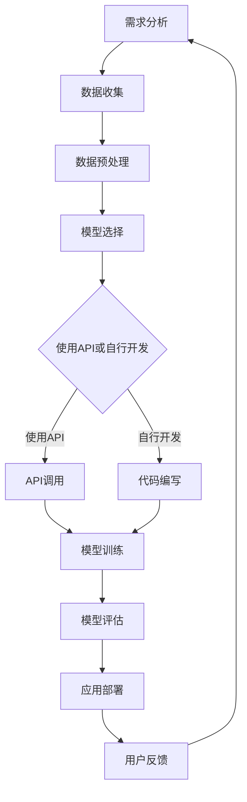

                 

随着人工智能（AI）技术的迅猛发展，越来越多的企业和开发者开始利用AI技术来提升业务效率和创新。然而，对于许多人来说，构建AI应用可能仍然是一个复杂且具有挑战性的任务。本文将介绍如何使用API（应用程序编程接口）快速构建AI应用，从而简化这一过程。

## 文章关键词

- API
- AI应用
- 开发框架
- 机器学习
- 自然语言处理
- 云服务
- 实时数据处理

## 文章摘要

本文将探讨使用API构建AI应用的各个方面。我们将从API的基本概念开始，解释如何利用API来简化AI应用的开发流程，并讨论一些流行的API和开发框架。此外，我们还将提供具体的案例和代码示例，以展示如何快速构建AI应用。最后，我们将探讨AI应用的实际应用场景和未来展望。

## 1. 背景介绍

人工智能已经成为现代科技的重要组成部分，其应用范围涵盖了从医疗保健到金融科技，从自动驾驶到智能家居等多个领域。然而，AI应用的开发并不总是一帆风顺的。传统上，开发AI应用需要深入的专业知识，包括数据预处理、模型训练、模型优化等多个环节。这不仅耗时，而且对开发者的技能要求很高。

API的出现为AI应用的开发提供了新的途径。API允许开发者通过简单的接口调用复杂的AI功能，而不需要了解背后的实现细节。这种“黑盒”模式使得AI应用的开发变得更加高效和便捷。此外，随着云计算和大数据技术的发展，许多AI服务提供商开始提供基于云的API，这些API可以处理大规模的数据，提供高效的计算资源，从而进一步简化了AI应用的开发过程。

## 2. 核心概念与联系

在讨论如何使用API构建AI应用之前，我们需要了解一些核心概念，如图灵测试、机器学习、深度学习和自然语言处理等。

### 2.1 图灵测试

图灵测试是由英国数学家和计算机科学家艾伦·图灵提出的，用于评估机器是否具有人类智能的标准。在图灵测试中，一个人类评判者通过文本交流与一个机器和一个人类同时交流，如果评判者无法准确判断哪个是机器，哪个是人类，那么机器就被认为是具有智能的。

### 2.2 机器学习

机器学习是一种人工智能的分支，通过数据训练模型，使模型能够对未知数据进行预测或决策。机器学习可以分为监督学习、无监督学习和强化学习。

- **监督学习**：模型通过已知输入和输出数据来学习。
- **无监督学习**：模型通过未知输入数据来学习，没有明确的输出。
- **强化学习**：模型通过与环境的交互来学习，目标是最大化某种奖励。

### 2.3 深度学习

深度学习是一种机器学习的方法，通过模拟人脑的神经网络结构来进行学习。深度学习在图像识别、语音识别和自然语言处理等领域取得了显著成果。

### 2.4 自然语言处理

自然语言处理（NLP）是研究如何使计算机理解和处理人类语言的一门学科。NLP在机器翻译、情感分析、文本摘要等领域有广泛的应用。

### 2.5 Mermaid 流程图

以下是构建AI应用的基本流程的Mermaid流程图：



### 2.6 API的基本概念

API是一组规则和协议，允许不同软件系统之间的相互操作。在AI应用开发中，API通常用于：

- **数据访问**：通过API可以方便地获取和处理数据。
- **功能调用**：开发者可以通过API调用复杂的AI算法，无需了解算法的实现细节。
- **服务集成**：API可以帮助不同的服务或系统进行集成，从而构建复杂的AI应用。

### 2.7 开发框架

在AI应用开发中，使用合适的开发框架可以大大简化开发过程。以下是一些流行的开发框架：

- **TensorFlow**：由Google开发，是用于机器学习和深度学习的开源框架。
- **PyTorch**：由Facebook开发，是一种流行的深度学习框架，尤其适用于研究。
- **Scikit-learn**：是一个开源的Python机器学习库，适用于各种常见的机器学习任务。
- **Keras**：是一个高层神经网络API，用于快速构建和训练深度学习模型。

## 3. 核心算法原理 & 具体操作步骤

### 3.1 算法原理概述

构建AI应用的核心是算法。以下是构建AI应用的一些核心算法：

- **数据预处理**：包括数据清洗、数据转换和数据归一化等。
- **机器学习模型**：包括线性回归、决策树、随机森林、支持向量机等。
- **深度学习模型**：包括卷积神经网络（CNN）、循环神经网络（RNN）、长短期记忆网络（LSTM）等。
- **自然语言处理**：包括词嵌入、文本分类、情感分析等。

### 3.2 算法步骤详解

以下是构建AI应用的基本步骤：

1. **需求分析**：明确AI应用的目标和需求。
2. **数据收集**：收集相关的数据，数据来源可以是公开数据集、自有数据或第三方数据服务。
3. **数据预处理**：清洗、转换和归一化数据，使其适合模型训练。
4. **模型选择**：根据需求选择合适的模型。
5. **模型训练**：使用收集到的数据训练模型。
6. **模型评估**：评估模型的性能，并根据评估结果进行调整。
7. **应用部署**：将训练好的模型部署到生产环境。
8. **用户反馈**：收集用户反馈，用于模型优化和迭代。

### 3.3 算法优缺点

- **机器学习模型**：优点包括简单、易于实现和解释性较好，缺点是模型性能依赖于数据质量和数量。
- **深度学习模型**：优点包括强大的表达能力和自动特征提取能力，缺点是模型复杂度高、训练时间较长。
- **自然语言处理**：优点包括能够处理复杂的文本数据，缺点是需要大量的预训练数据和计算资源。

### 3.4 算法应用领域

机器学习、深度学习和自然语言处理在多个领域有广泛的应用，如：

- **图像识别**：用于人脸识别、物体检测等。
- **语音识别**：用于语音助手、自动字幕等。
- **文本分析**：用于情感分析、文本摘要、机器翻译等。
- **推荐系统**：用于个性化推荐、广告投放等。

## 4. 数学模型和公式 & 详细讲解 & 举例说明

### 4.1 数学模型构建

构建AI应用通常需要以下数学模型：

- **线性回归模型**：用于预测线性关系，公式为：\( y = wx + b \)。
- **逻辑回归模型**：用于分类问题，公式为：\( P(y=1) = \frac{1}{1 + e^{-(wx + b)}} \)。
- **卷积神经网络（CNN）**：用于图像识别，公式为：\( f(x) = \sigma(W \cdot x + b) \)。
- **循环神经网络（RNN）**：用于序列数据处理，公式为：\( h_t = \sigma(W_h \cdot [h_{t-1}, x_t] + b_h) \)。

### 4.2 公式推导过程

以下是逻辑回归模型的推导过程：

1. 假设我们有训练数据集 \( D = \{(x_1, y_1), (x_2, y_2), ..., (x_n, y_n)\} \)，其中 \( x_i \) 为输入特征，\( y_i \) 为标签（0或1）。
2. 定义损失函数：\( L(W, b) = -\sum_{i=1}^n [y_i \cdot \log(p_i) + (1 - y_i) \cdot \log(1 - p_i)] \)，其中 \( p_i = \frac{1}{1 + e^{-(wx_i + b)}} \)。
3. 对损失函数求导：\( \frac{\partial L}{\partial W} = -\sum_{i=1}^n [y_i \cdot x_i \cdot (1 - p_i) - (1 - y_i) \cdot x_i \cdot p_i] \)。
4. \( \frac{\partial L}{\partial b} = -\sum_{i=1}^n [y_i - p_i] \)。

### 4.3 案例分析与讲解

以下是一个使用逻辑回归模型进行邮件分类的案例：

1. **数据收集**：收集一份数据集，包括邮件内容和邮件类别（垃圾邮件或正常邮件）。
2. **数据预处理**：将邮件内容转换为词向量，并去除停用词。
3. **模型训练**：使用训练集训练逻辑回归模型。
4. **模型评估**：使用测试集评估模型性能，调整参数。
5. **应用部署**：将训练好的模型部署到生产环境，用于分类新邮件。

## 5. 项目实践：代码实例和详细解释说明

### 5.1 开发环境搭建

1. 安装Python（推荐版本3.8及以上）。
2. 安装Jupyter Notebook，用于编写和运行代码。
3. 安装必要的库，如TensorFlow、Scikit-learn、Numpy等。

### 5.2 源代码详细实现

以下是使用TensorFlow实现一个简单的线性回归模型的代码示例：

```python
import tensorflow as tf
import numpy as np

# 数据集
x_train = np.random.rand(100).astype(np.float32)
y_train = 2 * x_train + 1

# 定义模型
model = tf.keras.Sequential([
    tf.keras.layers.Dense(units=1, input_shape=[1])
])

# 编译模型
model.compile(optimizer='sgd', loss='mean_squared_error')

# 训练模型
model.fit(x_train, y_train, epochs=100)

# 预测
print(model.predict([0.5]))
```

### 5.3 代码解读与分析

1. **数据集**：我们生成了一组随机数据，用于训练模型。
2. **模型定义**：我们使用TensorFlow定义了一个线性回归模型，其中包含一个全连接层。
3. **模型编译**：我们选择了一种优化器（sgd）和一个损失函数（mean_squared_error）来编译模型。
4. **模型训练**：我们使用fit方法训练模型，指定训练数据、训练轮数（epochs）。
5. **模型预测**：我们使用predict方法对新的输入数据进行预测。

## 6. 实际应用场景

AI应用在许多领域都有广泛的应用，以下是一些实际应用场景：

- **医疗保健**：利用AI进行疾病诊断、药物发现和患者护理。
- **金融科技**：利用AI进行风险评估、欺诈检测和投资建议。
- **零售**：利用AI进行需求预测、库存管理和个性化推荐。
- **自动驾驶**：利用AI进行环境感知、路径规划和驾驶控制。

## 7. 未来应用展望

随着AI技术的不断发展，未来AI应用将更加智能化和普及化。以下是一些未来应用展望：

- **智能家居**：AI将更加深入地融入家居生活，提供更加智能和便捷的服务。
- **工业自动化**：AI将在工业生产中发挥更大的作用，提高生产效率和降低成本。
- **教育**：AI将提供更加个性化和互动化的学习体验。

## 8. 工具和资源推荐

以下是一些推荐的工具和资源：

- **学习资源**：
  - 《深度学习》（Goodfellow, Bengio, Courville）。
  - Coursera、Udacity、edX等在线课程。
- **开发工具**：
  - TensorFlow、PyTorch、Keras。
  - Jupyter Notebook、Google Colab。
- **相关论文**：
  - "Deep Learning"（Goodfellow, Bengio, Courville）。
  - "The Unsupervised Learning of Visual Features"（Kolter & Quigley）。

## 9. 总结：未来发展趋势与挑战

### 9.1 研究成果总结

近年来，AI技术取得了显著的进展，特别是在深度学习和自然语言处理领域。这些进展使得AI应用变得更加智能和普及。

### 9.2 未来发展趋势

未来，AI技术将朝着更加智能化、自动化和个性化的方向发展。随着硬件性能的提升和算法的优化，AI应用将更加广泛和深入。

### 9.3 面临的挑战

尽管AI技术取得了显著进展，但仍然面临一些挑战，如数据隐私、算法透明度和可解释性等。此外，AI技术的应用也引发了伦理和社会问题，需要我们认真思考和解决。

### 9.4 研究展望

未来，我们需要进一步研究AI技术，以提高其智能、效率和安全性。同时，我们还需要关注AI技术的伦理和社会影响，确保其可持续发展。

## 10. 附录：常见问题与解答

### 10.1 问题1：如何选择合适的AI算法？

**解答**：选择合适的AI算法取决于具体的应用场景和数据特征。例如，对于图像识别任务，深度学习模型（如卷积神经网络）通常表现更好；对于文本分类任务，可以使用自然语言处理算法（如词嵌入和循环神经网络）。

### 10.2 问题2：如何处理过拟合问题？

**解答**：过拟合是由于模型过于复杂，无法泛化到未知数据的问题。解决过拟合的方法包括：使用更简单的模型、增加训练数据、使用交叉验证等。

### 10.3 问题3：如何确保AI算法的透明度和可解释性？

**解答**：确保AI算法的透明度和可解释性是当前研究的热点。一些方法包括：使用可解释的模型（如线性回归）、解释性算法（如LIME和SHAP）和可视化工具。

---

作者：禅与计算机程序设计艺术 / Zen and the Art of Computer Programming
----------------------------------------------------------------

以上是本文的完整内容。希望本文能帮助您更好地了解如何使用API快速构建AI应用。如果您有任何问题或建议，欢迎在评论区留言。祝您编程愉快！

