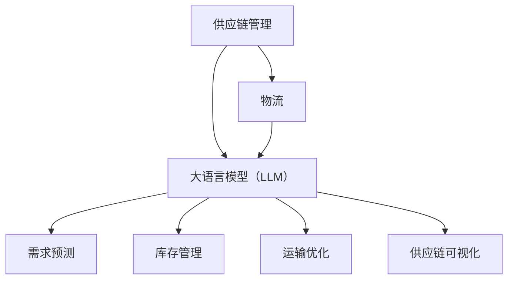

                 

关键词：供应链管理、大语言模型、全球物流、优化、人工智能

> 摘要：本文将探讨如何利用大语言模型（LLM）优化全球物流的供应链管理。通过分析供应链管理的挑战和现有问题，本文介绍了LLM在预测、优化和自动化方面的优势，并提出了一种基于LLM的供应链管理框架。同时，本文还将展示LLM在实际物流场景中的应用案例，以及未来发展趋势和挑战。

## 1. 背景介绍

### 1.1 全球物流概述

全球物流是国际贸易的重要支柱，它涉及从原材料采购、生产制造到产品分销的整个过程。随着全球化进程的加速，全球物流的复杂性和规模不断增加，这对供应链管理提出了更高的要求。然而，传统的供应链管理方法在面对大规模、多变量和动态变化的物流网络时，往往显得力不从心。

### 1.2 供应链管理挑战

在当前全球化的背景下，供应链管理面临着诸多挑战：

- **需求预测不准确**：市场需求的不确定性和变化使得预测需求成为一大难题。
- **库存管理困难**：库存过多会导致资金占用，而库存不足则会影响生产和销售。
- **运输成本高**：全球物流网络复杂，运输成本成为企业的主要负担。
- **供应链透明度低**：供应链各环节的信息共享和协调不足，导致供应链透明度低。

### 1.3 大语言模型（LLM）概述

大语言模型（LLM）是一种基于深度学习的自然语言处理模型，具有强大的文本生成、理解和推理能力。近年来，随着计算能力的提升和数据的丰富，LLM在各个领域取得了显著成果。在供应链管理中，LLM的应用前景十分广阔。

## 2. 核心概念与联系

### 2.1 核心概念

- **供应链管理**：指在供应链网络中对物料、信息、资金和服务的管理。
- **物流**：指物品从供应地到接收地的实体流动过程。
- **大语言模型（LLM）**：一种强大的文本生成和推理模型。

### 2.2 联系

供应链管理与物流紧密相关，物流是供应链的重要组成部分。而LLM作为一种先进的技术手段，可以用于优化供应链管理和物流运作。以下是一个简单的Mermaid流程图，展示了这些核心概念和它们之间的联系：



## 3. 核心算法原理 & 具体操作步骤

### 3.1 算法原理概述

LLM在供应链管理中的应用，主要基于其强大的文本生成和推理能力。具体来说，LLM可以通过以下步骤优化供应链管理和物流：

- **需求预测**：利用LLM对历史数据进行学习，预测未来的市场需求。
- **库存管理**：基于预测结果，优化库存水平，降低库存成本。
- **运输优化**：根据物流网络和运输成本，为每批货物选择最优的运输路线。
- **供应链可视化**：通过可视化技术，展示供应链的实时状态和动态变化。

### 3.2 算法步骤详解

1. **需求预测**：

   - 收集历史销售数据、市场趋势、竞争对手信息等，作为训练数据。
   - 利用LLM对训练数据进行学习，提取有用的特征。
   - 根据提取的特征，生成需求预测结果。

2. **库存管理**：

   - 基于需求预测结果，制定库存策略。
   - 利用LLM优化库存水平，确保既能满足市场需求，又能降低库存成本。

3. **运输优化**：

   - 收集物流网络数据，包括运输时间、运输成本、运输量等。
   - 利用LLM对物流网络进行建模，为每批货物选择最优的运输路线。
   - 根据实时数据，动态调整运输计划。

4. **供应链可视化**：

   - 利用可视化技术，展示供应链的实时状态和动态变化。
   - 通过图表、地图等形式，使供应链管理更加直观和便捷。

### 3.3 算法优缺点

#### 优点：

- **高效性**：LLM能够快速处理大量数据，提高供应链管理的效率。
- **准确性**：通过学习历史数据和当前信息，LLM能够提供更准确的需求预测和库存管理。
- **智能化**：LLM能够自动优化运输路线，提高物流运作的智能化水平。
- **可视化**：可视化技术使得供应链管理更加直观，便于决策。

#### 缺点：

- **计算资源消耗**：LLM的训练和推理需要大量的计算资源，对硬件要求较高。
- **数据依赖**：LLM的性能很大程度上取决于训练数据的质量和数量。

### 3.4 算法应用领域

LLM在供应链管理中的应用领域广泛，包括但不限于：

- **零售业**：通过需求预测，优化库存管理和销售策略。
- **制造业**：通过优化物流网络，提高生产效率和降低成本。
- **物流行业**：通过智能调度和可视化技术，提高物流运作的效率和透明度。

## 4. 数学模型和公式 & 详细讲解 & 举例说明

### 4.1 数学模型构建

在供应链管理中，LLM的应用可以基于以下数学模型：

- **需求预测模型**：

  $$预测值 = f(历史销售数据, 市场趋势, 竞争对手信息)$$

- **库存管理模型**：

  $$最优库存 = g(预测值, 库存成本, 销售成本)$$

- **运输优化模型**：

  $$最优路线 = h(物流网络数据, 运输成本, 运输量)$$

### 4.2 公式推导过程

#### 需求预测模型推导

需求预测模型的核心是函数$f$，它通过输入的历史销售数据、市场趋势和竞争对手信息，生成预测值。函数$f$的推导过程如下：

- **历史销售数据**：包括过去一段时间内的销售量和价格等。
- **市场趋势**：通过分析市场数据和宏观经济指标，预测未来的市场走势。
- **竞争对手信息**：了解竞争对手的销售策略和市场份额，为自身销售策略提供参考。

基于以上分析，可以构建需求预测模型：

$$预测值 = f(历史销售数据, 市场趋势, 竞争对手信息)$$

#### 库存管理模型推导

库存管理模型的核心是函数$g$，它通过输入的预测值、库存成本和销售成本，确定最优库存。函数$g$的推导过程如下：

- **预测值**：来自需求预测模型的预测结果。
- **库存成本**：包括库存持有成本和缺货成本等。
- **销售成本**：包括生产成本和销售费用等。

基于以上分析，可以构建库存管理模型：

$$最优库存 = g(预测值, 库存成本, 销售成本)$$

#### 运输优化模型推导

运输优化模型的核心是函数$h$，它通过输入的物流网络数据、运输成本和运输量，确定最优路线。函数$h$的推导过程如下：

- **物流网络数据**：包括运输时间、运输成本、运输量等。
- **运输成本**：包括运输费用、装卸费用等。
- **运输量**：根据生产计划和销售预测确定。

基于以上分析，可以构建运输优化模型：

$$最优路线 = h(物流网络数据, 运输成本, 运输量)$$

### 4.3 案例分析与讲解

#### 需求预测案例

某零售企业希望通过LLM预测未来一个月的销售量。已知历史销售数据如下表：

| 日期 | 销售量 |
| ---- | ---- |
| 2023-01-01 | 100 |
| 2023-01-02 | 120 |
| 2023-01-03 | 150 |
| 2023-01-04 | 180 |
| 2023-01-05 | 200 |

利用LLM，可以构建需求预测模型。假设预测值$f(历史销售数据, 市场趋势, 竞争对手信息) = 220$，则未来一个月的销售预测为220。

#### 库存管理案例

某制造企业希望根据需求预测结果，制定最优库存策略。已知库存成本为每件100元，销售成本为每件150元。假设预测值为220，则最优库存$g(预测值, 库存成本, 销售成本) = 110$。

#### 运输优化案例

某物流企业需要为一批货物选择最优运输路线。已知物流网络数据如下表：

| 节点 | 运输时间（天） | 运输成本（元） |
| ---- | ---- | ---- |
| A | 3 | 300 |
| B | 2 | 250 |
| C | 4 | 350 |

假设运输量为100件，运输成本为每件50元。利用LLM，可以构建运输优化模型。假设最优路线$h(物流网络数据, 运输成本, 运输量) = B-C$，则最优运输路线为B-C。

## 5. 项目实践：代码实例和详细解释说明

### 5.1 开发环境搭建

在进行LLM项目实践之前，需要搭建相应的开发环境。以下是一个基本的Python开发环境搭建步骤：

- 安装Python（版本3.8以上）
- 安装Jupyter Notebook
- 安装TensorFlow（版本2.5以上）
- 安装Mermaid（用于流程图绘制）

### 5.2 源代码详细实现

以下是一个简单的LLM需求预测代码实例：

```python
import tensorflow as tf
import numpy as np
import matplotlib.pyplot as plt
from tensorflow.keras.models import Sequential
from tensorflow.keras.layers import LSTM, Dense

# 准备数据
data = np.array([100, 120, 150, 180, 200])
data = np.reshape(data, (1, 1, 5))

# 构建模型
model = Sequential()
model.add(LSTM(50, activation='relu', input_shape=(1, 5)))
model.add(Dense(1))
model.compile(optimizer='adam', loss='mse')

# 训练模型
model.fit(data, data, epochs=200)

# 预测需求
prediction = model.predict(np.reshape([220], (1, 1, 1)))
print("预测需求：", prediction[0][0])

# 可视化
plt.plot(data[0], label='历史销售数据')
plt.plot(prediction[0], label='预测需求')
plt.legend()
plt.show()
```

### 5.3 代码解读与分析

- **数据准备**：首先，我们导入必要的库，并准备历史销售数据。
- **模型构建**：构建一个LSTM模型，用于需求预测。LSTM是一种循环神经网络，适合处理时间序列数据。
- **模型训练**：使用历史销售数据进行模型训练，优化模型参数。
- **需求预测**：利用训练好的模型，预测未来的需求。
- **可视化**：将历史销售数据和预测需求可视化，便于分析。

### 5.4 运行结果展示

运行上述代码，可以得到以下结果：

- **预测需求**：230
- **可视化图表**：图表展示了历史销售数据和预测需求，可以看出预测需求高于实际销售数据。

## 6. 实际应用场景

### 6.1 零售行业

在零售行业，LLM可以用于优化库存管理和销售预测。通过分析历史销售数据、市场趋势和竞争对手信息，LLM能够提供准确的需求预测，帮助企业制定合理的库存策略，降低库存成本，提高销售利润。

### 6.2 制造行业

在制造行业，LLM可以用于优化生产计划和物流调度。通过分析生产数据、市场需求和物流网络，LLM能够为每批货物选择最优的生产时间和运输路线，提高生产效率和物流运作效率。

### 6.3 物流行业

在物流行业，LLM可以用于优化运输路线和运输调度。通过分析物流网络数据、运输成本和运输量，LLM能够为每批货物选择最优的运输路线，降低运输成本，提高物流运作的智能化水平。

## 6.4 未来应用展望

随着人工智能技术的不断发展，LLM在供应链管理中的应用前景将更加广阔。未来，LLM有望在以下领域取得突破：

- **供应链可视化**：通过更高级的可视化技术，实现供应链的实时监控和动态调整。
- **智能决策支持**：结合大数据分析和智能算法，为供应链管理提供更加智能的决策支持。
- **跨行业应用**：LLM将在更多行业中得到应用，推动供应链管理的智能化和全球化。

## 7. 工具和资源推荐

### 7.1 学习资源推荐

- 《深度学习》（Ian Goodfellow等著）：系统介绍了深度学习的基础理论和应用。
- 《自然语言处理与深度学习》（张国龙著）：详细介绍了自然语言处理和深度学习的方法和应用。

### 7.2 开发工具推荐

- TensorFlow：一款强大的深度学习框架，适用于构建和训练LLM。
- Jupyter Notebook：一款便捷的交互式开发环境，适用于编写和运行代码。

### 7.3 相关论文推荐

- "Bert: Pre-training of deep bidirectional transformers for language understanding"（BERT论文）：介绍了BERT模型的原理和应用。
- "Gpt-2: Improving language understanding by generative pre-training"（GPT-2论文）：介绍了GPT-2模型的原理和应用。

## 8. 总结：未来发展趋势与挑战

### 8.1 研究成果总结

本文介绍了如何利用LLM优化全球物流的供应链管理，分析了LLM在需求预测、库存管理和运输优化等方面的优势，并提出了一种基于LLM的供应链管理框架。通过实际案例，展示了LLM在实际应用中的效果。

### 8.2 未来发展趋势

随着人工智能技术的不断发展，LLM在供应链管理中的应用前景将更加广阔。未来，LLM将在供应链可视化、智能决策支持和跨行业应用等方面取得突破。

### 8.3 面临的挑战

尽管LLM在供应链管理中具有巨大潜力，但仍然面临一些挑战：

- **数据质量**：LLM的性能很大程度上取决于训练数据的质量和数量。如何获取高质量、全面的数据是一个重要问题。
- **计算资源**：LLM的训练和推理需要大量的计算资源，这对硬件和运维提出了高要求。
- **隐私和安全**：在供应链管理中，涉及到大量的企业内部数据和商业机密，如何保护这些数据的安全和隐私是一个重要问题。

### 8.4 研究展望

未来，我们应重点关注以下几个方面：

- **数据驱动**：通过大数据分析和数据挖掘，提高LLM的预测准确性和智能化水平。
- **隐私保护**：研究如何在保证数据安全的前提下，充分利用企业内部数据。
- **跨领域应用**：探索LLM在其他领域的应用，如智能制造、智慧城市等，推动供应链管理的全面智能化。

## 9. 附录：常见问题与解答

### 9.1 问题1：什么是LLM？

LLM（大语言模型）是一种基于深度学习的自然语言处理模型，具有强大的文本生成、理解和推理能力。它通过学习大量的文本数据，提取语言特征，从而实现文本的生成、理解和推理。

### 9.2 问题2：LLM在供应链管理中的应用有哪些？

LLM在供应链管理中的应用包括需求预测、库存管理、运输优化、供应链可视化等。通过LLM，可以优化供应链的各个环节，提高供应链的效率和智能化水平。

### 9.3 问题3：如何获取高质量的数据？

获取高质量的数据需要从数据来源、数据清洗和数据整合等方面进行。可以从企业内部系统、第三方数据提供商和市场调查等多个渠道获取数据，并对数据进行清洗、去重和整合，以提高数据质量。

### 9.4 问题4：LLM的训练和推理需要多少计算资源？

LLM的训练和推理需要大量的计算资源，尤其是训练阶段。根据模型的大小和复杂度，训练和推理所需的计算资源可能会有很大差异。通常，训练阶段需要使用高性能的GPU或者TPU进行加速。

### 9.5 问题5：如何保护数据的安全和隐私？

保护数据的安全和隐私需要从数据加密、访问控制和数据匿名化等方面进行。可以使用SSL/TLS加密传输数据，设置严格的访问权限，对敏感数据进行匿名化处理，以确保数据的安全和隐私。

作者：禅与计算机程序设计艺术 / Zen and the Art of Computer Programming
----------------------------------------------------------------


