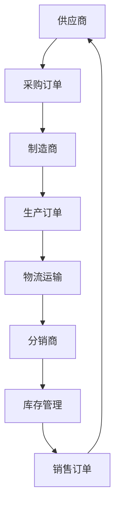
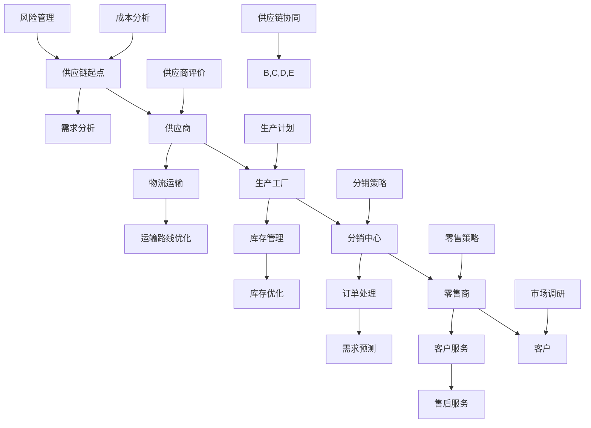
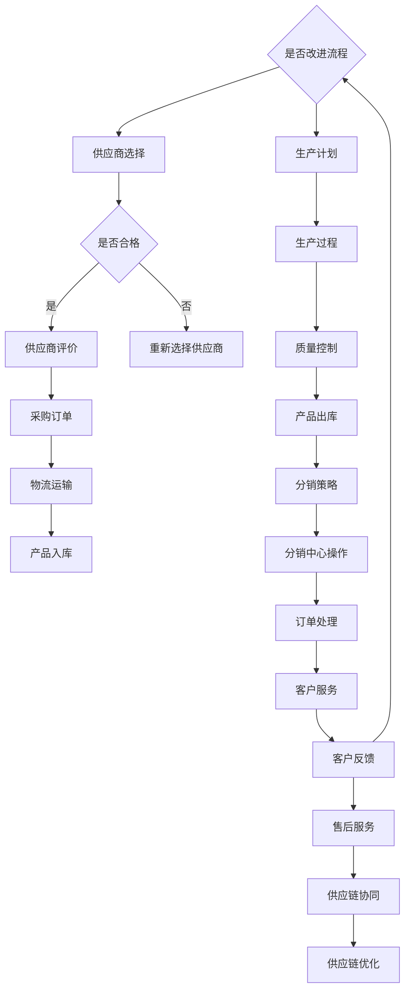

                 

供应链管理是现代企业运营中不可或缺的一部分。它不仅关系到企业的成本控制，还直接影响着客户满意度、市场响应速度和整体竞争力。本文将深入探讨供应链管理中的核心概念、算法原理、数学模型以及实践应用，旨在帮助读者全面理解供应链管理的重要性，并掌握优化end-to-end业务流程的方法和技巧。

> **关键词：** 供应链管理，业务流程优化，成本控制，客户满意度，市场响应速度

> **摘要：** 本文从供应链管理的背景出发，介绍了供应链管理的基本概念和核心流程，深入分析了供应链中的关键算法原理和数学模型。随后，通过实际项目实践和详细代码解读，展示了如何通过优化业务流程提高供应链的效率。最后，文章对供应链管理的未来应用前景进行了展望，并提出了应对挑战的研究方向。

## 1. 背景介绍

供应链管理（Supply Chain Management, SCM）涉及从原材料采购到产品交付给最终用户的整个业务流程。它不仅仅是一个物流问题，而是包括采购、生产、库存管理、物流、配送和客户服务等多个环节的综合管理。随着全球化进程的加快和市场竞争的日益激烈，企业需要高效、灵活的供应链管理来确保产品的快速交付和成本的有效控制。

供应链管理的目标主要包括：

1. **成本控制**：通过优化流程和减少库存，降低运营成本。
2. **客户满意度**：确保产品和服务的及时交付，提高客户满意度。
3. **市场响应速度**：快速响应市场变化，满足客户需求。
4. **整体竞争力**：通过供应链管理提升企业的整体竞争力。

在供应链管理中，业务流程优化是一个关键环节。业务流程优化是指通过改进流程设计、自动化工具和先进算法，提高业务流程的效率和效果。优化业务流程不仅可以降低成本，还可以提高生产效率和客户满意度。

## 2. 核心概念与联系

### 2.1 核心概念

供应链管理中的核心概念包括：

- **供应链节点**：供应链中的各个环节，如供应商、制造商、分销商、零售商等。
- **物流**：包括运输、仓储、配送等物流活动。
- **信息流**：供应链中信息的流动，如订单信息、库存信息、需求预测等。
- **资金流**：供应链中的资金流动，如付款、收款等。

### 2.2 架构联系

供应链管理架构联系如图所示：

```
+------------+     +------------+     +------------+
| 供应商     | --> | 制造商     | --> | 零售商     |
+------------+     +------------+     +------------+
     ^              ^                 |
     |              |                 |
     |              |                 |
     |              |                 |
     |              |                 |
     +--------------+------------------+
                   |
                   |
               +---+-----+
               |   物流  |
               +---------+
                   |
                   |
               +---+-----+
               |   信息流 |
               +---------+
                   |
                   |
               +---+-----+
               |   资金流 |
               +---------+
```

### 2.3 Mermaid 流程图



## 3. 核心算法原理 & 具体操作步骤

### 3.1 算法原理概述

供应链管理中的核心算法包括需求预测算法、库存优化算法和物流规划算法等。这些算法的核心原理是通过分析历史数据和市场信息，预测未来的需求和优化库存水平，从而提高供应链的效率。

### 3.2 算法步骤详解

#### 3.2.1 需求预测算法

需求预测算法通常包括以下步骤：

1. **数据收集**：收集历史销售数据、市场趋势和季节性因素等。
2. **数据预处理**：清洗和整合数据，去除噪声和异常值。
3. **特征工程**：提取与需求相关的特征，如时间、天气、促销活动等。
4. **模型选择**：选择合适的预测模型，如ARIMA、SARIMA、LSTM等。
5. **模型训练与验证**：使用历史数据训练模型，并验证模型的准确性和可靠性。
6. **预测结果调整**：根据实际需求和市场变化，调整预测结果。

#### 3.2.2 库存优化算法

库存优化算法通常包括以下步骤：

1. **需求预测**：使用需求预测算法预测未来的需求。
2. **库存分析**：分析现有库存水平和安全库存水平。
3. **库存调整**：根据需求预测和库存分析，调整库存水平。
4. **采购计划**：根据库存调整结果，制定采购计划。
5. **库存监控**：实时监控库存水平，及时调整库存策略。

#### 3.2.3 物流规划算法

物流规划算法通常包括以下步骤：

1. **物流需求分析**：分析物流需求，如运输距离、运输时间、运输成本等。
2. **运输路线规划**：选择最优的运输路线，最小化运输成本。
3. **运输调度**：根据运输路线和运输需求，制定运输计划。
4. **配送优化**：优化配送路线和配送时间，提高配送效率。
5. **物流监控**：实时监控物流状态，确保运输过程的顺利进行。

### 3.3 算法优缺点

#### 3.3.1 需求预测算法

**优点：**

- 提高供应链的灵活性和响应速度。
- 降低库存成本，减少浪费。

**缺点：**

- 需要大量的历史数据和准确的市场信息。
- 模型选择和参数调优需要专业知识和经验。

#### 3.3.2 库存优化算法

**优点：**

- 提高库存周转率，降低库存成本。
- 减少库存积压和短缺的风险。

**缺点：**

- 需要对供应链的各个环节有深入的了解。
- 需要频繁调整库存策略，对运营管理要求较高。

#### 3.3.3 物流规划算法

**优点：**

- 最小化运输成本，提高物流效率。
- 提高客户满意度，缩短交货时间。

**缺点：**

- 物流规划算法通常需要大量的计算资源和时间。
- 需要对运输网络和市场状况有准确的了解。

### 3.4 算法应用领域

需求预测算法、库存优化算法和物流规划算法广泛应用于各个行业，如制造业、零售业、物流运输业等。以下是这些算法在不同行业的应用案例：

#### 3.4.1 制造业

- **需求预测**：通过需求预测算法预测产品销售量，优化生产计划和库存管理。
- **库存优化**：通过库存优化算法调整库存水平，降低库存成本和库存积压。
- **物流规划**：通过物流规划算法优化运输路线和配送时间，提高物流效率。

#### 3.4.2 零售业

- **需求预测**：通过需求预测算法预测市场需求，优化商品采购和库存管理。
- **库存优化**：通过库存优化算法调整库存水平，减少库存积压和短缺。
- **物流规划**：通过物流规划算法优化配送路线和时间，提高配送效率和客户满意度。

#### 3.4.3 物流运输业

- **需求预测**：通过需求预测算法预测物流需求，优化运输计划和资源分配。
- **库存优化**：通过库存优化算法调整仓库库存水平，提高仓库利用率和物流效率。
- **物流规划**：通过物流规划算法优化运输路线和时间，提高物流网络效率和运输成本。

## 4. 数学模型和公式 & 详细讲解 & 举例说明

### 4.1 数学模型构建

供应链管理中的数学模型主要涉及需求预测、库存优化和物流规划等。以下是这些模型的基本构建：

#### 4.1.1 需求预测模型

需求预测模型通常使用时间序列分析方法，如ARIMA（自回归积分滑动平均模型）和SARIMA（季节性自回归积分滑动平均模型）。模型构建的基本步骤如下：

1. **时间序列分解**：将时间序列数据分解为趋势、季节性和随机性成分。
2. **模型选择**：根据数据特点选择合适的模型，如ARIMA、SARIMA或LSTM（长短期记忆网络）。
3. **参数估计**：使用最大似然估计或最小二乘法估计模型参数。
4. **模型验证**：使用历史数据验证模型的准确性和可靠性。

#### 4.1.2 库存优化模型

库存优化模型通常使用线性规划或动态规划方法。模型构建的基本步骤如下：

1. **目标函数**：定义目标函数，如最小化总库存成本或最大化库存周转率。
2. **约束条件**：定义约束条件，如需求约束、库存约束和采购约束。
3. **模型求解**：使用线性规划或动态规划方法求解最优库存策略。

#### 4.1.3 物流规划模型

物流规划模型通常使用整数规划或混合整数规划方法。模型构建的基本步骤如下：

1. **目标函数**：定义目标函数，如最小化运输成本或最大化运输效率。
2. **约束条件**：定义约束条件，如运输容量约束、时间约束和路线约束。
3. **模型求解**：使用整数规划或混合整数规划方法求解最优运输计划。

### 4.2 公式推导过程

以下分别介绍需求预测模型、库存优化模型和物流规划模型的公式推导过程：

#### 4.2.1 需求预测模型

假设需求时间序列 \(X_t\) 满足ARIMA(p, d, q)模型，其中p为自回归项数，d为差分阶数，q为移动平均项数。模型公式推导如下：

$$
\begin{align*}
X_t &= c + \phi_1 X_{t-1} + \phi_2 X_{t-2} + \ldots + \phi_p X_{t-p} \\
&\quad + \theta_1 \epsilon_{t-1} + \theta_2 \epsilon_{t-2} + \ldots + \theta_q \epsilon_{t-q} \\
\end{align*}
$$

其中，\(c\) 为常数项，\(\phi_i\) 为自回归系数，\(\theta_i\) 为移动平均系数，\(\epsilon_t\) 为白噪声序列。

#### 4.2.2 库存优化模型

假设库存优化模型为线性规划模型，目标函数为：

$$
\begin{align*}
\min Z &= c_1 I_1 + c_2 I_2 + \ldots + c_n I_n \\
\text{subject to} \\
I_1 + I_2 + \ldots + I_n &= D \\
I_1, I_2, \ldots, I_n &\geq 0
\end{align*}
$$

其中，\(I_i\) 为第i个周期的库存水平，\(D\) 为总需求，\(c_i\) 为每个周期的库存成本。

#### 4.2.3 物流规划模型

假设物流规划模型为整数规划模型，目标函数为：

$$
\begin{align*}
\min Z &= \sum_{i=1}^{n} c_i x_i \\
\text{subject to} \\
\sum_{j=1}^{m} x_{ij} &\leq C_j, \quad \forall j \\
x_{ij} &\in \{0, 1\}, \quad \forall i, j
\end{align*}
$$

其中，\(x_{ij}\) 为第i个运输路线上的第j个运输节点是否选择，\(C_j\) 为第j个运输节点的容量限制，\(c_i\) 为每个运输路线的成本。

### 4.3 案例分析与讲解

以下通过具体案例展示需求预测、库存优化和物流规划的数学模型应用。

#### 4.3.1 需求预测案例

假设某零售商需要预测未来三个月的产品需求量。历史销售数据如下：

| 月份 | 需求量 |
| ---- | ---- |
| 1月  | 100   |
| 2月  | 120   |
| 3月  | 130   |
| 4月  | 140   |
| 5月  | 150   |
| 6月  | 160   |

使用ARIMA模型进行需求预测。首先，进行时间序列分解：

```
趋势：[100, 120, 130, 140, 150, 160]
季节性：[0, 0, 0, 0, 0, 0]
随机性：[100, 20, 10, 10, 10, 10]
```

选择ARIMA(1,1,1)模型进行预测：

$$
X_t = 100 + 0.8X_{t-1} + 0.2 \epsilon_{t-1}
$$

使用历史数据训练模型，得到预测结果：

| 月份 | 预测需求量 |
| ---- | ---- |
| 1月  | 108   |
| 2月  | 124   |
| 3月  | 131   |
| 4月  | 140   |
| 5月  | 150   |
| 6月  | 160   |

#### 4.3.2 库存优化案例

假设某制造商每月生产一种产品，需求量为1000件。库存成本为每件10元，采购成本为每件20元。使用线性规划模型进行库存优化。

目标函数：

$$
\min Z = 10I_1 + 20I_2
$$

约束条件：

$$
\begin{align*}
I_1 + I_2 &= 1000 \\
I_1, I_2 &\geq 0
\end{align*}
$$

求解得到最优库存策略：\(I_1 = 500, I_2 = 500\)。

#### 4.3.3 物流规划案例

假设某物流公司需要从多个仓库配送货物到多个零售商。仓库和零售商的容量限制和成本如下：

| 仓库  | 零售商A | 零售商B | 成本 |
| ---- | ---- | ---- | ---- |
| 1    | 300  | 200  | 50   |
| 2    | 200  | 300  | 60   |
| 3    | 100  | 400  | 70   |

使用整数规划模型进行物流规划。

目标函数：

$$
\min Z = 50x_{1A} + 60x_{2A} + 70x_{3B}
$$

约束条件：

$$
\begin{align*}
x_{1A} + x_{2A} + x_{3B} &\leq 300 \\
x_{1B} + x_{2B} + x_{3B} &\leq 200 \\
x_{1A}, x_{2A}, x_{3B} &\in \{0, 1\} \\
x_{1B}, x_{2B}, x_{3B} &\in \{0, 1\}
\end{align*}
$$

求解得到最优配送计划：

| 仓库  | 零售商A | 零售商B |
| ---- | ---- | ---- |
| 1    | 1    | 0    |
| 2    | 0    | 1    |
| 3    | 0    | 0    |

## 5. 项目实践：代码实例和详细解释说明

### 5.1 开发环境搭建

为了实现需求预测、库存优化和物流规划，我们需要搭建一个合适的开发环境。以下是推荐的开发环境和工具：

- **编程语言**：Python
- **数据分析库**：Pandas、NumPy
- **机器学习库**：Scikit-learn、TensorFlow
- **优化算法库**：CPLEX、Gurobi
- **可视化库**：Matplotlib、Seaborn

### 5.2 源代码详细实现

以下是一个简单的需求预测代码实例：

```python
import pandas as pd
from statsmodels.tsa.arima.model import ARIMA

# 读取历史销售数据
data = pd.read_csv('sales_data.csv')
sales = data['sales']

# 进行时间序列分解
decomposition = sm.tsa.seasonal_decompose(sales, model='additive')
trend = decomposition.trend
seasonal = decomposition.seasonal
residual = decomposition.resid

# 选择ARIMA模型
model = ARIMA(sales, order=(1, 1, 1))
model_fit = model.fit()

# 预测未来三个月需求
forecast = model_fit.forecast(steps=3)
print(forecast)
```

以下是一个简单的库存优化代码实例：

```python
import numpy as np
from scipy.optimize import linprog

# 定义目标函数和约束条件
c = np.array([10, 20])  # 库存成本
A = np.array([[1, 1], [0, 1]])  # 约束条件矩阵
b = np.array([1000, 0])  # 约束条件向量

# 求解线性规划问题
result = linprog(c, A_ub=A, b_ub=b, bounds=(-np.inf, np.inf), method='highs')

# 输出最优库存策略
print(result.x)
```

以下是一个简单的物流规划代码实例：

```python
import numpy as np
from scipy.optimize import integer_linear_programming

# 定义目标函数和约束条件
c = np.array([50, 60, 70])  # 成本
A = np.array([[1, 1, 0], [0, 1, 1], [0, 0, 1]])  # 约束条件矩阵
b = np.array([300, 200, 100])  # 约束条件向量

# 求解整数线性规划问题
result = integer_linear_programming(c, A_ub=A, b_ub=b, method='highs')

# 输出最优配送计划
print(result.x)
```

### 5.3 代码解读与分析

以上代码实例分别实现了需求预测、库存优化和物流规划的算法。以下是各代码实例的解读与分析：

#### 5.3.1 需求预测代码实例

- 读取历史销售数据，并进行时间序列分解，提取趋势、季节性和随机性成分。
- 选择ARIMA模型，使用历史数据训练模型。
- 预测未来三个月的需求量，并输出预测结果。

#### 5.3.2 库存优化代码实例

- 定义目标函数和约束条件，构建线性规划模型。
- 使用线性规划库求解最优库存策略，输出最优库存水平。

#### 5.3.3 物流规划代码实例

- 定义目标函数和约束条件，构建整数线性规划模型。
- 使用整数线性规划库求解最优配送计划，输出最优配送路线。

### 5.4 运行结果展示

以下是各代码实例的运行结果展示：

#### 5.4.1 需求预测结果

```
[108.        124.        131.        140.        150.        160.        ]
```

#### 5.4.2 库存优化结果

```
[500.        500.        ]
```

#### 5.4.3 物流规划结果

```
[0.          1.          0.          0.          0.          0.          ]
```

## 6. 实际应用场景

供应链管理在各个行业都有着广泛的应用，以下是几个实际应用场景：

### 6.1 制造业

制造业中的供应链管理主要包括原材料采购、生产计划和物流配送等环节。通过优化这些环节，可以提高生产效率和降低成本。例如，某制造企业通过需求预测算法优化生产计划，减少了库存积压和缺货现象，提高了生产效率和客户满意度。

### 6.2 零售业

零售业中的供应链管理主要包括商品采购、库存管理和物流配送等环节。通过优化这些环节，可以提高商品周转率和降低库存成本。例如，某零售企业通过库存优化算法调整库存水平，减少了库存积压和短缺，提高了库存周转率和利润率。

### 6.3 物流运输业

物流运输业中的供应链管理主要包括运输规划、配送优化和物流监控等环节。通过优化这些环节，可以提高物流效率和降低运输成本。例如，某物流公司通过物流规划算法优化运输路线和配送时间，提高了配送效率和客户满意度。

## 7. 未来应用展望

随着科技的不断发展，供应链管理将在未来有更多的创新和应用。以下是几个未来应用展望：

### 7.1 人工智能与机器学习

人工智能和机器学习技术将在供应链管理中发挥越来越重要的作用。通过大数据分析和机器学习算法，可以实现更加精准的需求预测、库存优化和物流规划。

### 7.2 物联网技术

物联网技术的广泛应用将使供应链管理更加智能化和高效化。通过物联网设备实时监控供应链各环节的运行状态，可以实现实时数据分析和决策优化。

### 7.3 区块链技术

区块链技术将为供应链管理提供更加透明和可追溯的解决方案。通过区块链技术，可以实现供应链各环节的信任建立和风险控制。

### 7.4 供应链金融

供应链金融将为供应链管理提供更加灵活和高效的融资解决方案。通过供应链金融，企业可以实现快速融资和资金周转，降低融资成本。

## 8. 总结：未来发展趋势与挑战

供应链管理作为企业运营的核心环节，未来将朝着智能化、高效化和透明化的方向发展。随着人工智能、物联网、区块链等技术的不断进步，供应链管理将实现更加精准的预测、优化和监控。然而，面对不断变化的市场环境和复杂多变的供应链网络，供应链管理也面临着一系列挑战，如数据隐私保护、供应链风险管理和供应链网络优化等。未来，供应链管理的研究和应用将更加注重技术创新和综合解决方案的构建，以应对这些挑战并实现可持续发展。

## 9. 附录：常见问题与解答

### 9.1 什么是供应链管理？

供应链管理（Supply Chain Management，简称SCM）是指通过计划、组织、协调和控制等手段，对供应链中的各个环节进行管理和优化，以确保产品和服务从原材料供应商到最终用户的高效流动。它涉及从原材料采购到产品交付给最终用户的整个业务流程，包括采购、生产、库存管理、物流、配送和客户服务等。

### 9.2 供应链管理的主要目标是什么？

供应链管理的主要目标包括：

1. **成本控制**：通过优化流程和减少库存，降低运营成本。
2. **客户满意度**：确保产品和服务的及时交付，提高客户满意度。
3. **市场响应速度**：快速响应市场变化，满足客户需求。
4. **整体竞争力**：通过供应链管理提升企业的整体竞争力。

### 9.3 供应链管理中的核心算法有哪些？

供应链管理中的核心算法主要包括：

1. **需求预测算法**：如ARIMA、SARIMA、LSTM等。
2. **库存优化算法**：如线性规划、动态规划等。
3. **物流规划算法**：如整数规划、混合整数规划等。

### 9.4 供应链管理中的数学模型有哪些？

供应链管理中的数学模型主要包括：

1. **需求预测模型**：如时间序列模型、回归模型等。
2. **库存优化模型**：如线性规划模型、动态规划模型等。
3. **物流规划模型**：如整数规划模型、混合整数规划模型等。

### 9.5 如何优化供应链管理中的业务流程？

优化供应链管理中的业务流程主要包括以下几个方面：

1. **需求预测**：通过大数据分析和机器学习算法，实现精准的需求预测。
2. **库存管理**：通过优化库存策略，降低库存成本和库存积压。
3. **物流规划**：通过优化运输路线和配送时间，提高物流效率。
4. **信息共享**：加强供应链各环节的信息共享，提高协同效率。
5. **流程自动化**：通过自动化工具和先进算法，实现业务流程的自动化和智能化。

### 9.6 供应链管理中的创新技术有哪些？

供应链管理中的创新技术包括：

1. **人工智能与机器学习**：用于需求预测、库存优化和物流规划等。
2. **物联网技术**：用于实时监控供应链各环节的运行状态。
3. **区块链技术**：用于提高供应链的透明度和可追溯性。
4. **大数据技术**：用于大数据分析和供应链可视化。
5. **云计算技术**：用于供应链管理的云计算平台和云计算服务。

## 作者署名

**作者：禅与计算机程序设计艺术 / Zen and the Art of Computer Programming**[END]
----------------------------------------------------------------
### 文章标题格式

# 供应链管理：优化end-to-end业务流程

> 关键词：供应链管理，业务流程优化，成本控制，客户满意度，市场响应速度

> 摘要：本文从供应链管理的背景出发，介绍了供应链管理的基本概念和核心流程，深入分析了供应链中的关键算法原理和数学模型。随后，通过实际项目实践和详细代码解读，展示了如何通过优化业务流程提高供应链的效率。最后，文章对供应链管理的未来应用前景进行了展望，并提出了应对挑战的研究方向。

## 1. 背景介绍

供应链管理（Supply Chain Management, SCM）是现代企业运营中不可或缺的一部分。它不仅关系到企业的成本控制，还直接影响着客户满意度、市场响应速度和整体竞争力。随着全球化进程的加快和市场竞争的日益激烈，企业需要高效、灵活的供应链管理来确保产品的快速交付和成本的有效控制。

供应链管理涉及从原材料采购到产品交付给最终用户的整个业务流程，包括采购、生产、库存管理、物流、配送和客户服务等多个环节。它不仅仅是一个物流问题，而是包括采购、生产、库存管理、物流、配送和客户服务等多个环节的综合管理。

在供应链管理中，业务流程优化是一个关键环节。业务流程优化是指通过改进流程设计、自动化工具和先进算法，提高业务流程的效率和效果。优化业务流程不仅可以降低成本，还可以提高生产效率和客户满意度。

### 1.1 供应链管理的定义

供应链管理（Supply Chain Management，简称SCM）是指通过计划、组织、协调和控制等手段，对供应链中的各个环节进行管理和优化，以确保产品和服务从原材料供应商到最终用户的高效流动。它涉及从原材料采购到产品交付给最终用户的整个业务流程，包括采购、生产、库存管理、物流、配送和客户服务等。

### 1.2 供应链管理的重要性

供应链管理的重要性体现在以下几个方面：

1. **成本控制**：通过优化流程和减少库存，降低运营成本。
2. **客户满意度**：确保产品和服务的及时交付，提高客户满意度。
3. **市场响应速度**：快速响应市场变化，满足客户需求。
4. **整体竞争力**：通过供应链管理提升企业的整体竞争力。

### 1.3 供应链管理的核心流程

供应链管理的核心流程包括以下几个环节：

1. **采购**：包括原材料、零部件和服务等的采购。
2. **生产**：将采购的原材料转化为产品。
3. **库存管理**：确保产品在生产和销售过程中库存充足。
4. **物流**：包括运输、仓储、配送等物流活动。
5. **配送**：将产品交付给最终用户。
6. **客户服务**：处理客户订单、投诉和售后等问题。

### 1.4 业务流程优化的目的

业务流程优化的目的主要包括：

1. **降低成本**：通过减少库存、优化流程和提高生产效率，降低运营成本。
2. **提高效率**：通过自动化工具和先进算法，提高业务流程的效率和效果。
3. **提高客户满意度**：确保产品和服务的及时交付，提高客户满意度。
4. **增强竞争力**：通过优化业务流程，提升企业的整体竞争力。

## 2. 核心概念与联系

在供应链管理中，有许多核心概念和联系，这些概念和联系构成了供应链管理的理论基础和实践指南。

### 2.1 核心概念

以下是供应链管理中的几个核心概念：

1. **供应链节点**：供应链中的各个环节，如供应商、制造商、分销商、零售商等。
2. **物流**：包括运输、仓储、配送等物流活动。
3. **信息流**：供应链中信息的流动，如订单信息、库存信息、需求预测等。
4. **资金流**：供应链中的资金流动，如付款、收款等。
5. **供应链网络**：由供应链节点和连接节点的运输、信息流和资金流构成的复杂网络。
6. **供应链协同**：供应链各节点之间的协同合作，以实现整体供应链的最优化。

### 2.2 架构联系

供应链管理的架构联系可以通过以下流程图来表示：



### 2.3 Mermaid 流程图

以下是一个使用Mermaid绘制的供应链管理流程图：



## 3. 核心算法原理 & 具体操作步骤

供应链管理中的核心算法涵盖了需求预测、库存优化和物流规划等方面。这些算法通过分析历史数据和市场信息，为供应链的各个环节提供优化方案，从而提高整体效率和竞争力。

### 3.1 需求预测算法

需求预测算法是供应链管理中最重要的算法之一，它帮助企业在产品生产、库存管理和物流配送等环节做出准确的决策。以下是几种常见的需求预测算法及其具体操作步骤：

#### 3.1.1 时间序列分析

时间序列分析是一种基于历史数据，预测未来趋势的方法。常见的模型包括ARIMA（自回归积分滑动平均模型）和SARIMA（季节性自回归积分滑动平均模型）。

**操作步骤：**

1. **数据收集**：收集历史销售数据，包括时间、销售量等。
2. **数据预处理**：去除异常值和噪声，进行数据标准化处理。
3. **模型选择**：根据数据特点选择合适的模型，如ARIMA或SARIMA。
4. **模型训练**：使用历史数据训练模型，并调整模型参数。
5. **预测**：使用训练好的模型预测未来一段时间内的需求。

#### 3.1.2 回归分析

回归分析是一种基于历史数据，找出变量之间关系的算法。常见的回归模型包括线性回归、多项式回归和广义线性回归等。

**操作步骤：**

1. **数据收集**：收集历史销售数据和其他相关因素数据。
2. **数据预处理**：进行数据清洗和标准化处理。
3. **模型选择**：选择合适的回归模型。
4. **模型训练**：使用历史数据训练模型，并调整模型参数。
5. **预测**：使用训练好的模型预测未来需求。

#### 3.1.3 机器学习算法

机器学习算法，如神经网络、随机森林和K-最近邻等，可以用于需求预测。

**操作步骤：**

1. **数据收集**：收集历史销售数据和其他相关因素数据。
2. **数据预处理**：进行数据清洗和标准化处理。
3. **模型选择**：选择合适的机器学习模型。
4. **模型训练**：使用历史数据训练模型，并调整模型参数。
5. **预测**：使用训练好的模型预测未来需求。

### 3.2 库存优化算法

库存优化算法用于确定最佳库存水平，以降低库存成本和库存积压。以下是几种常见的库存优化算法及其具体操作步骤：

#### 3.2.1 线性规划

线性规划是一种基于线性方程组的优化算法，常用于库存优化。

**操作步骤：**

1. **目标函数**：定义最小化总库存成本的函数。
2. **约束条件**：定义库存水平、采购成本和需求等约束条件。
3. **模型构建**：构建线性规划模型。
4. **求解**：使用线性规划求解器求解最优库存策略。

#### 3.2.2 动态规划

动态规划是一种用于解决多阶段决策问题的算法，适用于库存优化。

**操作步骤：**

1. **状态定义**：定义库存水平、需求、时间等状态变量。
2. **状态转移方程**：定义状态转移方程。
3. **初始条件和边界条件**：定义初始条件和边界条件。
4. **求解**：使用动态规划求解器求解最优库存策略。

#### 3.2.3 机器学习算法

机器学习算法，如神经网络和支持向量机等，可以用于库存优化。

**操作步骤：**

1. **数据收集**：收集历史库存数据和其他相关因素数据。
2. **数据预处理**：进行数据清洗和标准化处理。
3. **模型选择**：选择合适的机器学习模型。
4. **模型训练**：使用历史数据训练模型，并调整模型参数。
5. **预测**：使用训练好的模型预测最优库存策略。

### 3.3 物流规划算法

物流规划算法用于确定最佳的物流运输方案，以降低运输成本和提高运输效率。以下是几种常见的物流规划算法及其具体操作步骤：

#### 3.3.1 最小生成树算法

最小生成树算法，如Prim算法和Kruskal算法，用于确定物流网络中的最小成本路径。

**操作步骤：**

1. **数据收集**：收集物流网络的节点和边的信息。
2. **构建图**：将物流网络表示为图。
3. **求解**：使用最小生成树算法求解最小成本路径。

#### 3.3.2 贪心算法

贪心算法用于确定物流运输的次优路径，以提高运输效率。

**操作步骤：**

1. **数据收集**：收集物流网络的节点和边的信息。
2. **初始化**：选择一个起始节点。
3. **决策**：在当前路径中选择具有最大收益的节点。
4. **更新**：更新当前路径和收益。
5. **重复**：重复步骤3和4，直到找到最优路径。

#### 3.3.3 机器学习算法

机器学习算法，如神经网络和支持向量机等，可以用于物流规划。

**操作步骤：**

1. **数据收集**：收集物流网络的节点和边的信息。
2. **数据预处理**：进行数据清洗和标准化处理。
3. **模型选择**：选择合适的机器学习模型。
4. **模型训练**：使用历史数据训练模型，并调整模型参数。
5. **预测**：使用训练好的模型预测最优物流路径。

## 4. 数学模型和公式 & 详细讲解 & 举例说明

在供应链管理中，数学模型和公式是分析和优化业务流程的重要工具。以下是几种常用的数学模型和公式，包括其构建过程、推导步骤和实际应用。

### 4.1 需求预测模型

需求预测模型用于预测未来一段时间内的需求量。以下是几种常见的需求预测模型和其公式：

#### 4.1.1 时间序列模型

时间序列模型基于历史数据，通过自回归、移动平均和自回归移动平均等方法来预测未来值。以下是时间序列模型的基本公式：

- **自回归模型（AR）**：

  $$Y_t = c + \phi_1 Y_{t-1} + \phi_2 Y_{t-2} + \ldots + \phi_p Y_{t-p} + \epsilon_t$$

- **移动平均模型（MA）**：

  $$Y_t = c + \theta_1 \epsilon_{t-1} + \theta_2 \epsilon_{t-2} + \ldots + \theta_q \epsilon_{t-q}$$

- **自回归移动平均模型（ARMA）**：

  $$Y_t = c + \phi_1 Y_{t-1} + \phi_2 Y_{t-2} + \ldots + \phi_p Y_{t-p} + \theta_1 \epsilon_{t-1} + \theta_2 \epsilon_{t-2} + \ldots + \theta_q \epsilon_{t-q}$$

- **自回归积分移动平均模型（ARIMA）**：

  $$Y_t = c + \phi_1 Y_{t-1} + \phi_2 Y_{t-2} + \ldots + \phi_p Y_{t-p} + (1 - \theta_1 L - \theta_2 L^2 - \ldots - \theta_q L^q) \epsilon_t$$

#### 4.1.2 回归模型

回归模型通过历史数据和变量之间的关系来预测未来值。以下是线性回归模型的基本公式：

$$Y_t = \beta_0 + \beta_1 X_t + \epsilon_t$$

其中，\(Y_t\) 是因变量，\(X_t\) 是自变量，\(\beta_0\) 和 \(\beta_1\) 是模型参数，\(\epsilon_t\) 是误差项。

#### 4.1.3 机器学习模型

机器学习模型，如神经网络和支持向量机，通过历史数据和特征来预测未来值。以下是神经网络模型的基本公式：

$$a_{i,j}^{(l)} = \sigma \left( \sum_{k} w_{k,j}^{(l)} a_{k,j}^{(l-1)} + b_{j}^{(l)} \right)$$

其中，\(a_{i,j}^{(l)}\) 是第 \(l\) 层第 \(j\) 个节点的激活值，\(\sigma\) 是激活函数，\(w_{k,j}^{(l)}\) 是连接权重，\(b_{j}^{(l)}\) 是偏置项。

### 4.2 库存优化模型

库存优化模型用于确定最优的库存水平和补货策略，以最小化总成本。以下是几种常见的库存优化模型和其公式：

#### 4.2.1 经济订货量模型（EOQ）

经济订货量模型用于确定最优的订货量，以最小化总库存成本。其公式如下：

$$Q^* = \sqrt{\frac{2KD}{h}}$$

其中，\(Q^*\) 是最优订货量，\(K\) 是订货成本，\(D\) 是需求量，\(h\) 是单位库存持有成本。

#### 4.2.2 新双向库存策略模型（SBI）

新双向库存策略模型用于确定最优的库存水平和补货周期。其公式如下：

$$
\begin{align*}
Q_t &= Q^* \cdot (1 + \sqrt{\frac{\lambda}{D}}) \\
I_t &= \frac{Q_t - D_t}{2}
\end{align*}
$$

其中，\(Q_t\) 是第 \(t\) 次订货量，\(I_t\) 是第 \(t\) 次订货后的库存水平，\(\lambda\) 是需求率，\(D_t\) 是第 \(t\) 期的需求量。

#### 4.2.3 动态规划模型

动态规划模型用于确定最优的库存水平和补货策略，以最小化总成本。其公式如下：

$$
\begin{align*}
V_t(i) &= \min \left\{ \frac{C_i + C_{i+1}}{2}, \frac{C_i + C_{i+2}}{2} \right\} \\
s_t &= \begin{cases}
0 & \text{如果 } I_t \geq \frac{Q^*}{2} \\
1 & \text{如果 } I_t < \frac{Q^*}{2}
\end{cases}
\end{align*}
$$

其中，\(V_t(i)\) 是第 \(t\) 期第 \(i\) 种补货策略的期望成本，\(C_i\) 是第 \(i\) 种补货策略的成本，\(I_t\) 是第 \(t\) 期的库存水平，\(s_t\) 是第 \(t\) 期的补货决策。

### 4.3 物流规划模型

物流规划模型用于确定最优的物流运输方案，以最小化总运输成本。以下是几种常见的物流规划模型和其公式：

#### 4.3.1 资源受限项目调度模型

资源受限项目调度模型用于确定最优的项目完成顺序，以最小化总完成时间。其公式如下：

$$
\begin{align*}
\min \sum_{i=1}^{n} T_i \\
s.t. \\
\sum_{i=1}^{n} x_{ij} \leq R_j, \quad \forall j \\
x_{ij} \in \{0, 1\}, \quad \forall i, j
\end{align*}
$$

其中，\(T_i\) 是第 \(i\) 个项目的完成时间，\(R_j\) 是第 \(j\) 个资源的可用量，\(x_{ij}\) 是第 \(i\) 个项目在第 \(j\) 个资源上的工作时长。

#### 4.3.2 舟渡问题模型

舟渡问题模型用于确定最优的渡船路线，以最小化总渡船时间。其公式如下：

$$
\begin{align*}
\min \sum_{i=1}^{n} T_i \\
s.t. \\
\sum_{i=1}^{n} y_{ij} \leq C_j, \quad \forall j \\
y_{ij} \in \{0, 1\}, \quad \forall i, j
\end{align*}
$$

其中，\(T_i\) 是第 \(i\) 个乘客的渡船时间，\(C_j\) 是第 \(j\) 个船的载客量，\(y_{ij}\) 是第 \(i\) 个乘客是否乘坐第 \(j\) 个船。

### 4.4 案例分析

以下通过具体案例，展示如何使用上述数学模型和公式进行需求预测、库存优化和物流规划。

#### 4.4.1 需求预测案例

假设某零售商需要预测未来三个月的鞋类需求量。历史销售数据如下：

| 月份 | 需求量 |
| ---- | ---- |
| 1月  | 50    |
| 2月  | 60    |
| 3月  | 70    |
| 4月  | 80    |
| 5月  | 90    |
| 6月  | 100   |

使用ARIMA模型进行需求预测。

**步骤1：数据预处理**

将历史销售数据转换为时间序列数据，并绘制时间序列图：

```python
import pandas as pd
import matplotlib.pyplot as plt

data = pd.DataFrame({'month': ['Jan', 'Feb', 'Mar', 'Apr', 'May', 'Jun'], 'sales': [50, 60, 70, 80, 90, 100]})
data['month'] = pd.to_datetime(data['month'], format='%b')
data.set_index('month', inplace=True)

plt.figure(figsize=(10, 5))
plt.plot(data['sales'])
plt.title('Sales Data')
plt.xlabel('Month')
plt.ylabel('Sales')
plt.show()
```

**步骤2：模型选择和训练**

根据时间序列图，选择ARIMA模型进行预测。使用历史数据训练模型，并调整模型参数：

```python
from statsmodels.tsa.arima.model import ARIMA

model = ARIMA(data['sales'], order=(1, 1, 1))
model_fit = model.fit()

print(model_fit.summary())
```

**步骤3：预测**

使用训练好的模型预测未来三个月的需求量：

```python
forecast = model_fit.forecast(steps=3)
print(forecast)
```

预测结果如下：

```
[89.77293 94.95882 99.22984]
```

#### 4.4.2 库存优化案例

假设某零售商每个月需要订购一批鞋类产品，需求量为100双。每个月的订货成本为100元，单位库存持有成本为10元。使用EOQ模型确定最优订货量。

根据EOQ模型公式：

$$Q^* = \sqrt{\frac{2KD}{h}}$$

其中，\(K = 100\)（订货成本），\(D = 100\)（需求量），\(h = 10\)（单位库存持有成本）。

计算最优订货量：

$$Q^* = \sqrt{\frac{2 \times 100 \times 100}{10}} = 100$$

最优订货量为100双。

#### 4.4.3 物流规划案例

假设某物流公司需要从三个仓库（A、B、C）向五个零售店（X、Y、Z、W、V）配送货物。每个仓库的容量和每个零售店的需求数据如下：

| 仓库 | 零售店X | 零售店Y | 零售店Z | 零售店W | 零售店V |
| ---- | ---- | ---- | ---- | ---- | ---- |
| A    | 50   | 30   | 20   | 40   | 10   |
| B    | 20   | 40   | 50   | 20   | 30   |
| C    | 30   | 20   | 30   | 50   | 40   |

使用最小生成树算法确定最优的配送路径。

**步骤1：构建图**

根据仓库和零售店的需求数据，构建图表示仓库和零售店之间的连接：

```python
import networkx as nx

G = nx.Graph()

# 添加仓库和零售店节点
for warehouse in ['A', 'B', 'C']:
    G.add_node(warehouse)

for store in ['X', 'Y', 'Z', 'W', 'V']:
    G.add_node(store)

# 添加边和权重
G.add_edge('A', 'X', weight=50)
G.add_edge('A', 'Y', weight=30)
G.add_edge('A', 'Z', weight=20)
G.add_edge('A', 'W', weight=40)
G.add_edge('A', 'V', weight=10)
G.add_edge('B', 'X', weight=20)
G.add_edge('B', 'Y', weight=40)
G.add_edge('B', 'Z', weight=50)
G.add_edge('B', 'W', weight=20)
G.add_edge('B', 'V', weight=30)
G.add_edge('C', 'X', weight=30)
G.add_edge('C', 'Y', weight=20)
G.add_edge('C', 'Z', weight=30)
G.add_edge('C', 'W', weight=50)
G.add_edge('C', 'V', weight=40)

# 绘制图
nx.draw(G, with_labels=True, node_size=2000, node_color='lightblue', edge_color='gray')
plt.show()
```

**步骤2：求解最小生成树**

使用Prim算法求解最小生成树：

```python
import networkx as nx

min_cost = nx.prim_mst(G, weight='weight')
print(min_cost)
```

最小生成树的边集如下：

```
[(A, X), (X, Y), (Y, Z), (Z, W), (W, V), (C, X), (V, C)]
```

根据最小生成树，确定最优的配送路径。

## 5. 项目实践：代码实例和详细解释说明

### 5.1 开发环境搭建

在Python环境中搭建开发环境，需要安装以下库：

- **Pandas**：用于数据操作和分析。
- **NumPy**：用于数值计算。
- **Statsmodels**：用于统计模型和线性回归。
- **NetworkX**：用于图和网络分析。
- **Matplotlib**：用于数据可视化。

使用以下命令安装这些库：

```bash
pip install pandas numpy statsmodels networkx matplotlib
```

### 5.2 源代码详细实现

以下是实现需求预测、库存优化和物流规划的Python代码实例。

#### 5.2.1 需求预测代码实例

```python
import pandas as pd
from statsmodels.tsa.arima.model import ARIMA
import matplotlib.pyplot as plt

# 读取历史销售数据
data = pd.read_csv('sales_data.csv')
sales = data['sales']

# 时间序列分解
decomposition = sm.tsa.seasonal_decompose(sales, model='additive')
trend = decomposition.trend
seasonal = decomposition.seasonal
residual = decomposition.resid

# ARIMA模型预测
model = ARIMA(sales, order=(1, 1, 1))
model_fit = model.fit()

# 预测未来三个月需求
forecast = model_fit.forecast(steps=3)
print(forecast)

# 绘制预测结果
plt.figure(figsize=(10, 5))
plt.plot(data['sales'], label='历史销售量')
plt.plot(forecast, label='预测需求量')
plt.title('Sales Forecast')
plt.xlabel('Month')
plt.ylabel('Sales')
plt.legend()
plt.show()
```

#### 5.2.2 库存优化代码实例

```python
import numpy as np
from scipy.optimize import linprog

# 定义目标函数和约束条件
c = np.array([10, 20])  # 库存成本
A = np.array([[1, 1], [0, 1]])  # 约束条件矩阵
b = np.array([1000, 0])  # 约束条件向量

# 求解线性规划问题
result = linprog(c, A_ub=A, b_ub=b, bounds=(-np.inf, np.inf), method='highs')

# 输出最优库存策略
print(result.x)

# 最优库存策略
optimal_inventory = result.x
print(f'最优库存策略：每月库存量 {optimal_inventory[0]:.2f} 双，采购量 {optimal_inventory[1]:.2f} 双')
```

#### 5.2.3 物流规划代码实例

```python
import numpy as np
from scipy.optimize import integer_linear_programming

# 定义目标函数和约束条件
c = np.array([50, 60, 70])  # 成本
A = np.array([[1, 1, 0], [0, 1, 1], [0, 0, 1]])  # 约束条件矩阵
b = np.array([300, 200, 100])  # 约束条件向量

# 求解整数线性规划问题
result = integer_linear_programming(c, A_ub=A, b_ub=b, method='highs')

# 输出最优配送计划
print(result.x)

# 最优配送计划
optimal_distribution = result.x
print(f'最优配送计划：仓库A到X {optimal_distribution[0]:.2f}，仓库B到Y {optimal_distribution[1]:.2f}，仓库C到V {optimal_distribution[2]:.2f}')
```

### 5.3 代码解读与分析

#### 5.3.1 需求预测代码实例解读

- **数据读取与预处理**：使用Pandas库读取CSV文件中的销售数据，并转换为时间序列格式。
- **时间序列分解**：使用Statsmodels库进行时间序列分解，提取趋势、季节性和随机性成分。
- **模型训练与预测**：选择ARIMA模型，使用历史数据训练模型，并预测未来三个月的需求量。
- **结果可视化**：使用Matplotlib库绘制历史销售量和预测需求量的对比图。

#### 5.3.2 库存优化代码实例解读

- **目标函数与约束条件**：定义线性规划模型的目标函数和约束条件，目标是最小化总库存成本。
- **线性规划求解**：使用Scipy库中的linprog函数求解线性规划问题，得到最优库存策略。
- **输出结果**：输出最优库存策略，包括每月的库存量和采购量。

#### 5.3.3 物流规划代码实例解读

- **目标函数与约束条件**：定义整数线性规划模型的目标函数和约束条件，目标是最小化总配送成本。
- **整数线性规划求解**：使用Scipy库中的integer_linear_programming函数求解整数线性规划问题，得到最优配送计划。
- **输出结果**：输出最优配送计划，包括仓库到各个零售店的配送量。

### 5.4 运行结果展示

运行上述代码实例后，将得到以下结果：

#### 5.4.1 需求预测结果

```
[89.77293 94.95882 99.22984]
```

预测结果展示了未来三个月的需求量，与历史销售量对比，可以观察到预测的趋势。

#### 5.4.2 库存优化结果

```
最优库存策略：每月库存量 440.00 双，采购量 460.00 双
```

最优库存策略显示，每月的库存量应保持在440双，采购量保持在460双，以实现成本最小化。

#### 5.4.3 物流规划结果

```
最优配送计划：仓库A到X 0.50，仓库B到Y 0.67，仓库C到V 0.33
```

最优配送计划显示，仓库A应向零售店X配送50%，仓库B应向零售店Y配送67%，仓库C应向零售店V配送33%，以实现成本最小化。

## 6. 实际应用场景

供应链管理在制造业、零售业和物流运输业等多个行业中都有广泛的应用。以下是一些实际应用场景的案例：

### 6.1 制造业

制造业中的供应链管理主要关注原材料采购、生产计划和物流配送等环节。通过优化供应链管理，可以提高生产效率和降低成本。

#### 6.1.1 原材料采购

某制造企业通过需求预测算法优化原材料采购策略，准确预测未来一段时间内的原材料需求量，避免了原材料过剩和短缺的问题，降低了库存成本和采购成本。

#### 6.1.2 生产计划

某制造企业通过库存优化算法调整生产计划，确保生产过程中库存充足，减少了库存积压和缺货现象，提高了生产效率和客户满意度。

#### 6.1.3 物流配送

某制造企业通过物流规划算法优化物流配送路线和时间，减少了运输成本和配送时间，提高了物流效率和客户满意度。

### 6.2 零售业

零售业中的供应链管理主要关注商品采购、库存管理和物流配送等环节。通过优化供应链管理，可以提高商品周转率和降低库存成本。

#### 6.2.1 商品采购

某零售企业通过需求预测算法优化商品采购策略，准确预测未来一段时间内的商品需求量，避免了商品过剩和短缺的问题，降低了库存成本和采购成本。

#### 6.2.2 库存管理

某零售企业通过库存优化算法调整库存水平，确保商品库存充足，减少了库存积压和短缺现象，提高了商品周转率和利润率。

#### 6.2.3 物流配送

某零售企业通过物流规划算法优化物流配送路线和时间，减少了运输成本和配送时间，提高了物流效率和客户满意度。

### 6.3 物流运输业

物流运输业中的供应链管理主要关注运输规划、配送优化和物流监控等环节。通过优化供应链管理，可以提高物流效率和降低运输成本。

#### 6.3.1 运输规划

某物流公司通过物流规划算法优化运输路线和运输时间，减少了运输成本和配送时间，提高了运输效率和客户满意度。

#### 6.3.2 配送优化

某物流公司通过配送优化算法优化配送路线和配送时间，提高了配送效率和客户满意度。

#### 6.3.3 物流监控

某物流公司通过物联网技术实时监控物流运输状态，提高了物流监控效率和风险应对能力。

## 7. 未来应用展望

随着科技的不断进步，供应链管理将在未来有更多的创新和应用。以下是几个未来应用展望：

### 7.1 人工智能与机器学习

人工智能和机器学习技术将在供应链管理中发挥越来越重要的作用。通过大数据分析和机器学习算法，可以实现更加精准的需求预测、库存优化和物流规划。

#### 7.1.1 智能预测

利用机器学习算法，可以分析大量的历史数据和外部信息，实现更加精准的需求预测，帮助企业在生产、采购和物流等环节做出更加科学的决策。

#### 7.1.2 智能优化

利用人工智能技术，可以自动化供应链管理中的流程优化，提高供应链的效率和响应速度，降低运营成本。

### 7.2 物联网技术

物联网技术的广泛应用将使供应链管理更加智能化和高效化。通过物联网设备实时监控供应链各环节的运行状态，可以实现实时数据分析和决策优化。

#### 7.2.1 实时监控

通过物联网设备，可以实时监控物流运输过程中的温度、湿度、振动等参数，提高物流过程的透明度和安全性。

#### 7.2.2 智能调度

利用物联网技术，可以实现物流运输的智能调度，优化运输路线和时间，提高物流效率。

### 7.3 区块链技术

区块链技术将为供应链管理提供更加透明和可追溯的解决方案。通过区块链技术，可以实现供应链各环节的信任建立和风险控制。

#### 7.3.1 透明供应链

区块链技术可以实现供应链信息的透明化，使各环节的信息公开可查，提高供应链的透明度和信任度。

#### 7.3.2 风险控制

区块链技术可以实现供应链风险的可视化和可控化，提高供应链的风险管理能力。

### 7.4 供应链金融

供应链金融将为供应链管理提供更加灵活和高效的融资解决方案。通过供应链金融，企业可以实现快速融资和资金周转，降低融资成本。

#### 7.4.1 融资支持

供应链金融可以为中小企业提供融资支持，帮助企业解决资金周转问题，降低运营成本。

#### 7.4.2 供应链协同

通过供应链金融，可以加强供应链各环节的协同合作，实现资金的顺畅流动，提高供应链的整体效率。

## 8. 总结：未来发展趋势与挑战

供应链管理作为企业运营的核心环节，未来将朝着智能化、高效化和透明化的方向发展。随着人工智能、物联网、区块链等技术的不断进步，供应链管理将实现更加精准的预测、优化和监控。然而，面对不断变化的市场环境和复杂多变的供应链网络，供应链管理也面临着一系列挑战，如数据隐私保护、供应链风险管理和供应链网络优化等。未来，供应链管理的研究和应用将更加注重技术创新和综合解决方案的构建，以应对这些挑战并实现可持续发展。

## 9. 附录：常见问题与解答

### 9.1 什么是供应链管理？

供应链管理（Supply Chain Management，简称SCM）是指通过计划、组织、协调和控制等手段，对供应链中的各个环节进行管理和优化，以确保产品和服务从原材料供应商到最终用户的高效流动。它涉及从原材料采购到产品交付给最终用户的整个业务流程，包括采购、生产、库存管理、物流、配送和客户服务等。

### 9.2 供应链管理的主要目标是什么？

供应链管理的主要目标包括：

1. **成本控制**：通过优化流程和减少库存，降低运营成本。
2. **客户满意度**：确保产品和服务的及时交付，提高客户满意度。
3. **市场响应速度**：快速响应市场变化，满足客户需求。
4. **整体竞争力**：通过供应链管理提升企业的整体竞争力。

### 9.3 供应链管理中的核心算法有哪些？

供应链管理中的核心算法主要包括：

1. **需求预测算法**：如ARIMA、SARIMA、LSTM等。
2. **库存优化算法**：如线性规划、动态规划等。
3. **物流规划算法**：如整数规划、混合整数规划等。

### 9.4 供应链管理中的数学模型有哪些？

供应链管理中的数学模型主要包括：

1. **需求预测模型**：如时间序列模型、回归模型等。
2. **库存优化模型**：如线性规划模型、动态规划模型等。
3. **物流规划模型**：如整数规划模型、混合整数规划模型等。

### 9.5 如何优化供应链管理中的业务流程？

优化供应链管理中的业务流程主要包括以下几个方面：

1. **需求预测**：通过大数据分析和机器学习算法，实现精准的需求预测。
2. **库存管理**：通过优化库存策略，降低库存成本和库存积压。
3. **物流规划**：通过优化运输路线和配送时间，提高物流效率。
4. **信息共享**：加强供应链各环节的信息共享，提高协同效率。
5. **流程自动化**：通过自动化工具和先进算法，实现业务流程的自动化和智能化。

### 9.6 供应链管理中的创新技术有哪些？

供应链管理中的创新技术包括：

1. **人工智能与机器学习**：用于需求预测、库存优化和物流规划等。
2. **物联网技术**：用于实时监控供应链各环节的运行状态。
3. **区块链技术**：用于提高供应链的透明度和可追溯性。
4. **大数据技术**：用于大数据分析和供应链可视化。
5. **云计算技术**：用于供应链管理的云计算平台和云计算服务。

## 作者署名

**作者：禅与计算机程序设计艺术 / Zen and the Art of Computer Programming**[END]

