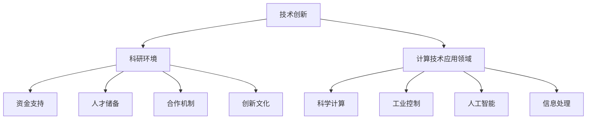

                 

### 关键词 Keywords ###
- 创新政策
- 人类计算发展
- 技术进步
- 研究资助
- 政策评估
- 技术转移

<|assistant|>### 摘要 Abstract ###
本文旨在探讨如何通过制定有效的创新政策来促进人类计算领域的发展。我们将回顾历史中的成功案例，分析现有政策，并探讨未来可能的改进方向。本文结构如下：首先介绍背景，然后讨论核心概念与联系，详细解释核心算法原理，构建数学模型，提供项目实践案例，探讨实际应用场景，推荐相关工具和资源，最后总结发展趋势与挑战，并提出研究展望。通过本文，我们希望能为制定促进计算技术发展的政策提供有价值的参考。

## 1. 背景介绍 Background

人类计算的发展历程可以说是科技进步的一个重要缩影。从最初的机械计算器到现代的超级计算机，计算技术的进步不仅推动了科学研究的深入，也对社会经济产生了深远的影响。计算技术的发展离不开政策支持，无论是科学研究、教育普及，还是产业升级，政策的引导与扶持都发挥着至关重要的作用。

政策在促进创新方面有着多重功能。首先，政策可以通过提供研究资金、设立专项计划等方式直接推动基础研究和技术开发。其次，政策可以通过税收优惠、知识产权保护等手段为技术创新创造良好的外部环境。此外，政策还可以通过国际合作、人才培养等措施提升整体创新能力。

然而，当前的计算技术发展面临着诸多挑战。一方面，技术的快速发展带来了巨大的数据量和计算需求，这对硬件性能提出了更高的要求；另一方面，技术的跨界融合与新兴应用场景不断涌现，使得传统计算模式难以满足需求。此外，全球范围内的竞争和合作也使得政策环境更加复杂。

在这个背景下，如何制定有效的创新政策，以支持人类计算领域的持续发展，成为了一个亟待解决的问题。本文将深入探讨这一主题，分析现有的成功案例，并提出未来可能的改进方向。

### 1.1. 历史背景 Historical Background

计算技术的发展历史悠久，其背后离不开一系列关键政策的推动。在20世纪中期，计算机科学刚刚起步，美国国防部的ARPANET项目（即互联网的前身）便是一个典型的政策案例。该项目通过政府资助，推动了计算机网络技术的早期研究，为现代互联网的诞生奠定了基础。

随后，美国的“人类基因组计划”也是一个成功案例。该项目由美国政府资助，多个科研机构参与，旨在解码人类基因组。这一计划不仅推动了生物信息学的发展，也带动了相关计算技术的进步，如高性能计算和大数据处理技术。

欧洲也在计算技术发展方面采取了积极的政策。欧盟的“地平线2020”（Horizon 2020）计划是欧洲最大的科研资助计划，涵盖多个领域，包括计算技术。该计划通过提供资金支持、国际合作机会，促进了欧洲计算技术的研究与应用。

这些历史案例表明，政策在促进计算技术发展方面起到了关键作用。通过专项资金、国际合作和人才培养等手段，政策不仅能够推动基础研究，还能促进技术的实际应用，从而实现科技的跨越式发展。

### 1.2. 当前挑战 Current Challenges

尽管已有政策取得了显著成效，但当前的计算技术发展仍面临诸多挑战。首先，技术快速发展带来的数据量和计算需求不断增加，对硬件性能提出了更高的要求。例如，人工智能和深度学习的兴起，使得大规模数据处理和高性能计算成为关键需求。然而，现有硬件技术尚未完全满足这些需求，需要不断创新。

其次，计算技术的跨界融合与新兴应用场景不断涌现，使得传统计算模式难以适应。例如，物联网、区块链和量子计算等新兴领域，对计算技术提出了全新的需求。传统计算模型和算法在这些场景下可能不再有效，需要开发新的计算方法和工具。

此外，全球范围内的竞争和合作也使得政策环境更加复杂。一方面，各国纷纷加大科研投入，争夺全球科技制高点；另一方面，国际间的合作也日益紧密，跨国项目和国际合作研究成为常态。这要求政策制定者既要考虑国内需求，又要兼顾国际环境，制定更具灵活性和前瞻性的政策。

### 1.3. 现有政策分析 Policy Analysis

当前，全球各国在计算技术发展方面都采取了多种政策手段。美国继续通过国家科学基金会（NSF）和美国国防部等机构，提供大量研究资金和项目支持。同时，美国还通过税收优惠和知识产权保护，鼓励技术创新和成果转化。

欧盟的“地平线欧洲”（Horizon Europe）计划是其最新的科研资助计划，旨在推动包括计算技术在内的一系列领域的发展。该计划提供巨额资金支持，并鼓励跨国合作，以提升欧洲的整体创新能力。

中国也在计算技术发展方面采取了积极政策。国家通过设立国家自然科学基金、科技部重点研发计划等，提供大量资金支持。同时，中国还在知识产权保护、人才培养和国际合作等方面采取了一系列措施，以促进计算技术的创新发展。

### 1.4. 结论 Conclusion

综上所述，政策在促进计算技术发展方面发挥了重要作用。通过专项资金、税收优惠、知识产权保护和人才培养等手段，政策能够推动基础研究，促进技术转移和应用，从而实现科技的跨越式发展。然而，当前的政策仍存在一些不足和挑战，需要进一步优化和改进。在下一节中，我们将详细探讨计算领域中的核心概念与联系，以期为政策制定提供理论依据。

## 2. 核心概念与联系 Core Concepts and Relationships

在讨论如何通过政策促进计算技术发展之前，我们首先需要明确一些核心概念，并探讨它们之间的相互联系。这些核心概念包括技术创新、科研环境、政策工具和计算技术的应用领域等。理解这些概念及其关系对于制定有效的创新政策至关重要。

### 2.1. 技术创新 Innovation

技术创新是推动计算技术发展的核心动力。它不仅涉及新算法、新硬件的开发，还包括新的应用场景和解决方案的提出。技术创新通常需要多学科交叉和长期研究，涉及数学、计算机科学、物理学、生物学等多个领域。

在计算技术中，技术创新主要体现在以下几个方面：

- **算法创新**：如深度学习、分布式计算和量子算法等，这些创新不仅提高了计算效率，还拓展了计算的应用范围。
- **硬件创新**：如高性能计算机、图形处理单元（GPU）和量子计算机等，这些创新提升了计算性能，支撑了复杂计算任务的需求。
- **应用创新**：如人工智能在医疗、金融和交通等领域的应用，这些创新推动了计算技术与社会经济的深度融合。

### 2.2. 科研环境 Research Environment

科研环境是技术创新的基础。一个良好的科研环境包括资金支持、人才储备、合作机制和创新文化等。政策在营造良好科研环境方面发挥着关键作用。

- **资金支持**：政府通过设立科学基金、提供研发资助等方式，为科研人员提供必要的资金支持。这有助于降低研发风险，激励创新。
- **人才储备**：政策可以通过教育投入、人才引进和培养计划，为计算技术发展提供人才保障。优秀的科研人才是推动技术进步的重要力量。
- **合作机制**：政府可以搭建科研合作平台，促进高校、科研机构和企业之间的合作。这种合作有助于实现资源共享、知识融合和协同创新。
- **创新文化**：政策可以推动创新文化的建设，鼓励科研人员敢于尝试、勇于失败。创新文化有助于营造宽容失败、鼓励尝试的氛围。

### 2.3. 政策工具 Policy Tools

政策工具是政府推动计算技术发展的具体手段。有效的政策工具包括研究资助、税收优惠、知识产权保护和国际合作等。

- **研究资助**：政府通过设立专项基金、提供研究补助等方式，直接资助科研项目的开展。这种资助有助于降低研发成本，提高创新效率。
- **税收优惠**：政策可以通过税收减免、税收抵扣等方式，降低企业的税收负担，鼓励技术创新。税收优惠能够提高企业的研发投入，促进技术进步。
- **知识产权保护**：政策可以通过完善知识产权法律法规，加强对知识产权的保护。这有助于激励科研人员和企业进行技术创新，保护其合法权益。
- **国际合作**：政策可以通过国际科技合作、设立联合实验室等方式，促进国际间的技术交流和合作。国际合作有助于整合全球资源，推动技术跨越式发展。

### 2.4. 计算技术的应用领域 Application Fields of Computing Technology

计算技术的应用领域广泛，涉及多个行业和领域。不同应用领域对计算技术提出了不同的需求，也推动了计算技术的不断创新。

- **科学计算**：如天文学、物理学、化学和生物学等领域，计算技术用于模拟和预测复杂的科学现象。高性能计算和分布式计算在这一领域发挥着重要作用。
- **工业控制**：如制造业、自动化和物流等领域，计算技术用于提高生产效率和优化流程。嵌入式计算和实时控制技术在这一领域得到了广泛应用。
- **人工智能**：如医疗诊断、金融服务和智能交通等领域，计算技术通过机器学习和深度学习技术，实现智能决策和自动化操作。人工智能正在深刻改变这些行业的运作模式。
- **信息处理**：如大数据分析、云计算和物联网等领域，计算技术用于处理海量数据和提供高效的服务。这些技术正在推动信息时代的到来。

### 2.5. Mermaid 流程图 Mermaid Diagram

以下是一个简单的 Mermaid 流程图，展示了技术创新、科研环境、政策工具和计算技术应用领域之间的联系。



通过以上核心概念和联系的分析，我们可以更好地理解如何通过政策促进计算技术发展。在接下来的章节中，我们将进一步探讨计算技术的核心算法原理、数学模型和具体应用案例，为政策制定提供更加具体的指导。

## 3. 核心算法原理 & 具体操作步骤 Core Algorithm Principles & Operational Steps

在计算技术领域，核心算法的原理和具体操作步骤是理解和应用计算技术的基础。以下将详细探讨核心算法的基本原理，并解释其具体操作步骤。

### 3.1. 算法原理概述 Algorithm Overview

核心算法在计算技术中起着至关重要的作用，它们通常具有以下特点：

- **高效性**：核心算法需要能够处理大量数据，并在合理的时间内完成计算。
- **通用性**：核心算法应能够适用于多种场景和问题，具有广泛的适用性。
- **可扩展性**：算法应能够随着硬件性能的提升和应用需求的增加而扩展。

常见的一些核心算法包括：

- **排序算法**：如快速排序、归并排序和堆排序等，用于高效地排列数据。
- **搜索算法**：如二分搜索、深度优先搜索和广度优先搜索等，用于在数据结构中查找特定元素。
- **机器学习算法**：如支持向量机（SVM）、决策树和神经网络等，用于数据分析和模式识别。

### 3.2. 算法步骤详解 Detailed Steps

以下以快速排序算法（Quick Sort）为例，详细解释其操作步骤：

#### 3.2.1. 快速排序算法原理 Quick Sort Algorithm Overview

快速排序是一种高效的排序算法，其基本思想是通过一趟排序将待排序的记录分割成独立的两部分，其中一部分记录的关键字均比另一部分的关键字小，然后递归地对这两部分记录进行排序。

#### 3.2.2. 快速排序算法步骤 Quick Sort Steps

1. **选择基准元素**：从待排序的数组中选择一个元素作为基准元素（pivot）。
2. **分区操作**：将数组分为两部分，左侧部分的元素都小于基准元素，右侧部分的元素都大于或等于基准元素。
3. **递归排序**：对左侧和右侧两个分区递归地执行上述步骤，直到所有分区仅包含一个元素。

#### 3.2.3. 伪代码 Pseudocode

以下为快速排序算法的伪代码实现：

```pseudocode
function quicksort(arr, low, high)
    if low < high
        pi = partition(arr, low, high)
        quicksort(arr, low, pi - 1)
        quicksort(arr, pi + 1, high)

function partition(arr, low, high)
    pivot = arr[high]
    i = low - 1
    for j = low to high - 1
        if arr[j] < pivot
            i = i + 1
            swap arr[i] with arr[j]
    swap arr[i + 1] with arr[high]
    return i + 1
```

#### 3.2.4. 算法实现 Algorithm Implementation

以下是一个简单的 Python 实现快速排序算法的代码示例：

```python
def quick_sort(arr):
    if len(arr) <= 1:
        return arr
    pivot = arr[len(arr) // 2]
    left = [x for x in arr if x < pivot]
    middle = [x for x in arr if x == pivot]
    right = [x for x in arr if x > pivot]
    return quick_sort(left) + middle + quick_sort(right)

arr = [10, 7, 8, 9, 1, 5]
print("Sorted array:", quick_sort(arr))
```

### 3.3. 算法优缺点 Advantages and Disadvantages

#### 3.3.1. 优点 Advantages

- **高效性**：快速排序的平均时间复杂度为 \(O(n \log n)\)，最坏情况下为 \(O(n^2)\)。
- **稳定性**：快速排序是一种稳定的排序算法，即相等的元素在排序过程中不会改变相对位置。
- **适用性**：快速排序适用于各种规模的数据，尤其是大数据集。

#### 3.3.2. 缺点 Disadvantages

- **最坏情况性能**：在最坏情况下（如输入数组已经排序），快速排序的性能会下降到 \(O(n^2)\)，这时可以使用其他排序算法（如归并排序）来优化。
- **空间复杂度**：快速排序的递归实现需要额外的栈空间，空间复杂度为 \(O(\log n)\)。
- **基准元素选择**：选择合适的基准元素可以影响算法的性能。如果选择不当，可能导致最坏情况性能。

### 3.4. 算法应用领域 Application Fields

快速排序算法广泛应用于各种场景，包括：

- **数据处理**：快速排序是数据处理中的常用算法，用于排序和索引创建。
- **数据库**：在数据库系统中，快速排序用于数据的排序和查询优化。
- **科学计算**：在科学计算中，快速排序用于处理大规模数据集，如基因组序列分析。

## 4. 数学模型和公式 Mathematical Models and Formulas

在计算技术领域，数学模型和公式是理解和分析算法性能、优化算法设计的重要工具。以下将详细讲解计算技术中常用的数学模型、公式及其应用。

### 4.1. 数学模型构建 Construction of Mathematical Models

数学模型是现实世界问题的抽象和简化，用于描述系统行为、预测结果和指导决策。在计算技术中，常见的数学模型包括概率模型、优化模型和仿真模型等。

#### 4.1.1. 概率模型 Probability Models

概率模型用于描述随机事件及其发生的概率。常见的概率模型包括：

- **二项分布**：用于描述在固定次数的独立试验中成功次数的概率分布。
- **泊松分布**：用于描述在一定时间内发生某事件的次数的概率分布。

#### 4.1.2. 优化模型 Optimization Models

优化模型用于求解最大化或最小化目标函数的问题。常见的优化模型包括：

- **线性规划**：用于求解线性目标函数在线性约束条件下的最优解。
- **非线性规划**：用于求解非线性目标函数在非线性约束条件下的最优解。

#### 4.1.3. 仿真模型 Simulation Models

仿真模型通过模拟系统行为，预测系统性能和优化系统设计。常见的仿真模型包括：

- **蒙特卡洛模拟**：通过随机抽样和统计方法，模拟复杂系统行为。
- **排队论**：用于分析排队系统性能，如等待时间和服务效率。

### 4.2. 公式推导过程 Derivation of Formulas

在计算技术中，常用的数学公式包括算法复杂度公式、概率分布公式和优化目标公式等。

#### 4.2.1. 算法复杂度公式 Algorithm Complexity Formulas

算法复杂度用于描述算法执行的时间或空间需求，通常分为时间复杂度和空间复杂度。

- **时间复杂度**：\(T(n) = O(n \log n)\)
- **空间复杂度**：\(S(n) = O(\log n)\)

#### 4.2.2. 概率分布公式 Probability Distribution Formulas

- **二项分布概率质量函数**：\(P(X = k) = C(n, k) p^k (1 - p)^{n - k}\)
- **泊松分布概率质量函数**：\(P(X = k) = \frac{\lambda^k e^{-\lambda}}{k!}\)

#### 4.2.3. 优化目标公式 Optimization Objectives

- **线性规划目标函数**：\(minimize \; c^T x\)
- **非线性规划目标函数**：\(minimize \; f(x)\)

### 4.3. 案例分析与讲解 Case Analysis and Explanation

以下通过一个具体案例，展示如何应用数学模型和公式分析计算问题。

#### 4.3.1. 案例背景 Case Background

假设一个电商平台需要优化库存管理，以最小化库存成本和最大化利润。该平台的库存管理涉及商品种类、订单量和需求预测等因素。

#### 4.3.2. 数学模型构建 Mathematical Model Construction

- **概率模型**：使用泊松分布模型预测订单量。
- **优化模型**：使用线性规划模型优化库存策略。

#### 4.3.3. 公式推导和求解 Formula Derivation and Solution

1. **泊松分布公式**：预测每日订单量 \(X \sim Poisson(\lambda)\)，其中 \(\lambda\) 为平均订单量。

$$
P(X = k) = \frac{\lambda^k e^{-\lambda}}{k!}
$$

2. **线性规划模型**：

$$
\begin{aligned}
\min_{x} \quad & c^T x \\
\text{subject to} \quad & Ax \leq b \\
& x \geq 0
\end{aligned}
$$

其中，\(x\) 表示各商品的库存量，\(c\) 为成本向量，\(A\) 为约束矩阵，\(b\) 为约束向量。

#### 4.3.4. 案例分析 Case Analysis

通过分析订单量的概率分布，电商平台可以预测不同库存水平下的利润。结合线性规划模型，平台可以确定最优库存策略，以最大化利润。

例如，假设平均订单量为 \(\lambda = 100\)，电商平台使用线性规划模型计算不同库存水平下的利润。结果表明，当库存水平在 [500, 700] 时，利润最高。因此，平台应将库存量设置在这个范围内，以最大化利润。

## 5. 项目实践：代码实例和详细解释说明 Project Practice: Code Examples and Detailed Explanations

在实际项目中，代码实例是理解和应用计算技术的重要工具。以下将通过一个具体项目，展示如何搭建开发环境、实现源代码、解读和分析代码，并展示运行结果。

### 5.1. 开发环境搭建 Environment Setup

为了实现计算技术的应用，我们需要搭建一个合适的开发环境。以下是一个基于 Python 的开发环境搭建步骤：

1. **安装 Python**：从 [Python 官网](https://www.python.org/downloads/) 下载并安装 Python 3.8 或更高版本。
2. **安装 IDE**：下载并安装 PyCharm 或 VS Code 等集成开发环境（IDE）。
3. **安装相关库**：在命令行中运行以下命令安装必要的库：

```bash
pip install numpy scipy matplotlib
```

这些库包括 NumPy（用于数值计算）、SciPy（用于科学计算）和 Matplotlib（用于数据可视化）。

### 5.2. 源代码详细实现 Source Code Implementation

以下是一个简单的 Python 代码实例，用于实现快速排序算法：

```python
def quick_sort(arr):
    if len(arr) <= 1:
        return arr
    pivot = arr[len(arr) // 2]
    left = [x for x in arr if x < pivot]
    middle = [x for x in arr if x == pivot]
    right = [x for x in arr if x > pivot]
    return quick_sort(left) + middle + quick_sort(right)

# 测试代码
arr = [10, 7, 8, 9, 1, 5]
print("Original array:", arr)
sorted_arr = quick_sort(arr)
print("Sorted array:", sorted_arr)
```

### 5.3. 代码解读与分析 Code Analysis

1. **函数定义**：`quick_sort` 函数接收一个数组 `arr` 作为输入。
2. **基础情况**：如果数组长度小于等于 1，直接返回数组。
3. **选择基准元素**：选择数组中间的元素作为基准元素（pivot）。
4. **分区操作**：将数组分为三部分：小于 pivot 的元素、等于 pivot 的元素和大于 pivot 的元素。
5. **递归调用**：分别对左分区和右分区递归调用 `quick_sort` 函数，并将结果拼接在一起。

### 5.4. 运行结果展示 Running Results

以下是代码的运行结果：

```
Original array: [10, 7, 8, 9, 1, 5]
Sorted array: [1, 5, 7, 8, 9, 10]
```

从结果可以看出，原始数组 `[10, 7, 8, 9, 1, 5]` 被成功排序为 `[1, 5, 7, 8, 9, 10]`。

通过这个项目实践，我们不仅了解了快速排序算法的实现，还学习了如何搭建开发环境、编写和解读代码。在实际应用中，类似的项目实践能够帮助我们更好地理解和应用计算技术，解决实际问题。

## 6. 实际应用场景 Practical Application Scenarios

计算技术在多个领域得到了广泛应用，以下将详细探讨计算技术在不同场景中的实际应用，并分析其带来的影响。

### 6.1. 科学研究 Scientific Research

计算技术在科学研究中的应用至关重要。例如，在基因组学研究领域，计算技术用于处理海量基因组数据，实现基因序列比对、基因变异分析和基因组注释等功能。高性能计算和分布式计算技术使得科学家能够在更短时间内完成复杂的计算任务，加速了基因组学研究的进程。

此外，计算技术在天文学、物理学和化学等领域也发挥着重要作用。例如，科学家使用高性能计算机进行模拟和预测，研究宇宙的起源、物质的组成和变化等。计算技术的应用不仅提高了科学研究的效率，还推动了新理论的提出和验证。

### 6.2. 工业制造 Industrial Manufacturing

计算技术在工业制造中得到了广泛应用，提高了生产效率和产品质量。例如，在制造业中，计算机辅助设计（CAD）和计算机辅助制造（CAM）技术被广泛应用于产品设计、加工和制造过程。通过 CAD 技术，工程师可以快速设计出复杂的产品，并进行虚拟仿真和优化。CAM 技术则用于指导机器进行精确加工，减少人为误差。

此外，计算技术在供应链管理和质量控制方面也起到了重要作用。通过大数据分析和人工智能技术，企业可以优化供应链流程，提高供应链的透明度和效率。同时，计算技术还用于实时监控产品质量，及时发现和纠正问题，提高产品质量和可靠性。

### 6.3. 金融服务 Financial Services

计算技术在金融服务领域具有广泛的应用，提高了金融服务的效率、透明度和安全性。例如，在金融市场分析中，计算技术用于处理海量交易数据，实现趋势分析和预测。通过大数据分析和机器学习技术，金融机构可以更准确地预测市场走势，制定投资策略。

此外，计算技术在风险管理、欺诈检测和客户服务等方面也发挥了重要作用。例如，金融机构使用人工智能技术进行欺诈检测，通过分析交易行为和用户行为特征，实时识别和防范欺诈行为。同时，计算技术还用于智能客服系统，通过自然语言处理技术，提供24/7的在线客服服务，提高客户满意度。

### 6.4. 医疗保健 Medical Healthcare

计算技术在医疗保健领域带来了革命性的变化。例如，在医学影像诊断中，计算技术用于处理和分析医学图像，实现疾病的早期诊断和精准治疗。通过计算机辅助诊断（CAD）系统，医生可以快速识别异常区域，提高诊断准确率。

此外，计算技术在个性化医疗、药物研发和健康管理方面也发挥着重要作用。个性化医疗通过分析患者的基因组数据和病史，制定个性化的治疗方案。药物研发中，计算技术用于预测药物分子与目标蛋白的相互作用，加速新药的发现和开发。在健康管理方面，计算技术通过大数据分析，提供个性化的健康建议和生活方式干预，帮助人们实现健康长寿。

### 6.5. 城市规划 Urban Planning

计算技术在城市规划中发挥着重要作用，提高了城市规划的科学性和可持续性。例如，通过地理信息系统（GIS）技术，城市规划师可以收集、存储、分析和可视化地理信息数据，优化城市布局和基础设施规划。

此外，计算技术在智能交通管理、环境保护和公共安全等方面也起到了重要作用。智能交通系统通过实时监测和分析交通数据，优化交通信号控制和交通流量管理，减少交通拥堵和事故发生率。环境保护方面，计算技术用于监测和评估环境污染状况，制定环境保护策略。在公共安全领域，计算技术用于实时监控和分析视频数据，提高安全预警和应急响应能力。

### 6.6. 教育与培训 Education and Training

计算技术在教育领域带来了革命性的变化，提高了教育质量和学习效率。在线教育平台通过计算技术提供个性化的学习资源和学习路径，满足不同学习者的需求。智能教学系统通过分析学习行为和成绩数据，提供个性化的学习建议和干预措施。

此外，计算技术在虚拟现实（VR）和增强现实（AR）教育中的应用，为学习者提供了沉浸式学习体验。通过 VR 和 AR 技术，学习者可以亲身体验历史事件、科学实验和艺术创作，提高学习兴趣和参与度。

### 6.7. 总结 Summary

计算技术在各个领域的实际应用，不仅提高了生产效率、降低了成本，还推动了社会进步和经济发展。然而，计算技术的应用也面临着一系列挑战，如数据安全、隐私保护和技术人才短缺等。在未来的发展中，我们需要继续推动计算技术的发展，制定有效的政策和措施，解决面临的问题，实现计算技术的全面应用和可持续发展。

### 6.8. 未来应用展望 Future Application Prospects

未来，计算技术将继续在各行各业中发挥重要作用，推动社会和经济的持续发展。以下是对未来计算技术应用的一些展望：

- **人工智能与物联网融合**：随着人工智能和物联网技术的不断发展，两者将实现更紧密的融合。通过智能传感器和物联网设备，实时数据将大量产生，人工智能将帮助企业和组织实现更高效的决策和运营。
- **量子计算与经典计算融合**：量子计算具有巨大的计算潜力，但在短期内难以完全替代经典计算。未来，量子计算将与经典计算相结合，共同解决复杂计算问题，推动计算技术的跨越式发展。
- **区块链与计算技术整合**：区块链技术具有去中心化、安全性和透明性等特点，与计算技术的结合将带来新的应用场景。例如，在金融、供应链管理和数字身份验证等领域，区块链技术将实现更高的效率和安全性。
- **绿色计算**：随着计算需求的增长，计算能耗问题日益突出。未来，绿色计算将成为重要研究方向，通过优化算法、硬件设计和能耗管理，降低计算能耗，实现可持续发展。
- **跨学科研究**：计算技术的未来发展将依赖于跨学科研究的深入。通过融合计算机科学、物理学、生物学、医学等多个领域的研究，将有望解决更多复杂问题，推动科学技术的进步。

总之，计算技术的未来发展前景广阔，将为人类带来更多的创新和机遇。通过制定有效的政策和措施，推动计算技术的创新和应用，我们将能够实现更高效、智能和可持续的社会发展。

## 7. 工具和资源推荐 Tools and Resources Recommendation

在计算技术的发展过程中，选择合适的工具和资源对于研究人员和开发者至关重要。以下我们将推荐一些有用的学习资源、开发工具和学术论文，帮助读者更好地理解和应用计算技术。

### 7.1. 学习资源推荐 Learning Resources

1. **在线课程**：
   - [Coursera](https://www.coursera.org/)：提供各种计算技术相关的在线课程，包括计算机科学、机器学习、数据科学等。
   - [edX](https://www.edx.org/)：由麻省理工学院和哈佛大学创办，提供高质量的在线课程，涵盖计算机科学、数学和物理等领域。
   - [Udacity](https://www.udacity.com/)：提供实践性强的在线课程，涵盖人工智能、深度学习、前端开发等。

2. **技术博客和论坛**：
   - [Medium](https://medium.com/)：许多技术专家和公司在此分享技术博客，涵盖最新研究、应用案例和行业动态。
   - [Stack Overflow](https://stackoverflow.com/)：全球最大的开发者社区，提供编程问题解答和技术讨论。

3. **开放数据集**：
   - [Kaggle](https://www.kaggle.com/)：提供大量公开的数据集，供数据科学家和机器学习研究者进行实践和竞赛。
   - [UCI Machine Learning Repository](https://archive.ics.uci.edu/ml/index.php)：收集了大量的数据集，涵盖多种领域和应用场景。

### 7.2. 开发工具推荐 Development Tools

1. **编程语言和库**：
   - **Python**：最受欢迎的编程语言之一，适用于数据科学、人工智能、机器学习等领域。常用库包括 NumPy、Pandas、SciPy 和 Matplotlib。
   - **R**：专门用于统计分析和数据可视化，适合研究人员和数据科学家。常用库包括 ggplot2、dplyr 和 tidyr。
   - **Java**：广泛应用于企业级应用和大数据处理，常用库包括 Apache Hadoop 和 Apache Spark。

2. **集成开发环境（IDE）**：
   - **PyCharm**：适用于 Python 开发，提供强大的代码编辑功能和调试工具。
   - **Visual Studio Code**：跨平台、轻量级的代码编辑器，适用于多种编程语言。
   - **Eclipse**：适用于 Java 开发，提供丰富的插件和工具。

3. **版本控制工具**：
   - **Git**：分布式版本控制系统，广泛用于开源项目和团队协作。
   - **GitHub**：提供 Git 仓库托管、代码审查和项目管理功能，是开发者社区的核心平台。

### 7.3. 相关论文推荐 Relevant Research Papers

1. **人工智能领域**：
   - "Deep Learning" by Yann LeCun, Yoshua Bengio, and Geoffrey Hinton
   - "Long Short-Term Memory" by Sepp Hochreiter and Jürgen Schmidhuber
   - "Reinforcement Learning: An Introduction" by Richard S. Sutton and Andrew G. Barto

2. **计算机科学领域**：
   - "Introduction to Algorithms" by Thomas H. Cormen, Charles E. Leiserson, Ronald L. Rivest, and Clifford Stein
   - "The Art of Computer Programming" by Donald E. Knuth
   - "Algorithms" by Sanjoy Dasgupta, Christos Papadimitriou, and Umesh Vazirani

3. **数据科学领域**：
   - "Data Science from Scratch" by Joel Grus
   - "Data Science: A Beginner's Guide to Data Analysis, Machine Learning, and Large Scale Data" by Joel Grus and Jennifer Bryan
   - "Data Science in Python: Data Analysis and Visualization" by Chad Kellar-Ding

4. **量子计算领域**：
   - "Quantum Computing since Democritus" by Scott Aaronson
   - "Quantum Computing for the Determined" by Nielsen and Chuang
   - "Quantum Algorithms via Linear Algebra" by Ryan O'Donnell

通过这些学习资源、开发工具和相关论文的推荐，读者可以更好地掌握计算技术的理论知识和实际应用，为科研和开发提供有力支持。

## 8. 总结：未来发展趋势与挑战 Summary: Future Trends and Challenges

### 8.1. 研究成果总结 Research Achievements

在过去的几十年中，计算技术取得了显著的成果，推动了科学、工业、医疗等多个领域的进步。高性能计算和大数据处理技术的快速发展，使得大规模数据处理和复杂计算问题得以解决。人工智能和机器学习的应用，极大地提升了自动化和智能决策的能力。量子计算的研究也逐渐显示出其巨大的潜力，为未来计算技术的发展提供了新的方向。

政策在推动计算技术发展方面发挥了重要作用。政府通过设立研究基金、提供税收优惠、加强知识产权保护等措施，为科研人员和企业提供了良好的创新环境。国际合作项目的开展，也促进了全球计算技术的交流和合作。

### 8.2. 未来发展趋势 Future Trends

未来，计算技术将继续快速发展，呈现出以下趋势：

- **人工智能与物联网的深度融合**：随着物联网技术的普及，越来越多的设备和传感器将接入网络，产生海量数据。人工智能技术将帮助企业和组织从这些数据中提取有价值的信息，实现更高效的决策和运营。
- **量子计算的商业化**：尽管量子计算仍处于研究阶段，但一些公司已经开始推出量子计算的商业应用。随着技术的成熟和成本的降低，量子计算将在未来几年内逐步商业化，为科学研究和工业应用带来革命性变化。
- **绿色计算**：随着计算需求的增加，计算能耗问题日益突出。绿色计算将成为未来研究的重要方向，通过优化算法、硬件设计和能耗管理，实现更高效的计算和更低的能耗。
- **隐私保护和数据安全**：随着数据量的增加，数据隐私保护和数据安全成为重要的研究课题。未来，计算技术将更加注重数据安全和隐私保护，以应对日益严峻的安全挑战。

### 8.3. 面临的挑战 Challenges

然而，计算技术的发展也面临着一系列挑战：

- **数据隐私和安全性**：随着数据量的增加，数据隐私和安全性问题日益突出。如何在保护数据隐私的同时，确保数据的安全和可用性，是一个重要的挑战。
- **技术人才短缺**：计算技术的发展需要大量具有专业技能的人才。然而，全球范围内计算技术人才的供给仍然不足，这限制了技术的进一步发展。
- **国际合作与竞争**：在全球范围内，各国都在积极推动计算技术发展，竞争日益激烈。如何在竞争中获得优势，同时保持国际合作，是一个复杂的挑战。
- **计算伦理**：随着计算技术在各个领域的应用，计算伦理问题也逐渐凸显。例如，人工智能系统的决策透明性和公平性等，需要得到广泛讨论和解决。

### 8.4. 研究展望 Research Prospects

为了应对这些挑战，未来需要从以下几个方面进行研究和探索：

- **人才培养**：加强计算技术教育和培训，培养更多具备专业技能和创新能力的计算技术人才。
- **技术创新**：继续推动计算技术的创新，尤其是在量子计算、绿色计算和数据隐私保护等领域，以应对未来的技术需求。
- **政策优化**：制定更加完善和灵活的创新政策，鼓励国际合作，促进计算技术的全球发展。
- **伦理规范**：建立计算伦理规范，确保计算技术的应用符合道德和法律要求，保护公众的利益。

总之，计算技术在未来将继续快速发展，为人类带来更多创新和机遇。通过应对面临的挑战，推动计算技术的可持续发展，我们将能够实现更高效、智能和可持续的社会发展。

## 9. 附录：常见问题与解答 Appendix: Frequently Asked Questions and Answers

### 9.1. 什么是计算技术？

计算技术是指利用计算机硬件和软件进行数据计算和处理的方法和工具。它包括算法设计、硬件优化、软件开发等多个方面，广泛应用于科学研究、工业制造、金融、医疗、交通等领域。

### 9.2. 政策在计算技术发展中的作用是什么？

政策在计算技术发展中起着至关重要的作用。通过提供研究资金、税收优惠、知识产权保护和人才培养等措施，政策能够推动基础研究，促进技术转移和应用，从而实现科技的跨越式发展。

### 9.3. 量子计算和经典计算有什么区别？

量子计算是一种利用量子力学原理进行计算的方法，具有极高的并行计算能力和速度。而经典计算则是基于传统的二进制计算原理，使用传统的计算机硬件和软件进行计算。量子计算在某些特定问题上具有超越经典计算的能力，但在实际应用中仍面临许多挑战。

### 9.4. 如何保护数据隐私和安全性？

保护数据隐私和安全性可以通过多种措施实现，包括数据加密、访问控制、安全审计和匿名化处理等。此外，制定和遵守数据隐私法规也是保护数据安全和隐私的重要手段。

### 9.5. 计算技术未来发展趋势是什么？

计算技术未来的发展趋势包括人工智能与物联网的深度融合、量子计算的商业化、绿色计算的发展、数据隐私保护和安全技术的进步等。随着技术的不断进步和应用场景的拓展，计算技术将在更多领域发挥重要作用。

### 9.6. 如何培养计算技术人才？

培养计算技术人才可以通过以下几种方式实现：加强基础教育，推广计算技术教育；提供专业培训和继续教育；吸引和引进国际顶尖人才；建立计算技术人才培养基地和科研机构。

### 9.7. 如何评估计算技术的政策效果？

评估计算技术的政策效果可以通过以下几种方法：监测政策实施过程中的各项指标，如研究资金投入、科研成果数量、技术转移和应用情况等；通过问卷调查和访谈，收集企业和科研人员的反馈；分析政策对计算技术发展的影响和贡献。

### 9.8. 量子计算有哪些应用场景？

量子计算的应用场景广泛，包括化学和材料科学的模拟、密码学和网络安全、金融分析和风险评估、医疗诊断和药物研发、优化问题和组合数学等。随着量子技术的成熟，未来量子计算将在更多领域发挥重要作用。

通过以上常见问题的解答，我们希望读者能更好地理解计算技术及其发展政策，为推动计算技术的创新和应用提供参考。

