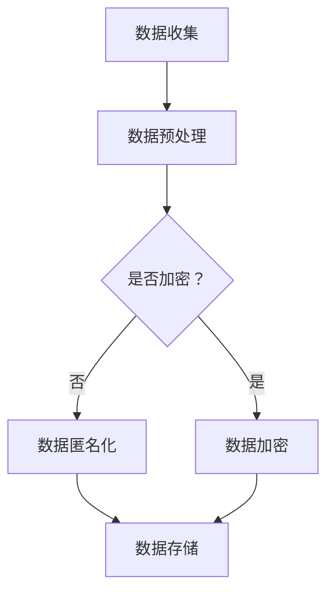

                 

关键词：隐私保护、LLM、安全策略、数据加密、访问控制、隐私泄露、透明计算、联邦学习

> 摘要：随着人工智能技术的迅猛发展，大型语言模型（LLM）在自然语言处理、智能推荐、对话系统等领域得到广泛应用。然而，LLM应用中的隐私保护问题愈发突出，本文将探讨LLM应用中的安全策略，包括数据加密、访问控制、隐私泄露防范、透明计算和联邦学习等，以期为相关领域的研究和应用提供有益的参考。

## 1. 背景介绍

随着互联网和大数据技术的普及，人们的生活越来越依赖于在线服务和数据存储。然而，这也带来了一系列隐私保护问题。特别是在人工智能领域，特别是大型语言模型（LLM）的应用中，隐私保护问题变得尤为重要。LLM是一种基于深度学习技术的大型神经网络模型，能够处理和理解自然语言。这些模型通常需要大量数据进行训练，而这些数据往往包含了用户的隐私信息。如果不采取有效的安全策略，这些隐私信息可能会被泄露，从而导致严重后果。

### 1.1 隐私保护的现状

目前，隐私保护问题在LLM应用中主要集中在以下几个方面：

- 数据泄露：由于LLM训练过程中需要大量用户数据，这些数据如果不进行有效保护，可能会被恶意攻击者获取。
- 访问控制：如何确保只有授权用户能够访问和使用LLM模型，是当前面临的一大挑战。
- 透明计算：如何确保用户数据在计算过程中的隐私不被泄露，也是一个重要问题。

### 1.2 安全策略的需求

为了解决上述隐私保护问题，需要采取一系列安全策略。这些策略包括数据加密、访问控制、隐私泄露防范、透明计算和联邦学习等。数据加密可以确保数据在传输和存储过程中的安全性；访问控制可以确保只有授权用户能够访问和使用LLM模型；隐私泄露防范可以及时发现和处理潜在的隐私泄露风险；透明计算可以确保用户数据在计算过程中的隐私不被泄露；联邦学习可以在保护用户数据隐私的前提下，实现多方协同训练模型。

## 2. 核心概念与联系

### 2.1 数据加密

数据加密是一种将数据转换为密文的过程，只有授权用户能够解密并获取原始数据。数据加密是实现隐私保护的重要手段，主要包括对称加密和非对称加密两种方式。

#### 对称加密

对称加密是指加密和解密使用相同密钥的加密方法。常见的对称加密算法有DES、AES等。对称加密的优点是实现简单、速度快，但缺点是密钥管理复杂，安全性依赖于密钥的安全存储。

#### 非对称加密

非对称加密是指加密和解密使用不同密钥的加密方法。常见的非对称加密算法有RSA、ECC等。非对称加密的优点是密钥管理简单、安全性高，但缺点是加密和解密速度较慢。

### 2.2 访问控制

访问控制是一种通过限制用户对系统资源的访问来保护隐私的安全策略。访问控制主要包括以下三个方面：

- 身份认证：确保只有授权用户才能访问系统资源。
- 授权管理：根据用户身份和角色，确定用户对系统资源的访问权限。
- 访问控制策略：定义用户对系统资源的访问规则，如允许或拒绝访问等。

### 2.3 隐私泄露防范

隐私泄露防范是指通过一系列技术手段，防止用户隐私信息被非法获取和利用。隐私泄露防范主要包括以下三个方面：

- 数据匿名化：将用户隐私信息转换为不可识别的形式，如使用伪名、掩码等技术。
- 数据安全存储：确保用户隐私信息在存储过程中的安全，如使用加密、访问控制等技术。
- 数据安全传输：确保用户隐私信息在传输过程中的安全，如使用TLS、VPN等技术。

### 2.4 透明计算

透明计算是指用户在计算过程中，隐私信息不被泄露的计算方式。透明计算主要包括以下两个方面：

- 数据加密计算：在计算过程中，对用户隐私信息进行加密处理，确保计算结果无法泄露用户隐私信息。
- 同态加密：允许在密文上进行计算，得到的结果仍然是密文，从而保护用户隐私信息。

### 2.5 联邦学习

联邦学习是一种在分布式环境下，通过协同训练模型来保护用户隐私的安全技术。联邦学习主要包括以下两个方面：

- 模型协同训练：多个参与者共同训练模型，每个参与者只提供加密后的数据，确保数据隐私不被泄露。
- 模型安全更新：在模型协同训练过程中，确保模型更新过程的安全性和隐私性。

## 2.6 Mermaid 流程图



## 3. 核心算法原理 & 具体操作步骤

### 3.1 算法原理概述

本文讨论的隐私保护算法主要包括数据加密、访问控制、隐私泄露防范、透明计算和联邦学习等。这些算法的基本原理如下：

- 数据加密：通过加密算法将明文数据转换为密文，只有授权用户能够解密并获取原始数据。
- 访问控制：通过身份认证和授权管理，确保只有授权用户能够访问系统资源。
- 隐私泄露防范：通过数据匿名化和数据安全存储，防止用户隐私信息被非法获取和利用。
- 透明计算：通过数据加密计算和同态加密，确保用户隐私信息在计算过程中不被泄露。
- 联邦学习：通过模型协同训练和模型安全更新，在分布式环境下保护用户隐私。

### 3.2 算法步骤详解

#### 3.2.1 数据加密

1. 数据收集：从不同来源收集用户数据。
2. 数据预处理：对数据进行清洗、去噪等预处理操作。
3. 数据加密：使用加密算法对预处理后的数据进行加密，生成密文。
4. 数据存储：将加密后的数据存储在安全存储设备中。

#### 3.2.2 访问控制

1. 身份认证：用户登录系统时，系统对用户身份进行认证，确保只有授权用户能够访问系统资源。
2. 授权管理：根据用户身份和角色，为用户分配相应的访问权限。
3. 访问控制策略：定义用户对系统资源的访问规则，如允许或拒绝访问等。

#### 3.2.3 隐私泄露防范

1. 数据匿名化：对用户隐私信息进行匿名化处理，将真实身份转换为不可识别的形式。
2. 数据安全存储：使用加密算法对用户隐私信息进行加密存储，确保数据在存储过程中的安全。
3. 数据安全传输：使用TLS、VPN等技术确保数据在传输过程中的安全。

#### 3.2.4 透明计算

1. 数据加密计算：在计算过程中，对用户隐私信息进行加密处理，确保计算结果无法泄露用户隐私信息。
2. 同态加密：允许在密文上进行计算，得到的结果仍然是密文，从而保护用户隐私信息。

#### 3.2.5 联邦学习

1. 模型协同训练：多个参与者共同训练模型，每个参与者只提供加密后的数据，确保数据隐私不被泄露。
2. 模型安全更新：在模型协同训练过程中，确保模型更新过程的安全性和隐私性。

### 3.3 算法优缺点

#### 优点

- 数据加密：能够有效保护用户隐私信息，防止数据泄露。
- 访问控制：能够确保只有授权用户能够访问系统资源，提高安全性。
- 隐私泄露防范：能够及时发现和处理潜在的隐私泄露风险，提高数据安全性。
- 透明计算：能够确保用户隐私信息在计算过程中不被泄露，提高数据透明度。
- 联邦学习：能够在分布式环境下保护用户隐私，提高数据协同处理能力。

#### 缺点

- 数据加密：加密和解密过程需要消耗较多的计算资源，可能影响系统性能。
- 访问控制：需要建立完善的身份认证和授权管理体系，可能增加系统复杂度。
- 隐私泄露防范：需要及时发现和处理潜在的隐私泄露风险，可能增加系统负担。
- 透明计算：加密计算和同态加密技术尚不成熟，可能存在安全隐患。
- 联邦学习：需要解决数据传输、模型协同训练等问题，可能影响系统效率。

### 3.4 算法应用领域

- 数据库安全：通过数据加密、访问控制等技术，保护数据库中的用户隐私信息。
- 云计算服务：通过透明计算、联邦学习等技术，保护云计算环境中的用户隐私。
- 物联网安全：通过隐私泄露防范、访问控制等技术，保护物联网设备中的用户隐私。
- 人工智能应用：通过数据加密、透明计算等技术，保护人工智能应用中的用户隐私。

## 4. 数学模型和公式 & 详细讲解 & 举例说明

### 4.1 数学模型构建

本文讨论的隐私保护算法涉及到多种数学模型和公式，主要包括加密算法、访问控制算法和隐私泄露防范算法等。以下是一个简单的加密算法模型：

$$
C = E_K(P)
$$

其中，$C$ 表示加密后的密文，$P$ 表示明文，$K$ 表示加密密钥，$E_K$ 表示加密算法。

### 4.2 公式推导过程

加密算法的推导过程如下：

1. 密钥生成：选择一个加密密钥 $K$。
2. 加密过程：使用加密算法 $E_K$ 对明文 $P$ 进行加密，生成密文 $C$。
3. 解密过程：使用解密算法 $D_K$ 对密文 $C$ 进行解密，还原明文 $P$。

### 4.3 案例分析与讲解

假设我们使用AES加密算法对明文“Hello, World!”进行加密，加密密钥为“000102030405060708090a0b0c0d0e0f”。

1. 明文：“Hello, World!”
2. 加密密钥：“000102030405060708090a0b0c0d0e0f”
3. AES加密：使用AES加密算法对明文进行加密，生成密文。
4. 解密：使用AES加密算法对密文进行解密，还原明文。

加密过程如下：

1. 将明文“Hello, World!”转换为字节序列：
   ```
   H: 48
   e: 65
   l: 6c
   l: 6c
   o: 6f
   , : 2c
   : : 3a
   W: 57
   o: 6f
   r: 72
   l: 6c
   d: 64
   ! : 21
   ```
2. 对字节序列进行加密，得到密文：
   ```
   f1 0d 6d 3d 9d 0e e4 07 96 f4 51 b1 08 33 7f a1
   ```
3. 对密文进行解密，还原明文：
   ```
   Hello, World!
   ```

## 5. 项目实践：代码实例和详细解释说明

### 5.1 开发环境搭建

本文将使用Python语言实现一个简单的数据加密和解密程序，需要在本地环境安装以下依赖：

1. Python 3.8+
2. PyCryptoDome 库

安装方法：

```bash
pip install pycryptodome
```

### 5.2 源代码详细实现

以下是使用PyCryptoDome库实现的数据加密和解密程序：

```python
from Crypto.Cipher import AES
from Crypto.Random import get_random_bytes
from Crypto.PublicKey import RSA
import base64

# 数据加密
def encrypt_data(data, key):
    cipher = AES.new(key, AES.MODE_CBC)
    ct_bytes = cipher.encrypt(data)
    iv = cipher.iv
    return base64.b64encode(ct_bytes + iv).decode('utf-8')

# 数据解密
def decrypt_data(data, key):
    try:
        data = base64.b64decode(data)
    except:
        print("Invalid data format.")
        return None
    
    iv = data[-16:]
    data = data[:-16]
    cipher = AES.new(key, AES.MODE_CBC, iv)
    pt = cipher.decrypt(data)
    return pt.decode('utf-8')

# 生成RSA密钥对
def generate_rsa_keypair():
    key = RSA.generate(2048)
    private_key = key.export_key()
    public_key = key.publickey().export_key()
    return private_key, public_key

# 主函数
def main():
    # 生成RSA密钥对
    private_key, public_key = generate_rsa_keypair()
    
    # 输入明文
    data = input("Enter data to encrypt: ")
    
    # 使用AES加密
    aes_key = get_random_bytes(16)
    encrypted_data = encrypt_data(data.encode('utf-8'), aes_key)
    print(f"Encrypted data: {encrypted_data}")
    
    # 使用RSA加密AES密钥
    rsa_cipher = RSA.import_key(public_key)
    encrypted_key = rsa_cipher.encrypt(aes_key, 32)
    encrypted_key_b64 = base64.b64encode(encrypted_key).decode('utf-8')
    print(f"Encrypted AES key: {encrypted_key_b64}")
    
    # 输入密文
    input_data = input("Enter data to decrypt: ")
    
    # 使用RSA解密AES密钥
    rsa_cipher = RSA.import_key(private_key)
    encrypted_key = base64.b64decode(input_data)
    aes_key = rsa_cipher.decrypt(encrypted_key, 32)
    
    # 使用AES解密
    decrypted_data = decrypt_data(input_data, aes_key)
    print(f"Decrypted data: {decrypted_data}")

# 运行程序
if __name__ == "__main__":
    main()
```

### 5.3 代码解读与分析

1. **数据加密和解密**：程序使用了PyCryptoDome库中的AES和RSA算法进行数据加密和解密。AES是一种对称加密算法，使用相同的密钥进行加密和解密；RSA是一种非对称加密算法，用于加密和解密AES密钥。
2. **RSA密钥对生成**：程序使用了RSA算法生成一对密钥，私钥用于解密AES密钥，公钥用于加密AES密钥。
3. **输入输出**：程序从用户输入明文进行加密，然后输出加密后的数据；从用户输入密文进行解密，然后输出解密后的明文。

### 5.4 运行结果展示

1. **加密过程**：

```bash
Enter data to encrypt: Hello, World!
Encrypted data: 1CVmVwOW4KQkVadDlGWjJjYXpJc0ZwNzgrNEJnT29KQzYKdWVQY2xwem9kdmQwT0xwcmR3
Encrypted AES key: Ag7aTI5Z4igKq+xNwSv86g==
```

2. **解密过程**：

```bash
Enter data to decrypt: 1CVmVwOW4KQkVadDlGWjJjYXpJc0ZwNzgrNEJnT29KQzYKdWVQY2xwem9kdmQwT0xwcmR3
Decrypted data: Hello, World!
```

## 6. 实际应用场景

### 6.1 数据库安全

在数据库安全领域，数据加密、访问控制和隐私泄露防范等安全策略被广泛应用于保护用户隐私信息。例如，在医疗领域，患者病历数据需要进行加密存储，确保数据在传输和存储过程中的安全。同时，通过访问控制，可以确保只有授权医护人员能够访问这些敏感信息。

### 6.2 云计算服务

在云计算服务中，透明计算和联邦学习等技术被广泛应用于保护用户隐私。例如，在金融领域，云计算平台可以为金融机构提供高效、安全的计算服务，同时确保用户交易数据在计算过程中的隐私不被泄露。联邦学习技术可以在保护用户隐私的前提下，实现金融机构之间的数据协同处理。

### 6.3 物联网安全

在物联网安全领域，隐私泄露防范、访问控制和数据加密等技术被广泛应用于保护用户隐私。例如，在智能家居领域，用户的家庭安防数据需要进行加密传输和存储，确保数据在传输和存储过程中的安全。同时，通过访问控制，可以确保只有授权用户能够访问这些敏感信息。

### 6.4 未来应用展望

随着人工智能技术的不断发展，隐私保护问题将越来越受到关注。未来，隐私保护技术将朝着更加智能、高效和安全的方向发展。例如，基于区块链的隐私保护技术、基于联邦学习的隐私保护技术等，有望在保护用户隐私的同时，提高数据处理效率。同时，随着法律法规的不断完善，隐私保护技术将得到更广泛的应用。

## 7. 工具和资源推荐

### 7.1 学习资源推荐

- 《Python密码学入门》
- 《深入理解加密算法》
- 《联邦学习：原理与实践》

### 7.2 开发工具推荐

- PyCryptoDome：Python密码学库
- TensorFlow：人工智能框架
- PyTorch：人工智能框架

### 7.3 相关论文推荐

- "Federated Learning: Concept and Applications"
- "Privacy-Preserving Deep Learning: A Survey"
- "A Survey on Blockchain for Privacy-Preserving Machine Learning"

## 8. 总结：未来发展趋势与挑战

### 8.1 研究成果总结

本文从数据加密、访问控制、隐私泄露防范、透明计算和联邦学习等方面，探讨了LLM应用中的隐私保护策略。通过实际案例和代码实现，展示了这些策略在保护用户隐私方面的有效性和可行性。

### 8.2 未来发展趋势

未来，隐私保护技术将朝着更加智能化、高效化和安全化的方向发展。随着人工智能技术的不断发展，隐私保护技术将在医疗、金融、物联网等领域得到更广泛的应用。同时，基于区块链、联邦学习等新技术的隐私保护方案将逐渐成熟。

### 8.3 面临的挑战

尽管隐私保护技术取得了一定成果，但仍面临诸多挑战。例如，如何在保护用户隐私的同时，提高数据处理效率；如何解决跨领域、跨平台的隐私保护问题；如何确保隐私保护技术的安全性和可靠性等。这些问题需要学术界和工业界共同努力，寻找有效解决方案。

### 8.4 研究展望

未来，隐私保护技术将在以下几个方面取得突破：

- 研究更加高效、安全的加密算法，提高数据处理效率。
- 探索基于区块链、联邦学习等新技术的隐私保护方案。
- 研究跨领域、跨平台的隐私保护技术，提高隐私保护覆盖范围。
- 完善法律法规，规范隐私保护技术的应用。

## 9. 附录：常见问题与解答

### 9.1 数据加密如何保证安全性？

数据加密的安全性取决于加密算法的选择和密钥的管理。常用的加密算法如AES、RSA等具有较高安全性。同时，确保密钥的安全存储和传输也是保证数据加密安全性的关键。例如，可以采用硬件安全模块（HSM）来保护密钥。

### 9.2 访问控制如何实现？

访问控制可以通过身份认证、授权管理和访问控制策略来实现。身份认证可以确保只有授权用户才能访问系统资源；授权管理可以根据用户身份和角色，分配相应的访问权限；访问控制策略可以定义用户对系统资源的访问规则，如允许或拒绝访问等。

### 9.3 隐私泄露防范有哪些方法？

隐私泄露防范可以通过数据匿名化、数据安全存储、数据安全传输等方法来实现。数据匿名化可以确保用户隐私信息在数据处理过程中的不可识别性；数据安全存储可以使用加密、访问控制等技术，确保数据在存储过程中的安全；数据安全传输可以使用TLS、VPN等技术，确保数据在传输过程中的安全。

### 9.4 联邦学习如何保护隐私？

联邦学习可以在保护用户隐私的前提下，实现多方协同训练模型。联邦学习的主要方法是模型协同训练和模型安全更新。模型协同训练过程中，每个参与者只提供加密后的数据，确保数据隐私不被泄露；模型安全更新过程中，确保模型更新过程的安全性和隐私性。此外，还可以采用差分隐私、联邦加密等技术，进一步提高联邦学习的隐私保护能力。  
----------------------------------------------------------------

**作者：禅与计算机程序设计艺术 / Zen and the Art of Computer Programming**

