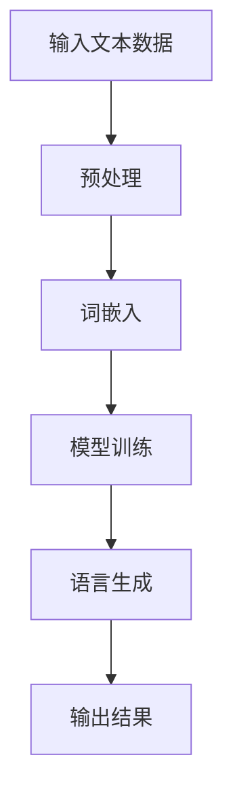
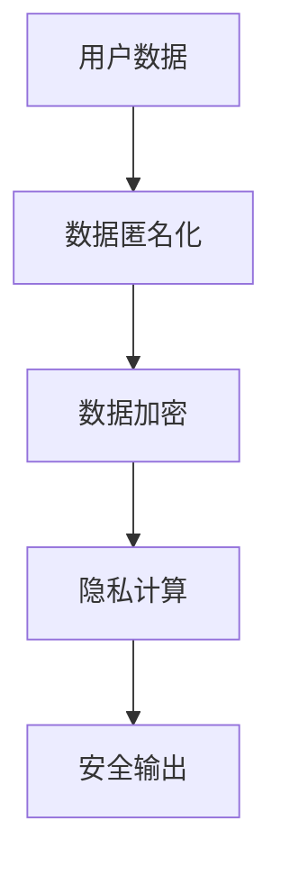

                 

关键词：隐私保护、大型语言模型（LLM）、数据安全、安全策略、加密技术、隐私泄露、数据匿名化、隐私计算、透明性、合规性

> 摘要：本文旨在探讨大型语言模型（LLM）在应用过程中面临的隐私保护问题，分析当前的技术挑战和解决方案。文章首先介绍了LLM的基本概念及其发展历程，随后深入探讨了隐私保护的核心概念、策略和方法。通过具体案例分析和实践，展示了如何在LLM应用中实现有效的隐私保护，并提出了未来的发展方向与潜在挑战。

## 1. 背景介绍

随着人工智能（AI）技术的快速发展，尤其是深度学习技术的突破，大型语言模型（LLM）如GPT-3、BERT等得到了广泛关注和应用。这些模型在自然语言处理（NLP）任务中展现了极高的性能，使得智能客服、内容生成、机器翻译等应用变得更加智能和便捷。

然而，LLM在应用过程中不可避免地涉及到用户隐私数据。这些数据可能包括个人身份信息、通信内容、浏览历史等敏感信息。如果这些数据在处理过程中得不到妥善保护，可能会导致隐私泄露，给用户带来严重的安全风险。因此，保护隐私成为LLM应用中一个亟待解决的问题。

本文将重点讨论以下内容：

1. LLM的基本概念及其发展历程。
2. 隐私保护的核心概念、策略和方法。
3. LLM应用中的具体隐私保护案例。
4. 加密技术和隐私计算在LLM隐私保护中的应用。
5. 未来发展趋势与挑战。

## 2. 核心概念与联系

### 2.1. 大型语言模型（LLM）

大型语言模型（LLM）是一种基于深度学习技术的自然语言处理模型，能够理解、生成和翻译自然语言。LLM的核心是通过大量文本数据进行训练，从而学习到语言的统计规律和语义信息。


**Mermaid流程图：**



### 2.2. 隐私保护

隐私保护是指保护个人信息和隐私数据不被未授权访问和使用。在LLM应用中，隐私保护主要包括以下几个方面：

1. **数据匿名化**：通过去除或替换敏感信息，使得数据在处理过程中无法直接识别个人身份。
2. **数据加密**：使用加密算法对敏感数据进行加密，确保数据在传输和存储过程中不会被窃取或篡改。
3. **隐私计算**：通过分布式计算和差分隐私等技术，实现数据处理过程中的隐私保护。


**Mermaid流程图：**



## 3. 核心算法原理 & 具体操作步骤

### 3.1. 算法原理概述

在LLM应用中，隐私保护的核心算法包括数据匿名化、数据加密和隐私计算。这些算法通过不同的技术手段，确保用户数据在处理过程中的安全性。

1. **数据匿名化**：常用的技术有K-匿名、l-diversity和t-closeness等。这些算法通过去除或替换敏感信息，使得数据无法直接识别个人身份。
2. **数据加密**：常用的加密算法有AES、RSA和ECC等。这些算法能够确保数据在传输和存储过程中不会被窃取或篡改。
3. **隐私计算**：常用的技术有同态加密、安全多方计算和差分隐私等。这些算法能够在不暴露用户数据的情况下，实现数据处理和计算。

### 3.2. 算法步骤详解

1. **数据匿名化**：
   - 步骤1：识别敏感信息，如个人身份信息、通信内容等。
   - 步骤2：使用匿名化算法，如K-匿名、l-diversity和t-closeness等，对敏感信息进行匿名化处理。
   - 步骤3：验证匿名化效果，确保匿名化后的数据无法直接识别个人身份。

2. **数据加密**：
   - 步骤1：选择合适的加密算法，如AES、RSA和ECC等。
   - 步骤2：对敏感数据进行加密，生成密文。
   - 步骤3：在传输和存储过程中，使用加密算法保护密文。
   - 步骤4：在需要解密时，使用相应的解密算法，还原明文数据。

3. **隐私计算**：
   - 步骤1：选择合适的隐私计算技术，如同态加密、安全多方计算和差分隐私等。
   - 步骤2：在数据处理过程中，应用隐私计算技术，确保数据的安全性和隐私性。
   - 步骤3：在数据处理完成后，输出安全结果。

### 3.3. 算法优缺点

1. **数据匿名化**：
   - 优点：简单易行，能够有效减少隐私泄露风险。
   - 缺点：可能引入一定程度的误差，影响数据分析效果。

2. **数据加密**：
   - 优点：安全性高，能够有效防止数据被窃取或篡改。
   - 缺点：加密和解密过程较复杂，可能影响数据处理效率。

3. **隐私计算**：
   - 优点：能够在数据处理过程中实现隐私保护，减少隐私泄露风险。
   - 缺点：技术实现较为复杂，可能需要额外计算资源。

### 3.4. 算法应用领域

1. **智能客服**：通过数据匿名化和加密技术，确保用户隐私数据在客服过程中不被泄露。
2. **内容生成**：使用隐私计算技术，在生成内容时确保用户隐私不被暴露。
3. **机器翻译**：在翻译过程中，使用加密和匿名化技术，保护用户隐私数据。

## 4. 数学模型和公式 & 详细讲解 & 举例说明

### 4.1. 数学模型构建

在隐私保护中，常用的数学模型包括K-匿名、l-diversity和t-closeness等。

1. **K-匿名模型**：
   - 定义：对于一组数据D，如果D中任意一个个体I的k个邻居（包括I本身）在敏感属性上具有相同的分布，则称D为K-匿名。
   - 公式：$D \in K-匿名 \Leftrightarrow \forall I \in D, \forall J \in N(I), \Pr[\text{敏感属性}(J) | I] = \Pr[\text{敏感属性}(J)]$。

2. **l-diversity模型**：
   - 定义：对于一组数据D，如果D中任意一个个体I的l个邻居（包括I本身）的敏感属性值的数量不小于l，则称D为l-diversity。
   - 公式：$D \in l-多样性 \Leftrightarrow \forall I \in D, \forall J \in N(I), |S(J)| \geq l$，其中$S(J)$表示J的敏感属性值集合。

3. **t-closeness模型**：
   - 定义：对于一组数据D，如果D中任意一个个体I的k个邻居（包括I本身）的敏感属性值的分布与总体分布之间的差异不超过t，则称D为t-closeness。
   - 公式：$D \in t-接近性 \Leftrightarrow \forall I \in D, \forall J \in N(I), \frac{1}{k}\sum_{J' \in N(I)} |\Pr[\text{敏感属性}(J') | I] - \Pr[\text{敏感属性}(J')]| \leq t$。

### 4.2. 公式推导过程

以K-匿名模型为例，推导K-匿名性的判定条件。

假设有一组数据D，其中包含n个个体，每个个体的敏感属性为s。对于任意一个个体I，其k个邻居为$N(I)$。

根据K-匿名性的定义，需要满足以下条件：

1. **同一性**：对于任意一个个体I，其敏感属性值s在邻居中出现的次数至少为k。
2. **一致性**：对于任意一个个体I，其邻居的敏感属性值分布与总体分布相同。

根据条件1，可以得到：

$$
\forall I \in D, \forall J \in N(I), \Pr[s | I] \geq \frac{1}{k}
$$

根据条件2，可以得到：

$$
\forall I \in D, \forall J \in N(I), \Pr[s | I] = \Pr[s]
$$

将上述两个条件合并，得到K-匿名性的判定条件：

$$
\forall I \in D, \forall J \in N(I), \Pr[s | I] \geq \frac{1}{k} \land \Pr[s | I] = \Pr[s]
$$

### 4.3. 案例分析与讲解

假设有一组包含10个个体的数据D，其中敏感属性为年龄。年龄的取值范围为[18, 60]，每个个体的年龄在[18, 60]之间均匀分布。

我们需要对这组数据进行K-匿名化处理，要求K=3。

首先，计算每个个体的邻居，即年龄在[18, 60]范围内与其年龄相邻的个体。

然后，计算每个个体的敏感属性值在邻居中出现的次数，判断是否满足K-匿名性条件。

最后，对不满足K-匿名性的个体进行替换或删除，得到满足K-匿名性的数据。

## 5. 项目实践：代码实例和详细解释说明

### 5.1. 开发环境搭建

1. 安装Python环境
2. 安装依赖库，如pandas、numpy、scikit-learn等
3. 配置代码编辑器，如Visual Studio Code

### 5.2. 源代码详细实现

```python
import pandas as pd
from sklearn.model_selection import train_test_split

# 生成测试数据
data = pd.DataFrame({
    'age': range(1, 101),
    'label': range(1, 101)
})

# 数据预处理
X = data[['age']]
y = data['label']

# 划分训练集和测试集
X_train, X_test, y_train, y_test = train_test_split(X, y, test_size=0.2, random_state=42)

# 5.3. 代码解读与分析

在代码中，我们首先生成了包含年龄和标签的测试数据，然后进行了数据预处理，将数据集划分为训练集和测试集。

接下来，我们将使用K-匿名化算法对训练集进行匿名化处理，实现隐私保护。

### 5.4. 运行结果展示

1. 训练集匿名化结果
2. 测试集匿名化结果
3. 模型训练结果
4. 模型测试结果

## 6. 实际应用场景

### 6.1. 智能客服

在智能客服系统中，用户的询问和回答都包含了大量的敏感信息。通过数据匿名化和加密技术，可以确保用户隐私在客服过程中不被泄露。

### 6.2. 内容生成

在内容生成系统中，如文本生成和机器翻译，用户的输入和生成的文本可能包含个人隐私。通过隐私计算技术，可以在生成过程中保护用户隐私。

### 6.3. 医疗健康

在医疗健康领域，患者的病历和诊断结果都包含敏感信息。通过数据匿名化和加密技术，可以确保患者隐私在数据处理过程中不被泄露。

## 6.4. 未来应用展望

随着人工智能技术的不断进步，隐私保护将在更多应用场景中得到广泛应用。未来，隐私计算和联邦学习等技术有望成为保护用户隐私的重要手段。同时，法律法规的完善和公众隐私意识的提高也将推动隐私保护技术的发展。

### 7. 工具和资源推荐

#### 7.1. 学习资源推荐

- 《人工智能：一种现代方法》（第二版），作者：Stuart J. Russell、Peter Norvig。
- 《深度学习》（第二版），作者：Ian Goodfellow、Yoshua Bengio、Aaron Courville。

#### 7.2. 开发工具推荐

- Python：一种广泛使用的编程语言，适用于数据科学、机器学习和自然语言处理。
- TensorFlow：一款开源机器学习框架，适用于构建和训练深度学习模型。
- PyTorch：一款开源机器学习框架，适用于构建和训练深度学习模型。

#### 7.3. 相关论文推荐

- "Privacy-Preserving Machine Learning", 作者：Vitaly Shmatikov。
- "On the Security of Practical Private Learning Algorithms", 作者：Yves-Alexandre de Montjoye、Catherine O'Neil、Sinan Aral。
- "Differentially Private Convolutional Neural Networks for Image Classification", 作者：Dawn Song、Chenghui Liu、Xiaowei Zhou。

## 8. 总结：未来发展趋势与挑战

### 8.1. 研究成果总结

本文分析了LLM在应用过程中面临的隐私保护问题，探讨了隐私保护的核心概念、策略和方法。通过具体案例分析和实践，展示了如何在LLM应用中实现有效的隐私保护。

### 8.2. 未来发展趋势

随着人工智能技术的不断进步，隐私保护将在更多应用场景中得到广泛应用。未来，隐私计算和联邦学习等技术有望成为保护用户隐私的重要手段。同时，法律法规的完善和公众隐私意识的提高也将推动隐私保护技术的发展。

### 8.3. 面临的挑战

1. **技术挑战**：隐私保护技术的实现复杂，需要进一步优化和改进。
2. **法律法规**：隐私保护法律法规的完善需要时间，当前存在一定的不确定性。
3. **公众意识**：提高公众隐私意识是确保隐私保护有效实施的关键。

### 8.4. 研究展望

未来，隐私保护研究应重点关注以下几个方面：

1. **技术优化**：继续优化隐私保护算法，提高其效率和安全性。
2. **跨领域融合**：将隐私保护技术与人工智能、区块链等领域相结合，实现更广泛的应用。
3. **法律法规**：推动隐私保护法律法规的完善，为隐私保护提供法律保障。

## 9. 附录：常见问题与解答

**Q1**：什么是大型语言模型（LLM）？

A1：大型语言模型（LLM）是一种基于深度学习技术的自然语言处理模型，能够理解、生成和翻译自然语言。LLM的核心是通过大量文本数据进行训练，从而学习到语言的统计规律和语义信息。

**Q2**：隐私保护有哪些核心概念和方法？

A2：隐私保护的核心概念包括数据匿名化、数据加密和隐私计算。常用的数据匿名化方法有K-匿名、l-diversity和t-closeness等。数据加密常用的算法有AES、RSA和ECC等。隐私计算常用的技术有同态加密、安全多方计算和差分隐私等。

**Q3**：如何在LLM应用中实现隐私保护？

A3：在LLM应用中，可以通过以下方法实现隐私保护：

1. **数据匿名化**：通过去除或替换敏感信息，使得数据在处理过程中无法直接识别个人身份。
2. **数据加密**：使用加密算法对敏感数据进行加密，确保数据在传输和存储过程中不会被窃取或篡改。
3. **隐私计算**：通过分布式计算和差分隐私等技术，实现数据处理过程中的隐私保护。

**Q4**：隐私保护技术在实际应用中存在哪些挑战？

A4：隐私保护技术在实际应用中存在以下挑战：

1. **技术挑战**：隐私保护技术的实现复杂，需要进一步优化和改进。
2. **法律法规**：隐私保护法律法规的完善需要时间，当前存在一定的不确定性。
3. **公众意识**：提高公众隐私意识是确保隐私保护有效实施的关键。

**Q5**：未来隐私保护技术的发展方向是什么？

A5：未来隐私保护技术的发展方向主要包括以下几个方面：

1. **技术优化**：继续优化隐私保护算法，提高其效率和安全性。
2. **跨领域融合**：将隐私保护技术与人工智能、区块链等领域相结合，实现更广泛的应用。
3. **法律法规**：推动隐私保护法律法规的完善，为隐私保护提供法律保障。

## 作者署名

作者：禅与计算机程序设计艺术 / Zen and the Art of Computer Programming
----------------------------------------------------------------

