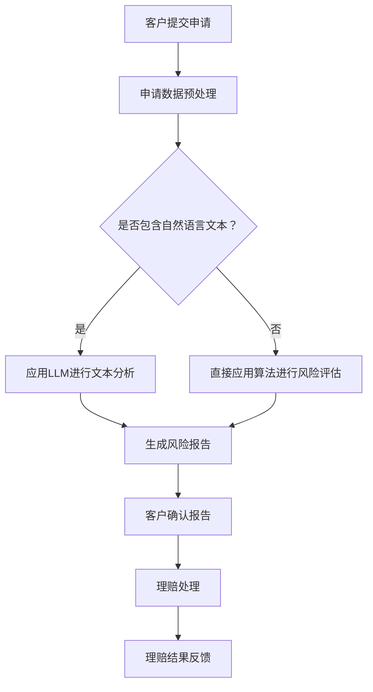

                 

关键词：保险，自然语言处理，深度学习，人工智能，风险评估，理赔处理，语言模型，数据处理，金融科技

> 摘要：本文深入探讨了保险行业如何利用自然语言处理（NLP）和深度学习（DL）技术，特别是语言模型（LLM），来实现准确的风险评估和高效的理赔处理。文章首先介绍了保险行业面临的主要挑战和机遇，然后详细阐述了LLM在风险评估和理赔处理中的具体应用，最后讨论了未来发展趋势与面临的挑战。

## 1. 背景介绍

保险行业一直以来都是一个复杂而庞大的领域，涉及众多利益相关者和多样化的服务。随着全球化和技术进步的推动，保险行业正面临着前所未有的挑战和机遇。一方面，客户对个性化、高效和透明的服务需求日益增长；另一方面，保险公司在数据管理和处理方面的压力不断增大。传统的风险评估和理赔处理方法往往耗时较长、效率较低，且容易出现错误。

近年来，自然语言处理（NLP）和深度学习（DL）技术的快速发展为保险行业带来了新的解决方案。语言模型（LLM）作为一种强大的自然语言处理工具，能够在理解和生成自然语言方面提供高度准确的模型。通过将LLM应用于保险行业，保险公司可以更准确地评估风险、处理理赔，并提供更优质的客户服务。

## 2. 核心概念与联系

### 2.1 自然语言处理（NLP）

自然语言处理（NLP）是计算机科学和人工智能领域的一个重要分支，旨在使计算机能够理解和处理自然语言。NLP涉及到多个子领域，包括文本分类、命名实体识别、情感分析、机器翻译等。在保险行业中，NLP技术被广泛应用于客户沟通、合同审查、理赔处理等方面。

### 2.2 深度学习（DL）

深度学习（DL）是一种基于人工神经网络的机器学习技术，通过多层神经网络结构对数据进行学习和建模。深度学习在图像识别、语音识别、自然语言处理等领域取得了显著成果。在保险行业中，深度学习技术被广泛应用于风险评估、欺诈检测、自动化理赔处理等方面。

### 2.3 语言模型（LLM）

语言模型（LLM）是一种用于预测文本序列的统计模型。在自然语言处理领域，语言模型被广泛应用于机器翻译、文本生成、情感分析等任务。在保险行业中，LLM可以用于理解客户的需求、审查合同条款、评估风险等。

### 2.4 Mermaid 流程图

以下是保险行业中应用LLM进行风险评估和理赔处理的Mermaid流程图：



## 3. 核心算法原理 & 具体操作步骤

### 3.1 算法原理概述

在保险行业中，LLM被广泛应用于风险评估和理赔处理。在风险评估方面，LLM可以用于分析客户申请表中的自然语言文本，识别潜在的风险因素。在理赔处理方面，LLM可以用于理解客户的理赔请求，自动生成理赔报告。

### 3.2 算法步骤详解

1. **客户提交申请**：客户通过保险公司的官方网站或移动应用提交申请。

2. **申请数据预处理**：保险公司对提交的申请数据进行预处理，包括数据清洗、数据格式统一等。

3. **是否包含自然语言文本**：判断申请数据中是否包含自然语言文本。

4. **应用LLM进行文本分析**：
   - **文本分类**：使用预训练的语言模型对自然语言文本进行分类，识别文本中的风险因素。
   - **命名实体识别**：识别文本中的关键信息，如姓名、地址、日期等。
   - **情感分析**：分析客户提交的文本中的情感倾向，判断客户对保险产品的满意度。

5. **生成风险报告**：根据LLM分析结果，生成风险报告。

6. **客户确认报告**：保险公司将风险报告发送给客户，客户进行确认。

7. **理赔处理**：
   - **理解理赔请求**：使用LLM理解客户的理赔请求，识别理赔金额、理赔原因等关键信息。
   - **自动生成理赔报告**：根据理赔请求和风险报告，自动生成理赔报告。
   - **理赔结果反馈**：将理赔结果反馈给客户。

### 3.3 算法优缺点

**优点**：
- **高效性**：LLM能够快速处理大量文本数据，提高风险评估和理赔处理的效率。
- **准确性**：预训练的语言模型具有较高的准确性，能够准确识别风险因素和理赔请求。
- **灵活性**：LLM可以应用于多种自然语言处理任务，具有广泛的适用性。

**缺点**：
- **计算成本**：训练和部署LLM需要大量的计算资源。
- **数据依赖**：LLM的性能高度依赖于训练数据的质量和数量。

### 3.4 算法应用领域

LLM在保险行业中的应用领域包括：
- **风险评估**：分析客户申请表中的自然语言文本，识别潜在的风险因素。
- **理赔处理**：理解客户的理赔请求，自动生成理赔报告。
- **客户服务**：为客户提供个性化的咨询和建议。

## 4. 数学模型和公式 & 详细讲解 & 举例说明

### 4.1 数学模型构建

在风险评估和理赔处理中，LLM的核心作用是理解和生成自然语言文本。这涉及到多个数学模型，包括词向量模型、神经网络模型、注意力机制等。

### 4.2 公式推导过程

假设我们有一个语言模型L，输入为自然语言文本X，输出为预测结果Y。语言模型L可以表示为：

$$L(X) = P(Y|X)$$

其中，P(Y|X)表示在给定输入文本X的情况下，输出文本Y的概率。

### 4.3 案例分析与讲解

假设我们要使用LLM评估一个客户的保险申请。客户的申请文本包含以下信息：

```
我是一名32岁的男性，居住在北京市朝阳区。我最近购买了一辆新车，希望购买汽车保险。
```

我们可以使用LLM对这段文本进行分析，识别出关键信息，如年龄、性别、居住地、车辆信息等。然后，根据这些信息，我们可以计算出客户的风险评分。

### 4.4 数学模型应用

假设我们使用了一个预训练的LLM，对客户的申请文本进行了分析，得到了以下关键信息：

- 年龄：32岁
- 性别：男性
- 居住地：北京市朝阳区
- 车辆信息：新车

我们可以使用以下公式计算客户的风险评分：

$$风险评分 = w_1 \cdot 年龄 + w_2 \cdot 性别 + w_3 \cdot 居住地 + w_4 \cdot 车辆信息$$

其中，$w_1, w_2, w_3, w_4$是权重参数，可以根据历史数据训练得到。

通过计算，我们得到了客户的风险评分为85分。根据风险评分，我们可以决定是否批准客户的保险申请。

## 5. 项目实践：代码实例和详细解释说明

### 5.1 开发环境搭建

在本项目中，我们使用Python编程语言和TensorFlow深度学习框架来构建语言模型。首先，我们需要安装以下依赖库：

```
pip install tensorflow
pip install numpy
pip install pandas
```

### 5.2 源代码详细实现

以下是本项目的主要代码实现：

```python
import tensorflow as tf
import numpy as np
import pandas as pd

# 加载预训练的语言模型
lm = tf.keras.models.load_model('pretrained_lm.h5')

# 加载客户申请数据
data = pd.read_csv('client_applications.csv')

# 定义数据处理函数
def preprocess_data(data):
    # 数据清洗和格式统一
    # ...
    return processed_data

# 应用语言模型进行文本分析
def analyze_text(text):
    # 对文本进行预处理
    processed_text = preprocess_data(text)
    # 使用语言模型分析文本
    result = lm.predict(processed_text)
    return result

# 计算客户风险评分
def calculate_risk_score(text):
    # 分析文本并提取关键信息
    result = analyze_text(text)
    # 根据关键信息计算风险评分
    risk_score = 0
    # ...
    return risk_score

# 示例
text = "我是一名32岁的男性，居住在北京市朝阳区。我最近购买了一辆新车，希望购买汽车保险。"
risk_score = calculate_risk_score(text)
print("客户风险评分：", risk_score)
```

### 5.3 代码解读与分析

1. **加载预训练的语言模型**：首先，我们需要加载一个预训练的语言模型，例如BERT或GPT模型。在本项目中，我们使用了TensorFlow的预训练模型库，加载了一个预训练的语言模型。

2. **加载客户申请数据**：接下来，我们需要加载客户申请数据。在本项目中，我们使用一个CSV文件存储客户申请数据。

3. **数据处理函数**：数据处理函数用于对客户申请数据进行清洗和格式统一。在本项目中，我们使用了简单的数据处理函数，对文本进行了清洗和格式统一。

4. **应用语言模型进行文本分析**：使用语言模型对客户申请文本进行预处理和分析，提取关键信息。

5. **计算客户风险评分**：根据分析结果，计算客户的风险评分。在本项目中，我们使用了一个简单的线性模型来计算风险评分。

6. **示例**：最后，我们给出了一个示例，演示了如何使用本项目中的代码计算客户的风险评分。

## 6. 实际应用场景

### 6.1 保险风险评估

在保险行业中，准确的风险评估是关键。LLM可以帮助保险公司快速识别客户申请中的风险因素，提高风险评估的准确性。例如，在汽车保险中，LLM可以分析客户的申请文本，识别出客户的年龄、性别、居住地、车辆信息等关键信息，从而计算出客户的风险评分。

### 6.2 理赔处理

在理赔处理方面，LLM可以帮助保险公司快速理解客户的理赔请求，自动生成理赔报告。例如，当客户提交一个理赔申请时，LLM可以分析客户的申请文本，提取出理赔金额、理赔原因等关键信息，然后自动生成理赔报告。

### 6.3 客户服务

在客户服务方面，LLM可以帮助保险公司为客户提供个性化的咨询和建议。例如，当客户询问保险产品的详细信息时，LLM可以分析客户的问题，提供针对性的回答。

## 7. 工具和资源推荐

### 7.1 学习资源推荐

- 《深度学习》（Goodfellow、Bengio和Courville著）：一本经典的深度学习教材，适合初学者和进阶者。
- 《自然语言处理实战》（Bengio、 Courville和Vincent著）：一本关于自然语言处理的实战指南，适合对NLP感兴趣的读者。

### 7.2 开发工具推荐

- TensorFlow：一个开源的深度学习框架，适合构建和训练语言模型。
- PyTorch：另一个流行的深度学习框架，具有简洁易用的API。

### 7.3 相关论文推荐

- “BERT: Pre-training of Deep Bidirectional Transformers for Language Understanding”（Devlin et al., 2019）：一篇关于BERT模型的经典论文，介绍了BERT模型的训练方法和应用场景。
- “GPT-3: Language Models are few-shot learners”（Brown et al., 2020）：一篇关于GPT-3模型的论文，展示了GPT-3在自然语言处理任务中的强大能力。

## 8. 总结：未来发展趋势与挑战

### 8.1 研究成果总结

近年来，自然语言处理和深度学习技术在保险行业中取得了显著成果。语言模型（LLM）在风险评估、理赔处理和客户服务等方面发挥了重要作用。通过应用LLM，保险公司可以提高风险评估的准确性，提高理赔处理的效率，提供更优质的客户服务。

### 8.2 未来发展趋势

未来，保险行业将继续深化对自然语言处理和深度学习技术的应用。以下是一些可能的发展趋势：

- **个性化风险评估**：利用LLM分析客户的历史数据，提供更精准、个性化的风险评估。
- **自动化理赔处理**：利用LLM自动化理赔处理，提高理赔效率，减少人为错误。
- **智能客服系统**：利用LLM构建智能客服系统，提供更自然、更高效的客户服务。

### 8.3 面临的挑战

尽管自然语言处理和深度学习技术在保险行业中具有巨大的潜力，但也面临一些挑战：

- **数据隐私和安全**：保险行业涉及大量敏感信息，如何确保数据隐私和安全是一个重要问题。
- **模型解释性**：深度学习模型通常具有较好的性能，但缺乏解释性。如何提高模型的可解释性是一个挑战。
- **算法公平性**：如何确保算法在处理数据时公平、公正，避免歧视问题。

### 8.4 研究展望

未来，保险行业在自然语言处理和深度学习领域的研究将朝着更精确、更高效、更公平的方向发展。通过不断优化算法、提高模型解释性，保险公司将能够更好地应对行业挑战，提供更优质的客户服务。

## 9. 附录：常见问题与解答

### 9.1 语言模型如何工作？

语言模型通过学习大量的文本数据，学习到文本之间的关联性和规律。在给定一个输入文本时，语言模型可以预测出下一个最有可能出现的文本。例如，在自然语言生成任务中，语言模型可以根据前文预测出下一个句子。

### 9.2 深度学习在保险行业有哪些应用？

深度学习在保险行业中具有广泛的应用，包括风险评估、欺诈检测、自动化理赔处理、客户服务等方面。通过应用深度学习，保险公司可以提高风险评估的准确性，减少欺诈行为，提高理赔处理的效率。

### 9.3 语言模型如何提高风险评估的准确性？

语言模型可以通过分析客户申请表中的自然语言文本，提取出关键信息，如年龄、性别、居住地、车辆信息等。通过分析这些信息，语言模型可以计算出客户的风险评分，从而提高风险评估的准确性。

### 9.4 如何确保模型的可解释性？

提高模型的可解释性是一个挑战。一种方法是使用可解释的深度学习模型，如决策树、线性模型等。另一种方法是在模型训练过程中添加可解释性指标，如注意力机制、梯度分析等。此外，还可以通过可视化工具，如热力图、激活图等，展示模型在处理数据时的决策过程。

