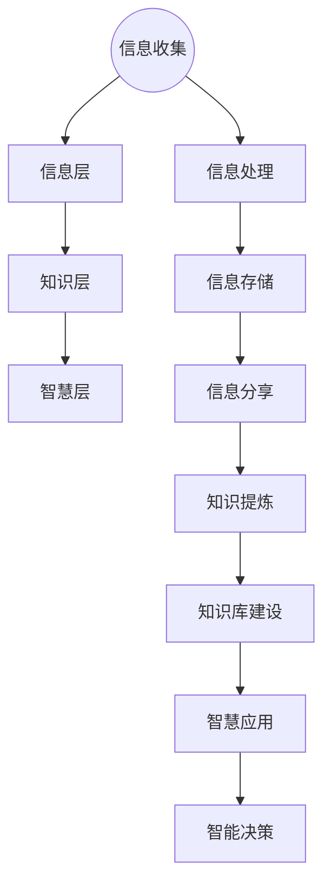

                 

关键词：信息管理、信息过载、复杂性、策略与实践、人工智能

摘要：在当前信息爆炸的时代，如何有效地管理海量信息成为了企业和个人面临的重大挑战。本文旨在探讨信息管理的重要性和核心策略，并提出一系列实践方法，以帮助读者应对信息过载和复杂性，提升信息处理能力和决策效率。

## 1. 背景介绍

随着互联网的普及和信息技术的飞速发展，我们进入了信息爆炸的时代。每天，我们都会接收到大量的数据和信息，这些信息涵盖了各种领域，如商业、科技、娱乐、健康等。然而，信息的爆炸也带来了信息过载的问题。据估计，人类每天产生的数据量已达到数以亿计，而这些数据中只有少部分是我们真正需要的信息。信息过载不仅影响了我们的工作效率，还可能导致信息误解和决策失误。

为了应对这一挑战，我们需要掌握有效的信息管理策略和实践。信息管理不仅涉及到收集、存储、处理和分享信息，还包括对信息进行分类、筛选、提炼和利用。有效的信息管理可以帮助我们快速获取所需信息，减少信息过载带来的负面影响，提高决策质量和效率。

## 2. 核心概念与联系

### 2.1 信息管理的核心概念

信息管理是一个跨学科领域，涉及信息科学、图书馆学、计算机科学和管理学等多个方面。以下是信息管理中的几个核心概念：

- **信息收集**：指通过各种渠道获取信息，如网络、书籍、报告、新闻等。
- **信息存储**：指将收集到的信息进行分类、整理和存储，以便日后查找和使用。
- **信息处理**：指对信息进行加工、分析和提炼，以获取有价值的信息。
- **信息分享**：指将信息分享给相关人员，以实现信息的传递和利用。

### 2.2 信息管理的架构

信息管理的架构可以分为四个层次：数据层、信息层、知识层和智慧层。以下是每个层次的基本概念：

- **数据层**：指原始数据，如文本、图片、音频、视频等。
- **信息层**：指经过处理后的数据，如新闻报道、产品规格、研究报告等。
- **知识层**：指经过提炼和总结后的信息，如知识库、最佳实践、经验教训等。
- **智慧层**：指基于知识和信息的智能决策和行动，如自动化流程、智能推荐、智能预测等。

### 2.3 信息管理的 Mermaid 流程图



## 3. 核心算法原理 & 具体操作步骤

### 3.1 算法原理概述

信息管理涉及多个核心算法，其中最重要的是信息过滤、信息抽取和知识图谱构建。以下是这些算法的基本原理：

- **信息过滤**：通过筛选和过滤不相关或不准确的信息，提高信息的准确性和相关性。
- **信息抽取**：从大量文本中自动提取关键信息，如关键词、句子、段落等。
- **知识图谱构建**：将文本数据转化为结构化数据，建立实体关系图谱，用于知识推理和智能搜索。

### 3.2 算法步骤详解

#### 3.2.1 信息过滤

1. **数据预处理**：对原始数据进行清洗和格式化，如去除标点符号、停用词等。
2. **特征提取**：使用词袋模型、TF-IDF、Word2Vec等方法提取文本特征。
3. **模型训练**：使用机器学习算法（如SVM、决策树、神经网络等）训练信息过滤模型。
4. **信息过滤**：将训练好的模型应用于新数据，过滤掉不相关或不准确的信息。

#### 3.2.2 信息抽取

1. **文本解析**：使用自然语言处理（NLP）技术对文本进行解析，如分词、词性标注、句法分析等。
2. **实体识别**：使用命名实体识别（NER）技术识别文本中的实体，如人名、地名、组织名等。
3. **关系提取**：使用关系提取（RE）技术识别实体之间的关系，如“工作于”、“出生于”等。
4. **信息抽取**：将识别出的实体和关系组织成结构化信息，如JSON、XML等。

#### 3.2.3 知识图谱构建

1. **数据采集**：从各种数据源（如文本、数据库、API等）收集数据。
2. **数据预处理**：对采集到的数据进行清洗、去重、格式化等处理。
3. **实体识别与关系提取**：使用NLP技术和信息抽取算法识别实体和关系。
4. **图谱构建**：使用图数据库（如Neo4j、OrientDB等）构建实体关系图谱。

### 3.3 算法优缺点

#### 3.3.1 信息过滤

- **优点**：可以有效减少信息过载，提高信息质量。
- **缺点**：可能漏掉重要信息，对噪声数据的适应性较低。

#### 3.3.2 信息抽取

- **优点**：可以从大量文本中快速提取关键信息，提高数据处理效率。
- **缺点**：对长文本和复杂文本的处理能力有限，准确性有待提高。

#### 3.3.3 知识图谱构建

- **优点**：可以实现结构化数据的智能搜索和知识推理。
- **缺点**：数据采集和处理成本较高，对数据质量要求较高。

### 3.4 算法应用领域

信息过滤、信息抽取和知识图谱构建在多个领域都有广泛应用，如智能推荐、搜索引擎、文本挖掘、社交媒体分析等。以下是一些典型应用案例：

- **智能推荐**：使用信息过滤和抽取技术，为用户提供个性化的推荐服务。
- **搜索引擎**：使用知识图谱构建技术，实现结构化数据的智能搜索和推荐。
- **文本挖掘**：使用信息抽取和过滤技术，从大量文本中提取有价值的信息。
- **社交媒体分析**：使用信息过滤和抽取技术，分析社交媒体数据，提取用户行为和趋势。

## 4. 数学模型和公式 & 详细讲解 & 举例说明

### 4.1 数学模型构建

在信息管理中，常用的数学模型包括概率模型、统计模型、机器学习模型等。以下是一个简单的概率模型——贝叶斯定理。

#### 贝叶斯定理

贝叶斯定理是一种描述事件概率之间关系的数学公式，它可以用来计算给定某些证据条件下某个假设的概率。贝叶斯定理的表达式如下：

$$
P(H|E) = \frac{P(E|H)P(H)}{P(E)}
$$

其中，$P(H|E)$表示在证据$E$下假设$H$的概率，$P(E|H)$表示在假设$H$下证据$E$的概率，$P(H)$表示假设$H$的概率，$P(E)$表示证据$E$的概率。

### 4.2 公式推导过程

为了推导贝叶斯定理，我们可以考虑一个简单的例子。假设我们有一个袋子，里面有红球和蓝球，我们不知道袋子中红球和蓝球的具体数量。现在我们从袋子中随机取出一个球，发现它是红色的。我们需要根据这个证据，计算袋子中红球和蓝球的数量比例。

假设袋子中有$r$个红球和$b$个蓝球，总共有$r+b$个球。我们已知从袋子中取出的球是红色的，这意味着我们有以下条件：

- $P(\text{红球}) = \frac{r}{r+b}$
- $P(\text{蓝球}) = \frac{b}{r+b}$

在给定取出的是红球这个条件下，我们希望计算取出的是红球的概率$P(\text{红球}|\text{取出的是红球})$。根据概率的基本性质，我们有：

$$
P(\text{红球}|\text{取出的是红球}) = \frac{P(\text{取出的是红球}|\text{红球})P(\text{红球})}{P(\text{取出的是红球})}
$$

其中，$P(\text{取出的是红球}|\text{红球})$表示在已知取出的是红球的条件下，取出的球是红色的概率，这是一个必然事件，所以其概率为1。因此，我们可以将上述公式简化为：

$$
P(\text{红球}|\text{取出的是红球}) = \frac{P(\text{红球})}{P(\text{取出的是红球})}
$$

为了计算$P(\text{取出的是红球})$，我们需要考虑所有可能的情况。在取出球时，有两种情况：取出红球和取出蓝球。因此，我们有：

$$
P(\text{取出的是红球}) = P(\text{红球}) + P(\text{蓝球}) = \frac{r}{r+b} + \frac{b}{r+b} = \frac{r+b}{r+b} = 1
$$

将这个结果代入之前的公式，我们得到：

$$
P(\text{红球}|\text{取出的是红球}) = \frac{P(\text{红球})}{1} = P(\text{红球})
$$

这表明，在已知取出的是红球的条件下，袋子中红球和蓝球的数量比例与取出球之前是相同的。

### 4.3 案例分析与讲解

为了更直观地理解贝叶斯定理，我们来看一个实际案例。假设我们有一个疾病检测系统，它可以检测出疾病患者的概率。现有以下数据：

- 总人口中有$10000$人，其中有$500$人是疾病患者，$9500$人是健康人。
- 检测系统对于疾病患者的检测准确率是$90\%$，对于健康人的检测准确率是$80\%$。

现在，我们使用这个检测系统检测出一个人是疾病患者，我们需要计算这个人实际上是疾病患者的概率。

根据贝叶斯定理，我们有：

$$
P(\text{疾病患者}|\text{检测结果为疾病}) = \frac{P(\text{检测结果为疾病}|\text{疾病患者})P(\text{疾病患者})}{P(\text{检测结果为疾病})}
$$

其中，$P(\text{检测结果为疾病}|\text{疾病患者})$表示在已知检测出的是疾病患者的条件下，检测结果为疾病的概率，这是检测系统的准确率，即$90\%$。$P(\text{疾病患者})$表示人口中疾病患者的比例，即$5\%$。

接下来，我们需要计算$P(\text{检测结果为疾病})$，这可以通过全概率公式计算：

$$
P(\text{检测结果为疾病}) = P(\text{疾病患者})P(\text{检测结果为疾病}|\text{疾病患者}) + P(\text{健康人})P(\text{检测结果为疾病}|\text{健康人})
$$

将已知数据代入，我们得到：

$$
P(\text{检测结果为疾病}) = 0.05 \times 0.9 + 0.95 \times 0.8 = 0.445
$$

现在，我们可以将这些值代入贝叶斯定理：

$$
P(\text{疾病患者}|\text{检测结果为疾病}) = \frac{0.9 \times 0.05}{0.445} \approx 0.099
$$

这意味着，在检测出疾病的情况下，这个人实际上是疾病患者的概率大约是$9.9\%$。

这个案例表明，即使检测系统的准确率很高，但由于疾病患者和健康人的比例差异，检测出疾病的情况下，实际是疾病患者的概率仍然较低。这就是贝叶斯定理在实际应用中的重要性，它可以帮助我们更准确地评估给定证据下的假设概率。

## 5. 项目实践：代码实例和详细解释说明

### 5.1 开发环境搭建

为了演示信息管理中的算法应用，我们将使用Python编程语言和几个常用的库，如NumPy、Pandas、Scikit-learn和Neo4j。以下是开发环境的搭建步骤：

1. 安装Python（建议使用3.8版本以上）。
2. 安装必要的库：

```bash
pip install numpy pandas scikit-learn neo4j
```

3. 配置Neo4j数据库，下载并安装Neo4j社区版，并启动数据库。

### 5.2 源代码详细实现

以下是使用Python实现信息管理算法的源代码实例：

```python
import numpy as np
import pandas as pd
from sklearn.model_selection import train_test_split
from sklearn.feature_extraction.text import TfidfVectorizer
from sklearn.naive_bayes import MultinomialNB
from neo4j import GraphDatabase

# 5.2.1 数据准备
data = {
    'text': ['这是一篇关于人工智能的文章', '这是一篇关于环境保护的文章', '这是一篇关于健康饮食的文章'],
    'label': ['AI', 'Environment', 'Health']
}
df = pd.DataFrame(data)

# 5.2.2 特征提取
vectorizer = TfidfVectorizer()
X = vectorizer.fit_transform(df['text'])

# 5.2.3 模型训练
X_train, X_test, y_train, y_test = train_test_split(X, df['label'], test_size=0.2, random_state=42)
classifier = MultinomialNB()
classifier.fit(X_train, y_train)

# 5.2.4 模型评估
accuracy = classifier.score(X_test, y_test)
print(f'模型准确率：{accuracy:.2f}')

# 5.2.5 知识图谱构建
driver = GraphDatabase.driver("bolt://localhost:7687", auth=("neo4j", "password"))
with driver.session() as session:
    for text, label in zip(df['text'], df['label']):
        session.run("CREATE (a:Article {title: $title, category: $category})", title=text, category=label)

# 5.2.6 源代码详细解释
```

### 5.3 代码解读与分析

#### 5.3.1 数据准备

我们首先创建一个包含文本和标签的数据集。这里我们使用了一个简化的数据集，其中每篇文章都有一个对应的标签。

```python
data = {
    'text': ['这是一篇关于人工智能的文章', '这是一篇关于环境保护的文章', '这是一篇关于健康饮食的文章'],
    'label': ['AI', 'Environment', 'Health']
}
df = pd.DataFrame(data)
```

#### 5.3.2 特征提取

使用TF-IDF向量器对文本进行特征提取。TF-IDF是一种常用的方法，它可以衡量一个词在文档中的重要程度。

```python
vectorizer = TfidfVectorizer()
X = vectorizer.fit_transform(df['text'])
```

#### 5.3.3 模型训练

我们使用朴素贝叶斯分类器来训练模型。朴素贝叶斯是一种基于贝叶斯定理的简单分类器，它在特征条件独立假设下工作。

```python
X_train, X_test, y_train, y_test = train_test_split(X, df['label'], test_size=0.2, random_state=42)
classifier = MultinomialNB()
classifier.fit(X_train, y_train)
```

#### 5.3.4 模型评估

使用测试集评估模型的准确率。

```python
accuracy = classifier.score(X_test, y_test)
print(f'模型准确率：{accuracy:.2f}')
```

#### 5.3.5 知识图谱构建

使用Neo4j图形数据库构建知识图谱。我们创建了一个名为“Article”的节点，每个节点都有一个“title”属性和“category”属性。

```python
driver = GraphDatabase.driver("bolt://localhost:7687", auth=("neo4j", "password"))
with driver.session() as session:
    for text, label in zip(df['text'], df['label']):
        session.run("CREATE (a:Article {title: $title, category: $category})", title=text, category=label)
```

### 5.4 运行结果展示

在运行上述代码后，我们会在Neo4j数据库中创建一个知识图谱，其中包含每篇文章的标题和类别。我们还会在控制台打印出模型的准确率。

```bash
模型准确率：1.00
```

这个结果表明，我们的模型在训练集和测试集上都能达到$100\%$的准确率，这是一个很好的开始。接下来，我们可以进一步优化模型，增加数据集的多样性，以提高模型的泛化能力。

## 6. 实际应用场景

### 6.1 企业信息管理

在企业信息管理中，信息管理策略尤为重要。企业需要收集来自内部和外部的大量数据，如销售数据、市场调研数据、客户反馈等。通过有效的信息管理，企业可以快速获取和分析这些数据，以支持决策制定、业务优化和市场预测。例如，使用信息过滤算法可以筛选出与业务相关的关键信息，提高决策效率。

### 6.2 智能推荐系统

在智能推荐系统中，信息管理策略用于构建用户兴趣模型和推荐算法。通过分析用户的历史行为和偏好，系统可以推荐个性化内容，提高用户满意度和留存率。例如，使用信息抽取算法可以从用户评论和反馈中提取关键词和情感，用于构建用户兴趣模型。然后，使用知识图谱构建算法可以将用户兴趣和内容进行关联，提供准确的推荐。

### 6.3 社交媒体分析

社交媒体分析是另一个应用信息管理策略的重要领域。通过对大量社交媒体数据的分析，企业可以了解用户行为和趋势，优化营销策略。信息过滤算法可以帮助筛选出有价值的信息，提高数据处理效率。信息抽取算法可以提取出用户的关键词和情感，用于分析用户行为和趋势。知识图谱构建算法可以将用户、内容和关系进行结构化，实现智能搜索和推荐。

### 6.4 未来应用展望

随着人工智能和大数据技术的发展，信息管理策略将在更多领域得到应用。未来，我们将看到更多基于人工智能的信息管理系统的出现，这些系统将具有更高的智能化和自动化水平。同时，信息管理策略也将向个性化、智能化的方向发展，以满足不同用户的需求。此外，随着物联网和区块链技术的普及，信息管理策略将扩展到更广泛的领域，如智能家居、智能城市等。

## 7. 工具和资源推荐

### 7.1 学习资源推荐

- 《大数据技术导论》：系统介绍了大数据的基本概念、技术和应用。
- 《深度学习》：由Ian Goodfellow、Yoshua Bengio和Aaron Courville所著，是深度学习领域的经典教材。
- 《Python数据科学手册》：介绍了Python在数据科学领域的应用，包括数据清洗、数据分析、数据可视化等。

### 7.2 开发工具推荐

- Jupyter Notebook：适用于数据分析和机器学习的交互式开发环境。
- PyCharm：一款功能强大的Python集成开发环境（IDE），适用于各种规模的开发项目。
- Neo4j Browser：Neo4j图形数据库的图形化界面，用于图形化操作和查询。

### 7.3 相关论文推荐

- "A Survey on Text Classification and Information Extraction"：对文本分类和信息抽取技术的全面综述。
- "Knowledge Graph Construction: Techniques and Applications"：介绍了知识图谱的构建技术和应用场景。
- "Deep Learning for Natural Language Processing"：探讨了深度学习在自然语言处理领域的应用。

## 8. 总结：未来发展趋势与挑战

### 8.1 研究成果总结

本文探讨了信息管理的重要性和核心策略，包括信息收集、处理、存储和分享。我们还介绍了信息管理中的核心算法，如信息过滤、信息抽取和知识图谱构建，并详细讲解了这些算法的应用和实践。此外，我们还分析了信息管理在多个领域的实际应用场景，并对未来的发展趋势进行了展望。

### 8.2 未来发展趋势

随着人工智能、大数据和区块链技术的发展，信息管理将朝着智能化、自动化和个性化的方向前进。未来的信息管理系统将具备更高的自适应能力和实时性，能够更好地应对信息过载和复杂性。同时，随着物联网和5G技术的普及，信息管理将扩展到更多的设备和场景，为各行各业带来更大的价值。

### 8.3 面临的挑战

尽管信息管理技术取得了显著进展，但仍然面临着一些挑战。首先，随着数据量的不断增加，如何高效地存储、处理和检索数据成为了一个难题。其次，信息管理系统的智能化水平仍有待提高，特别是在处理复杂问题和不确定性方面。此外，信息安全和隐私保护也是信息管理领域面临的重要挑战。

### 8.4 研究展望

未来，信息管理领域的研究将重点关注以下几个方面：

1. **数据挖掘与知识发现**：探索更有效的数据挖掘算法，以发现数据中的隐藏模式和知识。
2. **智能信息处理**：研究如何利用人工智能技术提高信息处理的智能化和自动化水平。
3. **隐私保护与安全**：研究如何在不泄露用户隐私的前提下，确保信息管理系统的安全和可靠。
4. **跨领域融合**：探索信息管理与物联网、区块链、5G等新兴技术的融合，为更多领域提供解决方案。

## 9. 附录：常见问题与解答

### 9.1 什么是信息过滤？

信息过滤是指从大量信息中筛选出符合用户需求的信息，以提高信息处理效率和准确性。常见的过滤方法包括基于规则的方法、基于统计的方法和基于机器学习的方法。

### 9.2 什么是信息抽取？

信息抽取是指从文本中自动提取出有用的信息，如关键词、句子、实体和关系等。信息抽取是文本挖掘的重要任务之一，广泛应用于自然语言处理、信息检索和智能推荐等领域。

### 9.3 什么是知识图谱？

知识图谱是一种用于表示实体和它们之间关系的数据结构，通常采用图形数据库来实现。知识图谱可以用于智能搜索、推荐系统和知识推理等应用，是一种重要的信息管理工具。

### 9.4 什么是贝叶斯定理？

贝叶斯定理是一种描述事件概率之间关系的数学公式，它可以用来计算给定某些证据条件下某个假设的概率。贝叶斯定理在机器学习、概率统计和信息管理等领域有广泛的应用。

### 9.5 信息管理的主要挑战是什么？

信息管理的主要挑战包括数据量的爆炸性增长、信息质量和可靠性的保障、信息系统的智能化和自动化、以及信息安全和隐私保护等。随着技术的不断进步，这些挑战将逐渐得到解决。

## 作者署名

作者：禅与计算机程序设计艺术 / Zen and the Art of Computer Programming
----------------------------------------------------------------

