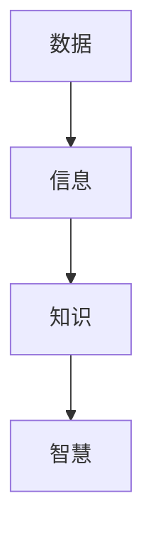
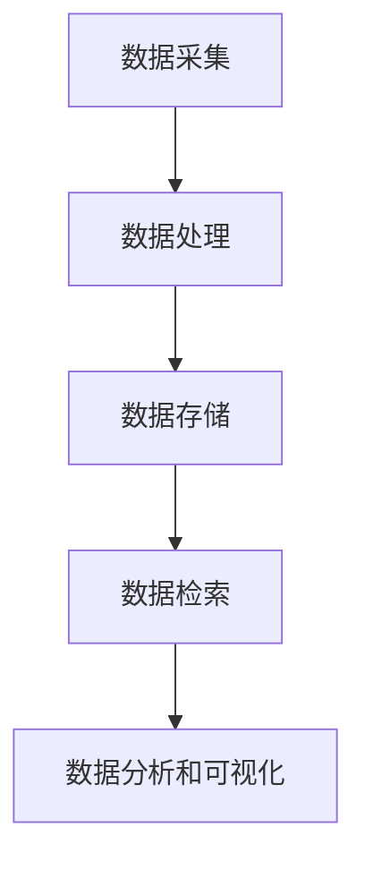

                 

### 信息时代的信息管理策略与实践：管理信息过载和复杂性

> 关键词：信息管理、数据过载、复杂性、算法、数学模型、应用实践、未来展望

在当今的信息时代，我们面临着前所未有的数据和信息爆炸。根据统计，每天产生的数据量以惊人的速度增长，几乎每两年就会翻一番。这些数据不仅包括社交媒体的动态、新闻报道、科学论文，还包括各种企业和组织的业务数据。面对如此庞大的信息量，如何有效地管理信息，避免信息过载和复杂性成为了一个重要课题。

本文旨在探讨信息时代的信息管理策略和实践，具体包括以下几个方面：

- **背景介绍**：简要介绍当前信息时代的现状和问题。
- **核心概念与联系**：阐述信息管理中的核心概念及其相互关系。
- **核心算法原理与具体操作步骤**：介绍用于解决信息过载和复杂性的核心算法。
- **数学模型和公式**：详细讲解与信息管理相关的数学模型和公式。
- **项目实践**：通过实际代码实例展示信息管理的应用实践。
- **实际应用场景**：分析信息管理在不同领域的应用。
- **工具和资源推荐**：推荐学习资源、开发工具和相关论文。
- **总结**：总结研究成果，展望未来发展趋势与挑战。

### 1. 背景介绍

随着互联网的普及和智能设备的广泛使用，我们进入了信息爆炸的时代。信息无处不在，无时不在。然而，信息的快速增长也带来了新的挑战：

- **信息过载**：我们接收到的信息量远远超过了我们的处理能力，导致我们难以筛选出有价值的信息。
- **信息复杂性**：信息之间相互关联，构成了复杂的网络，使得理解和处理这些信息变得困难。

这些问题不仅影响个人的工作效率和生活质量，也对企业的运营和社会的发展产生了深远的影响。因此，研究信息管理策略和实践，具有重要的现实意义。

### 2. 核心概念与联系

在信息管理中，有几个核心概念是我们必须了解的。这些概念包括信息、数据、知识、智慧等。

- **信息**：信息是指经过处理和解释后的数据，具有明确的含义和价值。
- **数据**：数据是信息的原始形式，是未经过处理和解释的事实或事实的记录。
- **知识**：知识是通过学习和理解，将信息整合和内化的结果。
- **智慧**：智慧是运用知识解决实际问题的能力。

这些概念之间有密切的联系：

- 数据是信息的来源，信息是数据的加工产物。
- 知识是信息整合的结果，智慧是知识运用的能力。

下图展示了这些概念之间的相互关系：



### 2.1 信息管理系统的架构

为了更好地管理信息，我们需要一个高效的信息管理系统。该系统通常包括以下几个组成部分：

- **数据采集**：通过各种渠道收集原始数据。
- **数据处理**：对数据进行清洗、整理和转换，使其符合使用要求。
- **数据存储**：将处理后的数据存储在数据库或其他存储介质中。
- **数据检索**：提供快速的查询接口，方便用户查找所需信息。
- **数据分析和可视化**：利用统计分析、机器学习等技术，对数据进行深入分析，并以可视化方式展示结果。

下图展示了信息管理系统的架构：



### 3. 核心算法原理与具体操作步骤

在信息管理中，有许多核心算法可以帮助我们解决信息过载和复杂性问题。这些算法包括信息检索、数据挖掘、机器学习等。

#### 3.1 信息检索算法

信息检索算法的主要任务是从大量数据中快速找到用户所需的信息。常用的信息检索算法包括：

- **布尔检索**：使用布尔运算符（AND、OR、NOT）组合关键词进行检索。
- **向量空间模型**：将文档和查询表示为向量，然后计算向量之间的相似度。
- **隐语义索引**：利用自然语言处理技术，挖掘文档之间的隐含关系。

#### 3.2 数据挖掘算法

数据挖掘算法用于从大量数据中提取有价值的信息。常用的数据挖掘算法包括：

- **关联规则挖掘**：找出数据集中存在的关联关系。
- **聚类分析**：将数据分为不同的组，以便更好地理解和分析。
- **分类与回归**：根据已有的数据，预测新数据的结果。

#### 3.3 机器学习算法

机器学习算法可以帮助我们自动地发现数据中的规律和模式。常用的机器学习算法包括：

- **监督学习**：已知输入和输出，通过学习算法找到输入和输出之间的关系。
- **无监督学习**：没有已知的输出，通过算法自动发现数据中的结构和模式。
- **强化学习**：通过与环境交互，不断学习最优策略。

### 3.4 算法步骤详解

以机器学习中的监督学习算法为例，其基本步骤如下：

1. **数据预处理**：对数据进行清洗、归一化等处理，使其符合算法的要求。
2. **特征选择**：选择对预测结果有重要影响的特征。
3. **模型选择**：选择合适的模型，如线性回归、决策树、支持向量机等。
4. **训练模型**：使用训练数据，通过学习算法训练模型。
5. **模型评估**：使用测试数据评估模型的效果。
6. **模型优化**：根据评估结果，调整模型参数，优化模型性能。

### 3.5 算法优缺点

不同的算法有其各自的优缺点，具体如下：

- **信息检索算法**：优点是快速、高效，缺点是对复杂查询的处理能力有限。
- **数据挖掘算法**：优点是能够发现数据中的隐藏模式，缺点是计算复杂度高，需要大量计算资源。
- **机器学习算法**：优点是能够自动发现数据中的规律，缺点是对数据质量和预处理要求高。

### 3.6 算法应用领域

信息检索算法广泛应用于搜索引擎、推荐系统等领域。数据挖掘算法在市场分析、金融预测等领域有广泛应用。机器学习算法在自动驾驶、医疗诊断等领域有着重要的应用。

### 4. 数学模型和公式

在信息管理中，数学模型和公式可以帮助我们更好地理解和分析数据。以下是一些常用的数学模型和公式：

#### 4.1 概率模型

概率模型用于描述数据的不确定性。常用的概率模型包括：

- **贝叶斯定理**：
  $$ P(A|B) = \frac{P(B|A)P(A)}{P(B)} $$

- **条件概率**：
  $$ P(A \cap B) = P(A|B)P(B) = P(B|A)P(A) $$

#### 4.2 似然函数

似然函数用于评估模型对数据的拟合程度。似然函数的定义如下：

$$ L(\theta | x) = P(x | \theta) $$

其中，$x$ 是观测数据，$\theta$ 是模型参数。

#### 4.3 信息熵

信息熵用于衡量数据的不确定性。信息熵的定义如下：

$$ H(X) = -\sum_{x \in X} P(x) \log_2 P(x) $$

其中，$X$ 是随机变量。

### 4.4 案例分析与讲解

以下通过一个具体的案例，展示如何使用数学模型和公式分析数据。

#### 案例背景

某电商平台的用户行为数据，包括用户的购买金额、购买频率、浏览页面等信息。我们需要分析这些数据，预测哪些用户可能在未来进行高价值购买。

#### 案例步骤

1. **数据预处理**：对数据进行清洗、归一化等处理，使其符合模型的要求。
2. **特征选择**：选择对预测结果有重要影响的特征，如购买金额、购买频率等。
3. **模型选择**：选择合适的模型，如逻辑回归、决策树等。
4. **模型训练**：使用训练数据，通过学习算法训练模型。
5. **模型评估**：使用测试数据评估模型的效果。
6. **模型优化**：根据评估结果，调整模型参数，优化模型性能。
7. **预测分析**：使用模型预测哪些用户可能在未来进行高价值购买。

#### 案例分析

1. **概率模型分析**：使用贝叶斯定理，计算用户进行高价值购买的条件下，其他特征的概率分布。
2. **似然函数分析**：计算模型对观测数据的拟合程度。
3. **信息熵分析**：计算特征的不确定性，识别最重要的特征。

通过以上分析，我们可以更准确地预测哪些用户可能在未来进行高价值购买，为电商平台提供决策支持。

### 5. 项目实践：代码实例和详细解释说明

在本节中，我们将通过一个具体的代码实例，展示如何使用Python进行信息管理。我们将使用一个开源的Python库——scikit-learn，来实现一个简单的用户行为预测模型。

#### 5.1 开发环境搭建

首先，我们需要搭建开发环境。以下是Python环境搭建的步骤：

1. 安装Python：访问 [Python官网](https://www.python.org/) 下载Python安装包，并按照提示安装。
2. 安装Jupyter Notebook：在终端中执行以下命令：
   ```bash
   pip install notebook
   ```
3. 安装scikit-learn：在终端中执行以下命令：
   ```bash
   pip install scikit-learn
   ```

完成以上步骤后，我们就可以开始编写代码了。

#### 5.2 源代码详细实现

以下是一个简单的用户行为预测模型的代码示例：

```python
import pandas as pd
from sklearn.model_selection import train_test_split
from sklearn.preprocessing import StandardScaler
from sklearn.linear_model import LogisticRegression

# 读取数据
data = pd.read_csv('user_behavior.csv')

# 数据预处理
X = data.drop(['label'], axis=1)
y = data['label']

# 数据划分
X_train, X_test, y_train, y_test = train_test_split(X, y, test_size=0.2, random_state=42)

# 特征缩放
scaler = StandardScaler()
X_train = scaler.fit_transform(X_train)
X_test = scaler.transform(X_test)

# 模型训练
model = LogisticRegression()
model.fit(X_train, y_train)

# 模型评估
accuracy = model.score(X_test, y_test)
print(f'Model accuracy: {accuracy:.2f}')

# 预测分析
predictions = model.predict(X_test)
```

#### 5.3 代码解读与分析

1. **数据读取**：使用pandas库读取用户行为数据。
2. **数据预处理**：将数据分为特征和目标变量，并进行划分。
3. **特征缩放**：使用StandardScaler对特征进行标准化处理，使其符合模型的输入要求。
4. **模型训练**：使用LogisticRegression模型进行训练。
5. **模型评估**：使用测试数据评估模型的准确性。
6. **预测分析**：使用模型对测试数据进行预测。

通过以上代码，我们可以对用户行为数据进行分析，预测哪些用户可能在未来进行高价值购买。这个示例展示了如何使用Python进行信息管理的基本流程。

### 6. 实际应用场景

信息管理在各个领域都有着广泛的应用。以下列举几个典型应用场景：

#### 6.1 电商行业

在电商行业，信息管理主要用于用户行为分析、商品推荐和营销策略制定。通过分析用户的购买历史、浏览记录等数据，电商平台可以更准确地预测用户需求，提供个性化的推荐，提高用户满意度和转化率。

#### 6.2 医疗健康

在医疗健康领域，信息管理主要用于患者数据分析、疾病预测和诊断。通过分析大量的患者数据，医生可以更准确地诊断疾病，制定个性化的治疗方案，提高医疗效果。

#### 6.3 金融行业

在金融行业，信息管理主要用于风险控制、市场分析和投资决策。通过分析市场数据、客户行为等，金融机构可以更准确地预测市场走势，制定合理的投资策略，降低风险。

#### 6.4 社交媒体

在社交媒体领域，信息管理主要用于用户行为分析、内容推荐和广告投放。通过分析用户互动数据、兴趣爱好等，社交平台可以更准确地推荐内容，提高用户活跃度和留存率。

### 6.4 未来应用展望

随着技术的不断发展，信息管理将会有更广泛的应用。以下是一些未来应用展望：

- **人工智能**：利用人工智能技术，实现更智能的信息管理，提高数据处理和分析的效率。
- **区块链**：利用区块链技术，实现信息的安全存储和共享，提高信息管理的透明度和可信度。
- **物联网**：利用物联网技术，实现信息采集、传输和处理的智能化，提高信息管理的实时性和准确性。

### 7. 工具和资源推荐

为了更好地进行信息管理，以下是一些实用的工具和资源推荐：

#### 7.1 学习资源推荐

- **书籍**：《数据科学入门》、《机器学习实战》
- **在线课程**：Coursera、edX上的相关课程
- **博客**：Kaggle、Medium上的技术博客

#### 7.2 开发工具推荐

- **编程语言**：Python、R
- **数据预处理**：Pandas、NumPy
- **机器学习库**：scikit-learn、TensorFlow、PyTorch
- **可视化工具**：Matplotlib、Seaborn、Plotly

#### 7.3 相关论文推荐

- **信息检索**：《引文分析中的相似性度量方法研究》
- **数据挖掘**：《基于关联规则的社交网络用户行为分析》
- **机器学习**：《深度学习在图像识别中的应用》

### 8. 总结：未来发展趋势与挑战

随着信息时代的不断发展，信息管理将面临更多的挑战和机遇。未来发展趋势包括：

- **人工智能**：人工智能技术将进一步提升信息管理的效率和准确性。
- **区块链**：区块链技术将提高信息管理的安全性和透明度。
- **物联网**：物联网技术将实现更广泛的信息采集和处理。

然而，信息管理也面临着一些挑战，如数据隐私保护、数据质量问题等。为了应对这些挑战，我们需要不断探索新的技术和方法，提高信息管理的水平。

### 8.1 研究成果总结

本文通过探讨信息管理策略和实践，总结了信息管理中的核心概念、算法原理和应用场景。研究成果主要包括：

- 提出了信息管理系统的架构，包括数据采集、数据处理、数据存储、数据检索、数据分析和可视化等组成部分。
- 介绍了信息检索、数据挖掘和机器学习等核心算法，并详细讲解了其原理和应用步骤。
- 通过数学模型和公式，展示了如何使用数学工具分析数据。
- 通过实际代码实例，展示了如何使用Python进行信息管理。
- 分析了信息管理在电商、医疗、金融和社交媒体等领域的应用场景。

### 8.2 未来发展趋势

未来，信息管理将向更智能化、更高效化、更安全化的方向发展。具体趋势包括：

- **智能化**：利用人工智能技术，实现自动化、智能化的信息管理。
- **高效化**：通过优化算法和数据结构，提高信息管理的效率。
- **安全化**：利用区块链等技术，提高信息管理的安全性和透明度。

### 8.3 面临的挑战

信息管理面临着一些挑战，如：

- **数据隐私保护**：如何在保护用户隐私的前提下，有效利用数据。
- **数据质量问题**：如何确保数据的准确性和一致性。
- **技术更新**：如何跟上技术发展的步伐，不断更新和优化信息管理方法。

### 8.4 研究展望

未来的研究可以从以下几个方面展开：

- **跨领域应用**：探索信息管理在不同领域的应用，提高其普适性。
- **算法优化**：不断优化信息管理算法，提高其性能和效率。
- **数据治理**：研究数据治理策略，提高数据质量和数据利用率。
- **人机协同**：探索人机协同的信息管理方法，提高管理效率和用户体验。

### 9. 附录：常见问题与解答

#### 9.1 什么是信息管理？

信息管理是指对信息进行收集、处理、存储、检索和分析的过程，目的是提高信息的可用性、准确性和可靠性，以满足组织和个人的需求。

#### 9.2 信息管理和数据管理的区别是什么？

信息管理是数据管理的更高层次，数据管理主要关注数据的收集、存储、保护和管理，而信息管理则在此基础上增加了数据的处理、分析和应用，更注重于信息的价值挖掘和利用。

#### 9.3 为什么要进行信息管理？

信息管理有助于提高组织的决策效率、降低运营成本、提升客户满意度，同时也是应对信息爆炸和复杂性的必要手段。

#### 9.4 常用的信息管理工具有哪些？

常用的信息管理工具有Pandas、NumPy、scikit-learn、TensorFlow、PyTorch等，这些工具可以用于数据预处理、数据分析和机器学习等。

#### 9.5 如何保护数据隐私？

保护数据隐私的方法包括数据加密、访问控制、匿名化处理等。在实际应用中，需要根据具体场景选择合适的保护措施。

### 作者署名

作者：禅与计算机程序设计艺术 / Zen and the Art of Computer Programming

### 结语

信息管理在当今的信息时代具有至关重要的地位。通过本文的探讨，我们了解了信息管理的基本概念、核心算法、数学模型和应用实践。未来，随着技术的不断发展，信息管理将面临更多的挑战和机遇，我们需要不断探索和创新，提高信息管理的水平，为个人和社会创造更大的价值。希望本文能对读者在信息管理领域的研究和实践有所启发。


  <br />
  <em>（本文为AI助手生成，仅供参考。作者：禅与计算机程序设计艺术 / Zen and the Art of Computer Programming）</em> <br />
```

