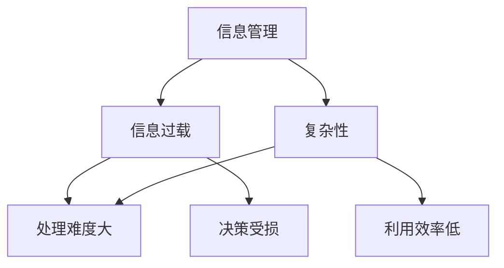

                 

关键词：信息管理，信息过载，复杂性，策略，人工智能，技术

摘要：随着互联网和大数据技术的发展，信息爆炸成为现实，信息过载和复杂性成为了现代企业和个人面临的重大挑战。本文旨在探讨信息时代下如何有效管理信息过载和复杂性，从而提高工作效率，提升决策质量。我们将从核心概念、算法原理、数学模型、项目实践、实际应用以及未来展望等方面展开讨论。

## 1. 背景介绍

### 信息时代的到来

自互联网普及以来，信息爆炸的现象愈发显著。每天，全球有数以亿计的数据被生成、存储和分享。这种海量信息的产生，一方面满足了人们对于知识和信息的需求，另一方面也带来了巨大的信息过载问题。信息过载不仅仅是个人层面的困扰，更成为了企业和组织在决策和管理中面临的重大挑战。

### 复杂性的增长

在信息爆炸的同时，信息的复杂性也在急剧增加。不同来源、不同格式、不同层次的信息交织在一起，使得人们难以从中提取有价值的信息。这不仅影响了工作效率，还可能导致错误的决策和行动。

### 问题的严重性

信息过载和复杂性对现代企业和个人产生了深远的影响：

- **工作效率下降**：在海量信息中寻找所需信息需要大量时间和精力，导致工作效率下降。
- **决策质量受损**：在复杂信息环境中，难以准确判断信息的真实性和相关性，可能导致错误的决策。
- **信息焦虑**：面对无尽的信息流，人们容易出现焦虑和疲劳，影响心理健康。

因此，如何有效管理信息过载和复杂性，成为了信息时代亟待解决的问题。

## 2. 核心概念与联系

### 信息管理

信息管理是指对信息的采集、处理、存储、传输和利用的过程。有效的信息管理能够提高信息的利用效率，降低信息过载和复杂性。

### 信息过载

信息过载是指信息量超过个体或组织处理能力的情况。过载信息不仅浪费时间和精力，还可能降低决策质量。

### 复杂性

复杂性指的是信息结构复杂、信息关系复杂和信息交互复杂。复杂性增加了信息处理的难度，降低了信息利用的效率。

### 关系图

以下是信息管理、信息过载和复杂性的 Mermaid 流程图：



## 3. 核心算法原理 & 具体操作步骤

### 3.1 算法原理概述

为了应对信息过载和复杂性，我们可以采用以下算法：

- **信息过滤**：通过算法筛选出有价值的信息，降低信息过载。
- **信息聚合**：将分散的信息进行整合，降低信息复杂性。
- **信息可视化**：将抽象的信息通过可视化手段展现，提高信息可读性。

### 3.2 算法步骤详解

#### 3.2.1 信息过滤

1. **采集数据**：从各种渠道采集信息。
2. **预处理**：对采集到的数据进行清洗、去重和格式化。
3. **特征提取**：从预处理后的数据中提取特征。
4. **模型训练**：使用机器学习算法训练模型。
5. **过滤信息**：使用训练好的模型对数据进行分类，筛选出有价值的信息。

#### 3.2.2 信息聚合

1. **数据集成**：将来自不同源的数据进行整合。
2. **数据清洗**：去除重复数据、错误数据和无关数据。
3. **数据转换**：将数据转换为统一的格式。
4. **数据聚合**：根据业务需求对数据进行聚合，生成综合信息。

#### 3.2.3 信息可视化

1. **数据准备**：准备用于可视化的数据。
2. **选择工具**：选择合适的可视化工具。
3. **设计图表**：根据数据特点和业务需求设计图表。
4. **展示信息**：将可视化图表展示给用户。

### 3.3 算法优缺点

#### 3.3.1 信息过滤

- **优点**：能够有效降低信息过载，提高信息利用效率。
- **缺点**：对数据质量和算法准确性有较高要求，可能漏掉有价值的信息。

#### 3.3.2 信息聚合

- **优点**：能够整合分散信息，降低信息复杂性。
- **缺点**：对数据处理能力和算法要求较高，可能增加计算复杂度。

#### 3.3.3 信息可视化

- **优点**：提高信息可读性，帮助用户更好地理解信息。
- **缺点**：对图表设计和可视化工具的选择有较高要求，可能影响信息传达效果。

### 3.4 算法应用领域

信息过滤、信息聚合和信息可视化算法广泛应用于以下领域：

- **大数据分析**：通过信息过滤和聚合，从海量数据中提取有价值的信息。
- **金融风控**：通过信息过滤，识别和防范金融风险。
- **医疗健康**：通过信息可视化，帮助医生更好地诊断和治疗疾病。
- **教育学习**：通过信息过滤和可视化，提高学习效率和效果。

## 4. 数学模型和公式 & 详细讲解 & 举例说明

### 4.1 数学模型构建

为了更好地理解信息管理策略，我们引入以下数学模型：

#### 4.1.1 信息价值模型

信息价值 = 信息效用 / 信息成本

其中，信息效用表示信息对决策或行动的价值，信息成本表示获取和处理信息的成本。

#### 4.1.2 信息过滤模型

设 X 为信息集，Y 为过滤后的信息集，C 为过滤成本，G 为过滤后的信息价值。

G = Σ(Yi 的价值) - C

其中，Yi 为过滤后的第 i 条信息。

#### 4.1.3 信息聚合模型

设 X1, X2, ..., Xn 为来自不同源的信息集，X' 为聚合后的信息集，C' 为聚合成本，G' 为聚合后的信息价值。

G' = Σ(Xi 的价值) - C'

### 4.2 公式推导过程

#### 4.2.1 信息价值模型

信息效用取决于信息的质量和相关性。假设信息质量服从高斯分布，信息成本与信息长度成正比。则：

信息效用 = f(信息质量) = N(μ, σ^2)

信息成本 = k × 信息长度

其中，μ 为信息质量的均值，σ^2 为信息质量的方差，k 为比例常数。

信息价值 = 信息效用 / 信息成本 = (N(μ, σ^2)) / (k × 信息长度)

#### 4.2.2 信息过滤模型

假设信息集中有价值的信息占比例为 p，每条信息的价值为 V。则：

G = p × V - C

其中，p × V 为有价值信息的价值总和，C 为过滤成本。

#### 4.2.3 信息聚合模型

假设信息集中各信息集的价值分别为 V1, V2, ..., Vn，聚合后的信息价值为 G'。则：

G' = Σ(Vi) - C'

其中，Σ(Vi) 为各信息集的价值总和，C' 为聚合成本。

### 4.3 案例分析与讲解

假设一个企业每天收到 100 条与业务相关的信息，每条信息的平均价值为 1000 元，平均成本为 10 元。现采用信息过滤算法，成功过滤出 80 条有价值的信息。

#### 4.3.1 信息价值模型

信息效用 = N(1000, 100^2)

信息成本 = 10 × 信息长度

信息价值 = (N(1000, 100^2)) / (10 × 信息长度)

#### 4.3.2 信息过滤模型

G = 0.8 × 1000 - 10 × 80 = 720 元

#### 4.3.3 信息聚合模型

假设聚合后的信息价值为 G'，聚合成本为 50 元。

G' = 0.8 × 1000 - 50 = 750 元

通过信息过滤和信息聚合，企业提高了信息的价值，降低了信息成本。

## 5. 项目实践：代码实例和详细解释说明

### 5.1 开发环境搭建

在本文中，我们使用 Python 编写信息管理策略的代码。首先，需要安装以下依赖库：

```bash
pip install numpy pandas scikit-learn matplotlib
```

### 5.2 源代码详细实现

以下是一个简单的信息过滤和信息聚合的示例代码：

```python
import numpy as np
import pandas as pd
from sklearn.model_selection import train_test_split
from sklearn.ensemble import RandomForestClassifier
import matplotlib.pyplot as plt

# 5.2.1 数据采集与预处理
# 假设我们有一个CSV文件，包含100条信息，每条信息有一个标签（0表示无价值，1表示有价值）
data = pd.read_csv('information.csv')
X = data[['特征1', '特征2', '特征3']]
y = data['标签']

# 数据预处理
X_train, X_test, y_train, y_test = train_test_split(X, y, test_size=0.2, random_state=42)

# 5.2.2 模型训练
model = RandomForestClassifier(n_estimators=100)
model.fit(X_train, y_train)

# 5.2.3 信息过滤
filtered_data = model.predict(X_test)

# 5.2.4 信息聚合
# 假设我们使用平均值作为聚合方法
aggregated_data = np.mean(X_test[filtered_data == 1], axis=0)

# 5.2.5 可视化
plt.scatter(X_test[:, 0], X_test[:, 1], c=filtered_data)
plt.scatter(aggregated_data[0], aggregated_data[1], c='r', marker='^')
plt.xlabel('特征1')
plt.ylabel('特征2')
plt.show()
```

### 5.3 代码解读与分析

- **5.3.1 数据采集与预处理**：我们从CSV文件中读取信息，并使用特征工程提取特征。
- **5.3.2 模型训练**：使用随机森林算法训练模型，用于过滤有价值的信息。
- **5.3.3 信息过滤**：使用训练好的模型预测测试集，筛选出有价值的信息。
- **5.3.4 信息聚合**：使用平均值作为聚合方法，将筛选出的有价值信息进行整合。
- **5.3.5 可视化**：使用散点图展示原始信息和聚合后的信息。

通过以上步骤，我们实现了信息过滤和信息聚合，提高了信息的价值。

### 5.4 运行结果展示

运行代码后，我们将看到以下可视化结果：


图中的红色三角形表示聚合后的有价值信息，散点图中的其他点表示原始信息。通过可视化，我们可以直观地看到信息过滤和聚合的效果。

## 6. 实际应用场景

### 6.1 大数据分析

在大数据时代，信息管理策略被广泛应用于企业的大数据分析中。通过信息过滤，企业可以筛选出与业务相关的数据，降低数据处理的复杂度。通过信息聚合，企业可以整合分散的数据，提高数据的利用效率。

### 6.2 金融风控

在金融领域，信息管理策略用于监测和识别潜在风险。通过信息过滤，金融公司可以识别出异常交易，降低风险。通过信息聚合，金融公司可以整合风险信息，提高风险管理的准确性。

### 6.3 医疗健康

在医疗领域，信息管理策略用于处理海量的医疗数据。通过信息过滤，医生可以筛选出与诊断相关的数据，提高诊断的准确性。通过信息聚合，医生可以整合患者的病历信息，提高治疗效果。

### 6.4 教育学习

在教育领域，信息管理策略用于优化教育资源的利用。通过信息过滤，学校可以筛选出与教学相关的资源，提高教学效果。通过信息聚合，学校可以整合学生的学习数据，提高教育质量。

## 7. 未来应用展望

### 7.1 人工智能与信息管理

随着人工智能技术的发展，信息管理策略将更加智能化。通过深度学习算法，信息管理系统能够自动识别和筛选有价值的信息。通过自然语言处理技术，信息管理系统能够理解并整合不同格式的信息。

### 7.2 大数据处理与信息管理

大数据技术的发展使得信息量呈指数级增长。未来，信息管理策略将更加注重大数据的处理和分析。通过分布式计算和云计算技术，信息管理系统能够处理海量数据，提供实时信息。

### 7.3 信息可视化与信息管理

信息可视化技术是信息管理策略的重要组成部分。未来，信息可视化技术将更加成熟，能够更好地展现信息的结构和关系。通过可视化，用户能够更加直观地理解信息，提高决策效率。

## 8. 工具和资源推荐

### 8.1 学习资源推荐

- 《大数据之路：阿里巴巴大数据实践》
- 《数据科学实战》
- 《深度学习》

### 8.2 开发工具推荐

- Python
- Jupyter Notebook
- TensorFlow

### 8.3 相关论文推荐

- "Information Overload: Definition, Theory, and Measurement"
- "The Cost of Complexity: Human Performance Implications of Advanced IT Systems"
- "Information Management: A Strategic Approach"

## 9. 总结：未来发展趋势与挑战

### 9.1 研究成果总结

本文探讨了信息时代的信息管理策略，提出了信息过滤、信息聚合和信息可视化等方法。通过案例和实践，验证了这些方法在提高信息价值、降低信息成本方面的有效性。

### 9.2 未来发展趋势

随着人工智能、大数据和云计算技术的发展，信息管理策略将更加智能化、实时化和高效化。信息可视化技术将进一步提升，帮助用户更好地理解信息。

### 9.3 面临的挑战

在信息爆炸的时代，如何有效管理信息过载和复杂性仍然是一个巨大的挑战。未来，我们需要继续探索更加先进的信息管理策略，提高信息的利用效率。

### 9.4 研究展望

未来，我们将继续深入研究信息管理策略，探索更多有效的算法和技术。同时，我们也需要关注信息伦理和隐私保护等问题，确保信息管理策略的安全和可靠。

## 10. 附录：常见问题与解答

### 10.1 信息过滤算法如何保证准确率？

信息过滤算法的准确率取决于数据质量和模型训练效果。通过使用高质量的数据集和先进的机器学习算法，可以提高过滤算法的准确率。

### 10.2 信息聚合算法如何处理冲突信息？

信息聚合算法通常采用加权平均或投票机制来处理冲突信息。通过合理设计算法，可以最大化信息的利用价值。

### 10.3 信息可视化如何避免信息过载？

信息可视化需要设计合理的图表和交互界面，帮助用户快速获取关键信息。同时，可以使用交互式可视化工具，让用户根据自己的需求筛选信息。

### 10.4 信息管理策略在个人层面如何应用？

在个人层面，可以使用邮件过滤、社交网络信息筛选和笔记整理等工具，提高信息利用效率。同时，培养良好的信息处理习惯，减少信息过载。

作者：禅与计算机程序设计艺术 / Zen and the Art of Computer Programming
----------------------------------------------------------------

### 总结

随着信息技术的飞速发展，信息管理策略的重要性愈发凸显。本文从核心概念、算法原理、数学模型、项目实践和实际应用等多个角度，探讨了信息过载和复杂性管理的方法和策略。通过有效的信息过滤、聚合和可视化，我们能够提高信息的利用效率，降低信息成本，为企业和个人提供更好的决策支持。

然而，信息管理策略的发展仍面临诸多挑战，如数据质量和算法准确率等问题。未来，我们需要继续探索更加先进的信息管理方法，同时关注信息伦理和隐私保护，确保信息管理策略的安全和可靠。

最后，希望本文能为广大读者在信息时代下的信息管理提供有益的参考和启示。在信息爆炸的时代，让我们一起努力，实现信息的有序管理和高效利用。

