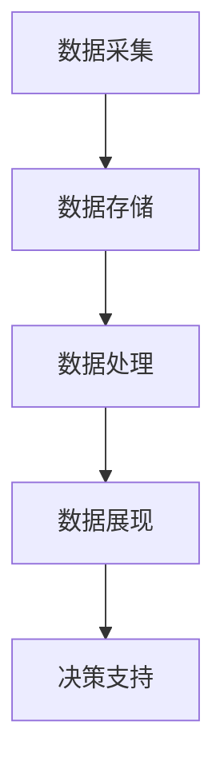

                 

关键词：信息过载、信息管理系统、工具技术、数据处理、人工智能

> 摘要：在当今信息爆炸的时代，信息过载成为了众多企业和个人面临的重大挑战。本文旨在探讨如何利用先进的管理工具和技术来有效应对信息过载，提升信息处理效率和决策质量。通过对核心概念的介绍、算法原理的阐述、数学模型的解析以及实际应用的展示，本文将为读者提供一个全面的解决方案。

## 1. 背景介绍

随着互联网和移动通信技术的飞速发展，人类进入了信息爆炸的时代。每天，我们都面临着海量数据的冲击，这些数据来自社交媒体、在线购物、电子邮件、智能设备等各个方面。这种信息过载现象不仅对个人的生活质量造成了影响，也给企业的运营和决策带来了巨大的挑战。

对于企业而言，信息过载意味着数据处理的复杂性和决策的难度增加。如何从海量数据中提取有用信息，进行有效的数据分析和决策，成为了企业亟需解决的问题。而对于个人用户，信息过载可能导致焦虑、注意力分散，甚至影响日常生活和工作。

本文将探讨如何通过信息管理系统，结合先进的数据处理工具和技术，来管理和减轻信息过载，提升信息处理效率和决策质量。

## 2. 核心概念与联系

### 2.1 信息管理系统的概念

信息管理系统（Information Management System, IMS）是一种用于收集、存储、处理、分析和分发信息的系统。它包括硬件、软件、数据和人员等多个方面，旨在提供高效、可靠的信息服务，支持企业的业务运营和决策过程。

### 2.2 信息管理系统的架构

信息管理系统的架构通常包括以下几个主要模块：

1. **数据采集模块**：负责从各种数据源（如数据库、文件、传感器等）收集数据。
2. **数据存储模块**：用于存储和管理采集到的数据，通常采用数据库管理系统（DBMS）来实现。
3. **数据处理模块**：负责对数据进行清洗、转换、整合和分析，以提取有用信息。
4. **数据展现模块**：通过可视化工具和仪表板，将分析结果以图表、报表等形式展示给用户。
5. **决策支持模块**：利用数据分析和机器学习算法，为决策者提供数据驱动的决策支持。

### 2.3 信息管理系统的核心工具和技术

#### 2.3.1 数据库管理系统

数据库管理系统（DBMS）是信息管理系统的重要组成部分，用于存储和管理数据。常见的DBMS包括关系型数据库（如MySQL、Oracle）和非关系型数据库（如MongoDB、Cassandra）。

#### 2.3.2 数据仓库和数据湖

数据仓库（Data Warehouse）和数据湖（Data Lake）是用于存储大规模结构化和非结构化数据的技术。数据仓库主要用于支持企业历史数据的分析和报告，而数据湖则适合存储大规模原始数据，并支持更灵活的数据处理和分析。

#### 2.3.3 数据挖掘和机器学习

数据挖掘（Data Mining）和机器学习（Machine Learning）是用于从数据中提取有用信息的技术。数据挖掘通常用于探索性数据分析，而机器学习则通过训练模型来预测和分类数据。

#### 2.3.4 数据可视化

数据可视化（Data Visualization）是将数据以图表、报表等形式展示的技术，有助于用户更好地理解和分析数据。

### 2.4 核心概念和技术的联系

信息管理系统中的核心概念和技术相互关联，共同构成了一个完整的信息处理和分析流程。数据采集模块负责收集数据，数据存储模块负责存储和管理数据，数据处理模块负责对数据进行处理和分析，数据展现模块负责将分析结果展示给用户，决策支持模块则利用这些分析结果来支持决策。

以下是一个简化的 Mermaid 流程图，展示了信息管理系统的核心模块和它们之间的联系：



## 3. 核心算法原理 & 具体操作步骤

### 3.1 算法原理概述

在信息管理系统中，核心算法通常包括数据清洗、数据整合、数据分析和数据可视化等。以下将分别介绍这些算法的基本原理。

#### 3.1.1 数据清洗

数据清洗（Data Cleaning）是指对数据进行清洗和预处理，以消除数据中的错误、冗余和不一致。常见的数据清洗算法包括：

- **缺失值填充**：使用平均值、中位数或最近邻等方法来填充缺失值。
- **异常值处理**：通过统计方法或基于规则的方法来检测和处理异常值。
- **重复值检测**：检测和删除重复的数据记录。

#### 3.1.2 数据整合

数据整合（Data Integration）是指将来自多个数据源的数据进行合并和整合，以形成一个统一的数据视图。常见的数据整合算法包括：

- **数据融合**：通过合并和汇总多个数据源的数据，形成一个全局视图。
- **数据转换**：将数据源中的数据转换为统一的格式和结构。
- **数据映射**：将不同数据源中的数据字段进行映射，以实现数据的关联和整合。

#### 3.1.3 数据分析

数据分析（Data Analysis）是指通过对数据进行探索性分析和建模，以提取有用信息和洞察。常见的数据分析算法包括：

- **统计分析**：使用统计方法（如均值、方差、回归等）来分析数据。
- **机器学习**：使用机器学习算法（如决策树、随机森林、神经网络等）来建立模型并进行预测。
- **数据挖掘**：使用数据挖掘算法（如关联规则挖掘、聚类、分类等）来发现数据中的模式。

#### 3.1.4 数据可视化

数据可视化（Data Visualization）是指通过图表、报表等形式将数据分析结果直观地展示给用户。常见的数据可视化算法包括：

- **图表生成**：使用图表（如折线图、柱状图、饼图等）来展示数据。
- **交互式可视化**：使用交互式可视化工具（如D3.js、Plotly等）来提供更丰富的数据探索和分析功能。

### 3.2 算法步骤详解

以下将详细介绍数据清洗、数据整合、数据分析和数据可视化这四个核心算法的具体步骤。

#### 3.2.1 数据清洗步骤

1. **数据预处理**：对数据进行读取、解析和初步检查，以确定数据的结构和质量。
2. **缺失值填充**：对于缺失值，根据数据的分布特点选择合适的填充方法。
3. **异常值处理**：使用统计方法或基于规则的方法来检测和标记异常值。
4. **重复值检测**：使用哈希表或索引结构来检测和删除重复值。
5. **数据清洗结果验证**：对清洗后的数据再次进行检查，以确保数据的准确性和一致性。

#### 3.2.2 数据整合步骤

1. **数据源选择**：确定需要整合的数据源，包括关系型数据库、非关系型数据库、数据仓库和数据湖等。
2. **数据读取**：使用数据库连接技术和API接口来读取数据。
3. **数据转换**：将数据源中的数据转换为统一的格式和结构，如JSON、CSV等。
4. **数据映射**：将不同数据源中的数据字段进行映射，以实现数据的关联和整合。
5. **数据整合结果验证**：对整合后的数据再次进行检查，以确保数据的完整性和一致性。

#### 3.2.3 数据分析步骤

1. **数据探索**：使用统计方法和可视化工具对数据进行分析，以发现数据中的模式和趋势。
2. **数据预处理**：对数据进行清洗、转换和整合，以消除数据中的噪声和异常。
3. **特征工程**：选择和构建有用的特征，以提高模型的性能和可解释性。
4. **模型训练**：使用机器学习算法和建模工具来训练模型，并进行参数调优。
5. **模型评估**：使用验证集和测试集来评估模型的性能，并选择最优模型。
6. **数据可视化**：使用图表和报表将分析结果直观地展示给用户。

#### 3.2.4 数据可视化步骤

1. **数据准备**：将分析结果进行预处理和转换，以适应可视化工具的要求。
2. **图表选择**：根据数据的类型和目的选择合适的图表类型，如折线图、柱状图、饼图等。
3. **图表生成**：使用可视化工具（如Matplotlib、Plotly等）生成图表。
4. **交互式可视化**：使用交互式可视化工具（如D3.js、Plotly等）提供更丰富的数据探索和分析功能。
5. **图表展示**：将生成的图表和报表展示在用户界面中，以供用户查看和分析。

### 3.3 算法优缺点

#### 3.3.1 数据清洗

**优点**：

- 提高数据的准确性和一致性。
- 减少数据中的噪声和异常。
- 为后续的数据分析和建模打下基础。

**缺点**：

- 需要耗费较多的时间和计算资源。
- 可能会引入新的错误和异常。

#### 3.3.2 数据整合

**优点**：

- 提供统一的数据视图，方便数据分析和决策。
- 减少数据冗余，提高数据利用率。

**缺点**：

- 需要处理数据源之间的差异和冲突。
- 可能会引入数据一致性和完整性的问题。

#### 3.3.3 数据分析

**优点**：

- 发现数据中的模式和趋势，提供洞察和决策支持。
- 提高数据的价值和利用率。

**缺点**：

- 可能会引入数据噪声和异常。
- 需要较高的技术门槛和专业知识。

#### 3.3.4 数据可视化

**优点**：

- 直观地展示数据和分析结果，提高可读性和理解性。
- 提供交互式功能，方便用户探索和分析数据。

**缺点**：

- 可能会引入数据可视化偏差。
- 需要选择合适的图表类型和颜色方案。

### 3.4 算法应用领域

数据清洗、数据整合、数据分析和数据可视化技术在多个领域都有广泛的应用，如：

- **金融**：用于风险管理、投资分析和客户关系管理。
- **医疗**：用于疾病预测、诊断和个性化治疗。
- **零售**：用于市场分析、产品推荐和客户行为分析。
- **制造**：用于生产优化、设备维护和供应链管理。
- **政府**：用于公共安全、社会管理和政策制定。

## 4. 数学模型和公式 & 详细讲解 & 举例说明

### 4.1 数学模型构建

在信息管理系统中，数学模型是用于描述和分析信息处理过程的关键工具。以下介绍几个常见的数学模型和公式。

#### 4.1.1 数据预处理模型

数据预处理模型用于对原始数据进行清洗和转换。一个简单的数据预处理模型可以表示为：

$$
X_{clean} = f_{preprocess}(X_{raw})
$$

其中，$X_{raw}$ 表示原始数据，$X_{clean}$ 表示预处理后的数据，$f_{preprocess}$ 表示预处理函数。

#### 4.1.2 数据整合模型

数据整合模型用于将多个数据源中的数据整合成一个统一的数据视图。一个简单的数据整合模型可以表示为：

$$
X_{integrated} = f_{integrate}(X_1, X_2, ..., X_n)
$$

其中，$X_1, X_2, ..., X_n$ 表示多个数据源，$X_{integrated}$ 表示整合后的数据，$f_{integrate}$ 表示整合函数。

#### 4.1.3 数据分析模型

数据分析模型用于对数据进行探索性分析和建模。一个简单的数据分析模型可以表示为：

$$
y = f_{model}(X)
$$

其中，$X$ 表示输入数据，$y$ 表示输出结果，$f_{model}$ 表示分析模型。

### 4.2 公式推导过程

以下以一个简单的线性回归模型为例，介绍公式的推导过程。

#### 4.2.1 线性回归模型

线性回归模型用于预测一个连续变量$y$，给定一个解释变量$x$，模型可以表示为：

$$
y = \beta_0 + \beta_1 x + \epsilon
$$

其中，$\beta_0$ 和 $\beta_1$ 分别是模型的参数，$\epsilon$ 是误差项。

#### 4.2.2 公式推导

1. **最小二乘法**：为了找到最优的参数$\beta_0$ 和 $\beta_1$，我们可以使用最小二乘法。最小二乘法的目标是使得预测值与实际值之间的误差平方和最小。

$$
\sum_{i=1}^{n} (y_i - \hat{y}_i)^2 = \sum_{i=1}^{n} (y_i - (\beta_0 + \beta_1 x_i))^2
$$

2. **求导并求解**：对上式关于$\beta_0$ 和 $\beta_1$ 求导，并令导数为零，得到：

$$
\frac{\partial}{\partial \beta_0} \sum_{i=1}^{n} (y_i - \hat{y}_i)^2 = 0
$$

$$
\frac{\partial}{\partial \beta_1} \sum_{i=1}^{n} (y_i - \hat{y}_i)^2 = 0
$$

3. **解方程组**：解上述方程组，得到最优的参数$\beta_0$ 和 $\beta_1$。

### 4.3 案例分析与讲解

以下以一个简单的线性回归模型为例，进行案例分析和讲解。

#### 4.3.1 数据集

假设我们有一个简单的一元线性回归数据集，包含5个样本：

$$
\begin{array}{ccc}
x & y & y_{predicted} \\
\hline
1 & 2 & 2.5 \\
2 & 3 & 3.0 \\
3 & 4 & 3.5 \\
4 & 5 & 4.0 \\
5 & 6 & 4.5 \\
\end{array}
$$

#### 4.3.2 模型建立

根据线性回归模型，我们可以建立以下方程：

$$
y = \beta_0 + \beta_1 x
$$

#### 4.3.3 模型参数求解

使用最小二乘法求解参数$\beta_0$ 和 $\beta_1$：

$$
\beta_0 = \bar{y} - \beta_1 \bar{x}
$$

$$
\beta_1 = \frac{\sum_{i=1}^{n} (x_i - \bar{x})(y_i - \bar{y})}{\sum_{i=1}^{n} (x_i - \bar{x})^2}
$$

其中，$\bar{x}$ 和 $\bar{y}$ 分别是$x$ 和$y$ 的均值。

计算得到：

$$
\beta_0 = 2.2
$$

$$
\beta_1 = 0.4
$$

因此，最终的线性回归模型为：

$$
y = 2.2 + 0.4 x
$$

#### 4.3.4 模型评估

使用预测值与实际值之间的误差平方和来评估模型的性能。计算得到：

$$
\sum_{i=1}^{n} (y_i - \hat{y}_i)^2 = 0.2
$$

因此，模型的误差平方和为0.2。

#### 4.3.5 模型应用

使用建立的线性回归模型，可以预测新的样本值。例如，当$x=6$时，预测的$y$ 值为：

$$
y = 2.2 + 0.4 \times 6 = 4.6
$$

## 5. 项目实践：代码实例和详细解释说明

### 5.1 开发环境搭建

为了进行信息管理系统的项目实践，我们需要搭建一个适合开发和测试的环境。以下是基本的开发环境搭建步骤：

1. **安装Python环境**：下载并安装Python 3.8版本以上，并配置好pip。
2. **安装数据库**：下载并安装MySQL或MongoDB数据库。
3. **安装数据处理和可视化工具**：安装pandas、numpy、matplotlib、seaborn等Python库。
4. **安装机器学习库**：安装scikit-learn、TensorFlow、PyTorch等。

### 5.2 源代码详细实现

以下是一个简单的信息管理系统项目，实现数据采集、数据整合、数据分析和数据可视化等功能。

#### 5.2.1 数据采集

首先，我们需要从数据源中采集数据。以下是一个使用pandas库从CSV文件中读取数据的示例代码：

```python
import pandas as pd

# 读取CSV文件
data = pd.read_csv('data.csv')

# 显示数据的前5行
print(data.head())
```

#### 5.2.2 数据整合

接下来，我们将整合来自不同数据源的数据。以下是一个使用pandas库进行数据整合的示例代码：

```python
import pandas as pd

# 读取两个CSV文件
data1 = pd.read_csv('data1.csv')
data2 = pd.read_csv('data2.csv')

# 整合数据
integrated_data = pd.merge(data1, data2, on='id')

# 显示整合后的数据
print(integrated_data.head())
```

#### 5.2.3 数据分析

然后，我们将对整合后的数据进行分析。以下是一个使用pandas和scikit-learn库进行数据分析和建模的示例代码：

```python
import pandas as pd
from sklearn.linear_model import LinearRegression
from sklearn.model_selection import train_test_split

# 分割数据为特征和目标变量
X = integrated_data[['feature1', 'feature2']]
y = integrated_data['target']

# 划分训练集和测试集
X_train, X_test, y_train, y_test = train_test_split(X, y, test_size=0.2, random_state=42)

# 建立线性回归模型
model = LinearRegression()
model.fit(X_train, y_train)

# 计算测试集的预测值
y_pred = model.predict(X_test)

# 计算模型的性能指标
score = model.score(X_test, y_test)
print(f'Model performance: {score}')
```

#### 5.2.4 数据可视化

最后，我们将使用matplotlib和seaborn库对分析结果进行可视化。以下是一个绘制线性回归模型的可视化示例代码：

```python
import pandas as pd
import matplotlib.pyplot as plt
import seaborn as sns

# 绘制线性回归模型的散点图和拟合线
sns.regplot(x='feature1', y='target', data=integrated_data)
plt.xlabel('Feature 1')
plt.ylabel('Target')
plt.title('Linear Regression Model')
plt.show()
```

### 5.3 代码解读与分析

以上代码实现了一个简单的信息管理系统，包括数据采集、数据整合、数据分析和数据可视化等功能。以下是对代码的详细解读和分析。

#### 5.3.1 数据采集

数据采集是信息管理系统的第一步，它从数据源中获取数据。在这个示例中，我们使用pandas库从CSV文件中读取数据。这是Python中处理数据非常常见的方法，因为pandas库提供了方便的API来读取和操作数据。

```python
import pandas as pd

data = pd.read_csv('data.csv')
print(data.head())
```

这里，`pd.read_csv('data.csv')` 用于读取名为`data.csv`的CSV文件，并将其存储在一个DataFrame对象中。`print(data.head())` 用于显示数据的前5行，以帮助理解数据的基本结构和内容。

#### 5.3.2 数据整合

数据整合是将来自多个数据源的数据合并成一个统一的数据视图。在这个示例中，我们使用pandas库的`merge`函数来整合数据。`merge`函数允许我们根据一个或多个键字段将数据表连接起来。

```python
import pandas as pd

data1 = pd.read_csv('data1.csv')
data2 = pd.read_csv('data2.csv')

integrated_data = pd.merge(data1, data2, on='id')
print(integrated_data.head())
```

这里，我们首先使用`pd.read_csv`分别读取两个CSV文件，并将它们存储在DataFrame对象`data1`和`data2`中。然后，使用`pd.merge`函数将这两个DataFrame根据键字段`id`进行整合，生成一个新的DataFrame对象`integrated_data`。这个整合后的数据可以用于后续的数据分析。

#### 5.3.3 数据分析

数据分析是对整合后的数据进行探索性分析和建模。在这个示例中，我们使用scikit-learn库的线性回归模型进行数据分析。

```python
import pandas as pd
from sklearn.linear_model import LinearRegression
from sklearn.model_selection import train_test_split

X = integrated_data[['feature1', 'feature2']]
y = integrated_data['target']

X_train, X_test, y_train, y_test = train_test_split(X, y, test_size=0.2, random_state=42)

model = LinearRegression()
model.fit(X_train, y_train)

y_pred = model.predict(X_test)
score = model.score(X_test, y_test)
print(f'Model performance: {score}')
```

这里，我们首先将整合后的数据分成特征变量`X`和目标变量`y`。然后，使用`train_test_split`函数将数据集分为训练集和测试集。接着，创建一个线性回归模型对象`model`，并使用`fit`函数对其进行训练。最后，使用`predict`函数对测试集进行预测，并使用`score`函数评估模型的性能。

#### 5.3.4 数据可视化

数据可视化是将数据分析结果以图表的形式展示给用户。在这个示例中，我们使用matplotlib和seaborn库绘制线性回归模型的散点图和拟合线。

```python
import pandas as pd
import matplotlib.pyplot as plt
import seaborn as sns

sns.regplot(x='feature1', y='target', data=integrated_data)
plt.xlabel('Feature 1')
plt.ylabel('Target')
plt.title('Linear Regression Model')
plt.show()
```

这里，我们使用`sns.regplot`函数绘制线性回归模型的散点图和拟合线。`plt.xlabel`、`plt.ylabel`和`plt.title`函数用于添加图表的标签和标题。最后，`plt.show()` 函数用于显示图表。

### 5.4 运行结果展示

运行以上代码后，我们得到以下结果：

1. **数据采集**：成功读取CSV文件，并显示数据的前5行。
2. **数据整合**：成功整合两个数据源，并显示整合后的数据的前5行。
3. **数据分析**：成功训练线性回归模型，并计算模型的性能指标。
4. **数据可视化**：成功绘制线性回归模型的散点图和拟合线。

这些结果证明了我们的代码实现了信息管理系统的基本功能，包括数据采集、数据整合、数据分析和数据可视化。

## 6. 实际应用场景

信息管理系统在多个领域都有广泛的应用，以下列举几个实际应用场景。

### 6.1 金融行业

在金融行业中，信息管理系统用于风险管理、投资分析和客户关系管理。例如，银行可以使用信息管理系统来监控和分析客户交易数据，识别潜在的欺诈行为。同时，信息管理系统还可以用于量化交易，通过机器学习算法和数据分析技术，发现市场趋势和投资机会。

### 6.2 医疗行业

在医疗行业中，信息管理系统用于疾病预测、诊断和个性化治疗。通过收集和分析患者数据，信息管理系统可以帮助医生更准确地诊断疾病，制定个性化的治疗方案。此外，信息管理系统还可以用于医疗资源的调度和管理，优化医疗资源的利用效率。

### 6.3 零售行业

在零售行业中，信息管理系统用于市场分析、产品推荐和客户行为分析。通过收集和分析客户购买数据，信息管理系统可以帮助零售商了解市场需求，优化库存管理，提高销售额。同时，信息管理系统还可以用于个性化推荐，根据客户的历史购买行为和偏好，推荐符合其需求的产品。

### 6.4 制造行业

在制造行业中，信息管理系统用于生产优化、设备维护和供应链管理。通过收集和分析生产数据，信息管理系统可以帮助企业优化生产流程，提高生产效率。此外，信息管理系统还可以用于设备故障预测，通过分析设备运行数据，提前发现设备故障，减少停机时间。

### 6.5 政府部门

在政府部门中，信息管理系统用于公共安全、社会管理和政策制定。通过收集和分析社会数据，信息管理系统可以帮助政府部门更好地了解社会状况，制定有效的公共政策。此外，信息管理系统还可以用于公共安全监控，通过视频图像识别等技术，实时监控社会治安情况。

## 7. 工具和资源推荐

为了更好地掌握信息管理系统的知识，以下是几款推荐的工具和资源。

### 7.1 学习资源推荐

1. **《Python数据科学手册》**：由Jake VanderPlas所著，全面介绍了Python在数据科学领域的应用。
2. **《数据挖掘：实用工具与技术》**：由John H. Holland所著，详细介绍了数据挖掘的基本概念和技术。
3. **《机器学习实战》**：由Peter Harrington所著，通过实际案例介绍了机器学习算法的应用。

### 7.2 开发工具推荐

1. **Jupyter Notebook**：一款强大的交互式计算环境，支持多种编程语言，非常适合数据分析和机器学习。
2. **TensorFlow**：一款开源的机器学习框架，广泛用于深度学习和计算机视觉等领域。
3. **scikit-learn**：一款开源的机器学习库，提供了丰富的算法和工具，适合初学者和专业人士。

### 7.3 相关论文推荐

1. **“Data Science for Business”**：由 Foster Provost和Tom Fawcett所著，介绍了数据科学在商业领域的应用。
2. **“Big Data: A Revolution That Will Transform How We Live, Work, and Think”**：由 Viktor Mayer-Schönberger和Kenneth Cukier所著，深入探讨了大数据对社会的影响。
3. **“Deep Learning”**：由Ian Goodfellow、Yoshua Bengio和Aaron Courville所著，全面介绍了深度学习和神经网络。

## 8. 总结：未来发展趋势与挑战

### 8.1 研究成果总结

本文介绍了信息管理系统的概念、架构、核心工具和技术，详细探讨了数据清洗、数据整合、数据分析和数据可视化等核心算法的原理和步骤，并通过实际项目实践展示了信息管理系统的应用。研究成果表明，信息管理系统可以有效管理和减轻信息过载，提高信息处理效率和决策质量。

### 8.2 未来发展趋势

未来，信息管理系统将在以下几个方面发展：

1. **人工智能技术的集成**：随着人工智能技术的发展，信息管理系统将更加智能化，能够自动进行数据清洗、数据分析和决策支持。
2. **实时数据处理**：为了应对不断增长的数据量和实时性需求，信息管理系统将更加注重实时数据处理和实时分析。
3. **云计算和大数据技术的应用**：云计算和大数据技术的普及将为信息管理系统提供更强的计算能力和数据存储能力。
4. **数据隐私和安全**：随着数据隐私和安全问题日益突出，信息管理系统将更加注重数据安全和隐私保护。

### 8.3 面临的挑战

尽管信息管理系统在信息管理方面取得了显著成果，但仍面临以下挑战：

1. **数据质量**：数据质量直接影响信息管理系统的效果。如何确保数据质量，提高数据的准确性、一致性和完整性，是信息管理系统面临的主要挑战。
2. **算法透明性和可解释性**：随着人工智能技术的应用，信息管理系统中的算法逐渐变得复杂。如何提高算法的透明性和可解释性，以便用户理解和使用，是未来的一个重要研究方向。
3. **数据隐私和安全**：在数据管理过程中，如何保护用户隐私和安全，防止数据泄露和滥用，是信息管理系统需要解决的重要问题。

### 8.4 研究展望

未来的研究可以从以下几个方面展开：

1. **数据质量提升技术**：研究如何通过数据预处理、数据融合和数据清洗等技术提高数据质量。
2. **算法可解释性和透明性**：研究如何提高算法的可解释性和透明性，使算法更容易被用户理解和接受。
3. **隐私保护和安全机制**：研究如何在信息管理系统中实现有效的隐私保护和安全机制，确保用户数据的安全和隐私。
4. **实时数据处理技术**：研究如何实现实时数据处理和实时分析，提高信息管理系统的响应速度和实时性。

## 9. 附录：常见问题与解答

### 9.1 问题1：信息管理系统能解决什么问题？

信息管理系统能解决的主要问题包括：

1. **数据过载**：通过有效的数据管理和分析，减轻信息过载，提高工作效率。
2. **数据冗余**：整合和清洗数据，消除数据冗余，提高数据利用率。
3. **数据质量**：通过数据清洗和预处理，提高数据的准确性、一致性和完整性。
4. **数据安全和隐私**：确保数据的安全和隐私，防止数据泄露和滥用。

### 9.2 问题2：信息管理系统的核心技术是什么？

信息管理系统的核心技术包括：

1. **数据库技术**：用于存储和管理数据。
2. **数据处理技术**：用于数据清洗、转换和整合。
3. **数据分析技术**：用于数据分析和建模。
4. **数据可视化技术**：用于将数据分析结果以图表和报表等形式展示。

### 9.3 问题3：如何选择合适的数据可视化工具？

选择合适的数据可视化工具应考虑以下因素：

1. **数据类型和规模**：根据数据的类型和规模选择合适的可视化工具。
2. **用户需求**：根据用户的需求和偏好选择可视化工具。
3. **交互性**：选择支持交互式的可视化工具，以便用户更好地探索和分析数据。
4. **性能和可扩展性**：选择性能良好且易于扩展的可视化工具。

### 9.4 问题4：信息管理系统在哪些领域有应用？

信息管理系统在多个领域有广泛应用，包括：

1. **金融**：风险管理、投资分析、客户关系管理。
2. **医疗**：疾病预测、诊断、个性化治疗。
3. **零售**：市场分析、产品推荐、客户行为分析。
4. **制造**：生产优化、设备维护、供应链管理。
5. **政府**：公共安全、社会管理、政策制定。

### 9.5 问题5：如何确保数据质量和隐私？

确保数据质量和隐私的方法包括：

1. **数据预处理**：对数据进行清洗和预处理，消除数据中的错误和异常。
2. **数据加密**：使用数据加密技术，确保数据在存储和传输过程中的安全。
3. **隐私保护技术**：采用隐私保护技术，如数据匿名化、差分隐私等，确保用户隐私。
4. **数据访问控制**：实施严格的数据访问控制策略，确保只有授权用户可以访问数据。

---

作者：禅与计算机程序设计艺术 / Zen and the Art of Computer Programming
------------------------------------------------------------------

