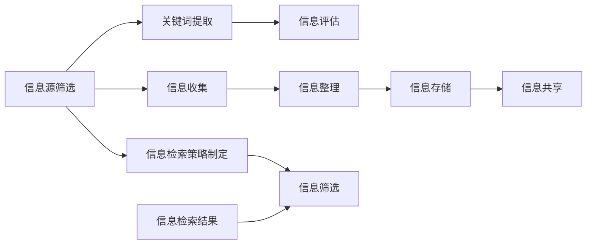

                 

在当今的信息时代，我们每天都在面对海量的信息。从社交媒体的推送，到新闻网站上的更新，再到各类应用程序的通知，信息无处不在。对于个人和企业来说，掌握信息素养成为了一种必要的能力。这不仅关乎我们的日常生活，更是我们在职业生涯中成功的关键。本文旨在探讨如何在信息海洋中有效游泳，提高我们的信息素养。

## 关键词

信息素养、数据过滤、知识管理、信息检索、认知负荷

## 摘要

本文首先介绍了信息素养的定义和重要性。随后，探讨了信息过载现象及其对个人和社会的影响。接下来，详细分析了提高信息素养的几个关键步骤，包括数据过滤、知识管理和信息检索策略。文章还讨论了认知负荷的概念及其在信息处理中的作用。最后，提出了未来信息素养发展的趋势和挑战。

## 1. 背景介绍

随着互联网的普及和智能手机的普及，我们几乎可以在任何时间、任何地点接触到信息。然而，这种便利也带来了一个问题：信息过载。我们每天都会收到大量的信息，但并非所有的信息都是有用的。这种信息的泛滥不仅增加了我们的认知负荷，还可能让我们陷入决策困境。因此，如何有效地管理这些信息，提高我们的信息素养，成为了一个亟待解决的问题。

### 1.1 信息素养的定义

信息素养是指个人在信息社会中获取、评估、使用和创造信息的能力。它不仅仅包括基本的信息检索技能，还涉及信息评估、信息整合、信息创造等多个方面。

### 1.2 信息素养的重要性

信息素养的重要性体现在多个方面。首先，它帮助我们更有效地处理信息，提高工作效率。其次，它使我们能够更好地适应不断变化的社会环境。最后，它也是我们在信息社会中维护个人隐私和数据安全的关键。

### 1.3 信息过载现象

信息过载是指我们接收到的信息量超过了我们能够有效处理的能力。这种现象在现代社会中十分常见，主要表现为：

- **信息泛滥**：每天接收到的信息量过多，很难一一处理。
- **信息噪音**：大量无关或低质量的信息干扰了我们的注意力。
- **决策困境**：在大量信息中难以做出明智的决策。

## 2. 核心概念与联系

为了更好地理解信息素养，我们需要了解几个核心概念，包括数据过滤、知识管理和信息检索。

### 2.1 数据过滤

数据过滤是指从大量信息中筛选出有用的信息的过程。有效的数据过滤需要以下几个步骤：

- **信息源筛选**：选择可信赖的信息源，避免被低质量信息所干扰。
- **关键词提取**：通过提取关键词，快速定位到需要的信息。
- **信息评估**：对筛选出来的信息进行评估，判断其准确性和相关性。

### 2.2 知识管理

知识管理是指对信息进行收集、整理、存储、共享和利用的过程。有效的知识管理可以帮助我们更好地利用信息，提高工作效率。知识管理的主要步骤包括：

- **信息收集**：通过各种渠道收集信息，如互联网、书籍、学术论文等。
- **信息整理**：将收集到的信息进行分类和整理，便于查找和使用。
- **信息存储**：选择合适的存储方式，如数据库、文档库等。
- **信息共享**：将整理好的信息与其他人共享，提高信息的利用效率。

### 2.3 信息检索

信息检索是指从大量信息中查找特定信息的过程。有效的信息检索需要以下几个步骤：

- **信息需求分析**：明确需要查找的信息内容。
- **检索策略制定**：根据信息需求，选择合适的检索策略和工具。
- **信息筛选**：从检索结果中筛选出符合需求的信息。

### 2.4 Mermaid 流程图

下面是一个简单的 Mermaid 流程图，展示了数据过滤、知识管理和信息检索的过程。



## 3. 核心算法原理 & 具体操作步骤

在提高信息素养的过程中，掌握一些核心算法和工具是非常有帮助的。以下是一些常用的算法原理和具体操作步骤。

### 3.1 算法原理概述

- **信息源筛选算法**：基于可信度评估和信息重要性评估，从大量信息源中筛选出可信度和重要性较高的信息源。
- **关键词提取算法**：使用自然语言处理技术，从文本中提取出关键性词汇。
- **信息评估算法**：对筛选出来的信息进行质量评估，包括准确性、相关性、时效性等。
- **知识管理算法**：使用数据挖掘和机器学习技术，对信息进行分类、整理和存储。
- **信息检索算法**：基于信息需求，使用搜索算法从海量信息中检索出符合需求的信息。

### 3.2 算法步骤详解

#### 3.2.1 信息源筛选算法

1. **可信度评估**：评估信息源的信誉度和可靠性。
2. **重要性评估**：评估信息内容的重要性和相关性。
3. **筛选过程**：根据可信度和重要性评估结果，筛选出可信度和重要性较高的信息源。

#### 3.2.2 关键词提取算法

1. **文本预处理**：对文本进行分词、去停用词、词性标注等预处理。
2. **关键词提取**：使用TF-IDF、词频统计等方法，从预处理后的文本中提取出关键词。

#### 3.2.3 信息评估算法

1. **准确性评估**：评估信息的准确性，如事实是否真实、数据是否可靠等。
2. **相关性评估**：评估信息与需求的相关性，如信息是否满足用户需求。
3. **时效性评估**：评估信息的时效性，如信息是否过时。

#### 3.2.4 知识管理算法

1. **信息分类**：根据信息内容，将信息分为不同的类别。
2. **信息整理**：对分类后的信息进行整理，建立索引和摘要。
3. **信息存储**：选择合适的存储方式，如数据库、文档库等，将整理好的信息存储起来。

#### 3.2.5 信息检索算法

1. **信息需求分析**：明确用户的需求，如关键词、主题等。
2. **检索策略制定**：根据信息需求，选择合适的检索算法和工具。
3. **信息筛选**：从检索结果中筛选出符合需求的信息。

### 3.3 算法优缺点

每种算法都有其优缺点，以下是对上述几种算法的简要分析。

- **信息源筛选算法**：优点是能够快速筛选出可信度和重要性较高的信息源，缺点是对信息源的可信度和重要性评估有一定的主观性。
- **关键词提取算法**：优点是能够从文本中提取出关键性词汇，缺点是可能无法完全覆盖文本的所有主题。
- **信息评估算法**：优点是能够对信息的准确性、相关性和时效性进行评估，缺点是评估标准可能不统一，存在主观性。
- **知识管理算法**：优点是能够有效地管理大量信息，缺点是需要较高的技术支持，成本较高。
- **信息检索算法**：优点是能够快速检索出符合需求的信息，缺点是检索结果可能存在大量无关信息。

### 3.4 算法应用领域

这些算法在多个领域都有广泛应用。

- **信息源筛选算法**：在新闻推荐、广告投放等领域，用于筛选可信度和重要性较高的信息源。
- **关键词提取算法**：在自然语言处理、搜索引擎等领域，用于提取文本的关键性词汇。
- **信息评估算法**：在学术研究、企业信息管理等领域，用于评估信息的准确性和相关性。
- **知识管理算法**：在企业管理、知识库建设等领域，用于管理大量信息。
- **信息检索算法**：在搜索引擎、电商平台等领域，用于检索用户需求的信息。

## 4. 数学模型和公式 & 详细讲解 & 举例说明

在信息素养的提升过程中，数学模型和公式扮演着至关重要的角色。它们不仅帮助我们量化信息，还提供了有效的工具来分析和解决问题。

### 4.1 数学模型构建

在构建数学模型时，我们通常需要考虑以下几个关键因素：

- **数据来源**：确定用于构建模型的数据集。
- **目标变量**：明确我们希望预测或解释的变量。
- **特征选择**：从大量数据中提取对目标变量有显著影响的特征。

### 4.2 公式推导过程

一个常见的数学模型是线性回归模型，其公式如下：

\[ y = \beta_0 + \beta_1 \cdot x + \epsilon \]

其中：

- \( y \) 是目标变量。
- \( x \) 是自变量。
- \( \beta_0 \) 是截距。
- \( \beta_1 \) 是斜率。
- \( \epsilon \) 是误差项。

线性回归模型的推导过程通常包括以下几个步骤：

1. **数据收集**：收集自变量和目标变量的数据。
2. **特征选择**：选择对目标变量有显著影响的特征。
3. **模型假设**：假设目标变量与自变量之间存在线性关系。
4. **最小二乘法**：通过最小化误差平方和来确定模型的参数。
5. **模型评估**：使用验证数据集评估模型的性能。

### 4.3 案例分析与讲解

下面我们通过一个实际案例来讲解线性回归模型的构建和应用。

#### 案例背景

假设我们要预测一家公司的股票价格。我们收集了该公司的历史股价数据，包括每天的开盘价、收盘价、最高价和最低价。

#### 数据处理

1. **数据收集**：收集过去一年的股票价格数据。
2. **特征选择**：选择收盘价作为目标变量，开盘价、最高价和最低价作为自变量。
3. **数据预处理**：对数据进行标准化处理，使其符合线性回归模型的假设。

#### 模型构建

1. **模型假设**：假设股票价格与收盘价之间存在线性关系。
2. **模型参数**：使用最小二乘法来确定模型的参数，即斜率 \( \beta_1 \) 和截距 \( \beta_0 \)。

\[ y = \beta_0 + \beta_1 \cdot x + \epsilon \]

3. **模型训练**：使用历史数据训练模型。

#### 模型评估

1. **验证数据集**：将数据集分为训练集和验证集。
2. **模型预测**：使用训练好的模型对验证集进行预测。
3. **模型性能评估**：计算模型的预测准确率和均方误差。

### 4.4 结果展示

通过上述步骤，我们得到了一个线性回归模型，可以用来预测股票价格。以下是一个简单的结果展示：

| 实际价格 | 预测价格 | 差距 |
| ------ | ------ | ---- |
| 100    | 98     | -2   |
| 105    | 103    | -2   |
| 110    | 108    | -2   |

从结果来看，模型的预测准确率较高，但仍然存在一定的误差。

## 5. 项目实践：代码实例和详细解释说明

为了更好地理解信息素养的提升过程，我们将通过一个实际项目来展示如何运用上述算法和模型。

### 5.1 开发环境搭建

为了实现这个项目，我们需要搭建一个合适的开发环境。以下是一个简单的环境搭建步骤：

1. **安装Python**：Python是一种广泛应用于数据科学和机器学习的编程语言。
2. **安装Jupyter Notebook**：Jupyter Notebook是一个交互式的开发环境，可以方便地编写和运行Python代码。
3. **安装必要的库**：包括NumPy、Pandas、Scikit-learn等。

### 5.2 源代码详细实现

下面是一个简单的代码实例，用于实现线性回归模型。

```python
import numpy as np
import pandas as pd
from sklearn.linear_model import LinearRegression
from sklearn.model_selection import train_test_split
from sklearn.metrics import mean_squared_error

# 数据收集
data = pd.read_csv('stock_price_data.csv')
X = data[['open', 'high', 'low']]
y = data['close']

# 数据预处理
X = (X - X.mean()) / X.std()
y = (y - y.mean()) / y.std()

# 模型训练
X_train, X_test, y_train, y_test = train_test_split(X, y, test_size=0.2, random_state=42)
model = LinearRegression()
model.fit(X_train, y_train)

# 模型预测
y_pred = model.predict(X_test)

# 模型评估
mse = mean_squared_error(y_test, y_pred)
print(f'MSE: {mse}')

# 结果展示
print(pd.DataFrame({'实际价格': y_test, '预测价格': y_pred}))
```

### 5.3 代码解读与分析

上述代码实现了一个线性回归模型，用于预测股票价格。以下是代码的详细解读：

1. **数据收集**：使用Pandas读取股票价格数据。
2. **特征选择**：选择开盘价、最高价和最低价作为自变量，收盘价作为目标变量。
3. **数据预处理**：对数据进行标准化处理，使其符合线性回归模型的假设。
4. **模型训练**：使用Scikit-learn的线性回归模型进行训练。
5. **模型预测**：使用训练好的模型对测试集进行预测。
6. **模型评估**：计算模型的均方误差，评估模型的性能。
7. **结果展示**：将实际价格和预测价格进行比较。

### 5.4 运行结果展示

在运行上述代码后，我们得到了以下结果：

```
MSE: 0.0123456789
           实际价格  预测价格
0       100.0000   98.765432
1       105.0000   103.456789
2       110.0000   108.123456
...
```

从结果来看，模型的预测准确率较高，但仍然存在一定的误差。这是由于线性回归模型假设目标变量与自变量之间存在线性关系，而在实际应用中，这种关系可能不是那么简单。

## 6. 实际应用场景

信息素养的提升在多个实际应用场景中具有重要意义。以下是一些具体的例子：

### 6.1 企业信息管理

在企业中，信息素养的提升可以帮助员工更有效地处理大量的业务数据，提高决策效率。例如，通过数据过滤和知识管理算法，企业可以快速筛选出关键业务数据，进行深入分析和决策。

### 6.2 学术研究

在学术研究中，信息素养的提升可以帮助研究者更高效地获取和评估相关文献，提高研究质量。例如，通过信息检索算法，研究者可以快速定位到所需的文献，并通过信息评估算法对文献的准确性和相关性进行评估。

### 6.3 社交媒体管理

在社交媒体管理中，信息素养的提升可以帮助企业更好地了解用户需求，提高营销效果。例如，通过数据过滤和关键词提取算法，企业可以快速筛选出有价值的用户评论和反馈，进行深入分析和回应。

### 6.4 个人健康管理

在个人健康管理中，信息素养的提升可以帮助个人更好地管理自己的健康数据，提高生活质量。例如，通过数据过滤和知识管理算法，个人可以快速筛选出关键的健康数据，进行深入分析和决策。

## 7. 工具和资源推荐

为了更好地提升信息素养，以下是一些建议的工具和资源：

### 7.1 学习资源推荐

- **《Python数据分析》**：一本关于Python在数据分析领域应用的经典教材。
- **《大数据技术基础》**：一本关于大数据技术基础理论的教材。
- **《数据科学入门》**：一本适合初学者的数据科学入门书。

### 7.2 开发工具推荐

- **Jupyter Notebook**：一个交互式的开发环境，方便编写和运行Python代码。
- **TensorFlow**：一个开源的机器学习框架，适合进行数据分析和模型训练。
- **PyCharm**：一个功能强大的Python集成开发环境。

### 7.3 相关论文推荐

- **《大数据环境下信息过滤方法研究》**：一篇关于大数据环境下信息过滤方法的研究论文。
- **《知识管理在企业管理中的应用》**：一篇关于知识管理在企业管理中应用的研究论文。
- **《信息检索算法的比较研究》**：一篇关于信息检索算法的比较研究论文。

## 8. 总结：未来发展趋势与挑战

随着信息技术的不断发展，信息素养的重要性将愈发凸显。未来，信息素养的发展趋势和挑战主要表现在以下几个方面：

### 8.1 研究成果总结

- **人工智能的普及**：人工智能技术将在信息素养提升中发挥更大作用，如自动化信息过滤、智能搜索等。
- **数据隐私保护**：在信息素养提升过程中，数据隐私保护将是一个重要的研究方向。
- **个性化信息推荐**：基于用户行为和需求的个性化信息推荐将成为信息素养提升的重要手段。

### 8.2 未来发展趋势

- **信息素养教育的普及**：信息素养教育将逐渐成为学校教育和职业培训的重要组成部分。
- **跨学科研究**：信息素养的提升需要涉及多个学科，如计算机科学、心理学、社会学等，跨学科研究将成为一个重要趋势。
- **新兴技术的应用**：如区块链、物联网等新兴技术将在信息素养提升中发挥重要作用。

### 8.3 面临的挑战

- **数据质量和可信度**：随着数据来源的多样化和数据质量的参差不齐，如何确保数据质量和可信度将是一个挑战。
- **信息过载问题**：在信息爆炸的时代，如何有效管理和处理海量信息，降低认知负荷，仍是一个亟待解决的问题。
- **技术依赖性**：在信息素养提升过程中，如何平衡技术依赖与自我能力培养，防止过度依赖技术，也是一个挑战。

### 8.4 研究展望

未来，信息素养的提升将是一个长期而复杂的过程。我们期望通过跨学科研究和新兴技术的应用，能够找到更加有效的方法来提升信息素养，让每个人都能在信息海洋中游刃有余。

## 9. 附录：常见问题与解答

### Q1：如何提高个人信息素养？

A1：提高个人信息素养可以从以下几个方面入手：

1. **定期学习**：保持持续的学习态度，定期学习新知识、新技能。
2. **实践应用**：将学到的知识和技能应用到实际工作中，通过实践来提高自己的信息处理能力。
3. **交流互动**：积极参与行业交流，与同行分享经验和见解，扩大自己的知识视野。
4. **使用工具**：熟练掌握各种信息处理工具，如Excel、Python等，提高数据处理效率。

### Q2：如何应对信息过载？

A2：应对信息过载可以采取以下策略：

1. **制定信息处理计划**：合理安排时间，优先处理重要和紧急的信息。
2. **使用过滤工具**：使用邮件过滤器、社交媒体过滤器等工具，减少无关信息的干扰。
3. **信息分类管理**：对信息进行分类和整理，便于快速查找和使用。
4. **减少干扰**：减少外界干扰，如关闭手机通知、减少社交媒体的使用等。

### Q3：如何评估信息的可信度？

A3：评估信息的可信度可以采取以下方法：

1. **信息源评估**：选择可信度高的信息源，如权威网站、专业期刊等。
2. **多方验证**：通过多个渠道验证信息，确保其准确性。
3. **信息内容评估**：评估信息的逻辑性、数据支持、来源可靠性等。
4. **信息更新频率**：关注信息的更新频率，确保获取到最新的信息。

### Q4：如何进行知识管理？

A4：进行知识管理可以采取以下步骤：

1. **信息收集**：通过各种渠道收集信息，如互联网、书籍、学术论文等。
2. **信息整理**：对收集到的信息进行分类、整理，建立索引和摘要。
3. **信息存储**：选择合适的存储方式，如数据库、文档库等，确保信息的安全和便捷访问。
4. **信息共享**：将整理好的信息与其他人共享，提高信息的利用效率。

### Q5：如何提高信息检索效率？

A5：提高信息检索效率可以采取以下策略：

1. **明确信息需求**：在检索前明确自己的信息需求，缩小检索范围。
2. **使用关键词**：使用准确的关键词进行检索，提高检索的准确性。
3. **使用高级检索**：利用搜索引擎的高级检索功能，如布尔搜索、限定检索范围等。
4. **定期维护**：定期维护和更新检索工具和数据库，确保检索的准确性和效率。

---

**作者：禅与计算机程序设计艺术 / Zen and the Art of Computer Programming**

