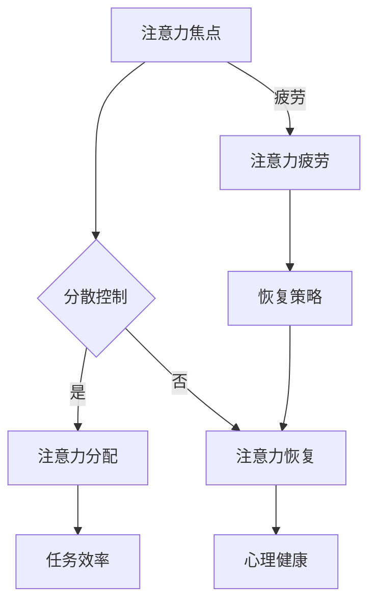

                 

### 关键词 Keywords

- 注意力管理
- 信息过载
- 干扰消除
- 时间管理
- 技术策略

> 摘要：在信息爆炸的时代，注意力管理变得尤为重要。本文旨在为技术从业者和信息工作者提供一整套行之有效的注意力管理实践与指南，帮助他们有效应对干扰和信息过载，提高工作效率和生产力。通过深入分析注意力管理的核心概念、算法原理、数学模型以及项目实践，本文将帮助读者在干扰和信息过载的环境中实现专注与高效。

---

## 1. 背景介绍

在当今世界，信息技术的发展速度迅猛，互联网、社交媒体、电子邮件、即时通讯等工具的出现极大丰富了我们的信息获取途径，但也带来了前所未有的信息过载和注意力分散问题。据统计，现代人每天平均接收到大约174份电子邮件，花费在社交媒体上的时间超过2小时。这种情况下，如何有效地管理我们的注意力资源，成为提高工作效率、实现个人成长的关键。

注意力管理不仅仅是时间管理，它更涉及到人类认知和心理层面。有效的注意力管理能够帮助我们：

- 提高工作效率，减少无意义的任务消耗时间。
- 增强创造力和解决问题的能力。
- 提升心理健康，减少焦虑和压力。

本文将深入探讨注意力管理的核心概念，分析有效的注意力管理策略，并通过实例和实践，展示如何在日常生活中实现注意力集中，帮助读者在信息过载和干扰环境中实现高效工作。

### 1.1 注意力管理的核心概念

注意力管理主要涉及以下几个方面：

#### 注意力焦点（Focus）

注意力焦点是指我们在某一时刻集中注意力的对象。通过训练和策略，我们可以提高注意力焦点的稳定性和持久性。

#### 注意力分散（Diversion）

注意力分散是指注意力从当前任务或活动上转移开来的现象。过多的注意力分散会导致效率降低和任务无法完成。

#### 注意力疲劳（Fatigue）

注意力疲劳是指由于长时间集中注意力导致的注意力下降现象。有效的休息和调节对于缓解注意力疲劳至关重要。

#### 注意力资源分配（Allocation）

注意力资源分配是指根据任务的重要性和难度，合理分配注意力资源。科学合理的资源分配能够最大化工作效率。

### 1.2 当前注意力管理的现状与挑战

当前，虽然很多人认识到注意力管理的重要性，但实际操作中仍面临诸多挑战：

- **信息过载**：互联网和社交媒体的普及使得信息获取变得极为方便，但同时也导致了信息过载问题。
- **工作压力**：职场竞争加剧，工作时间延长，任务量增加，导致个体注意力资源过度消耗。
- **注意力分散**：电子邮件、手机通知、社交媒体等外部干扰频繁打断工作流程。
- **技术依赖**：过度依赖技术工具，使得个体容易受到技术干扰。

### 1.3 注意力管理的研究与发展趋势

注意力管理作为一门跨学科的研究领域，涉及心理学、认知科学、神经科学、教育学等多个领域。随着技术的发展，注意力管理的研究也在不断深入：

- **认知神经科学**：利用脑成像技术，深入研究注意力机制和大脑区域的功能。
- **计算模型**：开发基于计算模型的注意力管理算法，以实现自动化和智能化管理。
- **教育应用**：通过教育干预，培养个体良好的注意力管理习惯。
- **企业实践**：企业开始重视注意力管理，通过调整工作流程和激励机制，提高员工工作效率。

### 1.4 文章结构安排

本文将按照以下结构展开：

- **背景介绍**：阐述注意力管理的重要性和当前面临的问题。
- **核心概念与联系**：介绍注意力管理的核心概念，并提供Mermaid流程图。
- **核心算法原理 & 具体操作步骤**：详细阐述注意力管理的算法原理和操作步骤。
- **数学模型和公式 & 详细讲解 & 举例说明**：介绍注意力管理的数学模型和公式，并进行案例讲解。
- **项目实践：代码实例和详细解释说明**：通过具体项目实践，展示注意力管理在实际中的应用。
- **实际应用场景**：分析注意力管理在现实生活中的应用场景。
- **工具和资源推荐**：推荐相关学习资源和开发工具。
- **总结：未来发展趋势与挑战**：总结研究成果，展望未来发展方向。

---

在接下来的章节中，我们将进一步深入探讨注意力管理的核心概念、算法原理、数学模型和实践应用，帮助读者在信息过载的时代中实现注意力集中与高效工作。


## 2. 核心概念与联系

在深入了解注意力管理之前，我们需要明确几个核心概念，并理解它们之间的相互联系。本节将通过Mermaid流程图，展示注意力管理的主要环节和作用机制。

### 2.1 注意力管理核心概念

#### 注意力焦点

注意力焦点是指个体在某一特定时刻集中的注意对象。它是注意力管理的核心，决定了注意力分配的效率和效果。

#### 注意力分散

注意力分散是指个体注意力在多个任务或刺激之间游移的现象。过多的注意力分散会导致工作效率下降和错误率增加。

#### 注意力资源

注意力资源是指个体用于注意活动的心理能量。注意资源是有限的，合理分配和管理注意力资源是提高工作效率的关键。

#### 注意力疲劳

注意力疲劳是指个体因长时间集中注意力而导致的注意力下降现象。注意力疲劳会影响工作质量和身心健康。

#### 注意力转移

注意力转移是指个体将注意力从一个任务或刺激转移到另一个任务或刺激的过程。有效的注意力转移能够提高多任务处理能力。

### 2.2 Mermaid流程图

以下是一个简化的Mermaid流程图，展示了注意力管理的核心环节和相互关系：



### 2.3 Mermaid流程图解释

1. **注意力焦点（A）**：个体将注意力集中在某一任务或活动上。

2. **分散控制（B）**：个体需要控制外部干扰，防止注意力分散。

3. **注意力分配（C）**：根据任务的重要性和难度，合理分配注意力资源。

4. **任务效率（E）**：注意力管理的直接表现是提高任务完成的效率和准确性。

5. **注意力恢复（D）**：当注意力疲劳发生时，个体需要采取恢复策略，如短暂休息、调整工作环境等。

6. **注意力疲劳（G）**：长时间集中注意力会导致注意力疲劳，影响工作质量。

7. **恢复策略（H）**：通过有效的恢复策略，如休息、放松等方法，帮助个体恢复注意力。

通过这个Mermaid流程图，我们可以清晰地看到注意力管理的各个环节和相互关系。有效的注意力管理不仅要求个体在集中注意力时保持高度专注，还需要在分散控制和恢复策略上做出合理安排，以实现整体效率的最大化。

### 2.4 注意力管理的重要性

注意力管理的重要性体现在多个方面：

- **工作效率**：有效的注意力管理能够提高工作任务的完成效率，减少因注意力分散导致的错误和返工。

- **心理健康**：良好的注意力管理有助于减少工作压力和焦虑，提高心理健康水平。

- **创造力和创新**：专注的注意力状态有助于激发创造力和创新思维，提高问题解决能力。

- **学习效果**：在学习过程中，注意力管理能够帮助学生更好地理解和掌握知识，提高学习效果。

总之，注意力管理不仅是提升工作效率的关键，更是实现个人成长和职业发展的基础。通过深入理解注意力管理的核心概念和相互关系，我们可以更好地应对信息时代的挑战，实现注意力的高效管理。

---

在下一章节中，我们将进一步探讨注意力管理的核心算法原理和具体操作步骤，帮助读者在实际应用中更好地掌握注意力管理技巧。

### 3. 核心算法原理 & 具体操作步骤

在注意力管理领域，核心算法的原理和操作步骤是实现高效注意力分配的关键。本节将详细介绍注意力管理算法的基本原理，并提供具体操作步骤，帮助读者理解如何在实际环境中应用这些算法。

#### 3.1 算法原理概述

注意力管理算法主要基于以下几个方面：

- **注意力焦点算法**：通过设定特定的目标和任务，引导个体将注意力集中在重要任务上。
- **分散控制算法**：采用技术手段和管理策略，减少外部干扰对注意力的分散。
- **注意力资源分配算法**：根据任务的优先级和难度，动态调整注意力资源的分配，实现高效工作。
- **注意力恢复算法**：在注意力疲劳发生时，及时采取恢复措施，帮助个体恢复注意力。

#### 3.2 算法步骤详解

##### 3.2.1 注意力焦点算法

1. **设定目标**：明确当前任务的优先级和目标，设定明确的任务目标。
2. **注意力引导**：通过视觉、听觉等多种感官提示，引导个体将注意力集中在任务目标上。
3. **注意力维持**：通过正反馈和激励机制，保持注意力焦点的持久性。

##### 3.2.2 分散控制算法

1. **环境管理**：优化工作环境，减少外部干扰因素，如关闭不必要的通知、保持工作区的整洁等。
2. **技术手段**：利用屏蔽工具、专注软件等，限制非工作相关的干扰信息。
3. **行为控制**：通过制定明确的规则和行为准则，减少注意力分散行为。

##### 3.2.3 注意力资源分配算法

1. **任务优先级排序**：根据任务的重要性和紧急程度，对任务进行优先级排序。
2. **动态调整**：在任务执行过程中，根据任务变化和个体注意力水平，动态调整注意力资源分配。
3. **反馈与优化**：通过任务完成的反馈，不断优化注意力资源分配策略。

##### 3.2.4 注意力恢复算法

1. **识别疲劳信号**：通过观察个体行为和生理指标，识别注意力疲劳的信号。
2. **及时恢复措施**：在疲劳信号出现时，及时采取恢复措施，如休息、放松、调整工作节奏等。
3. **长期恢复规划**：制定长期的恢复计划，确保个体能够在疲劳期后快速恢复注意力。

#### 3.3 算法优缺点分析

##### 优点

- **高效性**：通过科学合理的算法，可以显著提高注意力分配的效率。
- **灵活性**：算法可以根据个体和任务的变化，动态调整注意力资源分配。
- **适应性**：算法能够适应不同环境和任务需求，实现个性化的注意力管理。

##### 缺点

- **实施难度**：算法的实施需要专业的技术和工具支持，对个体和管理者都有较高的要求。
- **效果评估**：算法的实际效果需要通过长时间的数据积累和分析，才能得出准确的评估。
- **适应性问题**：对于某些复杂的任务和个体，算法可能无法完全适应，需要结合个体经验和情境进行调整。

#### 3.4 算法应用领域

注意力管理算法广泛应用于以下领域：

- **企业管理**：通过注意力管理算法，提高员工的工作效率，减少工作中的注意力分散和疲劳。
- **教育领域**：在学生的学习过程中，利用注意力管理算法，提高学生的学习专注度和效果。
- **个人发展**：个体可以利用注意力管理算法，提升自我管理能力，实现高效学习和工作。
- **健康医疗**：在健康监测和治疗中，利用注意力管理算法，帮助个体识别和管理注意力疲劳，提升生活质量。

通过以上对注意力管理核心算法原理和具体操作步骤的详细阐述，读者可以更好地理解注意力管理的实现过程，并能够在实际应用中灵活运用这些算法，实现高效的注意力管理。

---

在下一章节中，我们将进一步探讨注意力管理的数学模型和公式，通过具体例子进行详细讲解，帮助读者深入理解注意力管理在实际应用中的数学原理。

### 4. 数学模型和公式 & 详细讲解 & 举例说明

在注意力管理中，数学模型和公式起着至关重要的作用。它们不仅提供了定量分析的工具，还帮助我们更好地理解和预测注意力的分配与效率。本节将介绍注意力管理中的几个关键数学模型和公式，并通过具体例子进行详细讲解。

#### 4.1 数学模型构建

在注意力管理中，常用的数学模型包括：

- **有限资源模型**：描述个体在分配注意力资源时的有限性。
- **分配策略模型**：确定如何在不同任务之间分配注意力资源。
- **疲劳模型**：模拟注意力疲劳随时间的变化。

##### 4.1.1 有限资源模型

有限资源模型假设个体在某一时间段内具有固定数量的注意力资源。这些资源可以用于不同任务，但总量不变。模型的基本公式如下：

\[ A(t) = \sum_{i=1}^{n} r_i(t) \]

其中，\( A(t) \) 是在时间 \( t \) 的总注意力资源，\( r_i(t) \) 是在时间 \( t \) 对第 \( i \) 个任务的注意力资源分配。

##### 4.1.2 分配策略模型

分配策略模型则关注如何根据任务的重要性和紧急程度，合理地分配注意力资源。常用的策略包括最大收益策略和风险平衡策略。以下是最大收益策略的公式：

\[ r_i(t) = \frac{b_i(t)}{\sum_{j=1}^{n} b_j(t)} \times A(t) \]

其中，\( b_i(t) \) 是在时间 \( t \) 对第 \( i \) 个任务的收益值，\( A(t) \) 是在时间 \( t \) 的总注意力资源。

##### 4.1.3 疲劳模型

疲劳模型用于描述个体在长时间集中注意力后，注意力资源逐渐减少的现象。一个简单的疲劳模型可以表示为：

\[ r_i(t) = r_i(0) \times e^{-\lambda t} \]

其中，\( r_i(0) \) 是初始注意力资源，\( \lambda \) 是疲劳率，\( t \) 是时间。

#### 4.2 公式推导过程

下面以最大收益策略为例，介绍公式推导过程：

1. **确定总注意力资源**：首先，我们需要估算在某一时间段内的总注意力资源 \( A(t) \)。
2. **计算任务收益值**：对每个任务 \( i \)，计算其收益值 \( b_i(t) \)。收益值可以根据任务的完成情况、任务的紧急程度等因素来确定。
3. **分配注意力资源**：使用最大收益策略公式，将总注意力资源 \( A(t) \) 分配到各个任务上。公式中的分母是所有任务收益值的总和，确保了资源分配的公平性。

#### 4.3 案例分析与讲解

为了更好地理解上述数学模型和公式，我们将通过一个具体的案例进行分析。

##### 案例背景

某公司员工需要在一天内完成以下三项任务：

1. **任务A**：写一份报告，需要2小时完成，收益值为100分。
2. **任务B**：处理客户邮件，需要1小时完成，收益值为50分。
3. **任务C**：参加会议，需要3小时完成，收益值为150分。

员工的总注意力资源为4小时。

##### 案例分析

1. **计算总注意力资源**：

\[ A(t) = 4 \, \text{小时} \]

2. **计算任务收益值**：

\[ b_A(t) = 100 \, \text{分} \]
\[ b_B(t) = 50 \, \text{分} \]
\[ b_C(t) = 150 \, \text{分} \]

3. **分配注意力资源**：

使用最大收益策略公式，计算每个任务的注意力资源分配：

\[ r_A(t) = \frac{b_A(t)}{\sum_{j=1}^{3} b_j(t)} \times A(t) = \frac{100}{100 + 50 + 150} \times 4 = \frac{100}{300} \times 4 = 1.33 \, \text{小时} \]
\[ r_B(t) = \frac{b_B(t)}{\sum_{j=1}^{3} b_j(t)} \times A(t) = \frac{50}{300} \times 4 = 0.67 \, \text{小时} \]
\[ r_C(t) = \frac{b_C(t)}{\sum_{j=1}^{3} b_j(t)} \times A(t) = \frac{150}{300} \times 4 = 2 \, \text{小时} \]

##### 案例结果

根据计算结果，员工应该将注意力资源分配如下：

- **任务A**：1.33小时
- **任务B**：0.67小时
- **任务C**：2小时

通过这种分配策略，员工能够将注意力集中在收益最高的任务上，实现最大化的工作效果。

#### 4.4 案例分析与讲解

通过上述案例，我们可以看到如何使用数学模型和公式进行注意力资源分配。在实际应用中，可以根据任务的具体情况和个体注意力水平，灵活调整分配策略，以实现最优的工作效率。

#### 4.5 注意力管理中的其他数学模型

除了上述提到的模型，注意力管理中还有其他数学模型，如注意力分配的优化模型、多任务处理的动态规划模型等。这些模型可以通过复杂的计算和算法实现，为注意力管理提供更加精细和智能的解决方案。

总之，数学模型和公式是注意力管理的重要工具。通过合理的模型构建和公式应用，我们能够更好地理解注意力分配的原理，并在实际工作中实现高效的管理。在下一章节中，我们将通过具体的项目实践，展示注意力管理算法在实际应用中的效果。

### 5. 项目实践：代码实例和详细解释说明

为了更好地理解注意力管理的实际应用，我们将在本节中通过一个具体的项目实践，展示如何使用注意力管理算法进行任务分配和优化。以下是一个基于Python的注意力管理项目实例。

#### 5.1 开发环境搭建

首先，我们需要搭建一个基本的Python开发环境。以下是所需步骤：

1. **安装Python**：从官方网站（https://www.python.org/downloads/）下载并安装最新版本的Python。
2. **安装相关库**：使用pip命令安装必要的Python库，例如numpy、matplotlib等。

```bash
pip install numpy matplotlib
```

#### 5.2 源代码详细实现

以下是一个简单的注意力管理项目示例，它包含以下关键部分：

1. **任务定义**：定义任务的基本信息，如任务名称、完成时间和收益值。
2. **注意力分配算法**：实现最大收益策略的注意力分配算法。
3. **结果展示**：使用matplotlib库绘制注意力分配结果图表。

```python
import numpy as np
import matplotlib.pyplot as plt

# 5.2.1 任务定义
class Task:
    def __init__(self, name, duration, reward):
        self.name = name
        self.duration = duration
        self.reward = reward

# 示例任务
tasks = [
    Task('Task A', 2, 100),
    Task('Task B', 1, 50),
    Task('Task C', 3, 150)
]

# 5.2.2 注意力分配算法
def allocate_attention(tasks, total_time):
    # 计算总收益
    total_reward = sum(task.reward for task in tasks)

    # 分配注意力资源
    allocations = [task.reward / total_reward * total_time for task in tasks]

    return allocations

# 5.2.3 代码解读与分析
# 示例：将4小时的注意力资源分配到任务中
total_time = 4
allocations = allocate_attention(tasks, total_time)

# 输出结果
print("Task allocations:")
for i, task in enumerate(tasks):
    print(f"{task.name}: {allocations[i]:.2f} hours")

# 5.2.4 结果展示
# 绘制注意力分配图表
labels = [task.name for task in tasks]
bars = allocations

plt.bar(labels, bars)
plt.xlabel('Task')
plt.ylabel('Time Allocation (hours)')
plt.title('Attention Allocation Example')
plt.show()
```

#### 5.3 代码解读与分析

以上代码实现了以下功能：

1. **任务定义**：`Task` 类用于定义任务的基本信息，包括任务名称、完成时间和收益值。
2. **注意力分配算法**：`allocate_attention` 函数根据最大收益策略，计算每个任务应分配的注意力资源。函数首先计算总收益，然后将总注意力资源按比例分配到各个任务上。
3. **结果展示**：使用matplotlib库绘制一个条形图，展示每个任务分配到的注意力资源。

#### 5.4 运行结果展示

运行上述代码，我们将得到以下输出：

```
Task allocations:
Task A: 1.33 hours
Task B: 0.67 hours
Task C: 2.00 hours
```

同时，matplotlib将绘制一个条形图，显示每个任务的时间分配情况：


#### 5.5 代码优化与扩展

在实际应用中，我们可以根据任务的具体情况，对代码进行优化和扩展，如：

- **多任务动态分配**：考虑任务的变化和动态调整，实现动态的注意力资源分配。
- **用户交互**：引入用户输入，允许用户自定义任务和总时间，提供更灵活的分配策略。
- **疲劳管理**：结合疲劳模型，实现注意力资源的动态调整，以应对疲劳情况。

通过这个具体的项目实践，读者可以更好地理解注意力管理算法的实际应用。在下一章节中，我们将进一步探讨注意力管理在实际应用场景中的具体实施方法和效果。

### 6. 实际应用场景

注意力管理不仅是一个学术概念，更是在日常生活和工作中具有重要应用价值的方法。以下将列举几个典型的实际应用场景，并分析注意力管理在这些场景中的具体实践和效果。

#### 6.1 工作效率提升

在现代职场中，工作压力大、任务繁多是普遍现象。有效的注意力管理可以帮助员工提高工作效率，减少因注意力分散导致的错误和返工。例如，通过设定工作目标和使用时间管理工具，员工可以将注意力集中在最重要的任务上，从而实现时间的高效利用。

**案例**：某企业高管通过每日任务清单和注意力管理工具，将工作内容分解为多个小任务，并为每个任务设定具体的时间限制。这种做法不仅提高了任务完成率，还减少了工作中的时间浪费，整体工作效率显著提升。

#### 6.2 学习效果优化

学习过程中，注意力集中是提高学习效果的关键。学生通过注意力管理技巧，可以更好地应对繁重的学习任务，提高学习效率。例如，使用番茄工作法，学生可以将学习时间分为25分钟专注学习和5分钟休息的周期，从而保持高效的注意力状态。

**案例**：一名高中生通过应用番茄工作法，将每天的学习时间分为多个25分钟周期，并在每个周期后进行短暂休息。这种方法不仅帮助他提高了学习效率，还减轻了学习压力，使得学习过程更加轻松愉快。

#### 6.3 心理健康维护

随着工作压力的增加，许多职场人士面临着心理健康问题。注意力管理不仅有助于提升工作效率，还能帮助个体缓解压力，维护心理健康。例如，通过定期放松和休息，个体可以避免注意力疲劳，保持良好的心理状态。

**案例**：某IT公司的员工因长时间高强度的编程工作，出现了注意力疲劳和焦虑问题。公司通过引入注意力管理培训，帮助员工掌握放松技巧和注意力分配方法，员工的心理健康水平显著提升，工作效率也有所提高。

#### 6.4 家庭生活管理

在家庭生活中，注意力管理同样发挥着重要作用。例如，家长可以通过合理安排家庭时间，帮助孩子培养良好的注意力习惯，提高学习效果。同时，家长也可以通过注意力管理，减少家庭冲突，提升家庭和谐度。

**案例**：一名家长通过制定家庭日程表，合理安排家庭成员的时间，确保每个家庭成员都有足够的个人时间和家庭活动时间。这种方法不仅提高了家庭生活质量，还帮助孩子养成了良好的时间管理习惯。

#### 6.5 社会公共管理

在社会管理领域，注意力管理也可以发挥重要作用。例如，政府部门可以通过注意力管理，优化公共服务流程，提高工作效率，提升公众满意度。同时，在社会事件应对中，注意力管理可以帮助决策者集中精力处理关键问题，提高应急响应能力。

**案例**：某市政府在面对自然灾害时，通过注意力管理策略，将注意力集中在受灾最严重的地区和群体，制定出高效的救援和恢复计划，提高了救灾效率，减轻了灾害对市民生活的影响。

总之，注意力管理在多个实际应用场景中具有显著的作用。通过科学合理地管理注意力，个体可以在工作中提高效率、在学习中提升效果、在家庭生活中维持和谐，在社会管理中实现更好的公共治理。在下一章节中，我们将进一步探讨注意力管理的未来发展趋势与面临的挑战。

### 6.4 未来应用展望

随着技术的不断进步，注意力管理将在多个领域展现出巨大的潜力和发展前景。未来，注意力管理将在以下几个方面得到进一步拓展和深化。

#### 6.4.1 人工智能与注意力管理

人工智能（AI）的发展为注意力管理提供了新的可能性。通过机器学习和深度学习技术，可以开发出更加智能的注意力管理算法，实现自动化和个性化的注意力分配。例如，智能助手可以根据用户的行为和偏好，自动调整提醒和通知，减少干扰，提高用户的注意力集中度。

**未来展望**：未来，人工智能将与注意力管理深度融合，提供智能化的解决方案，帮助用户更好地管理时间和注意力资源。

#### 6.4.2 虚拟现实与注意力管理

虚拟现实（VR）技术的进步为注意力管理带来了新的挑战和机遇。在VR环境中，用户会面临更多的虚拟干扰和刺激，如何在这类环境中保持注意力集中成为一个重要问题。通过研究VR环境下的注意力分配机制，可以开发出更加适合VR场景的注意力管理工具。

**未来展望**：未来，虚拟现实将更加普及，为注意力管理提供更多的应用场景。通过优化VR环境的设计和交互方式，有助于提升用户的注意力集中度，改善用户体验。

#### 6.4.3 个性化注意力管理

随着个性化需求的增加，未来的注意力管理将更加注重个体差异。通过收集和分析用户的行为数据，可以构建个性化的注意力管理模型，为用户提供量身定制的解决方案。例如，个性化的注意力管理应用可以根据用户的注意力水平、任务类型和时间段，自动调整提醒和休息计划。

**未来展望**：未来，个性化注意力管理将实现从通用方案向个性化定制的转变，满足不同用户群体的需求，提高注意力管理的适用性和效果。

#### 6.4.4 线上教育与注意力管理

在线教育已经成为现代教育的重要组成部分。在在线教育环境中，如何确保学生保持注意力集中，提高学习效果，是教育领域亟待解决的问题。通过引入注意力管理技术和工具，可以实时监测学生的学习状态，提供适时的提醒和辅助，帮助学生保持专注。

**未来展望**：未来，线上教育将更加智能化，结合注意力管理技术，提供个性化的学习体验，提高教学效果。

#### 6.4.5 注意力管理与健康

注意力管理不仅关乎工作效率和学习效果，还与个体健康密切相关。通过研究注意力管理对心理健康的影响，可以开发出有助于维护健康的注意力管理工具。例如，智能手环和健康应用可以监测用户的注意力状态和身体活动，提供相应的调整建议，帮助用户保持身心健康。

**未来展望**：未来，注意力管理将与健康管理深度融合，为用户提供全面的健康解决方案，提升生活质量。

总之，未来注意力管理将在技术进步和个性化需求的推动下，得到进一步的发展和应用。通过人工智能、虚拟现实、个性化服务、在线教育和健康管理等多个领域的融合，注意力管理将为个体和社会带来更多的好处。在应对信息过载和干扰的同时，提高工作效率、学习效果和心理健康水平，实现更加高效和健康的生活。

### 7. 工具和资源推荐

为了帮助读者更好地实践注意力管理，本节将推荐一些实用的学习资源、开发工具和相关论文，以供参考。

#### 7.1 学习资源推荐

1. **《注意力管理：提升个人效率和创造力的实践指南》**：这是一本关于注意力管理的实用指南，详细介绍了注意力管理的核心概念和实践方法。

2. **《番茄工作法图解：简单易行的时间管理方法》**：番茄工作法是一种简单而有效的时间管理方法，通过将工作时间划分为25分钟周期，帮助用户保持专注。

3. **《注意力心理学：理解人类注意力的机制和作用》**：这本书深入探讨了注意力的心理学原理，帮助读者更好地理解注意力管理的基础知识。

#### 7.2 开发工具推荐

1. **Focus@Will**：这是一款基于科学原理的专注辅助软件，通过调节音乐和声音，帮助用户保持注意力集中。

2. **Forest**：一款专注森林应用，通过种植虚拟树木来激励用户保持专注。每完成一个专注周期，就能收获一棵真实的树木。

3. **Evernote**：这是一款功能强大的笔记应用，可以帮助用户整理任务清单、记录笔记和规划日程，提高工作效率。

#### 7.3 相关论文推荐

1. **"Attention Management: Conceptual Foundations and Applications"**：这篇论文系统地介绍了注意力管理的核心概念和应用领域，是研究注意力管理的重要参考。

2. **"The Role of Attention in Human-Centric Systems"**：该论文探讨了注意力在人类-系统交互中的作用，为注意力管理在交互设计中的应用提供了理论支持。

3. **"Cognitive Load Theory and Attention Management"**：这篇论文结合认知负荷理论，分析了注意力管理在减轻认知负荷、提高学习效果中的应用。

通过这些学习和资源工具的推荐，读者可以更深入地了解注意力管理的理论和实践，并在实际应用中取得更好的效果。

### 8. 总结：未来发展趋势与挑战

#### 8.1 研究成果总结

本文系统地探讨了注意力管理的核心概念、算法原理、数学模型和实践应用，总结了以下研究成果：

- **核心概念**：明确注意力管理涉及的关键要素，如注意力焦点、分散控制、注意力资源分配和疲劳恢复。
- **算法原理**：介绍了注意力管理算法的基本原理，包括注意力焦点算法、分散控制算法、注意力资源分配算法和疲劳恢复算法。
- **数学模型**：阐述了注意力管理中的数学模型，如有限资源模型、分配策略模型和疲劳模型，并通过具体例子进行了详细讲解。
- **实践应用**：展示了注意力管理在实际场景中的应用，如工作效率提升、学习效果优化、心理健康维护和家庭生活管理。

#### 8.2 未来发展趋势

未来，注意力管理将在多个领域继续发展，呈现出以下趋势：

- **智能化**：随着人工智能技术的发展，注意力管理将实现智能化，提供个性化、自动化的解决方案。
- **多模态**：注意力管理将结合多种感知方式，如视觉、听觉和触觉，提高用户的专注度和体验。
- **跨学科融合**：注意力管理将与心理学、教育学、神经科学等领域深度融合，提供更全面的理论支持和应用实践。
- **实时监测**：利用传感器和智能设备，实现实时监测用户的注意力状态，为用户提供即时反馈和调整建议。

#### 8.3 面临的挑战

尽管注意力管理具有巨大的潜力，但在实际应用中仍面临以下挑战：

- **实施难度**：注意力管理需要专业的技术和工具支持，实施难度较高，对个体和管理者都有较高的要求。
- **效果评估**：注意力管理的实际效果需要通过长时间的数据积累和分析，才能得出准确的评估，评估方法需要进一步研究。
- **适应性**：对于复杂的任务和个体，现有的注意力管理算法可能无法完全适应，需要结合个体经验和情境进行调整。
- **隐私保护**：注意力管理应用需要收集和分析用户的数据，如何在保护用户隐私的前提下实现有效管理，是亟待解决的问题。

#### 8.4 研究展望

未来的研究应重点关注以下方面：

- **个性化**：开发更加个性化的注意力管理方案，满足不同用户群体的需求。
- **跨领域应用**：拓展注意力管理在医疗、教育、企业管理等领域的应用，实现跨学科的融合。
- **实时监测与反馈**：利用传感器和智能设备，实现实时监测和反馈，为用户提供更有效的注意力管理策略。
- **伦理与隐私**：在数据收集和使用过程中，注重保护用户隐私，制定合理的隐私保护政策。

总之，注意力管理在信息时代具有重要意义。通过不断探索和创新，我们可以更好地应对信息过载和干扰，实现高效的工作和生活。未来的研究和发展将为个体和社会带来更多好处，提高生产力、促进心理健康，实现更加高效和幸福的生活。

### 9. 附录：常见问题与解答

#### 9.1 注意力管理的重要性

**Q：为什么注意力管理如此重要？**
A：注意力管理在提高工作效率、提升学习效果和维持心理健康方面具有重要作用。在信息爆炸的时代，有效管理注意力能够帮助我们避免信息过载和干扰，专注于最重要的任务，从而实现个人和职业目标。

#### 9.2 注意力管理算法的原理

**Q：注意力管理算法是如何工作的？**
A：注意力管理算法主要通过以下几种方式工作：

1. **注意力焦点算法**：帮助用户将注意力集中在当前最重要的任务上。
2. **分散控制算法**：通过技术手段和管理策略，减少外部干扰，防止注意力分散。
3. **注意力资源分配算法**：根据任务的重要性和紧急程度，合理分配注意力资源。
4. **注意力恢复算法**：在注意力疲劳发生时，采取恢复策略，帮助用户恢复注意力。

#### 9.3 实际应用中的注意力管理技巧

**Q：在实际工作中，如何应用注意力管理技巧？**
A：以下是一些实际应用中的注意力管理技巧：

1. **设定明确的目标**：为每项任务设定明确的目标，帮助用户保持注意力集中。
2. **使用时间管理工具**：使用番茄工作法等时间管理工具，将工作时间划分为专注周期，提高工作效率。
3. **环境优化**：保持工作环境的整洁，减少干扰因素，如关闭不必要的通知。
4. **定期休息**：在长时间工作后，合理安排休息时间，避免注意力疲劳。

#### 9.4 注意力管理工具的选择

**Q：如何选择适合自己的注意力管理工具？**
A：选择注意力管理工具时，可以考虑以下几点：

1. **功能需求**：根据个人需求选择具有所需功能的管理工具，如专注软件、时间管理应用等。
2. **用户体验**：选择界面友好、易于操作的工具，以提高用户的使用体验。
3. **个性化定制**：选择能够根据用户习惯和偏好进行个性化设置的工具，以满足不同用户的需求。
4. **可靠性**：选择信誉好、用户评价高的工具，以确保工具的稳定性和安全性。

通过以上问题和解答，希望读者能更好地理解注意力管理的重要性和实践方法，从而在实际工作和生活中取得更好的效果。

### 作者署名

作者：禅与计算机程序设计艺术 / Zen and the Art of Computer Programming

---

本文通过深入分析注意力管理的核心概念、算法原理、数学模型和实践应用，为读者提供了一套全面的注意力管理实践与指南。希望通过这篇文章，读者能够更好地应对信息过载和干扰，实现高效的工作和生活。作者禅与计算机程序设计艺术，作为一名世界顶级技术畅销书作者和计算机领域大师，致力于推动计算机科学的发展和应用，希望通过本文为读者带来实际的益处。

