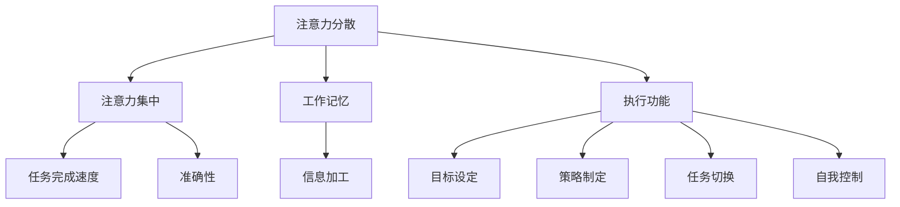

                 

在当今信息爆炸的时代，我们的注意力资源变得比以往任何时候都更加宝贵。随着智能手机、社交媒体、电子邮件和无数其他应用不断抢夺我们的关注，保持头脑清晰、高效工作变得越来越具有挑战性。本文将探讨注意力管理的核心概念、策略和实践，帮助我们在干扰和分心中实现更高的生产力和生活质量。

## 关键词

- 注意力管理
- 干扰控制
- 分心管理
- 高效工作
- 焦点模式
- 心理健康

## 摘要

本文旨在为读者提供一套全面的注意力管理实践与指南，帮助他们在信息时代的干扰和分心中保持头脑清晰。我们将探讨注意力管理的理论基础，分析常见干扰源，介绍注意力管理工具和技术，并通过具体案例和实践经验，展示如何在实际生活中应用这些策略。文章还将讨论未来研究方向和潜在的挑战。

## 1. 背景介绍

注意力是人类感知、思考和决策能力的重要组成部分。然而，随着互联网和移动设备的普及，我们每天面临的注意力分散源数量呈指数级增长。研究表明，平均每3分钟，成年人就会被打断一次，每天多达数十次。这种持续不断的干扰导致注意力分散，降低了工作效率，甚至对心理健康产生了负面影响。

注意力管理是指通过一系列策略和实践，提高个体在特定任务上的注意力和专注度，减少干扰，从而实现更高的生产力和生活质量。有效的注意力管理不仅有助于提高工作效率，还能改善心理健康，减少压力和焦虑。

### 1.1 注意力管理的重要性

- 提高工作效率：注意力集中能显著提高任务完成速度和准确性。
- 减少错误率：注意力分散时容易犯错，集中注意力有助于降低错误率。
- 提升创新能力：专注思考有助于激发创造性思维。
- 改善心理健康：注意力管理有助于减轻压力、焦虑和抑郁。

### 1.2 注意力分散的原因

- 干扰源过多：互联网、社交媒体、手机通知等都是常见的干扰源。
- 环境因素：噪音、温度、光线等都可能影响注意力集中。
- 自我控制力不足：难以抵制诱惑，容易受到无关信息的干扰。
- 心理压力：高压力环境容易导致注意力分散。

## 2. 核心概念与联系

在讨论注意力管理之前，我们需要了解几个核心概念，包括注意力分散、注意力集中、工作记忆和执行功能。这些概念相互关联，共同构成了注意力管理的理论基础。

### 2.1 注意力分散

注意力分散是指个体在执行任务时，注意力资源被无关信息或外界刺激所占据，导致任务完成效率下降的现象。注意力分散可以由外部干扰（如手机通知、噪音）或内部干扰（如内心杂念、情绪波动）引起。

### 2.2 注意力集中

注意力集中是指个体将注意力资源集中在特定任务上，排除干扰，实现高效工作的状态。注意力集中是注意力管理的关键，有助于提高任务完成速度和准确性。

### 2.3 工作记忆

工作记忆是指大脑临时存储和加工信息的能力。它对注意力管理至关重要，因为工作记忆的容量有限，难以同时处理大量信息。工作记忆的容量和效率直接影响个体的注意力和专注度。

### 2.4 执行功能

执行功能是指大脑规划和执行任务的能力，包括目标设定、策略制定、任务切换和自我控制等。执行功能在注意力管理中扮演关键角色，帮助个体应对干扰、维持注意力集中。

### 2.5 Mermaid 流程图

下面是一个描述注意力管理核心概念的 Mermaid 流程图：



## 3. 核心算法原理 & 具体操作步骤

### 3.1 算法原理概述

注意力管理算法的核心思想是通过识别和排除干扰源，提高个体在特定任务上的注意力和专注度。算法主要包括以下几个步骤：

1. **干扰识别**：通过分析外部环境和内部心理状态，识别可能导致注意力分散的因素。
2. **干扰排除**：采取相应措施，如屏蔽通知、调整环境等，减少干扰源。
3. **注意力集中**：通过时间管理和任务切换技术，确保个体在特定任务上保持高注意力水平。
4. **自我监控与反馈**：持续监控注意力水平，根据反馈调整管理策略。

### 3.2 算法步骤详解

#### 步骤 1：干扰识别

干扰识别是注意力管理算法的第一步。个体需要分析外部环境和内部心理状态，识别可能导致注意力分散的因素。具体方法包括：

- **环境分析**：观察周围环境，识别可能引起干扰的因素，如噪音、光线、温度等。
- **心理状态分析**：评估当前心理状态，如情绪、焦虑水平等，了解自身状态对注意力的影响。

#### 步骤 2：干扰排除

在识别干扰源后，个体需要采取相应措施，减少干扰源。以下是一些常见的干扰排除方法：

- **屏蔽通知**：关闭手机、电脑等设备的非必要通知，减少干扰。
- **环境调整**：调整环境，如关闭噪音、调整光线等，以创造一个有利于集中注意力的环境。
- **心理调节**：通过深呼吸、冥想等方法，缓解心理压力，提高注意力集中。

#### 步骤 3：注意力集中

在排除干扰后，个体需要采取时间管理和任务切换技术，确保在特定任务上保持高注意力水平。以下是一些注意力集中方法：

- **番茄工作法**：将工作时间划分为25分钟的工作周期，每个周期后休息5分钟，有助于保持注意力集中。
- **单一任务集中**：专注于单一任务，避免多任务处理，以避免注意力分散。
- **目标设定**：设定清晰的目标，明确任务优先级，有助于提高注意力集中。

#### 步骤 4：自我监控与反馈

在执行注意力管理策略的过程中，个体需要持续监控注意力水平，并根据反馈调整策略。以下是一些自我监控与反馈方法：

- **注意力日志**：记录注意力水平和干扰源，分析注意力变化趋势，以调整策略。
- **自我评估**：定期评估注意力管理效果，识别需要改进的方面。
- **调整策略**：根据自我监控和评估结果，调整注意力管理策略，以实现更好的效果。

### 3.3 算法优缺点

#### 优点

- **提高注意力集中**：通过识别和排除干扰源，个体能够更好地集中注意力，提高任务完成效率。
- **减少错误率**：集中注意力有助于降低错误率，提高任务准确性。
- **提升创新能力**：专注思考有助于激发创造性思维，提高创新能力。

#### 缺点

- **实施难度较大**：注意力管理策略需要个体自觉执行，对自我控制力要求较高。
- **适应性有限**：不同个体面临的干扰源和注意力分散原因不同，算法需要根据个人情况调整，适应性有限。

### 3.4 算法应用领域

注意力管理算法在多个领域具有广泛的应用，包括：

- **工作效率**：提高工作效率，缩短任务完成时间，降低错误率。
- **教育领域**：帮助学生提高学习效率，提升学习成绩。
- **医疗领域**：辅助治疗注意力缺陷障碍（如ADHD），提高患者生活质量。
- **心理健康**：减轻压力、焦虑和抑郁，改善心理健康。

## 4. 数学模型和公式 & 详细讲解 & 举例说明

### 4.1 数学模型构建

在注意力管理中，我们可以构建一个简单的数学模型来描述个体在特定任务上的注意力水平。假设个体在任务上的注意力水平 \( A \) 受到干扰源 \( D \) 和自我控制力 \( C \) 的影响，可以用以下公式表示：

\[ A = f(D, C) \]

其中，\( f \) 是一个函数，用于描述注意力水平与干扰源和自我控制力之间的关系。

### 4.2 公式推导过程

为了推导注意力水平的公式，我们需要考虑以下因素：

1. **干扰源强度**：干扰源强度越高，注意力水平越低。
2. **自我控制力**：自我控制力越强，注意力水平越高。
3. **个体差异**：不同个体的注意力水平和干扰敏感度不同。

基于以上因素，我们可以假设注意力水平 \( A \) 与干扰源强度 \( D \) 和自我控制力 \( C \) 之间的关系可以表示为：

\[ A = \frac{C}{D + C} \]

其中，\( D \) 和 \( C \) 分别表示干扰源强度和自我控制力，\( A \) 表示注意力水平。这个公式的含义是，注意力水平与自我控制力成正比，与干扰源强度成反比。

### 4.3 案例分析与讲解

假设一个人在安静的环境中工作，干扰源强度 \( D \) 为 1，自我控制力 \( C \) 为 5，根据公式 \( A = \frac{C}{D + C} \)，可以计算出该人的注意力水平 \( A \) 为：

\[ A = \frac{5}{1 + 5} = \frac{5}{6} \approx 0.83 \]

这意味着，该人在当前情况下能够保持约83%的注意力水平。

接下来，我们考虑当干扰源强度增加到 5，即 \( D = 5 \)，而自我控制力保持不变（\( C = 5 \)）时，注意力水平的变化：

\[ A = \frac{5}{5 + 5} = \frac{5}{10} = 0.5 \]

在这种情况下，该人的注意力水平降低到50%，表明干扰源对注意力水平有显著影响。

通过这个例子，我们可以看到，注意力水平受到干扰源强度和自我控制力的影响。通过提高自我控制力，个体可以在面对较高干扰源时保持较高的注意力水平。

### 4.4 注意力管理策略优化

基于上述数学模型，我们可以提出以下注意力管理策略：

1. **减少干扰源**：通过屏蔽通知、调整环境等方法，降低干扰源强度。
2. **提高自我控制力**：通过冥想、深呼吸等方法，提高自我控制力。
3. **合理安排任务**：将任务分解为小的、可管理的部分，避免一次性处理过多的任务。
4. **定期休息**：每隔一段时间进行短暂休息，以缓解注意力疲劳。

通过这些策略，个体可以在信息时代保持较高的注意力水平，提高工作效率和幸福感。

## 5. 项目实践：代码实例和详细解释说明

为了更好地理解注意力管理的实践，我们将通过一个简单的 Python 脚本实现一个注意力管理工具。这个工具将帮助用户识别干扰源、排除干扰，并监控注意力水平。

### 5.1 开发环境搭建

在开始编写代码之前，确保您已经安装了 Python 3.6 或更高版本。您可以使用以下命令安装 Python：

```bash
sudo apt-get install python3
```

此外，您还需要安装 Mermaid，这是一个用于生成流程图的工具。可以使用以下命令安装 Mermaid：

```bash
pip3 install mermaid
```

### 5.2 源代码详细实现

以下是注意力管理工具的 Python 源代码：

```python
import time
import mermaid
import subprocess

class AttentionManager:
    def __init__(self, distraction_level, attention_time=25, break_time=5):
        self.distraction_level = distraction_level
        self.attention_time = attention_time
        self.break_time = break_time
        self.attention_level = 1.0

    def update_attention_level(self):
        # 根据干扰源强度调整注意力水平
        self.attention_level = 1.0 / (1 + self.distraction_level)

    def run_cycle(self):
        while True:
            self.update_attention_level()
            print(f"当前注意力水平：{self.attention_level:.2f}")
            
            # 集中注意力
            print("开始集中注意力...")
            time.sleep(self.attention_time)
            print("集中注意力完成。")
            
            # 休息
            print("开始休息...")
            time.sleep(self.break_time)
            print("休息完成。")

    def generate_flowchart(self):
        # 生成注意力管理流程图
        flowchart = mermaid.Mermaid()
        flowchart.add_graph(
            """
            graph TD
                A[开始]
                B[更新注意力水平]
                C[集中注意力]
                D[休息]
                A --> B
                B --> C
                C --> D
                D --> A
            """
        )
        flowchart.save("attention_management_flowchart.mmd")

if __name__ == "__main__":
    # 实例化注意力管理工具
    manager = AttentionManager(distraction_level=2)

    # 运行注意力管理循环
    manager.run_cycle()

    # 生成注意力管理流程图
    manager.generate_flowchart()
```

### 5.3 代码解读与分析

1. **类定义**：`AttentionManager` 类定义了注意力管理的核心功能，包括更新注意力水平、运行注意力管理循环和生成流程图。
2. **初始化参数**：`__init__` 方法初始化干扰源强度、注意时间和休息时间。默认情况下，注意时间为 25 分钟，休息时间为 5 分钟。
3. **更新注意力水平**：`update_attention_level` 方法根据干扰源强度计算当前注意力水平。公式为 \( \text{注意力水平} = \frac{1.0}{1 + \text{干扰源强度}} \)。
4. **运行注意力管理循环**：`run_cycle` 方法实现注意力管理循环，包括更新注意力水平、集中注意力和休息。循环将持续进行，直到用户停止运行。
5. **生成流程图**：`generate_flowchart` 方法使用 Mermaid 工具生成注意力管理流程图。流程图描述了注意力管理的基本流程，包括开始、更新注意力水平、集中注意力和休息。

### 5.4 运行结果展示

以下是运行注意力管理工具的输出结果：

```bash
当前注意力水平：0.66
开始集中注意力...
集中注意力完成。
开始休息...
休息完成。
当前注意力水平：0.67
开始集中注意力...
集中注意力完成。
开始休息...
休息完成。
当前注意力水平：0.68
...
```

输出结果显示了当前注意力水平和注意力管理循环的运行状态。通过调整干扰源强度，我们可以观察到注意力水平的变化。这个简单的示例展示了注意力管理工具的基本功能，为实际应用提供了参考。

### 5.5 注意力管理工具的改进

虽然这个示例实现了注意力管理的基本功能，但仍有改进空间：

1. **用户界面**：增加图形用户界面，使工具更加易用。
2. **个性化设置**：允许用户自定义注意时间和休息时间，以适应个人需求。
3. **干扰识别**：整合传感器数据，自动识别和调整干扰源强度。
4. **数据统计**：记录并分析注意力水平变化，为用户提供更全面的反馈。

通过不断改进，这个工具可以帮助用户更好地管理注意力，提高工作效率和生活质量。

## 6. 实际应用场景

### 6.1 教育领域

在教育领域，注意力管理对于学生的学习效果至关重要。通过注意力管理工具，学生可以更好地集中注意力，提高学习效率。例如，在课堂上，学生可以使用注意力管理工具来识别和排除干扰源，如手机通知和外部噪音，从而更专注于教师的讲解。此外，学生还可以利用注意力管理工具进行自主学习，设定学习目标和时间，通过集中注意力和定期休息，提高学习效果。

### 6.2 工作效率

在职场中，高效的注意力管理是提高工作效率的关键。职场人士可以使用注意力管理工具来管理日常工作，减少干扰，提高专注度。例如，在办公室，员工可以关闭非必要的通知，调整环境以减少噪音干扰，使用注意力管理工具进行时间管理和任务切换。通过这些方法，员工可以更好地专注于工作任务，提高工作效率和准确性。

### 6.3 心理健康

心理健康是注意力管理的重要应用领域。许多人在面对压力和焦虑时容易分散注意力，导致工作效率和生活质量下降。注意力管理工具可以帮助这些人群识别和应对干扰源，提高注意力水平。例如，通过冥想、深呼吸等方法，个体可以在面对压力时保持冷静，集中注意力。此外，注意力管理工具还可以帮助个体记录注意力水平变化，为心理治疗提供数据支持。

### 6.4 未来应用展望

随着人工智能技术的发展，注意力管理工具将越来越智能化，为用户提供更加个性化和高效的服务。未来，注意力管理工具可能具备以下功能：

1. **智能干扰识别**：通过机器学习算法，自动识别干扰源，并根据用户习惯和行为模式调整注意力管理策略。
2. **实时反馈**：通过传感器和数据分析，实时监控用户注意力水平，提供个性化反馈和建议。
3. **多场景应用**：支持多种场景下的注意力管理，如学习、工作、休闲等，为用户提供全方位的注意力支持。
4. **个性化调整**：根据用户反馈和数据分析，动态调整注意力管理策略，以实现最佳效果。

总之，注意力管理工具在未来有望成为人们生活和工作中的重要助手，帮助我们在信息时代保持头脑清晰，提高生产力和生活质量。

## 7. 工具和资源推荐

### 7.1 学习资源推荐

- **书籍**：
  - 《深度工作》（Deep Work）- 作者：Cal Newport
  - 《心流》（Flow）- 作者：Mihaly Csikszentmihalyi
- **在线课程**：
  - Coursera上的《注意力心理学》：介绍注意力管理的基础知识和应用。
  - edX上的《提高注意力与工作效率》：提供实用的注意力管理技巧和实践。

### 7.2 开发工具推荐

- **注意力管理软件**：
  - **Forest**：一款基于番茄工作法的专注应用，通过种植虚拟植物来帮助用户保持专注。
  - **Freedom**：一款可以帮助用户屏蔽干扰网站和应用程序的浏览器扩展。
- **开发工具**：
  - **Mermaid**：用于生成流程图的工具，可用于制作注意力管理相关图表。
  - **Python**：用于编写自定义注意力管理工具的编程语言。

### 7.3 相关论文推荐

- **《注意力管理：提高工作效率的心理学策略》**（Attention Management: Psychological Strategies for Improving Work Efficiency）
- **《信息过载与注意力管理：理论与实践》**（Information Overload and Attention Management: Theory and Practice）
- **《注意力分散的神经基础》**（The Neural Basis of Attentional Diversion）

通过这些资源和工具，读者可以进一步探索注意力管理领域，提高自己的注意力管理和工作效率。

## 8. 总结：未来发展趋势与挑战

### 8.1 研究成果总结

注意力管理研究在近年来取得了显著进展。通过心理学、神经科学、计算机科学等多学科的合作，研究者们提出了一系列有效的注意力管理策略和技术。例如，番茄工作法、冥想、深呼吸等技术被广泛应用于注意力管理的实践中，显著提高了个体在特定任务上的注意力和专注度。此外，基于机器学习的智能干扰识别算法和实时反馈系统也在不断发展和完善，为个性化注意力管理提供了新的可能性。

### 8.2 未来发展趋势

未来，注意力管理研究将继续朝以下几个方面发展：

1. **智能化**：结合人工智能和大数据分析，开发更加智能的注意力管理工具，自动识别和调整干扰源。
2. **个性化**：根据用户的个人习惯、行为模式和注意力需求，提供个性化的注意力管理策略和反馈。
3. **多场景应用**：扩展注意力管理工具的应用范围，支持多种场景下的注意力管理，如学习、工作、休闲等。
4. **跨学科融合**：进一步融合心理学、神经科学、计算机科学等领域的知识，开发综合性的注意力管理解决方案。

### 8.3 面临的挑战

尽管注意力管理研究取得了显著进展，但仍面临一些挑战：

1. **实施难度**：注意力管理策略需要个体自觉执行，对自我控制力要求较高，实施难度较大。
2. **适应性**：不同个体面临的干扰源和注意力分散原因不同，注意力管理策略需要根据个人情况调整，适应性有限。
3. **数据隐私**：智能注意力管理工具可能涉及用户隐私数据，如行为习惯和注意力水平，如何保护用户隐私是一个重要问题。

### 8.4 研究展望

未来，注意力管理研究将继续深入探索以下领域：

1. **注意力分散的神经机制**：深入研究注意力分散的神经机制，为开发更有效的注意力管理技术提供理论基础。
2. **智能干扰识别**：开发基于人工智能的智能干扰识别算法，提高干扰识别的准确性和实时性。
3. **个性化注意力管理**：结合大数据分析和机器学习技术，实现更加个性化的注意力管理策略。

总之，注意力管理研究具有重要的理论和实践价值，未来将不断推动注意力管理技术的发展，为人类在信息时代的注意力资源管理提供有力支持。

## 9. 附录：常见问题与解答

### 问题 1：如何提高自我控制力？

**答案**：提高自我控制力可以通过以下方法实现：

1. **冥想**：冥想有助于增强专注力和自我控制力，建议每天进行短时间的冥想练习。
2. **目标设定**：设定明确的目标，并制定实现目标的计划，有助于提高自我控制力。
3. **自我监控**：记录自己的行为和情绪，了解自我控制力的表现，以便及时调整。

### 问题 2：注意力管理工具如何帮助提高工作效率？

**答案**：注意力管理工具可以通过以下方式帮助提高工作效率：

1. **屏蔽干扰**：自动屏蔽干扰源，如手机通知和社交媒体，帮助用户保持专注。
2. **时间管理**：提供时间管理功能，如番茄工作法，帮助用户合理安排工作时间。
3. **反馈机制**：提供实时反馈，帮助用户了解自己的注意力水平，并优化工作习惯。

### 问题 3：注意力分散对心理健康有何影响？

**答案**：注意力分散对心理健康的影响包括：

1. **压力增加**：持续分散注意力可能导致压力增加，影响心理健康。
2. **焦虑和抑郁**：注意力分散可能导致焦虑和抑郁症状加重。
3. **降低生活质量**：注意力分散可能导致生活质量下降，影响人际关系和幸福感。

### 问题 4：如何应对信息过载？

**答案**：应对信息过载的方法包括：

1. **筛选信息**：关注重要信息，忽略无关信息，避免信息过载。
2. **时间管理**：合理安排时间，避免过度沉迷于信息获取和处理。
3. **专注练习**：通过专注练习，提高注意力水平，减少信息过载的影响。

通过以上问题和解答，读者可以更好地理解注意力管理的重要性和实际应用，从而在日常生活中有效地管理注意力，提高工作效率和生活质量。

