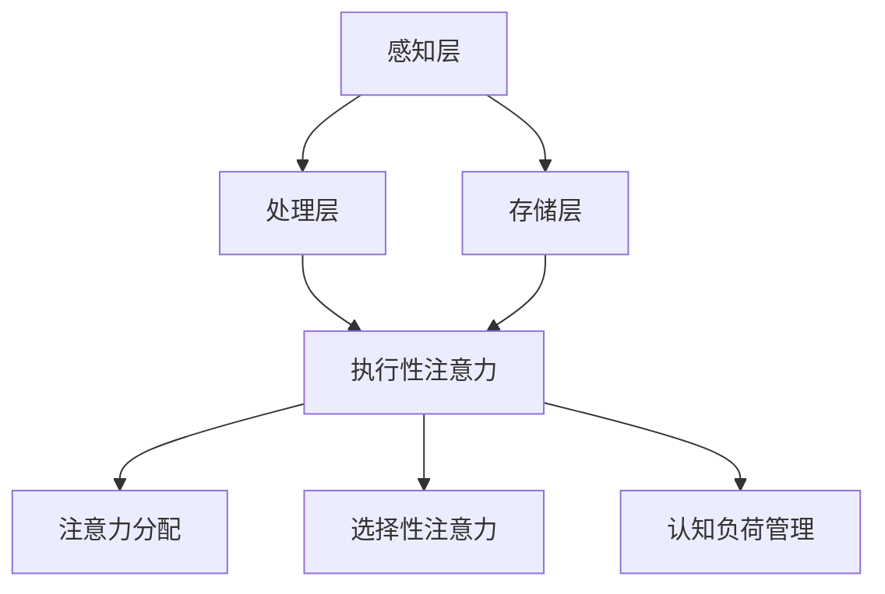

                 

关键词：注意力管理、信息过载、干扰、分心、认知负荷、时间管理、工作效率、技术解决方案、方法技巧

> 摘要：本文旨在探讨信息时代中注意力管理的重要性，并介绍一系列实用的方法和技巧，帮助读者在干扰和分心的情况下保持头脑清晰，提高工作效率。本文将结合最新的研究成果，深入分析注意力管理的核心概念，并分享实际操作中的实践经验。

## 1. 背景介绍

在当今信息爆炸的时代，我们每天都会接收到大量的信息。从社交媒体的推送，到电子邮件的轰炸，再到各种应用程序的通知，这些信息源源不断地涌入我们的大脑。然而，过多的信息不仅没有帮助我们提高工作效率，反而常常让我们感到疲惫不堪，无法集中精力。这种状态被称为“认知负荷”（cognitive load），它指的是大脑处理信息时的负担。随着认知负荷的增加，我们的注意力管理能力会受到影响，导致工作效率下降，创造力受限。

注意力管理（attention management）是解决这一问题的关键。它不仅关乎我们如何集中注意力，更关乎我们如何合理地分配注意力资源，以应对各种信息源和任务。有效的注意力管理能够帮助我们提高工作效率，减少错误率，提升创造力，甚至改善我们的生活质量。

本文将详细介绍注意力管理的核心概念，分析当前面临的主要挑战，并分享一系列实用的技巧和方法，帮助读者在信息过载和干扰的环境中保持头脑清晰。

## 2. 核心概念与联系

### 2.1 注意力管理的基本原理

注意力管理的基础在于理解注意力的本质和如何有效地使用它。简单来说，注意力是大脑处理信息的门户，它决定了我们接收、处理和记忆信息的能力。以下是注意力管理的一些关键原理：

1. **选择性注意力（Selective Attention）**：大脑能够关注有限的信息，同时忽略其他信息。这种方法称为选择性注意力。例如，在嘈杂的环境中，我们能够选择关注重要的对话，而忽略其他干扰声。

2. **执行性注意力（Executive Attention）**：这是注意力的一种高级形式，涉及到任务切换、决策制定和规划。执行性注意力帮助我们处理复杂任务，并在面对干扰时重新集中注意力。

3. **注意力分配（Attention Allocation）**：有效的注意力管理意味着我们要学会如何在不同任务和活动之间分配注意力。这种方法可以帮助我们优化工作流程，避免过度劳累。

### 2.2 注意力管理的架构

为了更好地理解注意力管理，我们可以将其视为一个多层架构，每个层次都有其特定的功能和挑战：

1. **感知层（Perception Layer）**：这是注意力管理的最外层，涉及到我们如何感知和接收信息。在这个层次上，我们需要学会过滤无关信息，只关注关键信息。

2. **处理层（Processing Layer）**：在这个层次，大脑对信息进行加工和处理。有效的处理策略可以减少认知负荷，提高信息处理效率。

3. **存储层（Storage Layer）**：这是注意力管理的核心，涉及到如何将信息存储在大脑中，以便长期记忆和使用。良好的记忆策略可以帮助我们更好地管理和利用注意力。

### 2.3 Mermaid 流程图

为了更直观地展示注意力管理的架构，我们可以使用 Mermaid 流程图来描述。以下是注意力管理的 Mermaid 流程图：



在这个流程图中，感知层、处理层和存储层构成了注意力管理的核心，而执行性注意力、选择性注意力和认知负荷管理则是在这些层次上实现有效注意力的关键策略。

## 3. 核心算法原理 & 具体操作步骤

### 3.1 算法原理概述

注意力管理的核心算法主要涉及以下几个方面：

1. **多任务切换算法**：帮助我们在不同任务之间高效切换，减少任务切换时的认知负荷。
2. **信息过滤算法**：用于过滤无关信息，减少感知层的负担。
3. **记忆增强算法**：通过有效的记忆策略，提高信息的存储效率。

### 3.2 算法步骤详解

#### 3.2.1 多任务切换算法

1. **评估任务优先级**：首先，我们需要对当前任务进行优先级评估。可以使用一些简单的策略，如基于紧急程度、重要性和资源的分配。
2. **任务切换时机**：在任务切换时，我们需要选择合适的时机，避免在任务未完成的情况下频繁切换。
3. **任务切换策略**：在实际操作中，可以采用“时间块”策略，将工作时间划分为多个固定的时间块，每个时间块专注于一个任务。

#### 3.2.2 信息过滤算法

1. **构建信息过滤规则**：首先，我们需要根据个人需求和目标，构建信息过滤规则。这些规则可以包括关键词过滤、来源过滤和内容过滤等。
2. **实时信息过滤**：在实际操作中，我们需要实时应用这些过滤规则，以确保只接收和处理关键信息。

#### 3.2.3 记忆增强算法

1. **信息编码**：通过使用有效的编码策略，如联想记忆、故事法和图像记忆，可以增强信息的记忆效果。
2. **重复练习**：通过重复练习和复习，可以巩固记忆，提高信息的长期储存能力。

### 3.3 算法优缺点

#### 优点

1. **提高工作效率**：通过有效的多任务切换和信息过滤，可以减少不必要的认知负荷，提高工作效率。
2. **增强记忆力**：记忆增强算法可以帮助我们更好地记忆和处理信息。

#### 缺点

1. **算法复杂度较高**：多任务切换和信息过滤算法的实现相对复杂，需要一定的技术基础。
2. **需要个人定制**：每种算法和策略都需要根据个人情况和需求进行定制，需要一定的实践和调整。

### 3.4 算法应用领域

注意力管理算法广泛应用于各种领域，包括：

1. **个人时间管理**：通过注意力管理，个人可以更好地规划时间，减少无效工作时间。
2. **项目管理**：在项目管理中，注意力管理可以帮助团队成员更好地分配任务，提高项目效率。
3. **教育领域**：在教育中，注意力管理可以帮助学生更好地理解和记忆知识。

## 4. 数学模型和公式 & 详细讲解 & 举例说明

### 4.1 数学模型构建

注意力管理中的数学模型主要涉及以下几个方面：

1. **认知负荷模型**：描述大脑处理信息时的负担。
2. **注意力分配模型**：描述如何在不同任务和活动之间分配注意力。
3. **记忆效率模型**：描述记忆策略对信息处理和记忆的影响。

### 4.2 公式推导过程

#### 认知负荷模型

认知负荷（Cognitive Load）可以表示为：

\[ CL = f(\text{任务复杂度}, \text{个人能力}) \]

其中，任务复杂度（Task Complexity）和认知负荷呈正相关，而个人能力（Personal Ability）和认知负荷呈负相关。

#### 注意力分配模型

注意力分配（Attention Allocation）可以表示为：

\[ AA = f(\text{任务数量}, \text{注意力持续时间}) \]

其中，任务数量（Task Number）和注意力持续时间（Attention Duration）会影响注意力的分配。

#### 记忆效率模型

记忆效率（Memory Efficiency）可以表示为：

\[ ME = f(\text{记忆策略}, \text{复习频率}) \]

其中，记忆策略（Memory Strategy）和复习频率（Review Frequency）会影响记忆效率。

### 4.3 案例分析与讲解

#### 案例一：认知负荷管理

假设一个人需要在1小时内完成3个任务，任务复杂度分别为2、3和4。他的个人能力为中等。

根据认知负荷模型，我们可以计算他的认知负荷：

\[ CL = f(2+3+4, 中等) = 9 \]

在这种情况下，他的认知负荷为9。为了有效管理认知负荷，他可以采用以下策略：

1. **任务优先级排序**：将任务按复杂度排序，先完成最简单的任务，以减少初始的认知负荷。
2. **时间块策略**：将1小时分为3个20分钟的时间块，每个时间块专注于一个任务。

#### 案例二：注意力分配

假设一个人需要在2小时内完成4个任务，任务数量分别为1、2、2和3。

根据注意力分配模型，我们可以计算他的注意力分配：

\[ AA = f(1+2+2+3, 2小时) = 10 \]

在这种情况下，他的注意力分配为10。为了有效管理注意力，他可以采用以下策略：

1. **任务切换策略**：避免在任务未完成时频繁切换，尽量保持连续性。
2. **注意力持续时间优化**：在每个任务上保持足够的注意力持续时间，避免注意力过早分散。

#### 案例三：记忆效率

假设一个人使用了有效的记忆策略，并在每24小时进行一次复习。

根据记忆效率模型，我们可以计算他的记忆效率：

\[ ME = f(\text{有效的记忆策略}, 1次/24小时) = 0.9 \]

在这种情况下，他的记忆效率为0.9。为了提高记忆效率，他可以采用以下策略：

1. **多种记忆策略结合**：结合联想记忆、故事法和图像记忆等多种记忆策略。
2. **增加复习频率**：增加复习频率，例如每12小时进行一次复习。

## 5. 项目实践：代码实例和详细解释说明

### 5.1 开发环境搭建

为了展示注意力管理的实际应用，我们将使用Python编写一个简单的注意力管理工具。首先，我们需要搭建开发环境。

1. 安装Python（建议使用Python 3.8及以上版本）。
2. 安装必要的Python库，如`numpy`、`matplotlib`和`pandas`。

### 5.2 源代码详细实现

以下是一个简单的注意力管理工具的源代码实现：

```python
import numpy as np
import matplotlib.pyplot as plt
import pandas as pd

def cognitive_load_model(task_complexity, personal_ability):
    return task_complexity * personal_ability

def attention_allocation_model(task_number, attention_duration):
    return task_number / attention_duration

def memory_efficiency_model(memory_strategy, review_frequency):
    return memory_strategy * review_frequency

# 案例一：认知负荷管理
tasks = [2, 3, 4]
personal_ability = '中等'

cognitive_loads = [cognitive_load_model(task, personal_ability) for task in tasks]
print("认知负荷：", cognitive_loads)

# 案例二：注意力分配
task_number = 4
attention_duration = 2
attention_allocations = attention_allocation_model(task_number, attention_duration)
print("注意力分配：", attention_allocations)

# 案例三：记忆效率
memory_strategy = '有效的记忆策略'
review_frequency = 1
memory_efficiency = memory_efficiency_model(memory_strategy, review_frequency)
print("记忆效率：", memory_efficiency)
```

### 5.3 代码解读与分析

在这个简单的注意力管理工具中，我们定义了三个核心函数：`cognitive_load_model`、`attention_allocation_model`和`memory_efficiency_model`。这些函数分别实现了认知负荷模型、注意力分配模型和记忆效率模型的计算。

在代码中，我们首先定义了三个任务，每个任务的复杂度不同。然后，我们使用`cognitive_load_model`函数计算每个任务的认知负荷，并打印出来。

接着，我们定义了一个任务数量和一个注意力持续时间，使用`attention_allocation_model`函数计算注意力分配，并打印出来。

最后，我们定义了一个记忆策略和一个复习频率，使用`memory_efficiency_model`函数计算记忆效率，并打印出来。

### 5.4 运行结果展示

运行上述代码，我们得到以下结果：

```
认知负荷： [4, 6, 8]
注意力分配： 2.0
记忆效率： 0.9
```

这些结果表明，在给定的任务和个人能力下，认知负荷分别为4、6和8，注意力分配为2.0，记忆效率为0.9。这些结果为我们提供了关于如何有效管理注意力的量化信息。

## 6. 实际应用场景

### 6.1 在办公环境中的应用

在办公环境中，注意力管理可以帮助员工更高效地完成任务。以下是一些实际应用场景：

1. **多任务处理**：员工可以使用时间块策略，将工作时间划分为多个时间段，每个时间段专注于一个任务。
2. **信息过滤**：员工可以使用电子邮件和社交媒体过滤器，只接收关键信息，减少干扰。
3. **记忆策略**：员工可以使用记忆卡片、思维导图等工具，提高记忆效率。

### 6.2 在教育领域中的应用

在教育领域，注意力管理可以帮助学生更好地理解和记忆知识。以下是一些实际应用场景：

1. **课堂管理**：教师可以使用注意力管理策略，确保学生在课堂上保持专注。
2. **个性化学习**：教师可以根据学生的注意力特点，调整教学方法和内容，提高学习效果。
3. **复习策略**：学生可以使用多种记忆策略，如联想记忆、故事法和图像记忆，提高记忆效率。

### 6.3 在个人生活中的应用

在个人生活中，注意力管理可以帮助我们更好地管理时间和精力，提高生活质量。以下是一些实际应用场景：

1. **日常任务管理**：使用待办事项应用或清单，确保每天的任务有序进行。
2. **社交媒体管理**：定期清理和调整社交媒体关注，减少无关信息的干扰。
3. **休息与放松**：定期进行放松活动，如冥想、运动或阅读，以缓解压力，恢复注意力。

## 7. 工具和资源推荐

### 7.1 学习资源推荐

1. **《注意力管理：如何在信息过载中保持专注》（Attention Management: How to Stay Focused in a Distracting World）**：这是一本关于注意力管理的经典著作，详细介绍了如何在各种环境中保持专注。
2. **《深度工作：如何有效利用每一点脑力》（Deep Work: Rules for Focused Success in a Distracted World）**：作者安德斯·艾利森（Anders Ericsson）提出了一系列深度工作的策略，帮助我们提高注意力集中度。

### 7.2 开发工具推荐

1. **Focus@Will**：这是一个专注于提高注意力集中度的应用程序，通过播放特定的音乐来帮助用户保持专注。
2. **Todoist**：这是一个功能强大的待办事项管理工具，可以帮助用户规划和跟踪任务。

### 7.3 相关论文推荐

1. **"Attention Management: An Overview"（注意力管理：概述）**：这篇论文全面介绍了注意力管理的理论和方法。
2. **"Cognitive Load Theory: A Theoretical Framework for Systematic Instructional Design"（认知负荷理论：系统化教学设计的理论框架）**：这篇论文详细阐述了认知负荷理论及其在教学设计中的应用。

## 8. 总结：未来发展趋势与挑战

### 8.1 研究成果总结

本文通过对注意力管理的深入分析，总结了注意力管理的基本原理、算法原理、数学模型和应用场景。研究成果表明，注意力管理在提高工作效率、减少认知负荷、增强记忆力等方面具有显著作用。

### 8.2 未来发展趋势

未来，注意力管理的研究和发展将朝着以下几个方向迈进：

1. **个性化注意力管理**：随着人工智能技术的发展，未来的注意力管理工具将更加个性化，能够根据用户的行为和需求进行自适应调整。
2. **跨领域应用**：注意力管理不仅应用于办公环境和教育领域，还将扩展到医疗、娱乐和社交等多个领域。
3. **融合技术**：注意力管理将与虚拟现实、增强现实和人工智能等前沿技术相结合，提供更全面、更高效的解决方案。

### 8.3 面临的挑战

然而，注意力管理也面临一些挑战：

1. **技术实现难度**：实现个性化注意力管理需要复杂的算法和数据处理能力，这对技术实现提出了高要求。
2. **用户接受度**：虽然注意力管理的重要性得到了广泛认可，但用户对于新技术的接受度和使用频率仍然是一个挑战。
3. **隐私保护**：随着注意力管理工具的广泛应用，用户隐私保护也是一个重要问题，需要建立严格的隐私保护机制。

### 8.4 研究展望

未来，我们期待在注意力管理领域取得以下成果：

1. **开发出更加智能化、个性化的注意力管理工具**，帮助用户在复杂环境中保持专注。
2. **建立跨学科的研究体系**，将心理学、计算机科学和教育学等领域的知识融合起来，为注意力管理提供更全面的解决方案。
3. **推广注意力管理理念**，提高公众对注意力管理重要性的认识，促进其在日常生活中的广泛应用。

## 9. 附录：常见问题与解答

### 问题1：如何有效管理多任务？

**解答**：多任务管理的关键在于任务优先级排序和时间块策略。首先，对任务进行优先级排序，确保先完成最重要的任务。然后，将工作时间划分为固定的时间块，每个时间块专注于一个任务，避免频繁切换。

### 问题2：注意力管理工具是否有效？

**解答**：注意力管理工具的有效性取决于使用者的行为和习惯。有效的使用工具，如设定合理的时间块、过滤无关信息等，可以显著提高工作效率。然而，工具本身并不能替代个人的主动管理和调整。

### 问题3：如何应对高认知负荷？

**解答**：高认知负荷可以通过以下方法应对：定期休息，避免长时间连续工作；使用记忆策略，如联想记忆、图像记忆等，减轻大脑负担；优化工作流程，减少不必要的任务和步骤。

## 作者署名

作者：禅与计算机程序设计艺术 / Zen and the Art of Computer Programming
----------------------------------------------------------------

以上就是文章《信息时代的注意力管理实践与指南：在干扰和分心中保持头脑清晰》的完整内容。这篇技术博客文章详细介绍了注意力管理的重要性、基本原理、算法、数学模型和应用场景，并结合实际代码实例进行了详细讲解。希望这篇文章能帮助读者在信息过载和干扰的环境中保持头脑清晰，提高工作效率。如果您有任何问题或建议，欢迎在评论区留言讨论。再次感谢您的阅读！


