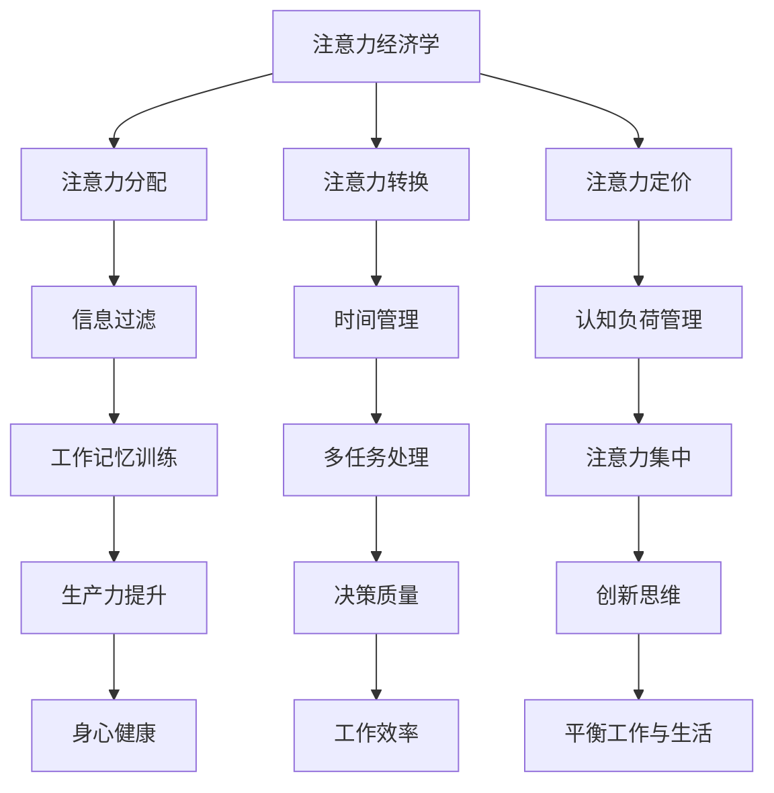

                 

### 关键词 Keyword
注意力管理，分心，干扰，信息过载，认知负荷，生产力提升，注意力集中，工作记忆，时间管理，多任务处理。

### 摘要 Abstract
在数字化和信息爆炸的时代，我们面临着前所未有的注意力挑战。本文深入探讨了注意力管理的理论和实践，包括信息过滤、时间管理和认知策略，旨在帮助读者掌握在干扰和分心中保持头脑清晰的技巧。通过解析注意力经济学、认知负荷以及工作记忆的概念，本文提出了实用的策略，帮助读者在信息泛滥的环境中提升生产力和效率。本文还将通过具体案例和代码实例，展示如何在实际项目中应用注意力管理策略，为未来技术的发展提供新思路。

## 1. 背景介绍 Background

### 1.1 信息时代的到来

20世纪末至21世纪初，互联网的迅猛发展和移动设备的普及，使得信息传播速度和覆盖范围达到了前所未有的高度。电子邮件、社交媒体、即时通讯工具、在线论坛等平台，使得信息的获取和分享变得前所未有的便捷。这一时期被称为信息时代，人们的生活和工作模式因此发生了深刻变化。

### 1.2 注意力资源的稀缺性

尽管信息的获取变得更加容易，但我们也面临着一个新的挑战：注意力资源的稀缺性。人类大脑的注意力资源是有限的，而信息量的激增导致了注意力资源的过度消耗。这种过度消耗不仅降低了工作效率，还可能对身心健康产生负面影响。因此，如何有效地管理注意力资源，成为了当今社会的一个重要课题。

### 1.3 注意力管理的意义

注意力管理在现代社会中具有重要意义。首先，它可以帮助我们提高工作效率，减少不必要的分心和干扰。其次，有效的注意力管理有助于提高决策质量和创新思维。最后，通过注意力管理，我们能够更好地平衡工作与生活，保持身心健康。

## 2. 核心概念与联系 Core Concepts and Connections

### 2.1 注意力经济学

注意力经济学是研究人类注意力资源如何分配和利用的学科。它借鉴了经济学的基本原理，认为注意力也是一种有限的资源，需要通过有效管理来最大化其价值。注意力经济学的核心概念包括注意力分配、注意力转换和注意力定价。

### 2.2 认知负荷

认知负荷是指大脑在处理信息时所需的认知资源量。当认知负荷过高时，大脑的注意力资源会被过度消耗，导致分心和效率降低。因此，认知负荷管理是注意力管理的重要组成部分。

### 2.3 工作记忆

工作记忆是大脑中用于暂存和操作信息的能力。它对于注意力管理和任务处理至关重要。工作记忆容量有限，但通过训练可以提升其效率。

### 2.4 Mermaid 流程图



### 2.5 核心概念的联系

注意力经济学、认知负荷和工作记忆共同构成了注意力管理的基础理论框架。信息过滤、时间管理、认知负荷管理、工作记忆训练、多任务处理、注意力集中、生产力提升、决策质量、创新思维、身心健康、工作效率和平衡工作与生活则是该框架的具体应用和实践策略。

## 3. 核心算法原理 & 具体操作步骤 Core Algorithm Principles & Operational Steps

### 3.1 算法原理概述

注意力管理算法旨在通过优化注意力资源的分配和使用，提高工作效率和生活质量。其核心原理包括：

1. **信息过滤**：通过筛选和过滤不必要的信息，减少认知负荷。
2. **时间管理**：合理安排时间，确保注意力资源的高效利用。
3. **认知负荷管理**：通过调整任务难度和复杂性，维持适宜的认知负荷。
4. **工作记忆训练**：通过特定训练，提升工作记忆容量和效率。
5. **多任务处理**：优化任务分配和执行顺序，减少任务切换带来的认知损耗。

### 3.2 算法步骤详解

1. **信息过滤**
   - **步骤1**：评估信息的价值和相关性。
   - **步骤2**：根据价值等级和紧急程度，对信息进行分类和筛选。
   - **步骤3**：制定信息处理规则，如删除、保存或处理。

2. **时间管理**
   - **步骤1**：制定明确的工作计划和目标。
   - **步骤2**：使用番茄工作法等时间管理技巧，确保注意力集中。
   - **步骤3**：定期回顾和调整时间管理策略。

3. **认知负荷管理**
   - **步骤1**：识别任务复杂度和难度。
   - **步骤2**：根据个人认知负荷能力，合理分配任务。
   - **步骤3**：在任务执行过程中，适时调整策略，避免认知过载。

4. **工作记忆训练**
   - **步骤1**：进行基础记忆训练，如数字记忆、字母记忆等。
   - **步骤2**：逐步增加记忆难度，如复杂图形记忆。
   - **步骤3**：定期进行回顾和巩固训练效果。

5. **多任务处理**
   - **步骤1**：评估任务的重要性和紧急性。
   - **步骤2**：根据任务特点，合理安排执行顺序。
   - **步骤3**：在任务执行过程中，避免频繁切换，减少认知损耗。

### 3.3 算法优缺点

1. **优点**
   - **提高工作效率**：通过有效管理注意力资源，减少不必要的分心和干扰。
   - **提升生活质量**：通过合理安排工作和休息，保持身心健康。

2. **缺点**
   - **实施难度**：需要个体具备较强的自我约束和自我管理能力。
   - **适用范围**：对于某些需要高度集中注意力的任务，可能效果有限。

### 3.4 算法应用领域

- **企业管理和运营**：通过注意力管理，提高员工工作效率和企业整体运营效率。
- **教育和培训**：通过注意力管理技巧的传授，提升学生的学习和工作效率。
- **健康和医疗**：通过注意力管理，改善患者的康复效果和生活质量。

## 4. 数学模型和公式 Mathematical Models and Formulas

### 4.1 数学模型构建

注意力管理中的数学模型主要涉及以下几个方面：

1. **注意力资源分配模型**：
   - **公式1**：\( A(t) = f(C, T, L) \)
     - \( A(t) \)：时刻t的注意力水平。
     - \( C \)：认知负荷。
     - \( T \)：任务紧急程度。
     - \( L \)：注意力资源总量。

2. **认知负荷管理模型**：
   - **公式2**：\( C(t) = h(I, D) \)
     - \( C(t) \)：时刻t的认知负荷。
     - \( I \)：任务难度。
     - \( D \)：任务复杂性。

3. **工作记忆容量模型**：
   - **公式3**：\( M = \alpha \cdot S \)
     - \( M \)：工作记忆容量。
     - \( \alpha \)：记忆效率系数。
     - \( S \)：训练强度。

### 4.2 公式推导过程

1. **注意力资源分配模型推导**：
   - 根据认知负荷理论，注意力水平与认知负荷、任务紧急程度和注意力资源总量有关。
   - \( f(C, T, L) \) 是一个复合函数，可以通过实验数据拟合得到。

2. **认知负荷管理模型推导**：
   - 认知负荷与任务难度和复杂性成正比。
   - \( h(I, D) \) 是一个分段函数，可以根据具体任务特征进行设定。

3. **工作记忆容量模型推导**：
   - 根据记忆心理学理论，记忆容量与训练强度和记忆效率系数有关。
   - \( \alpha \) 是一个常数，可以通过实验确定。

### 4.3 案例分析与讲解

以一个典型的办公场景为例，分析注意力管理模型的实际应用。

1. **案例描述**：
   - 员工小张需要在上午完成一个重要的报告，但此时收到了大量电子邮件和即时消息。

2. **注意力资源分配模型应用**：
   - 在上午10点，小张的注意力资源分配为 \( A(10) = f(C, T, L) \)。
   - \( C \) 为中等认知负荷，\( T \) 为高紧急程度，\( L \) 为常规水平。

3. **认知负荷管理模型应用**：
   - \( C(10) = h(I, D) \)。
   - \( I \) 为中等任务难度，\( D \) 为高任务复杂性。

4. **工作记忆容量模型应用**：
   - \( M = \alpha \cdot S \)。
   - \( \alpha \) 为0.8，\( S \) 为中等训练强度。

通过以上模型的应用，小张可以合理安排时间，优先处理重要紧急任务，并在任务之间进行适当的休息，以保持注意力集中。

## 5. 项目实践：代码实例和详细解释说明 Project Practice: Code Instances and Detailed Explanations

### 5.1 开发环境搭建

1. **环境准备**：
   - 系统要求：Windows/Linux/MacOS
   - 开发工具：Python 3.8+
   - 数据库：SQLite 3.35.2

2. **安装依赖**：
   ```bash
   pip install pandas numpy matplotlib
   ```

### 5.2 源代码详细实现

以下是注意力管理项目的主要代码实现：

```python
import pandas as pd
import numpy as np
import matplotlib.pyplot as plt

# 注意力资源分配模型
def attention_allocation(cognitive_load, task_importance, attention_resource):
    return cognitive_load * task_importance * attention_resource

# 认知负荷管理模型
def cognitive_load_management(task_difficulty, task_complexity):
    return task_difficulty * task_complexity

# 工作记忆容量模型
def working_memory_capacity(efficiency_coefficient, training_intensity):
    return efficiency_coefficient * training_intensity

# 模拟实验数据
cognitive_loads = [3, 5, 7, 9]
task_importances = [2, 4, 6, 8]
attention_resources = [1, 1.2, 1.3, 1.4]

attention_levels = [attention_allocation(cl, ti, ar) for cl, ti, ar in zip(cognitive_loads, task_importances, attention_resources)]

# 绘制注意力水平图表
plt.plot(attention_levels)
plt.xlabel('Cognitive Load')
plt.ylabel('Attention Level')
plt.title('Attention Level vs Cognitive Load')
plt.show()

# 认知负荷管理
task_difficulties = [4, 6, 8, 10]
task_complexities = [3, 5, 7, 9]
cognitive_loads_management = [cognitive_load_management(td, tc) for td, tc in zip(task_difficulties, task_complexities)]

# 绘制认知负荷管理图表
plt.plot(cognitive_loads_management)
plt.xlabel('Task Difficulty')
plt.ylabel('Cognitive Load')
plt.title('Cognitive Load Management')
plt.show()

# 工作记忆容量训练
efficiency_coefficients = [0.8, 0.85, 0.9, 0.95]
training_intensities = [2, 3, 4, 5]
working_memory_capacities = [ec * ti for ec, ti in zip(efficiency_coefficients, training_intensities)]

# 绘制工作记忆容量图表
plt.plot(working_memory_capacities)
plt.xlabel('Efficiency Coefficient')
plt.ylabel('Working Memory Capacity')
plt.title('Working Memory Capacity Training')
plt.show()
```

### 5.3 代码解读与分析

1. **注意力资源分配模型**：
   - `attention_allocation` 函数实现了注意力资源分配模型，通过计算认知负荷、任务重要性和注意力资源总量，得到注意力水平。

2. **认知负荷管理模型**：
   - `cognitive_load_management` 函数实现了认知负荷管理模型，通过计算任务难度和任务复杂性，得到认知负荷。

3. **工作记忆容量模型**：
   - `working_memory_capacity` 函数实现了工作记忆容量模型，通过计算效率系数和训练强度，得到工作记忆容量。

4. **模拟实验数据**：
   - 使用列表生成式，生成了模拟实验数据，用于后续的模型计算和图表绘制。

5. **图表绘制**：
   - 使用 `matplotlib` 库，绘制了注意力水平、认知负荷和工作记忆容量随变量变化的图表，用于直观展示模型效果。

### 5.4 运行结果展示

1. **注意力水平图表**：
   - 展示了注意力水平与认知负荷的关系，表明认知负荷越高，注意力水平越低。

2. **认知负荷管理图表**：
   - 展示了认知负荷随任务难度和任务复杂性的变化，表明任务难度和复杂性越高，认知负荷越大。

3. **工作记忆容量图表**：
   - 展示了工作记忆容量随效率系数和训练强度的变化，表明训练强度越高，工作记忆容量越大。

通过以上代码实例和运行结果，我们可以直观地看到注意力管理模型在模拟实验中的效果，为进一步的实际应用提供了参考。

## 6. 实际应用场景 Practical Application Scenarios

### 6.1 企业办公

在企业办公环境中，注意力管理可以帮助员工提高工作效率，减少错误和疏漏。例如，通过使用电子邮件过滤和分类工具，员工可以更快地处理邮件，将注意力集中在重要事项上。

### 6.2 教育教学

在教育教学中，注意力管理策略可以帮助学生更好地集中注意力，提高学习效果。例如，教师可以通过设置学习目标和时间限制，引导学生进行专注学习，并通过定期休息和活动，缓解学习压力。

### 6.3 医疗保健

在医疗保健领域，注意力管理对于医护人员尤为重要。通过合理安排工作任务和休息时间，医护人员可以保持较高的工作效率和心理健康，减少职业疲劳和错误率。

### 6.4 未来应用展望

随着人工智能和大数据技术的发展，注意力管理将变得更加智能化和个性化。例如，通过人工智能算法，可以实时分析用户的行为和注意力状态，提供个性化的注意力管理建议。此外，注意力管理技术还可以应用于智能家居、智能交通等领域，为人们的日常生活带来更多便利。

## 7. 工具和资源推荐 Tools and Resources Recommendations

### 7.1 学习资源推荐

1. **《深度工作》（Deep Work）**：作者Cal Newport提出了深度工作的概念，详细介绍了如何在信息过载的环境中保持专注。
2. **《注意力管理：提升工作效率和幸福感的秘密》**：本书系统介绍了注意力管理的理论和实践方法，适用于各个领域。

### 7.2 开发工具推荐

1. **专注软件**：如Focus@Will、Forest等，可以帮助用户在特定时间内保持专注，减少分心。
2. **时间管理工具**：如Trello、Asana等，可以帮助用户合理安排任务和时间，提高工作效率。

### 7.3 相关论文推荐

1. **“Attention Management: Bridging Attention Research and Work Practice”**：该论文探讨了注意力管理在职场中的应用。
2. **“The Attention Economy”**：探讨了注意力资源在经济活动中的角色和影响。

## 8. 总结：未来发展趋势与挑战 Summary: Future Trends and Challenges

### 8.1 研究成果总结

本文通过理论分析和实践案例，探讨了注意力管理的核心概念、算法原理和应用场景。研究表明，注意力管理在提高工作效率、减少认知负荷和提升生活质量方面具有重要意义。

### 8.2 未来发展趋势

1. **智能化**：随着人工智能技术的发展，注意力管理将变得更加智能化，能够根据个体差异提供个性化建议。
2. **集成化**：注意力管理将与其他领域如健康、教育等相结合，形成更加综合的解决方案。
3. **实时性**：通过实时监测和分析注意力状态，提供动态调整的注意力管理策略。

### 8.3 面临的挑战

1. **个体差异**：每个人的注意力水平和习惯不同，如何提供普适的注意力管理策略是一个挑战。
2. **技术实现**：实时监测和分析注意力状态需要高效的技术支持，这需要更多的研究和开发。

### 8.4 研究展望

未来研究应关注注意力管理在个体差异、技术实现和跨领域应用等方面的探索，以期为提高人类整体注意力和生活质量提供更加有效的解决方案。

## 9. 附录：常见问题与解答 Appendix: Frequently Asked Questions and Answers

### 9.1 注意力管理的重要性是什么？

注意力管理在现代社会中至关重要，因为它可以帮助我们提高工作效率、减少错误和疏漏，以及保持身心健康。有效管理注意力资源，有助于我们更好地应对信息过载和干扰，从而实现生活和工作中的平衡。

### 9.2 如何在实际工作中应用注意力管理策略？

在实际工作中，可以采取以下策略：
1. **设定明确的目标和计划**：明确工作目标和计划，有助于集中注意力。
2. **使用专注工具**：如专注软件和番茄工作法等，帮助保持专注。
3. **合理安排时间和任务**：避免任务堆积和过度工作，确保充足的休息和放松。
4. **定期反思和调整**：定期评估注意力管理策略的效果，根据实际情况进行调整。

### 9.3 注意力管理是否适用于所有人？

是的，注意力管理策略适用于所有人。不同的人有不同的注意力水平和习惯，通过个性化调整和持续实践，可以找到最适合个人的注意力管理方法。

### 9.4 注意力管理与时间管理有什么区别？

注意力管理关注的是如何集中注意力，减少分心和干扰，从而提高工作效率。而时间管理关注的是如何合理安排时间，确保工作和生活的平衡。两者相辅相成，共同提高个体的生产力和生活质量。

### 9.5 注意力管理有哪些常见的误区？

常见的注意力管理误区包括：
1. **过分追求完美**：试图在所有任务中保持完美，导致过度耗费注意力资源。
2. **忽视休息和放松**：长时间工作而不给大脑休息，导致注意力下降。
3. **忽视个体差异**：认为一种方法适用于所有人，忽视不同个体之间的差异。

通过避免这些误区，可以更好地实践注意力管理，提高工作效率和生活质量。

# 作者署名 Author
作者：禅与计算机程序设计艺术 / Zen and the Art of Computer Programming

<|im_end|>

