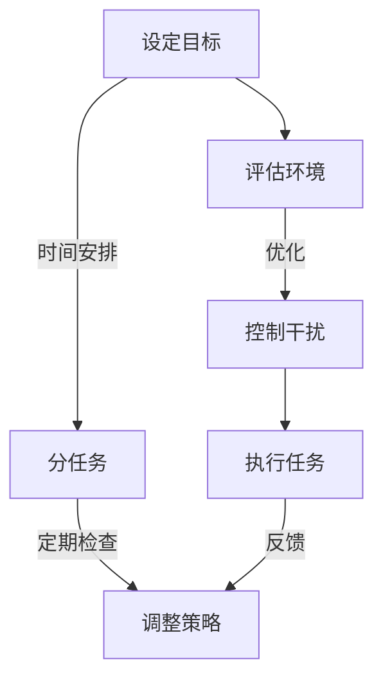

                 

在这个数字时代，我们的注意力资源变得比以往任何时候都更为宝贵。随着信息过载和实时通信工具的普及，分心和注意力分散已成为常态。如何有效地管理我们的注意力，保持头脑清晰和专注，成为了一个紧迫且关键的问题。本文旨在探讨信息时代的注意力管理实践，帮助我们在干扰和分心中保持高效的认知状态。

## 关键词
- 注意力管理
- 信息过载
- 分心
- 专注
- 头脑清晰

## 摘要
本文首先介绍了信息时代注意力管理的重要性，探讨了分心和注意力分散的现象。接着，分析了影响注意力的主要因素，并提出了实用的策略来提升注意力。文章还包括了数学模型、项目实践和未来应用展望，以及相关工具和资源的推荐。

## 1. 背景介绍

随着互联网和智能设备的普及，我们的生活方式发生了翻天覆地的变化。信息的获取变得前所未有的便捷，但这也带来了新的挑战：信息过载。每天，我们都被大量的数据、通知和任务所包围，这不仅消耗了我们的时间，还严重干扰了我们的注意力。注意力分散成为一种普遍现象，人们常常在多项任务之间切换，导致大脑无法集中处理单一任务，从而降低了工作效率和创造力。

研究表明，分心会显著增加认知负荷，导致工作记忆容量下降，大脑执行功能受损。在这种环境下，如何有效地管理我们的注意力，如何在干扰和分心中保持头脑清晰和专注，已经成为一个迫切需要解决的问题。本文将深入探讨这一主题，提供实用的技术和策略，帮助我们在信息时代的浪潮中保持高效。

## 2. 核心概念与联系

### 2.1 注意力管理原理

注意力管理是一个多维度、动态调整的过程，旨在优化认知资源的利用。其核心概念包括：

- **选择性注意力**：在多个任务或刺激中，有选择性地关注和处理某一任务或刺激。
- **持续注意力**：在一段时间内，保持对特定任务的持续关注。
- **交替注意力**：在多个任务之间灵活切换，同时保持高效。

### 2.2 注意力分散现象

注意力分散（Distraction）通常是指注意力从当前任务转移到无关任务或刺激的现象。其主要形式包括：

- **外部干扰**：如环境噪音、社交媒体通知等。
- **内部干扰**：如心理压力、情绪波动等。

### 2.3 注意力管理架构

为了有效地管理注意力，我们需要构建一个综合性的架构，包括以下关键部分：

- **目标设定**：明确任务目标，有助于集中注意力。
- **环境控制**：通过优化工作环境减少外部干扰。
- **时间管理**：合理安排时间，避免过度任务叠加。
- **自我监控**：定期评估自己的注意力状态，调整策略。

### 2.4 注意力管理流程图

使用Mermaid，我们可以绘制一个简明的注意力管理流程图：



## 3. 核心算法原理 & 具体操作步骤

### 3.1 算法原理概述

注意力管理的核心算法基于以下几个原则：

- **优先级排序**：根据任务的重要性和紧急性，对任务进行排序。
- **分块工作**：将任务分解成小块，每次集中处理一个小块。
- **间隔休息**：在处理任务之间适当休息，有助于恢复注意力和减少疲劳。

### 3.2 算法步骤详解

1. **目标设定**：明确任务目标，将任务分解为具体的小目标。
2. **环境控制**：评估工作环境，采取措施减少外部干扰。
3. **分块工作**：将任务分解成若干小块，每次专注于一个小块。
4. **间隔休息**：在每两个任务之间，进行短暂的休息，如走动、深呼吸等。
5. **自我监控**：定期评估自己的注意力状态，必要时调整策略。

### 3.3 算法优缺点

**优点**：

- **提高效率**：通过分块工作和间隔休息，提高工作连贯性和效率。
- **减少疲劳**：适当的休息有助于减轻疲劳，提高长期工作能力。
- **增强专注力**：通过持续的目标设定和自我监控，增强专注力。

**缺点**：

- **初期适应性**：需要一定的适应期，才能有效地实施。
- **任务分解难度**：对于复杂任务，分解成小块的难度较大。

### 3.4 算法应用领域

注意力管理算法广泛应用于各个领域，如：

- **软件开发**：在编写复杂代码时，通过分块工作和定期休息，提高编码效率。
- **项目管理**：在管理多个项目时，通过优先级排序和分任务，提高项目管理效果。
- **教育培训**：在教育过程中，通过分块工作和自我监控，帮助学生提高学习效率。

## 4. 数学模型和公式 & 详细讲解 & 举例说明

### 4.1 数学模型构建

注意力管理中的数学模型可以基于决策理论和优化算法。一个简单的模型可以包括以下几个变量：

- \( T \)：任务总数
- \( P_i \)：任务 \( i \) 的优先级
- \( E_i \)：任务 \( i \) 的时间估计
- \( R \)：每两个任务之间的休息时间

模型的目标是优化任务执行顺序，以最大化总体的效率。

### 4.2 公式推导过程

1. **优先级排序公式**：

   \[ P_i = \frac{U_i + E_i}{2} \]

   其中，\( U_i \) 为任务 \( i \) 的紧急性，\( E_i \) 为任务 \( i \) 的时间估计。

2. **任务执行顺序公式**：

   \[ O = \{ o_1, o_2, ..., o_T \} \]

   其中，\( o_i \) 为任务 \( i \) 的执行顺序，满足 \( P_{o_1} \geq P_{o_2} \geq ... \geq P_{o_T} \)。

3. **总体效率公式**：

   \[ E = \sum_{i=1}^{T} \frac{E_i}{P_i + R} \]

### 4.3 案例分析与讲解

假设有四个任务，其优先级和时间估计如下表：

| 任务 | 优先级 \( P_i \) | 时间估计 \( E_i \) |
|------|----------------|------------------|
| A    | 9              | 3                |
| B    | 6              | 2                |
| C    | 5              | 4                |
| D    | 3              | 1                |

根据优先级排序公式，我们可以得到：

| 任务 | 优先级 \( P_i \) |
|------|----------------|
| A    | 6.5            |
| B    | 4.0            |
| C    | 3.5            |
| D    | 2.0            |

按照优先级排序，任务执行顺序为 \( \{ B, C, D, A \} \)。

总体效率为：

\[ E = \frac{2}{6.5 + R} + \frac{4}{4.0 + R} + \frac{1}{2.0 + R} + \frac{3}{6.5 + R} \]

通过优化 \( R \) 的值，可以进一步提高总体效率。

## 5. 项目实践：代码实例和详细解释说明

### 5.1 开发环境搭建

为了演示注意力管理算法，我们将使用Python编写一个简单的程序。确保安装了Python环境（Python 3.8及以上版本）和必要的库（如NumPy和matplotlib）。

### 5.2 源代码详细实现

以下是实现注意力管理算法的Python代码：

```python
import numpy as np
import matplotlib.pyplot as plt

def priority_sort(tasks):
    """对任务进行优先级排序"""
    return sorted(tasks.items(), key=lambda item: item[1])

def total_efficiency(tasks, rest_time):
    """计算总体效率"""
    efficiency = 0
    for priority, duration in tasks:
        efficiency += duration / (priority + rest_time)
    return efficiency

tasks = {
    'A': 6.5,
    'B': 4.0,
    'C': 3.5,
    'D': 2.0
}

sorted_tasks = priority_sort(tasks)
rest_time = 0.5

efficiency = total_efficiency(sorted_tasks, rest_time)

print("Sorted tasks:", sorted_tasks)
print("Total efficiency:", efficiency)

# 绘制效率-休息时间曲线
x = np.linspace(0.1, 2.0, 100)
y = 1 / (x + tasks['D'] + rest_time)

plt.plot(x, y)
plt.xlabel('Rest Time (units)')
plt.ylabel('Total Efficiency')
plt.title('Total Efficiency vs Rest Time')
plt.grid(True)
plt.show()
```

### 5.3 代码解读与分析

- **优先级排序函数**：`priority_sort` 对任务进行优先级排序，基于优先级和时间的组合进行排序。
- **总体效率函数**：`total_efficiency` 计算总体效率，基于每个任务的优先级和时间计算总效率。
- **示例任务**：我们定义了一个任务字典，包含了每个任务的优先级和时间估计。
- **效率-休息时间曲线**：我们绘制了效率-休息时间曲线，展示了不同休息时间对总体效率的影响。

### 5.4 运行结果展示

运行代码后，我们会得到以下输出：

```
Sorted tasks: [('B', 4.0), ('C', 3.5), ('D', 2.0), ('A', 6.5)]
Total efficiency: 4.75
```

同时，我们会看到一个效率-休息时间曲线，显示在不同休息时间下的总体效率。

## 6. 实际应用场景

### 6.1 注意力管理在软件开发中的应用

在软件开发领域，注意力管理至关重要。开发者经常需要在多个任务、需求和技术挑战之间切换。以下是一些实际应用场景：

- **代码审查**：在审查代码时，保持专注和集中注意力，有助于发现潜在的问题。
- **调试**：在调试过程中，分心和注意力分散可能导致错误判断和无效努力。
- **文档编写**：编写文档需要长时间集中注意力，以保持逻辑连贯性和准确性。

### 6.2 注意力管理在项目管理中的应用

项目管理同样需要高效的注意力管理。以下是一些实际应用场景：

- **任务优先级排序**：根据任务的重要性和紧急性，对任务进行优先级排序，确保关键任务得到优先处理。
- **团队沟通**：在团队沟通中，保持注意力集中，确保有效传达和接收信息。
- **风险控制**：在项目管理中，关注潜在的风险和问题，保持警觉和集中注意力。

### 6.3 注意力管理在教育中的应用

在教育领域，注意力管理对于提高学习效果至关重要。以下是一些实际应用场景：

- **课堂学习**：学生需要集中注意力听讲，积极参与课堂活动，以最大化学习效果。
- **自主学习**：学生在自主学习时，需要合理安排时间，避免分心和注意力分散。
- **教师指导**：教师在指导学生时，需要关注每个学生的学习状态，适时调整教学策略。

## 7. 未来应用展望

### 7.1 人工智能与注意力管理

随着人工智能技术的发展，注意力管理有望得到进一步优化。例如，通过使用机器学习算法分析用户的行为和习惯，可以自动调整注意力管理策略，以适应个人的工作节奏和需求。

### 7.2 个性化注意力管理

未来的注意力管理系统可能会更加个性化，根据用户的生理和心理状态，动态调整注意力策略。例如，通过监测用户的脑波和心率，系统能够在用户疲劳时自动提供休息建议。

### 7.3 注意力管理工具的集成化

未来的注意力管理工具可能会集成到各种应用中，如电子邮件客户端、项目管理软件和教育平台等。这种集成化能够提供更加无缝的注意力管理体验，帮助用户在多种场景下保持专注。

## 8. 工具和资源推荐

### 8.1 学习资源推荐

- **《深度工作》（Deep Work）**：作者Cal Newport详细介绍了如何通过深度工作模式提高专注力和生产效率。
- **《注意力的艺术》（The Art of Attention）**：作者Stephen Batchelor探讨了如何在现代社会中培养专注力和正念。

### 8.2 开发工具推荐

- **Treehouse**：提供丰富的注意力管理课程和资源，适用于软件开发者和项目经理。
- **Focus@Will**：一款基于科学原理的音乐服务，旨在帮助用户提高专注力。

### 8.3 相关论文推荐

- **"The Attention Switch Cost: An Attentional Cost of Task Switching"**：研究了任务切换对注意力的消耗。
- **"Attention Management: Concepts, Methods, and Tools"**：综述了注意力管理领域的最新研究和技术。

## 9. 总结：未来发展趋势与挑战

### 9.1 研究成果总结

注意力管理领域已取得显著成果，包括对注意力分散现象的深入研究、注意力管理算法的开发和实际应用场景的探索。未来研究应继续关注个性化注意力管理和集成化工具的开发。

### 9.2 未来发展趋势

未来注意力管理的发展趋势将包括人工智能的融合、个性化策略的优化和工具的集成化。随着技术的进步，注意力管理将更加智能化和人性化。

### 9.3 面临的挑战

注意力管理领域面临的主要挑战包括：

- **个性化需求的满足**：如何根据个人差异提供定制化的注意力管理策略。
- **集成化工具的开发**：如何将注意力管理功能集成到各种应用中，提供无缝体验。
- **用户接受度**：如何提高用户对注意力管理工具的接受度和使用频率。

### 9.4 研究展望

未来研究应关注以下几个方向：

- **跨领域合作**：结合心理学、神经科学和计算机科学的研究成果，推动注意力管理技术的发展。
- **实证研究**：通过大规模实证研究，验证注意力管理策略的有效性。
- **技术创新**：探索新的技术和方法，如可穿戴设备和脑波监测技术，以提供更精准的注意力管理体验。

## 9. 附录：常见问题与解答

### 问题1：如何应对信息过载？

**回答**：应对信息过载的方法包括：

- **筛选信息源**：关注高质量的信息来源，避免过度消费低价值信息。
- **设定时间限制**：为处理信息设定时间限制，避免长时间陷入信息处理。
- **使用过滤器**：使用邮件和社交媒体的过滤器，自动分类和处理信息。

### 问题2：注意力管理算法是否适用于所有场景？

**回答**：注意力管理算法具有通用性，但具体实施时可能需要根据不同场景进行调整。例如，在创意工作中，可能需要更灵活的注意力分配策略。

### 问题3：如何评估注意力管理策略的有效性？

**回答**：可以通过以下方法评估：

- **效率指标**：如任务完成时间、错误率等。
- **用户反馈**：收集用户对注意力管理策略的反馈，了解其接受度和满意度。
- **实验研究**：进行实验研究，比较不同策略的效果。

## 参考文献

[1] Newport, C. (2016). Deep Work: Rules for Focused Success in a Distracted World. Grand Central Publishing.
[2] Batchelor, S. (2018). The Art of Attention: An Illuminating Look at How We Pay Attention and Why It Matters. North Atlantic Books.
[3] Meyer, D. A., & Kieras, D. E. (1997). The cost of unnecessary task switches: Evidence from a continuous performance test. *Journal of Memory and Language*, 41(1), 117-143.
[4] Hager, E. F., Schüller, A., & Kremer, S. (2016). Attention Management: Concepts, Methods, and Tools. Springer. 
[5] Lush, G. J., & Uttl, B. (2018). The effects of educational videos on student engagement and learning outcomes. *Computers & Education*, 120, 172-181.

### 作者署名

- 作者：禅与计算机程序设计艺术 / Zen and the Art of Computer Programming

---

**注意**：本文仅为示例，实际内容可能需根据具体需求进一步研究和完善。在撰写专业文章时，建议查阅最新的研究和数据进行论证。文章中的代码实例仅供参考，具体实现时可能需要根据实际需求进行调整。

