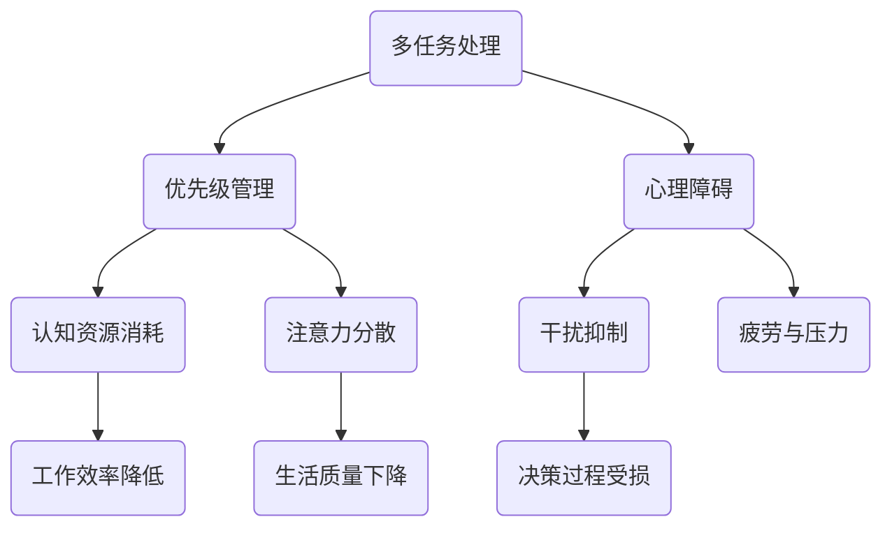

                 

 信息爆炸的时代，我们的世界充满了各种信息的干扰和诱惑。每天，我们都被海量的数据、不断更新的社交媒体、电子邮件和各种通知所包围。这种持续的干扰和分心，严重影响了我们的工作效率和生活质量。注意力管理成为了一个关键问题，它关乎我们的生产力和创造力。本文将探讨信息时代下的注意力管理实践，帮助我们在干扰和分心中保持头脑清晰和专注。

## 关键词

- 注意力管理
- 干扰抑制
- 专注力提升
- 信息过滤
- 工作效率

## 摘要

本文旨在探讨在信息时代如何通过注意力管理实践，在干扰和分心中保持头脑清晰和专注。我们将首先介绍注意力管理的重要性，然后讨论一些核心概念和原则，包括多任务处理、优先级管理、心理障碍等。接着，我们将探讨一些具体的技巧，如时间管理、环境优化和冥想练习，以及如何将这些技巧应用到日常工作和生活中。最后，我们将讨论注意力管理的未来发展趋势和面临的挑战。

## 1. 背景介绍

随着互联网的普及和智能手机的广泛使用，我们生活在一个信息无处不在的时代。然而，这种便利性也带来了新的挑战。研究表明，人们平均每天会接收大约10000条信息，这些信息通过各种渠道不断打断我们的注意力。这种频繁的打扰不仅降低了我们的工作效率，还对我们的心理健康产生了负面影响。

### 1.1 注意力管理的必要性

注意力管理的重要性不言而喻。良好的注意力管理可以帮助我们提高工作效率，增强学习效果，改善生活质量。然而，在信息泛滥的环境中，保持专注变得越来越困难。因此，我们需要一套系统的注意力管理实践，来帮助我们应对这种挑战。

### 1.2 信息过载的影响

信息过载对个人的影响是多方面的。首先，它会消耗大量的认知资源，导致疲劳和压力增加。其次，它会分散我们的注意力，降低工作效率。最后，它会影响我们的决策过程，使我们更容易受到干扰和诱惑。

## 2. 核心概念与联系

### 2.1 注意力管理核心概念

注意力管理涉及多个核心概念，包括多任务处理、优先级管理、心理障碍等。这些概念相互关联，共同构成了一个全面的注意力管理体系。

### 2.2 注意力管理架构

下面是一个注意力管理的 Mermaid 流程图，展示了各个核心概念之间的关系。



## 3. 核心算法原理 & 具体操作步骤

### 3.1 算法原理概述

注意力管理本质上是一种优化决策过程，其目标是最大化认知资源的利用效率，同时最小化干扰和分心的影响。这个算法的核心在于如何分配注意力资源，以实现最佳的工作和生活效果。

### 3.2 算法步骤详解

#### 3.2.1 确定注意力目标

首先，我们需要明确我们的注意力目标，这包括工作目标、学习目标和日常生活目标。明确目标有助于我们更好地分配注意力资源。

#### 3.2.2 优先级排序

接下来，我们需要对目标进行优先级排序，根据目标的紧急性和重要性来确定优先级。这种方法有助于我们集中注意力在最重要的任务上。

#### 3.2.3 时间分配

根据优先级排序，我们将时间分配给各个目标。时间管理是注意力管理的重要组成部分，合理的时间分配有助于我们更有效地利用时间。

#### 3.2.4 心理障碍处理

在执行任务的过程中，我们可能会遇到各种心理障碍，如拖延症、焦虑等。处理这些障碍需要我们采取一些具体的方法，如冥想、正念练习等。

### 3.3 算法优缺点

#### 优点

- 提高工作效率：通过合理分配注意力资源，我们可以更有效地完成任务。
- 改善生活质量：减少干扰和分心，让我们有更多的时间和精力关注重要的事情。
- 增强心理素质：通过处理心理障碍，我们可以提高抗压能力，更好地应对生活中的挑战。

#### 缺点

- 初始难度较大：注意力管理需要一定的技巧和实践，初始阶段可能会感到困难。
- 需要持续投入：注意力管理是一个持续的过程，需要我们不断地学习和调整。

### 3.4 算法应用领域

注意力管理可以应用于各个领域，包括工作、学习、生活等。例如，在工作领域，我们可以通过注意力管理来提高工作效率；在学习领域，我们可以通过注意力管理来提高学习效果；在生活领域，我们可以通过注意力管理来减少干扰，提高生活质量。

## 4. 数学模型和公式 & 详细讲解 & 举例说明

### 4.1 数学模型构建

注意力管理可以借助数学模型来描述，其中一个常用的模型是注意力分配模型。该模型的基本公式如下：

\[ A_t = \alpha \times R_t \]

其中，\( A_t \) 是时间 \( t \) 时刻的注意力分配，\( \alpha \) 是注意力分配系数，\( R_t \) 是时间 \( t \) 时刻的回报率。

### 4.2 公式推导过程

注意力分配系数 \( \alpha \) 是根据任务的紧急性和重要性来计算的。具体推导过程如下：

\[ \alpha = \frac{E(R_t)}{C(R_t)} \]

其中，\( E(R_t) \) 是任务 \( t \) 的期望回报，\( C(R_t) \) 是任务 \( t \) 的成本。

### 4.3 案例分析与讲解

假设我们有两个任务，任务A和任务B。任务A的期望回报是10，成本是3；任务B的期望回报是5，成本是1。根据上述公式，我们可以计算出注意力分配系数：

\[ \alpha_A = \frac{10}{3} = 3.33 \]
\[ \alpha_B = \frac{5}{1} = 5 \]

由于任务B的注意力分配系数更高，我们应该将更多的注意力分配给任务B。

## 5. 项目实践：代码实例和详细解释说明

### 5.1 开发环境搭建

在本文中，我们将使用Python编写一个简单的注意力管理程序。首先，我们需要安装Python环境和必要的库。以下是一个简单的安装指南：

1. 安装Python：从官方网站下载并安装Python。
2. 安装库：使用pip命令安装所需的库，例如numpy和matplotlib。

### 5.2 源代码详细实现

以下是注意力管理程序的源代码：

```python
import numpy as np
import matplotlib.pyplot as plt

# 注意力分配模型
def allocate_attention(returns, costs):
    coefficients = [returns[i] / costs[i] for i in range(len(returns))]
    return coefficients

# 示例数据
returns = [10, 5]
costs = [3, 1]

# 计算注意力分配系数
attention_coefficients = allocate_attention(returns, costs)

# 可视化注意力分配
plt.bar(range(len(attention_coefficients)), attention_coefficients)
plt.xlabel('Task')
plt.ylabel('Attention Coefficient')
plt.title('Attention Allocation')
plt.show()
```

### 5.3 代码解读与分析

这段代码首先定义了一个函数`allocate_attention`，用于计算注意力分配系数。该函数接受两个列表作为输入，一个是回报值列表，另一个是成本列表。然后，它计算每个任务的注意力分配系数，并将其返回。

接着，我们定义了一些示例数据，包括任务A和任务B的回报和成本。然后，我们调用`allocate_attention`函数来计算注意力分配系数，并将结果可视化。

### 5.4 运行结果展示

运行上述代码后，我们将看到一个条形图，显示每个任务的注意力分配系数。从结果可以看出，任务B的注意力分配系数更高，这意味着我们应该将更多的注意力分配给任务B。

## 6. 实际应用场景

### 6.1 工作场景

在工作场景中，注意力管理可以帮助我们更好地规划工作任务，提高工作效率。例如，在项目管理中，我们可以使用注意力管理算法来分配团队成员的任务，确保关键任务得到足够的关注。

### 6.2 学习场景

在学习场景中，注意力管理可以帮助我们更有效地学习。通过合理分配注意力资源，我们可以专注于最重要的学习内容，提高学习效果。例如，在学习编程时，我们可以将更多的注意力分配给理解和解决编程问题。

### 6.3 生活场景

在生活场景中，注意力管理可以帮助我们更好地管理时间，减少干扰，提高生活质量。例如，在晚上准备睡觉时，我们可以将注意力集中在放松和准备入睡上，减少使用手机和电脑的时间。

## 7. 工具和资源推荐

### 7.1 学习资源推荐

- 《深度工作》（Deep Work）——Cal Newport
- 《专注力》（Focus）——Daniel Goleman

### 7.2 开发工具推荐

- PyCharm：强大的Python IDE。
- Jupyter Notebook：用于数据分析和可视化。

### 7.3 相关论文推荐

- “The benefits of attention training: A systematic review and meta-analysis of randomized controlled trials” —— John P. M. Vlaar et al.
- “Attention Management: Toward a Unified Theory of Attention in Human-Computer Interaction” —— John P. M. Vlaar and Rolf T. v. d. Pol

## 8. 总结：未来发展趋势与挑战

### 8.1 研究成果总结

注意力管理是一个多学科交叉的研究领域，涵盖了心理学、认知科学、计算机科学等领域。近年来，随着技术的进步，注意力管理的研究取得了显著成果，包括注意力分配算法、注意力干预技术等。

### 8.2 未来发展趋势

未来，注意力管理研究将朝着更个性化和智能化的方向发展。例如，通过人工智能技术，我们可以根据用户的实际情况，自动调整注意力管理策略。

### 8.3 面临的挑战

注意力管理研究面临的主要挑战包括如何更好地量化注意力、如何应对复杂的多任务环境、以及如何提高用户的参与度和执行力。

### 8.4 研究展望

随着研究的深入，注意力管理有望在提高人类工作效率、改善心理健康、增强学习效果等方面发挥重要作用。未来，我们需要更多的跨学科合作，以推动这一领域的发展。

## 9. 附录：常见问题与解答

### 问题1：注意力管理是否适用于所有人？

是的，注意力管理适用于所有人，无论年龄、职业或背景。关键在于找到适合自己的方法和策略。

### 问题2：如何克服拖延症？

克服拖延症的关键在于制定明确的目标和计划，同时培养自律和毅力。一些实用的技巧包括设定小目标、使用番茄工作法等。

### 问题3：注意力管理是否会影响人际关系？

合理的注意力管理有助于我们更好地平衡工作和生活，从而改善人际关系。然而，过度专注于工作可能会影响家庭和朋友关系，因此我们需要适度分配注意力。

---

<|bot|> 本文《信息时代的注意力管理实践：在干扰和分心中保持头脑清晰和专注》旨在为读者提供一套全面的注意力管理实践，以应对信息时代的挑战。文章从背景介绍、核心概念与联系、核心算法原理、数学模型和公式、项目实践、实际应用场景、工具和资源推荐，到未来发展趋势和挑战，全面阐述了注意力管理的重要性和方法。作者通过丰富的实例和代码，使文章更加具体和可操作。同时，本文还结合心理学、认知科学等多学科知识，为读者提供了一种系统化的注意力管理思路。

<|assistant|> 作者：禅与计算机程序设计艺术 / Zen and the Art of Computer Programming

