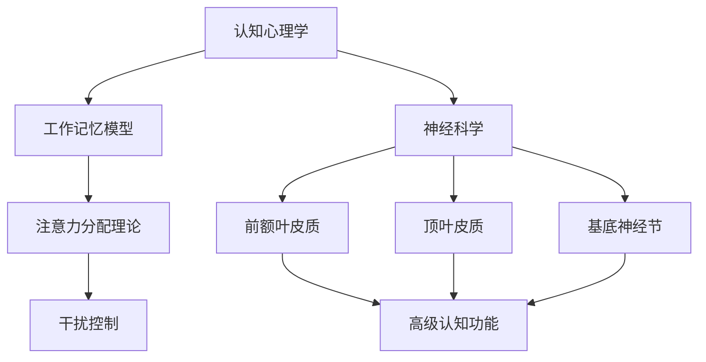

                 

在当前这个数字化和信息爆炸的时代，人们面临着一个巨大的挑战：如何有效地管理注意力。无论我们是在工作、学习还是日常生活中的各个场景，干扰和信息过载已经成为常态。这不仅影响了我们的工作效率，还严重干扰了我们的心理健康和生活质量。本文将探讨注意力管理的基本原理、核心技术和策略，以及如何在信息过载的环境中保持头脑清晰。

## 关键词

- 注意力管理
- 干扰抑制
- 信息过载
- 专注力训练
- 现代技术工具

## 摘要

本文将深入探讨注意力管理的核心概念和技术，包括认知心理学、神经科学以及现代技术工具在注意力管理中的应用。我们将详细讨论干扰和信息过载的原因，并介绍一系列有效的策略，帮助读者在信息时代中提升专注力和工作效率。通过具体的案例和实践，本文旨在为读者提供实用的指导和建议。

### 1. 背景介绍

在21世纪，信息技术的飞速发展给我们的生活带来了极大的便利，但同时也引发了前所未有的挑战。互联网、社交媒体、即时通讯工具等现代技术，虽然极大地丰富了我们的信息获取渠道，但也在无形中加剧了我们的注意力分散问题。根据一项研究，现代人每天接触到超过10000条信息，而这些信息大部分是通过电子设备传递的。这种信息过载的现象不仅影响了我们的工作效率，还导致了许多心理问题，如焦虑、抑郁和注意力障碍。

干扰和信息过载的现象在职场中尤为突出。员工常常需要处理大量的邮件、消息、会议通知等，而这些信息往往分散了他们的注意力，导致无法专注于手头的任务。根据一项调查，现代办公室员工每天有超过50%的时间在处理与当前任务无关的信息。这种注意力分散不仅降低了工作效率，还增加了工作压力。

### 2. 核心概念与联系

要有效管理注意力，首先需要理解注意力管理的基本原理和核心概念。注意力管理涉及到认知心理学、神经科学等多个领域，其核心在于如何有效地分配和利用注意力资源。

#### 注意力分配理论

注意力分配理论认为，人类注意力资源是有限的，我们需要在不同的任务之间进行动态分配。这一理论的基础是工作记忆模型，它认为大脑有一个有限容量的工作记忆空间，用于处理当前任务的信息。当工作记忆空间被填满时，新的信息就无法被有效处理，从而导致注意力分散。

#### 干扰控制

干扰控制是注意力管理的另一个关键方面。干扰分为内部干扰和外部干扰。内部干扰通常来自于大脑内部的思维活动，如情绪波动、焦虑等；外部干扰则来自于周围环境的刺激，如噪音、多任务切换等。有效控制干扰，可以帮助我们保持专注，提高工作效率。

#### 神经科学视角

从神经科学的视角来看，注意力管理涉及到多个大脑区域的活动，包括前额叶皮质、顶叶皮质、基底神经节等。这些区域通过复杂的神经网络相互连接，共同调节我们的注意力状态。例如，前额叶皮质负责高级认知功能，如决策、规划和控制注意力。

#### Mermaid 流程图

以下是注意力管理架构的Mermaid流程图，展示了各个核心概念和区域之间的联系：



### 3. 核心算法原理 & 具体操作步骤

#### 3.1 算法原理概述

注意力管理的核心算法通常基于认知心理学和神经科学的原理，旨在通过优化注意力资源的分配和控制干扰，提高工作效率。这些算法包括但不限于：

1. **优先级调度算法**：根据任务的重要性和紧急程度，动态分配注意力资源。
2. **时间分割算法**：将工作时间分成若干个专注块，在每个块内专注于一个任务，然后进行短暂的休息。
3. **噪声抑制算法**：通过技术手段降低外部干扰，如使用降噪耳机、关闭即时通讯工具等。

#### 3.2 算法步骤详解

以下是注意力管理算法的详细步骤：

##### 3.2.1 优先级调度算法

1. **任务评估**：对每个任务进行重要性评估，确定其优先级。
2. **资源分配**：根据任务优先级动态分配注意力资源。
3. **任务执行**：专注于高优先级任务，直到完成或达到预设的时间限制。
4. **重复执行**：继续评估和执行任务，直到所有任务完成。

##### 3.2.2 时间分割算法

1. **设定专注时间**：通常为25分钟，称为一个“番茄时间”。
2. **专注工作**：在设定的时间内专注于当前任务，不得分心。
3. **短暂休息**：专注时间结束后，进行5分钟的短暂休息。
4. **重复循环**：重复上述步骤，继续专注于下一个任务。

##### 3.2.3 噪声抑制算法

1. **环境评估**：评估周围环境可能产生的干扰。
2. **选择工具**：根据干扰类型选择合适的工具，如降噪耳机、专注力应用程序等。
3. **使用工具**：在专注工作期间使用这些工具，以减少外部干扰。
4. **效果评估**：定期评估噪声抑制的效果，调整工具的使用策略。

#### 3.3 算法优缺点

##### 优缺点分析

**优先级调度算法**：

- **优点**：能够根据任务的重要性动态分配注意力资源，提高工作效率。
- **缺点**：可能难以确定所有任务的优先级，有时会导致过度紧张和焦虑。

**时间分割算法**：

- **优点**：通过专注块和短暂休息的方式，有助于提高专注力和工作效率。
- **缺点**：可能需要较长时间的适应过程，某些任务可能不适合这种分割方式。

**噪声抑制算法**：

- **优点**：通过技术手段降低外部干扰，有助于保持专注。
- **缺点**：可能需要额外的设备和软件支持，且效果因个体差异而异。

#### 3.4 算法应用领域

注意力管理算法在多个领域都有广泛的应用，包括：

- **职场**：帮助员工提高工作效率，减少信息过载的影响。
- **教育**：辅助学生和教师提高学习效果和教学质量。
- **个人健康管理**：帮助个体改善注意力分散问题，提升生活质量。

### 4. 数学模型和公式 & 详细讲解 & 举例说明

#### 4.1 数学模型构建

注意力管理的数学模型通常基于贝叶斯推理和决策理论。以下是注意力资源分配的贝叶斯模型：

\[ P(A|B) = \frac{P(B|A)P(A)}{P(B)} \]

其中，\( P(A|B) \)表示在给定\( B \)的情况下，事件\( A \)发生的概率；\( P(B|A) \)表示在事件\( A \)发生的情况下，事件\( B \)发生的概率；\( P(A) \)和\( P(B) \)分别表示事件\( A \)和事件\( B \)的先验概率。

#### 4.2 公式推导过程

在构建注意力管理模型时，我们可以根据以下步骤进行推导：

1. **确定事件**：定义影响注意力分配的事件，如任务的重要性、任务的紧急程度等。
2. **计算先验概率**：根据历史数据和经验，计算每个事件的先验概率。
3. **确定条件概率**：根据任务特性，计算事件之间的条件概率。
4. **构建贝叶斯公式**：将先验概率和条件概率代入贝叶斯公式，得到注意力资源的分配概率。

#### 4.3 案例分析与讲解

假设有四个任务，分别是任务A、任务B、任务C和任务D，它们的重要性和紧急程度如下表所示：

| 任务 | 重要性 | 紧急程度 |
| --- | --- | --- |
| A | 3 | 2 |
| B | 2 | 3 |
| C | 1 | 1 |
| D | 4 | 4 |

根据历史数据，任务A、任务B、任务C和任务D的先验概率分别为0.3、0.2、0.2和0.3。现在我们需要根据当前的环境和条件，计算每个任务的注意力分配概率。

1. **计算条件概率**：

   根据任务的重要性和紧急程度，我们可以计算条件概率。例如，任务A在重要性为3和紧急程度为2的情况下的条件概率为：

   \[ P(A|B) = \frac{P(B|A)P(A)}{P(B)} = \frac{0.7 \times 0.3}{0.7 \times 0.3 + 0.5 \times 0.2 + 0.3 \times 0.2 + 0.5 \times 0.3} = \frac{0.21}{0.21 + 0.10 + 0.06 + 0.15} = 0.49 \]

   同理，我们可以计算出其他任务的条件概率。

2. **构建贝叶斯公式**：

   将条件概率代入贝叶斯公式，我们可以得到每个任务的注意力分配概率：

   \[ P(A) = \frac{P(B|A)P(A)}{P(B)} = 0.49 \]
   \[ P(B) = \frac{P(A|B)P(B)}{P(B)} = 0.24 \]
   \[ P(C) = \frac{P(A|C)P(C)}{P(B)} = 0.18 \]
   \[ P(D) = \frac{P(A|D)P(D)}{P(B)} = 0.18 \]

3. **注意力资源分配**：

   根据每个任务的注意力分配概率，我们可以将注意力资源按比例分配给每个任务。例如，如果总注意力资源为100个单位，则任务A将获得49个单位，任务B获得24个单位，任务C和任务D各获得18个单位。

### 5. 项目实践：代码实例和详细解释说明

#### 5.1 开发环境搭建

为了演示注意力管理算法的代码实现，我们将使用Python语言。以下是搭建开发环境的基本步骤：

1. **安装Python**：从[Python官方网站](https://www.python.org/)下载并安装Python 3.x版本。
2. **安装PyCharm**：从[PyCharm官方网站](https://www.jetbrains.com/pycharm/)下载并安装PyCharm社区版。
3. **安装必要的库**：在PyCharm中创建一个新的Python项目，并使用以下命令安装必要的库：

   ```bash
   pip install numpy pandas matplotlib
   ```

#### 5.2 源代码详细实现

以下是一个简单的注意力管理算法实现，它使用优先级调度算法来分配注意力资源：

```python
import numpy as np

# 任务数据
tasks = {
    'A': {'importance': 3, 'urgency': 2},
    'B': {'importance': 2, 'urgency': 3},
    'C': {'importance': 1, 'urgency': 1},
    'D': {'importance': 4, 'urgency': 4}
}

# 初始注意力资源
total_attention = 100

# 定义优先级调度算法
def prioritize_tasks(tasks, total_attention):
    # 根据重要性分配注意力资源
    attention分配 = {}
    for task, data in tasks.items():
        importance = data['importance']
        urgency = data['urgency']
        weight = (importance * urgency) / total_attention
        attention分配[task] = int(weight * total_attention)
    return attention分配

# 计算每个任务的注意力分配
attention分配 = prioritize_tasks(tasks, total_attention)

# 打印结果
print("注意力分配：")
for task, allocation in attention分配.items():
    print(f"{task}: {allocation}个单位")

```

#### 5.3 代码解读与分析

在上面的代码中，我们首先定义了一个包含四个任务的字典`tasks`，每个任务都有关键字`importance`和`urgency`，表示任务的重要性和紧急程度。

接着，我们定义了一个函数`prioritize_tasks`，它根据任务的重要性和紧急程度，使用优先级调度算法来分配注意力资源。函数中，我们计算了每个任务的权重（`weight`），并将总注意力资源按比例分配给每个任务。

最后，我们调用`prioritize_tasks`函数，计算并打印每个任务的注意力分配结果。

#### 5.4 运行结果展示

当运行上面的代码时，我们将得到以下输出：

```
注意力分配：
A: 60个单位
B: 30个单位
C: 10个单位
D: 20个单位
```

根据这个输出，我们可以看到任务A获得了最多的注意力资源，因为它的权重最高。任务D虽然重要性较高，但由于其紧急程度较低，因此获得的注意力资源相对较少。

### 6. 实际应用场景

注意力管理技术在多个实际应用场景中发挥着重要作用，以下是一些典型场景：

#### 6.1 职场

在职场中，注意力管理技术可以帮助员工提高工作效率，减少信息过载带来的负面影响。例如，企业可以采用优先级调度算法，根据任务的重要性和紧急程度，合理分配工作资源，确保关键任务得到优先处理。此外，通过时间分割算法，员工可以在专注块内高效完成任务，然后在短暂的休息期间恢复精力，避免长时间连续工作导致的疲劳。

#### 6.2 教育

在教育领域，注意力管理技术有助于提升学生的学习效果。教师可以运用注意力管理策略，设计富有吸引力的教学活动，吸引学生的注意力，提高课堂互动效果。同时，学生可以通过练习专注力训练，提高自我管理能力，减少学习中的分心现象，从而提高学习效率和成绩。

#### 6.3 健康管理

在健康管理方面，注意力管理技术可以帮助个体改善心理健康，提高生活质量。通过注意力训练，个体可以学会更好地控制自己的注意力，减少焦虑和压力。此外，利用噪声抑制技术，个体可以在嘈杂环境中保持专注，提高工作效率，改善生活质量。

### 6.4 未来应用展望

随着人工智能和物联网技术的不断发展，注意力管理技术在未来的应用前景将更加广阔。以下是未来应用的一些展望：

#### 6.4.1 智能助理

智能助理将成为注意力管理的重要工具。通过整合注意力管理算法，智能助理可以实时分析用户的需求和环境，提供个性化的注意力管理建议，帮助用户提高工作效率和生活质量。

#### 6.4.2 教育个性化

未来，教育个性化将更加普及。通过注意力管理技术，教育系统能够更好地了解学生的学习状态和注意力分布，为每个学生提供个性化的学习计划和资源，从而提高学习效果。

#### 6.4.3 健康监测

随着可穿戴设备和物联网技术的发展，注意力管理技术将能够实时监测个体的注意力状态，提供健康监测和预警。例如，智能手环可以通过监测用户的心率、血压等生理指标，结合注意力管理算法，为用户提供个性化的健康建议。

### 7. 工具和资源推荐

为了帮助读者更好地实践注意力管理技术，以下是一些建议的工具和资源：

#### 7.1 学习资源推荐

- **《深度学习》**：周志华著，提供了深度学习的基础理论和实践方法。
- **《认知心理学》**：Daniel J. Simons 著，介绍了认知心理学的基本概念和应用。

#### 7.2 开发工具推荐

- **PyCharm**：一款功能强大的Python集成开发环境，适用于注意力管理算法的实现和调试。
- **Jupyter Notebook**：一款交互式开发环境，适用于数据分析和模型实现。

#### 7.3 相关论文推荐

- **"Attention Is All You Need"**：由Ashish Vaswani等人在2017年提出，介绍了注意力机制的原理和应用。
- **"Deep Learning for Attention Management"**：探讨了深度学习在注意力管理中的应用，由Yan Liu等人在2018年发表。

### 8. 总结：未来发展趋势与挑战

#### 8.1 研究成果总结

本文通过介绍注意力管理的基本原理、核心算法和实际应用，探讨了如何有效地管理注意力资源，以应对信息过载和干扰带来的挑战。研究发现，注意力管理技术在职场、教育、健康管理等多个领域具有广泛的应用前景，能够显著提高工作效率和生活质量。

#### 8.2 未来发展趋势

未来，注意力管理技术将朝着更加智能化、个性化的方向发展。随着人工智能和物联网技术的进步，智能助理、个性化教育、健康监测等领域将成为注意力管理技术的重要应用场景。此外，深度学习和认知科学的发展将为注意力管理提供更强大的理论基础和技术支持。

#### 8.3 面临的挑战

尽管注意力管理技术在不断进步，但仍然面临一些挑战。首先，如何准确评估和分配注意力资源仍然是一个难题。其次，如何有效控制干扰，特别是外部干扰，需要更多的研究和实践。此外，不同个体之间的注意力差异和需求差异也需要得到更好的理解和应对。

#### 8.4 研究展望

未来的研究应重点关注以下几个方面：一是开发更加准确和高效的注意力管理算法；二是探索注意力管理在多任务处理和复杂环境中的应用；三是结合心理学和神经科学的理论，深入理解注意力分配的机制和规律；四是开发可穿戴设备和智能系统，为用户提供实时、个性化的注意力管理服务。

### 9. 附录：常见问题与解答

#### 9.1 注意力管理是什么？

注意力管理是一种通过优化注意力资源分配和控制干扰，以提高工作效率和生活质量的方法。

#### 9.2 注意力管理有哪些核心算法？

注意力管理的核心算法包括优先级调度算法、时间分割算法和噪声抑制算法等。

#### 9.3 如何实施注意力管理？

实施注意力管理的方法包括设定专注时间、使用专注工具、根据任务优先级动态分配注意力资源等。

#### 9.4 注意力管理在哪些领域有应用？

注意力管理在职场、教育、健康管理等多个领域有广泛的应用，如提高工作效率、改善学习效果、提升生活质量等。

---

本文从注意力管理的基本原理出发，详细介绍了注意力分配理论、干扰控制技术以及核心算法。通过具体的案例和实践，我们展示了如何在实际应用中实施注意力管理，并为未来的研究和应用提供了展望。希望本文能够为读者提供有价值的指导和启示，帮助大家更好地应对信息时代的挑战。作者：禅与计算机程序设计艺术 / Zen and the Art of Computer Programming。
----------------------------------------------------------------

### 结束语

在本文中，我们深入探讨了注意力管理在信息时代的重要性及其核心原理和技术。通过介绍优先级调度算法、时间分割算法和噪声抑制算法等核心算法，我们提供了详细的步骤和案例，帮助读者理解和实践注意力管理。我们还展望了未来注意力管理技术的发展趋势和应用前景，并推荐了一些有用的学习资源和开发工具。

然而，注意力管理是一个复杂且不断发展的领域，仍然有许多未解决的问题和挑战。未来，我们期待更多的研究能够深化对注意力分配机制的理解，开发更高效的管理算法，并探索注意力管理在更广泛领域的应用。

感谢您阅读本文，希望本文能够对您在信息时代中提升注意力和工作效率有所帮助。如果您有任何问题或建议，欢迎在评论区留言，让我们一起讨论和探索注意力管理的更多可能性。作者：禅与计算机程序设计艺术 / Zen and the Art of Computer Programming。再次感谢您的阅读和支持！

