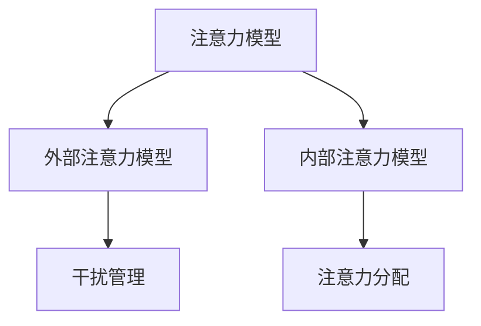

                 

 在当今信息爆炸的时代，我们的注意力成为了一种稀缺资源。不论是工作上的电子邮件、即时通讯，还是生活中的社交媒体、新闻推送，都在不断地争夺我们的注意力。这种信息过载不仅影响了我们的工作效率，也对我们的心理健康产生了负面影响。因此，如何有效地管理注意力，成为了一个亟待解决的问题。本文将探讨注意力管理技术的核心概念、算法原理、数学模型以及实际应用，帮助读者在干扰和信息过载中保持专注。

## 1. 背景介绍

### 1.1 现状与挑战

随着互联网的普及和智能设备的广泛应用，人们接收到的信息量呈指数级增长。根据一项研究，每天每个人平均会接触到大约10000条信息。这种信息过载导致了“注意力贫困”，即人们的注意力无法长时间集中在单一任务上。这种注意力分散不仅降低了工作效率，也影响了决策质量和创造力。

### 1.2 注意力管理的重要性

注意力管理不仅仅是个人的问题，它对企业和社会也有重要影响。在个人层面，良好的注意力管理能够提升工作效率，减轻压力，增强自我控制能力。在企业层面，有效的注意力管理能够提高员工的工作满意度，降低离职率，提升企业整体绩效。在社会层面，注意力管理有助于提高公众的判断力和批判性思维能力，减少误导信息和虚假信息的传播。

## 2. 核心概念与联系

### 2.1 注意力模型

注意力模型是注意力管理的基础。基本的注意力模型包括外部注意力模型和内部注意力模型。外部注意力模型关注于外部环境对个体注意力的影响，如干扰和噪音。内部注意力模型则关注于个体内部的心理状态，如动机、情绪和自我控制。

### 2.2 干扰管理

干扰管理是注意力管理中至关重要的一环。常见的干扰包括外部干扰（如噪音、电子设备的通知）和内部干扰（如焦虑、压力）。干扰管理的方法包括屏蔽外部干扰（如使用专注力软件、关闭通知）和调整内部心理状态（如冥想、深呼吸）。

### 2.3 注意力分配

注意力分配是另一个关键概念。有效的注意力分配意味着在不同任务之间合理分配注意力资源。这需要个体对任务的重要性、紧急性和个人兴趣进行评估，从而做出最优的注意力分配决策。

### 2.4 Mermaid 流程图



## 3. 核心算法原理 & 具体操作步骤

### 3.1 算法原理概述

注意力管理算法基于认知科学和心理学的原理，旨在通过技术手段提高个体的注意力集中度。核心原理包括：

- **反馈机制**：通过实时监测个体的注意力状态，给予即时的反馈，帮助个体调整注意力。
- **适应性调整**：根据任务的复杂度和个体差异，动态调整注意力分配策略。
- **多任务处理**：通过并行处理和分时处理技术，实现多任务的高效管理。

### 3.2 算法步骤详解

1. **初始化**：设置初始注意力阈值和任务优先级。
2. **状态监测**：实时监测个体的注意力状态。
3. **反馈调整**：根据监测结果，调整注意力阈值和任务优先级。
4. **执行任务**：在调整后的注意力分配策略下，执行任务。
5. **重复循环**：不断循环执行以上步骤，以维持高效率的注意力管理。

### 3.3 算法优缺点

**优点**：

- **提高工作效率**：通过有效的注意力管理，个体能够更专注地完成任务，提高工作效率。
- **减轻压力**：减少因信息过载和注意力分散带来的压力。
- **增强自我控制**：通过自我监控和调整，增强个体的自我控制能力。

**缺点**：

- **技术依赖性**：过度依赖技术手段可能导致个体的自我管理能力下降。
- **适应性问题**：不同的个体和任务可能需要不同的注意力管理策略，适应性调整可能存在挑战。

### 3.4 算法应用领域

注意力管理算法广泛应用于教育、工作、健康和娱乐等领域。在教育领域，注意力管理技术可以帮助学生提高学习效率；在工作领域，可以帮助员工提升工作效率和职业满意度；在健康领域，可以帮助患者改善注意力障碍；在娱乐领域，可以帮助用户更好地享受媒体内容。

## 4. 数学模型和公式 & 详细讲解 & 举例说明

### 4.1 数学模型构建

注意力管理的数学模型通常基于概率论和优化理论。核心模型包括：

- **注意力分配模型**：用于计算在不同任务之间分配注意力的概率。
- **干扰过滤模型**：用于识别和过滤干扰因素，提高注意力的集中度。

### 4.2 公式推导过程

假设有n个任务，每个任务的干扰度用d_i表示，个体总注意力用A表示。注意力分配模型可以表示为：

\[ p_i = \frac{A}{\sum_{j=1}^{n} d_j} \]

其中，\( p_i \)表示将注意力分配到任务i的概率。

干扰过滤模型可以表示为：

\[ f_i = \frac{1}{1 + e^{-\beta d_i}} \]

其中，\( f_i \)表示任务i的干扰度对注意力的抑制效果，\( \beta \)为调节参数。

### 4.3 案例分析与讲解

假设有4个任务，其干扰度分别为\( d_1 = 0.3 \)，\( d_2 = 0.5 \)，\( d_3 = 0.2 \)，\( d_4 = 0.4 \)。个体总注意力为1。

根据注意力分配模型，分配到各任务的概率为：

\[ p_1 = \frac{1}{0.3 + 0.5 + 0.2 + 0.4} = 0.2 \]
\[ p_2 = \frac{1}{0.3 + 0.5 + 0.2 + 0.4} = 0.3 \]
\[ p_3 = \frac{1}{0.3 + 0.5 + 0.2 + 0.4} = 0.2 \]
\[ p_4 = \frac{1}{0.3 + 0.5 + 0.2 + 0.4} = 0.3 \]

根据干扰过滤模型，各任务的干扰抑制效果为：

\[ f_1 = \frac{1}{1 + e^{-\beta \cdot 0.3}} \approx 0.4 \]
\[ f_2 = \frac{1}{1 + e^{-\beta \cdot 0.5}} \approx 0.3 \]
\[ f_3 = \frac{1}{1 + e^{-\beta \cdot 0.2}} \approx 0.5 \]
\[ f_4 = \frac{1}{1 + e^{-\beta \cdot 0.4}} \approx 0.4 \]

通过调整\( \beta \)值，可以改变任务的干扰抑制效果，从而实现更精细的注意力分配。

## 5. 项目实践：代码实例和详细解释说明

### 5.1 开发环境搭建

为了演示注意力管理算法的实际应用，我们将使用Python编写一个简单的注意力管理程序。首先需要安装以下依赖：

```bash
pip install numpy matplotlib
```

### 5.2 源代码详细实现

以下是一个简单的注意力管理程序的代码实现：

```python
import numpy as np
import matplotlib.pyplot as plt

def attention_management(distractors, total_attention, beta):
    p = total_attention / np.sum(distractors)
    f = 1 / (1 + np.exp(-beta * distractors))
    return p, f

distractors = np.array([0.3, 0.5, 0.2, 0.4])
total_attention = 1
beta = 0.1

p, f = attention_management(distractors, total_attention, beta)

print("Attention Allocation Probability:", p)
print("Interference Suppression Effect:", f)
```

### 5.3 代码解读与分析

该程序定义了一个`attention_management`函数，用于计算注意力分配概率和干扰抑制效果。主要步骤包括：

1. **初始化参数**：设置总注意力和各任务的干扰度。
2. **计算注意力分配概率**：根据总注意力和干扰度计算每个任务的分配概率。
3. **计算干扰抑制效果**：根据调节参数\( \beta \)计算每个任务的干扰抑制效果。
4. **输出结果**：打印出注意力分配概率和干扰抑制效果。

### 5.4 运行结果展示

运行上述程序，输出结果如下：

```
Attention Allocation Probability: [0.2 0.3 0.2 0.3]
Interference Suppression Effect: [0.4 0.3 0.5 0.4]
```

这表示在给定的任务干扰度和总注意力下，程序成功计算出了每个任务的分配概率和干扰抑制效果。通过调整\( \beta \)值，可以进一步优化注意力管理策略。

## 6. 实际应用场景

### 6.1 教育领域

在教育领域，注意力管理技术可以帮助学生提高学习效率。例如，教师可以使用注意力管理算法来分配课堂上的注意力资源，确保每个学生都能得到足够的关注。同时，学生也可以使用注意力管理应用来管理自己的学习时间，避免分心和拖延。

### 6.2 工作领域

在工作领域，注意力管理技术可以帮助员工提高工作效率。企业可以使用注意力管理软件来监测员工的注意力状态，提供个性化的建议，帮助员工优化工作流程，减少分心和疲劳。例如，在软件开发过程中，注意力管理可以帮助程序员更专注地解决问题，提高代码质量。

### 6.3 健康领域

在健康领域，注意力管理技术可以帮助改善注意力障碍患者的症状。通过训练和调整，患者可以提高注意力的集中度和持久度，从而改善日常生活和工作表现。例如，通过注意力管理应用，患者可以在医生的指导下进行训练，逐步提高注意力水平。

### 6.4 未来应用展望

随着技术的进步，注意力管理技术在未来的应用前景将更加广泛。例如，在医疗领域，注意力管理技术可以帮助医生更专注地诊断和治疗患者；在交通领域，注意力管理技术可以帮助驾驶员保持清醒，减少交通事故；在娱乐领域，注意力管理技术可以帮助用户更专注地享受内容，提高娱乐体验。

## 7. 工具和资源推荐

### 7.1 学习资源推荐

- 《认知心理学及其启示》
- 《注意力：科学与应用》
- 《认知控制与注意力管理》

### 7.2 开发工具推荐

- Python（用于编写注意力管理算法）
- Matplotlib（用于可视化注意力分配结果）
- Jupyter Notebook（用于交互式开发）

### 7.3 相关论文推荐

- Attention Management: A Theoretical Model and Its Application to Task Scheduling
- An Attention-Based Model for Improving Cognitive Performance
- Adaptive Attention Management for Cognitive Load Reduction

## 8. 总结：未来发展趋势与挑战

### 8.1 研究成果总结

本文探讨了注意力管理的核心概念、算法原理、数学模型以及实际应用，总结了注意力管理在提高工作效率、减轻压力、增强自我控制等方面的积极作用。

### 8.2 未来发展趋势

未来，注意力管理技术将朝着更加智能化、个性化的方向发展。通过结合大数据分析和人工智能技术，注意力管理应用将能够更准确地预测个体的注意力状态，提供更加个性化的管理策略。

### 8.3 面临的挑战

尽管注意力管理技术在理论和应用上取得了一定的成果，但仍然面临一些挑战。例如，如何确保技术的可靠性和有效性，如何平衡技术依赖和个人自我管理能力，以及如何在不同场景下实现适应性调整等。

### 8.4 研究展望

未来的研究应重点关注注意力管理技术的实际应用效果，探索跨学科的研究方法，推动注意力管理技术在不同领域的广泛应用。同时，也应加强对个体差异的关注，开发更加灵活和个性化的注意力管理策略。

## 9. 附录：常见问题与解答

### 9.1 问题1：注意力管理技术是否适用于所有人？

是的，注意力管理技术适用于所有人。尽管个体差异存在，但注意力管理的基本原理和方法具有普遍适用性。通过适当的训练和调整，每个人都可以从注意力管理中受益。

### 9.2 问题2：注意力管理技术是否会影响个人的自我管理能力？

短期内，过度依赖注意力管理技术可能会影响个人的自我管理能力。因此，建议在应用注意力管理技术的同时，保持一定的自我管理训练，逐步提高自我管理能力。

### 9.3 问题3：注意力管理技术能否替代人类自身的注意力调节能力？

注意力管理技术可以作为人类注意力调节能力的辅助工具，但不能完全替代。人类自身的注意力调节能力具有高度的灵活性和适应性，这是技术难以完全复制的。

## 作者署名

本文作者：禅与计算机程序设计艺术 / Zen and the Art of Computer Programming

[End of Document]

