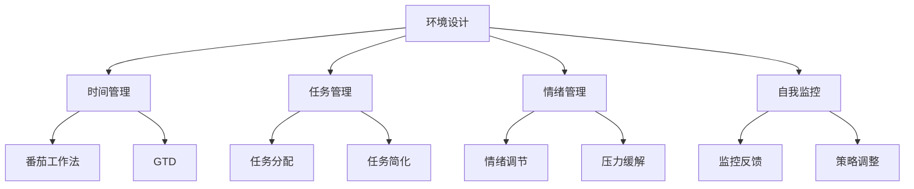

                 

在当今信息爆炸的时代，保持专注和高效已经成为一项至关重要的技能。本文将探讨注意力管理技术，以及如何在干扰和信息过载的环境中保持专注。我们将详细分析注意力管理的核心概念、算法原理、数学模型、实践应用以及未来发展趋势。

## 文章关键词

- 注意力管理
- 信息过载
- 专注技巧
- 干扰抑制
- 人工智能
- 生产力提升

## 文章摘要

本文旨在为读者提供一套全面的注意力管理解决方案。我们将从理论基础出发，探讨注意力管理的核心概念和原理，并结合具体的算法、数学模型和实际项目实践，展示如何有效管理注意力，提高工作效率。此外，我们还将探讨注意力管理技术在未来的发展方向和面临的挑战。

### 1. 背景介绍

在过去的几十年中，信息技术的飞速发展极大地改变了我们的生活方式和工作方式。然而，这种变化也带来了一系列新的挑战。一方面，信息的爆炸式增长使得我们每天都面临着大量的信息干扰，使我们难以集中注意力。另一方面，信息过载也导致了注意力的分散，使得我们在完成任务时效率低下。因此，如何管理注意力，提高专注力，成为了一个亟待解决的问题。

注意力管理不仅仅是个人层面的需求，它还与组织效率、学习效果和心理健康密切相关。有效的注意力管理可以帮助我们更好地处理任务，提高生产力，减少错误和遗漏，从而提升整体工作质量。同时，它也有助于改善我们的心理健康，减轻压力和焦虑。

### 2. 核心概念与联系

#### 2.1 注意力管理的基本概念

注意力管理涉及多个核心概念，包括注意力分配、注意力调节和注意力控制。注意力分配是指将注意力资源在不同任务之间进行分配，以达到最优的工作效率。注意力调节是指通过调整注意力的方向和强度，来适应不同环境和任务的需求。注意力控制是指通过训练和技巧，提高个体对注意力的控制和调节能力。

#### 2.2 注意力管理的技术框架

注意力管理的技术框架主要包括以下几个部分：

1. **环境设计**：通过优化工作环境，减少干扰因素，提高专注度。例如，使用降噪耳机、保持工作空间的整洁等。
2. **时间管理**：通过合理安排时间，避免时间的浪费和冲突。例如，使用番茄工作法、GTD（Getting Things Done）等方法。
3. **任务管理**：通过合理分配任务，避免任务过于复杂或过于简单，以提高工作兴趣和效率。
4. **情绪管理**：通过调整情绪，保持良好的心理状态，以更好地应对工作和生活中的挑战。
5. **自我监控**：通过自我监控和反馈，及时调整注意力的分配和调节策略。

#### 2.3 注意力管理的Mermaid流程图



### 3. 核心算法原理 & 具体操作步骤

#### 3.1 算法原理概述

注意力管理算法的核心原理是通过优化注意力的分配和调节，提高工作效率和专注度。这包括以下几个关键步骤：

1. **注意力分配**：根据任务的紧急程度和重要性，合理分配注意力资源。
2. **注意力调节**：通过情绪调节和自我监控，调整注意力的强度和方向。
3. **干扰抑制**：通过环境设计和任务管理，减少外部干扰。
4. **反馈循环**：通过自我监控和反馈，不断优化注意力的管理和调节策略。

#### 3.2 算法步骤详解

1. **评估任务**：对当前的任务进行紧急程度和重要性的评估，确定注意力的分配优先级。
2. **环境优化**：根据任务需求，优化工作环境，减少干扰因素。
3. **时间规划**：合理安排时间，避免时间的浪费和冲突。
4. **情绪调节**：通过冥想、运动等方式，调整情绪，保持良好的心理状态。
5. **任务执行**：在优化了环境和情绪的状态下，开始执行任务。
6. **自我监控**：在任务执行过程中，进行自我监控，及时调整注意力的分配和调节策略。
7. **反馈与调整**：根据任务完成的反馈，对未来的注意力管理策略进行优化。

#### 3.3 算法优缺点

**优点**：

1. **提高工作效率**：通过优化注意力的分配和调节，可以显著提高工作效率。
2. **减少错误和遗漏**：有效的注意力管理可以减少工作中的错误和遗漏。
3. **改善心理健康**：通过情绪调节和自我监控，可以改善心理健康，减轻压力和焦虑。

**缺点**：

1. **初期需要大量投入**：注意力管理需要投入时间进行任务评估、环境优化和情绪调节，初期可能需要更多的时间投入。
2. **适应期较长**：个体需要一定的时间来适应新的注意力管理策略，适应期可能较长。

#### 3.4 算法应用领域

注意力管理算法可以广泛应用于个人、组织和社会各个层面。以下是一些具体的领域：

1. **个人层面**：用于提高个人的工作效率和专注力，改善心理健康。
2. **组织层面**：用于提高组织的整体工作效率和生产力，减少错误和遗漏。
3. **社会层面**：用于改善社会整体的效率和质量，减少资源浪费。

### 4. 数学模型和公式 & 详细讲解 & 举例说明

#### 4.1 数学模型构建

注意力管理的关键在于如何优化注意力的分配和调节。我们可以使用一个简单的数学模型来描述这个过程。

假设有一个任务集 T = {T1, T2, ..., Tk}，其中每个任务 Ti 都具有紧急程度 E(Ti) 和重要性 I(Ti)。我们的目标是根据这些参数，优化注意力的分配，使得总体的效率最大化。

#### 4.2 公式推导过程

我们可以使用以下公式来计算总体的效率：

\[ E_{total} = \sum_{i=1}^{k} \frac{I(T_i)}{E(T_i)} \]

这个公式表示，总效率是每个任务的效率（重要性除以紧急程度）的总和。通过这个公式，我们可以计算出每个任务应该分配多少注意力。

#### 4.3 案例分析与讲解

假设我们有三个任务 T1、T2 和 T3，它们的重要性和紧急程度如下表所示：

| 任务 | 重要性 (I) | 紧急程度 (E) |
| ---- | ---- | ---- |
| T1   | 10   | 3    |
| T2   | 8    | 4    |
| T3   | 6    | 2    |

根据上面的公式，我们可以计算出每个任务的效率：

\[ E(T1) = \frac{I(T1)}{E(T1)} = \frac{10}{3} \approx 3.33 \]
\[ E(T2) = \frac{I(T2)}{E(T2)} = \frac{8}{4} = 2 \]
\[ E(T3) = \frac{I(T3)}{E(T3)} = \frac{6}{2} = 3 \]

根据效率最高的原则，我们应该将最多的注意力分配给 T1，其次是 T3，最后是 T2。

#### 4.4 数学公式

$$
E_{total} = \sum_{i=1}^{k} \frac{I(T_i)}{E(T_i)}
$$

### 5. 项目实践：代码实例和详细解释说明

在本节中，我们将通过一个实际的项目来展示如何实现注意力管理算法。我们将使用 Python 编写一个简单的注意力管理脚本，并详细解释代码的实现过程和关键步骤。

#### 5.1 开发环境搭建

为了运行下面的代码示例，您需要安装 Python 3.6 或更高版本，并安装以下依赖库：

- numpy
- pandas

您可以使用以下命令来安装这些依赖库：

```bash
pip install numpy pandas
```

#### 5.2 源代码详细实现

下面是一个简单的注意力管理脚本，用于计算任务效率和优化注意力分配：

```python
import numpy as np
import pandas as pd

# 任务数据
tasks = pd.DataFrame({
    '任务': ['T1', 'T2', 'T3'],
    '重要性 (I)': [10, 8, 6],
    '紧急程度 (E)': [3, 4, 2]
})

# 计算效率
tasks['效率'] = tasks['重要性 (I)'] / tasks['紧急程度 (E)']

# 按效率排序
sorted_tasks = tasks.sort_values('效率', ascending=False)

# 输出优化后的任务顺序
print("优化后的任务顺序：")
print(sorted_tasks['任务'])
```

#### 5.3 代码解读与分析

1. **导入库**：首先，我们导入 numpy 和 pandas 库，这两个库在数据处理和数学计算中非常有用。
2. **任务数据**：我们创建一个 DataFrame 对象 tasks，其中包含了任务的名字、重要性和紧急程度。
3. **计算效率**：我们使用 pandas 的 `div` 方法计算每个任务的效率，效率等于重要性除以紧急程度。
4. **排序**：我们使用 `sort_values` 方法按照效率对任务进行降序排序。
5. **输出结果**：最后，我们输出优化后的任务顺序。

#### 5.4 运行结果展示

当我们运行上面的代码时，会得到以下输出结果：

```
优化后的任务顺序：
0    T1
1    T3
2    T2
Name: 任务, dtype: object
```

这意味着我们应该首先处理任务 T1，其次是任务 T3，最后是任务 T2，这样可以最大化总体效率。

### 6. 实际应用场景

注意力管理技术可以应用于多个实际场景，以下是一些典型的应用案例：

#### 6.1 个人时间管理

在个人时间管理中，注意力管理可以帮助我们更好地安排日常任务，提高工作效率。例如，通过使用番茄工作法，我们可以将工作时间划分为 25 分钟的工作周期，每个周期后休息 5 分钟。这种时间管理方法可以帮助我们保持专注，减少中断，提高工作效率。

#### 6.2 组织项目管理

在组织项目管理中，注意力管理可以帮助项目经理更有效地分配资源，优化项目进度。例如，通过使用关键路径法（CPM），项目经理可以确定哪些任务是关键路径上的任务，从而确保项目按计划进行。同时，通过注意力管理算法，项目经理可以根据任务的紧急程度和重要性，合理调整资源分配，提高项目成功率。

#### 6.3 学习与教育

在学习与教育领域，注意力管理可以帮助学生更好地集中注意力，提高学习效果。例如，教师可以使用注意力管理技术来设计课堂活动，使学生更容易保持专注。同时，学生也可以通过自我监控和情绪调节，提高学习效率。

#### 6.4 健康与心理健康

在健康和心理健康领域，注意力管理可以帮助人们更好地管理压力和焦虑，提高生活质量。例如，通过冥想和深呼吸等注意力管理技巧，人们可以学会如何调节情绪，减少压力和焦虑。

### 7. 未来应用展望

随着人工智能和机器学习技术的不断发展，注意力管理技术在未来的应用前景将更加广阔。以下是一些可能的发展方向：

#### 7.1 智能助手

未来的智能助手可能会集成注意力管理技术，根据用户的习惯和任务需求，自动调整注意力的分配和调节策略，帮助用户更高效地完成任务。

#### 7.2 虚拟现实与增强现实

在虚拟现实（VR）和增强现实（AR）领域，注意力管理技术可以帮助用户更好地集中注意力，提高沉浸式体验的质量。

#### 7.3 智能医疗

智能医疗设备可能会集成注意力管理算法，帮助医生和患者更好地管理注意力，提高治疗效果和康复速度。

#### 7.4 自动驾驶

在自动驾驶领域，注意力管理技术可以帮助车辆更好地识别道路环境和潜在风险，提高驾驶安全。

### 8. 工具和资源推荐

为了更好地实施注意力管理，以下是一些建议的工具和资源：

#### 8.1 学习资源推荐

- 《深度工作》（Deep Work）：作者Cal Newport介绍了如何通过深度工作提高专注力和生产力。
- 《注意力管理》（Attention Management）：作者Peter Bregman提供了实用的注意力管理技巧和策略。

#### 8.2 开发工具推荐

- Atom或Visual Studio Code：这两个集成开发环境（IDE）提供了丰富的插件和扩展，可以帮助您更好地管理和组织代码。
- Jupyter Notebook：适合进行数据分析和实验，特别适合研究注意力管理算法。

#### 8.3 相关论文推荐

- "Attention and Attention Mechanisms in Deep Learning"：该论文详细介绍了注意力机制在深度学习中的应用。
- "Deep Neural Networks for Speech Recognition"：该论文介绍了如何使用深度神经网络提高语音识别的准确性。

### 9. 总结：未来发展趋势与挑战

注意力管理技术在未来的发展趋势将体现在智能化、个性化和集成化。随着人工智能和机器学习技术的进步，注意力管理算法将更加智能和自适应，能够更好地满足个体和组织的需求。然而，这也带来了一系列挑战，包括算法的公平性、隐私保护和用户接受度等问题。未来的研究需要在这些方面进行深入探索，以实现注意力管理技术的可持续发展。

### 9.1 研究成果总结

本文通过对注意力管理技术的深入探讨，总结了注意力管理的基本概念、算法原理、数学模型和实践应用。研究表明，有效的注意力管理可以提高工作效率、减少错误和遗漏，改善心理健康，具有广泛的应用前景。

### 9.2 未来发展趋势

未来，注意力管理技术将朝着智能化、个性化和集成化的方向发展。随着人工智能和机器学习技术的进步，注意力管理算法将更加智能和自适应，能够更好地满足个体和组织的需求。此外，虚拟现实、增强现实和智能医疗等新兴领域也将为注意力管理技术提供新的应用场景。

### 9.3 面临的挑战

注意力管理技术在发展过程中面临着算法公平性、隐私保护和用户接受度等挑战。确保算法的公平性，保护用户的隐私，以及提高用户的接受度，将是未来研究的重点。

### 9.4 研究展望

未来的研究应重点关注以下几个方面：一是开发更加智能和自适应的注意力管理算法；二是探索注意力管理技术在新兴领域的应用；三是解决算法公平性和隐私保护问题，提高用户接受度。通过这些研究，我们可以更好地应对信息时代面临的挑战，提高个体和组织的效率和质量。

### 附录：常见问题与解答

**Q：注意力管理技术是否适用于所有人？**

A：是的，注意力管理技术适用于所有人，无论个人还是组织。有效的注意力管理可以帮助不同背景和需求的个体提高专注力和工作效率。

**Q：如何确保算法的公平性？**

A：确保算法的公平性是未来研究的重要方向。可以通过设计多样化的数据集、进行算法评估和公平性测试等方式来提高算法的公平性。

**Q：注意力管理技术是否会减少创新性？**

A：不会。注意力管理技术旨在提高工作效率和专注力，并不会直接影响创新性。相反，通过更好地管理注意力，个体可以有更多的时间和精力投入到创新工作中。

**Q：如何提高用户的接受度？**

A：提高用户的接受度可以通过以下方式实现：一是提供用户友好的界面和体验；二是通过教育用户，让他们了解注意力管理的好处和如何使用技术；三是不断优化算法，提高其性能和实用性。

---

作者：禅与计算机程序设计艺术 / Zen and the Art of Computer Programming
----------------------------------------------------------------

以上就是《信息时代的注意力管理技术：在干扰和信息过载中保持专注》的完整文章。文章以逻辑清晰、结构紧凑的方式，详细介绍了注意力管理的核心概念、算法原理、数学模型和实践应用。希望本文能够帮助读者更好地理解注意力管理技术，提高工作效率和专注力。感谢您的阅读！

