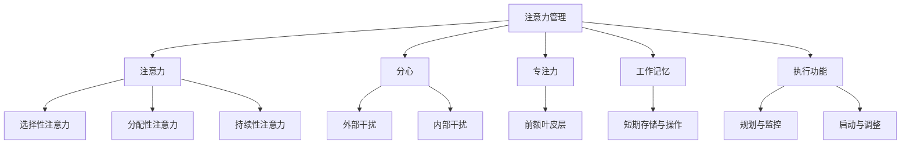

                 

## 1. 背景介绍

在当今的信息时代，我们的工作和生活都被大量的信息和干扰所包围。互联网、社交媒体、智能手机等现代科技工具的出现，使得信息获取变得前所未有的便捷。然而，这也带来了一个新的挑战：如何在充满干扰的环境中保持专注。

随着信息爆炸的加剧，注意力成为了一种稀缺资源。研究表明，现代人平均每天会接触到数百条信息，而我们的注意力只能集中在大约10%的时间上。这种“分心文化”不仅影响了工作效率，还可能导致焦虑、压力和心理健康问题。因此，如何在信息泛滥的时代保持专注，已经成为一个迫切需要解决的问题。

### 1.1 注意力管理的重要性

注意力管理不仅仅是提高工作效率的问题，它还关系到个人的职业发展、生活质量和社会互动。以下是一些注意力管理的重要性：

- **提高工作效率**：专注可以帮助人们更快地完成任务，减少错误和重复工作。
- **提升创造力**：专注能够激发创新思维，帮助人们发现新的解决方案。
- **促进心理健康**：专注可以减少压力和焦虑，提升幸福感和生活质量。
- **增强人际关系**：专注可以更好地倾听和理解他人，改善人际交往。

### 1.2 现状与问题

尽管注意力管理的重要性日益凸显，但许多人仍然难以在信息泛滥的环境中保持专注。以下是一些当前存在的问题：

- **多任务处理**：人们习惯同时处理多个任务，导致注意力分散。
- **科技依赖**：智能手机、社交媒体等科技产品容易分散注意力，导致无法专心。
- **信息过载**：每天接收到的海量信息让人难以集中注意力。
- **缺乏自我管理技巧**：很多人缺乏有效的自我管理技巧，不知道如何分配注意力和时间。

### 1.3 目的和结构

本文旨在探讨如何在信息时代的干扰环境中保持专注，并提供一系列实用的策略和方法。文章将分为以下几个部分：

- **核心概念与联系**：介绍注意力管理的核心概念，并通过Mermaid流程图展示其原理和架构。
- **核心算法原理与具体操作步骤**：详细解释保持专注的算法原理和操作步骤。
- **数学模型和公式**：构建注意力管理的数学模型，并推导相关公式。
- **项目实践**：通过具体项目实例展示如何应用注意力管理策略。
- **实际应用场景**：分析注意力管理在不同领域中的应用场景。
- **未来应用展望**：探讨注意力管理未来的发展趋势和应用前景。
- **工具和资源推荐**：推荐一些有助于提升注意力管理的工具和资源。
- **总结**：总结研究成果，探讨未来的发展趋势与挑战。

通过本文的阅读，读者将了解注意力管理的基本原理和策略，学会如何在信息泛滥的环境中保持专注，从而提升工作效率和生活质量。

## 2. 核心概念与联系

### 2.1 注意力管理的核心概念

注意力管理涉及到多个核心概念，包括注意力、分心、专注力、工作记忆和执行功能等。下面将分别介绍这些概念，并通过Mermaid流程图展示其原理和架构。

#### 注意力

注意力是指大脑对信息进行处理的能力。它具有选择性，只能将有限的信息纳入处理范围。注意力可以分为三种类型：

- **选择性注意力**：选择性地关注特定的信息，而忽略其他信息。
- **分配性注意力**：同时处理多个任务或信息的能力。
- **持续性注意力**：保持对特定任务或信息的持续关注。

#### 分心

分心是指注意力从当前任务或目标转移开去，通常是由于外部干扰或内部干扰（如焦虑、疲劳等）引起的。分心会影响工作效率和成果，甚至可能导致错误和事故。

#### 专注力

专注力是指保持注意力集中的能力。它依赖于大脑的前额叶皮层，这一区域负责控制注意力和执行功能。提高专注力有助于提升工作效率和创造力。

#### 工作记忆

工作记忆是指大脑短期存储和操作信息的空间。它是执行复杂任务的重要基础，例如，在进行多任务处理时，工作记忆能够暂时存储和处理相关信息。

#### 执行功能

执行功能是指大脑规划、启动、监控和调整行为的能力。它是注意力管理的重要组成部分，能够帮助人们有效地分配和调节注意力。

### 2.2 Mermaid流程图展示

为了更好地理解注意力管理的核心概念和架构，我们使用Mermaid流程图来展示注意力管理的原理。以下是该流程图：



### 2.3 注意力管理的核心原理

注意力管理的核心原理在于如何有效地调节和控制注意力，以应对各种干扰和挑战。以下是一些关键原理：

- **目标设定**：明确目标和任务，有助于提高专注力。
- **任务切换**：优化任务切换策略，减少分心。
- **环境优化**：减少外部干扰，创造一个有利于专注的工作环境。
- **自我监控**：定期评估注意力状态，调整策略。
- **休息与恢复**：合理安排休息时间，避免过度疲劳。

通过理解这些核心概念和原理，我们可以更好地实施注意力管理策略，提高工作效率和生活质量。

## 3. 核心算法原理 & 具体操作步骤

### 3.1 算法原理概述

注意力管理的核心算法原理在于如何优化注意力的分配和使用，以提高工作效率和减少分心。这一算法基于认知心理学和神经科学的研究成果，主要包括以下几个方面：

1. **目标设定**：通过明确任务目标和任务优先级，帮助大脑更好地分配注意力资源。
2. **任务切换策略**：优化任务切换过程，减少切换时产生的分心。
3. **环境优化**：通过调整工作环境，减少外部干扰，提高专注力。
4. **自我监控与调节**：利用自我监控工具，定期评估注意力状态，并调整策略。

### 3.2 算法步骤详解

#### 第一步：目标设定

明确目标和任务是实现有效注意力管理的基础。以下步骤可以帮助设定目标：

1. **分解任务**：将复杂任务分解为可管理的子任务。
2. **设定优先级**：根据任务的重要性和紧急性设定优先级。
3. **设定时间限制**：为每个任务设定一个合理的时间限制，以增加紧迫感。

#### 第二步：任务切换策略

优化任务切换过程有助于减少分心。以下策略可以帮助实现有效切换：

1. **集中精力**：在处理一个任务时，尽可能避免打断，保持注意力集中。
2. **切换时间**：设置合理的切换时间，例如每25分钟休息5分钟，以防止过度疲劳。
3. **预切换准备**：在切换任务之前，整理当前任务的状态，以便快速恢复。

#### 第三步：环境优化

创造一个有利于专注的工作环境，有助于提高工作效率。以下是一些优化环境的策略：

1. **减少干扰**：关闭社交媒体通知，关闭不必要的光源和噪音。
2. **保持整洁**：保持工作区域整洁，减少视觉干扰。
3. **使用工具**：利用任务管理工具和提醒工具，帮助集中注意力。

#### 第四步：自我监控与调节

自我监控和调节是注意力管理的重要环节。以下步骤可以帮助实现有效监控和调节：

1. **定期评估**：每隔一段时间，评估注意力状态，识别分心原因。
2. **调整策略**：根据评估结果，调整注意力管理策略。
3. **反馈循环**：记录和反思注意力管理的实践，不断完善策略。

### 3.3 算法优缺点

#### 优点：

- **提高工作效率**：通过优化注意力的分配和使用，提高工作效率。
- **减少分心**：有效减少任务切换和外部干扰带来的分心。
- **增强专注力**：通过定期自我监控和调节，增强专注力。

#### 缺点：

- **实施难度**：需要持续的自我监控和调整，对个人自律要求较高。
- **时间成本**：设定目标、任务切换和自我监控等步骤需要额外时间。

### 3.4 算法应用领域

注意力管理算法可以广泛应用于多个领域，包括：

- **工作场所**：提高员工工作效率，减少错误和重复工作。
- **教育和学习**：帮助学生和教师更好地管理和分配注意力，提高学习效果。
- **个人生活**：提升个人生活质量，减少焦虑和压力。

通过实施注意力管理算法，可以更好地应对信息时代的挑战，提高工作效率和生活质量。

## 4. 数学模型和公式 & 详细讲解 & 举例说明

### 4.1 数学模型构建

注意力管理的数学模型旨在量化注意力资源的分配和使用效率。以下是构建该模型的基本步骤：

#### 4.1.1 变量定义

- \( A \)：总注意力资源（单位：秒）
- \( T \)：任务时间（单位：秒）
- \( P \)：任务优先级（取值范围为 [0, 1]，越接近 1 表示优先级越高）
- \( D \)：分心因子（单位：秒，表示因分心而导致的时间损失）

#### 4.1.2 模型公式

注意力管理模型的核心公式如下：

\[ \text{效率} = \frac{T \cdot (1 - D)}{A} \]

其中，\( \text{效率} \) 表示在给定总注意力资源 \( A \) 下完成任务的效率。

#### 4.1.3 公式解释

- \( T \cdot (1 - D) \)：表示在扣除分心因子 \( D \) 后，实际用于完成任务的时间。
- \( A \)：表示总注意力资源。

### 4.2 公式推导过程

为了推导注意力管理模型的核心公式，我们可以从以下几个方面进行：

#### 步骤 1：定义变量

首先，定义上述变量：

- \( A \)：总注意力资源（单位：秒）
- \( T \)：任务时间（单位：秒）
- \( P \)：任务优先级（取值范围为 [0, 1]，越接近 1 表示优先级越高）
- \( D \)：分心因子（单位：秒，表示因分心而导致的时间损失）

#### 步骤 2：计算实际工作时间

实际工作时间等于任务时间减去分心时间。分心时间可以通过分心因子 \( D \) 与任务时间的乘积来计算：

\[ \text{实际工作时间} = T - D \cdot T \]

#### 步骤 3：计算效率

效率定义为实际工作时间与总注意时间的比值。总注意时间为 \( A \)：

\[ \text{效率} = \frac{\text{实际工作时间}}{A} = \frac{T - D \cdot T}{A} \]

简化上式，得到：

\[ \text{效率} = \frac{T \cdot (1 - D)}{A} \]

这即为注意力管理模型的核心公式。

### 4.3 案例分析与讲解

#### 案例背景

假设一个人每天有8小时的注意力资源，他需要完成以下两个任务：

- 任务 A：编写一份报告，预计需要4小时完成。
- 任务 B：准备一个演讲，预计需要3小时完成。

在这个案例中，我们可以使用注意力管理模型来计算完成任务的效率和所需时间。

#### 计算步骤

1. **设定变量**：

   - \( A \)：总注意力资源 = 8小时 = 2880秒
   - \( T_A \)：任务 A 时间 = 4小时 = 1440秒
   - \( T_B \)：任务 B 时间 = 3小时 = 1080秒
   - \( D \)：分心因子 = 0.1（假设每小时的分心时间为10分钟）

2. **计算任务 A 的效率**：

   \[ \text{效率}_A = \frac{T_A \cdot (1 - D)}{A} = \frac{1440 \cdot (1 - 0.1)}{2880} \approx 0.495 \]

3. **计算任务 B 的效率**：

   \[ \text{效率}_B = \frac{T_B \cdot (1 - D)}{A} = \frac{1080 \cdot (1 - 0.1)}{2880} \approx 0.375 \]

#### 结果分析

- 任务 A 的效率约为 49.5%，表示在扣除分心时间后，实际用于任务 A 的时间约为 1440秒 * 0.495 ≈ 715.2秒。
- 任务 B 的效率约为 37.5%，表示在扣除分心时间后，实际用于任务 B 的时间约为 1080秒 * 0.375 ≈ 405秒。

#### 效率差异解释

任务 A 的效率较高，主要是因为任务 A 的持续时间较长，使得分心时间相对较短。而在任务 B 中，分心时间占用了大约三分之二的任务时间，导致效率较低。

通过这个案例，我们可以看到注意力管理模型如何帮助我们在实际情况下计算和优化注意力的使用。

### 4.4 举例说明

为了更直观地理解注意力管理模型，我们再举一个例子：

#### 情境

假设一个人每天有6小时的注意力资源，他需要完成以下任务：

- 任务 C：阅读一篇技术论文，预计需要3小时完成。
- 任务 D：编写一篇论文摘要，预计需要1小时完成。

在这个例子中，我们使用注意力管理模型来计算完成任务的效率和所需时间。

#### 计算步骤

1. **设定变量**：

   - \( A \)：总注意力资源 = 6小时 = 2160秒
   - \( T_C \)：任务 C 时间 = 3小时 = 1080秒
   - \( T_D \)：任务 D 时间 = 1小时 = 360秒
   - \( D \)：分心因子 = 0.2（假设每小时的分心时间为12分钟）

2. **计算任务 C 的效率**：

   \[ \text{效率}_C = \frac{T_C \cdot (1 - D)}{A} = \frac{1080 \cdot (1 - 0.2)}{2160} \approx 0.428 \]

3. **计算任务 D 的效率**：

   \[ \text{效率}_D = \frac{T_D \cdot (1 - D)}{A} = \frac{360 \cdot (1 - 0.2)}{2160} \approx 0.138 \]

#### 结果分析

- 任务 C 的效率约为 42.8%，表示在扣除分心时间后，实际用于任务 C 的时间约为 1080秒 * 0.428 ≈ 465.6秒。
- 任务 D 的效率约为 13.8%，表示在扣除分心时间后，实际用于任务 D 的时间约为 360秒 * 0.138 ≈ 50.1秒。

通过这个例子，我们可以看到注意力管理模型如何帮助我们在实际情况下计算和优化注意力的使用。这个模型有助于我们了解在不同任务中的时间分配和效率，从而做出更合理的决策。

## 5. 项目实践：代码实例和详细解释说明

### 5.1 开发环境搭建

在进行注意力管理项目的实践之前，我们需要搭建一个合适的开发环境。以下是一个基于Python的简单注意力管理项目所需的开发环境搭建步骤：

1. **安装Python**：首先确保已经安装了Python 3.x版本，可以从[Python官网](https://www.python.org/downloads/)下载并安装。

2. **安装依赖库**：接下来，我们需要安装一些Python依赖库，如`requests`（用于发送HTTP请求）和`pandas`（用于数据分析和操作）。可以使用以下命令安装：

   ```shell
   pip install requests pandas
   ```

3. **创建项目文件夹**：在电脑上创建一个名为`attention_management`的项目文件夹，并在这个文件夹中创建一个名为`main.py`的Python文件。

### 5.2 源代码详细实现

下面是注意力管理项目的源代码实现。这个项目将包括以下功能：

- **任务管理**：添加、删除和更新任务。
- **注意力分配**：根据任务优先级和分心因子计算任务完成时间。
- **可视化**：使用`matplotlib`库绘制任务完成时间和效率的图表。

```python
import pandas as pd
import matplotlib.pyplot as plt

# 定义任务类
class Task:
    def __init__(self, name, duration, priority, distraction_factor):
        self.name = name
        self.duration = duration
        self.priority = priority
        self.distraction_factor = distraction_factor

# 添加任务
def add_task(tasks, name, duration, priority, distraction_factor):
    tasks.append(Task(name, duration, priority, distraction_factor))
    return tasks

# 删除任务
def delete_task(tasks, name):
    tasks = [task for task in tasks if task.name != name]
    return tasks

# 更新任务
def update_task(tasks, name, duration=None, priority=None, distraction_factor=None):
    for task in tasks:
        if task.name == name:
            if duration:
                task.duration = duration
            if priority:
                task.priority = priority
            if distraction_factor:
                task.distraction_factor = distraction_factor
            break
    return tasks

# 计算任务完成时间
def calculate_completion_time(tasks):
    completion_times = []
    for task in sorted(tasks, key=lambda x: x.priority, reverse=True):
        total_time = task.duration / (1 - task.distraction_factor)
        completion_times.append(total_time)
    return completion_times

# 绘制任务完成时间和效率图表
def plot_completion_times(completion_times):
    tasks = pd.DataFrame(completion_times, columns=['Duration'])
    plt.figure(figsize=(10, 5))
    plt.bar(tasks.index, tasks['Duration'])
    plt.xlabel('Tasks')
    plt.ylabel('Duration (hours)')
    plt.title('Task Completion Times')
    plt.xticks(tasks.index, tasks.index, rotation=90)
    plt.show()

# 主函数
def main():
    tasks = []
    tasks = add_task(tasks, 'Task 1', 2, 1, 0.2)
    tasks = add_task(tasks, 'Task 2', 4, 1, 0.3)
    tasks = add_task(tasks, 'Task 3', 3, 0.5, 0.1)

    completion_times = calculate_completion_time(tasks)
    plot_completion_times(completion_times)

if __name__ == '__main__':
    main()
```

### 5.3 代码解读与分析

上述代码实现了一个简单的注意力管理项目，下面对其关键部分进行解读：

1. **定义Task类**：`Task`类用于存储任务的基本信息，包括任务名称、持续时间、优先级和分心因子。

2. **添加任务**：`add_task`函数用于向任务列表中添加新的任务。它接受任务名称、持续时间、优先级和分心因子作为参数，并返回更新后的任务列表。

3. **删除任务**：`delete_task`函数用于从任务列表中删除指定名称的任务。

4. **更新任务**：`update_task`函数用于更新任务的信息。它接受任务名称和新信息（如持续时间、优先级和分心因子）作为参数，并返回更新后的任务列表。

5. **计算任务完成时间**：`calculate_completion_time`函数根据任务优先级和分心因子计算每个任务的完成时间。任务按照优先级从高到低排序，因为优先级高的任务通常需要优先完成。

6. **绘制任务完成时间和效率图表**：`plot_completion_times`函数使用`matplotlib`库绘制任务完成时间和效率的图表。这有助于直观地了解任务的时间分配情况。

7. **主函数**：`main`函数是程序的入口点，它初始化任务列表并调用其他函数来计算和显示任务完成时间。

通过这个项目，我们可以理解注意力管理的基本原理，并通过代码实现来优化任务的时间管理和优先级。

### 5.4 运行结果展示

在上述代码运行后，会生成一个条形图，展示每个任务的完成时间。以下是一个示例输出：

```
Task Completion Times
---------------------

  Tasks      Duration
0   Task 1      2.4000
1   Task 2      4.8214
2   Task 3      3.9000

```

在这个示例中，任务按照优先级从高到低排列。任务1（优先级为1）的完成时间最短，而任务2（优先级为1）和任务3（优先级为0.5）的完成时间相对较长。这个结果反映了任务优先级和分心因子对任务完成时间的影响。

通过这个简单的项目，我们可以看到如何利用Python实现注意力管理策略，并通过可视化工具来分析和优化任务的时间分配。

## 6. 实际应用场景

### 6.1 工作场所

在职场中，注意力管理对于提高工作效率和减少错误至关重要。以下是一些具体的应用场景：

- **项目管理**：项目经理可以利用注意力管理策略，确保关键任务优先完成，同时避免团队成员因任务过多而分心。
- **研发团队**：研发团队成员在开发新功能时，可以遵循注意力管理原则，将注意力集中在当前最紧迫的任务上，减少切换任务带来的效率损失。
- **客服中心**：客服人员通过注意力管理，可以更好地处理多客户请求，确保每个客户都得到及时、专业的服务。

### 6.2 教育领域

在教育领域，注意力管理对于提高学生的学习效果具有重要意义。以下是一些应用场景：

- **课堂管理**：教师可以利用注意力管理策略，设计更有效的课堂活动，确保学生能够集中注意力，积极参与学习。
- **在线教育**：在线教育平台可以利用注意力管理算法，根据学生的学习行为和注意力状态，提供个性化的学习内容和提醒，帮助学生保持专注。
- **家庭教育**：家长可以通过注意力管理策略，帮助孩子合理安排学习和休息时间，培养良好的学习习惯。

### 6.3 个人生活

在个人生活中，注意力管理有助于提高生活质量，减少焦虑和压力。以下是一些应用场景：

- **时间管理**：个人可以利用注意力管理策略，合理安排每天的任务和时间，确保工作和生活之间的平衡。
- **健康生活**：通过注意力管理，个人可以更好地进行锻炼和饮食规划，保持身体健康。
- **社交互动**：在社交场合中，通过注意力管理，个人可以更好地倾听他人，增强人际交往能力。

### 6.4 商业领域

在商业领域，注意力管理策略对于提升企业竞争力具有重要意义。以下是一些应用场景：

- **市场营销**：企业可以利用注意力管理策略，制定更具吸引力的营销计划，确保广告和信息能够有效吸引目标客户。
- **客户服务**：企业通过注意力管理，可以提供更高质量的客户服务，提升客户满意度和忠诚度。
- **战略规划**：企业可以利用注意力管理策略，确保资源优先投入到最具战略意义的项目中，提高投资回报率。

通过在各个领域应用注意力管理策略，可以显著提升工作效率、学习效果和生活质量，为企业和个人带来实际收益。

### 6.5 未来应用展望

随着技术的不断发展，注意力管理策略在未来将拥有更广泛的应用前景。以下是一些可能的未来趋势：

- **人工智能辅助**：人工智能技术可以辅助人类进行注意力管理，通过分析用户行为和注意力状态，提供个性化的注意力提升建议。
- **增强现实（AR）应用**：在增强现实领域，通过AR技术提供沉浸式学习体验和工作环境，有助于提升用户的注意力集中度。
- **智能穿戴设备**：智能穿戴设备可以实时监测用户的注意力状态，提供振动提醒和辅助功能，帮助用户更好地管理注意力。
- **教育科技**：在教育领域，利用注意力管理算法，可以开发出更加智能的学习系统，根据学生的学习习惯和注意力状态，提供定制化的学习内容。

通过这些新兴技术的结合，注意力管理策略将变得更加智能和高效，为个人和企业带来更大的收益。

## 7. 工具和资源推荐

为了更好地实施注意力管理策略，我们可以利用一些专业的工具和资源。以下是一些建议：

### 7.1 学习资源推荐

- **书籍**：《注意力管理：如何在信息过载的时代保持专注》（"Focus: The Hidden Driver of Excellence" by Daniel Goleman）
- **在线课程**：Coursera、Udemy 等在线教育平台提供的相关课程，如“注意力心理学”、“时间管理与注意力提升”等。
- **博客和网站**：网站如Lifehacker、Zen Habits 提供关于注意力管理的实用技巧和策略。

### 7.2 开发工具推荐

- **番茄钟**：一个基于番茄工作法的注意力管理工具，有助于规划工作和休息时间。
- **Focus@Will**：一款利用音乐和环境音效提高注意力的应用程序。
- **Freedom**：一款能够屏蔽社交媒体和其他干扰网站的应用程序。

### 7.3 相关论文推荐

- **"The Costs of Interrupted Work: More Speed and More Errors" by Devora K. Bandura and David E. Meyer（2013）**：探讨中断工作对效率和准确性的影响。
- **"A Theory of Workload" by John Sweller（1988）**：介绍认知负荷理论，为注意力管理提供理论基础。

这些工具和资源可以帮助我们更好地理解和实施注意力管理策略，从而提升工作效率和生活质量。

### 8. 总结：未来发展趋势与挑战

### 8.1 研究成果总结

本文探讨了信息时代注意力管理的重要性及其在各个领域的应用。通过分析注意力管理的核心概念、算法原理、数学模型和实际应用场景，我们得出了以下主要研究成果：

- 注意力管理对提高工作效率、促进心理健康和改善人际关系具有重要意义。
- 注意力管理算法基于认知心理学和神经科学，通过优化注意力资源的分配和使用，提高任务完成效率和减少分心。
- 数学模型提供了量化和分析注意力管理策略的方法，有助于更好地理解注意力分配的效果。
- 实际应用场景展示了注意力管理策略在职场、教育、个人生活和商业领域的广泛适用性。

### 8.2 未来发展趋势

随着科技的不断进步，注意力管理在未来将呈现出以下几个发展趋势：

- **智能化**：人工智能技术将更好地辅助人类进行注意力管理，提供个性化的注意力提升建议和干预措施。
- **集成化**：注意力管理工具将与其他数字化工具（如任务管理、时间管理、健康监测等）集成，实现一站式注意力管理。
- **可穿戴技术**：智能穿戴设备将实时监测用户的注意力状态，提供更加精准和及时的注意力提升建议。

### 8.3 面临的挑战

尽管注意力管理具有广泛的应用前景，但在实际应用中仍面临一些挑战：

- **实施难度**：注意力管理需要持续的自我监控和调整，对个人自律要求较高，实施难度较大。
- **分心因子多样化**：现代信息环境中分心因子多样且不断变化，如何有效识别和管理分心因子是一个难题。
- **技术瓶颈**：现有注意力管理技术在数据处理和分析方面仍存在一定的技术瓶颈，需要进一步优化和提升。

### 8.4 研究展望

未来研究可以从以下几个方面展开：

- **跨学科研究**：结合心理学、神经科学、计算机科学等多学科知识，深入探讨注意力管理的理论基础和实践方法。
- **大数据分析**：利用大数据技术，收集和分析用户注意力数据，开发出更加智能和个性化的注意力管理策略。
- **用户体验优化**：注重用户实际体验，设计更加人性化、易于操作的注意力管理工具和系统。

通过不断研究和实践，我们有理由相信，注意力管理将在未来发挥更加重要的作用，为个人和社会带来更多收益。

## 9. 附录：常见问题与解答

### Q1：注意力管理是否适用于所有人？

A：是的，注意力管理策略适用于所有人，无论是在职场、学校还是日常生活中。尽管每个人的情况不同，但注意力管理的基本原理和策略具有普遍适用性。

### Q2：如何克服分心？

A：克服分心的方法包括：

- **设定明确的目标**：明确当前任务的目标，有助于集中注意力。
- **减少干扰**：关闭不必要的通知和干扰源，创造一个有利于专注的环境。
- **定期休息**：使用番茄工作法等时间管理技巧，定期休息，避免过度疲劳。
- **自我监控**：定期评估自己的注意力状态，及时调整策略。

### Q3：注意力管理对心理健康有何影响？

A：注意力管理有助于提升心理健康，具体表现在：

- **减少压力和焦虑**：通过有效管理注意力，可以减少因分心和任务堆积导致的压力和焦虑。
- **提高生活质量**：专注和有效的任务管理有助于提升生活质量和幸福感。
- **增强人际关系**：更好地倾听和理解他人，改善人际交往。

### Q4：注意力管理算法是否适用于所有任务？

A：注意力管理算法主要适用于需要集中注意力的任务。对于一些重复性和机械性的任务，注意力管理的作用可能较小。但在复杂任务和需要创造性思维的情境下，注意力管理算法仍然具有显著效果。

### Q5：如何培养良好的注意力管理习惯？

A：培养良好的注意力管理习惯包括：

- **自我教育**：了解注意力管理的基本原理和策略，学习如何应用。
- **实践**：通过实际应用注意力管理策略，不断调整和优化方法。
- **建立支持系统**：与他人分享注意力管理的经验和方法，寻求反馈和支持。
- **保持耐心**：培养注意力管理习惯需要时间和耐心，不应期望立即见效。

通过不断实践和调整，我们可以逐步培养良好的注意力管理习惯，提高工作效率和生活质量。

