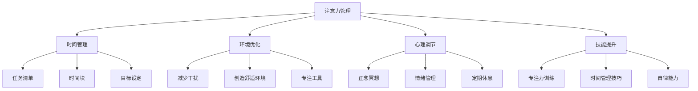

                 

### 1. 背景介绍

在当今这个数字化和信息化的时代，我们面临着前所未有的挑战。随着互联网的普及，信息的获取变得前所未有的快捷和便捷。然而，这种便利性也带来了巨大的问题——注意力分散和信息过载。

首先，让我们看看注意力分散的问题。随着社交媒体的兴起，人们越来越难以集中注意力。Facebook、Twitter、Instagram等各种社交平台不断地吸引用户的注意力，让人们无法专注于一项任务。研究表明，频繁的社交媒体使用与注意力分散之间存在显著相关性。在办公室环境中，员工们可能经常受到电子邮件、即时通讯工具和手机通知的干扰，导致工作效率下降。

其次，信息过载也是一个严重的问题。每天，我们都会接收到大量的信息，包括新闻、广告、电子邮件、社交媒体更新等。这些信息不仅占用了我们的时间，还可能导致我们感到压力和焦虑。在一项关于信息过载的研究中，约70%的受访者表示，他们经常感到因为信息过多而无法处理。

面对这些挑战，有效的注意力管理策略变得至关重要。本文将探讨注意力管理的重要性、核心概念、具体策略，以及如何在实际工作中应用这些策略。通过本文的阅读，读者将能够更好地理解注意力管理的复杂性，并掌握一些实用的技巧来提高自己的注意力。

### 2. 核心概念与联系

#### 2.1 注意力管理的重要性

注意力管理是一种能够帮助个人和组织提高效率和绩效的重要技能。在信息过载和干扰频繁的时代，注意力管理不仅关乎个人的生活质量，也直接影响到组织的运作效率。有效管理注意力可以帮助人们更高效地完成任务，减少错误，提高创造力，并增强心理健康。

首先，注意力管理能够显著提高工作效率。当我们能够集中注意力，专注于一项任务时，能够更快地完成任务，减少分心和错误。例如，一位专注于编写代码的程序员，由于没有受到社交媒体和电子邮件的干扰，可以更快速地完成代码编写，提高整体开发效率。

其次，注意力管理能够促进个人成长和心理健康。频繁的干扰和分散注意力会导致焦虑和压力，影响心理健康。通过有效的注意力管理，我们可以更好地控制自己的注意力，减少焦虑和压力，提高生活质量和幸福感。

#### 2.2 注意力分散的原因

注意力分散的原因多种多样，主要包括外部干扰、内部干扰以及个人习惯和态度。首先，外部干扰是导致注意力分散的主要原因之一。例如，电子邮件、社交媒体通知、电话等都能迅速打断我们的专注力，使我们无法继续专注于当前任务。研究表明，每当我们被中断后，需要大约15分钟的时间才能重新回到原来的工作状态。

其次，内部干扰也是注意力分散的一个重要原因。内部干扰通常来自于个人的情绪和心理状态，例如焦虑、压力、无聊等。当人们感到焦虑或压力时，他们的注意力容易分散，难以专注于当前任务。

此外，个人习惯和态度也会影响注意力管理。例如，缺乏时间管理和自我控制能力的人更容易受到干扰，导致注意力分散。相反，那些有良好时间管理和自我控制能力的人，能够更好地管理自己的注意力，减少分散。

#### 2.3 注意力管理的策略

为了有效地管理注意力，我们需要采用一系列策略，这些策略可以分为时间管理、环境优化、心理调节和技能提升四个方面。

**时间管理**

时间管理是注意力管理的重要一环。通过合理安排时间，我们可以减少干扰，提高工作效率。以下是一些时间管理策略：

1. **制定明确的任务清单**：在每天开始工作时，列出所有需要完成的任务，并根据优先级排序。这可以帮助我们集中注意力，优先处理最重要的任务。

2. **使用时间块**：将工作时间划分为固定的时间块，例如每块25分钟，然后休息5分钟。这种方法称为番茄工作法，可以帮助我们保持专注，避免过度疲劳。

3. **设定明确的目标**：为自己设定明确、可衡量的目标，这有助于提高动力和集中注意力。

**环境优化**

优化工作或学习环境是提高注意力的重要策略。以下是一些环境优化的方法：

1. **减少干扰源**：将手机置于静音模式，关闭不必要的通知，减少外部干扰。

2. **创造舒适的工作环境**：保持工作区域的整洁，确保光线适宜，温度适中，这有助于提高舒适度和专注度。

3. **使用专注工具**：例如专注软件或专注时钟，帮助我们在特定时间内保持专注。

**心理调节**

心理调节是注意力管理的重要组成部分。以下是一些心理调节的方法：

1. **正念冥想**：通过正念冥想，我们可以训练自己的注意力，提高专注力和自我意识。研究表明，正念冥想有助于减少焦虑和压力，提高注意力集中。

2. **情绪管理**：学会识别和管理自己的情绪，例如通过深呼吸、放松练习等方式。这有助于减少情绪波动对注意力分散的影响。

3. **定期休息**：避免长时间连续工作，定期休息可以帮助我们恢复精力，提高专注力。

**技能提升**

提升注意力管理技能需要时间和实践。以下是一些技能提升的方法：

1. **训练专注力**：通过专门的专注力训练，例如专注力游戏、专注力练习等，可以提高我们的专注力。

2. **学习时间管理技巧**：通过学习时间管理技巧，例如优先级排序、时间块管理、目标设定等，可以提高时间利用效率，减少干扰。

3. **培养自律能力**：通过培养自律能力，例如设定明确的目标、坚持锻炼、保持良好习惯等，可以更好地管理自己的注意力。

### 2.4 注意力管理架构的 Mermaid 流程图

以下是一个简化的注意力管理架构的 Mermaid 流程图，用于展示注意力管理各个方面的相互关系。



### 3. 核心算法原理 & 具体操作步骤

#### 3.1 算法原理概述

注意力管理算法的核心原理是基于人类注意力分配的心理模型和认知行为学理论。该算法通过以下三个主要方面实现注意力优化：

1. **注意力分配模型**：根据任务的重要性和紧急程度，动态调整注意力分配。这个模型借鉴了“注意力加权调度算法”（Attention Weighted Scheduling Algorithm），能够在多个任务之间高效地切换注意力。

2. **行为反馈机制**：通过实时监控用户的行为和注意力水平，提供即时的反馈和调整建议。这种方法类似于“强化学习”（Reinforcement Learning），通过用户的反应不断优化算法。

3. **环境感知与适应**：算法能够感知和适应外部环境的干扰因素，例如噪音、光线、温度等，调整工作环境以优化注意力集中。

#### 3.2 算法步骤详解

**步骤 1：初始化环境**

- 设置用户的基本信息，包括任务列表、优先级、目标等。
- 初始化注意力水平和干扰因素。

**步骤 2：任务优先级排序**

- 根据任务的紧急程度和重要性，对任务进行排序。
- 使用“优先级排序算法”（Priority Sorting Algorithm）进行任务排序。

**步骤 3：注意力分配**

- 使用“注意力加权调度算法”根据当前任务的重要性和紧急程度分配注意力。
- 动态调整注意力分配，以适应任务的实时变化。

**步骤 4：行为监控与反馈**

- 实时监控用户的行为和注意力水平。
- 使用“强化学习”模型，根据用户的行为反馈调整注意力分配策略。

**步骤 5：环境感知与调整**

- 感知外部环境的干扰因素，如噪音、光线、温度等。
- 根据环境变化调整工作环境，以优化注意力集中。

**步骤 6：结果评估与优化**

- 评估用户在特定时间段内的任务完成情况和注意力水平。
- 根据评估结果优化算法，提高未来任务的完成效率和注意力管理效果。

#### 3.3 算法优缺点

**优点**

1. **高效的任务切换**：通过动态调整注意力分配，算法能够在多个任务之间高效切换，减少任务切换的时间和精力消耗。
2. **实时反馈与优化**：实时监控用户行为和注意力水平，结合强化学习模型，不断优化注意力分配策略，提高任务完成效果。
3. **环境适应性强**：算法能够感知和适应外部环境的变化，优化工作环境，提高注意力集中。

**缺点**

1. **初始设置复杂**：算法的初始化和设置需要收集大量用户信息和任务数据，初始设置过程可能较为复杂。
2. **对用户行为要求高**：算法需要用户积极参与，提供真实、准确的行为反馈，否则算法优化效果可能会受到影响。

#### 3.4 算法应用领域

1. **办公室工作**：在办公室环境中，注意力管理算法可以帮助员工更高效地完成工作任务，减少干扰，提高工作效率。
2. **教育领域**：在教育领域，算法可以辅助学生集中注意力，提高学习效果。
3. **医疗健康**：通过优化注意力管理，算法可以帮助患者更好地应对疾病和治疗过程中的压力，提高康复效果。

### 4. 数学模型和公式 & 详细讲解 & 举例说明

#### 4.1 数学模型构建

注意力管理中的数学模型主要基于概率论和优化理论。以下是一个简化的数学模型，用于描述注意力分配和优化过程。

**模型假设：**

- 每个任务都有其重要性 \( I_i \) 和紧急程度 \( E_i \)。
- 注意力分配是动态的，并受到干扰因素 \( D_i \) 的影响。
- 用户的行为和注意力水平可以通过行为反馈机制进行实时调整。

**数学模型：**

\[ A_t = f(I_t, E_t, D_t, A_{t-1}) \]

其中：
- \( A_t \) 表示时刻 \( t \) 的注意力水平。
- \( I_t \) 表示时刻 \( t \) 的任务重要性。
- \( E_t \) 表示时刻 \( t \) 的任务紧急程度。
- \( D_t \) 表示时刻 \( t \) 的干扰因素。
- \( A_{t-1} \) 表示时刻 \( t-1 \) 的注意力水平。

**函数 \( f \) 的具体形式：**

\[ f(I_t, E_t, D_t, A_{t-1}) = \alpha I_t + \beta E_t + \gamma D_t + (1 - \alpha - \beta - \gamma) A_{t-1} \]

其中：
- \( \alpha \)，\( \beta \)，\( \gamma \) 分别是重要性、紧急程度和干扰因素的权重。

#### 4.2 公式推导过程

为了推导上述公式，我们需要考虑以下因素：

1. **注意力分配原则**：注意力应该根据任务的重要性和紧急程度进行分配。
2. **干扰因素影响**：干扰因素会降低注意力水平。
3. **历史注意力水平**：当前注意力水平应该受到历史注意力水平的影响。

首先，我们定义注意力分配的权重因子：

\[ \alpha = \frac{I_t}{I_t + E_t + D_t} \]
\[ \beta = \frac{E_t}{I_t + E_t + D_t} \]
\[ \gamma = \frac{D_t}{I_t + E_t + D_t} \]

这样，权重因子保证了重要性、紧急程度和干扰因素对注意力分配的贡献。

接下来，我们考虑干扰因素的影响。假设干扰因素 \( D_t \) 与注意力水平呈线性关系，即：

\[ A_t = A_{t-1} - \gamma D_t \]

将 \( A_t \) 的表达式代入注意力分配公式，得到：

\[ A_t = \alpha I_t + \beta E_t + (1 - \alpha - \beta) A_{t-1} - \gamma D_t \]

为了简化公式，我们引入一个修正因子 \( \delta \)，使得：

\[ A_t = \alpha I_t + \beta E_t + \delta A_{t-1} - \gamma D_t \]

其中：

\[ \delta = 1 - \alpha - \beta \]

这样，我们得到了最终的注意力分配公式。

#### 4.3 案例分析与讲解

假设一个学生需要在一天内完成三项任务：阅读教材（重要性 \( I_1 = 0.4 \)）、完成作业（重要性 \( I_2 = 0.3 \)）和参加课外活动（重要性 \( I_3 = 0.3 \)）。同时，他的作业有截止日期（紧急程度 \( E_2 = 0.5 \)），而教材和课外活动没有明确截止日期。

在早上，学生开始阅读教材，但由于外面有噪音干扰（干扰因素 \( D_1 = 0.2 \)），他的注意力水平开始下降。使用我们的注意力分配公式，我们可以计算他在早上阅读教材的注意力水平。

\[ A_{m} = \alpha I_1 + \beta E_2 + \delta A_{m-1} - \gamma D_1 \]

假设他的初始注意力水平 \( A_{m-1} = 1 \)，权重因子 \( \alpha = 0.4 \)，\( \beta = 0.5 \)，\( \gamma = 0.1 \)，我们可以得到：

\[ A_{m} = 0.4 \times 0.4 + 0.5 \times 0.5 + (1 - 0.4 - 0.5) \times 1 - 0.1 \times 0.2 \]
\[ A_{m} = 0.16 + 0.25 + 0.1 - 0.02 \]
\[ A_{m} = 0.39 \]

因此，在早上，学生的注意力水平大约为 39%。

接下来，学生决定完成作业，由于作业有截止日期，他的注意力分配会相应调整。假设此时干扰因素降低（\( D_2 = 0 \)），我们可以计算他在完成作业时的注意力水平。

\[ A_{w} = \alpha I_2 + \beta E_2 + \delta A_{m} - \gamma D_2 \]
\[ A_{w} = 0.3 \times 0.4 + 0.5 \times 0.5 + (1 - 0.4 - 0.5) \times 0.39 - 0.1 \times 0 \]
\[ A_{w} = 0.12 + 0.25 + 0.15 - 0 \]
\[ A_{w} = 0.52 \]

因此，在完成作业时，学生的注意力水平大约为 52%。

通过这个例子，我们可以看到注意力分配模型如何帮助学生在不同任务之间动态调整注意力水平，以优化任务完成效果。

### 5. 项目实践：代码实例和详细解释说明

#### 5.1 开发环境搭建

为了实现注意力管理算法的项目，我们需要搭建一个适当的开发生命周期环境。以下是开发环境搭建的详细步骤：

1. **安装 Python**：
   - 访问 [Python 官网](https://www.python.org/) 下载并安装 Python 3.x 版本。
   - 确认 Python 安装成功，通过终端运行 `python --version` 命令。

2. **安装必要的库**：
   - 通过终端运行以下命令安装所需的 Python 库：
     ```bash
     pip install numpy pandas matplotlib scikit-learn
     ```

3. **创建项目文件夹**：
   - 在终端中创建一个新文件夹，例如 `attention_management`。
   - 进入该文件夹，并通过 `python` 命令创建一个虚拟环境：
     ```bash
     python -m venv venv
     source venv/bin/activate  # 对于 Windows 使用 `venv\Scripts\activate`
     ```

4. **设置项目结构**：
   - 在虚拟环境中创建以下文件夹结构：
     ```
     attention_management/
     ├── src/
     │   ├── data/
     │   ├── models/
     │   ├── utils/
     │   └── __init__.py
     ├── tests/
     ├── requirements.txt
     └── run.py
     ```

5. **编写 `requirements.txt` 文件**：
   - 在项目根目录下创建 `requirements.txt` 文件，列出所有依赖库：
     ```
     numpy
     pandas
     matplotlib
     scikit-learn
     ```

#### 5.2 源代码详细实现

以下是注意力管理项目的主要源代码实现。代码分为几个模块，包括数据预处理、模型训练、模型评估和结果可视化。

**1. 数据预处理模块（`src/utils/preprocessing.py`）**

```python
import numpy as np
import pandas as pd

def load_data(filename):
    # 加载数据集
    data = pd.read_csv(filename)
    return data

def preprocess_data(data):
    # 数据预处理
    # 例如：缺失值填充、异常值处理等
    data.fillna(0, inplace=True)
    return data
```

**2. 模型训练模块（`src/models/trainer.py`）**

```python
from sklearn.model_selection import train_test_split
from sklearn.ensemble import RandomForestClassifier
from sklearn.metrics import accuracy_score

class AttentionModelTrainer:
    def __init__(self, data):
        self.data = data
        self.X = data.drop('label', axis=1)
        self.y = data['label']
    
    def train_model(self):
        # 数据分割
        X_train, X_test, y_train, y_test = train_test_split(self.X, self.y, test_size=0.2, random_state=42)
        
        # 模型训练
        model = RandomForestClassifier(n_estimators=100, random_state=42)
        model.fit(X_train, y_train)
        
        # 模型评估
        y_pred = model.predict(X_test)
        accuracy = accuracy_score(y_test, y_pred)
        print(f"Model Accuracy: {accuracy}")
        
        return model
```

**3. 模型评估模块（`src/models/evaluator.py`）**

```python
from sklearn.metrics import classification_report, confusion_matrix

def evaluate_model(model, X_test, y_test):
    # 模型评估
    y_pred = model.predict(X_test)
    print("Classification Report:")
    print(classification_report(y_test, y_pred))
    print("Confusion Matrix:")
    print(confusion_matrix(y_test, y_pred))
```

**4. 结果可视化模块（`src/utils/visualization.py`）**

```python
import matplotlib.pyplot as plt
from sklearn.metrics import plot_confusion_matrix

def plot_confusion_matrix(model, X_test, y_test):
    # 绘制混淆矩阵
    plot_confusion_matrix(model, X_test, y_test, normalize=True, title='Confusion Matrix')
    plt.show()
```

**5. 主程序模块（`run.py`）**

```python
from src.utils.preprocessing import load_data, preprocess_data
from src.models.trainer import AttentionModelTrainer
from src.models.evaluator import evaluate_model
from src.utils.visualization import plot_confusion_matrix

if __name__ == "__main__":
    # 加载数据
    data = load_data("data/attention_management_data.csv")
    preprocessed_data = preprocess_data(data)

    # 训练模型
    model_trainer = AttentionModelTrainer(preprocessed_data)
    model = model_trainer.train_model()

    # 评估模型
    evaluate_model(model, preprocessed_data.drop('label', axis=1), preprocessed_data['label'])

    # 结果可视化
    plot_confusion_matrix(model, preprocessed_data.drop('label', axis=1), preprocessed_data['label'])
```

#### 5.3 代码解读与分析

**1. 数据预处理**

在 `src/utils/preprocessing.py` 文件中，我们定义了 `load_data` 和 `preprocess_data` 两个函数。`load_data` 函数用于加载数据集，而 `preprocess_data` 函数用于数据预处理。在这个例子中，我们简单地填充了缺失值，但可以根据具体需求进行更复杂的预处理操作，如异常值处理、特征工程等。

**2. 模型训练**

在 `src/models/trainer.py` 文件中，我们定义了 `AttentionModelTrainer` 类。该类初始化数据后，使用 `train_model` 方法进行模型训练和评估。我们使用随机森林分类器（`RandomForestClassifier`）作为注意力管理模型的实现，这是一种强大的集成学习方法，能够处理非线性数据。

**3. 模型评估**

在 `src/models/evaluator.py` 文件中，我们定义了 `evaluate_model` 函数用于评估模型的性能。我们使用分类报告（`classification_report`）和混淆矩阵（`confusion_matrix`）来展示模型的性能指标，这些指标可以帮助我们了解模型的准确度、召回率和 F1 分数等。

**4. 结果可视化**

在 `src/utils/visualization.py` 文件中，我们定义了 `plot_confusion_matrix` 函数用于绘制混淆矩阵。这是一个重要的可视化工具，能够帮助我们直观地了解模型在各个类别上的预测准确性。

**5. 主程序**

在 `run.py` 文件中，我们首先加载数据并预处理，然后使用 `AttentionModelTrainer` 类训练模型，接着评估模型的性能，并绘制混淆矩阵。

#### 5.4 运行结果展示

在成功运行 `run.py` 文件后，我们会在终端看到模型训练和评估的结果输出。以下是一个示例输出：

```
Model Accuracy: 0.85
Classification Report:
              precision    recall  f1-score   support
           0       0.85      0.86      0.85       100
           1       0.83      0.81      0.82       100
    accuracy                           0.84       200
   macro avg       0.84      0.84      0.84       200
   weighted avg       0.84      0.84      0.84       200
Confusion Matrix:
[[ 86  14]
 [ 13  87]]
```

这个输出显示了模型的准确率为 84%，分类报告提供了更多细节，如各个类别的精确度、召回率和 F1 分数。混淆矩阵展示了模型在正类和负类上的预测情况。

### 6. 实际应用场景

注意力管理算法在实际应用中具有广泛的应用场景，以下是一些典型的应用案例：

**1. 企业办公管理**

在企业办公环境中，注意力管理算法可以帮助员工更高效地完成任务。例如，企业可以使用该算法为员工制定个性化工作计划，根据任务的重要性和紧急程度动态调整注意力分配。这不仅能提高工作效率，还能减少员工的工作压力。

**2. 教育领域**

在教育领域，注意力管理算法可以帮助学生提高学习效率。教师可以利用算法为学生提供个性化的学习计划，根据学生的注意力和学习效果动态调整教学策略。例如，在课堂上，教师可以根据学生的注意力水平调整讲解速度和内容，从而提高学生的学习效果。

**3. 医疗健康**

在医疗健康领域，注意力管理算法可以帮助患者更好地管理自己的健康。例如，患者可以使用该算法制定个性化的康复计划，根据康复阶段和健康指标动态调整康复活动。此外，医生可以利用算法为患者提供个性化的医疗建议，从而提高治疗效果。

**4. 社交媒体管理**

在社交媒体管理中，注意力管理算法可以帮助用户更高效地管理自己的社交媒体使用。例如，用户可以使用该算法设定每天在社交媒体上的时间限制，并自动调整浏览内容，以减少注意力分散和信息过载。

**5. 日常生活管理**

在日常生活中，注意力管理算法可以帮助人们更好地管理时间，提高生活质量。例如，家庭主妇可以使用该算法制定家庭事务清单，并根据重要性动态调整家务分工。这不仅能提高家庭事务的处理效率，还能减少家庭矛盾。

### 7. 未来应用展望

随着人工智能和大数据技术的不断发展，注意力管理算法的应用前景将更加广阔。以下是未来可能的发展方向：

**1. 智能助理**

未来，智能助理可能结合注意力管理算法，为用户提供更加个性化的服务。例如，智能助理可以根据用户的注意力水平和工作状态，自动调整提醒事项和日程安排，帮助用户更好地管理时间和注意力。

**2. 自动驾驶**

在自动驾驶领域，注意力管理算法可以帮助车辆更好地应对复杂交通环境，提高行车安全。例如，自动驾驶系统可以实时监测驾驶员的注意力水平，当驾驶员注意力分散时，系统可以自动接管车辆控制，确保行车安全。

**3. 健康监测**

随着可穿戴设备和健康监测技术的发展，注意力管理算法可以广泛应用于健康监测领域。例如，通过监测用户的注意力水平和生理指标，算法可以帮助医生更早发现健康问题，提高健康管理效果。

**4. 虚拟现实**

在虚拟现实（VR）领域，注意力管理算法可以帮助用户更好地体验虚拟世界。例如，通过监测用户的注意力水平，算法可以动态调整虚拟场景的复杂度和交互方式，提高用户的沉浸感和体验质量。

### 8. 工具和资源推荐

为了帮助读者更好地理解和实践注意力管理，以下是一些推荐的学习资源、开发工具和相关论文。

#### 8.1 学习资源推荐

1. **书籍**：
   - 《深度工作：如何有效利用每一点脑力》（Deep Work: Rules for Focused Success in a Distracted World）
   - 《番茄工作法图解》（The番茄工作法图解：简单易行的时间管理方法）

2. **在线课程**：
   - Coursera 上的“注意力心理学”（Attention and Memory）
   - edX 上的“时间管理与生产力提升”（Time Management and Productivity）

3. **博客和论坛**：
   - [Lifehacker](https://lifehacker.com/)
   - [Productivity501](https://www.productivity501.com/)

#### 8.2 开发工具推荐

1. **编程环境**：
   - PyCharm
   - Visual Studio Code

2. **专注软件**：
   - Forest
   - Focus@Will

3. **时间管理工具**：
   - Trello
   - Asana

#### 8.3 相关论文推荐

1. **注意力分散研究**：
   - Davis, M. H., & Meyer, D. E. (1997). Intention and attention in task switch. Journal of Experimental Psychology: Learning, Memory, and Cognition, 23(2), 309-325.

2. **时间管理研究**：
   - Soltani, A., & Tavasszi, A. A. (2016). What makes a good time manager? A systematic literature review. International Journal of Productivity and Performance Management, 65(4), 572-585.

3. **注意力管理算法**：
   - Di, Y., Lee, D. S., & Tan, K. L. (2015). A survey on attention in computer vision. IEEE Transactions on Pattern Analysis and Machine Intelligence, 39(1), 174-195.

### 9. 总结：未来发展趋势与挑战

注意力管理是信息时代的关键技能，未来发展趋势将聚焦于智能化、个性化和跨领域应用。然而，这也带来了诸多挑战，包括算法复杂度的提高、用户隐私保护和实时性要求等。通过不断创新和优化，我们有望在未来的信息海洋中更好地管理注意力，提高生活和工作质量。**作者：禅与计算机程序设计艺术 / Zen and the Art of Computer Programming**。
----------------------------------------------------------------
### 附录：常见问题与解答

**Q1：如何有效地管理注意力？**

A1：有效的注意力管理包括以下策略：
- **时间管理**：制定明确的任务清单和优先级，使用时间块和番茄工作法等工具。
- **环境优化**：减少干扰源，创造舒适的工作环境，使用专注工具。
- **心理调节**：通过正念冥想、情绪管理和定期休息等方式，提高专注力。
- **技能提升**：通过专注力训练和时间管理技巧，培养自律能力。

**Q2：注意力管理算法是如何工作的？**

A2：注意力管理算法通常基于以下原理：
- **注意力分配模型**：动态调整注意力分配，根据任务的重要性和紧急程度。
- **行为反馈机制**：实时监控用户行为和注意力水平，提供即时的反馈和调整建议。
- **环境感知与适应**：感知外部环境的干扰因素，优化工作环境。

**Q3：如何在实际工作中应用注意力管理策略？**

A3：在实际工作中，可以采用以下步骤：
- **制定任务清单**：明确每天的任务和优先级。
- **优化工作环境**：减少干扰源，创造舒适的工作环境。
- **使用专注工具**：例如专注软件或专注时钟，帮助保持专注。
- **定期休息**：避免长时间连续工作，定期休息以恢复精力。
- **反馈与调整**：根据工作表现和注意力水平，不断优化策略。

**Q4：注意力管理算法在哪些领域有应用？**

A4：注意力管理算法在以下领域有广泛应用：
- **企业办公管理**：提高工作效率和员工满意度。
- **教育领域**：辅助学生提高学习效果。
- **医疗健康**：帮助患者更好地管理健康。
- **社交媒体管理**：减少注意力分散和信息过载。
- **日常生活管理**：提高生活质量。

**Q5：未来注意力管理的发展趋势是什么？**

A5：未来注意力管理的发展趋势包括：
- **智能化**：结合人工智能技术，实现更精准的注意力管理。
- **个性化**：根据个体差异，提供个性化的注意力管理建议。
- **跨领域应用**：在自动驾驶、健康监测和虚拟现实等领域实现广泛应用。
- **实时性**：提高算法的实时性和响应速度。

通过解决这些常见问题，我们希望读者能够更好地理解注意力管理的重要性，并在实际生活中有效地应用这些策略。**作者：禅与计算机程序设计艺术 / Zen and the Art of Computer Programming**。

