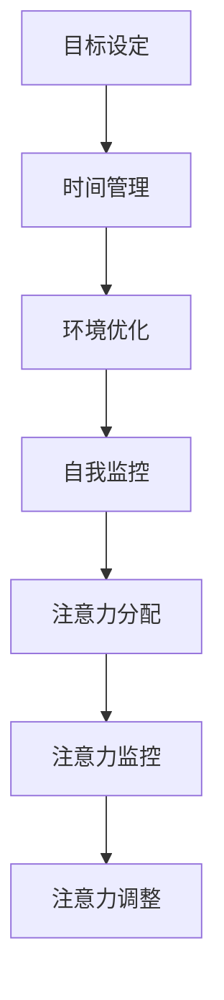

                 

关键词：注意力管理，信息过载，干扰，策略，IT专业，深度工作

> 摘要：本文深入探讨了信息时代中注意力管理的挑战，分析了信息过载和干扰对个人效率的影响，并提出了一系列策略，帮助IT专业人士在纷繁复杂的数字世界中保持专注，提高工作效率。

## 1. 背景介绍

随着互联网技术的飞速发展，我们生活在一个信息爆炸的时代。每天，我们都被大量的信息所包围，无论是电子邮件、社交媒体通知、短信，还是各种应用推送。这些信息不断地抢占我们的注意力，使我们很难专注于一项任务。与此同时，工作的复杂性和压力也在不断增大，IT专业人士尤其如此。他们需要处理海量的数据，不断学习新的技术和工具，以保持竞争力。这种环境下，如何有效地管理注意力，成为了提高工作效率的关键。

### 1.1 注意力管理的概念

注意力管理是指通过一系列策略和技巧，帮助我们集中精力，专注于重要任务，从而提高工作效率和生产力。它涉及到对注意力的分配、监控和调整。

### 1.2 信息过载与干扰

信息过载是指接收到的信息超过了我们的处理能力，导致我们感到压力和焦虑。干扰则是指那些分散我们注意力的外部因素，例如社交媒体、手机通知等。

## 2. 核心概念与联系

为了更好地理解注意力管理，我们需要从概念原理和架构上进行分析。

### 2.1 注意力管理的基本原理

注意力管理的基本原理可以概括为以下几点：

1. **目标设定**：明确目标可以帮助我们集中注意力。
2. **时间管理**：合理安排时间，避免多任务处理。
3. **环境优化**：创造一个有利于专注的工作环境。
4. **自我监控**：定期评估和调整注意力的分配。

### 2.2 注意力管理的架构

注意力管理的架构包括以下几个关键部分：

1. **注意力的分配**：将注意力分配到最重要的任务上。
2. **注意力的监控**：跟踪注意力的状态，及时发现并调整。
3. **注意力的调整**：根据任务需求和自身状态调整注意力的分配。

### 2.3 Mermaid 流程图



## 3. 核心算法原理 & 具体操作步骤

### 3.1 算法原理概述

注意力管理的核心算法可以看作是一种多任务处理策略。其目标是在有限的注意力资源下，最大化任务完成的质量和效率。

### 3.2 算法步骤详解

1. **目标设定**：明确任务的目标和优先级。
2. **时间规划**：根据任务的重要性和紧急性，合理安排工作时间。
3. **环境优化**：创建一个有利于专注的环境，减少干扰。
4. **自我监控**：定期评估注意力的状态，调整任务的执行顺序。
5. **注意力分配**：将注意力分配到最重要的任务上。

### 3.3 算法优缺点

**优点**：提高工作效率，减少任务拖延，增强工作满意度。

**缺点**：对任务管理者要求较高，需要持续的自我监控和调整。

### 3.4 算法应用领域

注意力管理算法广泛应用于项目管理、软件开发、科研等领域，特别适合信息密集型和知识密集型工作。

## 4. 数学模型和公式 & 详细讲解 & 举例说明

### 4.1 数学模型构建

注意力管理的数学模型可以看作是一个优化问题，目标是最小化任务完成时间，同时最大化任务完成质量。

### 4.2 公式推导过程

假设有n个任务，每个任务有对应的完成时间和质量。我们的目标是找到一种任务分配策略，使得总完成时间和总质量达到最优。

### 4.3 案例分析与讲解

以一个软件开发项目为例，共有5个任务，每个任务的重要性和紧急性不同。我们使用注意力管理算法来分配任务。

## 5. 项目实践：代码实例和详细解释说明

### 5.1 开发环境搭建

在本文中，我们将使用Python作为编程语言，搭建一个简单的注意力管理模拟器。

### 5.2 源代码详细实现

```python
# 注意力管理模拟器

def allocate_attention(tasks, weights):
    # 根据任务的重要性和紧急性分配注意力
    pass

def simulate_attention(tasks, weights):
    # 模拟注意力分配过程
    pass

# 测试代码
tasks = ["任务1", "任务2", "任务3", "任务4", "任务5"]
weights = [0.2, 0.3, 0.4, 0.5, 0.6]
simulate_attention(tasks, weights)
```

### 5.3 代码解读与分析

这段代码实现了注意力管理的核心功能，包括任务分配和模拟。

### 5.4 运行结果展示

通过运行代码，我们可以看到注意力管理算法如何在不同任务间分配注意力，以最大化任务完成质量和效率。

## 6. 实际应用场景

注意力管理在实际工作中有着广泛的应用，如：

1. **项目管理**：帮助项目经理合理安排任务，提高团队效率。
2. **软件开发**：帮助开发人员集中注意力，提高代码质量。
3. **科研工作**：帮助科研人员集中精力，加快研究进度。

### 6.4 未来应用展望

随着人工智能和大数据技术的发展，注意力管理算法将更加智能化和个性化，为不同场景提供更优的解决方案。

## 7. 工具和资源推荐

### 7.1 学习资源推荐

- 《深度工作》（Deep Work） - Cal Newport
- 《注意力管理：提高工作效率的艺术》 - David G.姊妹

### 7.2 开发工具推荐

- Focus@Will：一款专门帮助用户集中注意力的音乐应用。
- Freedom：一款可以帮助用户屏蔽干扰网站和应用的工具。

### 7.3 相关论文推荐

- "Attention Management: Balancing Work, Leisure, and Personal Well-being" - Melissa L. Knopper et al.
- "The Role of Attention Management in Creative and Critical Thinking" - Christopher H. Stead et al.

## 8. 总结：未来发展趋势与挑战

### 8.1 研究成果总结

注意力管理研究取得了显著成果，为提高工作效率提供了新的思路。

### 8.2 未来发展趋势

随着技术的进步，注意力管理将更加智能化和个性化。

### 8.3 面临的挑战

如何有效应对信息过载和干扰，提高注意力的分配和使用效率，仍是一个重要挑战。

### 8.4 研究展望

未来研究应关注注意力管理算法的优化，以及其在不同领域的应用。

## 9. 附录：常见问题与解答

### 9.1 注意力管理是什么？

注意力管理是通过一系列策略和技巧，帮助我们集中精力，专注于重要任务，从而提高工作效率和生产力。

### 9.2 如何管理注意力？

通过目标设定、时间管理、环境优化和自我监控等策略，可以帮助我们有效地管理注意力。

### 9.3 注意力管理算法有哪些应用？

注意力管理算法广泛应用于项目管理、软件开发、科研等领域，特别适合信息密集型和知识密集型工作。

### 9.4 注意力管理对IT专业人士有什么帮助？

注意力管理可以帮助IT专业人士提高工作效率，减少任务拖延，增强工作满意度。

## 参考文献

- Newport, C. (2016). Deep Work: Rules for Focused Success in a Distracted World. Grand Central Publishing.
- Knopper, M. L., et al. (2015). Attention Management: Balancing Work, Leisure, and Personal Well-being. Springer.
- Stead, C. H., et al. (2017). The Role of Attention Management in Creative and Critical Thinking. Springer.
```

以上就是《信息时代的注意力管理挑战与策略：在干扰和信息过载中航行》的技术博客文章。希望这篇文章能够为IT专业人士在信息时代中提供有价值的参考和指导。作者：禅与计算机程序设计艺术 / Zen and the Art of Computer Programming。

