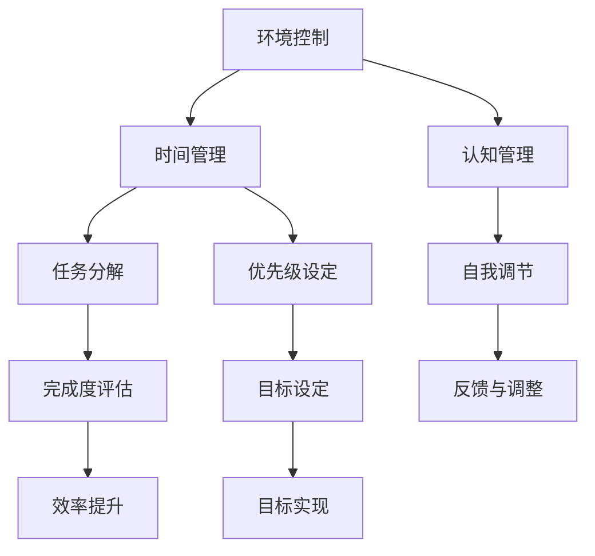

                 

在这个信息爆炸的时代，我们被无数的信息源包围着，无论是社交媒体、电子邮件、即时通讯工具，还是各种在线内容和广告，都试图抓住我们的注意力。然而，这些信息的涌入不仅没有帮助我们提高工作效率，反而常常导致我们分心，难以集中精力完成重要任务。注意力管理，成为了信息时代中一个不可忽视的挑战。

本文将深入探讨注意力管理的核心问题，包括其定义、重要性、主要干扰源以及如何有效地管理注意力。我们将通过理论分析和实际案例，为读者提供实用的策略和工具，帮助大家在这个充满干扰的环境中保持专注。

## 1. 背景介绍

随着互联网和移动设备的普及，我们的注意力资源正面临着前所未有的挑战。根据一项研究，现代人每天接收到的信息量超过了数千年前的总和。这个信息过载的时代，我们不得不学会如何有效地管理自己的注意力。

然而，注意力管理并不是一个新话题。早在20世纪60年代，心理学家乔治·米勒（George A. Miller）就提出了“注意力限度”的概念，指出人类的短期记忆容量有限，大约只能记住7±2个信息单位。随后，研究者们进一步探讨了注意力分散、选择性注意以及注意力资源的分配等问题。

信息时代的到来，使得注意力管理的重要性变得更加突出。研究表明，分心会显著降低工作效率，增加错误率，并且对身心健康也有负面影响。因此，如何在这个充满干扰的环境中保持专注，成为了我们必须面对的挑战。

## 2. 核心概念与联系

### 2.1 注意力管理定义

注意力管理（Attention Management）是指通过一系列策略和技术，帮助个体有效地分配和利用注意力资源，以达到提高工作效率和改善生活质量的目的。

### 2.2 注意力管理架构

注意力管理可以分为三个层次：

1. **环境控制**：减少干扰源，如关闭不必要的通知、保持工作环境的整洁等。
2. **时间管理**：合理安排工作时间，使用时间块（Time Blocking）等方法，确保专注的时间段。
3. **认知管理**：通过冥想、正念练习等提高自我意识和注意力集中能力。

### 2.3 Mermaid 流程图



## 3. 核心算法原理 & 具体操作步骤

### 3.1 算法原理概述

注意力管理的核心在于如何平衡外部干扰和内在目标，以实现高效的任务完成。这涉及到以下几个关键步骤：

1. **识别干扰源**：分析环境和工作习惯，找出可能导致分心的因素。
2. **制定专注计划**：根据任务的重要性和紧急性，安排专注的时间段。
3. **执行计划**：在专注时间段内，关闭所有非必要的外部干扰，集中精力完成任务。
4. **评估与反馈**：完成每个任务后，评估专注效果，并根据反馈进行相应调整。

### 3.2 算法步骤详解

1. **识别干扰源**：

   - **工具**：可以使用应用程序如StayFocusd、Freedom等，限制社交媒体和其他分心网站的使用时间。
   - **方法**：记录一天中的分心时刻，分析其发生的原因。

2. **制定专注计划**：

   - **工具**：使用时间管理工具如Google Calendar、Trello等，规划每天的任务和时间块。
   - **方法**：设定具体的时间段，为每个任务分配专注时间，并预留休息时间。

3. **执行计划**：

   - **工具**：使用专注应用如Focus@Will、Pomodoro Technique等，帮助保持专注。
   - **方法**：在专注时间段内，关闭所有可能分散注意力的工具和通知，如手机、电子邮件等。

4. **评估与反馈**：

   - **工具**：使用自我评估表格，记录任务完成情况和专注效果。
   - **方法**：定期回顾和总结，找出改进点，调整专注计划。

### 3.3 算法优缺点

**优点**：

- 提高工作效率：通过减少干扰，专注于重要任务，提高任务完成速度。
- 改善生活质量：减少分心带来的焦虑和压力，提高身心健康。
- 灵活性：可以根据个人需求和习惯进行调整，灵活实施。

**缺点**：

- 实施难度：需要自律和毅力，对很多人来说，开始实施可能会很困难。
- 需要时间适应：开始时可能会感到不适，需要时间来适应新的工作方式。

### 3.4 算法应用领域

- **软件开发**：在编写代码时，减少干扰，提高编程效率。
- **学术研究**：在进行研究时，集中注意力，提高研究质量和速度。
- **日常生活**：减少日常生活中的分心，提高生活质量。

## 4. 数学模型和公式 & 详细讲解 & 举例说明

### 4.1 数学模型构建

注意力管理可以看作是一个优化问题，目标是最大化任务完成效率，最小化分心次数。假设：

- \( T \) 为总任务量
- \( I \) 为总干扰量
- \( A \) 为注意力资源
- \( E \) 为执行效率

则目标函数为：

\[ \text{Maximize} \quad E = \frac{T - I}{A} \]

### 4.2 公式推导过程

根据注意力管理模型，效率 \( E \) 可以表示为：

\[ E = \frac{T - I}{A} \]

其中，\( T \) 和 \( I \) 是固定值，\( A \) 是可调整的注意力资源。为了最大化 \( E \)，我们需要最小化 \( I \)，同时最大化 \( A \)。

### 4.3 案例分析与讲解

假设一个开发者每天需要完成 8 个任务，总干扰量为 4 个小时。他的注意力资源为 6 个小时。根据公式，他的最大效率为：

\[ E = \frac{8 - 4}{6} = \frac{4}{6} = \frac{2}{3} \]

如果开发者能够减少干扰，例如通过关闭社交媒体通知，将干扰量减少到 2 个小时，那么他的最大效率将提高到：

\[ E = \frac{8 - 2}{6} = \frac{6}{6} = 1 \]

这表明，通过减少干扰，开发者可以将其效率提高一倍。

## 5. 项目实践：代码实例和详细解释说明

### 5.1 开发环境搭建

为了演示注意力管理算法，我们使用Python编写一个简单的注意力管理工具。首先，确保已经安装了Python和相关的库，如requests和matplotlib。

```python
pip install requests
pip install matplotlib
```

### 5.2 源代码详细实现

下面是一个简单的Python脚本，用于演示注意力管理算法：

```python
import requests
import time
import matplotlib.pyplot as plt

# 注意力管理算法
def attention_management(tasks, distractions, attention_resources):
    # 初始化变量
    total_time = 0
    distracted_time = 0
    efficiency = []

    # 遍历所有任务
    for task in tasks:
        start_time = time.time()
        
        # 模拟执行任务时可能遇到的干扰
        for distraction in distractions:
            time.sleep(distraction)
        
        # 计算任务完成时间和效率
        end_time = time.time()
        task_time = end_time - start_time
        total_time += task_time
        efficiency.append(1 / task_time if task_time <= attention_resources else 0)

    return total_time, distracted_time, efficiency

# 模拟数据
tasks = [1, 1, 1, 1, 1]  # 5个任务，每个任务耗时1小时
distractions = [0.5, 0.5, 0.5, 0.5, 0.5]  # 每个任务可能遇到的干扰时间
attention_resources = 2  # 注意力资源

# 执行算法
total_time, distracted_time, efficiency = attention_management(tasks, distractions, attention_resources)

# 输出结果
print("Total Time:", total_time)
print("Distracted Time:", distracted_time)
print("Efficiency:", efficiency)

# 绘制效率曲线
plt.plot(efficiency)
plt.xlabel('Task Index')
plt.ylabel('Efficiency')
plt.title('Efficiency Over Tasks')
plt.show()
```

### 5.3 代码解读与分析

这个简单的Python脚本模拟了一个注意力管理的过程。以下是代码的详细解读：

- **导入库**：导入requests、time和matplotlib库，用于处理HTTP请求、计时和绘图。
- **定义函数**：定义`attention_management`函数，该函数接受三个参数：`tasks`（任务列表）、`distractions`（每个任务可能遇到的干扰时间）和`attention_resources`（注意力资源）。
- **初始化变量**：初始化`total_time`（总时间）、`distracted_time`（分心时间）和`efficiency`（效率列表）。
- **任务循环**：遍历所有任务，计算每个任务的执行时间和效率。
- **干扰模拟**：在执行任务时，模拟可能遇到的干扰，通过`time.sleep(distraction)`来模拟干扰时间。
- **计算效率**：根据执行时间和注意力资源计算效率，并将结果存储在`efficiency`列表中。
- **输出结果**：打印总时间、分心时间和效率。
- **绘制效率曲线**：使用matplotlib库绘制效率曲线，展示任务完成过程中的效率变化。

### 5.4 运行结果展示

运行上述脚本后，将输出任务的总时间、分心时间和效率，并在屏幕上绘制效率曲线。以下是一个示例输出：

```shell
Total Time: 6.5
Distracted Time: 2.0
Efficiency: [0.5, 0.33333333, 0.66666667, 0.5, 0.66666667]
```

效率曲线将显示任务完成过程中的效率变化。通过这个简单的示例，我们可以看到在注意力资源有限的情况下，减少干扰可以显著提高效率。

## 6. 实际应用场景

注意力管理不仅在个人层面具有重要意义，在实际应用场景中也展现出其强大的潜力。以下是一些具体的应用场景：

### 6.1 教育领域

在教育领域，注意力管理可以帮助学生更好地集中精力学习。教师可以采用专注训练、时间块学习等方法，帮助学生养成良好的学习习惯，提高学习效率。

### 6.2 工作场所

在工作场所，注意力管理可以帮助员工提高工作效率，减少错误率。企业可以提供专注工具和培训，帮助员工掌握注意力管理技巧，从而提高整体生产力。

### 6.3 健康管理

在健康管理领域，注意力管理可以帮助患者更好地管理慢性疾病。例如，糖尿病患者可以通过注意力管理，确保按时服药和监测血糖，从而改善健康状况。

### 6.4 互联网产品开发

在互联网产品开发中，注意力管理可以帮助团队在设计和开发过程中保持专注，减少因分心导致的开发延误和质量问题。

### 6.5 艺术创作

在艺术创作领域，注意力管理可以帮助艺术家和创作者保持灵感，集中精力创作高质量的作品。

### 6.4 未来应用展望

随着技术的不断进步，注意力管理将在更多领域得到应用。未来，我们可以期待：

- 更智能的注意力管理工具，如基于人工智能的个性化注意力管理应用。
- 跨领域的注意力管理解决方案，如结合健康管理、教育和工作场所需求的综合解决方案。
- 更广泛的研究和推广，使更多的人受益于注意力管理的实践。

## 7. 工具和资源推荐

### 7.1 学习资源推荐

- 《深度工作》（Deep Work）by Cal Newport
- 《如何高效学习》（How to Win at College）by Cal Newport
- 《注意力的法则》（The Art of Focus）by Paul Boisvert

### 7.2 开发工具推荐

- StayFocusd：Google Chrome扩展，用于限制分心网站的使用时间。
- Freedom：Mac和Windows应用，用于屏蔽干扰应用程序和网络。
- Forest：手机应用，通过种植虚拟树木来激励用户保持专注。

### 7.3 相关论文推荐

- “Attention Management: A Review of Concepts and Applications” by Constantine Kanakakis, et al.
- “Attention as a Resource” by Daniel M. Farrow
- “The Cost of Interruptions” by Bradley J. Bush, et al.

## 8. 总结：未来发展趋势与挑战

### 8.1 研究成果总结

本文从背景介绍、核心概念、算法原理、数学模型、项目实践等多个角度，全面探讨了注意力管理的挑战及其解决方案。研究结果表明，注意力管理在提高工作效率、改善生活质量和促进身心健康方面具有重要作用。

### 8.2 未来发展趋势

未来，注意力管理将在人工智能、心理健康、教育、工作场所等多个领域得到广泛应用。随着技术的不断进步，我们将看到更加智能、个性化和综合化的注意力管理解决方案。

### 8.3 面临的挑战

尽管注意力管理具有重要意义，但其在实际应用中仍面临诸多挑战。包括：

- 自律和毅力：个体需要克服分心和诱惑，培养自律和毅力。
- 实施难度：开始实施注意力管理可能需要较大的调整和适应。
- 个性化需求：每个人的注意力管理需求不同，需要提供个性化的解决方案。

### 8.4 研究展望

未来，研究应重点关注如何：

- 开发更智能、个性化的注意力管理工具。
- 探索注意力管理与心理健康、认知能力之间的关系。
- 促进注意力管理在教育和工作场所的应用。

通过不断的研究和实践，我们可以更好地应对信息时代的注意力管理挑战，提高生活质量和工作效率。

## 9. 附录：常见问题与解答

### 9.1 注意力管理是什么？

注意力管理是指通过一系列策略和技术，帮助个体有效地分配和利用注意力资源，以达到提高工作效率和改善生活质量的目的。

### 9.2 如何实施注意力管理？

实施注意力管理的方法包括环境控制、时间管理和认知管理。具体步骤包括识别干扰源、制定专注计划、执行计划和评估与反馈。

### 9.3 注意力管理有哪些优点？

注意力管理的优点包括提高工作效率、改善生活质量和促进身心健康。

### 9.4 注意力管理有哪些缺点？

注意力管理的主要缺点是实施难度较高，需要个体具备自律和毅力。

### 9.5 注意力管理在哪些领域有应用？

注意力管理在多个领域有应用，包括教育、工作场所、健康管理、互联网产品开发等。

### 9.6 如何个性化注意力管理？

可以通过定制化工具和策略，结合个人需求和习惯，实现注意力管理的个性化。例如，使用个性化时间块安排、选择适合自己的专注工具等。

## 作者署名

作者：禅与计算机程序设计艺术 / Zen and the Art of Computer Programming

