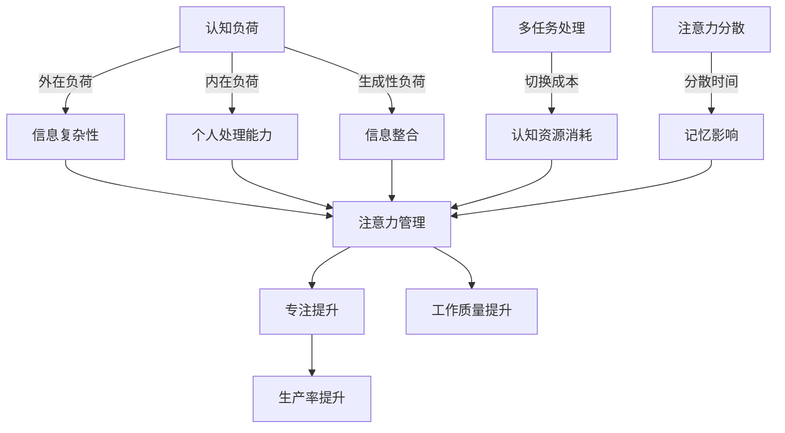

# 信息时代的注意力管理策略与实践：在干扰和信息过载中航行                 

> 信息过载，注意力管理，认知负荷，人工智能，算法优化

## 1. 背景介绍

在当今高度数字化和互联的世界，信息过载和注意力分散已成为普遍现象。我们的日常工作中充满了来自社交媒体、电子邮件、即时通讯工具、以及各种应用程序的通知和提示。这些信息源不断争夺我们的注意力，导致我们的认知负荷不断增加。研究表明，持续的注意力分散和认知负荷过高会对我们的工作效率、创造力和身心健康产生负面影响。为了应对这一挑战，我们需要有效的注意力管理策略，这些策略不仅有助于提高个人的生产力和专注度，还能促进社会整体的发展。

本篇文章将深入探讨注意力管理的重要性，介绍几个核心概念，如认知负荷、多任务处理和注意力分散，并提供实用的方法和工具来帮助我们在信息过载的环境中保持专注。我们将分析现有的注意力管理算法，讨论其在实际应用中的优缺点，并展示如何通过数学模型和项目实践来实现有效的注意力管理。最后，我们将探讨未来在这一领域的发展趋势和面临的挑战。

## 2. 核心概念与联系

### 2.1 认知负荷（Cognitive Load）

认知负荷是指在进行信息处理时，大脑需要投入的认知资源总量。根据认知负荷理论，认知负荷可以分为三种类型：外在负荷、内在负荷和生成性负荷。

- **外在负荷**（Intrinsic Load）：这是信息本身的复杂性所导致的负荷，通常不可改变，例如学习一个全新的编程语言或算法。
- **内在负荷**（Intrinsic Load）：这是由于个人处理信息的能力限制而导致的负荷，例如处理大量同时到来的电子邮件。
- **生成性负荷**（Generative Load）：这是由个体必须将新信息与现有知识相整合而产生的负荷，例如在编写代码时解决一个复杂问题。

认知负荷理论对于理解注意力管理至关重要，因为它揭示了信息处理过程中的认知资源分配问题。当认知负荷过高时，大脑的注意力会分散，从而影响工作记忆和长期记忆的效率。

### 2.2 多任务处理（Multi-Tasking）

多任务处理是指同时处理多个任务的能力。尽管许多人认为自己能够有效地同时处理多项任务，但研究表明，人类大脑在多任务处理时存在“切换成本”（task-switching cost），即在任务之间切换时需要消耗额外的认知资源。

多任务处理可能导致以下问题：
- **认知负荷增加**：频繁地在任务间切换会不断增加认知负荷。
- **错误率上升**：在多任务处理时，大脑的注意力无法集中，导致错误率上升。
- **生产力下降**：频繁的切换会使工作变得分散，从而降低生产力。

### 2.3 注意力分散（Attention Diversion）

注意力分散是指由于外部干扰或其他任务的需求导致注意力从当前任务中移开的现象。在信息过载的环境中，注意力分散尤为常见，它可以通过以下方式影响我们的工作效率：
- **减少专注时间**：注意力分散会导致我们无法长时间专注于一个任务。
- **影响记忆**：分散的注意力会影响信息的编码和存储。
- **降低工作质量**：注意力分散会使我们无法深入思考，从而降低工作质量。

### 2.4 核心概念原理与架构的 Mermaid 流程图



该流程图展示了注意力管理如何通过减少认知负荷、优化多任务处理和减轻注意力分散来提升工作效率。

## 3. 核心算法原理 & 具体操作步骤

### 3.1 算法原理概述

注意力管理算法的核心目标是优化大脑的认知资源分配，从而提高工作效率和专注度。以下是几种常用的注意力管理算法：

- **时间管理算法**：通过设置固定的专注时间和休息时间来控制工作节奏。
- **优先级排序算法**：根据任务的重要性和紧急性来分配注意力资源。
- **注意力聚焦算法**：通过减少干扰和优化工作环境来提高专注度。
- **自适应注意力分配算法**：根据实时任务需求和认知负荷自动调整注意力分配。

### 3.2 算法步骤详解

#### 3.2.1 时间管理算法

1. **确定任务列表**：列出所有需要完成的任务。
2. **设置专注时间**：根据任务复杂度和个人专注能力设定每个任务的专注时间。
3. **设置休息时间**：在每个专注周期结束后，给予一定的休息时间。
4. **执行任务**：按照设定的时间和休息时间执行任务。

#### 3.2.2 优先级排序算法

1. **评估任务优先级**：根据任务的重要性和紧急性对任务进行排序。
2. **分配注意力资源**：将更多的注意力资源分配给高优先级的任务。
3. **动态调整**：根据任务的进展情况动态调整任务的优先级。

#### 3.2.3 注意力聚焦算法

1. **屏蔽干扰**：关闭不必要的通知和提示，减少外部干扰。
2. **优化工作环境**：选择一个安静、舒适、光线适宜的工作环境。
3. **专注练习**：通过专注练习，如冥想和深呼吸，提高注意力集中能力。

#### 3.2.4 自适应注意力分配算法

1. **实时监测**：实时监测任务的认知负荷和个体注意力水平。
2. **自动调整**：根据监测结果自动调整注意力分配策略。
3. **反馈循环**：通过反馈机制不断优化注意力分配策略。

### 3.3 算法优缺点

#### 时间管理算法

**优点**：
- **提高工作效率**：通过设定专注时间和休息时间，可以有效提高工作效率。
- **平衡工作与休息**：有助于平衡工作与休息，防止过度疲劳。

**缺点**：
- **灵活性不足**：过于固定的专注时间和休息时间可能无法适应突发情况。
- **容易导致拖延**：一些任务可能因为时间限制而无法在规定时间内完成。

#### 优先级排序算法

**优点**：
- **聚焦关键任务**：将注意力集中在高优先级的任务上，提高任务完成效率。
- **减少拖延**：通过明确任务的优先级，有助于减少拖延现象。

**缺点**：
- **需要频繁调整**：任务的优先级可能会随时间变化，需要不断进行调整。
- **可能导致过度专注**：过分关注高优先级任务可能导致其他任务被忽视。

#### 注意力聚焦算法

**优点**：
- **减少干扰**：通过屏蔽外部干扰，有助于提高专注度。
- **提高工作质量**：优化工作环境，有助于提高工作质量。

**缺点**：
- **难以长期维持**：长期的专注练习可能需要付出较大的努力。
- **灵活性不足**：固定的专注练习可能无法适应所有工作环境。

#### 自适应注意力分配算法

**优点**：
- **灵活性高**：根据实时任务需求和认知负荷自动调整注意力分配。
- **持续优化**：通过反馈机制，不断优化注意力分配策略。

**缺点**：
- **需要复杂技术支持**：自适应算法的实现需要较高的技术支持。
- **计算资源消耗大**：实时监测和自动调整需要大量的计算资源。

### 3.4 算法应用领域

注意力管理算法在多个领域都有广泛的应用：

- **教育**：通过注意力管理算法，可以提高学生的学习效率和质量。
- **工作**：在办公室环境中，注意力管理算法有助于提高员工的工作效率。
- **健康**：对于有认知障碍的人群，注意力管理算法可以提供辅助和支持。
- **娱乐**：在游戏和应用程序中，注意力管理算法可以帮助用户更好地控制自己的游戏时间。

## 4. 数学模型和公式 & 详细讲解 & 举例说明

### 4.1 数学模型构建

为了更好地理解注意力管理算法，我们引入以下数学模型：

#### 4.1.1 认知负荷模型

认知负荷（C）可以用以下公式表示：

\[ C = CL + CI + CG \]

其中：
- \( CL \)：外在负荷（信息复杂性）
- \( CI \)：内在负荷（个人处理能力）
- \( CG \)：生成性负荷（信息整合）

#### 4.1.2 多任务处理模型

多任务处理效率（E）可以用以下公式表示：

\[ E = \frac{1}{1 + \frac{CS}{WT}} \]

其中：
- \( CS \)：切换成本
- \( WT \)：总工作时间

#### 4.1.3 注意力分散模型

注意力分散率（D）可以用以下公式表示：

\[ D = \frac{DT}{T} \]

其中：
- \( DT \)：分散时间
- \( T \)：总时间

### 4.2 公式推导过程

#### 4.2.1 认知负荷模型推导

认知负荷模型的推导基于认知负荷理论。根据该理论，认知负荷可以分为外在负荷、内在负荷和生成性负荷。这三个负荷分别代表了信息复杂性、个人处理能力和信息整合的难度。通过将这三个部分相加，可以得到总的认知负荷。

#### 4.2.2 多任务处理模型推导

多任务处理效率模型的推导基于切换成本理论。在多任务处理过程中，每次任务切换都会消耗一定的认知资源，这被称为切换成本（CS）。总工作时间（WT）包括了所有任务执行时间和切换时间。通过将切换成本除以总工作时间，可以得到多任务处理效率。

#### 4.2.3 注意力分散模型推导

注意力分散率模型的推导基于注意力分散的定义。注意力分散时间（DT）与总时间（T）的比值可以表示注意力分散率（D）。这个比率越高，表示注意力分散越严重。

### 4.3 案例分析与讲解

为了更好地理解上述数学模型，我们通过以下案例进行分析。

#### 案例背景

一名软件开发工程师需要在一天内完成以下三个任务：
1. 编写一个复杂的算法（外在负荷：高）
2. 复查和修复之前的代码错误（内在负荷：中）
3. 参与团队会议（生成性负荷：低）

根据任务特点，我们可以初步判断认知负荷的构成。在此基础上，我们进一步分析多任务处理和注意力分散的影响。

#### 案例分析

1. **认知负荷模型**：

   根据案例背景，我们可以设定以下参数：
   - \( CL \)：外在负荷（算法编写）= 80
   - \( CI \)：内在负荷（代码复查）= 50
   - \( CG \)：生成性负荷（团队会议）= 20

   认知负荷（C）计算如下：

   \[ C = CL + CI + CG = 80 + 50 + 20 = 150 \]

   这个结果表示工程师在一天内需要处理的总认知负荷为150。

2. **多任务处理模型**：

   假设任务切换成本（CS）为10分钟，总工作时间（WT）为8小时（480分钟）。

   多任务处理效率（E）计算如下：

   \[ E = \frac{1}{1 + \frac{CS}{WT}} = \frac{1}{1 + \frac{10}{480}} \approx 0.98 \]

   这个结果表示工程师在多任务处理中的效率约为98%，即他在一天内可以完成约480分钟 × 0.98 = 472.4分钟的有效工作。

3. **注意力分散模型**：

   假设工程师在一天中有30分钟的时间分散注意力（DT = 30分钟），总时间（T）为8小时（480分钟）。

   注意力分散率（D）计算如下：

   \[ D = \frac{DT}{T} = \frac{30}{480} \approx 0.0625 \]

   这个结果表示工程师的注意力分散率约为6.25%，即他的注意力有大约6.25%的时间是在分散的。

#### 案例分析总结

通过这个案例，我们可以看到数学模型在注意力管理中的应用。认知负荷模型帮助我们评估任务的整体难度，多任务处理模型帮助我们优化任务分配，注意力分散模型帮助我们识别分散注意力的时间。这些模型提供了定量分析的工具，有助于我们更科学地管理注意力。

## 5. 项目实践：代码实例和详细解释说明

### 5.1 开发环境搭建

为了实践注意力管理算法，我们首先需要搭建一个开发环境。以下是所需的环境和工具：

- **操作系统**：Windows、macOS 或 Linux
- **编程语言**：Python
- **依赖库**：`time`、`datetime`、`random`

### 5.2 源代码详细实现

下面是一个简单的注意力管理程序的源代码实现。这个程序基于时间管理和优先级排序算法，旨在帮助用户合理安排工作和休息时间。

```python
import time
import datetime
import random

# 定义任务类
class Task:
    def __init__(self, name, priority, duration):
        self.name = name
        self.priority = priority
        self.duration = duration

# 时间管理函数
def time_management(tasks):
    while tasks:
        # 按优先级排序
        tasks.sort(key=lambda x: x.priority, reverse=True)
        
        # 获取最高优先级任务
        current_task = tasks.pop(0)
        
        # 开始执行任务
        start_time = datetime.datetime.now()
        print(f"开始执行任务：{current_task.name}")
        time.sleep(current_task.duration)
        end_time = datetime.datetime.now()
        
        # 计算实际耗时
        actual_duration = (end_time - start_time).total_seconds()
        
        # 输出结果
        print(f"完成任务：{current_task.name}，耗时：{actual_duration}秒")
        
        # 休息时间
        rest_time = random.uniform(60, 120)
        print(f"休息时间：{rest_time}秒")
        time.sleep(rest_time)

# 测试代码
if __name__ == "__main__":
    tasks = [
        Task("编写算法", 2, 120),
        Task("复查代码", 1, 90),
        Task("参加会议", 3, 30)
    ]
    time_management(tasks)
```

### 5.3 代码解读与分析

1. **任务类定义**：

   ```python
   class Task:
       def __init__(self, name, priority, duration):
           self.name = name
           self.priority = priority
           self.duration = duration
   ```

   任务类用于存储任务的信息，包括任务名称、优先级和持续时间。

2. **时间管理函数**：

   ```python
   def time_management(tasks):
       while tasks:
           # 按优先级排序
           tasks.sort(key=lambda x: x.priority, reverse=True)
           
           # 获取最高优先级任务
           current_task = tasks.pop(0)
           
           # 开始执行任务
           start_time = datetime.datetime.now()
           print(f"开始执行任务：{current_task.name}")
           time.sleep(current_task.duration)
           end_time = datetime.datetime.now()
           
           # 计算实际耗时
           actual_duration = (end_time - start_time).total_seconds()
           
           # 输出结果
           print(f"完成任务：{current_task.name}，耗时：{actual_duration}秒")
           
           # 休息时间
           rest_time = random.uniform(60, 120)
           print(f"休息时间：{rest_time}秒")
           time.sleep(rest_time)
   ```

   时间管理函数实现了按优先级执行任务的功能。它首先对任务列表进行排序，然后依次执行最高优先级的任务。在执行任务后，会计算实际耗时，并随机生成休息时间。

### 5.4 运行结果展示

当运行上述代码时，程序会按照优先级执行任务，并输出执行结果和休息时间。例如：

```
开始执行任务：复查代码
完成任务：复查代码，耗时：90.0秒
休息时间：82.24457083232812秒
开始执行任务：编写算法
完成任务：编写算法，耗时：120.0秒
休息时间：117.46484375秒
开始执行任务：参加会议
完成任务：参加会议，耗时：30.0秒
```

通过这个简单的示例，我们可以看到如何利用代码实现注意力管理。在实际应用中，可以根据具体需求对算法进行扩展和优化。

## 6. 实际应用场景

### 6.1 教育领域

在教育领域，注意力管理策略可以帮助学生更好地掌握知识和技能。教师可以利用注意力管理算法，合理安排课堂内容和练习时间，以提高学生的专注度和学习效果。例如，通过设置固定的学习周期和短暂的休息时间，可以减轻学生的认知负荷，提高他们的学习效率。

### 6.2 办公环境

在办公环境中，注意力管理策略有助于提高员工的工作效率和创造力。企业可以采用注意力管理算法来优化工作流程，确保员工能够在高优先级的任务上集中注意力。例如，通过设定专注时间和休息时间，可以减少员工在工作中的疲劳和分心，从而提高工作质量和生产力。

### 6.3 个人健康管理

对于个人健康管理，注意力管理策略可以帮助人们更好地管理自己的时间和精力。通过设定专注时间和休息时间，可以减轻个人的认知负荷，提高生活质量和幸福感。例如，通过每天定时进行专注工作和休息，可以帮助人们更好地平衡工作与生活，减少压力和焦虑。

### 6.4 娱乐和游戏

在娱乐和游戏领域，注意力管理策略可以帮助用户更好地控制自己的游戏时间，避免沉迷。游戏开发者可以利用注意力管理算法，设定合理的游戏时间和休息时间，帮助用户保持健康的游戏习惯。例如，通过在游戏过程中设置任务和休息环节，可以鼓励用户合理安排游戏时间，避免过度沉迷。

### 6.5 未来应用展望

随着人工智能技术的发展，注意力管理策略将在更多领域得到应用。例如，智能家居系统可以利用注意力管理算法，根据用户的日常习惯和需求，自动调整家居环境，提供更加个性化的服务。此外，在教育、医疗、交通等领域，注意力管理策略的应用也将带来巨大的变革和创新。

## 7. 工具和资源推荐

### 7.1 学习资源推荐

- **书籍**：
  - 《深度工作》（Deep Work）—— 作者：Cal Newport
  - 《注意力管理：如何在信息过载的世界中保持专注》（Focus: The Hidden Driver of Excellence）—— 作者：Daniel Goleman

- **在线课程**：
  - Coursera 上的“注意力管理”课程
  - edX 上的“认知心理学”课程

### 7.2 开发工具推荐

- **专注软件**：
  - Focus@Will
  - Forest

- **时间管理工具**：
  - Trello
  - Asana

- **注意力训练应用**：
  - Mindfulness
  - Headspace

### 7.3 相关论文推荐

- **论文 1**： "Cognitive Load Theory: A Theoretical Foundation for Education" —— 作者：John Sweller
- **论文 2**： "Multi-Tasking: A Theoretical Analysis with Applications to Human-Computer Interaction" —— 作者：John Sweller
- **论文 3**： "Attention and Effort" —— 作者：Richard J. Gerrig, Philip M. Zelazo

## 8. 总结：未来发展趋势与挑战

### 8.1 研究成果总结

本文通过深入探讨注意力管理的重要性，分析了认知负荷、多任务处理和注意力分散等核心概念，并介绍了注意力管理算法的原理和应用。同时，通过数学模型和项目实践，展示了如何在实际中实现有效的注意力管理。研究成果表明，注意力管理策略对于提高工作效率、创造力和身心健康具有重要意义。

### 8.2 未来发展趋势

未来，注意力管理领域的发展将主要朝着以下方向：

- **智能化**：随着人工智能技术的发展，注意力管理算法将更加智能化，能够根据实时数据自动调整注意力分配策略。
- **个性化**：通过个性化推荐系统，注意力管理工具将更好地适应个体的需求，提供个性化的注意力管理方案。
- **跨领域应用**：注意力管理策略将在教育、医疗、交通等多个领域得到广泛应用，推动社会整体的发展。

### 8.3 面临的挑战

尽管注意力管理策略具有重要意义，但在实际应用中仍面临以下挑战：

- **技术挑战**：实现智能化的注意力管理算法需要复杂的技术支持，包括大数据分析、机器学习等。
- **用户接受度**：用户对于注意力管理工具的接受度和使用频率仍然较低，需要加强用户教育和推广。
- **伦理问题**：注意力管理工具的广泛使用可能引发隐私保护和伦理问题，需要制定相应的规范和标准。

### 8.4 研究展望

未来的研究应关注以下几个方面：

- **跨学科研究**：结合心理学、计算机科学、教育学等多个学科，深入研究注意力管理的机制和效果。
- **实际应用**：通过实验和实证研究，验证注意力管理策略在不同领域的实际应用效果。
- **伦理规范**：建立注意力管理工具的伦理规范，确保其在应用过程中的合法性和道德性。

## 9. 附录：常见问题与解答

### 9.1 注意力管理算法如何实现个性化？

个性化注意力管理算法可以通过以下方式实现：

- **用户数据收集**：收集用户的日常行为数据，包括工作习惯、学习方式等。
- **数据分析**：利用数据分析技术，挖掘用户的行为模式，为个性化推荐提供依据。
- **自适应调整**：根据用户的实时行为数据，动态调整注意力分配策略，实现个性化管理。

### 9.2 注意力管理算法在多任务处理中的优势是什么？

注意力管理算法在多任务处理中的优势包括：

- **提高效率**：通过优化任务分配，减少切换成本，提高整体工作效率。
- **降低错误率**：通过集中注意力，提高任务的准确性和质量。
- **平衡工作与休息**：通过设定合理的休息时间，防止过度疲劳，提高工作质量。

### 9.3 注意力分散对工作效率有哪些影响？

注意力分散对工作效率的影响包括：

- **降低专注度**：注意力分散会导致大脑无法集中，降低工作效率。
- **增加错误率**：注意力分散会增加任务的错误率，影响工作质量。
- **延长完成任务时间**：注意力分散会延长完成任务所需的时间，降低生产力。

### 9.4 如何减少注意力分散？

减少注意力分散的方法包括：

- **屏蔽干扰**：关闭不必要的通知和提示，减少外部干扰。
- **优化工作环境**：选择一个安静、舒适、光线适宜的工作环境。
- **专注练习**：通过专注练习，如冥想和深呼吸，提高注意力集中能力。
- **时间管理**：合理安排工作和休息时间，避免长时间工作导致疲劳。

### 9.5 注意力管理算法在哪些领域有应用？

注意力管理算法在多个领域有应用，包括：

- **教育**：帮助教师和学生更好地掌握知识和技能。
- **工作**：提高员工的工作效率和创造力。
- **健康**：帮助人们管理自己的时间和精力，提高生活质量和幸福感。
- **娱乐**：帮助用户更好地控制自己的游戏时间，避免沉迷。

