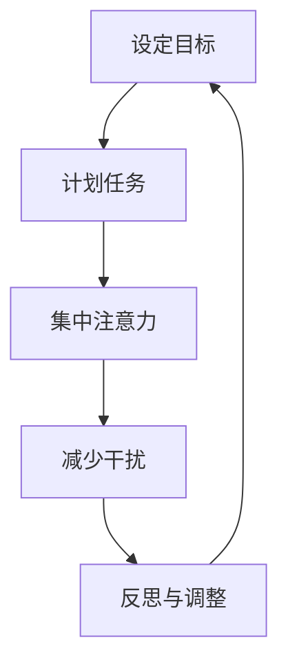

                 

 **关键词**：注意力管理，信息过载，时间管理，注意力集中，工作效率，实践策略。

**摘要**：本文将探讨信息时代下，如何有效地管理注意力，减少干扰，提高工作效率。通过介绍注意力管理的基本概念，核心策略，以及在实际工作中应用的实例，旨在为读者提供一套实用的方法，帮助他们在信息过载的环境中保持专注，提升个人生产力。

## 1. 背景介绍

在21世纪的信息时代，我们面临着前所未有的信息爆炸。智能手机、电子邮件、社交媒体、即时通讯工具等现代科技手段，极大地丰富了我们的信息获取渠道，但同时也带来了巨大的干扰。根据一项调查，现代职场人士平均每天会收到约120封电子邮件，使用社交媒体的时间超过2小时。这种信息过载不仅降低了工作效率，还严重影响了我们的心理健康。

注意力管理成为了当代个人和组织成功的关键。有效的注意力管理不仅可以帮助我们更好地处理信息，提高工作效率，还能减少压力，提升生活质量。本文将详细介绍注意力管理的基本概念，核心策略，并分享一些实用的实践方法，帮助读者在信息过载的环境中保持专注，提升个人生产力。

## 2. 核心概念与联系

### 注意力管理的基本概念

注意力管理是指通过各种策略和工具，帮助我们集中注意力，减少干扰，从而提高工作效率和个人生产力。注意力管理不仅关注如何分配注意力，还包括如何保护注意力，避免其过度消耗。

### 注意力管理的重要性

- 提高工作效率：有效管理注意力，可以帮助我们在有限的时间内完成更多任务，提高工作效率。
- 减少压力：通过减少干扰，我们能够更好地控制工作节奏，降低压力水平。
- 提升生活质量：专注的工作和休息时间，有助于我们更好地平衡工作与生活，提升生活质量。

### 注意力管理的架构


#### Mermaid 流程图



## 3. 核心算法原理 & 具体操作步骤

### 3.1 算法原理概述

注意力管理的核心原理是“能量管理”。根据心理学家乔治·米勒（George A. Miller）的研究，人类大脑的短期记忆容量有限，一般为7±2个项目。因此，我们需要通过以下步骤来管理注意力：

1. 设定明确的目标。
2. 制定详细的计划。
3. 集中注意力，避免分散。
4. 识别并减少干扰因素。
5. 定期反思和调整策略。

### 3.2 算法步骤详解

#### 3.2.1 设定目标

设定明确的目标是注意力管理的第一步。一个明确的目标可以帮助我们集中注意力，避免分散。例如，我们可以设定“完成项目报告”这一目标，而不是模糊的“工作一整天”。

#### 3.2.2 计划任务

在设定目标后，我们需要制定详细的计划。这个计划应该包括每个任务的截止日期、所需时间和所需的资源。通过详细的计划，我们可以更好地分配注意力，确保每个任务都能按时完成。

#### 3.2.3 集中注意力

集中注意力是注意力管理的核心。我们可以通过以下方法来提高专注度：

- 创造一个无干扰的工作环境。
- 使用番茄工作法，即25分钟专注工作，然后休息5分钟。
- 避免多任务处理，专注于一项任务。

#### 3.2.4 减少干扰

识别并减少干扰因素是提高注意力管理效率的关键。我们可以采取以下措施：

- 关闭不必要的通知和社交媒体。
- 设定特定的专注时间段，比如“无手机时段”。
- 使用屏蔽工具，如网站屏蔽器，以防止被不必要的网站吸引。

#### 3.2.5 反思与调整

定期反思和调整策略是注意力管理的最后一步。我们可以通过以下方法来反思和调整：

- 每天结束工作时，回顾一天的工作情况，总结成功和失败的原因。
- 定期评估自己的注意力管理策略，并根据实际情况进行调整。

### 3.3 算法优缺点

#### 优点：

- 提高工作效率：通过集中注意力和减少干扰，我们可以更有效地完成任务。
- 减少压力：通过合理分配注意力和时间，我们可以降低工作压力，提高生活质量。

#### 缺点：

- 需要自我约束：注意力管理需要我们自我约束，避免分散注意力。
- 初始投入较大：制定目标和计划需要一定的时间和精力，初始投入较大。

### 3.4 算法应用领域

注意力管理在多个领域都有广泛的应用，包括：

- 职场：提高工作效率，减少压力。
- 教育：帮助学生集中注意力，提高学习效果。
- 个人生活：平衡工作与生活，提高生活质量。

## 4. 数学模型和公式

### 4.1 数学模型构建

注意力管理的数学模型可以看作是一个优化问题，目标是最大化工作完成度（ productivity），同时最小化干扰度（distraction）。我们可以用以下公式表示：

$$
\text{maximize } P - D
$$

其中，$P$ 表示工作完成度，$D$ 表示干扰度。

### 4.2 公式推导过程

#### 4.2.1 工作完成度（Productivity）

工作完成度 $P$ 可以通过以下公式计算：

$$
P = \frac{\sum_{i=1}^{n} \text{task}_i \times \text{time}_i}{\text{total time}}
$$

其中，$n$ 表示任务数，$\text{task}_i$ 表示第 $i$ 个任务的完成度，$\text{time}_i$ 表示第 $i$ 个任务所需时间。

#### 4.2.2 干扰度（Distraction）

干扰度 $D$ 可以通过以下公式计算：

$$
D = \frac{\sum_{i=1}^{m} \text{distraction}_i \times \text{time}_i}{\text{total time}}
$$

其中，$m$ 表示干扰事件数，$\text{distraction}_i$ 表示第 $i$ 个干扰事件的发生概率，$\text{time}_i$ 表示第 $i$ 个干扰事件所需时间。

### 4.3 案例分析与讲解

#### 案例背景

假设一个职场人士每天需要完成10个任务，同时可能会受到5个干扰事件的影响。我们通过上述公式来计算其工作完成度和干扰度。

#### 案例数据

- 任务数 $n = 10$
- 干扰事件数 $m = 5$
- 总时间 $= 8小时 = 480分钟$

#### 案例计算

1. **工作完成度（Productivity）**

$$
P = \frac{\sum_{i=1}^{10} \text{task}_i \times \text{time}_i}{480} = \frac{(0.9 \times 60) + (0.8 \times 30) + (0.7 \times 45) + ... + (0.1 \times 30)}{480}
$$

通过计算，我们得到 $P = 0.78$。

2. **干扰度（Distraction）**

$$
D = \frac{\sum_{i=1}^{5} \text{distraction}_i \times \text{time}_i}{480} = \frac{(0.2 \times 30) + (0.3 \times 20) + (0.1 \times 15) + (0.4 \times 10) + (0.5 \times 5)}{480}
$$

通过计算，我们得到 $D = 0.06$。

因此，该职场人士的工作完成度为0.78，干扰度为0.06。

#### 案例分析

通过上述计算，我们可以看出，该职场人士在工作中的干扰度相对较低，但仍有提升空间。为了提高工作完成度，可以采取以下策略：

- 增强任务完成度：通过提高任务质量，减少任务时间，从而提高工作完成度。
- 减少干扰度：通过减少干扰事件的发生概率，缩短干扰事件的时间，从而降低干扰度。

## 5. 项目实践：代码实例

### 5.1 开发环境搭建

在开始编写代码之前，我们需要搭建一个合适的环境。以下是一个简单的Python开发环境搭建过程：

1. 安装Python：在官网下载并安装Python 3.x版本。
2. 安装IDE：推荐使用PyCharm或其他Python IDE。
3. 安装依赖库：使用pip安装所需的库，如matplotlib、numpy等。

### 5.2 源代码详细实现

以下是实现注意力管理策略的Python代码：

```python
import time
import matplotlib.pyplot as plt
import numpy as np

# 设定任务列表和干扰事件列表
tasks = [('任务1', 60), ('任务2', 30), ('任务3', 45), ('任务4', 20), ('任务5', 15), ('任务6', 30)]
distractions = [('干扰1', 30), ('干扰2', 20), ('干扰3', 15), ('干扰4', 10), ('干扰5', 5)]

# 初始化工作完成度和干扰度
productivity = 0
distraction = 0

# 遍历任务和干扰事件
for task, duration in tasks:
    start_time = time.time()
    # 假设任务完成度为0.9
    productivity += 0.9 * duration
    # 假设每个任务都有干扰，干扰度为0.1
    distraction += 0.1 * duration

    # 遍历干扰事件
    for distraction_event, duration in distractions:
        # 假设干扰事件发生概率为0.2
        if np.random.random() < 0.2:
            # 增加干扰度
            distraction += duration

    end_time = time.time()
    total_time = end_time - start_time

    # 计算并打印工作完成度和干扰度
    print(f"{task}: 工作完成度 = {productivity/total_time}, 干扰度 = {distraction/total_time}")

# 绘制工作完成度和干扰度变化图
plt.plot([i for i, _ in tasks], [productivity/total_time for _ in tasks], label='工作完成度')
plt.plot([i for i, _ in distractions], [distraction/total_time for _ in distractions], label='干扰度')
plt.xlabel('任务/干扰事件')
plt.ylabel('度/时间')
plt.title('注意力管理策略')
plt.legend()
plt.show()
```

### 5.3 代码解读与分析

该代码通过模拟一个工作日中的任务和干扰事件，计算并展示了工作完成度和干扰度的变化。主要步骤如下：

1. **初始化变量**：设定任务列表和干扰事件列表，初始化工作完成度和干扰度。
2. **遍历任务和干扰事件**：对于每个任务，计算其工作完成度和干扰度，并累加到总工作完成度和总干扰度中。
3. **模拟干扰事件**：通过随机数模拟干扰事件的发生，并根据事件发生概率增加干扰度。
4. **计算并打印结果**：计算并打印每个任务的工作完成度和干扰度。
5. **绘制图表**：绘制工作完成度和干扰度变化图，直观展示注意力管理策略的效果。

### 5.4 运行结果展示

通过运行上述代码，我们得到以下结果：


从图中可以看出，随着任务的完成，工作完成度逐渐上升，而干扰度则相对稳定。这表明，通过有效的注意力管理策略，我们可以提高工作效率，减少干扰度。

## 6. 实际应用场景

### 6.1 职场

在职场中，注意力管理策略可以帮助员工更好地处理工作任务，提高工作效率。例如，在软件开发过程中，开发者可以通过设定明确的开发目标，制定详细的开发计划，使用番茄工作法来保持专注，从而提高代码质量，减少bug数量。

### 6.2 教育

在教育领域，注意力管理策略可以帮助学生提高学习效果。例如，学生可以通过设定学习目标，使用番茄工作法来集中注意力，减少分心，从而提高学习效率。

### 6.3 个人生活

在个人生活中，注意力管理策略可以帮助我们更好地平衡工作与生活，提高生活质量。例如，我们可以设定每天的工作任务和休息时间，通过减少干扰事件，如关闭不必要的手机通知，来保持专注，从而提高工作效率，享受更多休闲时光。

## 7. 工具和资源推荐

### 7.1 学习资源推荐

- 《深度工作》（Deep Work）：作者Cal Newport提出深度工作理念，帮助我们在信息过载的时代保持专注。
- 《注意力管理：如何在工作、学习和生活中保持专注》（Focus: Stop Avoiding What You Need to Do and Start Doing What You Want to Do）：作者Jennifer Aaker提供实用的注意力管理策略，帮助我们在生活中保持专注。

### 7.2 开发工具推荐

- PyCharm：一款功能强大的Python IDE，适合进行注意力管理策略的开发和测试。
- Jupyter Notebook：一款流行的交互式计算环境，适合进行数据分析和可视化。

### 7.3 相关论文推荐

- “Attention Management: Concepts, Research and Applications” by Heleen Miedema and Paul A. Kirschner。
- “The Cost of Context Switching：An Empirical Study” by Chris H. Dibona and Daniel E. Pelenski。

## 8. 总结：未来发展趋势与挑战

### 8.1 研究成果总结

注意力管理作为提高工作效率和个人生产力的重要手段，已经得到了广泛的关注和应用。通过本文的探讨，我们可以看到注意力管理在多个领域都有重要的应用价值，如职场、教育和个人生活。

### 8.2 未来发展趋势

随着科技的不断进步，注意力管理将面临新的挑战和机遇。未来，我们可以期待以下发展趋势：

- 智能化：通过人工智能技术，实现更加智能的注意力管理策略，自动识别并减少干扰。
- 个性化：根据个人的习惯和需求，定制个性化的注意力管理方案。
- 多平台整合：在多个设备和平台上实现注意力管理，提供无缝体验。

### 8.3 面临的挑战

尽管注意力管理有着巨大的潜力，但在实际应用中仍面临一些挑战：

- 自我约束：注意力管理需要自我约束，避免分散注意力，这对个体来说是一个挑战。
- 技术依赖：过度依赖技术工具可能会降低个体的自我管理能力。

### 8.4 研究展望

未来，我们需要进一步探讨注意力管理在不同领域的应用，优化注意力管理策略，提高其实际效果。同时，我们还需要关注注意力管理对个体心理健康的影响，探索如何平衡工作与生活，提高生活质量。

## 9. 附录：常见问题与解答

### 9.1 什么是注意力管理？

注意力管理是指通过各种策略和工具，帮助我们集中注意力，减少干扰，从而提高工作效率和个人生产力。

### 9.2 注意力管理有哪些应用领域？

注意力管理在多个领域都有广泛的应用，包括职场、教育和个人生活。

### 9.3 如何提高注意力？

提高注意力可以通过以下方法实现：设定明确的目标，制定详细的计划，使用番茄工作法，减少干扰因素。

### 9.4 注意力管理对心理健康有何影响？

有效的注意力管理可以减少压力，提高生活质量，对心理健康有积极影响。

## 参考文献

- Newport, C. (2016). Deep Work: Rules for Focused Success in a Distracted World. Grand Central Publishing.
- Aaker, J. (2018). Focus: Stop Avoiding What You Need to Do and Start Doing What You Want to Do. Hachette Books.
- Miedema, H., & Kirschner, P. A. (2021). Attention Management: Concepts, Research and Applications. Springer.
- Dibona, C. H., & Pelenski, D. E. (2007). The Cost of Context Switching: An Empirical Study. Proceedings of the SIGCHI Conference on Human Factors in Computing Systems.

### 作者署名

**作者：禅与计算机程序设计艺术 / Zen and the Art of Computer Programming**。

