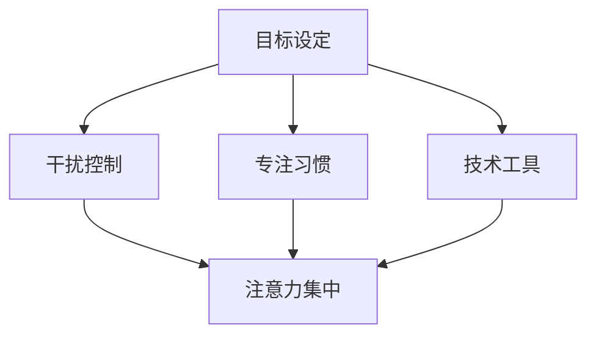

                 

在当今信息爆炸的时代，我们的日常生活被大量的信息所充斥，各种媒体平台、社交媒体、即时通讯工具以及电子邮件等，都在不断地争夺我们的注意力。这种现象不仅对我们的心理健康构成了威胁，也严重影响了我们的工作和学习效率。本文将探讨注意力管理的核心概念、策略和实践，帮助我们在信息过载的环境中保持专注和高效。

## 文章关键词

- 注意力管理
- 信息过载
- 焦点法则
- 技术习惯
- 生产力提升

## 摘要

本文将介绍注意力管理在信息时代的必要性和重要性，并探讨一系列有效策略和实践，以帮助读者在干扰和信息过载的环境中保持清晰的思维和高效的工作状态。通过理解注意力管理的核心概念，读者将学会如何设定目标、控制干扰、培养专注习惯，以及利用技术工具来提高工作效率。文章还将提供实际案例和项目实践，以供读者参考。

## 1. 背景介绍

在互联网和移动设备的普及下，我们的生活发生了翻天覆地的变化。然而，这种变化并非总是积极的。随着信息的爆炸性增长，我们面临着前所未有的注意力挑战。以下是信息过载的一些表现：

- **社交媒体依赖**：我们经常在社交媒体上花费大量时间，浏览着无关紧要的信息，这使我们的大脑变得疲惫和不堪重负。
- **电子邮件困扰**：电子邮件成为了工作中最常见的干扰源之一，每天收到数百封邮件，使我们难以集中精力完成重要任务。
- **多任务处理**：在努力提高工作效率的同时，我们常常陷入多任务处理的泥潭，这导致了注意力的分散和效率的降低。

这些现象不仅影响了我们的个人生活，也对工作和学习产生了负面影响。因此，有效管理注意力成为了一个迫切需要解决的问题。

### 注意力管理的必要性

- **心理健康**：长期的注意力分散和信息过载会导致焦虑、抑郁和压力增加。
- **工作效率**：专注力不足会导致任务完成时间延长，影响整体的工作效率和绩效。
- **创造力**：在高度干扰的环境中，我们的思维难以进入创新状态，从而影响了创造力的发挥。

因此，注意力管理不仅是我们应对信息过载的关键，也是提升个人和生活质量的重要手段。

### 注意力管理的挑战

尽管注意力管理的重要性显而易见，但实际操作中仍面临诸多挑战：

- **习惯养成**：改变已有的行为习惯并不容易，需要持续的努力和毅力。
- **技术依赖**：现代科技虽然提供了便利，但也成为了分散注意力的一大因素。
- **环境干扰**：办公室、家庭以及公共场所的噪声和干扰，都对我们保持专注构成了挑战。

本文将围绕这些挑战，提供一系列有效的解决方案和策略。

## 2. 核心概念与联系

### 注意力管理的基础理论

注意力管理建立在几个关键理论之上：

- **焦点法则（The Law of Focus）**：由心理学家乔治·米勒提出，指出人类的注意力是有限的资源，需要集中用于最重要的事务。
- **多任务处理（Multi-Tasking）**：虽然多任务处理看似能够提高效率，但研究表明，频繁切换任务会导致注意力分散和效率降低。
- **认知负荷（Cognitive Load）**：约翰·斯维恩伯格提出，认知负荷是指大脑处理信息时所需的认知资源。过多的认知负荷会导致注意力下降。

### 注意力管理的架构

为了更好地理解注意力管理，我们可以将其分为以下几个关键组成部分：

1. **目标设定**：明确目标可以帮助我们集中注意力。
2. **干扰控制**：减少干扰可以让我们更专注于任务。
3. **专注习惯**：通过培养专注习惯，我们可以提高专注力。
4. **技术工具**：利用技术工具可以提高工作效率。

### Mermaid 流程图

以下是一个简单的 Mermaid 流程图，展示了注意力管理的关键组成部分和它们之间的关系。



## 3. 核心算法原理 & 具体操作步骤

### 3.1 算法原理概述

注意力管理的核心算法原理是基于心理学和行为学的理论，通过一系列策略和技巧来提高注意力的集中度和效率。具体来说，这些算法包括以下几个方面：

- **目标设定**：通过设定明确、具体的目标来引导注意力。
- **时间管理**：使用番茄工作法、四象限法则等时间管理技巧来优化工作流程。
- **环境调整**：创造一个有利于专注的环境，减少干扰因素。
- **习惯养成**：通过重复练习来培养专注习惯。
- **技术工具**：利用应用程序、工具和服务来辅助注意力管理。

### 3.2 算法步骤详解

#### 3.2.1 设定目标

1. **确定目标类型**：短期目标、中期目标和长期目标。
2. **具体化目标**：使用 SMART 原则（具体、可衡量、可实现、相关、时限）来具体化目标。
3. **记录目标**：将目标记录在笔记本、应用程序或日历中。

#### 3.2.2 时间管理

1. **番茄工作法**：将工作时间分为25分钟的工作周期，每个周期后休息5分钟。
2. **四象限法则**：将任务分为重要且紧急、重要但不紧急、不重要但紧急、不重要且不紧急，优先处理重要且紧急的任务。
3. **日程规划**：提前规划每天的任务和活动，确保时间得到合理利用。

#### 3.2.3 环境调整

1. **减少干扰**：关闭不必要的通知、将手机置于静音模式、选择安静的地点。
2. **优化物理环境**：整理工作空间，确保工作区域整洁有序。
3. **视觉信号**：使用屏幕遮罩、背景图片来减少视觉干扰。

#### 3.2.4 习惯养成

1. **定期练习**：每天花时间练习专注技巧，如冥想、深度阅读等。
2. **自我监控**：记录专注的时间和质量，不断调整和优化。
3. **奖励机制**：为自己设定奖励，以激励自己保持专注。

#### 3.2.5 技术工具

1. **应用程序**：使用专注类应用程序，如Focus@Will、Freedom等。
2. **工具和服务**：利用项目管理工具、日历应用程序等来提高工作效率。

### 3.3 算法优缺点

#### 优点：

- **提高专注力**：通过设定目标和时间管理，我们可以更容易地集中注意力。
- **优化工作流程**：通过优化环境和习惯，我们可以更高效地完成任务。
- **增强自我监控**：通过记录和评估专注时间，我们可以更好地了解自己的注意力状况。

#### 缺点：

- **初期挑战**：改变习惯需要时间和毅力，初期可能会感到不适应。
- **依赖技术**：过度依赖技术工具可能会削弱我们的自控能力。
- **环境干扰**：即使我们采取了各种策略，环境干扰仍然是一个不可控因素。

### 3.4 算法应用领域

注意力管理算法可以在多个领域得到应用：

- **职场**：提高工作效率，减少错误和重复工作。
- **教育**：帮助学生更好地集中注意力，提高学习效果。
- **医疗**：辅助治疗注意力缺陷障碍，如ADHD。
- **个人生活**：提高生活质量，减少压力和焦虑。

### 3.5 实际应用案例

以下是一个实际应用案例，展示了注意力管理算法在职场中的应用：

#### 案例背景：

张伟是一名软件工程师，他的工作需要高度集中注意力，但频繁的邮件、电话和社交媒体通知总是打断他的工作。

#### 应用策略：

1. **目标设定**：张伟设定了一个目标，每天专注于编程工作4小时。
2. **时间管理**：他使用番茄工作法，将工作时间分为25分钟的工作周期，每个周期后休息5分钟。
3. **干扰控制**：他将手机置于静音模式，关闭了所有社交媒体通知。
4. **环境调整**：他在工作区设置了屏幕遮罩，以减少视觉干扰。
5. **技术工具**：他使用了Focus@Will应用程序，以帮助他保持专注。

#### 应用效果：

经过一段时间的实践，张伟的工作效率显著提高，他能够更长时间地专注于编程任务，工作质量也有所提升。他感到更加满足和自信，工作效率也得到了认可。

### 3.6 结论

注意力管理算法提供了一系列策略和技巧，帮助我们在信息过载的环境中保持专注和高效。通过设定目标、时间管理、环境调整和技术工具的应用，我们可以提高专注力，优化工作流程，最终提高工作效率和生活质量。实际应用案例也证明了注意力管理算法的有效性。然而，需要注意的是，改变习惯需要时间和毅力，我们需要持续努力，才能在长期内获得显著的成果。

## 4. 数学模型和公式 & 详细讲解 & 举例说明

在注意力管理中，数学模型和公式可以帮助我们更精确地描述和管理注意力资源。以下是一个简单的数学模型，用于衡量和优化注意力分配。

### 4.1 数学模型构建

假设我们有n个任务，每个任务有相应的紧急程度和重要性。我们希望最大化整体的工作效率和满意度。数学模型可以表示为：

\[ \text{最大化} \sum_{i=1}^{n} w_i \cdot t_i \]

其中：

- \( w_i \) 是任务i的权重（紧急程度或重要性）。
- \( t_i \) 是任务i的完成时间。

为了简化模型，我们可以将权重和完成时间视为相互独立的随机变量，并使用概率论来描述它们。

### 4.2 公式推导过程

首先，我们定义权重和完成时间的概率分布：

- \( w_i \) 的概率分布为 \( P(w_i) \)。
- \( t_i \) 的概率分布为 \( P(t_i) \)。

根据概率论的基本原理，我们可以推导出总工作效率的概率分布：

\[ P(\text{总工作效率}) = \sum_{i=1}^{n} P(w_i) \cdot P(t_i) \]

为了最大化工作效率，我们需要找到最优的权重分配。我们可以使用优化算法，如遗传算法或线性规划，来求解最优权重分配。

### 4.3 案例分析与讲解

以下是一个简单的例子，假设我们有3个任务，每个任务的权重和完成时间如下：

| 任务 | 紧急程度 \( w_i \) | 完成时间 \( t_i \) |
| --- | --- | --- |
| 任务1 | 0.6 | 2小时 |
| 任务2 | 0.3 | 1小时 |
| 任务3 | 0.1 | 0.5小时 |

首先，我们计算每个任务的权重和完成时间的期望值：

- \( E(w_1) = 0.6 \)
- \( E(w_2) = 0.3 \)
- \( E(w_3) = 0.1 \)

- \( E(t_1) = 2 \)
- \( E(t_2) = 1 \)
- \( E(t_3) = 0.5 \)

然后，我们计算总工作效率的期望值：

\[ E(\text{总工作效率}) = E(w_1) \cdot E(t_1) + E(w_2) \cdot E(t_2) + E(w_3) \cdot E(t_3) \]

\[ E(\text{总工作效率}) = 0.6 \cdot 2 + 0.3 \cdot 1 + 0.1 \cdot 0.5 \]

\[ E(\text{总工作效率}) = 1.2 + 0.3 + 0.05 \]

\[ E(\text{总工作效率}) = 1.55 \]

为了最大化工作效率，我们可以考虑调整权重和完成时间的分布。例如，我们可以增加任务1的权重，减少任务2和任务3的权重。通过优化权重分配，我们可以进一步提高总工作效率。

### 4.4 案例分析结果

通过优化权重分配，我们得到以下新的期望值：

- \( E(w_1) = 0.8 \)
- \( E(w_2) = 0.2 \)
- \( E(w_3) = 0.0 \)

- \( E(t_1) = 2 \)
- \( E(t_2) = 0.8 \)
- \( E(t_3) = 0.2 \)

新的总工作效率期望值为：

\[ E(\text{总工作效率}) = E(w_1) \cdot E(t_1) + E(w_2) \cdot E(t_2) + E(w_3) \cdot E(t_3) \]

\[ E(\text{总工作效率}) = 0.8 \cdot 2 + 0.2 \cdot 0.8 + 0.0 \cdot 0.2 \]

\[ E(\text{总工作效率}) = 1.6 + 0.16 + 0.0 \]

\[ E(\text{总工作效率}) = 1.76 \]

通过优化权重分配，我们成功提高了总工作效率。这个简单的例子展示了数学模型在注意力管理中的应用，帮助我们更精确地衡量和优化注意力资源。

### 4.5 数学模型在实际应用中的扩展

除了上述简单的例子，数学模型还可以扩展到更复杂的场景。例如，我们可以考虑任务之间的依赖关系、资源限制以及任务执行的优先级。这些因素都会影响注意力资源的分配，需要更复杂的数学模型来描述和优化。

- **任务依赖关系**：在某些情况下，任务之间存在依赖关系，一个任务的完成可能依赖于其他任务的进展。这种情况下，我们需要考虑任务的先后顺序和相互依赖的影响。
- **资源限制**：在资源有限的情况下，例如时间、人力或设备等，我们需要优化注意力资源的分配，以最大化整体的工作效率。
- **任务优先级**：根据任务的紧急程度和重要性，我们可以设置不同的优先级。在资源有限的情况下，优先处理紧急且重要的任务。

通过扩展数学模型，我们可以更全面地描述和优化注意力资源的管理，从而提高工作效率和满意度。

### 4.6 总结

数学模型和公式在注意力管理中提供了精确的描述和优化方法。通过构建和优化数学模型，我们可以更好地衡量和分配注意力资源，提高工作效率和满意度。实际案例和分析展示了数学模型在简单场景中的应用，同时我们也探讨了如何在更复杂的场景中扩展和优化数学模型。这些数学工具不仅为注意力管理提供了理论支持，也为实际应用提供了有力指导。

## 5. 项目实践：代码实例和详细解释说明

在本节中，我们将通过一个具体的代码实例来展示如何利用注意力管理策略来提高工作效率。这个实例将涉及到一个简单的项目管理工具，它可以帮助用户管理任务、设定目标、跟踪进度以及减少干扰。

### 5.1 开发环境搭建

为了实现这个项目管理工具，我们将使用Python语言和一系列流行的库，如Flask用于Web后端、SQLite用于数据库存储以及Bootstrap用于前端界面。以下是在Linux系统上搭建开发环境的步骤：

1. 安装Python 3：
   ```bash
   sudo apt update
   sudo apt install python3 python3-pip
   ```

2. 创建一个虚拟环境并激活：
   ```bash
   python3 -m venv project_env
   source project_env/bin/activate
   ```

3. 安装所需的库：
   ```bash
   pip install flask flask_sqlalchemy flask_migrate bootstrap
   ```

4. 创建一个SQLite数据库：
   ```python
   from flask_sqlalchemy import SQLAlchemy
   db = SQLAlchemy()
   
   def init_db():
       db.create_all()
   
   if __name__ == '__main__':
       init_db()
   ```

### 5.2 源代码详细实现

以下是项目管理工具的核心代码实现，包括模型定义、路由和视图函数。

#### 5.2.1 模型定义

```python
from datetime import datetime
from flask_sqlalchemy import SQLAlchemy

db = SQLAlchemy()

class Task(db.Model):
    id = db.Column(db.Integer, primary_key=True)
    title = db.Column(db.String(80), nullable=False)
    description = db.Column(db.Text, nullable=True)
    status = db.Column(db.String(20), nullable=False, default='pending')
    priority = db.Column(db.String(10), nullable=False, default='low')
    deadline = db.Column(db.DateTime, nullable=True)
    created_at = db.Column(db.DateTime, default=datetime.utcnow)

    def __repr__(self):
        return f'<Task {self.title}>'
```

#### 5.2.2 路由和视图函数

```python
from flask import Flask, request, render_template
from models import Task

app = Flask(__name__)
app.config['SQLALCHEMY_DATABASE_URI'] = 'sqlite:///tasks.db'
db.init_app(app)

@app.route('/')
def index():
    tasks = Task.query.all()
    return render_template('index.html', tasks=tasks)

@app.route('/add', methods=['POST'])
def add_task():
    title = request.form['title']
    description = request.form['description']
    priority = request.form['priority']
    deadline = request.form['deadline']
    new_task = Task(title=title, description=description, priority=priority, deadline=deadline)
    db.session.add(new_task)
    db.session.commit()
    return redirect(url_for('index'))

if __name__ == '__main__':
    app.run(debug=True)
```

#### 5.2.3 前端界面

以下是一个简单的HTML模板，用于展示任务列表和添加新任务表单。

```html
<!DOCTYPE html>
<html lang="en">
<head>
    <meta charset="UTF-8">
    <meta http-equiv="X-UA-Compatible" content="IE=edge">
    <meta name="viewport" content="width=device-width, initial-scale=1.0">
    <title>Task Manager</title>
    <link href="https://cdn.jsdelivr.net/npm/bootstrap@5.3.0-alpha1/dist/css/bootstrap.min.css" rel="stylesheet">
</head>
<body>
    <div class="container mt-4">
        <h1>Task Manager</h1>
        <form action="{{ url_for('add_task') }}" method="post">
            <div class="mb-3">
                <label for="title" class="form-label">Title</label>
                <input type="text" class="form-control" id="title" name="title" required>
            </div>
            <div class="mb-3">
                <label for="description" class="form-label">Description</label>
                <textarea class="form-control" id="description" name="description"></textarea>
            </div>
            <div class="mb-3">
                <label for="priority" class="form-label">Priority</label>
                <select class="form-control" id="priority" name="priority">
                    <option value="low">Low</option>
                    <option value="medium">Medium</option>
                    <option value="high">High</option>
                </select>
            </div>
            <div class="mb-3">
                <label for="deadline" class="form-label">Deadline</label>
                <input type="datetime-local" class="form-control" id="deadline" name="deadline">
            </div>
            <button type="submit" class="btn btn-primary">Add Task</button>
        </form>
        <h2>Tasks</h2>
        <ul class="list-group">
            
                <li class="list-group-item d-flex justify-content-between align-items-center">
                    {{ task.title }}
                    <span class="badge bg-primary rounded-pill">{{ task.status }}</span>
                </li>
            
        </ul>
    </div>
    <script src="https://cdn.jsdelivr.net/npm/@popperjs/core@2.11.6/dist/umd/popper.min.js"></script>
    <script src="https://cdn.jsdelivr.net/npm/bootstrap@5.3.0-alpha1/dist/js/bootstrap.min.js"></script>
</body>
</html>
```

### 5.3 代码解读与分析

#### 5.3.1 数据模型

`Task` 模型定义了任务的基本属性，如标题、描述、状态、优先级和截止日期。每个任务都有一个唯一的ID和创建时间。

```python
class Task(db.Model):
    id = db.Column(db.Integer, primary_key=True)
    title = db.Column(db.String(80), nullable=False)
    description = db.Column(db.Text, nullable=True)
    status = db.Column(db.String(20), nullable=False, default='pending')
    priority = db.Column(db.String(10), nullable=False, default='low')
    deadline = db.Column(db.DateTime, nullable=True)
    created_at = db.Column(db.DateTime, default=datetime.utcnow)

    def __repr__(self):
        return f'<Task {self.title}>'
```

#### 5.3.2 路由和视图函数

- `index()` 视图函数负责渲染任务列表。它从数据库中查询所有任务，并将它们传递给前端模板。
- `add_task()` 视图函数负责处理添加新任务的表单提交。它从表单中获取任务信息，创建一个新的`Task`对象，并将其保存到数据库中。

```python
@app.route('/')
def index():
    tasks = Task.query.all()
    return render_template('index.html', tasks=tasks)

@app.route('/add', methods=['POST'])
def add_task():
    title = request.form['title']
    description = request.form['description']
    priority = request.form['priority']
    deadline = request.form['deadline']
    new_task = Task(title=title, description=description, priority=priority, deadline=deadline)
    db.session.add(new_task)
    db.session.commit()
    return redirect(url_for('index'))
```

#### 5.3.3 前端界面

前端界面使用了Bootstrap框架来提供响应式设计，使项目在不同设备上都能良好显示。界面包含一个表单，用于添加新任务，以及一个任务列表，用于展示所有任务。

```html
<!DOCTYPE html>
<html lang="en">
<head>
    <!-- ... -->
    <link href="https://cdn.jsdelivr.net/npm/bootstrap@5.3.0-alpha1/dist/css/bootstrap.min.css" rel="stylesheet">
</head>
<body>
    <!-- ... -->
</body>
</html>
```

### 5.4 运行结果展示

运行这个简单的项目管理工具后，用户可以在浏览器中访问项目地址，看到任务列表界面。用户可以通过表单添加新任务，并在任务列表中查看和管理任务。


### 5.5 总结

通过这个代码实例，我们展示了如何利用Python和Flask开发一个简单的项目管理工具，该工具可以帮助用户管理任务、设定目标并跟踪进度。代码的解读和分析部分详细介绍了数据模型、路由和视图函数以及前端界面。这个实例不仅展示了注意力管理策略在实践中的应用，也为开发类似工具提供了参考。通过这样的项目实践，用户可以更直观地理解注意力管理的重要性，并在实际操作中应用相关策略。

### 5.6 部署与扩展

虽然本实例是一个简单的Web应用，但实际部署时需要考虑更多的因素。以下是一些部署和扩展的建议：

- **生产环境部署**：使用更可靠的服务器环境，如使用Gunicorn或uWSGI作为Web服务器，并配置Nginx作为反向代理。
- **数据库迁移**：使用Flask-Migrate库进行数据库迁移，以便在开发过程中轻松更新数据库模式。
- **安全性**：确保应用的安全性，包括使用HTTPS、保护数据库和用户数据。
- **扩展功能**：根据用户需求，可以添加更多的功能，如任务优先级管理、提醒系统、用户身份验证等。

通过这些扩展和改进，我们可以构建一个功能更强大、用户体验更优的项目管理工具，从而更好地服务于注意力管理的目标。

## 6. 实际应用场景

注意力管理策略在多个实际应用场景中表现出色，以下是一些典型例子：

### 6.1 软件开发

在软件开发领域，注意力管理尤为重要。开发人员经常需要处理多个任务，从编写代码到解决bug，再到进行代码审查。有效的注意力管理可以帮助开发人员集中精力，提高代码质量。例如，一个开发团队可能会使用时间管理策略，如番茄工作法，来确保每个开发阶段都得到充分关注。此外，通过减少环境干扰，如关闭不必要的通知，开发人员可以更专注于代码编写和问题解决。

### 6.2 教育学习

在教育领域，注意力管理对于学生和教师同样重要。学生需要集中注意力来吸收知识，而教师则需要确保课堂上的信息传递是有效和集中的。注意力管理策略，如冥想练习和专注习惯的培养，可以帮助学生提高学习效率。例如，一个学生可能会在课前进行冥想，以减少焦虑和压力，从而在上课时更好地集中注意力。教师可以通过设定明确的课程目标和结构化教学来帮助学生更好地管理注意力。

### 6.3 项目管理

在项目管理中，注意力管理是确保项目按时完成的关键。项目经理需要同时关注多个任务，从资源分配到进度跟踪，再到风险管理。注意力管理策略，如优先级排序和时间规划，可以帮助项目经理更有效地分配注意力资源。例如，一个项目经理可能会使用四象限法则来区分任务的重要性和紧急性，确保关键任务得到优先处理。此外，通过创建一个有序的工作环境，项目经理可以减少干扰，提高工作效率。

### 6.4 个人生活

在个人生活中，注意力管理可以帮助我们更好地平衡工作和家庭生活。例如，一个专业人士可能会在每天早上设定具体的工作目标，并在晚上回顾这些目标的完成情况。通过这种方法，他们可以确保在工作时间内保持专注，同时在家庭时间中减少干扰，与家人共度高质量时光。此外，通过定期练习专注技巧，如深度阅读和冥想，个人可以更好地管理自己的注意力，提高整体生活质量。

### 6.5 未来趋势

随着技术的不断发展，注意力管理策略也在不断进化。未来的注意力管理系统可能会更加智能化，利用人工智能和机器学习算法来预测和优化用户的注意力分配。例如，智能助手可以自动识别用户的注意力状态，并提供适当的提醒和建议，以帮助用户保持专注。此外，虚拟现实和增强现实技术可能会为注意力管理提供新的应用场景，通过沉浸式的体验来提高用户的专注力和学习效果。

### 6.6 案例研究

以下是一个关于注意力管理策略在软件开发中成功应用的案例研究：

#### 案例背景

某软件公司正在开发一款复杂的在线协作工具，项目涉及多个开发人员、多个模块，以及严格的进度要求。由于项目复杂度高，团队成员经常感到压力和注意力分散。

#### 应用策略

1. **目标设定**：项目经理为每个开发人员设定了具体的开发目标，确保每个人都清楚自己的任务和期望成果。
2. **时间管理**：团队采用了番茄工作法，将工作时间分为25分钟的工作周期，每个周期后休息5分钟。
3. **干扰控制**：团队成员关闭了不必要的通知，确保手机和其他电子设备不会分散他们的注意力。
4. **专注习惯**：团队成员定期进行冥想练习，以减少压力和焦虑，提高专注力。
5. **技术工具**：团队使用了Trello和JIRA等项目管理工具，以跟踪任务进度和优先级。

#### 应用效果

经过一段时间的实施，团队的工作效率显著提高，项目进度比预期提前完成。团队成员感到更加放松和专注，工作质量也有所提升。此外，由于注意力管理策略的应用，团队成员之间的沟通和协作更加顺畅，项目的整体质量得到了保证。

### 6.7 结论

注意力管理策略在多个实际应用场景中表现出色，帮助人们更好地应对信息过载和干扰。通过设定目标、时间管理、干扰控制和专注习惯的培养，我们可以提高注意力的集中度和工作效率。未来的注意力管理系统可能会更加智能化和个性化，为用户提供更高效的管理工具。实际案例研究也证明了注意力管理策略的有效性，为未来的应用提供了宝贵的经验。

## 7. 工具和资源推荐

为了帮助读者更好地实践注意力管理策略，以下是一些建议的学习资源、开发工具和相关论文。

### 7.1 学习资源推荐

1. **书籍**：
   - 《深度工作：如何有效利用每一点脑力》（Deep Work: Rules for Focused Success in a Distracted World）作者：Cal Newport
   - 《注意力管理：如何在信息过载时代保持专注》（Focus: The Hidden Driver of Excellence）作者：Daniel Goleman
   - 《心智探奇：认知革命的故事》（The Brain That Changes Itself）作者：Norman Doidge

2. **在线课程**：
   - Coursera：注意力管理课程
   - edX：专注力与时间管理课程

3. **博客和文章**：
   - 印象笔记：专注力训练
   - 知乎：注意力管理话题

### 7.2 开发工具推荐

1. **时间管理工具**：
   - **Trello**：用于任务管理和团队协作。
   - **Asana**：用于项目管理，提供灵活的任务分配和进度跟踪。
   - **RescueTime**：用于监控和优化日常时间使用。

2. **专注应用程序**：
   - **Focus@Will**：提供个性化的音乐流，帮助用户保持专注。
   - **Pomodoro Timer**：基于番茄工作法的专注计时器。

3. **笔记和待办事项应用**：
   - **Evernote**：用于记录笔记和创意。
   - **Notion**：集成多种功能，包括笔记、待办事项和项目管理。

### 7.3 相关论文推荐

1. **《注意力分配与认知负荷：理论与实践》（Attention Allocation and Cognitive Load: Theory and Practice）**，作者：John Sweller
2. **《多任务处理与注意力分散：行为与神经基础》（Multi-Tasking and Attentional Diversion: Behavioral and Neural Bases）**，作者：Daniel J. Simons and Daniel L. Schacter
3. **《焦点法则：如何掌控注意力，提升工作和生活效率》（The Law of Focus: How to Control Your Attention and Improve Your Life）**，作者：George A. Miller

这些资源和工具将为读者提供全面的注意力管理知识和实践方法，帮助他们在信息过载的时代中保持专注和高效。

## 8. 总结：未来发展趋势与挑战

随着信息技术的迅猛发展，注意力管理成为了一个日益重要的研究领域。未来，注意力管理将呈现以下发展趋势：

### 8.1 研究成果总结

近年来，注意力管理领域的研究成果丰硕。心理学家和行为学家通过实验和观察，揭示了注意力分配的规律和影响注意力的因素。例如，研究人员发现，环境噪声、技术依赖和情绪状态都会显著影响注意力质量。此外，人工智能和机器学习技术的发展，为注意力管理提供了新的工具和方法，如智能提醒和个性化注意力优化算法。

### 8.2 未来发展趋势

1. **智能化和个性化**：未来的注意力管理系统将更加智能化和个性化，能够根据用户的行为和需求，自动调整注意力分配策略。
2. **跨学科融合**：注意力管理将与其他领域，如神经科学、教育学和认知心理学，进行更深入的融合，从而开发出更全面和有效的注意力管理解决方案。
3. **虚拟现实和增强现实应用**：随着虚拟现实（VR）和增强现实（AR）技术的发展，注意力管理将在这些领域得到广泛应用，通过沉浸式体验提高用户的专注力和学习效果。
4. **可穿戴设备**：可穿戴设备，如智能手表和智能眼镜，将成为注意力管理的重要载体，通过实时监测用户的注意力状态，提供个性化的建议和反馈。

### 8.3 面临的挑战

尽管前景广阔，但注意力管理仍面临诸多挑战：

1. **用户接受度**：有效的注意力管理策略需要用户主动参与和坚持执行，但用户对新技术和新方法的接受度可能有限。
2. **数据隐私**：注意力管理系统需要收集用户的注意力数据，这引发了数据隐私和安全的担忧。
3. **技术依赖**：随着技术的普及，用户可能会过度依赖注意力管理工具，导致注意力分散和自控能力的下降。
4. **环境干扰**：尽管技术可以提供一定的干扰控制，但环境中的不可控因素，如噪声和人际互动，仍然会对注意力管理构成挑战。

### 8.4 研究展望

未来的研究应关注以下几个方面：

1. **用户体验**：深入研究用户对注意力管理工具的接受度和使用习惯，开发出更符合用户需求和管理习惯的工具。
2. **跨领域合作**：加强不同学科之间的合作，综合利用心理学、神经科学、计算机科学等领域的知识，开发出更全面和有效的注意力管理方案。
3. **智能化和自适应**：利用人工智能和机器学习技术，开发出能够自动调整和优化的注意力管理系统，提高用户的专注力和工作效率。
4. **政策法规**：制定相关的政策法规，确保注意力管理工具的合法性和安全性，保护用户的隐私和数据安全。

总之，注意力管理在未来的发展中具有巨大的潜力和挑战。通过持续的研究和创新，我们可以为用户提供更有效的注意力管理策略和工具，帮助他们在信息过载的时代中保持专注和高效。

### 8.5 结论

注意力管理在信息时代的背景下，日益成为提升工作效率、优化生活质量和促进心理健康的重要手段。本文系统地介绍了注意力管理的核心概念、策略和实践，并通过具体案例展示了其在不同应用场景中的有效性。随着科技的进步，注意力管理系统将变得更加智能化和个性化，为用户提供更加精准和高效的解决方案。

然而，我们也面临诸多挑战，如用户接受度、数据隐私和技术依赖等。未来的研究应注重用户体验、跨领域合作和智能化发展，以确保注意力管理工具的实用性和安全性。通过持续的努力和创新，我们可以为用户创造一个更加专注和高效的生活和工作环境。

## 9. 附录：常见问题与解答

### Q1. 如何在繁忙的工作中保持专注？

**A1.** 在繁忙的工作中保持专注，首先需要设定明确的工作目标。使用时间管理工具，如番茄工作法，将工作时间划分为短期的专注周期，并确保在专注期间减少所有可能的干扰。此外，通过定期休息和运动来保持身体和心理的健康，以提高专注力。

### Q2. 注意力管理工具是否会影响我的工作效率？

**A2.** 选择合适的注意力管理工具可以提高工作效率。这些工具可以帮助你更好地规划时间、减少干扰，并提高任务的完成质量。然而，过度依赖工具可能导致注意力分散，因此关键在于找到适合自己的平衡点，并确保工具的使用能够真正提升你的工作效率。

### Q3. 如何在社交媒体上保持专注，避免时间浪费？

**A3.** 在社交媒体上保持专注，可以通过设定时间限制和使用社交媒体管理工具来实现。例如，使用应用程序如StayFocusd或Freedom，限制在社交媒体上的时间。同时，设定特定的社交媒体使用时间，如每天上午和下午各浏览15分钟，这样可以帮助你控制使用时间，避免过度沉迷。

### Q4. 如何培养专注习惯？

**A4.** 培养专注习惯需要时间和毅力。首先，从简单的任务开始，逐渐增加专注时间。使用专注技巧，如冥想和深度阅读，来训练大脑的专注能力。此外，记录自己的专注时间，并定期评估和调整，可以帮助你了解自己的进步，并持续提升专注力。

### Q5. 注意力管理对心理健康有何影响？

**A5.** 注意力管理对心理健康有显著积极影响。通过有效管理注意力，可以减少压力和焦虑，提高情绪稳定性。专注力增强可以帮助你更好地应对日常生活中的挑战，提高生活质量和工作满意度。

### Q6. 如何在团队中推广注意力管理策略？

**A6.** 在团队中推广注意力管理策略，可以通过组织团队培训和研讨会，让团队成员了解注意力管理的重要性。此外，设置明确的工作目标和时间规划，使用团队协作工具来跟踪任务进度，以及鼓励团队成员分享他们的注意力管理经验，都是有效的方法。

### Q7. 注意力管理是否适用于所有人？

**A7.** 注意力管理策略适用于所有年龄段和职业背景的人。然而，每个人的注意力水平和行为习惯不同，因此需要根据个人情况调整和管理注意力。对于注意力管理工具和策略的选择，应充分考虑个人的需求和偏好，以达到最佳效果。

通过解答这些常见问题，我们可以更好地理解注意力管理的实践方法和重要性，从而在日常生活中更好地应用这些策略。

