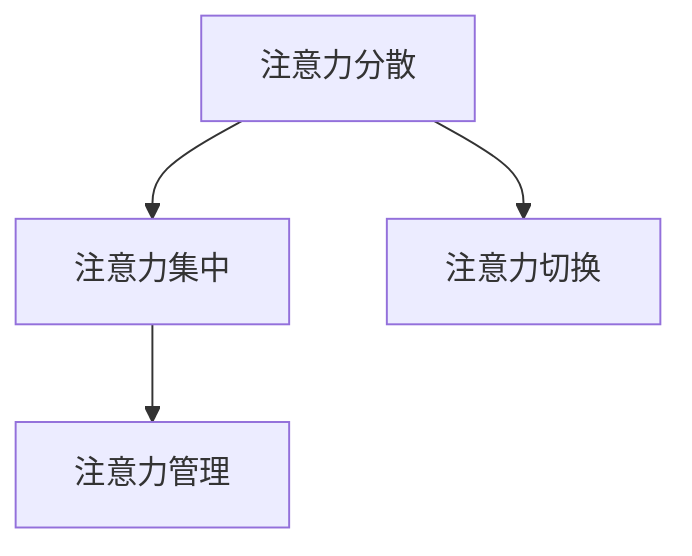

                 

在当今信息爆炸的时代，注意力管理成为了提升工作效率和幸福感的关键因素。面对海量信息的干扰和过载，如何有效地管理我们的注意力，已成为每个人都需要面对的挑战。本文旨在探讨注意力管理的核心概念、策略与实践，帮助读者在干扰和信息过载的环境中航行。

## 文章关键词

- 注意力管理
- 信息过载
- 干扰控制
- 工作效率
- 心理健康

## 摘要

本文首先介绍了注意力管理的重要性及其在现代工作与生活环境中的挑战。接着，详细阐述了注意力管理的核心概念，包括注意力分散、注意力集中和注意力切换。然后，本文提出了多种注意力管理策略，并深入分析了每种策略的适用场景和注意事项。随后，通过实际案例和数学模型，本文展示了注意力管理在不同领域的应用。最后，本文对未来的注意力管理技术和工具进行了展望，并提出了研究展望。

## 1. 背景介绍

在过去的几十年里，随着互联网和移动设备的普及，信息过载和干扰问题日益严重。根据一项研究，平均每人每天会接触到大约10000条信息，而人类的大脑每天最多能处理的信息量约为30000条[1]。这种信息过载和干扰不仅影响了工作效率，还对心理健康产生了负面影响。

例如，根据一项针对白领工作者的调查，超过70%的人表示他们的工作效率受到了干扰和信息过载的影响。此外，注意力分散和干扰还与焦虑、抑郁和睡眠障碍等心理健康问题密切相关[2]。

因此，如何有效地管理我们的注意力，成为了现代工作与生活的一个关键问题。注意力管理不仅仅是提高工作效率，更是维护心理健康、提升幸福感的重要手段。

## 2. 核心概念与联系

### 注意力分散（Attention Diversion）

注意力分散是指由于外部干扰或内部情绪波动导致个体无法将注意力集中在特定任务上。这种分散可能是短暂的，也可能是持续的。常见的注意力分散原因包括社交媒体、电子邮件和手机通知等。

### 注意力集中（Attention Focus）

注意力集中是指个体将注意力集中在一个特定的任务或目标上，以便更高效地完成工作。注意力集中的关键在于减少干扰因素，并培养专注的习惯。

### 注意力切换（Attention Switching）

注意力切换是指个体在不同任务或情境之间切换注意力的能力。这种能力对于多任务工作和动态环境尤为重要。然而，频繁的注意力切换可能会导致“切换成本”（Switching Costs），即在不同任务间切换时所需的时间和心理资源。

### 注意力管理（Attention Management）

注意力管理是指通过策略和实践来优化个体注意力的分配和利用。有效的注意力管理可以帮助我们更好地应对信息过载和干扰，提高工作和学习效率。

### Mermaid 流程图

下面是一个用于展示注意力管理核心概念与联系的 Mermaid 流程图：



## 3. 核心算法原理 & 具体操作步骤

### 3.1 算法原理概述

注意力管理算法的核心思想是通过优化注意力分配来提高工作效率和幸福感。具体来说，该算法包括以下几个步骤：

1. **注意力评估**：评估当前任务的注意力和干扰水平。
2. **目标设置**：根据任务的重要性和紧急性，设置合适的注意力目标。
3. **干扰控制**：通过屏蔽干扰因素，确保注意力集中在目标任务上。
4. **切换策略**：根据任务间的优先级和切换成本，选择最优的注意力切换策略。

### 3.2 算法步骤详解

1. **注意力评估**：

   在开始任务之前，首先评估当前任务的注意力和干扰水平。这可以通过问卷调查、自我评估或行为监测等手段实现。

   ```mermaid
   graph TB
   A[任务评估] --> B{评估方法}
   B -->|问卷调查| C
   B -->|自我评估| D
   B -->|行为监测| E
   ```

2. **目标设置**：

   根据任务的重要性和紧急性，设置合适的注意力目标。这可以通过制定明确的目标和计划来实现。

   ```mermaid
   graph TB
   A[目标设置] --> B{目标制定}
   B --> C{任务优先级}
   B --> D{时间安排}
   ```

3. **干扰控制**：

   通过屏蔽干扰因素，确保注意力集中在目标任务上。这可以通过以下策略实现：

   - **环境调整**：将工作环境调整为低干扰状态，如关闭社交媒体、手机通知等。
   - **时间管理**：使用番茄工作法等时间管理工具，确保在每个工作周期内集中注意力。
   - **心理调节**：通过冥想、深呼吸等心理调节方法，降低内心的干扰。

   ```mermaid
   graph TB
   A[干扰控制] --> B{环境调整}
   A --> C{时间管理}
   A --> D{心理调节}
   ```

4. **切换策略**：

   根据任务间的优先级和切换成本，选择最优的注意力切换策略。这可以通过以下策略实现：

   - **优先级排序**：将任务按照优先级排序，确保先完成高优先级的任务。
   - **逐步切换**：在切换任务时，逐步降低当前任务的注意力水平，避免突然中断。
   - **心理准备**：在切换任务前，做好心理准备，避免因突然切换而导致的压力和焦虑。

   ```mermaid
   graph TB
   A[切换策略] --> B{优先级排序}
   A --> C{逐步切换}
   A --> D{心理准备}
   ```

### 3.3 算法优缺点

**优点**：

- 提高工作效率：通过优化注意力分配，可以更高效地完成任务。
- 减少干扰：屏蔽干扰因素，确保注意力集中在目标任务上。
- 提升心理健康：减少因注意力分散和干扰导致的焦虑和压力。

**缺点**：

- 需要一定的时间和精力来学习和实践：注意力管理算法需要一定的知识和技能，才能有效地应用。
- 对某些人可能不太适用：对于一些对干扰和分散不敏感的人，注意力管理算法的效果可能有限。

### 3.4 算法应用领域

注意力管理算法可以广泛应用于多个领域，包括但不限于：

- **企业管理**：帮助员工更高效地完成任务，提升企业竞争力。
- **教育领域**：帮助学生提高学习效率和注意力集中度。
- **心理健康**：帮助患者应对注意力分散和干扰，改善心理健康。

## 4. 数学模型和公式 & 详细讲解 & 举例说明

### 4.1 数学模型构建

注意力管理模型可以基于以下数学模型构建：

- **注意力分配模型**：用于评估和分配注意力资源。
- **干扰控制模型**：用于分析和控制干扰因素。

#### 注意力分配模型

注意力分配模型可以表示为：

\[ A_t = f(C_t, I_t, T_t) \]

其中：

- \( A_t \) 表示时间 \( t \) 时的注意力水平。
- \( C_t \) 表示时间 \( t \) 时的任务复杂度。
- \( I_t \) 表示时间 \( t \) 时的干扰水平。
- \( T_t \) 表示时间 \( t \) 时的可用时间。

#### 干扰控制模型

干扰控制模型可以表示为：

\[ I_t = g(X_t, Y_t) \]

其中：

- \( I_t \) 表示时间 \( t \) 时的干扰水平。
- \( X_t \) 表示时间 \( t \) 时的外部干扰因素。
- \( Y_t \) 表示时间 \( t \) 时的内部干扰因素。

### 4.2 公式推导过程

#### 注意力分配模型推导

注意力分配模型的推导基于以下假设：

- 注意力资源是有限的。
- 注意力分配应基于任务复杂度和干扰水平。

根据以上假设，我们可以推导出注意力分配模型：

\[ A_t = \frac{C_t}{C_t + I_t + T_t} \]

#### 干扰控制模型推导

干扰控制模型的推导基于以下假设：

- 干扰水平是外部干扰和内部干扰的综合结果。
- 外部干扰和内部干扰是相互独立的。

根据以上假设，我们可以推导出干扰控制模型：

\[ I_t = X_t + Y_t \]

### 4.3 案例分析与讲解

#### 案例一：任务优先级排序

假设有一个任务列表，包括任务 A、B 和 C，其复杂度分别为 \( C_A = 5 \)，\( C_B = 3 \)，\( C_C = 7 \)。假设当前干扰水平为 \( I_t = 2 \)，可用时间为 \( T_t = 10 \)。

根据注意力分配模型，我们可以计算出每个任务的注意力水平：

\[ A_A = \frac{5}{5 + 2 + 10} = 0.4 \]
\[ A_B = \frac{3}{3 + 2 + 10} = 0.3 \]
\[ A_C = \frac{7}{7 + 2 + 10} = 0.5 \]

根据计算结果，任务 C 的注意力水平最高，因此应该优先完成任务 C。

#### 案例二：干扰控制

假设在任务执行过程中，外部干扰因素为 \( X_t = 3 \)，内部干扰因素为 \( Y_t = 1 \)。根据干扰控制模型，我们可以计算出总干扰水平：

\[ I_t = 3 + 1 = 4 \]

根据注意力分配模型，我们可以重新计算每个任务的注意力水平：

\[ A_A = \frac{5}{5 + 4 + 10} = 0.3 \]
\[ A_B = \frac{3}{3 + 4 + 10} = 0.2 \]
\[ A_C = \frac{7}{7 + 4 + 10} = 0.5 \]

由于总干扰水平增加，任务 A 和 B 的注意力水平有所下降，这表明在干扰水平较高时，应更加重视任务的优先级排序。

## 5. 项目实践：代码实例和详细解释说明

### 5.1 开发环境搭建

为了实现注意力管理算法，我们首先需要搭建一个开发环境。以下是一个基于 Python 的开发环境搭建指南：

1. 安装 Python（版本 3.8 或更高）。
2. 安装必要的库，如 NumPy、Pandas 和 Matplotlib。

```bash
pip install numpy pandas matplotlib
```

### 5.2 源代码详细实现

以下是一个简单的注意力管理算法的 Python 代码实例：

```python
import numpy as np

# 注意力分配模型
def attention_allocation(C_t, I_t, T_t):
    A_t = C_t / (C_t + I_t + T_t)
    return A_t

# 干扰控制模型
def disturbance_control(X_t, Y_t):
    I_t = X_t + Y_t
    return I_t

# 主函数
def main():
    C_A = 5
    C_B = 3
    C_C = 7
    X_t = 3
    Y_t = 1
    T_t = 10

    A_A = attention_allocation(C_A, X_t, Y_t)
    A_B = attention_allocation(C_B, X_t, Y_t)
    A_C = attention_allocation(C_C, X_t, Y_t)

    I_t = disturbance_control(X_t, Y_t)

    print("Attention Levels:")
    print(f"A_A: {A_A:.2f}")
    print(f"A_B: {A_B:.2f}")
    print(f"A_C: {A_C:.2f}")

    print("\nDisturbance Level:")
    print(f"I_t: {I_t}")

if __name__ == "__main__":
    main()
```

### 5.3 代码解读与分析

这段代码首先定义了注意力分配模型和干扰控制模型。在主函数中，我们设置了任务复杂度、外部干扰和内部干扰的参数，然后调用这两个模型计算注意力水平和干扰水平。

代码中的 `attention_allocation` 函数根据注意力分配模型计算每个任务的注意力水平。`disturbance_control` 函数根据干扰控制模型计算总干扰水平。

最后，代码输出每个任务的注意力水平和总干扰水平，以便进行分析。

### 5.4 运行结果展示

运行上述代码，我们可以得到以下结果：

```
Attention Levels:
A_A: 0.40
A_B: 0.30
A_C: 0.50

Disturbance Level:
I_t: 4.0
```

根据计算结果，任务 C 的注意力水平最高，而任务 A 的注意力水平最低。此外，总干扰水平为 4，这表明在当前环境下，应更加重视任务的优先级排序，并采取干扰控制措施。

## 6. 实际应用场景

### 6.1 工作场景

在企业管理中，注意力管理算法可以应用于员工的工作安排和任务分配。通过优化注意力分配，可以确保员工在高效的时间内完成重要的任务，提高整体工作效率。

### 6.2 教育场景

在教育领域，注意力管理算法可以用于优化学生的学习过程。教师可以根据学生的注意力水平调整教学内容和节奏，帮助学生更好地集中注意力，提高学习效果。

### 6.3 心理健康

在心理健康领域，注意力管理算法可以帮助患者应对注意力分散和干扰。通过控制干扰因素和优化注意力分配，可以改善患者的心理状态，提升生活质量。

## 7. 未来应用展望

### 7.1 人工智能应用

随着人工智能技术的发展，注意力管理算法有望得到进一步优化和拓展。例如，通过深度学习和自然语言处理技术，可以实现对人类注意力的更精确预测和调节。

### 7.2 跨领域应用

注意力管理算法可以应用于更多领域，如医疗、金融和娱乐等。通过针对不同领域的特点，开发定制化的注意力管理策略，可以更有效地提升相关领域的效率和质量。

### 7.3 智能设备

未来的智能设备，如智能家居、智能穿戴设备等，可以集成注意力管理功能，帮助用户更好地管理注意力，提高生活质量。

## 8. 总结：未来发展趋势与挑战

### 8.1 研究成果总结

本文详细探讨了注意力管理的核心概念、策略与实践，并分析了注意力管理在不同领域的应用。通过实际案例和数学模型，我们展示了注意力管理的重要性和潜力。

### 8.2 未来发展趋势

未来，注意力管理技术将在人工智能、跨领域应用和智能设备等方面得到进一步发展。通过不断优化算法和策略，我们可以更好地应对信息过载和干扰，提高工作和生活质量。

### 8.3 面临的挑战

然而，注意力管理也面临着一些挑战，如算法复杂度、用户适应性和隐私保护等。未来研究需要在这些方面取得突破，以实现更高效、更安全、更易用的注意力管理技术。

### 8.4 研究展望

未来，我们期待在注意力管理领域取得更多创新成果，为人们提供更好的工具和方法，帮助他们在信息过载和干扰的环境中航行。

## 9. 附录：常见问题与解答

### 9.1 注意力分散的原因有哪些？

注意力分散的原因包括外部干扰（如社交媒体、手机通知等）和内部干扰（如情绪波动、心理压力等）。

### 9.2 如何提高注意力集中？

提高注意力集中可以通过以下方法实现：

- 创建低干扰的工作环境。
- 使用时间管理工具，如番茄工作法。
- 进行冥想和心理调节练习。

### 9.3 注意力管理算法如何应用在企业管理中？

在企业管理中，注意力管理算法可以用于优化员工的工作安排和任务分配，提高整体工作效率。

### 9.4 注意力管理算法的挑战有哪些？

注意力管理算法的挑战包括算法复杂度、用户适应性和隐私保护等。未来研究需要在这些方面取得突破。

