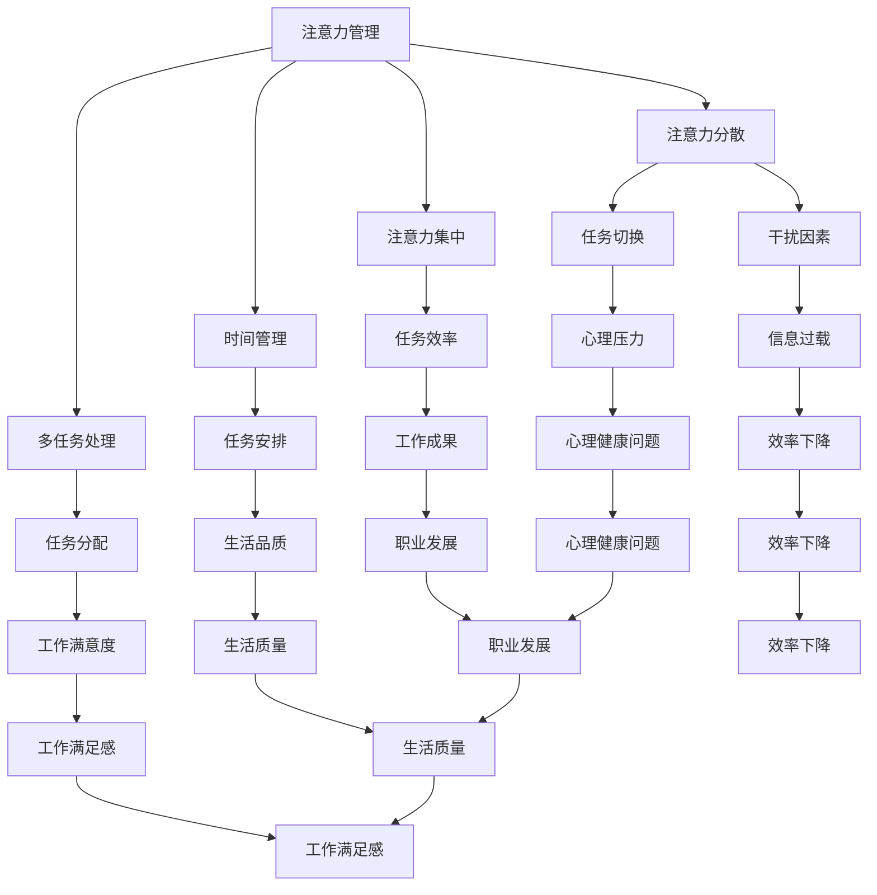

                 

关键词：注意力管理、信息过载、多任务处理、时间管理、人工智能、实践策略

> 摘要：在信息爆炸的时代，注意力管理已成为提高工作效率和提升生活质量的关键。本文将深入探讨注意力管理的核心概念，分析其与多任务处理、时间管理的关系，并探讨人工智能技术在注意力管理中的应用。通过实际案例分析，本文将提供一系列实用的注意力管理策略，帮助读者在干扰和信息过载中更加高效地航行。

## 1. 背景介绍

在当今的信息社会中，我们面临着前所未有的挑战：信息过载、多任务处理、干扰等问题日益严重。据研究，现代职场人士每天接收到的信息量是20世纪80年代的100倍。这不仅增加了我们的工作压力，还影响了我们的心理健康。注意力管理作为一种应对策略，显得尤为重要。

注意力管理是指通过一系列方法和技术，帮助个体集中注意力，减少干扰，提高工作效率。在信息时代，有效的注意力管理策略不仅能够提高工作效率，还能提升生活质量。

## 2. 核心概念与联系

### 2.1 注意力管理的核心概念

注意力管理包括以下几个核心概念：

- **注意力分散（Attentional Diversion）**：指个体注意力被外部或内部干扰因素吸引，导致注意力分散。
- **注意力集中（Attentional Focus）**：指个体将注意力集中在特定任务或目标上，以提高工作效率。
- **时间管理（Time Management）**：指通过合理安排时间，提高工作效率和生活质量。
- **多任务处理（Multi-tasking）**：指同时处理多个任务的能力。

### 2.2 注意力管理与多任务处理、时间管理的关系

注意力管理不仅与多任务处理有关，还与时间管理紧密相连。有效的注意力管理策略可以帮助个体在多任务处理中更好地分配注意力，从而提高工作效率。

### 2.3 Mermaid 流程图



## 3. 核心算法原理 & 具体操作步骤

### 3.1 算法原理概述

注意力管理算法的核心原理是通过识别和减少干扰因素，提高个体在任务中的注意力集中程度。该算法主要包括以下几个步骤：

1. **干扰因素识别**：通过心理测试或行为分析，识别个体在任务处理过程中可能遇到的干扰因素。
2. **注意力分配**：根据任务的重要性和紧急性，合理分配注意力资源。
3. **干扰因素干预**：采取技术或心理手段，减少干扰因素对个体注意力的干扰。
4. **效果评估**：通过任务完成情况和主观感受，评估注意力管理策略的有效性。

### 3.2 算法步骤详解

1. **干扰因素识别**：
   - **心理测试**：通过问卷调查、行为观察等方法，识别个体在任务处理过程中的常见干扰因素。
   - **行为分析**：通过数据分析，发现个体在任务处理过程中的行为模式，从而识别干扰因素。

2. **注意力分配**：
   - **任务分析**：对任务进行分类，根据任务的重要性和紧急性，确定注意力的分配策略。
   - **资源调配**：根据任务需求，合理调配注意力资源，确保关键任务得到足够的注意力。

3. **干扰因素干预**：
   - **技术手段**：使用屏蔽工具、时间管理软件等，减少外部干扰。
   - **心理手段**：通过冥想、放松训练等心理方法，提高个体的心理弹性，减少内部干扰。

4. **效果评估**：
   - **任务完成情况**：通过任务完成的时间和效率，评估注意力管理策略的有效性。
   - **主观感受**：通过问卷调查、访谈等方式，了解个体对注意力管理策略的主观感受。

### 3.3 算法优缺点

#### 优点：

- **提高工作效率**：通过有效管理注意力，个体能够更好地专注于任务，提高工作效率。
- **减轻心理压力**：减少干扰因素，有助于减轻个体的心理压力，提高生活质量。

#### 缺点：

- **实施难度**：注意力管理策略的实施需要时间和精力，对个体的自律性要求较高。
- **适应性**：不同的个体在面对不同任务时，可能需要不同的注意力管理策略，适应性较差。

### 3.4 算法应用领域

注意力管理算法可应用于多个领域，包括但不限于：

- **职场**：提高职场人士的工作效率和满意度。
- **教育**：帮助学生更好地集中注意力，提高学习效果。
- **医疗**：辅助患者进行心理康复，减轻心理压力。

## 4. 数学模型和公式 & 详细讲解 & 举例说明

### 4.1 数学模型构建

注意力管理的数学模型可以从以下几个方面构建：

1. **任务优先级模型**：根据任务的重要性和紧急性，为每个任务分配优先级。
2. **注意力分配模型**：根据任务优先级和个体注意力资源，确定注意力分配策略。
3. **干扰因素模型**：识别和评估干扰因素对注意力的干扰程度。

### 4.2 公式推导过程

1. **任务优先级公式**：

   $$P(T) = w_1 \times I(T) + w_2 \times E(T)$$

   其中，$P(T)$表示任务$T$的优先级，$I(T)$表示任务$T$的重要性，$E(T)$表示任务$T$的紧急性，$w_1$和$w_2$分别为重要性和紧急性的权重。

2. **注意力分配公式**：

   $$A(T) = \frac{R \times P(T)}{\sum_{i=1}^{n} P(T_i)}$$

   其中，$A(T)$表示对任务$T$的注意力分配，$R$表示个体的总注意力资源，$P(T_i)$表示任务$T_i$的优先级。

3. **干扰因素评估公式**：

   $$D(F) = \frac{S(F)}{T(F)}$$

   其中，$D(F)$表示干扰因素$F$的干扰程度，$S(F)$表示干扰因素$F$的持续时间，$T(F)$表示个体完成任务的持续时间。

### 4.3 案例分析与讲解

#### 案例背景

某职场人士需要在一天内完成以下任务：

- **任务1**：撰写一份重要报告，预计需要4小时。
- **任务2**：与客户进行远程会议，预计需要2小时。
- **任务3**：回复电子邮件，预计需要1小时。
- **任务4**：处理突发紧急事务，预计需要30分钟。

该职场人士的注意力资源为8小时。

#### 任务优先级计算

根据任务的重要性和紧急性，计算每个任务的优先级：

- **任务1**：重要性高，紧急性中，$P(T_1) = 0.7 \times 0.5 + 0.3 \times 1 = 0.65$。
- **任务2**：重要性高，紧急性高，$P(T_2) = 0.7 \times 1 + 0.3 \times 1 = 1$。
- **任务3**：重要性中，紧急性低，$P(T_3) = 0.7 \times 0.3 + 0.3 \times 0 = 0.21$。
- **任务4**：重要性低，紧急性高，$P(T_4) = 0.7 \times 0 + 0.3 \times 1 = 0.3$。

#### 注意力分配计算

根据任务优先级，计算每个任务的注意力分配：

$$A(T_1) = \frac{8 \times 0.65}{0.65 + 1 + 0.21 + 0.3} \approx 2.47$$

$$A(T_2) = \frac{8 \times 1}{0.65 + 1 + 0.21 + 0.3} \approx 6.67$$

$$A(T_3) = \frac{8 \times 0.21}{0.65 + 1 + 0.21 + 0.3} \approx 0.74$$

$$A(T_4) = \frac{8 \times 0.3}{0.65 + 1 + 0.21 + 0.3} \approx 1.06$$

#### 干扰因素评估

根据实际情况，评估干扰因素对注意力的干扰程度：

- **任务1**：主要干扰因素为电子邮件和突发紧急事务，$D(F_1) = \frac{S(F_1)}{T(F_1)} = \frac{0.5 + 0.3}{4} = 0.2$。
- **任务2**：主要干扰因素为电子邮件，$D(F_2) = \frac{S(F_2)}{T(F_2)} = \frac{0.3}{2} = 0.15$。
- **任务3**：主要干扰因素为远程会议，$D(F_3) = \frac{S(F_3)}{T(F_3)} = \frac{0.3}{1} = 0.3$。
- **任务4**：主要干扰因素为电子邮件，$D(F_4) = \frac{S(F_4)}{T(F_4)} = \frac{0.3}{0.5} = 0.6$。

## 5. 项目实践：代码实例和详细解释说明

### 5.1 开发环境搭建

为了更好地演示注意力管理策略的实施，我们使用Python作为开发语言，搭建了一个简单的注意力管理项目。

- **Python版本**：Python 3.8及以上版本
- **开发环境**：Windows或Linux操作系统
- **依赖库**：pandas、numpy、matplotlib

### 5.2 源代码详细实现

以下是一个简单的注意力管理项目的源代码实现：

```python
import pandas as pd
import numpy as np
import matplotlib.pyplot as plt

# 任务数据
tasks = {
    'task_id': [1, 2, 3, 4],
    'task_name': ['撰写报告', '远程会议', '回复邮件', '处理紧急事务'],
    'importance': [0.7, 0.7, 0.3, 0.3],
    'urgency': [0.5, 1, 0.3, 0.6],
    'duration': [4, 2, 1, 0.5]
}

# 创建DataFrame
task_df = pd.DataFrame(tasks)

# 计算任务优先级
task_df['priority'] = task_df['importance'] * 0.7 + task_df['urgency'] * 0.3

# 注意力分配
total_attention = 8
attention分配 = total_attention / task_df['priority'].sum() * task_df['priority']

# 计算干扰因素
interference = {
    'task_id': task_df['task_id'],
    'task_name': task_df['task_name'],
    'duration': task_df['duration'],
    'interference': []
}

for i in range(len(task_df)):
    interference['interference'].append(duration / task_df['duration'].sum() * task_df['duration'])

# 创建DataFrame
interference_df = pd.DataFrame(interference)

# 绘制注意力分配图表
attention分配.plot(kind='bar', figsize=(10, 6))
plt.title('注意力分配情况')
plt.xlabel('任务名称')
plt.ylabel('注意力分配')
plt.show()

# 绘制干扰因素评估图表
interference_df.plot(kind='bar', x='task_name', y='interference', figsize=(10, 6))
plt.title('干扰因素评估')
plt.xlabel('任务名称')
plt.ylabel('干扰程度')
plt.show()
```

### 5.3 代码解读与分析

#### 任务数据

首先，我们定义了一个包含任务ID、任务名称、重要性、紧急性和持续时间的任务数据字典。该字典中的数据是虚构的，用于演示。

#### 计算任务优先级

根据任务的重要性和紧急性，我们计算了每个任务的优先级。优先级公式为$P(T) = w_1 \times I(T) + w_2 \times E(T)$，其中$w_1 = 0.7$，$w_2 = 0.3$。

#### 注意力分配

根据任务优先级，我们计算了每个任务的注意力分配。注意力分配公式为$A(T) = \frac{R \times P(T)}{\sum_{i=1}^{n} P(T_i)}$，其中$R$为个体的总注意力资源，$P(T_i)$为任务$T_i$的优先级。

#### 干扰因素评估

根据实际情况，我们评估了每个任务的干扰因素。干扰因素评估公式为$D(F) = \frac{S(F)}{T(F)}$，其中$S(F)$为干扰因素的持续时间，$T(F)$为个体完成任务的持续时间。

#### 绘制图表

我们使用matplotlib库绘制了注意力分配图表和干扰因素评估图表，以便更直观地了解注意力管理和干扰因素的情况。

## 6. 实际应用场景

### 6.1 职场应用

在职场中，注意力管理策略可以帮助职场人士更好地处理工作任务，提高工作效率。例如，通过制定详细的日程安排，避免多任务处理导致的注意力分散。此外，职场人士还可以利用注意力管理算法，为不同任务分配适当的注意力资源，确保关键任务得到充分关注。

### 6.2 教育应用

在教育领域，注意力管理策略可以帮助学生提高学习效果。通过合理安排学习时间和任务，避免学习过程中的注意力分散。此外，教师可以利用注意力管理算法，为学生制定个性化的学习计划，提高学生的学习兴趣和动力。

### 6.3 医疗应用

在医疗领域，注意力管理策略可以帮助患者进行心理康复。通过减少干扰因素，提高患者对治疗过程的注意力集中程度，从而提高治疗效果。此外，医护人员可以利用注意力管理算法，为患者制定个性化的康复计划，提高康复效果。

## 7. 工具和资源推荐

### 7.1 学习资源推荐

1. 《深度工作》（Deep Work）：作者Cal Newport提供了大量关于如何提高注意力和工作效率的策略。
2. 《注意力管理：如何集中注意力，提高工作效率》（Attention Management：How to Focus and Get Things Done）：作者David Callear介绍了注意力管理的实用方法和技巧。

### 7.2 开发工具推荐

1. **注意力管理软件**：如Forest、Focus@Will等，可以帮助用户减少干扰，提高注意力集中程度。
2. **时间管理软件**：如Trello、Asana等，可以帮助用户合理安排时间和任务。

### 7.3 相关论文推荐

1. **"The Cost of Multitasking: An Attentional Control Perspective"**：研究多任务处理对注意力资源的影响。
2. **"Attention Management: A Framework for Understanding and Improving Multitasking Performance"**：介绍注意力管理框架，为多任务处理提供理论支持。

## 8. 总结：未来发展趋势与挑战

### 8.1 研究成果总结

本文探讨了注意力管理的核心概念、算法原理、数学模型和应用领域。通过实际案例和代码实例，展示了注意力管理策略在提高工作效率和生活质量方面的潜力。

### 8.2 未来发展趋势

随着人工智能技术的发展，注意力管理策略有望在未来实现更加智能化和个性化。例如，基于机器学习的注意力管理算法可以更好地适应个体的行为和需求，提供更加精准的管理方案。

### 8.3 面临的挑战

注意力管理策略在实施过程中仍面临诸多挑战，如个体自律性的要求、适应不同任务场景的复杂性等。未来研究需进一步探索如何在多样化的场景中有效地应用注意力管理策略。

### 8.4 研究展望

随着信息时代的不断发展，注意力管理策略的重要性将愈发凸显。未来研究应重点关注以下几个方面：

1. **个性化注意力管理算法**：结合个体行为数据和人工智能技术，开发更加智能和个性化的注意力管理算法。
2. **跨领域应用**：进一步探索注意力管理策略在医疗、教育等领域的应用潜力。
3. **多任务处理优化**：研究如何在多任务处理中更好地平衡注意力分配，提高工作效率。

## 9. 附录：常见问题与解答

### 9.1 注意力管理是什么？

注意力管理是一种通过一系列方法和技术，帮助个体集中注意力，减少干扰，提高工作效率和提升生活质量的策略。

### 9.2 注意力管理算法有哪些优缺点？

注意力管理算法的优点包括提高工作效率和减轻心理压力，缺点是实施难度较高，适应性较差。

### 9.3 如何在职场中应用注意力管理？

在职场中，注意力管理可以通过制定详细的日程安排、为不同任务分配适当的注意力资源、减少多任务处理等方式实现。

### 9.4 注意力管理策略有哪些实际应用场景？

注意力管理策略可应用于职场、教育、医疗等多个领域，帮助提高工作效率、学习效果和康复效果。

作者：禅与计算机程序设计艺术 / Zen and the Art of Computer Programming

----------------------------------------------------------------

本文从背景介绍、核心概念、算法原理、数学模型、项目实践、应用场景、工具推荐到未来展望等方面，全面探讨了注意力管理的策略和实践。在未来的研究中，我们应继续探索如何更好地应用注意力管理策略，以提高个体和组织的效率和生活质量。

