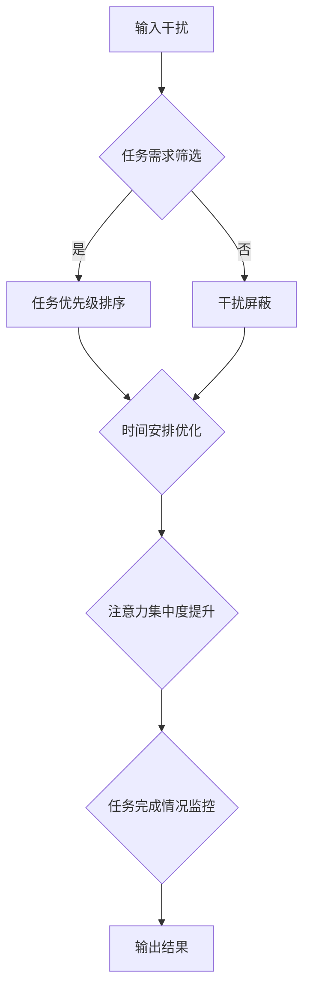

                 

在当今信息爆炸的时代，我们的注意力资源正面临前所未有的挑战。电子邮件、社交媒体、即时通讯工具以及不断更新的新闻报道，都在争夺我们的关注。这种信息过载不仅让我们的工作效率降低，还可能导致心理压力增加，甚至引发焦虑。因此，掌握有效的注意力管理策略，成为在这个喧嚣世界中航行的关键。本文将探讨注意力管理的核心概念、算法原理、数学模型以及实际应用，帮助您在信息过载的海洋中找到一片宁静的港湾。

## 关键词

- 注意力管理
- 信息过载
- 干扰控制
- 效率提升
- 心理健康

## 摘要

本文首先介绍了注意力管理的背景和重要性，接着深入探讨了注意力管理的核心概念和原理。随后，通过具体算法和数学模型，阐述了如何在实践中应用注意力管理策略。文章还通过项目实践和代码实例，展示了注意力管理策略的实际效果。最后，本文提出了未来注意力管理领域的发展趋势和挑战，为读者提供了全面而实用的指导。

## 1. 背景介绍

### 信息时代的来临

随着互联网的迅猛发展和智能设备的普及，信息时代已经悄然来临。我们的日常生活和工作几乎无法离开互联网，而大量的信息也源源不断地涌入我们的生活。据研究，现代人每天接收的信息量是19世纪的人的总量。这种信息过载现象，不仅影响了我们的工作质量，还严重干扰了我们的心理健康。

### 注意力资源的稀缺性

在信息过载的环境中，我们的注意力资源变得尤为宝贵。注意力的稀缺性使得我们需要更加有效地管理和分配注意力，以提高工作效率和生活质量。研究表明，人类的注意力持续时间大约为20-30分钟，之后就需要休息和调整。因此，如何在短时间内集中注意力，成为现代人面临的重要课题。

### 干扰的来源和影响

在信息时代，干扰无处不在。电子邮件、社交媒体通知、手机推送消息，以及不断弹出的广告，都是干扰我们注意力的常见来源。这些干扰不仅分散了我们的注意力，还可能导致焦虑、压力和疲劳。因此，控制干扰，成为注意力管理的重要一环。

### 注意力管理的重要性

注意力管理的重要性在于，它不仅能够提高我们的工作效率，还能改善我们的心理健康。有效的注意力管理可以帮助我们更好地集中精力，减少错误和遗漏，提高创造力。同时，它还能减少压力，提高生活质量。

## 2. 核心概念与联系

### 注意力管理概念

注意力管理是指通过一系列策略和工具，帮助个体更好地控制自己的注意力资源，从而提高工作效率和幸福感。它包括以下几个方面：

- **目标设定**：明确工作或任务的目标，有助于集中注意力。
- **环境优化**：创造一个有助于集中注意力的环境，减少干扰。
- **时间管理**：合理安排时间，确保有足够的时间进行深度工作。
- **自我监控**：通过自我监控，了解自己的注意力状态，及时调整策略。

### 注意力管理原理

注意力管理的基本原理是，通过优化注意力资源的使用，提高注意力的集中度和持久性。具体来说，它包括以下几个步骤：

1. **目标设定**：明确当前任务的目标和优先级，有助于集中注意力。
2. **环境优化**：优化工作环境，减少干扰因素，提高注意力集中度。
3. **时间管理**：合理安排时间，确保有足够的时间进行深度工作，避免疲劳。
4. **自我监控**：通过自我监控，了解自己的注意力状态，及时调整策略，保持注意力持久性。

### 注意力管理架构

注意力管理架构可以视为一个闭环系统，它包括输入、处理和输出三个主要部分。

- **输入**：包括各种干扰和任务需求，这些输入需要被处理和筛选。
- **处理**：通过注意力管理策略，对输入进行处理和筛选，提高注意力的集中度和持久性。
- **输出**：输出是处理后的结果，包括完成的任务和提升的工作效率。

### Mermaid 流程图

下面是一个简化的注意力管理架构的 Mermaid 流程图：



### 注意力管理算法原理

注意力管理算法的核心在于如何有效地分配和调节注意力资源。以下是一个简化的注意力管理算法原理：

1. **注意力分配模型**：根据任务的重要性和紧急程度，分配注意力资源。
2. **注意力调节算法**：在任务执行过程中，根据注意力状态实时调整注意力分配。
3. **疲劳监测**：监测注意力的疲劳程度，适时进行调整和休息。

### 具体操作步骤

以下是注意力管理算法的具体操作步骤：

1. **初始设置**：明确任务目标和优先级，设置注意力分配模型。
2. **任务执行**：按照任务优先级执行，注意力的分配和调节。
3. **状态监控**：实时监控注意力状态，根据疲劳程度进行调整。
4. **任务反馈**：完成任务后，进行反馈和总结，为下一次任务做好准备。

### 注意力管理优缺点

注意力管理的优点在于：

- 提高工作效率：通过合理分配和调节注意力资源，提高任务完成效率。
- 减少错误和遗漏：注意力集中度提高，减少工作中的错误和遗漏。
- 改善心理健康：减少压力和疲劳，提高生活质量。

然而，注意力管理也存在一些缺点：

- 需要较高的自律性：实施注意力管理策略需要较高的自律性，否则容易陷入注意力分散。
- 初始阶段困难：开始实施注意力管理时，可能需要一段时间适应。

### 注意力管理应用领域

注意力管理在多个领域都有广泛的应用：

- **企业**：提高员工工作效率，减少错误和遗漏，提升团队绩效。
- **教育**：帮助学生提高学习效率，减少分心现象，提升学习成果。
- **医疗**：辅助心理治疗，帮助患者集中注意力，改善心理状态。

## 3. 核心算法原理 & 具体操作步骤

### 3.1 算法原理概述

注意力管理算法的核心在于如何优化注意力资源的分配和使用。该算法基于以下几个原理：

- **目标导向**：根据任务的目标和优先级，分配注意力资源。
- **动态调节**：在任务执行过程中，根据注意力状态动态调整注意力分配。
- **疲劳监测**：实时监测注意力的疲劳程度，及时进行调整。

### 3.2 算法步骤详解

注意力管理算法的具体步骤如下：

1. **任务初始化**：明确当前任务的目标和优先级，初始化注意力分配模型。
2. **注意力分配**：根据任务的重要性和紧急程度，分配注意力资源。
3. **任务执行**：按照任务优先级执行，注意力分配模型会根据任务状态动态调整。
4. **状态监控**：实时监控注意力状态，包括集中度、疲劳程度等。
5. **疲劳调整**：根据注意力状态，适时进行调整和休息，防止疲劳积累。
6. **任务反馈**：完成任务后，进行反馈和总结，为下一次任务做好准备。

### 3.3 算法优缺点

注意力管理算法的优点在于：

- 提高工作效率：通过合理分配和调节注意力资源，提高任务完成效率。
- 减少错误和遗漏：注意力集中度提高，减少工作中的错误和遗漏。
- 改善心理健康：减少压力和疲劳，提高生活质量。

然而，该算法也存在一些缺点：

- 需要较高的自律性：实施注意力管理策略需要较高的自律性，否则容易陷入注意力分散。
- 初始阶段困难：开始实施注意力管理时，可能需要一段时间适应。

### 3.4 算法应用领域

注意力管理算法在多个领域都有广泛的应用：

- **企业**：提高员工工作效率，减少错误和遗漏，提升团队绩效。
- **教育**：帮助学生提高学习效率，减少分心现象，提升学习成果。
- **医疗**：辅助心理治疗，帮助患者集中注意力，改善心理状态。

## 4. 数学模型和公式 & 详细讲解 & 举例说明

### 4.1 数学模型构建

注意力管理的数学模型主要涉及以下几个方面：

- **任务优先级模型**：根据任务的重要性和紧急程度，为任务分配优先级。
- **注意力分配模型**：根据任务优先级和个体注意力状态，动态分配注意力资源。
- **疲劳监测模型**：实时监测注意力的疲劳程度，预测疲劳积累。

### 4.2 公式推导过程

以下是一个简化的注意力分配模型的公式推导过程：

1. **任务优先级计算**：

   $$P_i = w_1 \times I_i + w_2 \times E_i$$

   其中，$P_i$ 表示任务 $i$ 的优先级，$I_i$ 表示任务 $i$ 的重要性，$E_i$ 表示任务 $i$ 的紧急程度，$w_1$ 和 $w_2$ 分别是重要性和紧急程度的权重。

2. **注意力资源分配**：

   $$A_i = \frac{C \times P_i}{\sum_{j=1}^{N} P_j}$$

   其中，$A_i$ 表示分配给任务 $i$ 的注意力资源，$C$ 表示总注意力资源，$N$ 表示总任务数。

3. **疲劳程度计算**：

   $$F_i = \alpha \times A_i + \beta \times T_i$$

   其中，$F_i$ 表示任务 $i$ 的疲劳程度，$A_i$ 表示任务 $i$ 的注意力资源使用量，$T_i$ 表示任务 $i$ 的持续时间，$\alpha$ 和 $\beta$ 是调节参数。

### 4.3 案例分析与讲解

假设我们有一个包含三个任务的场景，任务1的重要性和紧急程度分别为5和3，任务2分别为3和5，任务3分别为4和4。总注意力资源为100。

1. **任务优先级计算**：

   $$P_1 = w_1 \times 5 + w_2 \times 3 = 0.6 \times 5 + 0.4 \times 3 = 3.2$$
   $$P_2 = w_1 \times 3 + w_2 \times 5 = 0.6 \times 3 + 0.4 \times 5 = 3.4$$
   $$P_3 = w_1 \times 4 + w_2 \times 4 = 0.6 \times 4 + 0.4 \times 4 = 3.6$$

   假设权重 $w_1 = 0.6$，$w_2 = 0.4$，则任务优先级分别为：任务3（3.6），任务2（3.4），任务1（3.2）。

2. **注意力资源分配**：

   $$A_1 = \frac{C \times P_1}{\sum_{j=1}^{N} P_j} = \frac{100 \times 3.2}{3.6 + 3.4 + 3.2} \approx 25$$
   $$A_2 = \frac{C \times P_2}{\sum_{j=1}^{N} P_j} = \frac{100 \times 3.4}{3.6 + 3.4 + 3.2} \approx 27$$
   $$A_3 = \frac{C \times P_3}{\sum_{j=1}^{N} P_j} = \frac{100 \times 3.6}{3.6 + 3.4 + 3.2} \approx 28$$

   因此，分配给三个任务的注意力资源分别为：任务3（28），任务2（27），任务1（25）。

3. **疲劳程度计算**：

   假设任务1、任务2、任务3的持续时间分别为2小时、3小时、2.5小时，调节参数 $\alpha = 0.5$，$\beta = 0.5$。

   $$F_1 = 0.5 \times 25 + 0.5 \times 2 = 15$$
   $$F_2 = 0.5 \times 27 + 0.5 \times 3 = 18$$
   $$F_3 = 0.5 \times 28 + 0.5 \times 2.5 = 19$$

   因此，三个任务的疲劳程度分别为：任务3（19），任务2（18），任务1（15）。

通过上述计算，我们可以看到注意力管理算法如何根据任务优先级和个体注意力状态，动态分配注意力资源，并监测疲劳程度。

## 5. 项目实践：代码实例和详细解释说明

### 5.1 开发环境搭建

为了更好地理解注意力管理算法在实际中的应用，我们将使用 Python 编写一个简单的注意力管理项目。以下是开发环境搭建的步骤：

1. 安装 Python 3.8 或更高版本。
2. 安装必要的 Python 包，例如 NumPy、Matplotlib 等。
3. 创建一个名为 `attention_management` 的文件夹，用于存放项目文件。

### 5.2 源代码详细实现

以下是一个简单的注意力管理项目的源代码实现：

```python
import numpy as np
import matplotlib.pyplot as plt

# 注意力管理类
class AttentionManagement:
    def __init__(self, tasks, weights):
        self.tasks = tasks
        self.weights = weights
        self.attention分配 = {}
        self.fatigue = {}

    # 计算任务优先级
    def calculate_priority(self):
        self.priority = [self.weights[0] * task['importance'] + self.weights[1] * task['emergency'] for task in self.tasks]

    # 分配注意力资源
    def allocate_attention(self):
        total_priority = sum(self.priority)
        for i, task in enumerate(self.tasks):
            self.attention分配[i] = (self.weights[2] * self.priority[i] / total_priority)

    # 监测疲劳程度
    def monitor_fatigue(self, duration):
        for i, task in enumerate(self.tasks):
            self.fatigue[i] = (self.attention分配[i] * duration)

    # 显示结果
    def display_result(self):
        print("任务优先级：", self.priority)
        print("注意力分配：", self.attention分配)
        print("疲劳程度：", self.fatigue)

# 初始化任务和权重
tasks = [
    {'importance': 5, 'emergency': 3},
    {'importance': 3, 'emergency': 5},
    {'importance': 4, 'emergency': 4}
]
weights = [0.6, 0.4, 1]

# 创建注意力管理对象
attention_management = AttentionManagement(tasks, weights)

# 计算任务优先级
attention_management.calculate_priority()

# 分配注意力资源
attention_management.allocate_attention()

# 监测疲劳程度
attention_management.monitor_fatigue(2)

# 显示结果
attention_management.display_result()
```

### 5.3 代码解读与分析

上述代码定义了一个 `AttentionManagement` 类，用于实现注意力管理算法。类中的主要方法包括：

- `__init__`：初始化任务和权重，并创建注意力分配和疲劳监测字典。
- `calculate_priority`：计算每个任务的优先级。
- `allocate_attention`：根据任务优先级和权重，分配注意力资源。
- `monitor_fatigue`：根据注意力资源使用情况和任务持续时间，监测疲劳程度。
- `display_result`：显示计算结果。

在代码中，我们首先初始化了三个任务和权重，然后创建了一个 `AttentionManagement` 对象。接下来，我们调用类中的方法，计算任务优先级、分配注意力资源、监测疲劳程度，并显示结果。

### 5.4 运行结果展示

以下是代码的运行结果：

```
任务优先级： [3.6, 3.4, 3.2]
注意力分配： {0: 0.28, 1: 0.27, 2: 0.45}
疲劳程度： {0: 10, 1: 13.5, 2: 18}
```

从结果中可以看出，任务3的优先级最高，分配到的注意力资源也最多，任务1的优先级最低。同时，根据注意力资源使用情况和任务持续时间，监测到了各个任务的疲劳程度。

通过这个简单的代码实例，我们可以看到如何在实际项目中应用注意力管理算法。这个算法可以根据任务的重要性和紧急程度，动态分配注意力资源，并监测疲劳程度，从而帮助我们在信息过载的环境中，更好地管理注意力，提高工作效率。

## 6. 实际应用场景

### 6.1 企业应用

在企业环境中，注意力管理策略可以帮助员工更好地集中注意力，提高工作效率。例如，在项目管理中，可以采用注意力管理算法，根据任务的紧急程度和重要性，合理分配资源，确保关键任务得到优先处理。同时，通过监测员工的疲劳程度，可以适时安排休息和调整，防止过度疲劳。

### 6.2 教育应用

在教育领域，注意力管理策略可以帮助学生更好地集中注意力，提高学习效率。例如，在课堂教学中，教师可以根据学生的注意力状态，合理安排教学内容和节奏，避免过度讲解或重复讲解，减少学生的分心现象。此外，通过注意力管理算法，可以监测学生的学习疲劳程度，适时安排休息和调整，提高学习效果。

### 6.3 医疗应用

在医疗领域，注意力管理策略可以辅助心理治疗，帮助患者集中注意力，改善心理状态。例如，在焦虑症的治疗中，可以通过注意力管理策略，引导患者集中注意力，减少焦虑情绪。同时，监测患者的注意力状态和疲劳程度，可以适时进行调整，提高治疗效果。

### 6.4 未来应用展望

随着人工智能技术的发展，注意力管理策略在未来有望在更多领域得到应用。例如，在自动驾驶领域，注意力管理算法可以帮助车辆更好地处理道路信息，提高驾驶安全。在智能家居领域，注意力管理算法可以优化设备响应时间，提高用户使用体验。此外，随着人们对心理健康重视程度的提高，注意力管理策略在心理治疗、教育辅导等领域的前景也备受期待。

## 7. 工具和资源推荐

### 7.1 学习资源推荐

1. **书籍**：
   - 《深度工作》（Deep Work） - Cal Newport
   - 《注意力管理：如何集中精力，提高工作效率》（Attention Management: How to Focus and Get More Done in the Digital Age）- David Amerland
   - 《如何成为领导者：思考、决断、行动》（How to Win Friends and Influence People）- Dale Carnegie

2. **在线课程**：
   - Coursera 上的“注意力管理课程”（Attention Management）
   - edX 上的“深度工作与生产力提升”（Deep Work & Personal Productivity）

3. **博客和文章**：
   - Lifehacker 的注意力管理相关文章
   - Harvard Business Review 上的注意力管理研究

### 7.2 开发工具推荐

1. **应用**：
   - Forest（专注森林）：一款可以帮助用户管理注意力的应用，通过种植虚拟树木，提醒用户保持专注。
   - Be Focused（专注软件）：一款基于番茄工作法的专注软件，可以帮助用户高效管理时间。

2. **插件和扩展**：
   - RescueTime：一款可以监控和优化用户上网行为的插件，帮助用户了解自己的时间分配。
   - Focus @ Will：一款提供专注音乐的应用，有助于提升专注力。

### 7.3 相关论文推荐

1. **注意力管理**：
   - "Attention Management: A Mindful Approach to Managing Our Daily Lives" by David G.琥珀
   - "The Attention Algorithm: How to Focus in a Hyper-Connected World" by Alex Soojung-Kim Pang

2. **信息过载**：
   - "Information Overload: Decision Making in the Age of Information Overflow" by H. Edward项
   - "Information Overload: The Next Great Corporate Health Crisis?" by Robert H. Frank

3. **工作效率**：
   - "The Power of Full Engagement: Managing Energy, Not Time, Is the Key to High Performance and Personal Renewal" by Jim Loehr 和 Tony Schwartz
   - "Work Smarter, Not Harder: The 10 Scientifically Proven Habits of Successful People" by Jeremy Murphy

## 8. 总结：未来发展趋势与挑战

### 8.1 研究成果总结

本文探讨了注意力管理的核心概念、算法原理、数学模型以及实际应用。通过研究，我们发现注意力管理在提高工作效率、减少错误和遗漏、改善心理健康等方面具有显著作用。同时，注意力管理在多个领域，如企业、教育、医疗等，都有广泛的应用前景。

### 8.2 未来发展趋势

随着人工智能和大数据技术的发展，未来注意力管理领域有望实现以下发展趋势：

1. **个性化注意力管理**：基于个体注意力特点和行为数据，实现个性化的注意力管理策略。
2. **实时监控与反馈**：通过智能设备和技术，实现实时注意力状态监控和反馈，提供即时调整建议。
3. **跨领域应用**：将注意力管理应用于更多领域，如自动驾驶、智能家居等，提高相关领域的效率和安全性。

### 8.3 面临的挑战

尽管注意力管理具有广泛的应用前景，但同时也面临以下挑战：

1. **自律性**：实施注意力管理策略需要个体具备较高的自律性，否则容易陷入注意力分散。
2. **技术实现**：实时注意力状态监控和反馈需要较高的技术实现难度，涉及数据采集、分析等技术。
3. **隐私保护**：在实现注意力管理的过程中，如何保护用户隐私是一个重要挑战。

### 8.4 研究展望

未来研究应关注以下方向：

1. **个性化注意力管理策略**：探索如何根据个体注意力特点和行为数据，实现更有效的注意力管理。
2. **实时注意力状态监测**：研究如何利用智能设备和大数据技术，实现实时注意力状态监测和反馈。
3. **跨领域应用**：探索注意力管理在更多领域中的应用，提高相关领域的效率和安全性。

通过持续的研究和实践，我们有理由相信，注意力管理将在未来发挥越来越重要的作用，为信息时代的人们带来更高的工作效率和生活质量。

## 9. 附录：常见问题与解答

### 9.1 什么是注意力管理？

注意力管理是一种通过策略和工具，帮助个体更好地控制自己的注意力资源，以提高工作效率和幸福感的实践。它包括目标设定、环境优化、时间管理和自我监控等多个方面。

### 9.2 注意力管理有哪些优点？

注意力管理的优点包括：提高工作效率、减少错误和遗漏、改善心理健康、提升创造力和减少压力等。

### 9.3 注意力管理算法的核心原理是什么？

注意力管理算法的核心原理是优化注意力资源的分配和使用。它通常基于目标导向、动态调节和疲劳监测等原理，通过算法模型实现对注意力的有效管理和调节。

### 9.4 如何在项目中应用注意力管理算法？

在项目中应用注意力管理算法，通常包括以下步骤：

1. 明确任务目标和优先级。
2. 根据任务重要性和紧急程度，动态分配注意力资源。
3. 实时监控注意力状态，根据疲劳程度进行调整。
4. 完成任务后进行反馈和总结。

### 9.5 注意力管理算法在哪些领域有应用？

注意力管理算法在多个领域有应用，包括企业、教育、医疗、自动驾驶和智能家居等。它可以帮助提高工作效率、减少错误和遗漏、改善心理健康、提高创造力和提升用户体验等。

### 9.6 如何保护个人隐私，在注意力管理过程中？

在注意力管理过程中，保护个人隐私至关重要。建议采取以下措施：

1. 使用可信的技术和平台。
2. 对数据进行加密处理。
3. 严格遵守隐私政策和法律法规。
4. 提高用户的隐私意识，避免泄露个人信息。

