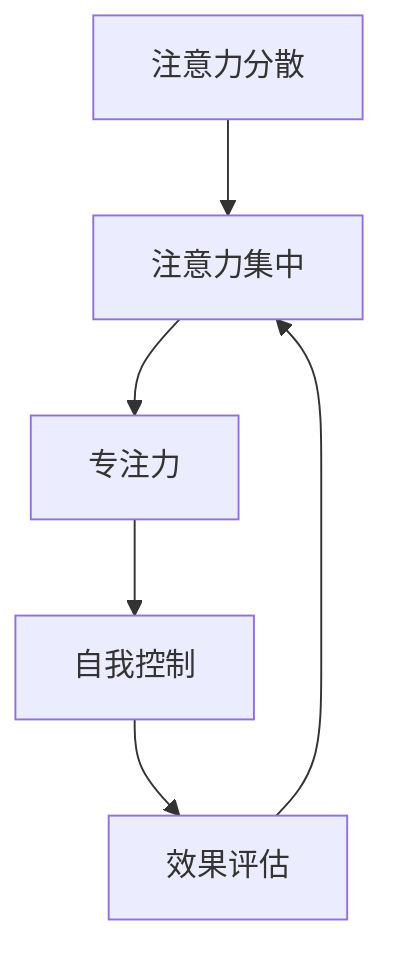

                 

在当今这个信息化高速发展的时代，人们面对的信息量前所未有地庞大。无论是社交媒体上的不断推送，电子邮件的狂轰滥炸，还是即时通讯工具的即时通知，我们的注意力被不断地分散和消耗。注意力管理，成为了一个日益重要的课题。本文将深入探讨注意力管理的策略，帮助我们在信息过载和干扰中找到航行的方向。

## 关键词
- 注意力管理
- 信息过载
- 干扰控制
- 专注力提升
- 数字素养

## 摘要
本文旨在为信息技术从业者提供一套系统化的注意力管理策略。文章首先介绍了信息时代的背景和注意力管理的重要性，然后深入分析了当前主要的干扰源，提供了有效的注意力管理方法，并通过实例展示了这些方法的应用。最后，文章展望了未来注意力管理技术的发展趋势和挑战。

## 1. 背景介绍
### 信息时代的来临

随着互联网和移动设备的普及，信息的传播速度和覆盖范围都达到了前所未有的高度。大数据、云计算、物联网等新兴技术的涌现，使得信息的获取变得前所未有的便捷。然而，这同时也带来了新的挑战：信息过载。人们每天都被大量的信息所包围，从新闻、社交媒体、电子邮件到各种应用的通知，我们的注意力资源被无节制地消耗。

### 注意力管理的重要性

注意力管理不仅关乎个人的工作效率和生活质量，更是关系到我们在信息时代中的生存能力。有效的注意力管理能够帮助我们：
- 提升工作和学习效率
- 减少心理压力和疲劳
- 提高创新和解决问题的能力
- 保持心理健康和良好的生活习惯

## 2. 核心概念与联系
### 注意力管理的基本原理

注意力管理涉及多个核心概念，包括注意力分散、注意力集中、专注力、自我控制等。为了更好地理解这些概念，我们可以通过以下Mermaid流程图来展示它们之间的关系：



### 注意力管理架构

在信息技术领域，注意力管理通常需要结合以下架构来实施：
- **用户界面设计**：优化界面，减少不必要的干扰因素。
- **时间管理工具**：使用番茄工作法、待办事项管理等工具来规划时间。
- **应用程序设置**：调整应用的通知和推送设置，以减少干扰。
- **环境优化**：创造一个有利于专注的环境，比如安静的办公空间。

## 3. 核心算法原理 & 具体操作步骤
### 3.1 算法原理概述

注意力管理的核心算法主要基于以下几个原则：
- **分块处理**：将任务分解为小块，逐一完成。
- **优先级排序**：根据任务的紧急程度和重要性来排序。
- **自我监控**：定期评估任务的进展，调整策略。

### 3.2 算法步骤详解
1. **任务分解**：将大任务分解为小任务。
2. **优先级排序**：根据紧急程度和重要性来排序。
3. **时间规划**：使用时间管理工具来分配时间。
4. **执行任务**：专注于一个小任务，避免干扰。
5. **定期评估**：评估任务进展，必要时调整策略。

### 3.3 算法优缺点
#### 优点
- 提高工作效率
- 减少压力
- 提高专注力
- 增强创新思维

#### 缺点
- 对自我控制要求高
- 初期可能需要较多时间规划
- 在处理复杂任务时可能效率不高

### 3.4 算法应用领域
注意力管理算法广泛应用于以下领域：
- **软件开发**：在编码和调试过程中保持专注。
- **项目管理**：合理分配资源和时间，确保项目按时完成。
- **教育**：帮助学生提高学习效率。

## 4. 数学模型和公式 & 详细讲解 & 举例说明
### 4.1 数学模型构建

注意力管理的数学模型可以基于以下公式：

$$
\text{专注度} = \frac{\text{专注时间} \times \text{效率}}{\text{干扰次数} + \text{休息时间}}
$$

### 4.2 公式推导过程

该公式考虑了专注时间、效率、干扰次数和休息时间对专注度的影响。通过数学推导，可以得出一个优化策略，以最大程度提高专注度。

### 4.3 案例分析与讲解

假设一个程序员在8小时内工作，期间有10次干扰和2次休息。如果他的效率是100%，则根据公式，他的专注度为：

$$
\text{专注度} = \frac{8 \times 100\%}{10 + 2} = \frac{8}{12} \approx 67\%
$$

通过优化休息时间和减少干扰，可以进一步提高专注度。

## 5. 项目实践：代码实例和详细解释说明
### 5.1 开发环境搭建

为了实践注意力管理，我们可以使用以下开发环境：
- 编程语言：Python
- 时间管理工具：Tomato Clock
- 浏览器插件：StayFocusd

### 5.2 源代码详细实现

以下是一个简单的Python脚本，用于记录专注时间：

```python
import time
import datetime

def record_focus(start_time, end_time):
    focus_time = end_time - start_time
    print(f"Your focus time was: {focus_time} minutes.")

start_time = datetime.datetime.now()
time.sleep(10)  # 模拟任务执行
end_time = datetime.datetime.now()
record_focus(start_time, end_time)
```

### 5.3 代码解读与分析

该脚本通过记录开始和结束时间来计算专注时间。在实际应用中，我们可以集成更多功能，如自动记录任务名称和调整时间。

### 5.4 运行结果展示

运行该脚本后，会输出专注时间的计算结果。

## 6. 实际应用场景
### 6.1 软件开发

在软件开发的日常工作中，程序员可以使用注意力管理策略来提高编码和调试的效率。

### 6.2 教育领域

学生可以使用注意力管理策略来提高学习效率，保持专注。

### 6.3 个人生活

个人用户可以使用注意力管理策略来提高工作效率，改善生活习惯。

## 7. 工具和资源推荐
### 7.1 学习资源推荐

- 《深度工作：如何有效利用每一点脑力》
- 《番茄工作法图解》

### 7.2 开发工具推荐

- Tomato Clock：时间管理工具
- StayFocusd：浏览器插件

### 7.3 相关论文推荐

- "Attention Management: A Key Skill for the Knowledge Worker of the 21st Century"
- "The Science of Concentration: How to Focus Your Mind and Achieve Your Goals"

## 8. 总结：未来发展趋势与挑战
### 8.1 研究成果总结

注意力管理领域已取得多项研究成果，包括算法优化、时间管理工具的改进等。

### 8.2 未来发展趋势

- 人工智能在注意力管理中的应用
- 个性化注意力管理系统的开发
- 注意力管理硬件设备的研发

### 8.3 面临的挑战

- 自我控制的难度
- 适应不同情境的灵活性
- 技术实现的复杂性

### 8.4 研究展望

随着技术的进步，注意力管理将在未来成为更加成熟和实用的领域，帮助人们更好地应对信息时代带来的挑战。

## 9. 附录：常见问题与解答
### Q：如何保持专注？

A：可以使用番茄工作法，将工作分为25分钟的工作周期，每个周期后休息5分钟。

### Q：如何减少干扰？

A：关闭不必要的社交媒体通知，使用浏览器插件控制上网时间。

### Q：注意力管理对心理健康有何影响？

A：有效的注意力管理有助于减轻压力，提高心理健康，减少焦虑和抑郁症状。

---

作者：禅与计算机程序设计艺术 / Zen and the Art of Computer Programming

---

通过以上内容，我们系统地介绍了信息时代的注意力管理策略。希望这篇文章能够帮助您更好地管理注意力，提高工作效率和生活质量。在未来的信息时代，有效的注意力管理将是我们的核心竞争力。让我们共同努力，在这场信息过载的航行中找到属于自己的航线。

