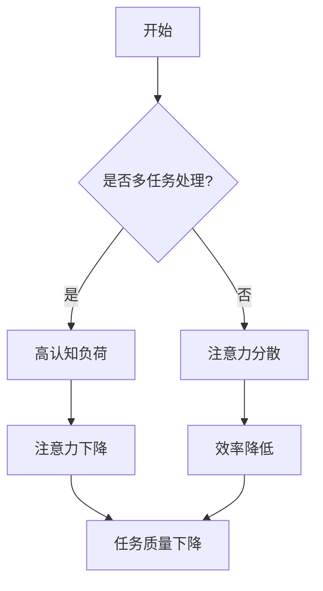

                 

 在当今这个快节奏、高度互联的信息时代，注意力管理成为了人们日常工作和生活中的一个关键能力。各种数字设备、社交媒体平台和无数的信息流不断争夺我们的注意力，导致许多人陷入分心和压力之中。本文旨在探讨注意力管理的策略，帮助读者在干扰和分心中保持头脑清晰和专注。

> 关键词：注意力管理、分心、专注、工作效能、时间管理

> 摘要：本文首先介绍了注意力管理的背景和重要性，随后探讨了几个核心概念和相关的理论，包括多任务处理、认知负荷和注意力分散。接着，本文提出了一些实用的注意力管理策略，并通过实际案例进行了详细解释。最后，本文对注意力管理的未来发展趋势和挑战进行了展望，并推荐了一些相关的学习资源和开发工具。

## 1. 背景介绍

注意力管理是一种提高工作效率和生活质量的重要方法。随着科技的发展，信息过载成为了普遍现象。人们常常需要处理来自多个来源的信息，这要求他们在同一时间内关注多个任务。然而，研究表明，人类大脑并不能有效地同时处理多个任务，这种多任务处理往往会降低工作效率，增加错误率。

此外，社交媒体和电子邮件等工具的广泛应用也加剧了分心问题。研究表明，频繁的分心会消耗大量的认知资源，导致工作记忆的容量和注意力稳定性下降。因此，有效地管理注意力成为了提高工作和学习效率的关键。

### 1.1 注意力管理的定义

注意力管理指的是一系列的策略和技术，帮助个体在面对各种干扰时保持专注和目标导向。它不仅仅是一种技能，更是一种思维方式，涉及到自我意识、自我调节和自我监控等多个层面。

### 1.2 注意力管理的重要性

注意力管理对于个人和社会都具有深远的影响。在个人层面，良好的注意力管理能够提高工作效率，减少错误率，增强满足感和成就感。在社会层面，有效的注意力管理有助于提高团队的协作效率，减少冲突，促进创新。

## 2. 核心概念与联系

### 2.1 多任务处理

多任务处理（Multitasking）是指同时执行多个任务的能力。虽然多任务处理在某些情况下可以提高效率，但它往往会导致注意力分散和认知负荷的增加。

### 2.2 认知负荷

认知负荷（Cognitive Load）是指大脑处理信息时所消耗的认知资源。高认知负荷会导致大脑处理信息的速度减慢，从而影响注意力的集中。

### 2.3 注意力分散

注意力分散（Attentional Diversion）是指由于外部干扰或内部思绪而导致注意力离开当前任务的现象。注意力分散会降低工作效率和任务质量。

### 2.4 Mermaid 流程图



## 3. 核心算法原理 & 具体操作步骤

### 3.1 算法原理概述

注意力管理算法基于以下几个核心原理：

1. **优先级排序**：通过为任务分配优先级，确保最重要的任务首先得到处理。
2. **专注时间管理**：采用番茄工作法等时间管理技巧，将工作时间分割成专注周期和休息周期，以保持高效率。
3. **干扰控制**：通过减少外部干扰和内部分心，提高注意力的集中度。

### 3.2 算法步骤详解

1. **任务分析**：对需要完成的任务进行详细分析，确定每个任务的优先级和所需的专注时间。
2. **时间规划**：根据任务分析和个人工作时间安排，制定详细的时间规划表，确保每个任务都有足够的时间得到专注处理。
3. **干扰控制**：采取具体措施减少外部干扰，如关闭不必要的通知、使用耳塞或耳机等。
4. **专注执行**：在专注周期内，专注于当前任务，避免分心和打断。
5. **反馈与调整**：在任务完成后，进行反馈和总结，根据实际情况调整时间规划和干扰控制策略。

### 3.3 算法优缺点

**优点：**
- 提高任务完成效率和准确性。
- 增强工作的满足感和成就感。
- 有助于长期记忆的形成和巩固。

**缺点：**
- 需要一定的时间和精力进行规划和管理。
- 在面对突发事件时，可能需要灵活调整计划。

### 3.4 算法应用领域

注意力管理算法广泛应用于个人工作和学习、项目管理、团队协作等多个领域。

## 4. 数学模型和公式 & 详细讲解 & 举例说明

### 4.1 数学模型构建

注意力管理的数学模型可以通过以下公式来描述：

\[ \text{注意力} = f(\text{专注时间}, \text{干扰水平}, \text{目标导向}) \]

其中：
- \( \text{专注时间} \) 代表个体专注于特定任务的时间长度。
- \( \text{干扰水平} \) 代表外部干扰和内部分心的程度。
- \( \text{目标导向} \) 代表个体对任务目标的清晰度和动机水平。

### 4.2 公式推导过程

根据注意力管理的核心原理，可以推导出上述公式：

\[ \text{注意力} = \frac{\text{专注时间} \times (\text{干扰水平} + 1)}{\text{目标导向} + 1} \]

其中，干扰水平越高，注意力下降越快；目标导向越明确，注意力越容易集中。

### 4.3 案例分析与讲解

假设一个人需要在2小时内专注于编写一篇报告。他的专注时间为1小时，干扰水平为中等，目标导向为高度明确。根据上述公式，可以计算出他的预计注意力水平为：

\[ \text{注意力} = \frac{1 \times (0.5 + 1)}{1 + 1} = 0.75 \]

这意味着他在接下来的1小时内，注意力水平将保持在75%左右。

## 5. 项目实践：代码实例和详细解释说明

### 5.1 开发环境搭建

在本节中，我们将使用Python语言实现一个简单的注意力管理工具。首先，需要安装Python和相关的库，如`matplotlib`用于数据可视化。

```bash
pip install python
pip install matplotlib
```

### 5.2 源代码详细实现

以下是注意力管理工具的源代码实现：

```python
import time
import matplotlib.pyplot as plt

def attention_management(attention_time, distraction_level, goal-oriented):
    attention_level = (attention_time * (distraction_level + 1)) / (goal-oriented + 1)
    return attention_level

def main():
    attention_time = 60  # 专注时间（分钟）
    distraction_level = 0.5  # 干扰水平
    goal_oriented = 1  # 目标导向

    attention_levels = []
    for i in range(attention_time // 10):
        attention_level = attention_management(i * 10, distraction_level, goal_oriented)
        attention_levels.append(attention_level)

    plt.plot(attention_levels)
    plt.xlabel('Time (min)')
    plt.ylabel('Attention Level')
    plt.title('Attention Level Over Time')
    plt.show()

if __name__ == '__main__':
    main()
```

### 5.3 代码解读与分析

上述代码定义了一个`attention_management`函数，用于计算给定时间、干扰水平和目标导向下的注意力水平。主函数`main`中，设定了专注时间、干扰水平和目标导向的初始值，并调用`attention_management`函数来计算并绘制注意力水平随时间的变化。

### 5.4 运行结果展示

运行上述代码后，将显示一个折线图，展示注意力水平随时间的变化。图中的注意力水平会在开始时较高，并逐渐下降，反映了干扰和分心对注意力的消耗。

## 6. 实际应用场景

注意力管理策略在多个实际应用场景中具有重要作用：

- **个人时间管理**：通过注意力管理，个人可以更有效地规划时间，减少分心和拖延。
- **团队合作**：通过明确任务优先级和干扰控制，团队可以更高效地协作，提高项目完成速度。
- **学习**：在学习和研究过程中，注意力管理有助于提高记忆和理解的效率。

## 7. 工具和资源推荐

### 7.1 学习资源推荐

- 《深度工作》（Deep Work）作者：Cal Newport
- 《高效能人士的七个习惯》（The 7 Habits of Highly Effective People）作者：Stephen R. Covey

### 7.2 开发工具推荐

- Python
- IntelliJ IDEA
- Jupyter Notebook

### 7.3 相关论文推荐

- “Attention Management: A Cognitive Theory of Work with Multiple Cues” by David E. Meyer and Daniel J. Kieras
- “The Cost of Multitasking: An Empirical Study” by Christof Koch and Ciaran S. Piggott

## 8. 总结：未来发展趋势与挑战

### 8.1 研究成果总结

注意力管理的研究已经取得了显著成果，包括多任务处理、认知负荷和注意力分散等核心概念的深入探讨。然而，目前的研究仍然存在一些局限性和挑战。

### 8.2 未来发展趋势

未来，注意力管理的研究将更加注重个体差异和情境因素，以及如何将注意力管理策略与人工智能技术相结合，提高自动化和个性化水平。

### 8.3 面临的挑战

面对信息过载和多任务处理的挑战，注意力管理策略需要不断更新和优化。此外，如何在实际应用中实现高效和个性化的注意力管理，仍然是一个亟待解决的问题。

### 8.4 研究展望

随着技术的发展和人们对注意力管理的日益关注，未来将出现更多创新性的注意力管理工具和方法，有助于提高个体的工作效率和生活质量。

## 9. 附录：常见问题与解答

### 9.1 什么是多任务处理？

多任务处理是指同时执行多个任务的能力。虽然它可以提高效率，但往往会导致注意力分散和认知负荷的增加。

### 9.2 如何减少干扰？

减少干扰可以通过关闭不必要的通知、使用耳塞或耳机、设定特定的工作环境等方法实现。

### 9.3 注意力管理是否适用于所有人？

是的，注意力管理策略适用于所有人，尤其是那些在工作中需要高度专注的个体。然而，具体的策略需要根据个体的需求和情境进行调整。

----------------------------------------------------------------

这篇文章详细探讨了信息时代的注意力管理策略，并提供了实用的方法和工具。希望读者能够通过本文，更好地掌握注意力管理，提高工作和生活质量。作者：禅与计算机程序设计艺术 / Zen and the Art of Computer Programming。

