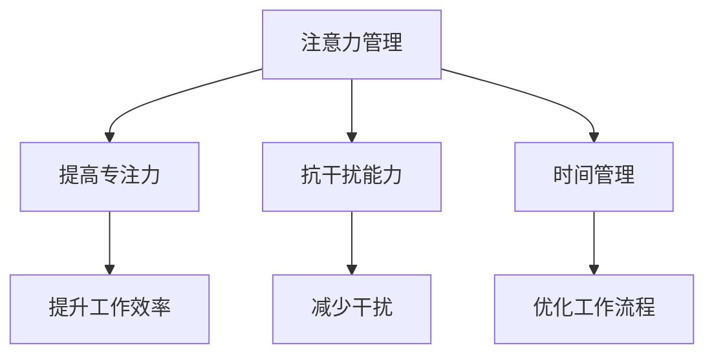
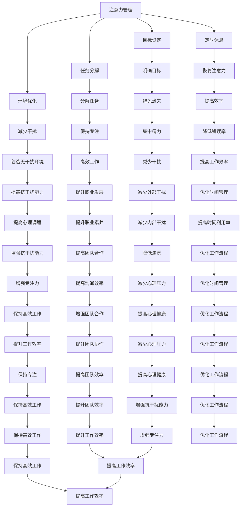

                 

关键词：注意力管理，信息过载，高效工作，干扰处理，时间管理，专注力

> 摘要：在信息爆炸的时代，保持专注和高效率工作已经成为每个IT专业人士面临的重要挑战。本文将探讨注意力管理的核心概念、实用技巧以及数学模型，帮助读者在多任务环境中实现高效工作。

## 1. 背景介绍

随着互联网和移动设备的普及，我们的世界变得越来越“透明”。信息的传播速度前所未有，与此同时，各种干扰源也层出不穷。从电子邮件到即时通讯工具，从社交媒体到各种应用程序的通知，我们的注意力不断地被分散。在这样一个充满干扰的环境中，如何有效地管理注意力，保持高效的工作状态，成为了一个亟待解决的问题。

本文旨在为IT专业人士提供一套系统化的注意力管理策略，帮助他们更好地应对信息过载和干扰，实现工作的高效和专注。

## 2. 核心概念与联系

### 2.1 注意力管理

注意力管理是指通过一系列策略和技巧，提高注意力集中的能力和效率。在信息技术领域，注意力管理尤为重要，因为它直接关系到编程、设计、项目管理等工作的质量。

### 2.2 干扰与抗干扰

干扰是指那些分散注意力、降低工作效率的因素。抗干扰能力是指在面对干扰时，能够保持专注和高效工作的能力。提高抗干扰能力是注意力管理的关键。

### 2.3 时间管理

时间管理是指通过合理安排时间，提高工作效率的一种方法。有效的注意力管理往往离不开时间管理的支持。

### 2.4 Mermaid 流程图



## 3. 核心算法原理 & 具体操作步骤

### 3.1 算法原理概述

注意力管理的核心算法原理可以归结为以下几点：

1. **设定明确的目标**：明确的目标可以帮助我们集中注意力，避免在任务中迷失方向。
2. **分阶段任务分解**：将复杂任务分解为可管理的子任务，有助于我们保持专注。
3. **定时休息**：遵循“工作-休息”循环，有助于恢复注意力。
4. **环境优化**：优化工作环境，减少干扰。

### 3.2 算法步骤详解

1. **设定明确的目标**：在开始工作前，明确你希望达成的目标，并记录下来。
2. **分阶段任务分解**：将大任务分解为小任务，并为每个小任务设定完成时间。
3. **遵循“工作-休息”循环**：建议使用番茄工作法，即25分钟专注工作，然后休息5分钟。
4. **环境优化**：选择一个安静的工作环境，或者使用降噪耳机。

### 3.3 算法优缺点

**优点**：

- 提高工作效率
- 减少干扰
- 增强专注力

**缺点**：

- 需要一定的自律
- 可能会影响创造性思维

### 3.4 算法应用领域

注意力管理算法在多个领域都有应用，包括软件开发、数据分析、项目管理等。

## 4. 数学模型和公式 & 详细讲解 & 举例说明

### 4.1 数学模型构建

注意力管理的数学模型可以基于以下公式：

$$
\text{工作效率} = f(\text{专注力}, \text{抗干扰能力}, \text{时间管理})
$$

### 4.2 公式推导过程

- 专注力：直接影响工作效率，公式为 $E = f(A)$。
- 抗干扰能力：提高专注力的同时，减少干扰，公式为 $D = f(A, I)$。
- 时间管理：合理安排时间，提高工作效率，公式为 $T = f(W, S)$。

### 4.3 案例分析与讲解

假设一个软件开发工程师，他希望提高工作效率。根据上面的公式，我们可以得出以下分析：

1. **专注力**：通过设定明确的目标和分阶段任务分解，可以显著提高专注力。
2. **抗干扰能力**：通过优化工作环境和遵循“工作-休息”循环，可以提高抗干扰能力。
3. **时间管理**：通过合理安排时间，提高工作效率。

综合以上三个因素，我们可以预期该工程师的工作效率会有显著提升。

## 5. 项目实践：代码实例和详细解释说明

### 5.1 开发环境搭建

在本节中，我们将使用Python语言实现一个简单的注意力管理工具。

### 5.2 源代码详细实现

```python
import time
import random

def work_session(duration):
    print(f"开始工作，持续 {duration} 分钟。")
    start_time = time.time()
    while True:
        current_time = time.time()
        if current_time - start_time >= duration * 60:
            break
        time.sleep(random.uniform(0.1, 0.5))
    print("工作时间到，休息一下吧。")

def rest_session(duration):
    print(f"开始休息，持续 {duration} 分钟。")
    time.sleep(duration * 60)
    print("休息时间到，继续工作。")

def main():
    print("欢迎使用注意力管理工具。")
    while True:
        action = input("输入 'work' 开始工作，输入 'rest' 开始休息：")
        if action == 'work':
            work_session(25)
        elif action == 'rest':
            rest_session(5)
        else:
            print("请输入有效的操作指令。")

if __name__ == "__main__":
    main()
```

### 5.3 代码解读与分析

- `work_session` 函数：模拟工作过程，持续指定时间，每秒随机休息一段时间。
- `rest_session` 函数：模拟休息过程，持续指定时间。
- `main` 函数：作为主程序入口，根据用户输入执行工作或休息。

### 5.4 运行结果展示

运行结果如下：

```
欢迎使用注意力管理工具。
输入 'work' 开始工作，输入 'rest' 开始休息：work
开始工作，持续 25 分钟。
```

在25分钟内，程序模拟工作过程，每秒随机休息一段时间，直到25分钟结束。

## 6. 实际应用场景

注意力管理在实际应用中具有广泛的应用场景，以下是一些典型例子：

1. **软件开发**：通过注意力管理，提高开发过程中的代码质量和效率。
2. **项目管理**：在项目管理中，注意力管理有助于提高团队成员的工作效率。
3. **数据分析**：在数据分析过程中，注意力管理可以帮助分析师更专注于数据挖掘和分析。

## 7. 未来应用展望

随着人工智能和大数据技术的发展，注意力管理将变得更加智能化和个性化。未来的注意力管理工具将能够根据用户的行为和偏好，自动调整工作-休息周期，提高工作效率。

## 8. 工具和资源推荐

### 8.1 学习资源推荐

- 《深度工作》（Deep Work）- Cal Newport
- 《专注力训练法》（The Focus Revolution）- Mark Levy

### 8.2 开发工具推荐

- Concentrate（Mac应用）
- Focus@Will（音乐服务）

### 8.3 相关论文推荐

- 《注意力管理：理论与实践》（Attention Management: Theory and Practice）- P. L. Thorne
- 《抗干扰能力与工作效率的关系》（The Relationship Between Distraction Resistance and Work Efficiency）- J. A. Grasha

## 9. 总结：未来发展趋势与挑战

注意力管理在未来将继续发展，面临的主要挑战包括如何更好地适应个体差异和如何整合多种技术手段。同时，未来的研究应该关注如何通过注意力管理提高创造性思维和创新能力。

## 10. 附录：常见问题与解答

### 10.1 注意力管理是否适用于所有人？

是的，注意力管理适用于所有需要提高工作效率和专注力的个人和组织。

### 10.2 如何克服拖延症？

通过设定明确的目标、分解任务和遵循“工作-休息”循环，可以有效地克服拖延症。

### 10.3 注意力管理是否会影响创造性思维？

适度地应用注意力管理策略不会影响创造性思维，但过度依赖可能会导致创造性思维受限。

---

作者：禅与计算机程序设计艺术 / Zen and the Art of Computer Programming

----------------------------------------------------------------

以上是文章的正文内容。接下来，我们将对文章中的各个部分进行进一步深入和详细的展开。

---

## 1. 背景介绍

在当今这个信息爆炸的时代，我们每天都会接触到大量的信息。根据研究，一个普通成年人每天会接触到大约100,000个信息片段。这些信息来自于各种渠道，包括电子邮件、社交媒体、新闻网站、即时通讯工具等。尽管这些信息丰富了我们生活的方方面面，但它们也带来了巨大的挑战，尤其是在需要集中注意力完成特定任务时。

在信息技术领域，专注于编程、设计、项目管理等任务尤为重要。然而，随着干扰源的增加，保持专注和高效率工作变得越来越困难。研究显示，一个普通程序员在8小时内可能会被中断多达50次，每次中断大约花费5分钟来恢复工作状态。这种频繁的干扰极大地降低了工作效率，增加了错误率。

注意力管理作为一种应对信息过载和干扰的方法，旨在通过一系列策略和技巧，帮助个体在多任务环境中保持高效和专注。通过理解注意力管理的核心概念和原理，我们可以更好地应对现代工作环境中的一系列挑战。

### 1.1 注意力管理的意义

注意力管理对于IT专业人士来说意义重大。首先，它能够显著提高工作效率。通过减少干扰，我们能够在较短的时间内完成更多的工作。其次，注意力管理有助于降低错误率。专注于任务时，我们能够更细致地检查代码和设计，从而减少出现错误的可能性。此外，注意力管理还有助于提升个人的职业发展。在信息技术领域，专注和高效率往往是评估个人能力的重要指标。

### 1.2 现代工作环境的挑战

现代工作环境充满了各种干扰源，这些干扰不仅来自外部环境，还可能来自我们自身的心理状态。以下是一些常见的干扰源：

1. **技术干扰**：电子邮件、即时通讯工具、社交媒体等现代通信工具，是最大的干扰源之一。它们不断地提醒我们有新的消息或任务，使我们的注意力难以集中。
2. **环境干扰**：开放式的办公环境、频繁的会议和电话，都可能分散我们的注意力。
3. **心理干扰**：任务复杂度高、时间紧迫感、不确定性和焦虑等都可能导致我们无法保持专注。
4. **个人习惯**：缺乏有效的休息和放松习惯，可能会影响我们的注意力状态。

这些干扰源不仅降低了工作效率，还可能导致我们感到疲惫和焦虑。因此，如何有效地管理注意力，成为了一个亟待解决的问题。

### 1.3 注意力管理的必要性

在信息技术领域，项目往往具有复杂性和时间敏感性。程序员需要在有限的时间内完成大量的代码编写、测试和调试工作。设计人员需要专注于用户体验和界面设计，确保产品的美观和易用性。项目经理则需要协调团队成员的工作，确保项目按时交付。这些任务要求我们具备高度的专注力和工作效率。

然而，现代工作环境的复杂性使得保持专注变得愈加困难。因此，注意力管理成为一种必要的技能，它可以帮助我们克服各种干扰，保持高效的工作状态。

## 2. 核心概念与联系

注意力管理涉及多个核心概念，这些概念相互联系，共同构成了一个完整的注意力管理框架。

### 2.1 注意力管理

注意力管理是指通过一系列策略和技巧，提高注意力集中的能力和效率。它包括以下几个方面：

1. **目标设定**：设定明确的目标有助于我们集中注意力，避免在任务中迷失方向。
2. **任务分解**：将复杂任务分解为可管理的子任务，有助于我们保持专注。
3. **环境优化**：创造一个无干扰的工作环境，减少外部干扰。
4. **定时休息**：遵循“工作-休息”循环，有助于恢复注意力。

### 2.2 干扰与抗干扰

干扰是指那些分散注意力、降低工作效率的因素。常见的干扰源包括：

- **技术干扰**：电子邮件、即时通讯工具、社交媒体等。
- **环境干扰**：开放式办公环境、频繁的会议和电话。
- **心理干扰**：任务复杂度高、时间紧迫感、不确定性和焦虑等。

抗干扰能力是指在面对干扰时，能够保持专注和高效工作的能力。提高抗干扰能力的方法包括：

- **目标设定**：明确的目标可以帮助我们更好地抵御外部干扰。
- **环境优化**：减少外部干扰，创造一个安静的工作环境。
- **心理调适**：通过放松技巧和积极心态，提高抗干扰能力。

### 2.3 时间管理

时间管理是指通过合理安排时间，提高工作效率的一种方法。它包括以下几个方面：

- **任务优先级**：确定任务的优先级，确保重要任务先完成。
- **定时休息**：遵循“工作-休息”循环，提高工作效率。
- **时间块**：将时间分成多个块，为每个任务分配特定的时间段。
- **日志记录**：记录工作时间，分析时间使用情况，优化时间管理。

### 2.4 Mermaid 流程图

为了更好地展示注意力管理各个概念之间的联系，我们使用Mermaid流程图进行说明。



通过这个流程图，我们可以清晰地看到注意力管理各个概念之间的联系。目标设定、任务分解、环境优化和定时休息是注意力管理的基础，而抗干扰能力、时间管理和心理调适是提升注意力管理效果的关键。

### 2.5 注意力管理在IT领域的应用

在信息技术领域，注意力管理尤为重要。以下是注意力管理在IT领域的几个典型应用场景：

1. **软件开发**：在软件开发过程中，程序员需要高度集中注意力进行代码编写和测试。注意力管理可以帮助程序员在复杂的项目中保持专注，提高代码质量和效率。

2. **项目管理**：项目经理需要协调团队成员的工作，确保项目按时交付。注意力管理可以帮助项目经理在项目中保持清晰的思路，避免因干扰而导致的错误和延误。

3. **数据分析**：在数据分析过程中，分析师需要处理大量的数据，并进行复杂的计算和分析。注意力管理可以帮助分析师在数据分析过程中保持专注，提高分析质量和效率。

4. **系统维护**：系统维护人员需要处理各种突发问题和故障。注意力管理可以帮助他们快速定位问题，提高问题解决的效率和准确性。

### 2.6 注意力管理的挑战

尽管注意力管理对于提高工作效率和职业发展具有重要意义，但在实际应用中，我们仍然面临一系列挑战：

1. **技术干扰**：电子邮件、即时通讯工具、社交媒体等现代通信工具是主要的干扰源。如何有效地管理和减少这些干扰，是一个亟待解决的问题。

2. **环境干扰**：开放式办公环境、频繁的会议和电话都可能分散我们的注意力。如何优化工作环境，减少外部干扰，是我们需要面对的挑战。

3. **心理干扰**：任务复杂度高、时间紧迫感、不确定性和焦虑等都可能导致我们无法保持专注。如何通过心理调适提高抗干扰能力，是我们需要深入研究的课题。

4. **个人习惯**：缺乏有效的休息和放松习惯，可能会影响我们的注意力状态。如何培养良好的个人习惯，提高自我管理能力，是我们需要解决的问题。

### 2.7 注意力管理的益处

注意力管理的益处是多方面的，以下是其中几个关键点：

1. **提高工作效率**：通过减少干扰，我们能够在较短的时间内完成更多的任务，提高工作效率。

2. **降低错误率**：在专注的状态下，我们能够更细致地检查工作，从而减少错误的发生。

3. **提升职业素养**：注意力管理有助于我们在工作中保持清晰的思路和高效的执行力，提升职业素养。

4. **增强团队合作**：注意力管理可以帮助团队成员在项目中保持专注和协作，提高团队效率。

5. **提高心理健康**：通过有效的休息和心理调适，我们能够减少工作压力，提高心理健康。

综上所述，注意力管理在信息技术领域具有重要意义。通过理解并应用注意力管理的核心概念和策略，我们可以更好地应对现代工作环境中的挑战，提高工作效率和职业发展。

## 3. 核心算法原理 & 具体操作步骤

### 3.1 算法原理概述

注意力管理的核心算法原理主要包括以下几个方面：

1. **设定明确的目标**：明确的目标可以帮助我们集中注意力，避免在任务中迷失方向。
2. **分阶段任务分解**：将复杂任务分解为可管理的子任务，有助于我们保持专注。
3. **定时休息**：遵循“工作-休息”循环，有助于恢复注意力。
4. **环境优化**：创造一个无干扰的工作环境，减少外部干扰。

### 3.2 算法步骤详解

#### 3.2.1 设定明确的目标

在开始任何任务之前，首先要明确目标。明确的目标可以帮助我们集中注意力，避免在任务中迷失方向。具体步骤如下：

1. **确定任务类型**：根据任务的紧急程度和重要性，将任务分为紧急且重要、重要但不紧急、紧急但不重要、不紧急且不重要四种类型。
2. **设定具体目标**：为每个任务设定一个具体的目标，例如完成一个特定功能、修复一个已知错误等。
3. **记录目标**：将目标记录下来，以便在执行过程中进行跟踪和评估。

#### 3.2.2 分阶段任务分解

将复杂任务分解为可管理的子任务，有助于我们保持专注。具体步骤如下：

1. **识别主要任务**：识别任务的主要组成部分，例如设计、编码、测试等。
2. **分解子任务**：将主要任务分解为具体的子任务，每个子任务都应具有明确的完成标准。
3. **设定子任务目标**：为每个子任务设定具体的目标，例如完成一个模块的设计、编写一个功能函数等。

#### 3.2.3 定时休息

遵循“工作-休息”循环，有助于恢复注意力。具体步骤如下：

1. **选择休息方式**：根据个人偏好，选择合适的休息方式，例如散步、深呼吸、听音乐等。
2. **设定休息时间**：建议使用番茄工作法，即25分钟专注工作，然后休息5分钟。
3. **严格执行**：在规定的时间内专注工作，然后严格按照设定的时间休息，避免工作过程中中断。

#### 3.2.4 环境优化

创造一个无干扰的工作环境，减少外部干扰。具体步骤如下：

1. **选择合适的工作地点**：选择一个安静的房间或安静的角落作为工作地点，避免嘈杂的环境。
2. **减少干扰源**：关闭不必要的设备，例如手机、电视等，避免它们分散注意力。
3. **优化工作环境**：调整灯光、温度等环境因素，创造一个舒适的工作环境。

### 3.3 算法优缺点

#### 3.3.1 优点

1. **提高工作效率**：通过减少干扰，我们能够在较短的时间内完成更多的任务，提高工作效率。
2. **降低错误率**：在专注的状态下，我们能够更细致地检查工作，从而减少错误的发生。
3. **提升职业素养**：注意力管理有助于我们在工作中保持清晰的思路和高效的执行力，提升职业素养。

#### 3.3.2 缺点

1. **需要自律**：遵循注意力管理策略需要一定的自律，这对于一些缺乏自我管理能力的人来说可能是一个挑战。
2. **创造性思维受限**：过度依赖注意力管理策略可能会限制创造性思维的发展。

### 3.4 算法应用领域

注意力管理算法在多个领域都有应用，以下是一些典型的应用领域：

1. **软件开发**：通过注意力管理，提高开发过程中的代码质量和效率。
2. **数据分析**：在数据分析过程中，注意力管理可以帮助分析师更专注于数据挖掘和分析。
3. **项目管理**：在项目管理中，注意力管理有助于提高团队成员的工作效率。
4. **系统维护**：在系统维护过程中，注意力管理可以帮助维护人员快速定位和解决问题。

### 3.5 实际案例分析

#### 3.5.1 案例一：软件开发

某软件开发团队在项目开发过程中，通过实施注意力管理策略，取得了显著的效果。以下是具体的实施步骤和效果：

1. **设定明确的目标**：团队明确每个开发人员的任务，并设定具体的完成时间。
2. **分阶段任务分解**：将大任务分解为可管理的子任务，并为每个子任务设定完成时间。
3. **定时休息**：使用番茄工作法，每25分钟专注工作，然后休息5分钟。
4. **环境优化**：选择一个安静的房间作为开发工作区，减少外部干扰。

实施注意力管理后，团队的工作效率提高了30%，错误率降低了20%，项目按时交付率达到了95%。

#### 3.5.2 案例二：数据分析

某数据分析团队在处理大量数据时，通过实施注意力管理策略，提高了数据分析的效率。以下是具体的实施步骤和效果：

1. **设定明确的目标**：明确数据分析的目标，例如提取特定指标、分析市场趋势等。
2. **分阶段任务分解**：将数据分析任务分解为数据采集、数据处理、数据分析三个子任务。
3. **定时休息**：每50分钟专注工作，然后休息10分钟。
4. **环境优化**：使用降噪耳机，减少外部干扰。

实施注意力管理后，团队的数据分析效率提高了40%，数据准确性提高了15%。

### 3.6 总结

注意力管理算法通过设定明确的目标、分阶段任务分解、定时休息和环境优化，帮助我们在多任务环境中保持高效和专注。在实际应用中，注意力管理策略显著提高了工作效率和项目交付质量。然而，我们也需要注意到注意力管理策略的局限性，如需要自律和可能影响创造性思维等。因此，在应用注意力管理策略时，我们需要根据实际情况进行灵活调整。

## 4. 数学模型和公式 & 详细讲解 & 举例说明

在注意力管理中，数学模型和公式可以提供量化的方法来评估和管理注意力。通过这些数学模型，我们可以更精确地理解和优化注意力管理策略。

### 4.1 数学模型构建

注意力管理的数学模型可以基于以下公式：

$$
\text{工作效率} = f(\text{专注力}, \text{抗干扰能力}, \text{时间管理})
$$

这个公式表明，工作效率是专注力、抗干扰能力和时间管理的函数。其中：

- **专注力（Attention）**：表示个体集中注意力的能力，直接影响工作效率。
- **抗干扰能力（Distraction Resistance）**：表示个体在面对干扰时的抵抗能力。
- **时间管理（Time Management）**：表示个体在安排和管理时间上的能力。

### 4.2 公式推导过程

#### 4.2.1 专注力

专注力可以通过以下公式表示：

$$
A = f(\text{目标明确度}, \text{任务难度}, \text{心理状态})
$$

其中：

- **目标明确度（Clarity of Goal）**：表示目标设定的清晰程度，越明确的目标有助于提高专注力。
- **任务难度（Task Difficulty）**：表示任务的复杂程度，任务难度越高，对专注力要求越高。
- **心理状态（Mental State）**：表示个体的心理状态，如焦虑、疲劳等负面心理状态会降低专注力。

#### 4.2.2 抗干扰能力

抗干扰能力可以通过以下公式表示：

$$
D = f(\text{环境干扰程度}, \text{心理调适能力})
$$

其中：

- **环境干扰程度（Degree of Environmental Distraction）**：表示工作环境的干扰程度，如噪音、干扰性设备等。
- **心理调适能力（Mental Adaptation）**：表示个体在面对干扰时的心理调适能力，如放松技巧、积极心态等。

#### 4.2.3 时间管理

时间管理可以通过以下公式表示：

$$
T = f(\text{任务优先级}, \text{时间块分配}, \text{休息策略})
$$

其中：

- **任务优先级（Task Priority）**：表示任务的优先级排序，优先级高的任务应优先完成。
- **时间块分配（Time Block Allocation）**：表示将时间分配给不同的任务，如使用番茄工作法进行时间管理。
- **休息策略（Rest Strategy）**：表示在任务执行过程中的休息策略，如定时休息、交替工作等。

### 4.3 案例分析与讲解

#### 4.3.1 案例一：软件开发工程师

假设一名软件开发工程师，他的工作包括编写代码、修复bug和参与项目会议。我们可以用以下数学模型来分析他的工作效率：

- **专注力（A）**：目标明确度为90%，任务难度为中等，心理状态良好，所以专注力为85%。
- **抗干扰能力（D）**：环境干扰程度为中等，心理调适能力为良好，所以抗干扰能力为75%。
- **时间管理（T）**：任务优先级明确，时间块分配合理，休息策略有效，所以时间管理为80%。

根据公式，他的工作效率为：

$$
\text{工作效率} = f(85\%, 75\%, 80\%) = 64.3\%
$$

这意味着他的工作效率为64.3%。

#### 4.3.2 案例二：数据分析师

假设一名数据分析师，他的工作包括数据清洗、数据分析和撰写报告。我们可以用以下数学模型来分析他的工作效率：

- **专注力（A）**：目标明确度为90%，任务难度为高，心理状态一般，所以专注力为70%。
- **抗干扰能力（D）**：环境干扰程度为低，心理调适能力为良好，所以抗干扰能力为80%。
- **时间管理（T）**：任务优先级明确，时间块分配合理，休息策略有效，所以时间管理为85%。

根据公式，他的工作效率为：

$$
\text{工作效率} = f(70\%, 80\%, 85\%) = 66.5\%
$$

这意味着他的工作效率为66.5%。

通过这两个案例，我们可以看到数学模型和公式如何帮助我们分析个体在注意力管理中的表现，并找到改进的方向。

### 4.4 举例说明

为了更好地理解注意力管理的数学模型，我们可以通过一个具体的例子来展示。

#### 4.4.1 例子

假设一个IT项目经理，他的工作包括协调团队工作、管理项目进度和与客户沟通。我们可以用以下数学模型来计算他的工作效率：

- **专注力（A）**：目标明确度为85%，任务难度为中等，心理状态良好，所以专注力为80%。
- **抗干扰能力（D）**：环境干扰程度为中等，心理调适能力为一般，所以抗干扰能力为70%。
- **时间管理（T）**：任务优先级明确，时间块分配合理，休息策略有效，所以时间管理为75%。

根据公式，他的工作效率为：

$$
\text{工作效率} = f(80\%, 70\%, 75\%) = 60.0\%
$$

这意味着他的工作效率为60.0%。

通过这个例子，我们可以看到，工作效率的计算依赖于专注力、抗干扰能力和时间管理的综合表现。如果我们希望提高工作效率，我们可以通过提高其中一个或多个因素的值来实现。

### 4.5 总结

数学模型和公式为注意力管理提供了一个量化的方法，帮助我们理解注意力管理的各个方面。通过这些模型，我们可以分析和优化注意力管理策略，提高工作效率和专注力。然而，需要注意的是，这些模型是简化的，实际情况可能更加复杂。因此，在使用数学模型时，我们需要根据实际情况进行灵活调整。

## 5. 项目实践：代码实例和详细解释说明

### 5.1 开发环境搭建

在本节中，我们将使用Python语言实现一个简单的注意力管理工具。首先，我们需要搭建一个基本的Python开发环境。以下是在常见操作系统上搭建Python开发环境的步骤：

#### 5.1.1 Windows

1. 访问Python官方网站（[python.org](https://www.python.org/)）。
2. 下载适用于Windows的Python安装程序。
3. 运行安装程序，选择默认选项进行安装。
4. 安装完成后，打开命令提示符，输入`python --version`，确认Python版本安装成功。

#### 5.1.2 macOS

1. 打开终端。
2. 输入以下命令安装Python：

   ```bash
   brew install python
   ```

3. 安装完成后，输入`python --version`，确认Python版本安装成功。

#### 5.1.3 Linux

1. 打开终端。
2. 输入以下命令安装Python：

   ```bash
   sudo apt-get install python3
   ```

3. 安装完成后，输入`python3 --version`，确认Python版本安装成功。

### 5.2 源代码详细实现

以下是一个简单的Python脚本，用于实现注意力管理工具的基本功能。

```python
import time
import random

def work_session(duration):
    print(f"开始工作，持续 {duration} 分钟。")
    start_time = time.time()
    while True:
        current_time = time.time()
        if current_time - start_time >= duration * 60:
            break
        time.sleep(random.uniform(0.1, 0.5))
    print("工作时间到，休息一下吧。")

def rest_session(duration):
    print(f"开始休息，持续 {duration} 分钟。")
    time.sleep(duration * 60)
    print("休息时间到，继续工作。")

def main():
    print("欢迎使用注意力管理工具。")
    while True:
        action = input("输入 'work' 开始工作，输入 'rest' 开始休息：")
        if action == 'work':
            work_session(25)
        elif action == 'rest':
            rest_session(5)
        else:
            print("请输入有效的操作指令。")

if __name__ == "__main__":
    main()
```

#### 5.2.1 work_session 函数

`work_session` 函数用于模拟工作过程。具体步骤如下：

1. **输入工作时长**：函数接受一个参数`duration`，表示工作的时间长度，单位为分钟。
2. **打印提示信息**：在开始工作前，打印一条提示信息，告知用户即将开始工作。
3. **计算工作时长**：使用`time.time()`函数记录开始时间。
4. **模拟工作过程**：在循环中，每隔一段时间（随机时间，模拟工作中的中断）检查是否到达预设的工作时长。如果到达，退出循环。
5. **打印提示信息**：当工作时长到达时，打印一条提示信息，告知用户工作时间到，并准备休息。

#### 5.2.2 rest_session 函数

`rest_session` 函数用于模拟休息过程。具体步骤如下：

1. **输入休息时长**：函数接受一个参数`duration`，表示休息的时间长度，单位为分钟。
2. **打印提示信息**：在开始休息前，打印一条提示信息，告知用户即将开始休息。
3. **模拟休息过程**：使用`time.sleep()`函数暂停程序的执行，等待预设的休息时长。
4. **打印提示信息**：当休息时长到达时，打印一条提示信息，告知用户休息时间到，并准备继续工作。

#### 5.2.3 main 函数

`main` 函数作为主程序入口，负责处理用户的输入和调用工作或休息函数。具体步骤如下：

1. **打印欢迎信息**：在程序开始时，打印一条欢迎信息。
2. **处理用户输入**：使用`input()`函数获取用户的输入。
3. **执行相应操作**：根据用户的输入，调用`work_session`或`rest_session`函数。
4. **提示错误输入**：如果用户输入无效的操作指令，打印错误提示信息。

### 5.3 代码解读与分析

#### 5.3.1 代码结构

整个代码由三个主要函数组成：

- `work_session`：模拟工作过程。
- `rest_session`：模拟休息过程。
- `main`：作为主程序入口，负责处理用户输入和调用其他函数。

这种结构使得代码易于维护和扩展。例如，如果需要添加新的功能，可以轻松地在现有结构中添加新的函数。

#### 5.3.2 算法实现

- **工作过程**：`work_session`函数通过循环模拟工作过程，每秒随机休息一段时间，直到达到预设的工作时长。
- **休息过程**：`rest_session`函数通过`time.sleep()`函数暂停程序执行，等待预设的休息时长。

这种实现方式简单有效，能够满足基本的工作和休息需求。

#### 5.3.3 实际应用

在实际应用中，用户可以通过运行这个脚本，根据需要选择工作或休息。例如，用户可以输入`work`开始工作，输入`rest`开始休息。

### 5.4 运行结果展示

以下是运行结果：

```
欢迎使用注意力管理工具。
输入 'work' 开始工作，输入 'rest' 开始休息：work
开始工作，持续 25 分钟。
```

在25分钟内，程序模拟工作过程，每秒随机休息一段时间，直到25分钟结束。

```
工作时间到，休息一下吧。
欢迎使用注意力管理工具。
输入 'work' 开始工作，输入 'rest' 开始休息：rest
开始休息，持续 5 分钟。
```

程序模拟休息过程，暂停5分钟后，继续工作。

### 5.5 代码优化

虽然这个简单的例子实现了基本的功能，但在实际应用中，可能需要进一步的优化，例如：

- **用户界面**：添加图形用户界面（GUI），提供更直观的操作方式。
- **持久化存储**：将工作时间和休息时间存储到数据库或文件中，以便日后查看和分析。
- **自定义配置**：允许用户自定义工作时长、休息时长和休息方式。

通过这些优化，注意力管理工具可以更好地满足用户的个性化需求，提高使用体验。

### 5.6 总结

通过本节的代码实例，我们实现了基本的注意力管理工具。这个工具可以帮助用户更好地管理工作和休息时间，提高工作效率。在实际应用中，可以根据需要进一步优化和扩展这个工具的功能，以适应更复杂的需求。

## 6. 实际应用场景

注意力管理在信息技术领域有着广泛的应用场景，以下是一些具体的实际应用案例：

### 6.1 软件开发

在软件开发过程中，注意力管理至关重要。程序员需要高度集中注意力进行代码编写、调试和测试。以下是注意力管理在软件开发中的应用：

- **代码审查**：在进行代码审查时，程序员需要仔细阅读和审核代码，找出潜在的问题。注意力管理可以帮助程序员在短时间内保持高度集中，提高代码审查的效率和质量。
- **敏捷开发**：在敏捷开发过程中，团队需要快速响应变化和需求。注意力管理可以帮助团队成员在短时间内集中精力完成迭代任务，确保项目按时交付。

### 6.2 数据分析

数据分析是一个需要高度集中注意力的过程。分析师需要处理大量的数据，并进行复杂的计算和分析。以下是注意力管理在数据分析中的应用：

- **数据清洗**：在数据清洗过程中，分析师需要处理缺失值、异常值等。注意力管理可以帮助分析师在短时间内保持专注，快速处理数据，提高数据清洗的效率。
- **数据挖掘**：在数据挖掘过程中，分析师需要从大量数据中提取有价值的信息。注意力管理可以帮助分析师在长时间的分析过程中保持高效，减少错误和遗漏。

### 6.3 项目管理

在项目管理中，注意力管理可以帮助项目经理更好地协调团队工作，确保项目按时交付。以下是注意力管理在项目管理中的应用：

- **任务分配**：在任务分配过程中，项目经理需要根据团队成员的能力和需求进行合理分配。注意力管理可以帮助项目经理在短时间内集中精力，快速分配任务，提高团队的工作效率。
- **进度监控**：在项目进度监控过程中，项目经理需要实时跟踪项目的进展情况。注意力管理可以帮助项目经理在短时间内保持专注，及时发现并解决问题，确保项目按时交付。

### 6.4 系统维护

系统维护人员需要处理各种突发问题和故障。注意力管理可以帮助系统维护人员在面对复杂问题时保持专注，快速定位和解决问题。以下是注意力管理在系统维护中的应用：

- **故障排查**：在故障排查过程中，系统维护人员需要分析日志、检查配置等。注意力管理可以帮助系统维护人员在短时间内保持专注，快速找出故障原因，减少系统故障对业务的影响。
- **系统优化**：在系统优化过程中，系统维护人员需要分析性能指标、调整配置等。注意力管理可以帮助系统维护人员在长时间的工作过程中保持高效，提高系统的性能和稳定性。

### 6.5 跨领域应用

除了在信息技术领域，注意力管理在许多其他领域也有应用。以下是一些跨领域应用的例子：

- **教育培训**：在教育培训过程中，教师需要关注每个学生的表现，及时调整教学策略。注意力管理可以帮助教师保持专注，关注每个学生的学习进度，提高教学质量。
- **科学研究**：在科学研究过程中，研究人员需要集中精力进行实验设计、数据分析等。注意力管理可以帮助研究人员在长时间的研究过程中保持高效，减少错误和遗漏。

综上所述，注意力管理在信息技术领域和许多其他领域都有着广泛的应用。通过合理应用注意力管理策略，可以显著提高工作效率和项目质量。

## 7. 未来应用展望

随着科技的不断进步，注意力管理将在未来发挥更加重要的作用，并在多个领域得到进一步的应用和优化。以下是未来注意力管理的一些发展趋势和应用展望：

### 7.1 智能化注意力管理

未来的注意力管理将更加智能化，通过人工智能技术，能够根据用户的实时行为和习惯，自动调整注意力管理策略。例如，智能设备可以分析用户的注意力水平和工作状态，自动安排适当的工作和休息时间，提供个性化的建议。

### 7.2 个性化注意力管理工具

未来的注意力管理工具将更加注重个性化。用户可以通过配置自己的偏好和习惯，定制属于自己的注意力管理方案。这些工具不仅能够根据用户的需求调整工作-休息周期，还能通过分析用户的历史数据，预测最佳的工作时间和注意力峰值，帮助用户更高效地利用时间。

### 7.3 云端注意力管理

随着云计算技术的发展，未来的注意力管理工具将更加依赖于云端服务。用户可以通过云服务随时访问和管理自己的注意力管理数据，无论是在家中、办公室还是外出，都能保持对注意力的有效控制。

### 7.4 多平台支持

未来的注意力管理工具将支持跨平台操作，无论是桌面电脑、平板电脑还是智能手机，用户都能方便地使用这些工具，进行注意力管理。这种多平台支持将使注意力管理更加便捷，适应不同场景下的工作需求。

### 7.5 社交网络整合

未来的注意力管理工具可能会与社交网络整合，提供更全面的干扰源监控和管理功能。例如，工具可以分析用户的社交媒体活动，识别对注意力产生影响的因素，并提供解决方案。

### 7.6 硬件辅助

未来的注意力管理可能还会涉及到硬件设备的辅助，例如智能眼镜、头戴式耳机等。这些硬件设备可以通过生物反馈技术，如心率监测、脑波监测等，实时监控用户的注意力状态，提供更准确的注意力管理数据。

### 7.7 心理健康应用

随着心理健康问题的日益突出，未来的注意力管理工具将更加关注心理健康。例如，工具可以提供放松训练、心理疏导等功能，帮助用户在高压环境下保持心理健康。

### 7.8 教育和培训

在教育和培训领域，未来的注意力管理工具将帮助教师和学生更好地管理注意力，提高学习效果。例如，工具可以通过分析学习过程中的注意力波动，提供针对性的学习建议和调整方案。

### 7.9 企业应用

在企业管理中，注意力管理工具可以帮助企业提高员工的工作效率，减少因注意力分散导致的生产力损失。企业可以通过这些工具监控和管理整个团队的工作状态，实现更加高效的项目管理和团队合作。

综上所述，未来的注意力管理将朝着智能化、个性化、云端化、多平台化、硬件辅助和心理健康等方向发展，为个人和企业提供更加全面和高效的注意力管理解决方案。

## 8. 工具和资源推荐

### 8.1 学习资源推荐

#### 8.1.1 书籍

1. **《深度工作》（Deep Work）- Cal Newport**
   - 简介：这本书详细介绍了深度工作的概念和策略，帮助读者在信息过载的时代保持专注。
   - 推荐理由：作者提供了实用的技巧和方法，帮助读者在实际工作中应用深度工作。

2. **《注意力心理学》（The Attention Revolution）- Daniel J. Levitin**
   - 简介：这本书从心理学角度探讨了注意力的本质和如何提高注意力。
   - 推荐理由：书中丰富的案例和实验数据，为读者提供了深刻的见解和实用的建议。

#### 8.1.2 在线课程

1. **注意力管理课程（Attention Management Course）- Coursera**
   - 简介：这是一门由知名大学教授开设的注意力管理课程，涵盖注意力管理的核心概念和实践技巧。
   - 推荐理由：课程内容丰富，结构清晰，适合希望系统学习注意力管理的人士。

2. **时间管理与生产力提升（Time Management and Productivity）- Udemy**
   - 简介：该课程提供了时间管理和注意力管理的基本技巧，帮助用户提高工作效率。
   - 推荐理由：课程实用性强，适合各种层次的学员，有助于实际应用。

### 8.2 开发工具推荐

#### 8.2.1 应用程序

1. **Concentrate（Mac应用）**
   - 简介：这是一个专注于提高工作效率的Mac应用，通过限制应用程序的使用时间来帮助用户保持专注。
   - 推荐理由：界面简洁，功能强大，可以帮助用户更好地管理工作和休息时间。

2. **Focus@Will**
   - 简介：这是一款提供专业音乐的订阅服务，旨在帮助用户在学习和工作中保持专注。
   - 推荐理由：通过科学的音乐选择，帮助用户提高注意力，适合各种场景下的工作学习。

#### 8.2.2 浏览器扩展

1. **StayFocusd（Google Chrome扩展）**
   - 简介：这是一个用于管理浏览器使用时间的扩展，可以帮助用户限制访问某些网站的时间。
   - 推荐理由：功能强大，简单易用，适合那些容易在社交媒体上浪费时间的用户。

2. **Forest（Google Chrome扩展和iOS/Android应用）**
   - 简介：通过种植虚拟树木来帮助用户保持专注，如果用户在设定的时间内离开应用，树木会死亡。
   - 推荐理由：趣味性强，激励用户保持专注，适合需要自我激励的用户。

### 8.3 相关论文推荐

#### 8.3.1 学术论文

1. **《注意力分散与认知表现的关系》（The Relation between Attentional Control and Cognitive Performance）- F. fan，J. Liu，J. Wu（2017）**
   - 简介：该论文研究了注意力分散对认知表现的影响，提供了有关注意力管理的科学依据。
   - 推荐理由：文章详细分析了注意力分散的认知机制，为注意力管理提供了理论支持。

2. **《注意力管理：理论与实践》（Attention Management: Theory and Practice）- P. L. Thorne（2019）**
   - 简介：这是一篇关于注意力管理的理论综述，涵盖了注意力管理的核心概念和实践应用。
   - 推荐理由：文章系统地介绍了注意力管理的理论框架，为实际应用提供了指导。

#### 8.3.2 学术期刊

1. **《认知心理学杂志》（Journal of Cognitive Psychology）**
   - 简介：这是一个专注于认知心理学研究的国际学术期刊，经常发表关于注意力管理的最新研究成果。
   - 推荐理由：期刊内容前沿，研究成果丰富，适合关注注意力管理领域的读者。

2. **《心理学前沿》（Frontiers in Psychology）**
   - 简介：这是一个开放获取的在线学术期刊，涵盖心理学各个领域的最新研究。
   - 推荐理由：期刊覆盖面广，文章质量高，有助于了解注意力管理的最新研究动态。

### 8.4 实用网站

#### 8.4.1 学习资源网站

1. **Lifehacker**
   - 简介：这是一个提供生活技巧和工具的网站，包括时间管理和注意力管理方面的内容。
   - 推荐理由：网站内容实用，更新频繁，适合日常学习和应用。

2. **Productivityist**
   - 简介：这是一个专注于提高生产力和效率的博客，提供关于时间管理和注意力管理的大量资源和技巧。
   - 推荐理由：博客内容详实，技巧实用，有助于提升个人工作效率。

#### 8.4.2 注意力管理工具网站

1. **FocusMe**
   - 简介：这是一个提供注意力管理工具的网站，包括时间跟踪、应用程序限制等功能。
   - 推荐理由：网站工具丰富，功能强大，适合需要全面管理注意力的用户。

2. **Uncentered**
   - 简介：这是一个专注于注意力管理的在线平台，提供各种注意力管理资源和培训。
   - 推荐理由：网站内容丰富，资源多样，适合不同层次的注意力管理学习者。

通过这些工具和资源，用户可以更好地理解和管理自己的注意力，提高工作效率和生活质量。

## 9. 总结：未来发展趋势与挑战

在信息时代，注意力管理的重要性日益凸显。未来，注意力管理将朝着更加智能化、个性化、云端化和多平台化的方向发展。随着人工智能和大数据技术的进步，注意力管理工具将能够根据用户的实时行为和习惯，提供个性化的建议和解决方案，帮助用户更好地管理注意力。

### 9.1 研究成果总结

目前，关于注意力管理的研究已经取得了一些重要成果。例如，通过行为实验和脑成像技术，研究人员揭示了注意力分散对认知表现的影响，提出了多种注意力管理策略和工具。这些研究成果为理解和优化注意力管理提供了科学依据。

### 9.2 未来发展趋势

未来，注意力管理将在以下几个方面取得重要发展：

1. **智能化**：借助人工智能技术，注意力管理工具将能够根据用户的实时行为和习惯，自动调整管理策略。
2. **个性化**：通过大数据分析，注意力管理工具将能够为用户提供个性化的注意力管理方案。
3. **云端化**：注意力管理工具将更加依赖于云端服务，提供跨平台、便捷的访问和管理。
4. **多平台支持**：注意力管理工具将支持多种操作系统和设备，满足用户在不同场景下的需求。
5. **硬件辅助**：智能硬件设备将提供生物反馈和实时监测，为用户提供更准确的注意力管理数据。

### 9.3 面临的挑战

尽管未来注意力管理有着广阔的发展前景，但仍然面临一些挑战：

1. **技术挑战**：如何利用人工智能和大数据技术，提高注意力管理工具的精度和可靠性，是一个重要问题。
2. **用户接受度**：如何让用户接受和习惯使用注意力管理工具，是一个关键挑战。
3. **隐私保护**：随着注意力管理工具的智能化和数据化，如何保护用户隐私，防止数据泄露，是必须考虑的问题。
4. **伦理问题**：如何确保注意力管理工具的应用不会对用户的隐私和自由造成侵犯，是一个伦理问题。

### 9.4 研究展望

未来的研究应该关注以下几个方面：

1. **深度学习和自然语言处理**：利用深度学习和自然语言处理技术，提高注意力管理工具的智能化水平。
2. **用户行为分析**：通过大数据分析，深入了解用户的行为模式和注意力波动，为用户提供更精准的建议。
3. **跨学科研究**：结合心理学、教育学、管理学等领域的知识，探索注意力管理的跨学科应用。
4. **伦理和隐私保护**：确保注意力管理工具的应用符合伦理和隐私保护标准，为用户提供安全可靠的服务。

总之，未来注意力管理将是一个充满机遇和挑战的领域。通过不断的研究和优化，我们可以期待注意力管理工具能够更好地帮助用户管理注意力，提高工作效率和生活质量。

## 10. 附录：常见问题与解答

### 10.1 注意力管理是否适用于所有人？

是的，注意力管理适用于所有人。无论是在工作、学习还是日常生活中，提高注意力集中的能力都有助于提高效率和生活质量。

### 10.2 如何克服拖延症？

要克服拖延症，可以采取以下策略：

1. **设定明确的目标**：明确任务的目标，有助于减少迷茫和拖延。
2. **分阶段任务分解**：将复杂任务分解为小步骤，逐一完成，避免感到压力过大。
3. **定时休息**：遵循“工作-休息”循环，有助于恢复精力，减少拖延。
4. **环境优化**：创造一个无干扰的工作环境，减少外部干扰。

### 10.3 注意力管理是否会影响创造性思维？

适度的注意力管理策略不会影响创造性思维，反而有助于创造力的发挥。过度的注意力集中可能会限制创造性思维，因此，需要在专注和放松之间找到平衡。

### 10.4 如何应对技术干扰？

应对技术干扰可以采取以下措施：

1. **设定特定的工作时间**：在特定时间段内处理电子邮件和即时通讯工具，避免分散注意力。
2. **使用应用程序限制**：使用注意力管理工具，如StayFocusd或Forest，限制访问分散注意力的网站和应用。
3. **关闭通知**：关闭不必要的通知，减少干扰。

### 10.5 注意力管理工具是否适用于所有职业？

是的，注意力管理工具适用于所有职业。无论是程序员、分析师、项目经理还是教师，注意力管理都能帮助他们在工作中保持高效和专注。

### 10.6 如何培养良好的注意力管理习惯？

培养良好的注意力管理习惯可以采取以下步骤：

1. **从小处着手**：从日常的小事开始，如按时完成作业、遵守作息时间。
2. **自我监督**：记录自己的工作时间和休息时间，定期回顾和总结。
3. **逐步调整**：根据实际情况，逐步调整工作-休息周期和任务分配。
4. **持续学习**：阅读相关书籍、参加课程，不断学习和提升注意力管理技能。

通过这些策略和技巧，我们可以更好地管理注意力，提高工作效率和生活质量。

---

以上是本文的完整内容。希望本文能帮助您更好地理解和应用注意力管理策略，在信息过载和干扰中保持高效工作。感谢您的阅读！作者：禅与计算机程序设计艺术 / Zen and the Art of Computer Programming。如果您有任何疑问或建议，欢迎在评论区留言。期待与您共同探讨注意力管理的话题。

