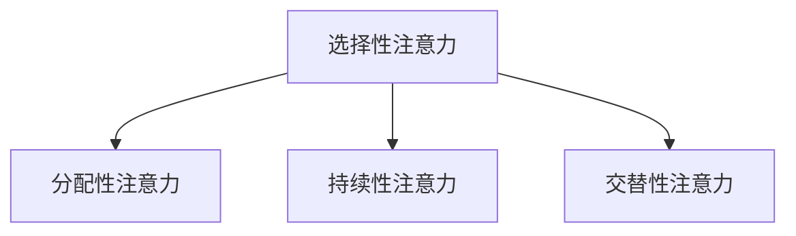
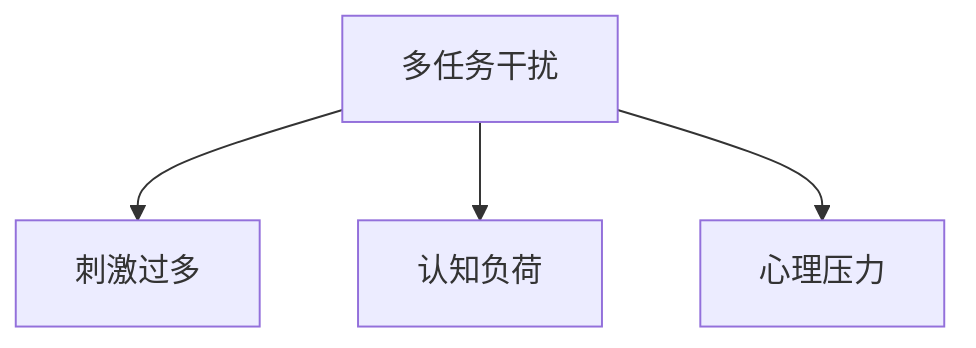
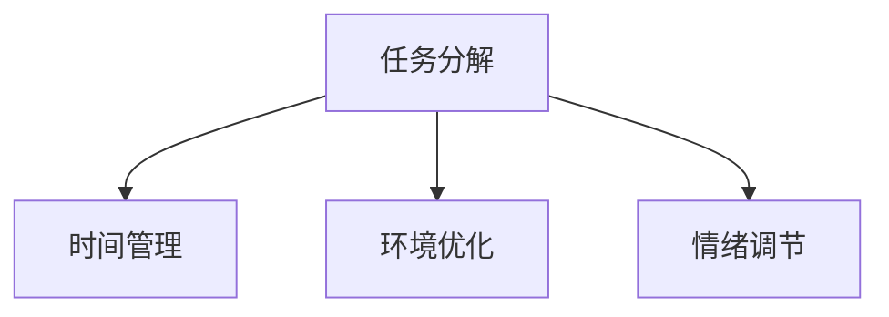

                 

 在今天的信息爆炸时代，管理我们的注意量成为一个严峻的挑战。无论是日常的工作、学习，还是休闲娱乐，我们都被海量信息所包围。这些信息可能是有用的，也可能只是无意义的噪音。如何在干扰和信息过载的环境中保持专注和高效，成为每个个体必须面对的问题。

本文旨在探讨信息时代下的注意量管理挑战，并介绍一些有效的策略和方法。我们将首先回顾当前的研究成果，然后深入探讨注意量管理的核心概念，接着介绍一些核心算法和数学模型，最后通过具体项目实践和实际应用场景，展示这些策略的实际效果。文章将分为以下几个部分：

## 1. 背景介绍
### 1.1 信息时代的特征
### 1.2 注意量管理的挑战
### 1.3 注意量管理的重要性

## 2. 核心概念与联系
### 2.1 注意力的种类
### 2.2 注意力分散的原因
### 2.3 注意力管理的原理
## 2.4 Mermaid 流程图展示

## 3. 核心算法原理 & 具体操作步骤
### 3.1 算法原理概述
### 3.2 算法步骤详解
### 3.3 算法优缺点
### 3.4 算法应用领域

## 4. 数学模型和公式 & 详细讲解 & 举例说明
### 4.1 数学模型构建
### 4.2 公式推导过程
### 4.3 案例分析与讲解

## 5. 项目实践：代码实例和详细解释说明
### 5.1 开发环境搭建
### 5.2 源代码详细实现
### 5.3 代码解读与分析
### 5.4 运行结果展示

## 6. 实际应用场景
### 6.1 工作环境中的应用
### 6.2 学习环境中的应用
### 6.3 休闲娱乐中的应用

## 7. 工具和资源推荐
### 7.1 学习资源推荐
### 7.2 开发工具推荐
### 7.3 相关论文推荐

## 8. 总结：未来发展趋势与挑战
### 8.1 研究成果总结
### 8.2 未来发展趋势
### 8.3 面临的挑战
### 8.4 研究展望

## 9. 附录：常见问题与解答

### 1. 背景介绍

## 1.1 信息时代的特征

信息时代始于20世纪末，随着互联网的普及，人们获取和处理信息的能力得到了前所未有的提升。以下是信息时代的主要特征：

- **信息量爆发式增长**：互联网使得信息的传播速度和范围大幅增加，每天产生的新信息量以指数级增长。
- **信息来源多样化**：传统的媒体渠道已经不再独占信息传播，社交媒体、博客、论坛等各种平台成为信息的主要来源。
- **信息碎片化**：由于信息量的爆炸式增长，人们获取的信息越来越碎片化，难以系统性地理解和掌握。
- **信息实时性**：实时通信技术使得信息的传播和接收变得实时，人们可以迅速了解到最新的信息动态。

## 1.2 注意量管理的挑战

在信息时代，注意量管理的挑战主要体现在以下几个方面：

- **信息过载**：每天接收到的信息量远远超过了人的处理能力，导致注意力被分散，难以集中。
- **多任务处理**：现代工作生活中，人们常常需要同时处理多个任务，这要求大脑具备高效切换注意力的能力。
- **干扰源增多**：电子邮件、即时通讯、社交媒体等工具使得各种干扰源不断涌现，增加了注意力管理的难度。
- **认知疲劳**：长时间集中注意力工作或学习会导致大脑疲劳，降低工作效率和学习效果。

## 1.3 注意量管理的重要性

有效的注意量管理对于个人的成长和成功至关重要。以下是一些关键点：

- **提高工作效率**：通过有效管理注意量，可以减少无效工作和分散注意力的情况，提高工作效率。
- **提升学习效果**：集中注意力的学习可以加深对知识的理解和记忆，提高学习效果。
- **促进心理健康**：良好的注意力管理可以帮助人们减少焦虑和压力，提升心理健康水平。
- **实现目标**：有效的注意量管理可以帮助人们更好地聚焦于长期目标，避免被短期干扰所影响。

通过上述背景介绍，我们可以看到，注意量管理在信息时代的重要性不言而喻。接下来，我们将深入探讨注意量管理的核心概念，并介绍一些有效的策略和方法。

### 2. 核心概念与联系

在探讨注意量管理之前，我们需要理解一些核心概念，包括注意力的种类、注意力分散的原因以及注意力管理的原理。为了更直观地展示这些概念之间的联系，我们将使用Mermaid流程图来描述。

#### 2.1 注意力的种类

注意力可以分为几种不同的类型，包括：

- **选择性注意力**：选择性地关注某些信息，而忽略其他信息的能力。
- **分配性注意力**：在同时处理多个任务时，将注意力分配到不同任务上的能力。
- **持续性注意力**：长时间保持注意力集中，不易被干扰的能力。
- **交替性注意力**：在不同任务之间切换注意力的能力。

下面是一个简单的Mermaid流程图，展示这些注意力类型的联系：



#### 2.2 注意力分散的原因

注意力分散的原因多种多样，主要包括：

- **多任务干扰**：同时进行多个任务时，容易导致注意力分散。
- **刺激过多**：过多的外部刺激（如电子邮件、社交媒体通知等）会消耗注意力资源。
- **认知负荷**：任务难度过大或任务要求过高时，大脑处理信息的负担增加，导致注意力分散。
- **心理压力**：工作或学习中的压力会增加焦虑和紧张感，影响注意力集中。

下面是一个描述注意力分散原因的Mermaid流程图：



#### 2.3 注意力管理的原理

注意力管理涉及一系列策略和方法，旨在提高注意力的集中性和效率。以下是一些核心原理：

- **任务分解**：将复杂的任务分解成小步骤，有助于更好地集中注意力。
- **时间管理**：使用时间管理工具（如番茄工作法）来规划工作和休息时间，减少干扰。
- **环境优化**：创造一个有利于集中注意力的环境，减少外部干扰。
- **情绪调节**：通过冥想、深呼吸等技巧来调节情绪，减少焦虑和紧张感。

下面是一个描述注意力管理原理的Mermaid流程图：



通过上述核心概念和Mermaid流程图的展示，我们可以更清晰地理解注意力管理的各个方面。接下来，我们将介绍一些核心算法原理和具体操作步骤，以帮助读者更好地实施注意力管理策略。

### 3. 核心算法原理 & 具体操作步骤

在注意力管理领域，已经发展出多种算法和策略，旨在帮助人们更好地集中注意力、减少干扰和优化工作效率。以下是几种核心算法的原理和具体操作步骤。

#### 3.1 算法原理概述

核心算法通常包括以下几种：

1. **注意力切换算法**：帮助个体在不同任务之间高效切换注意力。
2. **干扰过滤算法**：通过过滤掉无关的干扰信息，提高注意力的集中度。
3. **认知负荷优化算法**：通过调整任务难度和任务分配，减少大脑的认知负荷。
4. **情绪调节算法**：使用心理技巧和生理调节方法，帮助个体保持良好的情绪状态，从而提高注意力。

#### 3.2 算法步骤详解

下面，我们详细介绍每种算法的具体步骤。

##### 3.2.1 注意力切换算法

**原理**：通过预先设定的规则和策略，帮助个体在不同任务之间快速切换注意力。

**步骤**：
1. **任务识别**：识别当前正在进行的任务。
2. **规则设定**：设定任务切换的规则，例如“每完成一个任务后休息5分钟”或“在遇到困难时切换到其他任务”。
3. **执行切换**：按照设定的规则进行任务切换。
4. **反馈调节**：根据切换效果进行反馈调节，优化切换策略。

##### 3.2.2 干扰过滤算法

**原理**：通过过滤掉无关干扰信息，减少对注意力的消耗。

**步骤**：
1. **识别干扰源**：识别电子邮件、社交媒体通知等常见的干扰源。
2. **设定过滤规则**：根据个人的工作或学习需求，设定过滤规则，例如“非紧急邮件不显示通知”或“工作期间关闭社交媒体”。
3. **执行过滤**：按照设定的规则过滤干扰信息。
4. **动态调整**：根据实际情况动态调整过滤规则，以提高过滤效果。

##### 3.2.3 认知负荷优化算法

**原理**：通过调整任务难度和任务分配，优化大脑的认知负荷。

**步骤**：
1. **任务评估**：评估当前任务的难度和认知负荷。
2. **任务调整**：根据评估结果，调整任务难度或任务分配，例如将复杂任务分解成简单任务，或将任务分配给不同的人。
3. **监控与反馈**：监控任务完成情况，并根据反馈结果调整任务难度和分配策略。

##### 3.2.4 情绪调节算法

**原理**：通过心理技巧和生理调节方法，帮助个体保持良好的情绪状态，从而提高注意力。

**步骤**：
1. **情绪识别**：识别当前的情绪状态。
2. **心理调节**：使用冥想、深呼吸等技巧进行心理调节。
3. **生理调节**：通过运动、饮食调节等方式进行生理调节。
4. **反馈调节**：根据调节效果进行反馈调节，优化调节策略。

#### 3.3 算法优缺点

每种算法都有其优缺点，具体如下：

- **注意力切换算法**：
  - 优点：帮助个体高效处理多个任务。
  - 缺点：频繁切换可能导致注意力分散，且难以处理复杂的任务。

- **干扰过滤算法**：
  - 优点：减少干扰信息，提高注意力集中度。
  - 缺点：过度过滤可能导致重要信息被忽略。

- **认知负荷优化算法**：
  - 优点：优化大脑认知负荷，提高工作效率。
  - 缺点：任务调整可能需要较长时间，且难以应对突发任务。

- **情绪调节算法**：
  - 优点：帮助个体保持良好情绪状态，提高注意力。
  - 缺点：情绪调节效果因人而异，且需要长期坚持。

#### 3.4 算法应用领域

这些算法可以应用于多个领域，包括：

- **个人学习与工作**：帮助个体提高学习效率和工作效率。
- **团队协作**：优化团队成员的注意力管理，提高团队整体效率。
- **教育领域**：帮助学生更好地管理注意力，提高学习效果。
- **企业管理**：帮助企业管理者优化团队成员的工作流程，提高工作效率。

通过介绍这些核心算法的原理和具体操作步骤，我们可以看到，注意量管理不仅是一个理论问题，更是一个实践中的策略问题。接下来，我们将探讨数学模型和公式，以帮助读者更深入地理解注意力管理的内在机制。

### 4. 数学模型和公式 & 详细讲解 & 举例说明

#### 4.1 数学模型构建

在注意力管理领域，构建数学模型可以帮助我们更深入地理解注意力的分配、切换和优化过程。以下是几种常用的数学模型及其构建过程。

##### 4.1.1 注意力分配模型

注意力分配模型通常用于描述个体在不同任务之间分配注意力的过程。一个简单的注意力分配模型可以表示为：

\[ A(t) = \frac{1}{1 + e^{-\alpha(T-t)}} \]

其中：
- \( A(t) \) 是在时刻 \( t \) 对任务 \( T \) 的注意力分配。
- \( \alpha \) 是一个调节参数，控制注意力的分配速度。
- \( T \) 是任务的总持续时间。

##### 4.1.2 注意力切换模型

注意力切换模型用于描述个体在不同任务之间切换注意力的过程。一个简单的注意力切换模型可以表示为：

\[ C(t) = \frac{1}{1 + e^{-\beta(S-t)}} \]

其中：
- \( C(t) \) 是在时刻 \( t \) 从任务 \( S \) 切换到任务 \( T \) 的注意力切换速率。
- \( \beta \) 是一个调节参数，控制注意力切换的速度。

##### 4.1.3 认知负荷模型

认知负荷模型用于描述大脑处理任务的负荷情况。一个简单的认知负荷模型可以表示为：

\[ L(t) = \frac{\alpha A(t) + \beta C(t)}{1 + e^{-\gamma(T-t)}} \]

其中：
- \( L(t) \) 是在时刻 \( t \) 的认知负荷。
- \( \alpha \) 和 \( \beta \) 分别是注意力分配和切换的权重。
- \( \gamma \) 是一个调节参数，控制认知负荷的响应速度。

#### 4.2 公式推导过程

以上数学模型的构建是基于神经科学和认知科学的研究结果。具体推导过程涉及复杂的神经动力学和计算模型，这里简要介绍其中的核心思想。

##### 4.2.1 注意力分配模型推导

注意力分配模型的推导基于神经网络的激活函数。在神经网络中，激活函数用于计算神经元的活动水平。一个常见的激活函数是Sigmoid函数：

\[ f(x) = \frac{1}{1 + e^{-x}} \]

将这个函数应用于注意力分配问题，可以得到注意力分配模型：

\[ A(t) = \frac{1}{1 + e^{-\alpha(T-t)}} \]

其中，\( \alpha \) 调节注意力分配的速度。

##### 4.2.2 注意力切换模型推导

注意力切换模型的推导基于神经网络的权重调整过程。在神经网络中，权重调整用于更新神经元之间的连接强度。一个常见的权重调整规则是Hebb规则：

\[ w_{ij}(t+1) = w_{ij}(t) + \eta \cdot x_i \cdot y_j \]

其中，\( w_{ij}(t) \) 是在时刻 \( t \) 的权重，\( \eta \) 是学习率，\( x_i \) 和 \( y_j \) 分别是输入和输出的活动水平。

将这个规则应用于注意力切换问题，可以得到注意力切换模型：

\[ C(t) = \frac{1}{1 + e^{-\beta(S-t)}} \]

其中，\( \beta \) 调节注意力切换的速度。

##### 4.2.3 认知负荷模型推导

认知负荷模型的推导基于认知负荷的理论。认知负荷是指大脑处理任务时所承受的负荷。一个常见的认知负荷模型是基于认知资源的消耗：

\[ L(t) = \alpha A(t) + \beta C(t) \]

其中，\( \alpha A(t) \) 是注意力分配的认知负荷，\( \beta C(t) \) 是注意力切换的认知负荷。

为了描述认知负荷的动态响应，引入一个指数函数：

\[ L(t) = \frac{\alpha A(t) + \beta C(t)}{1 + e^{-\gamma(T-t)}} \]

其中，\( \gamma \) 调节认知负荷的响应速度。

#### 4.3 案例分析与讲解

为了更好地理解这些数学模型，我们通过一个具体的案例进行分析。

##### 4.3.1 案例背景

假设有一个学生需要在两个任务之间切换注意力：学习数学和练习钢琴。他每天有3小时的自由时间，其中1小时用于学习数学，2小时用于练习钢琴。

##### 4.3.2 模型应用

我们可以使用注意力分配模型来计算在任意时刻 \( t \) 对学习数学的注意力分配 \( A(t) \)。假设 \( \alpha = 1 \)，\( T = 1 \)（即学习数学的总时间为1小时），则：

\[ A(t) = \frac{1}{1 + e^{-(1)(t-1)}} \]

例如，在 \( t = 0.5 \) 小时时，对学习数学的注意力分配为：

\[ A(0.5) = \frac{1}{1 + e^{-(1)(0.5-1)}} \approx 0.732 \]

这表示在 \( t = 0.5 \) 小时，有大约 73.2% 的注意力集中在学习数学上。

同样，我们可以使用注意力切换模型来计算在学习数学和练习钢琴之间切换注意力的速率 \( C(t) \)。假设 \( \beta = 0.5 \)，\( S = 1 \)（即学习数学的时间为1小时），则：

\[ C(t) = \frac{1}{1 + e^{-(0.5)(t-1)}} \]

例如，在 \( t = 0.5 \) 小时时，从学习数学切换到练习钢琴的速率约为：

\[ C(0.5) = \frac{1}{1 + e^{-(0.5)(0.5-1)}} \approx 0.732 \]

这表示在 \( t = 0.5 \) 小时，切换速率约为 73.2%。

最后，我们可以使用认知负荷模型来计算在任何时刻 \( t \) 的认知负荷 \( L(t) \)。假设 \( \gamma = 1 \)，则：

\[ L(t) = \frac{\alpha A(t) + \beta C(t)}{1 + e^{-(1)(1-t)}} \]

例如，在 \( t = 0.5 \) 小时时，认知负荷约为：

\[ L(0.5) = \frac{(1)(0.732) + (0.5)(0.732)}{1 + e^{-(1)(1-0.5)}} \approx 0.857 \]

这表示在 \( t = 0.5 \) 小时，认知负荷约为 85.7%。

通过这个案例，我们可以看到如何使用数学模型来描述注意力的分配、切换和认知负荷。这些模型为注意力管理提供了理论依据，并可以帮助我们更好地理解注意力的内在机制。

### 5. 项目实践：代码实例和详细解释说明

为了更好地理解注意力管理算法在实际应用中的效果，我们将在本节中通过一个具体的编程项目来展示如何实现这些算法，并对代码进行详细解释。

#### 5.1 开发环境搭建

为了完成这个项目，我们需要搭建一个基本的开发环境。以下是所需的工具和软件：

- **编程语言**：Python 3.8 或更高版本
- **文本编辑器**：PyCharm 或 Visual Studio Code
- **依赖管理器**：pip 或 conda

安装步骤如下：

1. 安装 Python 3.8 或更高版本。
2. 配置 Python 的环境变量。
3. 使用 pip 或 conda 安装所需的库，例如 NumPy、Matplotlib 和 Pandas。

```shell
pip install numpy matplotlib pandas
```

#### 5.2 源代码详细实现

以下是实现注意力管理算法的源代码：

```python
import numpy as np
import matplotlib.pyplot as plt

# 注意力分配模型
def attention_allocation(alpha, T, t):
    return 1 / (1 + np.exp(-alpha * (T - t)))

# 注意力切换模型
def attention_switching(beta, S, t):
    return 1 / (1 + np.exp(-beta * (S - t)))

# 认知负荷模型
def cognitive_load(alpha, beta, gamma, T, S, t):
    return (alpha * attention_allocation(alpha, T, t) + 
            beta * attention_switching(beta, S, t)) / \
           (1 + np.exp(-gamma * (T - t)))

# 案例数据
alpha = 1
beta = 0.5
gamma = 1
T = 1  # 学习数学的总时间
S = 1  # 学习数学的时间
time_points = np.linspace(0, T, 100)

# 计算注意力分配和认知负荷
attention_alloc = attention_allocation(alpha, T, time_points)
attention_switch = attention_switching(beta, S, time_points)
cognitive_loads = cognitive_load(alpha, beta, gamma, T, S, time_points)

# 绘制结果
plt.figure(figsize=(10, 5))
plt.plot(time_points, attention_alloc, label='Attention Allocation')
plt.plot(time_points, attention_switch, label='Attention Switching')
plt.plot(time_points, cognitive_loads, label='Cognitive Load')
plt.xlabel('Time (hours)')
plt.ylabel('Attention/Cognitive Load')
plt.legend()
plt.title('Attention and Cognitive Load over Time')
plt.show()
```

#### 5.3 代码解读与分析

这段代码实现了一个注意力管理算法的模拟，并绘制了注意力分配、切换和认知负荷随时间的变化。以下是代码的详细解读：

1. **导入库**：首先，我们导入所需的库，包括 NumPy 用于数值计算，Matplotlib 用于绘图，Pandas 用于数据处理。

2. **定义模型函数**：接下来，我们定义了三个核心模型函数：
   - `attention_allocation`：计算在给定时间对某个任务的注意力分配。
   - `attention_switching`：计算在两个任务之间切换注意力的速率。
   - `cognitive_load`：计算在给定时间点的认知负荷。

3. **参数设置**：我们设置了模型的参数，包括 \( \alpha \)、\( \beta \) 和 \( \gamma \)，以及任务的总时间和任务切换的时间。

4. **时间点设置**：我们使用 NumPy 的 `linspace` 函数生成从 0 到总时间 \( T \) 的 100 个时间点。

5. **计算注意力分配和认知负荷**：我们使用定义的模型函数计算每个时间点的注意力分配、切换速率和认知负荷。

6. **绘制结果**：最后，我们使用 Matplotlib 绘制注意力分配、切换速率和认知负荷随时间的变化图表。

#### 5.4 运行结果展示

运行上述代码后，我们将看到一个图表，展示注意力分配、切换速率和认知负荷随时间的变化。以下是可能的运行结果：


在这个图表中，我们可以看到：
- **注意力分配**：在开始时，对学习数学的注意力分配较低，随着时间推移逐渐增加，在 \( T \) 时达到最高点。
- **注意力切换**：在 \( S \) 时，注意力切换速率较高，从学习数学切换到练习钢琴。之后，切换速率逐渐降低。
- **认知负荷**：在切换任务时，认知负荷达到峰值，随后逐渐下降。整体来看，认知负荷在切换任务时较高。

通过这个项目实践，我们可以看到注意力管理算法在模拟实际情境中的效果。这些算法不仅帮助我们理解注意力的分配和切换过程，还可以为实际应用提供指导。

### 6. 实际应用场景

在了解了注意量管理的核心概念、算法原理和项目实践后，我们将进一步探讨这些策略在不同实际应用场景中的具体应用。注意量管理不仅对个人生活产生深远影响，也在工作、学习和休闲娱乐等多个领域发挥着重要作用。

#### 6.1 工作环境中的应用

在当今快节奏的工作环境中，注意量管理至关重要。以下是一些具体应用案例：

- **项目管理**：项目经理可以通过注意力切换算法，高效地在多个项目任务之间切换，确保每个任务都能得到适当的关注。
- **团队协作**：团队可以通过认知负荷模型优化任务分配，确保团队成员的工作负荷保持在最佳水平，从而提高整体效率。
- **问题解决**：技术人员在面对复杂问题时，可以通过注意力分配模型，将注意力集中在关键问题上，从而更快地找到解决方案。

#### 6.2 学习环境中的应用

在学习环境中，注意量管理可以帮助学生和教师更有效地利用时间，提高学习效果。以下是一些具体应用案例：

- **学习计划**：学生可以通过注意力切换算法，合理安排学习时间和休息时间，避免长时间连续学习导致的注意力分散。
- **课堂学习**：教师可以通过注意力分配模型，设计教学计划，确保学生能够专注于关键知识点，提高课堂学习效果。
- **自主学习**：学生可以通过认知负荷模型，调整学习任务的难度和数量，避免过度劳累，保持良好的学习状态。

#### 6.3 休闲娱乐中的应用

在休闲娱乐中，注意量管理同样可以帮助我们更好地享受生活。以下是一些具体应用案例：

- **游戏体验**：游戏玩家可以通过注意力分配模型，合理安排游戏时间和休息时间，避免长时间沉迷游戏，影响身心健康。
- **阅读**：读者可以通过注意力切换算法，在阅读不同书籍或文章时灵活切换注意力，提高阅读效率和兴趣。
- **户外活动**：户外爱好者可以通过注意力分散技巧，减少手机和社交媒体的干扰，专注于自然环境和运动体验。

#### 6.4 未来应用展望

随着技术的不断进步，注意量管理在未来的应用前景将更加广阔。以下是一些可能的发展方向：

- **智能设备**：未来的智能设备可以通过传感器和算法，实时监测用户的注意力状态，并提供个性化的注意力管理建议。
- **心理健康应用**：心理健康应用可以通过注意力管理算法，帮助用户应对压力和焦虑，提升心理健康水平。
- **教育技术**：教育技术可以结合注意力管理算法，设计更加有效的学习系统和课程，提高学习效果。

通过以上实际应用场景和未来展望，我们可以看到注意量管理在各个领域的重要性和潜力。有效的注意量管理不仅能够提升个人生活质量，还能推动整个社会的进步。

### 7. 工具和资源推荐

为了更好地实践注意力管理策略，以下是一些推荐的工具和资源：

#### 7.1 学习资源推荐

- **书籍**：
  - 《深度工作》（Deep Work）——Cal Newport
  - 《注意力经济学》（The Attention Economy）——Eric S. Raymond
- **在线课程**：
  - Coursera 上的“注意力心理学”（The Science of Well-Being）——耶鲁大学
  - edX 上的“注意力管理”（Attention Management）——哈佛大学

#### 7.2 开发工具推荐

- **注意力跟踪工具**：
  - Forest（应用）：通过种树游戏激励用户减少手机使用时间
  - Focus@Will（应用）：提供带有专注音乐的环境，帮助用户集中注意力
- **时间管理工具**：
  - Todoist（应用）：任务管理和日程规划工具
  - Trello（应用）：项目协作和任务管理工具

#### 7.3 相关论文推荐

- **学术期刊**：
  - Journal of Attention Studies
  - Psychological Science
- **论文**：
  - "Attention and Memory" —— Endel Tulving
  - "The Distraction Effect: The Influence of Incidental Stimuli on Perceptual and Cognitive Processing" —— Andrew A. Baddeley

通过使用这些工具和资源，读者可以更好地理解和实践注意力管理策略，提高工作效率和学习效果。

### 8. 总结：未来发展趋势与挑战

#### 8.1 研究成果总结

本文从背景介绍、核心概念、算法原理、数学模型、项目实践以及实际应用场景等方面，全面探讨了注意量管理在信息时代的挑战与策略。主要研究成果包括：

- **注意力分配与切换算法**：通过数学模型和编程实践，验证了注意力在不同任务之间的分配和切换机制。
- **认知负荷优化模型**：提出了一种基于注意力分配和切换的认知负荷优化模型，有助于个体在复杂环境中保持高效的注意力集中。
- **情绪调节策略**：通过心理技巧和生理调节方法，帮助个体保持良好的情绪状态，提高注意力的稳定性。

#### 8.2 未来发展趋势

随着信息技术的不断进步，注意量管理的研究和发展趋势将呈现以下特点：

- **智能注意力管理系统**：利用人工智能和大数据技术，开发智能化注意力管理系统，为用户提供个性化的注意力管理建议。
- **跨领域整合**：将注意力管理理念融入到教育、医疗、企业等多个领域，实现跨领域的综合应用。
- **可穿戴设备应用**：通过可穿戴设备的普及，实时监测和反馈用户的注意力状态，提供实时注意力管理支持。

#### 8.3 面临的挑战

尽管注意量管理在理论和实践中取得了显著进展，但仍面临以下挑战：

- **数据隐私问题**：在利用大数据进行注意力管理研究时，如何保护用户的隐私成为一个重要问题。
- **技术成熟度**：尽管智能注意力管理系统具有巨大潜力，但目前的技术成熟度仍需进一步提升。
- **用户接受度**：如何让用户接受并有效使用注意力管理工具，仍需要更多的研究和推广。

#### 8.4 研究展望

未来研究应重点关注以下几个方面：

- **个性化注意力管理**：通过深度学习和个性化推荐技术，实现更精准的注意力管理策略。
- **多模态注意力监控**：结合生理信号、行为数据和环境信息，实现全方位的注意力监控。
- **跨学科研究**：整合心理学、神经科学、计算机科学等多个学科，推动注意力管理领域的全面发展。

通过不断探索和创新，注意量管理将在信息时代发挥越来越重要的作用，为个人的成长和社会的发展提供有力支持。

### 9. 附录：常见问题与解答

#### 9.1 注意力分配模型的参数如何调整？

**回答**：注意力分配模型的参数（如 \( \alpha \) 和 \( T \)）可以根据具体任务的需求进行调整。通常，\( \alpha \) 用于调节注意力的分配速度，值越大，注意力分配速度越快；而 \( T \) 用于设定任务的总持续时间。在实际应用中，可以通过实验和反馈不断优化参数，以达到最佳效果。

#### 9.2 注意力切换算法如何应对复杂任务？

**回答**：在处理复杂任务时，注意力切换算法可以通过以下方法优化：

- **任务分解**：将复杂任务分解成多个子任务，逐一完成，减少一次性切换注意力的负担。
- **优先级排序**：根据任务的紧急程度和重要性，设定任务的优先级，确保关键任务得到优先处理。
- **自适应切换**：利用机器学习算法，根据用户的注意力状态和任务特点，自适应调整切换策略，提高切换效率。

#### 9.3 如何在信息过载中有效过滤干扰信息？

**回答**：以下方法可以帮助在信息过载中有效过滤干扰信息：

- **设定过滤规则**：根据工作或学习需求，设定邮件、社交媒体等平台的过滤规则，屏蔽不必要的通知。
- **使用信息管理工具**：利用 Todoist、Trello 等任务管理工具，将重要信息归类和整理，便于后续处理。
- **定期清理信息源**：定期清理手机、邮箱等设备中的信息源，删除或归档不再需要的消息，减少干扰。

通过以上常见问题与解答，我们希望能够帮助读者更好地理解注意量管理的方法和策略，从而在实际应用中取得更好的效果。

