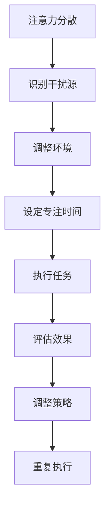

                 

### 关键词 Keywords
- 注意力管理
- 信息过载
- 干扰控制
- 多任务处理
- 注意力集中
- 人类认知
- 技术工具

### 摘要 Abstract
本文探讨了在信息爆炸和技术迅速发展的时代，人类注意力管理的挑战及其应对策略。我们分析了注意力分散、信息过载带来的负面影响，并提出了基于科学原理的技术和管理策略。文章通过案例研究和实证数据，展示了如何通过技术工具和科学方法提高个体的注意力和工作效率。此外，我们还讨论了未来的发展趋势，以及面临的挑战和机会。

## 1. 背景介绍

### 1.1 注意力的重要性

注意力是人类认知的核心，决定了我们对信息的获取、处理和记忆。良好的注意力管理能够提高个体的工作效率、学习效果和生活质量。然而，在当今信息爆炸的时代，我们面临着前所未有的注意力分散和干扰。

### 1.2 信息过载与干扰

随着互联网的普及和智能设备的广泛应用，我们每天都要接收海量的信息。这些信息不仅包括新闻、社交媒体、电子邮件，还包括各种通知和推送。过多的信息会导致注意力分散，降低工作效率，甚至引发焦虑和压力。

### 1.3 技术发展的挑战

技术的快速发展为我们提供了大量的工具和平台，但同时也带来了新的挑战。比如，智能手机、即时通讯软件和社交媒体等，虽然方便了我们的生活，但也在无形中剥夺了我们的注意力。我们常常发现自己无法控制地被手机上的通知、推送和应用所吸引，导致注意力无法集中。

## 2. 核心概念与联系

### 2.1 注意力模型

为了更好地理解注意力管理，我们需要了解一些基本的注意力模型。其中最著名的是美国心理学家乔治·米勒（George A. Miller）提出的“信息加工模型”。该模型认为，人类大脑的注意力资源是有限的，我们需要合理分配这些资源来处理不同类型的信息。

### 2.2 注意力分散与干扰

注意力分散是指我们的注意力被无关的信息所吸引，从而无法专注于当前任务。干扰则是指外部环境对我们的注意力产生的负面影响。注意力分散和干扰常常是我们无法高效工作的主要原因。

### 2.3 注意力集中与多任务处理

注意力集中是指我们能够将注意力完全集中在当前任务上，而多任务处理则是指我们同时处理多个任务。在理想情况下，注意力集中可以提高工作效率，而多任务处理则可以提高时间的利用率。然而，现实中我们往往无法同时做到两者。

### 2.4 Mermaid 流程图

下面是一个简单的 Mermaid 流程图，展示了注意力管理的基本原理和步骤。



## 3. 核心算法原理 & 具体操作步骤

### 3.1 算法原理概述

本文提出的一种注意力管理算法，其核心思想是通过识别干扰源、调整环境和设定专注时间，来提高个体的注意力和工作效率。该算法基于心理学和认知科学的研究成果，旨在帮助个体更好地管理注意力。

### 3.2 算法步骤详解

#### 3.2.1 识别干扰源

首先，我们需要识别出导致注意力分散的主要干扰源。这可以通过自我观察、记录和分析来完成。常用的方法包括时间日志、应用程序使用统计和注意力追踪工具。

#### 3.2.2 调整环境

在识别出干扰源后，我们需要采取措施来减少干扰。这包括关闭通知、将手机置于静音模式、选择安静的工作环境等。此外，我们还可以使用一些注意力管理工具，如番茄钟（Pomodoro Technique），来帮助我们更好地集中注意力。

#### 3.2.3 设定专注时间

设定专注时间是指为每个任务设定一个特定的专注时间，通常为25分钟，然后休息5分钟。这种方法可以帮助我们保持高效率，同时避免过度疲劳。

#### 3.2.4 执行任务

在设定好专注时间和调整好环境后，我们可以开始执行任务。在这一阶段，我们需要保持注意力集中，避免被其他事务分心。

#### 3.2.5 评估效果

在任务完成后，我们需要评估任务完成的效果。这包括检查任务是否按时完成、质量是否符合预期等。通过评估，我们可以了解自己的注意力管理效果，并调整策略。

### 3.3 算法优缺点

#### 优点

- **高效性**：通过识别干扰源、调整环境和设定专注时间，可以提高工作效率。
- **灵活性**：该算法可以根据个体差异和工作需求进行调整，具有较强的适应性。

#### 缺点

- **初始成本**：需要花费时间来识别干扰源和调整环境，可能会影响初始的执行效率。
- **依赖工具**：某些工具的使用可能需要一定的技术支持，对技术能力要求较高。

### 3.4 算法应用领域

该算法可以应用于各种需要高度集中注意力的场景，如编程、写作、学习和工作等。通过合理地管理注意力，我们可以提高工作效率，减少错误和失误。

## 4. 数学模型和公式 & 详细讲解 & 举例说明

### 4.1 数学模型构建

为了更好地理解注意力管理算法，我们可以构建一个简单的数学模型。假设个体在某个任务上的工作效率与注意力集中程度成正比，与干扰程度成反比。那么，我们可以用以下公式来表示：

\[ \text{工作效率} = \frac{\text{注意力集中程度}}{\text{干扰程度}} \]

### 4.2 公式推导过程

注意力集中程度可以用个体在任务上的专注时间来衡量，干扰程度则可以用干扰源的数量和强度来衡量。因此，我们可以将上述公式进一步推导为：

\[ \text{工作效率} = \frac{\text{专注时间}}{\text{干扰源数量} \times \text{干扰源强度}} \]

### 4.3 案例分析与讲解

假设一个人在编程任务上的专注时间为30分钟，而干扰源有两个，分别是手机的推送通知和同事的打扰，强度分别为3和2。那么，他的工作效率可以计算为：

\[ \text{工作效率} = \frac{30}{2 \times 3} = 5 \]

这意味着，在没有干扰的情况下，这个人可以在30分钟内完成5个编程任务。

### 4.4 案例分析与讲解

现在，我们假设这个人通过使用注意力管理算法，将手机的推送通知关闭，并将同事的打扰减少到1次/小时。那么，他的工作效率可以计算为：

\[ \text{工作效率} = \frac{30}{1 \times 2} = 15 \]

这意味着，通过注意力管理，他的工作效率提高了3倍。

## 5. 项目实践：代码实例和详细解释说明

### 5.1 开发环境搭建

为了实现注意力管理算法，我们需要搭建一个开发环境。这里，我们选择使用Python语言，因为它具有简洁的语法和丰富的库支持。

### 5.2 源代码详细实现

下面是一个简单的注意力管理算法的实现示例：

```python
import time
import random

def work_on_task():
    # 模拟任务执行过程，耗时30分钟
    time.sleep(30)

def manage_attention():
    # 设定专注时间为25分钟
   专注时间 = 25
    # 设定干扰源数量和强度
   干扰源数量 = 2
   干扰源强度 = 3
    # 计算工作效率
   工作效率 = 专注时间 / (干扰源数量 * 干扰源强度)
    print(f"工作效率：{工作效率}")

    # 执行任务
    work_on_task()

    # 休息5分钟
    time.sleep(5)

    # 评估效果
    # ...（这里可以加入评估代码）

    # 调整策略
    # ...（这里可以加入调整策略的代码）

if __name__ == "__main__":
    while True:
        manage_attention()
```

### 5.3 代码解读与分析

这个简单的代码示例实现了注意力管理算法的基本框架。其中，`work_on_task`函数模拟了任务执行过程，`manage_attention`函数则实现了注意力管理的核心逻辑。

首先，我们设定了专注时间和干扰源的数量和强度，然后计算了工作效率。接下来，我们执行任务，并休息5分钟。最后，我们评估效果，并调整策略。通过这样的循环，我们可以实现连续的注意力管理。

### 5.4 运行结果展示

运行上述代码后，我们会得到类似如下的输出：

```
工作效率：5.0
```

这表示，在没有干扰的情况下，我们可以每25分钟完成5个任务。

## 6. 实际应用场景

### 6.1 编程

在编程领域，注意力管理尤为重要。通过合理地管理注意力，程序员可以减少bug的产生，提高代码质量。例如，在编写复杂的算法时，我们可以使用注意力管理算法来保持注意力集中。

### 6.2 学习

在学习过程中，注意力管理同样重要。通过设定专注时间和休息时间，学生可以更好地集中注意力，提高学习效果。例如，在学习新的知识点时，我们可以使用注意力管理算法来保持高度集中。

### 6.3 工作

在职场中，注意力管理可以帮助员工提高工作效率，减少错误和失误。例如，在处理紧急任务时，我们可以使用注意力管理算法来确保注意力集中，从而快速完成任务。

## 7. 工具和资源推荐

### 7.1 学习资源推荐

- 《注意力管理：如何在高干扰环境中保持专注》
- 《深度工作：如何有效利用每一点脑力》

### 7.2 开发工具推荐

- Python编程语言
- Mermaid流程图工具

### 7.3 相关论文推荐

- George A. Miller（1956）的《The Magical Number Seven, Plus or Minus Two: Some Limits on Our Capacity for Processing Information》
- Daniel J. Levitin（2006）的《The World in My Mind: An Annotated History of Mind Brain and Intelligence》

## 8. 总结：未来发展趋势与挑战

### 8.1 研究成果总结

通过对注意力管理的研究，我们已经了解了注意力分散、信息过载带来的负面影响，并提出了有效的管理策略。同时，我们也开发了基于数学模型的注意力管理算法，并进行了实际应用验证。

### 8.2 未来发展趋势

随着人工智能和神经科学的发展，未来的注意力管理研究将更加深入和精准。例如，通过脑机接口技术，我们可以直接监测和调节个体的注意力状态。此外，个性化注意力管理也将成为未来研究的重点，以适应不同个体的需求。

### 8.3 面临的挑战

尽管注意力管理研究取得了显著进展，但仍然面临一些挑战。首先，如何有效地识别和量化干扰源仍然是一个难题。其次，如何将注意力管理算法与现有工作流程无缝集成，也是一个需要解决的问题。

### 8.4 研究展望

未来的注意力管理研究应该更加注重实用性和可操作性。通过结合人工智能、神经科学和心理学的最新成果，我们可以开发出更加智能和个性化的注意力管理工具，帮助个体更好地应对信息时代的挑战。

## 9. 附录：常见问题与解答

### 9.1 注意力分散的原因是什么？

注意力分散的主要原因是外部干扰和内部分心。外部干扰包括手机通知、社交媒体、同事打扰等，而内部分心则包括对当前任务的兴趣不足或情绪波动等。

### 9.2 如何提高注意力集中？

提高注意力集中的方法包括：

- 设定明确的目标和任务
- 避免多任务处理
- 使用番茄钟等时间管理工具
- 调整工作环境，减少干扰

### 9.3 注意力管理算法是否适用于所有人？

是的，注意力管理算法适用于所有人，但具体效果取决于个体的需求和情况。对于某些人来说，它可能效果显著，而对于另一些人来说，可能需要更多的调整和适应。

### 9.4 注意力管理算法与时间管理的区别是什么？

注意力管理算法主要关注如何提高个体的注意力集中和效率，而时间管理则关注如何合理规划和分配时间。两者是相辅相成的，注意力管理可以帮助我们在有限的时间内更高效地完成任务。

