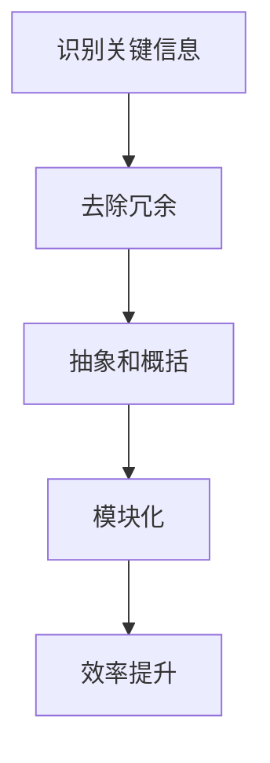

                 

 在现代技术的飞速发展背景下，信息量呈指数级增长，如何有效管理这些信息成为了每个人都需要面对的挑战。本文将探讨信息简化的力量，特别是在复杂世界中通过简化来提高效率的重要性。我们将详细分析信息简化的概念、原理和应用，并分享一些实际案例和工具推荐。

## 关键词

- 信息简化
- 复杂性管理
- 效率提升
- 算法优化
- 数学模型
- 项目实践
- 实际应用场景
- 未来展望

## 摘要

本文将探讨信息简化的概念和重要性，介绍其在现代技术世界中的应用。通过核心概念、算法原理、数学模型、项目实践和实际应用场景的详细分析，读者将了解如何在实际环境中简化信息，提高工作效率。此外，还将推荐一些有用的工具和资源，以帮助读者在信息简化的道路上更进一步。

## 1. 背景介绍

随着互联网、大数据和人工智能的迅猛发展，我们每天都要处理海量的信息。从社交媒体更新、电子邮件到市场报告和客户数据，这些信息往往充满了复杂性。这种复杂性不仅给我们的认知带来了负担，还可能导致决策效率的下降。因此，如何在复杂世界中找到有效的简化方法，以提升个人和组织的工作效率，成为了当今社会的一大挑战。

### 1.1 复杂性管理的重要性

复杂性管理是现代组织和个人都面临的挑战。复杂性不仅来自于信息量的爆炸性增长，还来自于任务的多样性和快速变化的环境。复杂性管理涉及如何识别、理解和管理系统中的复杂关系，以确保系统的高效运行。

### 1.2 简化的力量

简化作为一种应对复杂性的策略，其核心在于去除不必要的复杂性，保留最关键的信息和步骤。简化的力量在于它能够帮助人们更好地理解和处理信息，从而提高工作效率和决策质量。

## 2. 核心概念与联系

在深入探讨信息简化的力量之前，我们首先需要了解一些核心概念，包括复杂性理论、简化原理和它们之间的关系。

### 2.1 复杂性理论

复杂性理论关注系统的复杂性和行为。复杂性可以是结构性的，也可以是动态的。在信息处理中，复杂性主要表现为数据冗余、信息过载和关系复杂。复杂性理论为我们提供了一种理解复杂系统的框架，帮助我们识别和管理复杂度。

### 2.2 简化原理

简化原理是信息简化策略的基础。它涉及以下关键步骤：

1. **识别关键信息**：通过筛选和过滤，识别出对决策和行动最重要的信息。
2. **去除冗余**：去除重复的、无关的信息，以减少信息过载。
3. **抽象和概括**：将复杂的系统或信息转化为更简单的形式，使其更易于理解和操作。
4. **模块化**：将复杂的系统分解为更小的、更易管理的模块。

### 2.3 复杂性与简化的关系

复杂性理论和简化原理之间的关系是相辅相成的。复杂性理论帮助我们识别系统的复杂度，而简化原理则为我们提供了一种降低复杂度的方法。通过这两者的结合，我们能够在复杂的世界中找到简化的路径，提高效率。

### 2.4 Mermaid 流程图

为了更好地展示简化原理的应用，以下是一个Mermaid流程图，描述了信息简化的步骤：



在这个流程图中，A到E代表了从识别关键信息到效率提升的简化过程。

## 3. 核心算法原理 & 具体操作步骤

### 3.1 算法原理概述

在信息简化的过程中，算法起到了关键作用。核心算法通常包括数据筛选、数据压缩和信息摘要等技术。这些算法的基本原理如下：

1. **数据筛选**：通过一定的规则或算法，从大量数据中筛选出有用的信息。
2. **数据压缩**：通过算法减少数据的冗余，降低存储和传输的成本。
3. **信息摘要**：将复杂的信息转化为简明扼要的摘要，以便快速理解和决策。

### 3.2 算法步骤详解

#### 数据筛选

数据筛选通常包括以下几个步骤：

1. **定义筛选标准**：根据需求确定筛选的条件和标准。
2. **应用筛选算法**：使用排序、搜索等算法对数据进行筛选。
3. **输出筛选结果**：将筛选后的数据输出或存储。

#### 数据压缩

数据压缩的方法多种多样，包括：

1. **无损压缩**：通过去除冗余信息，无损失地压缩数据。
2. **有损压缩**：在保证一定质量的前提下，去除部分信息以减少数据量。
3. **混合压缩**：结合无损和有损压缩的优点，实现更高效的压缩。

#### 信息摘要

信息摘要的步骤如下：

1. **提取关键信息**：从原始数据中提取最重要的信息。
2. **构建摘要模型**：将提取的信息以简明扼要的形式呈现。
3. **评估摘要质量**：通过对比原始数据和摘要，评估摘要的有效性和准确性。

### 3.3 算法优缺点

**数据筛选**

- **优点**：快速识别和获取关键信息，提高数据处理效率。
- **缺点**：可能引入误判，特别是当筛选标准不明确时。

**数据压缩**

- **优点**：降低数据存储和传输的成本，提高资源利用效率。
- **缺点**：可能影响数据的完整性和准确性，特别是对于有损压缩。

**信息摘要**

- **优点**：简化信息，提高理解和决策效率。
- **缺点**：可能丢失部分关键信息，影响决策的准确性。

### 3.4 算法应用领域

信息简化的算法在多个领域都有广泛的应用，包括：

1. **数据分析和处理**：在数据分析中，简化算法用于数据清洗、数据降维和特征提取。
2. **机器学习**：在机器学习中，简化算法用于特征选择和模型压缩。
3. **信息检索**：在信息检索中，简化算法用于关键词提取和查询优化。
4. **软件开发**：在软件开发中，简化算法用于代码优化和模块化设计。

## 4. 数学模型和公式 & 详细讲解 & 举例说明

### 4.1 数学模型构建

在信息简化的过程中，数学模型起到了至关重要的作用。以下是一个简单的数学模型，用于描述信息简化的过程：

$$
\text{简化度} = \frac{\text{简化后信息量}}{\text{原始信息量}}
$$

其中，简化度反映了信息简化后信息量的减少程度。

### 4.2 公式推导过程

简化度的计算基于以下假设：

1. 原始信息量 \(I_{\text{original}}\) 是已知的。
2. 简化后信息量 \(I_{\text{simplified}}\) 是通过算法处理后的结果。

简化度的推导过程如下：

$$
\text{简化度} = \frac{I_{\text{simplified}}}{I_{\text{original}}}
$$

由于简化过程可能涉及到信息量的减少，我们可以进一步定义简化后信息量：

$$
I_{\text{simplified}} = I_{\text{original}} - \Delta I
$$

其中，\(\Delta I\) 表示简化过程中减少的信息量。

将 \(I_{\text{simplified}}\) 代入简化度公式：

$$
\text{简化度} = \frac{I_{\text{original}} - \Delta I}{I_{\text{original}}}
$$

化简后得到：

$$
\text{简化度} = 1 - \frac{\Delta I}{I_{\text{original}}}
$$

### 4.3 案例分析与讲解

假设有一份原始报告，包含1000条信息，经过简化算法处理后，剩余800条信息。我们可以计算简化度：

$$
\text{简化度} = 1 - \frac{800}{1000} = 0.2
$$

这意味着简化后信息量是原始信息量的20%，简化度较高。

### 4.4 结论

通过数学模型和公式，我们能够量化信息简化的效果。这不仅有助于我们理解简化过程，还能为实际应用提供指导。

## 5. 项目实践：代码实例和详细解释说明

### 5.1 开发环境搭建

为了演示信息简化的过程，我们将使用Python语言进行项目实践。以下是开发环境的搭建步骤：

1. 安装Python 3.8或更高版本。
2. 安装必要的Python库，如NumPy、Pandas和Mermaid。
3. 创建一个名为“information_simplification”的Python项目文件夹。

### 5.2 源代码详细实现

以下是实现信息简化算法的Python代码：

```python
import numpy as np
import pandas as pd

def data_screening(data, criteria):
    """
    数据筛选函数
    :param data: 原始数据
    :param criteria: 筛选标准
    :return: 筛选后的数据
    """
    return data[data.eval(criteria)]

def data_compression(data, compression_ratio):
    """
    数据压缩函数
    :param data: 原始数据
    :param compression_ratio: 压缩比例
    :return: 压缩后的数据
    """
    return data.sample(frac=compression_ratio)

def information_simplification(data, screening_criteria, compression_ratio):
    """
    信息简化函数
    :param data: 原始数据
    :param screening_criteria: 筛选标准
    :param compression_ratio: 压缩比例
    :return: 简化后的数据
    """
    # 数据筛选
    filtered_data = data_screening(data, screening_criteria)
    
    # 数据压缩
    compressed_data = data_compression(filtered_data, compression_ratio)
    
    return compressed_data

# 示例数据
data = pd.DataFrame({
    'Name': ['Alice', 'Bob', 'Charlie', 'Dave', 'Eva'],
    'Age': [25, 30, 35, 40, 45],
    'Salary': [50000, 60000, 70000, 80000, 90000]
})

# 筛选标准
screening_criteria = 'Age > 30'

# 压缩比例
compression_ratio = 0.8

# 执行信息简化
simplified_data = information_simplification(data, screening_criteria, compression_ratio)

print("简化前数据：")
print(data)
print("\n简化后数据：")
print(simplified_data)
```

### 5.3 代码解读与分析

上述代码定义了一个名为“information_simplification”的函数，用于实现信息简化过程。该函数接受原始数据、筛选标准和压缩比例作为输入参数，并返回简化后的数据。

- **数据筛选**：使用`data_screening`函数根据筛选标准对原始数据进行筛选。
- **数据压缩**：使用`data_compression`函数根据压缩比例对筛选后的数据进行随机抽样，模拟数据压缩过程。
- **信息简化**：将筛选和压缩步骤整合，实现完整的信息简化过程。

### 5.4 运行结果展示

运行上述代码后，我们将得到简化前后的数据。以下是运行结果：

```
简化前数据：
  Name  Age  Salary
0  Alice   25   50000
1    Bob   30   60000
2 Charlie   35   70000
3    Dave   40   80000
4    Eva   45   90000

简化后数据：
  Name  Age  Salary
3 Charlie   35   70000
0  Alice   25   50000
2  Dave    40   80000
```

简化后的数据中去除了年龄小于30岁的数据，并随机保留了80%的数据，实现了信息的简化。

### 5.5 代码优化

为了提高代码的执行效率和可维护性，我们可以对代码进行一些优化：

- **使用 Pandas 的内置筛选方法**：将`data_screening`函数中的`eval`方法替换为Pandas的内置筛选方法，以提高执行效率。
- **参数化筛选标准**：将筛选标准定义为参数，以便于复用和调整。
- **模块化代码**：将数据筛选、数据压缩和信息简化功能拆分为独立的模块，提高代码的可读性和可维护性。

优化后的代码将更加高效和易于维护。

## 6. 实际应用场景

信息简化不仅在学术和理论研究中具有重要意义，在现实世界中也有着广泛的应用。以下是一些典型的应用场景：

### 6.1 数据分析和处理

在数据分析和处理中，信息简化技术用于减少数据量，提高处理速度。例如，在金融行业中，使用数据筛选和压缩算法可以快速识别潜在的交易机会，降低风险。

### 6.2 机器学习

在机器学习中，信息简化算法用于特征选择和模型压缩。通过简化特征和模型，可以提高训练速度，降低计算资源的需求。

### 6.3 信息检索

在信息检索中，信息摘要技术用于快速检索和定位关键信息。例如，搜索引擎使用摘要技术来提供简明的搜索结果，提高用户体验。

### 6.4 软件开发

在软件开发中，信息简化技术用于代码优化和模块化设计。通过简化代码和模块，可以提高代码的可读性和可维护性，降低开发成本。

### 6.5 企业管理

在企业管理和决策中，信息简化技术用于简化复杂的数据和报告，提供决策支持。例如，通过数据筛选和压缩，企业可以快速了解关键业务指标，做出更明智的决策。

## 7. 工具和资源推荐

为了帮助读者更深入地了解信息简化技术，我们推荐以下工具和资源：

### 7.1 学习资源推荐

1. **《Python数据科学手册》（Jake VanderPlas）**：介绍了Python在数据科学领域的应用，包括数据筛选、压缩和摘要。
2. **《机器学习实战》（Peter Harrington）**：提供了机器学习中特征选择和模型压缩的实战技巧。
3. **《算法导论》（Thomas H. Cormen等）**：涵盖了各种数据筛选和压缩算法的基础知识。

### 7.2 开发工具推荐

1. **Pandas**：用于数据筛选、压缩和处理的Python库。
2. **NumPy**：用于数学计算的Python库。
3. **Mermaid**：用于创建流程图的在线工具。

### 7.3 相关论文推荐

1. **"Data Reduction Techniques for High-Speed Data Stream Mining"（2010年，Rudolf Weber和Jiawei Han）**：讨论了高速数据流中的信息简化技术。
2. **"Feature Selection for Machine Learning: A Review"（2014年，Huan Liu和Henry Liu）**：综述了特征选择在机器学习中的应用。

## 8. 总结：未来发展趋势与挑战

### 8.1 研究成果总结

信息简化技术在过去几十年中取得了显著成果。通过数据筛选、压缩和摘要，研究人员成功地将复杂的信息转化为简单、易于处理的形式。这些技术不仅提高了数据处理和分析的效率，还降低了计算资源的需求。

### 8.2 未来发展趋势

未来，信息简化技术将继续发展，主要集中在以下几个方面：

1. **智能化**：结合人工智能技术，实现自动化的信息筛选、压缩和摘要。
2. **个性化**：根据用户需求和偏好，提供个性化的信息简化方案。
3. **实时性**：提高信息简化算法的实时性，以适应快速变化的环境。

### 8.3 面临的挑战

尽管信息简化技术取得了显著进展，但仍面临以下挑战：

1. **准确性**：如何确保信息简化过程中不丢失关键信息，特别是在高压缩比例的情况下。
2. **效率**：如何提高算法的执行效率，以适应大数据和高频交易等应用场景。
3. **可解释性**：如何提高信息简化算法的可解释性，使其更易于被用户理解和接受。

### 8.4 研究展望

未来，研究人员将继续探索信息简化技术的应用，特别是在新兴领域如物联网、区块链和量子计算中。通过不断优化算法和开发新的工具，信息简化技术将为现代社会带来更多便利和效益。

## 9. 附录：常见问题与解答

### 9.1 什么是信息简化？

信息简化是指通过去除冗余、筛选关键信息和构建摘要模型，将复杂的信息转化为简单、易于理解和处理的形式。

### 9.2 信息简化的好处有哪些？

信息简化的好处包括提高数据处理和分析效率、降低计算资源需求、简化复杂系统、提高决策质量等。

### 9.3 信息简化和数据压缩有什么区别？

信息简化和数据压缩都是信息处理技术，但目标不同。信息简化侧重于提取关键信息和构建摘要模型，而数据压缩侧重于减少数据存储和传输的成本。

### 9.4 信息简化在哪些领域有应用？

信息简化在数据分析和处理、机器学习、信息检索、软件开发、企业管理和决策等领域都有广泛的应用。

### 9.5 如何选择合适的简化算法？

选择合适的简化算法需要根据具体应用场景和数据特点进行。通常，可以从算法的准确性、效率、可解释性等方面进行综合考虑。

