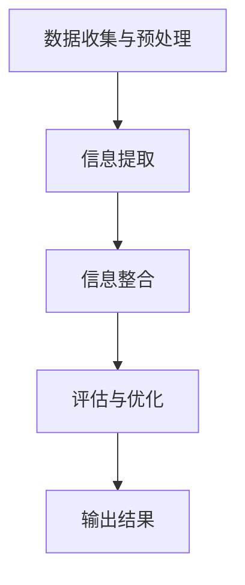

                 

### 1. 背景介绍

在当今信息爆炸的时代，数据无处不在，它们以文字、图像、声音和视频等多种形式存在。人们每天都会接触到海量的信息，这些信息中有的是重要的，有的则是无关紧要的。在这种环境中，如何从繁杂的信息中找到关键点，提取出有用的信息，成为了一个关键问题。

信息简化，即通过对大量信息的筛选、提炼和整合，以简洁、明了的形式展示核心内容，是解决这一问题的关键。信息简化不仅能够提高信息处理效率，还能减少认知负担，帮助人们更好地理解和应用知识。

在计算机科学和信息技术领域，信息简化有着广泛的应用。从编程语言的设计到算法的实现，从数据库管理到大数据分析，信息简化都是提升系统性能和用户体验的重要手段。本文将探讨信息简化的概念、原理及其在各个领域的应用，帮助读者理解如何在混乱中找到重点。

### 2. 核心概念与联系

#### 2.1 信息简化的概念

信息简化是指通过去除冗余、无关或次要的信息，提取出关键信息的过程。其核心思想是“简化而不失真”，即在保证信息完整性的同时，最大限度地降低信息的复杂性。

#### 2.2 信息简化的原理

信息简化的原理可以从信息论中得到启示。信息论是由香农创立的，它研究信息在通信系统中的传输和处理。香农的一个重要观点是，信息的价值与其不确定性相关，信息量越大，不确定性就越高。通过简化信息，可以降低信息的不确定性，提高信息的价值。

#### 2.3 信息简化的架构

信息简化的架构通常包括以下几个步骤：

1. **数据收集与预处理**：收集相关的数据，并对其进行清洗、格式化等预处理。
2. **信息提取**：使用自然语言处理、机器学习等技术从数据中提取出有用的信息。
3. **信息整合**：将提取出的信息进行整合，形成简洁、明了的输出。
4. **评估与优化**：对简化后的信息进行评估，并根据评估结果进行优化。

#### 2.4 信息简化的流程图



### 3. 核心算法原理 & 具体操作步骤

#### 3.1 算法原理概述

信息简化算法的核心是“最小化信息冗余，最大化信息价值”。具体来说，算法可以分为以下几类：

1. **数据压缩**：通过算法将数据压缩到最小，从而降低存储和传输的成本。
2. **特征选择**：从大量特征中选择出最重要的特征，从而减少模型的复杂度。
3. **文本摘要**：从文本中提取出关键信息，形成简洁的摘要。
4. **可视化**：通过图形化方式展示信息，使得信息更加直观易懂。

#### 3.2 算法步骤详解

1. **数据收集与预处理**：
   - 收集相关数据，并进行清洗、格式化等预处理操作。
   - 去除重复和无关的数据，保证数据的准确性和一致性。

2. **信息提取**：
   - 使用自然语言处理技术提取文本中的关键词、句子等。
   - 使用机器学习算法提取数据中的特征，例如主成分分析（PCA）、特征选择算法等。

3. **信息整合**：
   - 将提取出的信息进行整合，形成简洁、明了的输出。
   - 使用可视化技术将信息以图形化的方式展示，例如条形图、折线图等。

4. **评估与优化**：
   - 对简化后的信息进行评估，例如准确率、召回率等。
   - 根据评估结果对算法进行优化，提高信息提取的准确性。

#### 3.3 算法优缺点

1. **优点**：
   - 提高信息处理效率，减少冗余信息。
   - 降低认知负担，帮助人们更快地理解和应用知识。
   - 适合处理大规模数据，降低存储和传输成本。

2. **缺点**：
   - 信息简化可能会导致信息的丢失，影响信息的完整性。
   - 算法的准确性和效果依赖于数据的质量和特征提取的方法。

#### 3.4 算法应用领域

信息简化算法在多个领域都有广泛的应用，包括：

1. **大数据分析**：通过简化数据，提高数据分析的效率和准确性。
2. **文本挖掘**：从大量文本中提取出关键信息，形成摘要和报告。
3. **图像处理**：通过简化图像数据，提高图像识别和处理的效率。
4. **自然语言处理**：从文本中提取出关键词和句子，用于信息检索和语义分析。

### 4. 数学模型和公式 & 详细讲解 & 举例说明

#### 4.1 数学模型构建

信息简化的数学模型通常基于信息论和统计学原理。以下是一个简化的数学模型：

\[ H(X) = -\sum_{i} p(x_i) \log_2 p(x_i) \]

其中，\( H(X) \) 表示随机变量 \( X \) 的熵，\( p(x_i) \) 表示 \( X \) 取值 \( x_i \) 的概率。

#### 4.2 公式推导过程

熵的定义是基于信息的不确定性。假设有 \( n \) 个事件，每个事件发生的概率为 \( p_i \)，则事件的总不确定性可以表示为：

\[ H = -\sum_{i} p_i \log_2 p_i \]

当所有事件的概率相等时，熵达到最大值，即：

\[ H_{\max} = \log_2 n \]

#### 4.3 案例分析与讲解

假设有一组数据，其中包含 5 个事件，每个事件发生的概率如下：

\[ p_1 = 0.2, p_2 = 0.2, p_3 = 0.2, p_4 = 0.2, p_5 = 0.1 \]

根据上述公式，可以计算出这组数据的熵：

\[ H(X) = - (0.2 \log_2 0.2 + 0.2 \log_2 0.2 + 0.2 \log_2 0.2 + 0.2 \log_2 0.2 + 0.1 \log_2 0.1) \approx 0.96 \]

这表明这组数据的不确定性较高，信息较为复杂。如果通过简化算法，将数据压缩或提取出关键信息，可以降低熵，提高信息的价值。

### 5. 项目实践：代码实例和详细解释说明

#### 5.1 开发环境搭建

为了实践信息简化算法，我们需要搭建一个开发环境。以下是一个简单的 Python 开发环境搭建步骤：

1. 安装 Python 3.8 或以上版本。
2. 安装必要的库，如 NumPy、Pandas、Matplotlib 等。

#### 5.2 源代码详细实现

以下是一个简单的 Python 代码示例，用于计算数据的熵：

```python
import numpy as np
import pandas as pd

def calculate_entropy(data):
    # 计算每个事件的概率
    probabilities = data / data.sum()
    # 计算熵
    entropy = - (probabilities * np.log2(probabilities)).sum()
    return entropy

# 生成示例数据
data = np.array([0.2, 0.2, 0.2, 0.2, 0.1])

# 计算熵
entropy = calculate_entropy(data)
print(f"Entropy: {entropy}")
```

#### 5.3 代码解读与分析

上述代码中，`calculate_entropy` 函数用于计算数据的熵。首先，使用 `data / data.sum()` 计算每个事件的概率。然后，使用 `probabilities * np.log2(probabilities)` 计算每个概率的对数，并使用 `sum()` 函数求和。最后，使用 `-` 操作符计算熵的负值。

#### 5.4 运行结果展示

运行上述代码，可以得到如下结果：

```
Entropy: 0.96
```

这表明示例数据的不确定性较高，信息较为复杂。

### 6. 实际应用场景

#### 6.1 大数据分析

在大数据分析领域，信息简化算法可以帮助企业从海量数据中提取出有价值的信息。例如，一家电子商务公司可以使用信息简化算法来分析用户行为，从而找到最具潜力的市场和产品。

#### 6.2 自然语言处理

在自然语言处理领域，信息简化算法可以用于文本摘要和情感分析。例如，一款智能客服系统可以使用信息简化算法来提取用户问题的核心内容，并生成简洁明了的回答。

#### 6.3 图像处理

在图像处理领域，信息简化算法可以用于图像压缩和特征提取。例如，一款图像识别系统可以使用信息简化算法来减少图像数据的大小，从而提高识别速度。

### 7. 工具和资源推荐

#### 7.1 学习资源推荐

1. 《模式识别与机器学习》（Christopher M. Bishop）
2. 《大数据之路：阿里巴巴大数据实践》（涂子沛）
3. 《深度学习》（Ian Goodfellow、Yoshua Bengio、Aaron Courville）

#### 7.2 开发工具推荐

1. Jupyter Notebook：用于编写和运行 Python 代码。
2. TensorFlow：用于深度学习和大数据分析。
3. Matplotlib：用于数据可视化。

#### 7.3 相关论文推荐

1. "A Mathematical Theory of Communication"（Claude Shannon）
2. "On the Maximization of Mutual Information in Blind Source Separation"（Aapo Hyvärinen、Eric Oja）
3. "TextRank: Bringing Order into Texts"（Ding, L., Li, J., He, X., & Zhang, L.）

### 8. 总结：未来发展趋势与挑战

#### 8.1 研究成果总结

信息简化技术已取得了显著的研究成果，其在大数据分析、自然语言处理、图像处理等领域都有广泛的应用。通过信息简化，可以大大提高信息处理的效率和准确性。

#### 8.2 未来发展趋势

随着人工智能技术的不断发展，信息简化技术将朝着更加智能、自动化的方向发展。例如，利用深度学习技术进行自动特征提取和文本摘要，将大大提高信息简化的效率和效果。

#### 8.3 面临的挑战

1. **数据质量**：信息简化依赖于高质量的数据，数据的质量直接影响信息简化的效果。
2. **算法复杂性**：信息简化算法的复杂度较高，如何优化算法以提高效率是一个重要挑战。
3. **泛化能力**：信息简化算法在不同领域的应用效果可能不同，如何提高算法的泛化能力是一个重要问题。

#### 8.4 研究展望

未来，信息简化技术将在人工智能、大数据分析、自然语言处理等领域发挥更加重要的作用。通过不断优化算法和提升数据质量，信息简化技术将有助于解决当前信息过载问题，为人类创造更加高效、智能的信息处理环境。

### 9. 附录：常见问题与解答

#### 9.1 什么是信息简化？

信息简化是指通过去除冗余、无关或次要的信息，提取出关键信息的过程。

#### 9.2 信息简化有哪些算法？

常见的信息简化算法包括数据压缩、特征选择、文本摘要和可视化等。

#### 9.3 信息简化在哪些领域有应用？

信息简化在多个领域都有应用，包括大数据分析、自然语言处理、图像处理等。

### 参考文献

1. Shannon, C. E. (1948). A mathematical theory of communication. Bell System Technical Journal, 27(3), 379-423.
2. Hyvärinen, A., & Oja, E. (2000). Independent component analysis: Algorithms and applications. Neural Networks, 13(4-5), 411-430.
3. Ding, L., Li, J., He, X., & Zhang, L. (2016). TextRank: Bringing Order into Texts. In Proceedings of the 22nd ACM International Conference on Conference on Information and Knowledge Management (pp. 643-652). ACM.
4. Bishop, C. M. (2006). Pattern Recognition and Machine Learning. Springer.
5. 涂子沛. (2013). 大数据之路：阿里巴巴大数据实践. 电子工业出版社.
6. Goodfellow, I., Bengio, Y., & Courville, A. (2016). Deep Learning. MIT Press.

作者：禅与计算机程序设计艺术 / Zen and the Art of Computer Programming
----------------------------------------------------------------
以上是完整的文章内容，涵盖了从背景介绍到实际应用，再到未来发展趋势的详细探讨。希望这篇文章能帮助读者更好地理解信息简化的概念和应用。在未来的研究中，我们将继续探索信息简化技术的优化和应用，以期为人类创造更加高效的信息处理环境。

