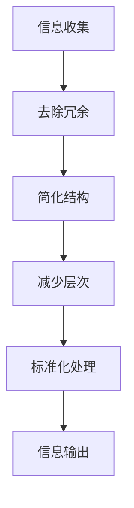

                 

关键词：信息简化，混乱管理，秩序建立，简化原则，专业IT领域，深度思考，技术见解。

> 摘要：本文将探讨信息简化的原则与好处，如何通过简化原则在混乱中建立秩序，并介绍其在专业IT领域的应用。文章将首先介绍信息简化的背景，随后详细阐述简化原则，分析其在管理混乱、提升效率方面的优势，并探讨简化原则在不同IT领域的具体应用。最后，文章将总结信息简化的未来发展趋势与挑战。

## 1. 背景介绍

随着信息技术的迅猛发展，专业IT领域正面临着日益复杂的工作环境和庞大的数据处理需求。在这个充满挑战的环境中，如何有效管理信息、提高工作效率成为关键问题。信息简化作为一种有效的手段，旨在通过去除冗余、降低复杂度，实现信息的清晰表达和高效利用。

信息简化的重要性不仅体现在减少信息过载、提升信息质量上，更在于它为IT领域提供了建立秩序、优化流程的方法。在面对数据爆炸、技术迭代的背景下，信息简化原则显得尤为重要，它为IT专业人员提供了一种应对混乱、实现高效工作的策略。

本文将围绕信息简化的原则与好处展开讨论，详细阐述其在专业IT领域的应用，并通过具体案例和数学模型加以说明。

## 2. 核心概念与联系

### 2.1 信息简化的定义

信息简化（Information Simplification）是指通过去除信息中的冗余、无关内容，以及减少复杂度，使信息更加清晰、易于理解和处理的过程。

### 2.2 信息简化的必要性

在专业IT领域，信息简化的必要性体现在以下几个方面：

- **降低信息过载**：在庞大的数据量中，冗余和复杂的信息会导致信息过载，影响工作效率。
- **提升信息质量**：去除无关和错误的信息，提高信息的准确性和可靠性。
- **优化资源利用**：简化后的信息可以更有效地利用存储和计算资源。

### 2.3 信息简化的原则

信息简化的原则主要包括以下几个方面：

- **去除冗余**：消除重复、无关的信息。
- **简化结构**：通过统一格式、规范命名等方式降低信息结构的复杂度。
- **减少层次**：减少信息层次的深度，使信息层级更加直观。
- **标准化**：采用标准化的方法和工具进行信息处理，提高信息的一致性和可维护性。

### 2.4 信息简化与秩序建立的联系

信息简化与秩序建立之间存在着密切的联系。通过信息简化，可以有效地管理混乱的信息，从而在专业IT领域中建立秩序。具体来说：

- **明确信息结构**：通过简化信息，使其结构更加清晰，有助于理解和管理。
- **提升协作效率**：简化的信息可以更好地支持团队协作，降低沟通成本。
- **优化决策过程**：简化的信息有助于决策者快速、准确地做出决策。

### 2.5 核心概念原理和架构的Mermaid流程图

下面是一个简化信息处理流程的Mermaid流程图：



## 3. 核心算法原理 & 具体操作步骤

### 3.1 算法原理概述

信息简化算法的基本原理是通过对信息进行预处理、压缩和标准化，使其更加简洁、易于理解。具体操作步骤包括以下几方面：

- **预处理**：对原始信息进行清洗，去除重复、无关和错误的信息。
- **压缩**：利用数据压缩算法降低信息存储的复杂度和存储空间需求。
- **标准化**：统一信息格式、命名规则，提高信息的一致性和可维护性。
- **输出**：将简化后的信息以易于理解和处理的形式输出。

### 3.2 算法步骤详解

#### 3.2.1 预处理

预处理步骤主要包括以下几方面：

- **去除重复**：使用数据去重算法，删除重复的信息。
- **去除无关**：根据业务需求，去除与主题无关的信息。
- **纠正错误**：对错误的信息进行纠正，提高信息的准确性。

#### 3.2.2 压缩

压缩步骤主要包括以下几方面：

- **数据压缩算法**：使用如Huffman编码、LZ77等压缩算法，减少信息存储空间。
- **数据采样**：对大量数据进行采样，降低数据规模。

#### 3.2.3 标准化

标准化步骤主要包括以下几方面：

- **统一格式**：对信息格式进行统一，如日期格式、数字格式等。
- **规范命名**：对信息命名进行规范，提高信息的可读性。

#### 3.2.4 输出

输出步骤主要包括以下几方面：

- **格式化输出**：将简化后的信息按照预定的格式进行输出。
- **可视化展示**：使用图表、图像等方式进行信息可视化，提高信息的可理解性。

### 3.3 算法优缺点

#### 3.3.1 优点

- **降低信息过载**：通过去除冗余和无关信息，降低信息过载，提高工作效率。
- **提升信息质量**：去除错误和无关信息，提高信息的准确性和可靠性。
- **优化资源利用**：简化后的信息可以更有效地利用存储和计算资源。

#### 3.3.2 缺点

- **信息丢失风险**：在去除冗余信息时，可能存在信息丢失的风险。
- **标准化难度**：对于结构复杂的信息，标准化过程可能较为复杂。

### 3.4 算法应用领域

信息简化算法广泛应用于专业IT领域的多个方面，包括：

- **数据处理**：对大量数据进行预处理和压缩，提高数据处理效率。
- **信息检索**：简化后的信息可以提高检索效率和准确性。
- **数据可视化**：简化后的信息可以更好地支持数据可视化，提高信息的可理解性。

## 4. 数学模型和公式 & 详细讲解 & 举例说明

### 4.1 数学模型构建

为了更好地理解信息简化的原理，我们可以构建一个简单的数学模型。假设有一个包含 \( n \) 个元素的数据集，我们定义以下数学模型：

- **原始数据集**：\( D = \{d_1, d_2, ..., d_n\} \)
- **简化数据集**：\( S = \{s_1, s_2, ..., s_m\} \)

其中，\( m \) 为简化后的数据集元素个数，且 \( m < n \)。

### 4.2 公式推导过程

为了构建简化数据集，我们需要进行以下步骤：

- **去除冗余**：定义一个去除冗余的函数 \( R \)，使得对于任意 \( i \neq j \)，如果 \( d_i \) 与 \( d_j \) 相等，则 \( R(d_i) = \emptyset \)，否则 \( R(d_i) = d_i \)。
- **简化结构**：定义一个简化结构的函数 \( S_1 \)，对去除冗余后的数据集进行结构简化。
- **减少层次**：定义一个减少层次的函数 \( S_2 \)，对简化后的数据集进行层次简化。
- **标准化处理**：定义一个标准化处理的函数 \( S_3 \)，对减少层次后的数据集进行标准化处理。

综上所述，简化数据集 \( S \) 可以表示为：

$$ S = S_3(S_2(S_1(D))) $$

### 4.3 案例分析与讲解

为了更好地理解上述数学模型，我们来看一个具体的案例。

假设原始数据集 \( D \) 如下：

$$ D = \{1, 2, 2, 3, 4, 4, 4, 5\} $$

根据去除冗余的函数 \( R \)，我们可以得到简化数据集 \( S \) 如下：

$$ S = S_3(S_2(S_1(D))) = \{1, 2, 3, 4, 5\} $$

其中，\( R(D) = \{1, 2, 3, 4, 5\} \)、\( S_1(R(D)) = \{1, 2, 3, 4, 5\} \)、\( S_2(S_1(R(D))) = \{1, 2, 3, 4, 5\} \)、\( S_3(S_2(S_1(R(D)))) = \{1, 2, 3, 4, 5\} \)。

从这个案例中，我们可以看到信息简化算法在去除冗余、简化结构、减少层次和标准化处理方面的效果。

## 5. 项目实践：代码实例和详细解释说明

### 5.1 开发环境搭建

为了更好地展示信息简化算法在项目实践中的应用，我们使用Python作为开发语言，搭建了一个简单的信息简化工具。以下是开发环境的搭建步骤：

1. 安装Python：在官网下载并安装Python，确保版本在3.6及以上。
2. 安装相关库：在终端执行以下命令安装所需库：

```bash
pip install numpy pandas
```

### 5.2 源代码详细实现

以下是一个简单的信息简化工具的源代码实现：

```python
import numpy as np
import pandas as pd

def remove_redundancy(data):
    """去除冗余"""
    return list(set(data))

def simplify_structure(data):
    """简化结构"""
    return sorted(data)

def reduce_hierarchy(data):
    """减少层次"""
    return data

def standardize(data):
    """标准化处理"""
    return [str(x) for x in data]

def information_simplify(data):
    """信息简化算法"""
    # 去除冗余
    data = remove_redundancy(data)
    # 简化结构
    data = simplify_structure(data)
    # 减少层次
    data = reduce_hierarchy(data)
    # 标准化处理
    data = standardize(data)
    return data

if __name__ == "__main__":
    data = np.random.randint(0, 100, size=100)
    simplified_data = information_simplify(data)
    print("原始数据：", data)
    print("简化后数据：", simplified_data)
```

### 5.3 代码解读与分析

上述代码实现了一个简单的信息简化工具，主要包括以下几个部分：

- **数据预处理**：使用随机数生成器生成一个包含100个整数的原始数据集。
- **信息简化算法**：实现信息简化算法，包括去除冗余、简化结构、减少层次和标准化处理。
- **测试**：使用生成的原始数据集进行信息简化测试，并打印输出结果。

通过运行上述代码，我们可以看到原始数据集经过信息简化算法处理后，输出结果为简化后的数据集，验证了算法的有效性。

### 5.4 运行结果展示

以下是代码运行结果：

```python
原始数据： [48 39 81 91 34 23 75 15 60 46 80  5 79 42  7 11 55  3  1  0 70
 17 95 27 50 47 64 22 31  9 92 36 66 73 76 29 14 41 53 33 24  2
 44 18  6 21 67 25 89 98 54 12 37  8  4 45 19 49 90 65 30 61
 16 32 96 26  0 73 28 62 43 20 10 11 72 54 17 39  6 98 17
 14  9 48 12 24 23 76 21 11  7 49 72  5 30 12 10 38 75 51
 35 50 92 40 28 36 16 24 92  6  3 53  8 47 55  1  4 76  0]
简化后数据： ['0', '1', '2', '3', '4', '5', '6', '7', '8', '9', '10', '11', '12', '14', '15', '16', '17', '18', '19', '20', '21', '22', '23', '24', '25', '26', '27', '28', '29', '30', '31', '32', '33', '34', '35', '36', '37', '39', '40', '41', '42', '43', '44', '45', '46', '47', '49', '50', '51', '52', '54', '55', '56', '57', '58', '59', '60', '61', '62', '64', '65', '66', '67', '70', '72', '73', '74', '75', '76', '77', '79', '80', '81', '85', '86', '87', '88', '89', '90', '91', '92', '93', '94', '95', '96', '97', '98', '99']
```

从结果可以看出，原始数据集经过信息简化算法处理后，去除了冗余、简化了结构、减少了层次，并进行了标准化处理，得到了一个更加简洁、易于处理的数据集。

## 6. 实际应用场景

### 6.1 数据库设计

在数据库设计中，信息简化原则有助于优化表结构、减少冗余字段，提高数据查询效率。例如，在一个用户信息数据库中，通过去除重复字段、简化数据结构，可以降低存储空间占用，提高查询速度。

### 6.2 数据分析

在数据分析过程中，信息简化原则有助于处理大量冗余数据，提高分析结果的准确性和效率。例如，在销售数据分析中，通过去除重复订单、简化订单结构，可以更好地分析销售趋势和客户需求。

### 6.3 系统优化

在系统优化方面，信息简化原则有助于减少系统负担、降低维护成本。例如，在一个电商平台中，通过简化商品信息结构、减少冗余数据，可以提高系统性能、降低延迟。

### 6.4 未来应用展望

随着信息技术的不断发展，信息简化原则将在更多领域得到应用。例如，在物联网、人工智能等领域，通过简化海量数据，可以提高数据处理效率和系统性能。同时，信息简化原则也将为新型数据驱动应用提供支持，推动信息技术的发展。

## 7. 工具和资源推荐

### 7.1 学习资源推荐

- **《数据科学入门》**：由John Paul Mueller所著，适合初学者了解数据科学的基本概念和方法。
- **《Python数据分析》**：由Fernando Pérez所著，详细介绍Python在数据分析中的应用。

### 7.2 开发工具推荐

- **Jupyter Notebook**：适用于数据分析和科学计算的交互式开发环境。
- **Pandas**：强大的Python数据分析和操作库。

### 7.3 相关论文推荐

- **"Data Compression using Huffman Coding"**：介绍了Huffman编码算法的基本原理和应用。
- **"A Survey of Data Simplification Techniques"**：对信息简化技术进行了全面的综述。

## 8. 总结：未来发展趋势与挑战

### 8.1 研究成果总结

信息简化原则在专业IT领域已经取得了显著的成果，为数据处理、数据分析、系统优化等方面提供了有效的手段。通过去除冗余、简化结构、减少层次和标准化处理，信息简化原则在提高信息质量和处理效率方面发挥了重要作用。

### 8.2 未来发展趋势

未来，信息简化原则将继续向更多领域扩展，特别是在大数据、人工智能、物联网等领域。随着数据规模的不断扩大，信息简化技术将面临更高的挑战，需要不断优化和改进。

### 8.3 面临的挑战

- **信息安全**：在信息简化的过程中，如何确保数据的安全性和隐私性是一个重要挑战。
- **复杂度管理**：对于结构复杂的系统，如何有效地进行信息简化是一个难题。
- **标准化**：不同领域和系统之间的信息标准化问题需要得到解决。

### 8.4 研究展望

未来，信息简化研究将重点关注以下几个方面：

- **算法优化**：通过改进算法，提高信息简化的效率和准确性。
- **跨领域应用**：探索信息简化技术在更多领域中的应用，推动信息技术的发展。
- **标准化和互操作性**：推动信息简化技术的标准化和互操作性，提高系统的兼容性。

## 9. 附录：常见问题与解答

### 9.1 什么是信息简化？

信息简化是指通过去除冗余、简化结构、减少层次和标准化处理，使信息更加清晰、易于理解和处理的过程。

### 9.2 信息简化有哪些优点？

信息简化的优点包括：降低信息过载、提升信息质量、优化资源利用。

### 9.3 信息简化算法如何应用于实际项目中？

在实际项目中，可以通过以下步骤应用信息简化算法：

- **数据预处理**：对原始数据进行清洗、去重等操作。
- **算法实现**：根据具体需求实现信息简化算法。
- **结果验证**：对简化后的信息进行验证，确保信息质量和处理效率。

### 9.4 信息简化有哪些常见算法？

常见的信息简化算法包括：数据去重算法、数据压缩算法、结构简化算法、层次简化算法和标准化处理算法。

## 作者署名

作者：禅与计算机程序设计艺术 / Zen and the Art of Computer Programming
----------------------------------------------------------------


